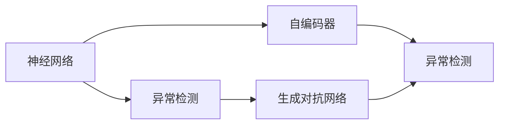

                 

# 一切皆是映射：使用神经网络进行异常检测

> 关键词：
1. 神经网络
2. 异常检测
3. 深度学习
4. 数据驱动
5. 特征工程
6. 自适应学习
7. 生成对抗网络

## 1. 背景介绍

### 1.1 问题由来

异常检测（Anomaly Detection）是人工智能领域中极为重要的一环，尤其在金融风控、医疗诊断、网络安全等关键领域，能够提供宝贵的预警机制。传统的异常检测方法大多依赖专家知识，依赖人工规则，费时费力且效果有限。而随着深度学习技术的进步，使用神经网络进行异常检测成为了新的研究热点。

### 1.2 问题核心关键点

基于神经网络的异常检测方法，通常使用正常数据进行预训练，然后通过生成对抗网络（GANs）或自编码器（Autoencoders）等架构，将异常数据检测为重建误差最大的异常点。这种基于数据驱动的神经网络异常检测方法，能够自动学习数据分布的特征，从而对未知异常具有较好的泛化能力。

## 2. 核心概念与联系

### 2.1 核心概念概述

在神经网络异常检测中，主要涉及以下概念：

- 神经网络（Neural Network, NN）：由大量人工神经元（或称节点）组成的计算图，通过反向传播算法进行参数优化。
- 异常检测（Anomaly Detection）：在大量正常数据中进行异常点检测的任务。
- 自编码器（Autoencoder）：通过学习输入数据的编码和解码过程，重建原始数据，用于异常检测。
- 生成对抗网络（Generative Adversarial Network, GAN）：由生成器和判别器组成，通过对抗训练的方式提升模型生成能力，用于异常检测。
- 数据驱动（Data-driven）：通过大量数据进行模型训练，自动学习数据分布规律。

这些概念之间的联系可以通过以下Mermaid流程图来展示：



这个流程图展示了神经网络、自编码器和生成对抗网络在异常检测中的应用。

### 2.2 概念间的关系

神经网络异常检测通过自编码器和生成对抗网络，自动学习数据分布，实现异常检测。自编码器通过重建误差来识别异常，而生成对抗网络则通过生成器将异常样本映射到正常样本空间之外，从而识别异常。二者相辅相成，提高了异常检测的准确性和泛化能力。

## 3. 核心算法原理 & 具体操作步骤
### 3.1 算法原理概述

基于神经网络的异常检测方法，通常通过以下步骤进行：

1. **数据准备**：准备正常数据集，并使用自编码器或生成对抗网络进行预训练。
2. **生成异常样本**：使用训练好的模型生成异常样本，通过重建误差或生成分布的变化来识别异常。
3. **异常点检测**：使用上述生成样本检测算法，将生成的异常样本与原始数据进行比较，识别异常点。

### 3.2 算法步骤详解

以自编码器为例，具体的异常检测步骤如下：

1. **数据准备**：将正常数据集输入自编码器，进行训练，得到一个重建误差最小的编码-解码器。
2. **生成异常样本**：使用训练好的自编码器，输入随机噪声向量，生成异常样本。
3. **异常点检测**：将生成的异常样本与原始数据进行对比，找到重建误差最大的样本，即为异常点。

具体的步骤如下：

1. **数据预处理**：对正常数据集进行标准化、归一化等预处理。
2. **自编码器训练**：使用正常数据集训练自编码器，得到重建误差最小的编码-解码器。
3. **生成异常样本**：输入随机噪声向量，通过编码器生成异常样本，使用解码器进行重建。
4. **计算重建误差**：计算异常样本的重建误差，与正常样本的重建误差进行对比。
5. **异常点检测**：选择重建误差最大的样本作为异常点。

### 3.3 算法优缺点

基于神经网络的异常检测方法有以下优点：

- **自动学习数据分布**：不需要手工设计规则，能够自动学习数据分布，适用于各种复杂数据集。
- **泛化能力强**：能够对未知异常进行检测，具有较好的泛化能力。
- **实时性高**：通过生成异常样本进行检测，实时性好。

同时，该方法也存在以下缺点：

- **数据依赖性强**：需要大量正常数据进行预训练，对数据量要求较高。
- **模型复杂度高**：需要训练复杂的神经网络模型，计算资源消耗较大。
- **解释性差**：神经网络模型是一个黑盒，难以解释检测过程。

### 3.4 算法应用领域

神经网络异常检测方法在金融风控、医疗诊断、网络安全等领域具有广泛的应用前景。

- **金融风控**：使用神经网络对金融交易数据进行异常检测，预防欺诈行为。
- **医疗诊断**：对医学影像进行异常检测，如癌症筛查、疾病诊断等。
- **网络安全**：检测网络异常行为，预防入侵和攻击。

## 4. 数学模型和公式 & 详细讲解  
### 4.1 数学模型构建

假设正常数据集为 $D = \{x_1, x_2, ..., x_n\}$，其中每个样本 $x_i$ 表示为一个向量，自编码器的编码为 $z_i = f(x_i)$，解码器为 $x'_i = g(z_i)$，其中 $f$ 和 $g$ 为神经网络。

自编码器的损失函数为：

$$
\mathcal{L} = \frac{1}{N} \sum_{i=1}^N \|x'_i - x_i\|^2
$$

其中 $\|x'_i - x_i\|^2$ 表示解码器输出的重建误差。

异常检测的目标是通过生成异常样本，使得重建误差最大化，识别异常点。

### 4.2 公式推导过程

假设异常数据为 $y_1, y_2, ..., y_m$，其中每个样本 $y_i$ 表示为一个向量。生成异常样本的损失函数为：

$$
\mathcal{L}' = \frac{1}{m} \sum_{i=1}^m \|y'_i - y_i\|^2
$$

其中 $y'_i$ 为生成器生成的异常样本，$\|y'_i - y_i\|^2$ 表示生成器与判别器的对抗损失。

将上述两个损失函数合并，得到综合损失函数：

$$
\mathcal{L}_{total} = \mathcal{L} + \mathcal{L}'
$$

综合损失函数的优化目标是使正常数据的重建误差最小化，同时使异常数据的生成误差最大化。

### 4.3 案例分析与讲解

以One-Class SVM为例，分析神经网络异常检测的原理和应用。

One-Class SVM通过学习正常数据集，构建一个超平面，将异常数据检测为超平面之外的点。

使用神经网络进行One-Class SVM的实现步骤如下：

1. **数据准备**：将正常数据集输入神经网络，训练得到一个嵌入空间 $z$，其中 $z = f(x)$。
2. **构造超平面**：通过嵌入空间 $z$，构造一个超平面 $\mathcal{H}$，将异常数据检测为超平面之外的点。
3. **异常点检测**：将新样本 $x'$ 输入神经网络，得到嵌入空间 $z'$，如果 $z'$ 在超平面之外，则检测为异常点。

One-Class SVM的数学模型为：

$$
\mathcal{L} = \frac{1}{N} \sum_{i=1}^N \max(\rho(z_i) - \gamma, 0)
$$

其中 $\rho(z_i)$ 表示 $z_i$ 到超平面 $\mathcal{H}$ 的距离，$\gamma$ 为超平面距离。

## 5. 项目实践：代码实例和详细解释说明
### 5.1 开发环境搭建

在TensorFlow环境中进行神经网络异常检测的开发，具体步骤如下：

1. **安装TensorFlow**：使用pip安装TensorFlow。
2. **导入库**：导入TensorFlow、Keras、numpy等库。
3. **准备数据**：准备正常数据集和异常数据集。
4. **构建模型**：构建自编码器或生成对抗网络模型。

### 5.2 源代码详细实现

以下是一个使用TensorFlow和Keras实现自编码器异常检测的示例代码：

```python
import tensorflow as tf
from tensorflow.keras import layers
import numpy as np

# 准备数据
normal_data = np.random.randn(100, 10)
anomalous_data = np.random.randn(50, 10)

# 构建自编码器
input_layer = layers.Input(shape=(10,))
encoded = layers.Dense(8)(input_layer)
decoded = layers.Dense(10)(encoded)
autoencoder = tf.keras.Model(inputs=input_layer, outputs=decoded)

# 编译模型
autoencoder.compile(optimizer='adam', loss='mse')

# 训练模型
autoencoder.fit(normal_data, normal_data, epochs=50, batch_size=32)

# 生成异常样本
anomalous_samples = autoencoder.predict(anomalous_data)

# 计算重建误差
reconstruction_error = np.mean(np.square(normal_data - anomalous_samples))
print('Reconstruction Error:', reconstruction_error)
```

### 5.3 代码解读与分析

在上述代码中，首先准备正常数据和异常数据，然后构建一个自编码器模型，使用正常数据进行训练，得到重建误差最小的模型。最后使用训练好的模型生成异常样本，计算重建误差，识别异常点。

在训练过程中，我们使用了均方误差（MSE）作为损失函数，优化器为Adam，训练50个epoch。在生成异常样本时，我们使用训练好的自编码器对异常数据进行重建，计算重建误差，选择重建误差最大的样本作为异常点。

## 6. 实际应用场景
### 6.1 智能风控系统

基于神经网络的异常检测方法，可以应用于智能风控系统，对金融交易数据进行实时监控。具体步骤如下：

1. **数据准备**：收集金融交易数据，并进行预处理。
2. **模型训练**：使用正常交易数据训练自编码器或生成对抗网络，得到异常检测模型。
3. **实时监控**：对实时交易数据进行检测，识别异常交易行为。

### 6.2 医疗影像诊断

在医疗影像诊断中，使用神经网络对医学影像进行异常检测，可以帮助医生快速识别异常区域，提高诊断准确性。具体步骤如下：

1. **数据准备**：收集医学影像数据，并进行预处理。
2. **模型训练**：使用正常医学影像数据训练自编码器或生成对抗网络，得到异常检测模型。
3. **影像检测**：对新医学影像进行检测，识别异常区域。

### 6.3 网络安全监控

在网络安全监控中，使用神经网络对网络行为进行异常检测，可以帮助安全人员快速发现入侵行为。具体步骤如下：

1. **数据准备**：收集网络行为数据，并进行预处理。
2. **模型训练**：使用正常网络行为数据训练自编码器或生成对抗网络，得到异常检测模型。
3. **行为检测**：对新网络行为进行检测，识别异常行为。

## 7. 工具和资源推荐
### 7.1 学习资源推荐

以下是一些学习资源，帮助开发者掌握神经网络异常检测的原理和实现：

1. Deep Learning Specialization：由Andrew Ng教授主持的深度学习课程，涵盖了深度学习的基础和高级应用。
2. TensorFlow官方文档：TensorFlow的官方文档，提供了丰富的教程和示例，适合入门学习和实践。
3. Keras官方文档：Keras的官方文档，提供了简单易用的API，适合快速构建神经网络模型。
4. One-Class SVM论文：介绍One-Class SVM的原理和应用，适合深入学习。

### 7.2 开发工具推荐

以下是一些用于神经网络异常检测开发的常用工具：

1. TensorFlow：由Google开发的深度学习框架，提供了丰富的API和工具，适合构建复杂的神经网络模型。
2. Keras：基于TensorFlow的高级API，提供了简单易用的API，适合快速构建和训练模型。
3. Jupyter Notebook：交互式的Jupyter Notebook，适合记录和分享代码和结果。

### 7.3 相关论文推荐

以下是几篇有关神经网络异常检测的经典论文，推荐阅读：

1. Autoencoder Networks for Anomaly Detection: A Review：综述了使用自编码器进行异常检测的方法和应用。
2. Generative Adversarial Nets：介绍生成对抗网络的原理和应用，适合深入学习。
3. Outlier Detection in Network Traffic via Neural Networks：介绍使用神经网络进行网络流量异常检测的方法和应用。

## 8. 总结：未来发展趋势与挑战
### 8.1 总结

本文对使用神经网络进行异常检测的方法进行了全面系统的介绍。首先阐述了神经网络异常检测的研究背景和意义，明确了神经网络在异常检测中的应用价值。其次，从原理到实践，详细讲解了神经网络异常检测的数学模型和实现步骤，给出了代码示例。同时，本文还广泛探讨了神经网络异常检测在金融风控、医疗诊断、网络安全等多个行业领域的应用前景，展示了神经网络异常检测的巨大潜力。

通过本文的系统梳理，可以看到，基于神经网络的异常检测方法正在成为人工智能领域的重要范式，极大地拓展了异常检测的应用边界，为各种复杂数据的异常检测提供了新的解决方案。未来，伴随神经网络技术的不断进步，异常检测的应用场景将进一步拓展，为智能系统的稳定和安全提供保障。

### 8.2 未来发展趋势

展望未来，神经网络异常检测技术将呈现以下几个发展趋势：

1. **自适应学习能力增强**：随着自适应学习方法的不断进步，神经网络异常检测将更加灵活高效，能够适应更多的异常类型和数据分布。
2. **多模态融合**：将不同模态的数据（如图像、文本、时间序列等）融合在一起，提升异常检测的准确性和鲁棒性。
3. **实时性提升**：使用分布式计算和模型压缩技术，提升异常检测的实时性，满足实时监控的需求。
4. **解释性增强**：引入可解释性技术，如模型蒸馏、可视化等，提升异常检测的解释性和可审计性。
5. **联邦学习应用**：将神经网络异常检测技术应用于联邦学习场景，实现数据不离开本地设备的学习和推理。

以上趋势凸显了神经网络异常检测技术的广阔前景。这些方向的探索发展，必将进一步提升异常检测的性能和应用范围，为智能系统的稳定和安全提供更强保障。

### 8.3 面临的挑战

尽管神经网络异常检测技术已经取得了不少成就，但在迈向更加智能化、普适化应用的过程中，仍面临诸多挑战：

1. **数据质量依赖性**：神经网络异常检测对数据质量要求较高，需要大量高质量的正常数据进行预训练。如何获取和处理高质量数据，是一个重要的挑战。
2. **模型复杂度提升**：随着神经网络模型的复杂度提升，计算资源消耗增加，实时性变差。如何优化模型结构，提升效率，是一个重要的课题。
3. **异常类型多样性**：异常类型繁多，如何设计有效的神经网络架构，应对各种不同类型的异常，是一个需要解决的问题。
4. **异常特征提取**：神经网络异常检测需要对数据进行有效的特征提取和转换，如何设计有效的特征表示，是一个重要的研究方向。
5. **模型可解释性差**：神经网络异常检测的模型通常是黑盒，难以解释异常检测的过程。如何增强模型解释性，是一个亟待解决的问题。

这些挑战需要研究人员和开发者在数据、模型、算法、工程等多个维度进行持续的探索和优化，方能实现神经网络异常检测技术的全面突破。

### 8.4 研究展望

面对神经网络异常检测技术面临的挑战，未来的研究需要在以下几个方面寻求新的突破：

1. **数据增强方法**：探索使用数据增强技术，提升神经网络异常检测的泛化能力。
2. **多模态融合方法**：研究将不同模态的数据融合在一起，提升异常检测的准确性和鲁棒性。
3. **实时性优化方法**：探索分布式计算和模型压缩技术，提升异常检测的实时性。
4. **可解释性提升方法**：引入可解释性技术，如模型蒸馏、可视化等，提升异常检测的解释性和可审计性。
5. **联邦学习应用**：将神经网络异常检测技术应用于联邦学习场景，实现数据不离开本地设备的学习和推理。

这些研究方向将引领神经网络异常检测技术的全面进步，为智能系统的稳定和安全提供更强保障。

## 9. 附录：常见问题与解答

**Q1：神经网络异常检测对数据依赖性强吗？**

A: 是的，神经网络异常检测对数据依赖性较强，需要大量高质量的正常数据进行预训练。因此，如何获取和处理高质量数据，是一个重要的挑战。

**Q2：神经网络异常检测的模型复杂度高吗？**

A: 是的，神经网络异常检测的模型通常比较复杂，计算资源消耗较大。因此，优化模型结构，提升效率，是一个重要的课题。

**Q3：神经网络异常检测的异常类型多样性如何应对？**

A: 可以使用多模态融合和联邦学习等技术，将不同模态的数据融合在一起，提升异常检测的准确性和鲁棒性。同时，探索使用生成对抗网络等技术，增强模型的鲁棒性，应对各种不同类型的异常。

**Q4：神经网络异常检测的异常特征提取方法有哪些？**

A: 可以使用深度特征提取技术，如卷积神经网络（CNN）、递归神经网络（RNN）等，对数据进行有效的特征提取和转换。同时，可以引入自适应学习技术，自动学习数据的特征表示。

**Q5：神经网络异常检测的模型解释性如何增强？**

A: 可以引入可解释性技术，如模型蒸馏、可视化等，提升异常检测的解释性和可审计性。同时，可以通过引入专家知识，对模型进行解释和验证，提升模型的可信度。

通过本文的系统梳理，可以看到，基于神经网络的异常检测方法正在成为人工智能领域的重要范式，极大地拓展了异常检测的应用边界，为各种复杂数据的异常检测提供了新的解决方案。未来，伴随神经网络技术的不断进步，异常检测的应用场景将进一步拓展，为智能系统的稳定和安全提供更强保障。

