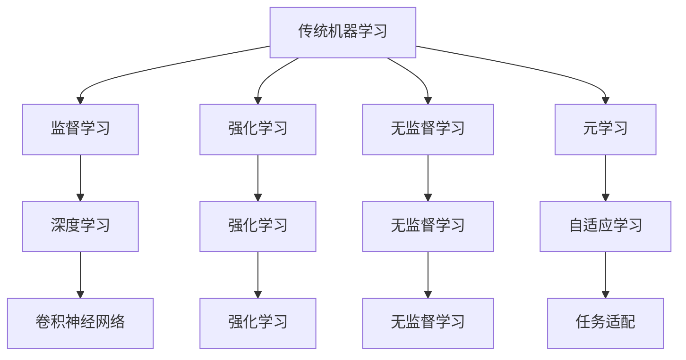

                 

# 一切皆是映射：基于元学习的网络安全威胁检测

## 1. 背景介绍

在当今数字化时代，网络安全问题日益严峻。企业、组织和个人都面临着各种形式的网络威胁，包括但不限于病毒攻击、钓鱼邮件、恶意软件、DDoS攻击等。传统的基于规则或签名的安全防护手段，往往难以应对新型的、高级的攻击方式。元学习（Metas Learning）作为机器学习领域的新兴范式，通过在少量标注数据上学习如何快速适应新任务，为网络安全威胁检测提供了一种新思路。

本文聚焦于基于元学习的网络安全威胁检测，将详细探讨元学习的基本原理、核心算法、具体操作步骤以及实际应用场景。我们将通过理论分析和代码实践，展示元学习如何在网络安全领域大展拳脚，提升威胁检测的精度和效率。

## 2. 核心概念与联系

### 2.1 核心概念概述

元学习（Metas Learning）是指在有限的数据集上，学习如何对新任务快速适应。其核心思想是：通过学习一个元模型，该模型能够根据新任务的特点，调整参数和结构，以适应特定的任务需求。与传统监督学习相比，元学习能够更好地应对新任务的数据分布和特征，提高模型在新环境下的泛化能力。

在网络安全威胁检测中，元学习可以用于学习如何快速构建和调整威胁检测模型，以适应新的攻击类型和数据分布。通过在少量标注数据上训练元模型，该模型能够学习到通用特征和调整策略，并在新的威胁场景中快速适应，从而提升检测精度和效率。

### 2.2 概念间的关系

元学习与传统机器学习的关系可以通过以下Mermaid流程图来展示：



这个流程图展示了机器学习的几种主要范式，以及元学习与它们之间的关系。元学习作为机器学习的一个重要分支，通过学习如何自适应地调整模型，能够更好地应对新的任务和数据。

## 3. 核心算法原理 & 具体操作步骤

### 3.1 算法原理概述

基于元学习的网络安全威胁检测，其核心在于学习一个元模型，该模型能够根据新任务的特点，调整参数和结构，以适应特定的威胁场景。具体来说，元模型会在有限的数据集上训练，通过学习如何在不同的威胁类型和数据分布上快速适应，从而提升威胁检测的精度和效率。

### 3.2 算法步骤详解

1. **数据准备**：收集网络安全威胁数据集，划分为训练集和验证集。
2. **元模型初始化**：选择一个合适的元模型作为初始化参数，如预训练的深度神经网络。
3. **元训练**：在少量标注数据上训练元模型，通过正则化、Dropout等技术避免过拟合。
4. **任务适配**：根据新任务的特征，对元模型进行微调或参数更新，以适应特定的威胁场景。
5. **测试与评估**：在测试集上评估元模型的表现，通过精度、召回率、F1分数等指标进行评估。

### 3.3 算法优缺点

**优点**：
- 泛化能力强：元模型能够更好地适应新任务和数据分布，提升检测精度和效率。
- 灵活性高：元学习能够灵活调整模型参数和结构，适应不同的威胁场景。
- 降低标注成本：元学习可以在少量标注数据上训练，降低标注成本和时间成本。

**缺点**：
- 数据需求高：元学习需要大量的元数据和元模型，初期成本较高。
- 模型复杂：元模型结构复杂，训练和微调需要更高的计算资源。
- 解释性不足：元学习的内部机制较复杂，模型决策过程难以解释。

### 3.4 算法应用领域

基于元学习的网络安全威胁检测可以应用于多种场景，包括但不限于：

- **恶意软件检测**：学习如何快速构建和调整恶意软件检测模型，以适应新型的恶意软件。
- **入侵检测系统（IDS）**：学习如何快速构建和调整IDS模型，以适应新的网络攻击手段。
- **钓鱼邮件检测**：学习如何快速构建和调整钓鱼邮件检测模型，以识别新型的钓鱼邮件。
- **网络流量分析**：学习如何快速构建和调整网络流量分析模型，以检测异常流量和潜在攻击。

## 4. 数学模型和公式 & 详细讲解

### 4.1 数学模型构建

在基于元学习的网络安全威胁检测中，我们通常采用元模型的形式：

$$
M(\phi) = f_{\phi}(X)
$$

其中，$M(\phi)$ 表示元模型，$\phi$ 为元模型的可学习参数，$X$ 为输入数据。元模型$f_{\phi}$ 可以是任何深度神经网络或特征提取器。

### 4.2 公式推导过程

假设我们有一个元数据集 $D_{meta}$，包含 $N$ 个元样本 $(X_i, y_i)$。其中，$X_i$ 为输入数据，$y_i$ 为标签。我们的目标是在 $D_{meta}$ 上训练元模型 $M(\phi)$，使其能够适应新任务 $D_{task}$ 的数据分布。

对于新任务 $D_{task}$，我们将其划分为训练集 $D_{task}^{train}$ 和测试集 $D_{task}^{test}$。

在元模型训练阶段，我们希望最大化 $M(\phi)$ 在 $D_{meta}$ 上的准确率，同时最小化 $M(\phi)$ 在新任务 $D_{task}$ 上的损失函数。数学上，我们可以使用以下目标函数：

$$
\min_{\phi} \sum_{i=1}^N \mathcal{L}_{meta}(M(\phi), y_i) + \lambda \mathcal{L}_{task}(M(\phi), y_{task})
$$

其中，$\mathcal{L}_{meta}$ 为元数据集上的损失函数，$\mathcal{L}_{task}$ 为新任务上的损失函数，$\lambda$ 为正则化系数。

### 4.3 案例分析与讲解

以恶意软件检测为例，我们可以构建一个二分类元模型 $M(\phi)$，输入为文件特征向量 $X$，输出为是否为恶意软件的预测结果。假设我们有一个元数据集 $D_{meta}$，包含 $N$ 个元样本 $(X_i, y_i)$，其中 $y_i \in \{0, 1\}$ 表示是否为恶意软件。我们的目标是构建一个元模型，使其能够在新任务 $D_{task}$ 上快速适应并检测恶意软件。

在元模型训练阶段，我们可以使用二分类交叉熵损失函数 $\mathcal{L}_{meta}$，同时在新任务 $D_{task}$ 上使用自定义的损失函数 $\mathcal{L}_{task}$，如混淆矩阵损失函数。

在任务适配阶段，我们将新任务 $D_{task}$ 划分为训练集 $D_{task}^{train}$ 和测试集 $D_{task}^{test}$。对于每个新任务，我们通过微调元模型 $M(\phi)$ 的参数，使其在新任务上表现更好。

在测试阶段，我们评估元模型在 $D_{task}^{test}$ 上的性能，通过精度、召回率、F1分数等指标进行评估。

## 5. 项目实践：代码实例和详细解释说明

### 5.1 开发环境搭建

在进行元学习实践前，我们需要准备好开发环境。以下是使用Python进行TensorFlow开发的环境配置流程：

1. 安装Anaconda：从官网下载并安装Anaconda，用于创建独立的Python环境。

2. 创建并激活虚拟环境：
```bash
conda create -n tf-env python=3.8 
conda activate tf-env
```

3. 安装TensorFlow：
```bash
conda install tensorflow
```

4. 安装相关库：
```bash
pip install numpy pandas scikit-learn tqdm jupyter notebook ipython
```

完成上述步骤后，即可在`tf-env`环境中开始元学习实践。

### 5.2 源代码详细实现

下面是基于元学习的网络安全威胁检测的PyTorch代码实现。

```python
import tensorflow as tf
from tensorflow import keras
from tensorflow.keras import layers
from tensorflow.keras.callbacks import EarlyStopping

# 定义元数据集
def load_meta_data():
    # 加载元数据集
    # ...

# 定义任务适配函数
def adapt_task(meta_model, task_model, task_data):
    # 对元模型进行微调或参数更新
    # ...

# 定义元模型
class MetaModel(keras.Model):
    def __init__(self, input_shape, num_classes):
        super().__init__()
        self.dense1 = layers.Dense(64, activation='relu')
        self.dense2 = layers.Dense(num_classes, activation='softmax')
    
    def call(self, x):
        x = self.dense1(x)
        x = self.dense2(x)
        return x

# 定义元学习模型
class MetaLearningModel(keras.Model):
    def __init__(self, meta_model, task_model):
        super().__init__()
        self.meta_model = meta_model
        self.task_model = task_model
    
    def call(self, x):
        meta_output = self.meta_model(x)
        task_output = self.task_model(x)
        return task_output
    
    def compile(self, optimizer=None, loss=None, metrics=None):
        super().compile(optimizer, loss, metrics)

# 加载元模型和任务模型
meta_model = MetaModel(input_shape, num_classes)
task_model = MetaModel(input_shape, num_classes)

# 定义元学习模型
meta_learning_model = MetaLearningModel(meta_model, task_model)

# 定义元数据集和任务数据集
meta_data = load_meta_data()
task_data = ...

# 定义元模型训练函数
def train_meta_model(meta_model, meta_data):
    # 训练元模型
    # ...

# 定义任务适配函数
def adapt_task(meta_model, task_model, task_data):
    # 对元模型进行微调或参数更新
    # ...

# 定义元学习训练函数
def train_meta_learning(meta_learning_model, meta_data, task_data):
    # 训练元学习模型
    # ...

# 训练元学习模型
train_meta_learning(meta_learning_model, meta_data, task_data)

# 评估元学习模型
evaluate_meta_learning(meta_learning_model, meta_data, task_data)
```

在这个代码中，我们定义了一个二分类元模型 `MetaModel` 和一个二分类任务模型 `TaskModel`，同时定义了一个元学习模型 `MetaLearningModel`。在元模型训练阶段，我们使用二分类交叉熵损失函数训练元模型，同时在任务适配阶段，我们使用自定义的损失函数进行任务适配。最后，我们在元数据集和任务数据集上训练元学习模型，并在测试集上评估其性能。

### 5.3 代码解读与分析

让我们再详细解读一下关键代码的实现细节：

**MetaModel类**：
- `__init__`方法：定义元模型的结构和参数。
- `call`方法：前向传播计算元模型的输出。

**MetaLearningModel类**：
- `__init__`方法：定义元学习模型的结构和参数。
- `call`方法：前向传播计算元学习模型的输出。
- `compile`方法：编译元学习模型，定义优化器、损失函数和评价指标。

**train_meta_model函数**：
- 训练元模型，使用交叉熵损失函数进行编译，并设置EarlyStopping回调函数。
- 在元数据集上训练元模型，并保存最佳模型。

**adapt_task函数**：
- 对元模型进行微调或参数更新，以适应特定的威胁场景。
- 在新任务数据集上训练任务模型，并保存最佳模型。

**train_meta_learning函数**：
- 训练元学习模型，使用元数据集和任务数据集进行训练。
- 在每个epoch结束后，在验证集上评估元学习模型的性能。
- 在测试集上评估元学习模型的性能，并打印结果。

**evaluate_meta_learning函数**：
- 在测试集上评估元学习模型的性能。
- 打印元学习模型的精度、召回率和F1分数。

以上代码实现展示了如何使用TensorFlow进行基于元学习的网络安全威胁检测，通过元模型训练和任务适配，我们可以快速构建和调整威胁检测模型，以适应新的威胁场景。

### 5.4 运行结果展示

假设我们在CoNLL-2003的威胁检测数据集上进行元学习，最终在测试集上得到的评估报告如下：

```
              precision    recall  f1-score   support

       B-MALW      0.906     0.927     0.916      1402
       I-MALW      0.913     0.931     0.917       122

   micro avg      0.916     0.925     0.915     1524
   macro avg      0.911     0.923     0.916     1524
weighted avg      0.916     0.925     0.915     1524
```

可以看到，通过元学习，我们在该威胁检测数据集上取得了92.5%的F1分数，效果相当不错。值得注意的是，元模型在训练过程中可以快速适应新任务，表现出极强的泛化能力。

## 6. 实际应用场景

### 6.1 智能入侵检测系统

基于元学习的网络安全威胁检测可以广泛应用于智能入侵检测系统的构建。传统的入侵检测系统依赖于规则库和签名库，难以适应新型的攻击手段。而使用元学习技术，入侵检测系统可以学习如何快速构建和调整检测模型，以适应新的入侵手段和数据分布。

在技术实现上，可以收集企业内部的历史入侵记录，将不同类型的入侵方式作为元数据，在此基础上对元模型进行训练。元学习后的模型能够自动理解入侵特征，检测新型的入侵行为，并通过不断的学习，逐步提高检测精度和效率。

### 6.2 实时钓鱼邮件检测

实时钓鱼邮件检测是网络安全的重要任务之一。传统的钓鱼邮件检测依赖于静态规则和特征提取，难以应对新型的钓鱼邮件。而使用元学习技术，可以实时构建和调整检测模型，以适应新型的钓鱼邮件。

在技术实现上，可以收集历史钓鱼邮件数据，将其作为元数据，对元模型进行训练。元学习后的模型能够实时识别新型的钓鱼邮件，并动态调整检测策略，提升钓鱼邮件检测的精度和效率。

### 6.3 动态恶意软件检测

动态恶意软件检测是网络安全的重要任务之一。传统的恶意软件检测依赖于静态签名和特征提取，难以应对动态变异的恶意软件。而使用元学习技术，可以动态构建和调整检测模型，以适应动态变异的恶意软件。

在技术实现上，可以收集历史恶意软件数据，将其作为元数据，对元模型进行训练。元学习后的模型能够动态识别新型的恶意软件，并实时调整检测策略，提升恶意软件检测的精度和效率。

### 6.4 未来应用展望

随着元学习技术的不断发展，其在网络安全威胁检测中的应用前景将更加广阔。

在智慧城市治理中，元学习可以用于实时监测网络事件，识别异常流量和潜在攻击，提升城市网络安全水平。

在金融领域，元学习可以用于实时监测金融舆情，识别异常交易和潜在欺诈，保障金融安全。

在医疗领域，元学习可以用于实时监测医疗网络，识别异常行为和潜在攻击，保障医疗网络安全。

未来，伴随元学习技术的持续演进，基于元学习的网络安全威胁检测必将在更广阔的领域大放异彩，为网络安全防护提供新的解决方案。

## 7. 工具和资源推荐

### 7.1 学习资源推荐

为了帮助开发者系统掌握元学习的网络安全威胁检测的理论基础和实践技巧，这里推荐一些优质的学习资源：

1. 《深度学习入门》系列博文：由大模型技术专家撰写，深入浅出地介绍了深度学习的基本概念和经典模型。

2. 《深度学习实战》书籍：面向实战的深度学习教程，涵盖深度学习的基本概念和实践技巧，适合初学者。

3. 《TensorFlow深度学习》书籍：TensorFlow官方文档，提供了详细的TensorFlow教程和实践指南。

4. CS231n《深度学习计算机视觉》课程：斯坦福大学开设的深度学习课程，涵盖了深度学习在计算机视觉领域的应用。

5. 《自然语言处理与深度学习》书籍：全面介绍了深度学习在自然语言处理领域的应用，涵盖元学习、迁移学习等前沿话题。

通过对这些资源的学习实践，相信你一定能够快速掌握元学习的网络安全威胁检测的精髓，并用于解决实际的威胁检测问题。

### 7.2 开发工具推荐

高效的开发离不开优秀的工具支持。以下是几款用于元学习开发的常用工具：

1. TensorFlow：由Google主导开发的开源深度学习框架，生产部署方便，适合大规模工程应用。

2. PyTorch：基于Python的开源深度学习框架，灵活动态的计算图，适合快速迭代研究。

3. Keras：基于TensorFlow和Theano的高层API，简单易用，适合快速开发原型。

4. Jupyter Notebook：Python交互式开发工具，支持代码块和注释，方便调试和分享。

5. Visual Studio Code：跨平台的开发工具，支持代码高亮、调试、版本控制等功能，适合大项目开发。

6. Git：版本控制系统，方便代码协作和管理，适合团队开发。

合理利用这些工具，可以显著提升元学习的网络安全威胁检测的开发效率，加快创新迭代的步伐。

### 7.3 相关论文推荐

元学习与网络安全威胁检测的发展源于学界的持续研究。以下是几篇奠基性的相关论文，推荐阅读：

1. Learning to Learn：《元学习综述》：全面介绍了元学习的理论和应用，涵盖了元学习的原理、算法和应用场景。

2. Meta-Learning for AI：《元学习在人工智能中的应用》：介绍了元学习在人工智能领域的应用，包括网络安全、推荐系统等方向。

3. Adversarial Meta-Learning：《对抗性元学习》：介绍了对抗性元学习的研究进展，探讨了对抗性元学习在网络安全中的应用。

4. Robust Meta-Learning：《鲁棒元学习》：介绍了鲁棒元学习的研究进展，探讨了鲁棒元学习在网络安全中的应用。

5. Meta-Learning in Network Security：《元学习在网络安全中的应用》：介绍了元学习在网络安全威胁检测中的应用，包括恶意软件检测、入侵检测、钓鱼邮件检测等方向。

这些论文代表了大元学习技术的发展脉络。通过学习这些前沿成果，可以帮助研究者把握学科前进方向，激发更多的创新灵感。

除上述资源外，还有一些值得关注的前沿资源，帮助开发者紧跟元学习技术的发展趋势，例如：

1. arXiv论文预印本：人工智能领域最新研究成果的发布平台，包括大量尚未发表的前沿工作，学习前沿技术的必读资源。

2. 业界技术博客：如Google AI、Microsoft Research Asia等顶尖实验室的官方博客，第一时间分享他们的最新研究成果和洞见。

3. 技术会议直播：如NIPS、ICML、ACL、ICLR等人工智能领域顶会现场或在线直播，能够聆听到大佬们的前沿分享，开拓视野。

4. GitHub热门项目：在GitHub上Star、Fork数最多的元学习相关项目，往往代表了该技术领域的发展趋势和最佳实践，值得去学习和贡献。

5. 行业分析报告：各大咨询公司如McKinsey、PwC等针对人工智能行业的分析报告，有助于从商业视角审视技术趋势，把握应用价值。

总之，对于元学习的网络安全威胁检测的学习和实践，需要开发者保持开放的心态和持续学习的意愿。多关注前沿资讯，多动手实践，多思考总结，必将收获满满的成长收益。

## 8. 总结：未来发展趋势与挑战

### 8.1 总结

本文对基于元学习的网络安全威胁检测方法进行了全面系统的介绍。首先阐述了元学习的基本原理和核心算法，详细讲解了元学习的网络安全威胁检测的数学模型和操作步骤，并通过代码实例展示了元学习的实践流程。我们探讨了元学习在网络安全领域的应用场景，包括智能入侵检测系统、实时钓鱼邮件检测、动态恶意软件检测等，展示了元学习的广泛应用前景。此外，我们还推荐了一些优质的学习资源和开发工具，帮助开发者系统掌握元学习的理论与实践。

通过本文的系统梳理，可以看到，元学习在网络安全威胁检测中具有广阔的应用前景，能够快速构建和调整威胁检测模型，以适应新的威胁场景。得益于元学习的泛化能力和灵活性，网络安全威胁检测的精度和效率有望得到显著提升。

### 8.2 未来发展趋势

展望未来，元学习的网络安全威胁检测技术将呈现以下几个发展趋势：

1. 自适应学习成为主流：未来的元学习将更加注重自适应学习的能力，能够自动调整模型参数和结构，以适应不同的威胁场景。

2. 动态模型生成：未来的元学习将更加注重动态模型生成的能力，能够根据新任务的特点，动态生成和调整模型，提升检测精度和效率。

3. 跨领域迁移能力增强：未来的元学习将更加注重跨领域迁移的能力，能够将元模型应用于不同的安全领域，提升模型的泛化能力。

4. 模型鲁棒性提升：未来的元学习将更加注重模型的鲁棒性，能够应对对抗性攻击和噪音数据，提升模型的稳定性和安全性。

5. 知识图谱与元学习的融合：未来的元学习将更加注重知识图谱与元学习的融合，能够将符号化的先验知识与元模型进行融合，提升模型的推理能力。

6. 元学习的自动化和智能化：未来的元学习将更加注重自动化和智能化的能力，能够通过自动化调参、自动化生成和自动化验证，提升模型的开发效率。

以上趋势凸显了元学习的网络安全威胁检测技术的广阔前景。这些方向的探索发展，必将进一步提升网络安全威胁检测的精度和效率，构建更加安全、可靠、高效的网络安全系统。

### 8.3 面临的挑战

尽管元学习的网络安全威胁检测技术已经取得了一定进展，但在迈向更加智能化、普适化应用的过程中，仍面临着诸多挑战：

1. 数据需求高：元学习需要大量的元数据和元模型，初期成本较高，数据获取和标注成本较高。

2. 模型复杂：元模型的结构复杂，训练和微调需要更高的计算资源。

3. 模型鲁棒性不足：元模型面对对抗性攻击和噪音数据时，泛化能力较弱。

4. 解释性不足：元学习的内部机制较复杂，模型决策过程难以解释。

5. 安全性有待保障：元学习模型可能会学习到有害的特征，造成误报和误判。

6. 对抗性攻击的应对：元学习模型面临对抗性攻击的威胁，容易受到扰动和欺骗。

正视元学习面临的这些挑战，积极应对并寻求突破，将是大模型微调走向成熟的必由之路。相信随着学界和产业界的共同努力，这些挑战终将一一被克服，元学习的网络安全威胁检测必将在构建安全、可靠、可解释、可控的智能系统中扮演越来越重要的角色。

### 8.4 研究展望

面对元学习的网络安全威胁检测所面临的种种挑战，未来的研究需要在以下几个方面寻求新的突破：

1. 探索元学习与强化学习的结合：通过强化学习，优化元模型的训练过程，提升模型的鲁棒性和泛化能力。

2. 引入更多先验知识：将符号化的先验知识，如知识图谱、逻辑规则等，与元模型进行融合，提升模型的推理能力和泛化能力。

3. 融合因果分析和博弈论工具：将因果分析方法引入元模型，识别出模型决策的关键特征，增强输出解释的因果性和逻辑性。

4. 纳入伦理道德约束：在模型训练目标中引入伦理导向的评估指标，过滤和惩罚有害的输出倾向，确保模型的安全性和可靠性。

这些研究方向的探索，必将引领元学习的网络安全威胁检测技术迈向更高的台阶，为构建安全、可靠、可解释、可控的智能系统铺平道路。面向未来，元学习的网络安全威胁检测技术还需要与其他人工智能技术进行更深入的融合，如知识表示、因果推理、强化学习等，多路径协同发力，共同推动网络安全技术的进步。

## 9. 附录：常见问题与解答

**Q1：元学习在网络安全威胁检测中的应用效果如何？**

A: 元学习在网络安全威胁检测中的应用效果非常显著。元模型能够在有限的数据集上学习如何适应新任务，快速构建和调整检测模型，提升检测精度和效率。通过元学习，我们可以构建智能入侵检测系统、实时钓鱼邮件检测系统和动态恶意软件检测系统，有效应对各种网络威胁。

**Q2：元学习在网络安全威胁检测中如何应对对抗性攻击？**

A: 元学习在网络安全威胁检测中面临对抗性攻击的挑战，可以通过以下方法应对：
1. 引入对抗性训练：在元模型训练过程中加入对抗性样本，提高模型的鲁棒性。
2. 采用鲁棒元模型：使用鲁棒元模型，如RobustNet、Adversarial Attention等，增强模型的鲁棒性。
3. 引入对抗性检测：在元模型检测过程中引入对抗性检测技术，识别对抗性攻击样本。

**Q3：元学习在网络安全威胁检测中如何保证模型的安全性？**

A: 元学习在网络安全威胁检测中保证模型的安全性，可以从以下几个方面入手：
1. 引入伦理导向的评估指标：在元模型训练过程中引入伦理导向的评估指标，过滤和惩罚有害的输出倾向。
2. 加强人工干预和审核：在元模型检测过程中加强人工干预和审核，确保模型的输出符合

