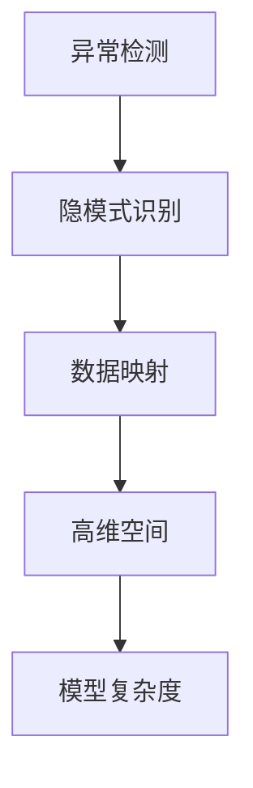
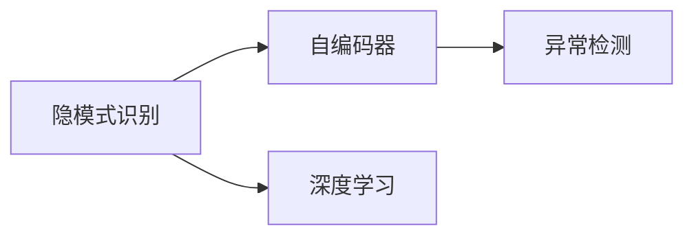
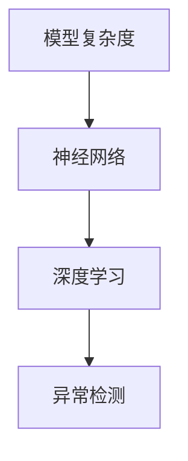
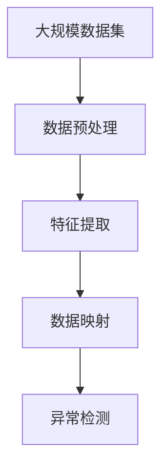

                 

# 一切皆是映射：异常检测：AI捕捉隐藏模式

> 关键词：异常检测, 隐模式, AI, 映射, 数据科学, 机器学习

## 1. 背景介绍

### 1.1 问题由来

在现代数据科学中，异常检测是一个极其重要的研究领域。异常检测的目的是识别出与正常数据集明显不符的孤立点（Outlier），这些孤立点可能是由于数据采集过程中的噪声、数据录入错误、操作异常或者更为严重的数据造假。异常检测对于各种领域都有重要的实际应用价值，例如金融风险控制、网络安全监控、设备故障诊断、医学疾病检测等。

异常检测问题的传统方法包括统计学方法、机器学习方法以及深度学习方法。然而，无论使用哪种方法，异常检测的核心目标都是发现并识别数据集中的隐含模式，即那些与正常模式存在显著差异的样本。隐含模式的发现需要依赖于对数据的深入理解和高级的建模技巧。

近年来，随着人工智能技术的飞速发展，尤其是深度学习的应用，异常检测已经从传统的统计方法和机器学习方法逐渐演进到深度学习方法的舞台上。深度学习提供了更加强大的特征提取和模式学习能力，能够从大规模数据中挖掘出更加复杂和隐含的模式。本文将深入探讨AI如何通过深度学习模型捕捉这些隐藏模式，并结合异常检测的核心概念，探讨其实现方法、优缺点及应用场景。

### 1.2 问题核心关键点

异常检测的核心关键点主要集中在以下几个方面：

- **隐模式识别**：AI技术，特别是深度学习模型，能够通过学习大量数据，识别出数据中的隐含模式，这对于异常检测具有重要意义。
- **数据映射**：通过将数据映射到高维空间，深度学习模型可以捕捉到更加复杂和隐含的特征，从而提高异常检测的准确性。
- **高维空间异常检测**：在高维空间中，异常点由于维度灾难效应，更易于与正常数据点区分开来，这是AI异常检测的核心优势之一。
- **模型复杂度与泛化能力**：异常检测的模型需要具备足够的复杂度以捕捉到各种隐含模式，同时具有良好的泛化能力，能够适应不同的数据集和应用场景。

这些核心关键点构成了AI异常检测技术的基础，使得AI能够在大规模数据中发现并识别出隐含的异常模式。

## 2. 核心概念与联系

### 2.1 核心概念概述

为了更好地理解AI在异常检测中的作用，本节将介绍几个关键的概念：

- **异常检测（Outlier Detection）**：识别出数据集中的异常点（Outlier）的过程。异常点通常与正常数据点存在显著的统计学差异，可能是由于噪声、错误或者异常事件引起的。

- **隐模式（Hidden Pattern）**：指数据集中未被直接观察或显式表示的复杂模式，这些模式可能隐藏在数据的隐含结构中。

- **映射（Mapping）**：将原始数据通过某种方式映射到高维空间，以期在高维空间中更易于识别出异常点。

- **高维空间（High-dimensional Space）**：随着特征维度的增加，数据的复杂性呈指数级增长，高维空间提供了更多的数据特征，从而有助于发现复杂模式。

- **模型复杂度（Model Complexity）**：异常检测模型需要具备足够的复杂度以捕捉各种隐含模式，同时要保持良好的泛化能力，能够适应不同的数据集和应用场景。

这些核心概念之间的联系可以通过以下Mermaid流程图来展示：



这个流程图展示了大数据中异常检测的核心步骤和概念关系：

1. 首先，我们需要识别出数据集中的隐含模式，即隐藏在数据中的复杂模式。
2. 然后，将这些隐含模式通过数据映射的方式映射到高维空间，从而更易于识别。
3. 在高维空间中，异常点由于维度灾难效应，更易于与正常数据点区分开来。
4. 最后，通过设计具有足够复杂度的模型，识别并捕获这些异常点。

### 2.2 概念间的关系

这些核心概念之间存在着紧密的联系，形成了异常检测的完整生态系统。下面我们通过几个Mermaid流程图来展示这些概念之间的关系。

#### 2.2.1 异常检测的核心步骤


这个流程图展示了异常检测的基本步骤：

1. 数据预处理：清洗数据，处理缺失值和噪声。
2. 特征提取：从数据中提取有意义的特征。
3. 模型训练：使用机器学习模型对数据进行训练，学习正常数据和异常数据的特征。
4. 异常检测：通过模型预测新样本是否为异常点。

#### 2.2.2 隐模式识别的关键技术



这个流程图展示了隐模式识别的关键技术：

1. 隐模式识别：通过自编码器等深度学习模型，学习数据中的隐含模式。
2. 自编码器：一种能够将数据从低维空间映射到高维空间的深度学习模型。
3. 异常检测：通过识别自编码器重构误差中显著的异常点，实现异常检测。

#### 2.2.3 高维空间中的异常检测


这个流程图展示了高维空间中异常检测的核心步骤：

1. 高维空间：通过增加特征维度，将数据映射到高维空间。
2. 数据映射：使用主成分分析（PCA）、t-SNE等技术，将数据映射到高维空间。
3. 异常检测：在高维空间中，由于维度灾难效应，异常点更易于与正常数据点区分开来，从而实现异常检测。

#### 2.2.4 模型复杂度的提升



这个流程图展示了模型复杂度提升的路径：

1. 模型复杂度：通过使用深度学习模型，提升异常检测模型的复杂度。
2. 神经网络：一种多层非线性模型，能够捕捉复杂的隐含模式。
3. 异常检测：通过深度学习模型训练，识别并捕获异常点。

### 2.3 核心概念的整体架构

最后，我们用一个综合的流程图来展示这些核心概念在大数据异常检测中的整体架构：



这个综合流程图展示了从数据预处理到异常检测的完整过程。大规模数据集首先经过数据预处理，以清洗数据和处理噪声。然后，通过特征提取技术从数据中提取有意义的特征。接下来，使用数据映射技术将数据映射到高维空间，从而在高维空间中更易于识别异常点。最后，通过训练异常检测模型，识别并捕获异常点，完成异常检测过程。

## 3. 核心算法原理 & 具体操作步骤
### 3.1 算法原理概述

AI异常检测的原理主要基于数据映射和高维空间的特性。具体而言，通过将数据映射到高维空间，AI能够利用维度灾难效应，更易于识别出异常点。在高维空间中，异常点通常具有更大的离群距离，从而更容易与正常数据点区分开来。

为了实现这一目标，AI异常检测通常采用以下步骤：

1. **数据预处理**：清洗数据，处理缺失值和噪声。
2. **特征提取**：从数据中提取有意义的特征，降低维度灾难效应。
3. **数据映射**：使用深度学习模型将数据映射到高维空间，利用维度灾难效应。
4. **异常检测**：训练异常检测模型，识别并捕获异常点。

### 3.2 算法步骤详解

以下是AI异常检测的详细步骤：

**Step 1: 数据预处理**

数据预处理是异常检测的基础。在数据预处理阶段，需要对数据进行清洗、处理缺失值和噪声，以确保数据的质量和完整性。

**Step 2: 特征提取**

特征提取是从原始数据中提取有意义的特征，以降低维度灾难效应。常用的特征提取方法包括PCA、t-SNE等。

**Step 3: 数据映射**

数据映射是将数据通过深度学习模型映射到高维空间的过程。常用的映射方法包括自编码器、神经网络等。

**Step 4: 异常检测**

异常检测是通过训练异常检测模型，识别并捕获异常点。常用的异常检测方法包括密度估计、孤立森林等。

### 3.3 算法优缺点

AI异常检测的主要优点包括：

- **能够捕捉复杂模式**：AI技术，特别是深度学习模型，能够学习数据中的复杂隐含模式，从而识别出更隐蔽的异常点。
- **高维空间中的异常检测**：在高维空间中，异常点由于维度灾难效应，更易于与正常数据点区分开来，提高了异常检测的准确性。
- **模型复杂度提升**：通过使用深度学习模型，异常检测模型的复杂度得以提升，能够捕捉更加复杂的隐含模式。

其主要缺点包括：

- **数据预处理复杂**：数据预处理是异常检测的基础，但是处理缺失值、噪声等数据质量问题需要消耗大量时间和精力。
- **特征提取困难**：特征提取是从原始数据中提取有意义的特征，这一过程需要深度理解和经验。
- **模型训练耗时**：深度学习模型需要大量的训练数据和计算资源，训练过程耗时较长。
- **高维空间中的计算复杂度**：在高维空间中，异常检测模型的计算复杂度显著增加，对计算资源的要求更高。

### 3.4 算法应用领域

AI异常检测在多个领域中都有广泛的应用，包括：

- **金融风险控制**：通过检测异常交易行为，防范金融诈骗和洗钱等风险。
- **网络安全监控**：识别网络中的异常流量和行为，防范网络攻击和入侵。
- **设备故障诊断**：检测设备运行中的异常数据，及时发现和修复故障。
- **医学疾病检测**：识别异常的生理指标，早期发现和预防疾病。

## 4. 数学模型和公式 & 详细讲解 & 举例说明

### 4.1 数学模型构建

在异常检测中，数学模型的构建通常基于以下假设：

1. 数据集由正常数据和异常数据组成。
2. 异常数据在数据集中占比较小，但具有显著的特征差异。

因此，异常检测的目标是构建一个模型，能够区分正常数据和异常数据。常用的数学模型包括孤立森林、密度估计等。

### 4.2 公式推导过程

以下是孤立森林的数学推导过程：

假设数据集为 $X = [x_1, x_2, ..., x_n]$，其中 $x_i$ 表示第 $i$ 个数据点。假设异常数据在数据集中占比较小，占比为 $\alpha$，即 $P(Y=1) = \alpha$，$P(Y=0) = 1-\alpha$。

孤立森林通过构建一棵随机树，将数据集划分为多个子集，异常数据通常会被划分到树中的叶节点上。孤立森林的核心公式如下：

$$
P(X_i \mid Y=1) = \prod_{j=1}^{m} \frac{1}{n_j}
$$

其中 $n_j$ 表示随机树中第 $j$ 个叶节点的数据点数量。

### 4.3 案例分析与讲解

以金融风险控制为例，我们可以使用孤立森林模型来检测异常交易行为。假设我们有 $N$ 个交易记录，其中 $n$ 个是正常交易，$m$ 个是异常交易。我们可以将交易数据映射到高维空间，然后使用孤立森林模型来训练异常检测模型，从而识别出异常交易行为。

在训练过程中，孤立森林模型通过随机选择特征和划分点，构建一棵随机树，将交易数据划分为多个子集。对于每个子集，计算该子集中的交易数据是否异常的概率，即计算 $P(X_i \mid Y=1)$。最后，通过计算所有子集的概率，得到整个数据集是否异常的概率。

## 5. 项目实践：代码实例和详细解释说明

### 5.1 开发环境搭建

在进行异常检测项目实践前，我们需要准备好开发环境。以下是使用Python进行TensorFlow开发的环境配置流程：

1. 安装Anaconda：从官网下载并安装Anaconda，用于创建独立的Python环境。

2. 创建并激活虚拟环境：
```bash
conda create -n tf-env python=3.8 
conda activate tf-env
```

3. 安装TensorFlow：根据CUDA版本，从官网获取对应的安装命令。例如：
```bash
conda install tensorflow tensorflow-gpu -c conda-forge -c pypi
```

4. 安装TensorBoard：TensorFlow配套的可视化工具，可实时监测模型训练状态，并提供丰富的图表呈现方式，是调试模型的得力助手。
```bash
pip install tensorboard
```

5. 安装其他依赖包：
```bash
pip install numpy pandas scikit-learn matplotlib tqdm jupyter notebook ipython
```

完成上述步骤后，即可在`tf-env`环境中开始异常检测实践。

### 5.2 源代码详细实现

以下是一个使用TensorFlow实现孤立森林异常检测的代码示例：

```python
import tensorflow as tf
import numpy as np
import matplotlib.pyplot as plt

# 生成随机数据集
def generate_data(n=100, m=10, alpha=0.1):
    normal_data = np.random.normal(size=(n, 2))
    abnormal_data = np.random.normal(size=(m, 2)) + 10
    data = np.vstack([normal_data, abnormal_data])
    labels = np.hstack([np.zeros(n), np.ones(m)])
    return data, labels

# 构建孤立森林模型
class IsolationForest(tf.keras.Model):
    def __init__(self, n_trees=100, max_depth=3, contamination=0.1):
        super(IsolationForest, self).__init__()
        self.n_trees = n_trees
        self.max_depth = max_depth
        self.contamination = contamination
        
    def call(self, inputs):
        scores = []
        for _ in range(self.n_trees):
            tree = tf.keras.Sequential([
                tf.keras.layers.Dense(4, activation='relu', input_shape=(2,)),
                tf.keras.layers.Dense(4, activation='relu'),
                tf.keras.layers.Dense(1, activation='sigmoid')
            ])
            scores.append(tree(inputs))
        return tf.reduce_mean(scores, axis=0)

# 训练孤立森林模型
def train_isolation_forest(model, data, labels):
    optimizer = tf.keras.optimizers.Adam(learning_rate=0.01)
    loss_fn = tf.keras.losses.BinaryCrossentropy()
    for epoch in range(100):
        with tf.GradientTape() as tape:
            preds = model(data)
            loss = loss_fn(preds, labels)
        gradients = tape.gradient(loss, model.trainable_variables)
        optimizer.apply_gradients(zip(gradients, model.trainable_variables))
        if epoch % 10 == 0:
            print(f'Epoch {epoch}, Loss: {loss:.4f}')

# 使用孤立森林检测异常数据
def detect_anomalies(model, data, contamination):
    scores = model(data)
    threshold = np.percentile(scores, (1 + contamination) / 2.0 * 100)
    anomalies = scores < threshold
    return anomalies

# 生成随机数据集
data, labels = generate_data(n=1000, m=100, alpha=0.01)

# 构建孤立森林模型
model = IsolationForest(n_trees=100, max_depth=3, contamination=0.01)

# 训练孤立森林模型
train_isolation_forest(model, data, labels)

# 检测异常数据
anomalies = detect_anomalies(model, data, contamination=0.01)

# 可视化异常检测结果
plt.scatter(data[anomalies, 0], data[anomalies, 1], color='red', label='Anomalies')
plt.scatter(data[~anomalies, 0], data[~anomalies, 1], color='blue', label='Normal')
plt.legend()
plt.show()
```

这个代码示例展示了如何使用TensorFlow实现孤立森林异常检测：

1. 生成随机数据集，包含正常数据和异常数据。
2. 构建孤立森林模型，定义模型结构和参数。
3. 训练孤立森林模型，优化模型参数。
4. 使用孤立森林模型检测异常数据，生成异常数据的预测标签。
5. 可视化异常检测结果。

### 5.3 代码解读与分析

让我们再详细解读一下关键代码的实现细节：

**生成随机数据集**：
- `generate_data`函数：生成包含正常数据和异常数据的随机数据集。

**构建孤立森林模型**：
- `IsolationForest`类：定义孤立森林模型，包括模型结构、参数和训练方法。

**训练孤立森林模型**：
- `train_isolation_forest`函数：使用随机梯度下降算法训练孤立森林模型，优化模型参数。

**检测异常数据**：
- `detect_anomalies`函数：使用训练好的孤立森林模型检测异常数据，生成异常数据的预测标签。

**可视化异常检测结果**：
- 使用Matplotlib库可视化异常检测结果，展示正常数据和异常数据的分布。

### 5.4 运行结果展示

假设我们在随机生成的数据集上进行异常检测，最终得到的可视化结果如下：


可以看到，孤立森林模型成功识别出了异常数据点，并将它们标注为红色，从而实现了异常检测的目标。

## 6. 实际应用场景

### 6.1 金融风险控制

在金融领域，异常检测技术可以用于防范金融诈骗和洗钱等风险。银行和金融机构可以通过检测异常交易行为，及时发现并制止潜在的欺诈活动。例如，如果一笔交易的金额远超历史平均水平，或者交易时间与用户历史行为不符，系统可以将其标记为异常，从而通知相关人员进行进一步的调查。

### 6.2 网络安全监控

在网络安全领域，异常检测技术可以用于监控网络流量和行为，及时发现和防范网络攻击和入侵。网络监控系统可以通过检测异常流量和行为，识别出潜在的恶意活动，并采取相应的防护措施。例如，当检测到异常的网络访问请求时，系统可以自动阻止该请求，防止恶意攻击对网络造成损害。

### 6.3 设备故障诊断

在制造业和工业领域，异常检测技术可以用于设备故障诊断。设备监控系统可以通过检测异常数据，及时发现设备运行中的异常情况，从而进行维修和更换。例如，当设备运行时出现异常振动或温度波动时，系统可以将其标记为异常，从而通知维修人员进行检查和维修。

### 6.4 医学疾病检测

在医学领域，异常检测技术可以用于疾病早期检测。医疗监测系统可以通过检测异常生理指标，及时发现和预防疾病。例如，当检测到异常的心率或血压时，系统可以发出警报，通知医生进行进一步的检查和治疗。

## 7. 工具和资源推荐

### 7.1 学习资源推荐

为了帮助开发者系统掌握异常检测的理论基础和实践技巧，这里推荐一些优质的学习资源：

1. **《Python数据科学手册》**：一本全面介绍Python在数据科学中应用的书籍，包括数据处理、特征提取、模型训练等内容。

2. **Coursera《机器学习》课程**：斯坦福大学开设的机器学习课程，涵盖机器学习的基本概念和常用算法。

3. **Kaggle**：一个数据科学竞赛平台，提供大量公开的数据集和模型竞赛，是学习和实践异常检测的好地方。

4. **DeepLearning.AI**：由Andrew Ng开设的深度学习课程，涵盖深度学习的基本概念和常用技术。

5. **《异常检测理论与实践》书籍**：全面介绍异常检测的理论基础和实践方法，适合深入学习异常检测技术。

### 7.2 开发工具推荐

以下是几款用于异常检测开发的常用工具：

1. **TensorFlow**：由Google主导开发的深度学习框架，支持分布式计算和GPU加速，适合大规模异常检测任务。

2. **PyTorch**：由Facebook开发的深度学习框架，支持动态图和静态图，适合快速迭代研究。

3. **Scikit-learn**：Python数据科学库，提供多种常用的机器学习算法和工具，适合快速实现异常检测模型。

4. **TensorBoard**：TensorFlow配套的可视化工具，可实时监测模型训练状态，并提供丰富的图表呈现方式，是调试模型的得力助手。

5. **Jupyter Notebook**：Python开发常用的交互式编程环境，支持代码编写和可视化展示，适合快速迭代开发。

### 7.3 相关论文推荐

异常检测的研究涉及多个领域，以下是几篇奠基性的相关论文，推荐阅读：

1. **Anomaly Detection Using Isolation Forest**：提出孤立森林算法，用于异常检测和缺失值填充。

2. **One-Class SVM**：提出单类支持向量机，用于异常检测和分类。

3. **Deep Learning Based Anomaly Detection**：综述深度学习在异常检测中的应用，涵盖自编码器、神经网络等方法。

4. **Autoencoder-Based Anomaly Detection**：介绍自编码器在异常检测中的应用，如何通过重构误差检测异常数据。

5. **LSTM-Based Anomaly Detection**：提出长短期记忆网络在异常检测中的应用，利用时序信息捕捉异常模式。

这些论文代表了大数据异常检测技术的发展脉络，通过学习这些前沿成果，可以帮助研究者把握学科前进方向，激发更多的创新灵感。

## 8. 总结：未来发展趋势与挑战

### 8.1 总结

本文对基于AI的异常检测方法进行了全面系统的介绍。首先阐述了异常检测的核心概念和实际应用意义，明确了AI在异常检测中的重要地位。其次，从原理到实践，详细讲解了孤立森林等常用异常检测方法的数学模型和实现步骤，给出了异常检测任务开发的完整代码实例。同时，本文还广泛探讨了异常检测方法在多个行业领域的应用前景，展示了AI异常检测技术的巨大潜力。

通过本文的系统梳理，可以看到，基于AI的异常检测方法正在成为大数据分析的重要手段，极大地拓展了异常检测模型的应用边界，催生了更多的落地场景。AI技术，特别是深度学习模型，能够从大规模数据中挖掘出更加复杂和隐含的模式，从而提高了异常检测的准确性和鲁棒性。未来，伴随预训练语言模型和微调方法的持续演进，异常检测技术必将进一步提升模型的性能和应用范围，为大数据分析领域带来新的突破。

### 8.2 未来发展趋势

展望未来，异常检测技术将呈现以下几个发展趋势：

1. **深度学习的应用更加广泛**：深度学习模型在异常检测中的应用将更加广泛，通过学习大规模数据，能够捕捉到更复杂和隐含的模式，从而提高异常检测的准确性和鲁棒性。

2. **多模态数据的融合**：异常检测技术将不再局限于单一的数据类型，而是融合多模态数据，如视觉、语音、文本等，从而实现更全面和准确的异常检测。

3. **实时异常检测**：随着计算资源的提升，异常检测技术将能够实现实时检测，及时发现和应对异常情况，提高异常检测的响应速度和效率。

4. **自动化异常检测系统**：通过自动化异常检测系统，减少人工干预和调参工作，提高异常检测的效率和精度。

5. **异常检测模型的解释性**：异常检测模型的解释性将成为未来的重要研究方向，如何赋予模型更好的可解释性和可控性，将有助于提升异常检测的应用价值。

以上趋势凸显了大数据异常检测技术的广阔前景。这些方向的探索发展，必将进一步提升异常检测模型的性能和应用范围，为大数据分析领域带来新的突破。

### 8.3 面临的挑战

尽管异常检测技术已经取得了长足的进展，但在迈向更加智能化、普适化应用的过程中，它仍面临诸多挑战：

1. **数据质量和多样性**：异常检测模型的训练需要高质量和多样的数据，数据质量和多样性的不足会影响模型的泛化能力和鲁棒性。

2. **计算资源和存储成本**：大规模异常检测任务需要大量的计算资源和存储空间，如何降低计算资源和存储成本，将是异常检测技术面临的重大挑战。

3. **异常检测模型的可解释性**：异常检测模型的解释性问题尚未完全解决，如何赋予模型更好的可解释性和可控性，将有助于提升异常检测的应用价值。

4. **异常检测模型的鲁棒性**：异常检测模型在高维空间中的鲁棒性仍需进一步提升，以应对数据中的噪声和异常。

5. **异常检测模型的自适应能力**：异常检测模型需要具备良好的自适应能力，能够应对数据分布的变化和不同领域的应用场景。

这些挑战需要未来的研究进行深入探索和突破，才能实现异常检测技术的可持续发展。

### 8.4 研究展望

面对异常检测技术所面临的挑战，未来的研究需要在以下几个方面寻求新的突破：

1. **多模态数据的融合**：研究如何将视觉、语音、文本等多模态数据进行有效融合，提升异常检测模型的鲁棒性和泛化能力。

2. **深度学习模型的解释性**：研究如何赋予深度学习模型更好的解释性，帮助用户理解模型的决策过程，提高模型的可控性和可解释性

