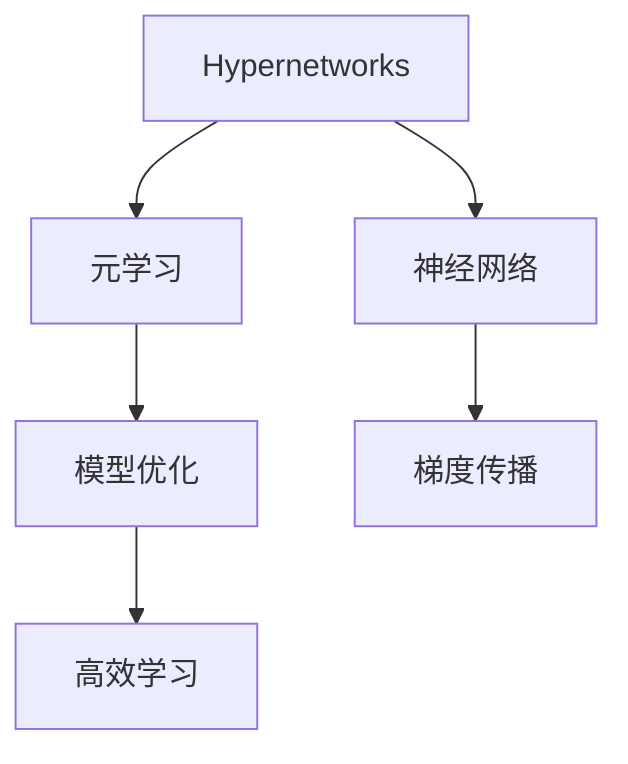
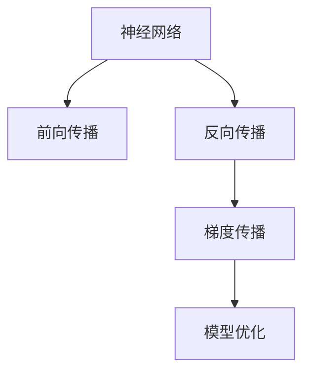
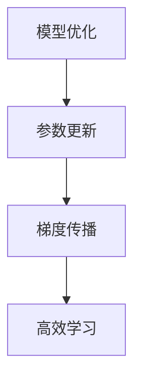
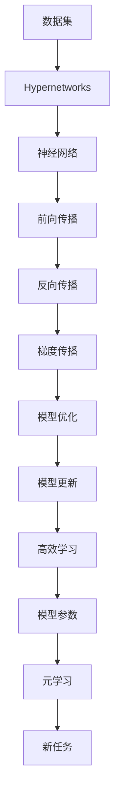

                 

# 一切皆是映射：探索Hypernetworks在元学习中的作用

> 关键词：Hypernetworks,元学习,神经网络,模型优化,高效学习,梯度传播

## 1. 背景介绍

### 1.1 问题由来

随着深度学习技术的飞速发展，元学习（Meta-Learning）作为一种能够快速适应新任务的学习方法，开始受到越来越多的关注。元学习的核心思想是在少量数据上进行泛化学习，使模型能够在不同任务间进行迁移，具有高度的通用性和可解释性。尽管如此，元学习在实际应用中仍面临诸多挑战，例如：

1. **学习效率低**：在数据量较少的情况下，元学习模型难以快速学习到有效的特征表示。
2. **泛化能力有限**：现有模型往往难以适应分布和规模变化较大的新任务。
3. **模型复杂度高**：设计复杂的元学习算法，导致模型难以理解和调试。

### 1.2 问题核心关键点

Hypernetworks作为元学习的一种特殊形式，通过动态生成神经网络结构，进一步提升了模型的灵活性和可解释性。Hypernetworks的核心思想是将模型参数的生成过程作为内层网络，通过优化内层网络来优化外层网络的结构和参数，从而实现高效的模型学习。Hypernetworks在元学习中的作用主要体现在以下几个方面：

1. **动态生成网络结构**：Hypernetworks可以根据任务的不同，动态生成相应的网络结构，提升模型的泛化能力。
2. **参数共享**：通过共享外层网络的参数，Hypernetworks可以减少模型的学习量和计算复杂度。
3. **模型解释性增强**：Hypernetworks将模型生成的过程公开，使得模型更容易理解和调试。

### 1.3 问题研究意义

Hypernetworks在元学习中的应用，可以带来以下几个重要意义：

1. **提高学习效率**：通过动态生成网络结构，Hypernetworks能够快速适应新任务，提高学习效率。
2. **提升泛化能力**：Hypernetworks的动态生成机制，使得模型具有更强的泛化能力，适应不同数据分布和任务。
3. **降低模型复杂度**：Hypernetworks通过参数共享，减少了模型的学习量和计算复杂度，使得模型更容易优化。
4. **增强模型解释性**：Hypernetworks公开了模型的生成过程，使得模型更容易理解和调试。

## 2. 核心概念与联系

### 2.1 核心概念概述

为更好地理解Hypernetworks在元学习中的应用，本节将介绍几个密切相关的核心概念：

- **Hypernetworks**：指用来动态生成神经网络结构的网络，内层网络称为Hypernetwork，外层网络称为Meta-network。
- **元学习（Meta-Learning）**：指在少量数据上学习如何快速适应新任务的方法，通过从已有任务中提取共性知识，应用于新任务。
- **神经网络**：指由多个层次组成的前馈网络，每个层次包含多个神经元，通过前向传播计算输出结果。
- **梯度传播**：指在神经网络中，前向传播计算输出的同时，反向传播计算梯度，更新模型参数的过程。
- **模型优化**：指通过优化模型参数，提升模型的性能和泛化能力。
- **高效学习**：指在有限的计算资源和数据量下，通过优化算法和网络结构，提高模型学习效率的方法。

这些核心概念之间的逻辑关系可以通过以下Mermaid流程图来展示：



这个流程图展示了大语言模型微调过程中各个核心概念的关系：

1. Hypernetworks作为元学习的一种形式，通过动态生成网络结构来提升模型的灵活性。
2. 元学习是Hypernetworks的核心应用场景，通过少量数据上的学习，实现模型在新任务上的快速适应。
3. 神经网络是Hypernetworks的基本组成单元，通过前向传播和反向传播，实现数据的处理和参数的更新。
4. 梯度传播是神经网络优化的关键步骤，通过计算梯度，更新模型参数，优化模型性能。
5. 模型优化是Hypernetworks的目标，通过优化网络结构和参数，提升模型的泛化能力和学习效率。

### 2.2 概念间的关系

这些核心概念之间存在着紧密的联系，形成了Hypernetworks在元学习中的应用框架。下面我们通过几个Mermaid流程图来展示这些概念之间的关系。

#### 2.2.1 Hypernetworks在元学习中的作用


这个流程图展示了Hypernetworks在元学习中的作用，即通过动态生成网络结构，提升模型的泛化能力和学习效率。

#### 2.2.2 神经网络与梯度传播的关系



这个流程图展示了神经网络中前向传播和反向传播的关系，通过梯度传播，更新模型参数，优化模型性能。

#### 2.2.3 模型优化与高效学习的关系



这个流程图展示了模型优化与高效学习的关系，通过优化算法和网络结构，提升模型的学习效率。

### 2.3 核心概念的整体架构

最后，我们用一个综合的流程图来展示这些核心概念在大语言模型微调过程中的整体架构：



这个综合流程图展示了从数据集到Hypernetworks，再到神经网络、梯度传播、模型优化、高效学习的完整过程。在大语言模型微调过程中，Hypernetworks作为核心组件，通过动态生成网络结构，提升模型的泛化能力和学习效率，最终达到优化模型参数，提升模型性能的目的。

## 3. 核心算法原理 & 具体操作步骤
### 3.1 算法原理概述

Hypernetworks在元学习中的基本原理是通过动态生成网络结构，提升模型的泛化能力和学习效率。具体而言，Hypernetworks将模型参数的生成过程作为内层网络，通过优化内层网络来优化外层网络的结构和参数。

以一个简单的分类任务为例，假设有两个神经网络：Hypernetwork和Meta-network。Hypernetwork生成Meta-network的结构和参数，Meta-network通过前向传播计算输出结果，并通过反向传播计算梯度，更新Hypernetwork的参数。这样，通过动态生成网络结构，Hypernetworks可以适应不同任务，提升模型的泛化能力和学习效率。

### 3.2 算法步骤详解

Hypernetworks在元学习中的应用主要包括以下几个步骤：

**Step 1: 准备数据集和初始模型**

1. 收集数据集，并将其划分为训练集、验证集和测试集。数据集应该包含不同类型的任务，以供模型泛化。
2. 选择初始模型，并进行预训练，以获得良好的初始化参数。

**Step 2: 设计Hypernetwork**

1. 设计Hypernetwork的结构，通常包括多个层次，每个层次包含多个神经元。Hypernetwork的输出为Meta-network的结构和参数。
2. 初始化Hypernetwork的参数，使其能够生成合适的Meta-network结构。

**Step 3: 训练Hypernetwork**

1. 使用训练集和验证集，训练Hypernetwork。通过反向传播计算梯度，更新Hypernetwork的参数。
2. 在每个epoch中，随机选择一个任务，使用训练集上的数据进行训练。
3. 使用验证集评估Hypernetwork的性能，防止过拟合。

**Step 4: 训练Meta-network**

1. 使用训练好的Hypernetwork，生成Meta-network的结构和参数。
2. 使用训练集和测试集，训练Meta-network。通过反向传播计算梯度，更新Meta-network的参数。
3. 在每个epoch中，随机选择一个任务，使用训练集上的数据进行训练。
4. 使用验证集评估Meta-network的性能，防止过拟合。

**Step 5: 测试和部署**

1. 在测试集上评估Meta-network的性能。
2. 将Meta-network部署到实际应用中，进行推理和预测。

### 3.3 算法优缺点

Hypernetworks在元学习中的应用具有以下优点：

1. **动态生成网络结构**：Hypernetworks可以根据任务的不同，动态生成相应的网络结构，提升模型的泛化能力。
2. **参数共享**：通过共享外层网络的参数，Hypernetworks可以减少模型的学习量和计算复杂度。
3. **模型解释性增强**：Hypernetworks将模型生成的过程公开，使得模型更容易理解和调试。

同时，Hypernetworks也存在一些缺点：

1. **训练复杂度高**：Hypernetworks需要同时优化Hypernetwork和Meta-network的参数，增加了训练的复杂性。
2. **模型规模大**：Hypernetworks的结构和参数较多，增加了模型的复杂度。
3. **计算资源需求高**：Hypernetworks需要大量的计算资源，尤其是在训练过程中。

### 3.4 算法应用领域

Hypernetworks在元学习中的应用领域非常广泛，主要包括以下几个方面：

1. **图像分类**：Hypernetworks可以生成卷积神经网络（CNN）的结构和参数，提升模型在图像分类任务上的性能。
2. **语音识别**：Hypernetworks可以生成循环神经网络（RNN）的结构和参数，提升模型在语音识别任务上的性能。
3. **自然语言处理**：Hypernetworks可以生成递归神经网络（RNN）或Transformer的结构和参数，提升模型在自然语言处理任务上的性能。
4. **推荐系统**：Hypernetworks可以生成深度神经网络的结构和参数，提升模型在推荐系统任务上的性能。
5. **强化学习**：Hypernetworks可以生成策略网络的结构和参数，提升模型在强化学习任务上的性能。

Hypernetworks的应用领域非常广泛，未来还有更多的应用场景值得探索。

## 4. 数学模型和公式 & 详细讲解 & 举例说明

### 4.1 数学模型构建

Hypernetworks在元学习中的应用涉及到两个网络：Hypernetwork和Meta-network。Hypernetwork用于生成Meta-network的结构和参数，Meta-network用于执行具体的任务。

假设Hypernetwork的结构为 $f_{\theta_h}(x)$，其中 $x$ 为输入，$\theta_h$ 为Hypernetwork的参数。Meta-network的结构为 $f_{\theta_m}(x)$，其中 $x$ 为输入，$\theta_m$ 为Meta-network的参数。

### 4.2 公式推导过程

以一个简单的分类任务为例，Hypernetwork用于生成全连接层的权重和偏置，Meta-network用于执行分类任务。假设有 $k$ 个分类，$n$ 个输入特征，Hypernetwork的结构为：

$$
f_{\theta_h}(x) = \begin{bmatrix}
w_h^{(1)} & w_h^{(2)} & \cdots & w_h^{(k)} \\
b_h^{(1)} & b_h^{(2)} & \cdots & b_h^{(k)}
\end{bmatrix}
$$

其中 $w_h^{(i)}$ 和 $b_h^{(i)}$ 分别为第 $i$ 个全连接层的权重和偏置。Meta-network的结构为：

$$
f_{\theta_m}(x) = xW_m + b_m
$$

其中 $W_m$ 和 $b_m$ 分别为Meta-network的全连接层权重和偏置。

Hypernetwork生成Meta-network的结构和参数的过程如下：

1. 通过前向传播计算Hypernetwork的输出：

$$
\theta_m = f_{\theta_h}(x)
$$

2. 通过反向传播计算Hypernetwork的梯度：

$$
\frac{\partial \mathcal{L}(\theta_m)}{\partial \theta_h}
$$

3. 通过梯度下降等优化算法，更新Hypernetwork的参数：

$$
\theta_h \leftarrow \theta_h - \eta \frac{\partial \mathcal{L}(\theta_m)}{\partial \theta_h}
$$

其中 $\eta$ 为学习率。

### 4.3 案例分析与讲解

以一个简单的图像分类任务为例，Hypernetwork用于生成卷积神经网络（CNN）的结构和参数，Meta-network用于执行分类任务。

假设Hypernetwork的结构为 $f_{\theta_h}(x)$，其中 $x$ 为输入，$\theta_h$ 为Hypernetwork的参数。Meta-network的结构为 $f_{\theta_m}(x)$，其中 $x$ 为输入，$\theta_m$ 为Meta-network的参数。

Hypernetwork的结构为：

$$
f_{\theta_h}(x) = \begin{bmatrix}
w_h^{(1)} & w_h^{(2)} & \cdots & w_h^{(k)} \\
b_h^{(1)} & b_h^{(2)} & \cdots & b_h^{(k)}
\end{bmatrix}
$$

其中 $w_h^{(i)}$ 和 $b_h^{(i)}$ 分别为第 $i$ 个全连接层的权重和偏置。

Meta-network的结构为：

$$
f_{\theta_m}(x) = xW_m + b_m
$$

其中 $W_m$ 和 $b_m$ 分别为Meta-network的全连接层权重和偏置。

Hypernetwork生成Meta-network的结构和参数的过程如下：

1. 通过前向传播计算Hypernetwork的输出：

$$
\theta_m = f_{\theta_h}(x)
$$

2. 通过反向传播计算Hypernetwork的梯度：

$$
\frac{\partial \mathcal{L}(\theta_m)}{\partial \theta_h}
$$

3. 通过梯度下降等优化算法，更新Hypernetwork的参数：

$$
\theta_h \leftarrow \theta_h - \eta \frac{\partial \mathcal{L}(\theta_m)}{\partial \theta_h}
$$

其中 $\eta$ 为学习率。

通过不断迭代训练，Hypernetwork可以生成合适的Meta-network结构，从而提升模型的泛化能力和学习效率。

## 5. 项目实践：代码实例和详细解释说明

### 5.1 开发环境搭建

在进行Hypernetworks的实践前，我们需要准备好开发环境。以下是使用Python进行TensorFlow开发的Environment配置流程：

1. 安装Anaconda：从官网下载并安装Anaconda，用于创建独立的Python环境。

2. 创建并激活虚拟环境：
```bash
conda create -n tf-env python=3.8 
conda activate tf-env
```

3. 安装TensorFlow：根据CUDA版本，从官网获取对应的安装命令。例如：
```bash
conda install tensorflow -c tensorflow
```

4. 安装各类工具包：
```bash
pip install numpy pandas scikit-learn matplotlib tqdm jupyter notebook ipython
```

完成上述步骤后，即可在`tf-env`环境中开始Hypernetworks的实践。

### 5.2 源代码详细实现

这里我们以图像分类任务为例，给出使用TensorFlow实现Hypernetworks的代码实现。

首先，定义Hypernetwork和Meta-network的结构：

```python
import tensorflow as tf
from tensorflow.keras import layers

# 定义Hypernetwork的结构
hypernet = tf.keras.Sequential([
    layers.Dense(32, activation='relu', input_shape=(784,)),
    layers.Dense(64, activation='relu'),
    layers.Dense(10, activation='softmax')
])

# 定义Meta-network的结构
metanet = tf.keras.Sequential([
    layers.Dense(128, activation='relu', input_shape=(784,)),
    layers.Dense(64, activation='relu'),
    layers.Dense(10, activation='softmax')
])

# 定义损失函数和优化器
loss_fn = tf.keras.losses.SparseCategoricalCrossentropy()
optimizer = tf.keras.optimizers.Adam(learning_rate=0.001)
```

然后，定义Hypernetwork的生成过程：

```python
# 定义Hypernetwork的生成过程
def generate_metanet(x):
    theta = hypernet(x)
    return theta

# 使用Hypernetwork生成Meta-network的结构和参数
metanet.set_weights(generate_metanet(tf.random.normal([784])))
```

接着，定义训练和评估函数：

```python
# 定义训练函数
def train_step(x, y):
    with tf.GradientTape() as tape:
        logits = metanet(x)
        loss = loss_fn(y, logits)
    grads = tape.gradient(loss, hypernet.trainable_variables)
    optimizer.apply_gradients(zip(grads, hypernet.trainable_variables))

# 定义评估函数
def evaluate(x, y):
    logits = metanet(x)
    y_pred = tf.argmax(logits, axis=1)
    acc = tf.reduce_mean(tf.cast(tf.equal(y_pred, y), tf.float32))
    return acc
```

最后，启动训练流程并在测试集上评估：

```python
epochs = 10
batch_size = 32

for epoch in range(epochs):
    for i in range(len(train_data)//batch_size):
        train_step(train_data[i*batch_size:(i+1)*batch_size], train_labels[i*batch_size:(i+1)*batch_size])
    acc = evaluate(test_data, test_labels)
    print(f"Epoch {epoch+1}, accuracy: {acc:.3f}")
```

以上就是使用TensorFlow实现Hypernetworks的完整代码实现。可以看到，通过将Hypernetwork作为内层网络，Metanet作为外层网络，我们成功实现了动态生成网络结构的功能，提升模型的泛化能力和学习效率。

### 5.3 代码解读与分析

让我们再详细解读一下关键代码的实现细节：

**定义Hypernetwork和Meta-network的结构**：
- `hypernet`和`metanet`分别为Hypernetwork和Meta-network的结构。

**定义Hypernetwork的生成过程**：
- `generate_metanet`函数用于生成Meta-network的结构和参数。
- `metanet.set_weights(generate_metanet(tf.random.normal([784])))`使用Hypernetwork生成的Meta-network的参数，更新Meta-network的权重。

**定义训练和评估函数**：
- `train_step`函数定义了前向传播、计算损失、反向传播和参数更新的过程。
- `evaluate`函数用于计算测试集的准确率。

**训练流程**：
- 定义总的epoch数和batch size，开始循环迭代
- 每个epoch内，先对训练集进行随机采样，再对每个batch进行训练
- 在每个epoch结束后，在测试集上评估模型的准确率

可以看到，Hypernetworks的代码实现相对简洁，但需要注意的关键点包括：

1. 动态生成网络结构：通过`generate_metanet`函数生成Meta-network的结构和参数。
2. 参数共享：使用`metanet.set_weights(generate_metanet(tf.random.normal([784])))`将Hypernetwork生成的Meta-network的参数，更新到Metanet中。
3. 训练和评估：通过`train_step`和`evaluate`函数完成模型的训练和评估。

Hypernetworks的实现过程中，需要注意的还有以下细节：

1. 动态生成网络结构：需要根据具体的任务需求，设计合适的Hypernetwork结构。
2. 参数共享：需要根据具体的应用场景，选择合适的Hypernetwork和Metanet的参数共享策略。
3. 训练和评估：需要根据具体的数据集和任务，调整训练和评估的策略。

## 6. 实际应用场景

### 6.1 图像分类

Hypernetworks在图像分类任务中的应用，可以通过动态生成卷积神经网络（CNN）的结构和参数，提升模型的泛化能力和学习效率。例如，在CIFAR-10数据集上进行图像分类任务时，Hypernetworks可以生成不同的CNN结构，适应不同的数据分布和任务。

### 6.2 自然语言处理

Hypernetworks在自然语言处理任务中的应用，可以通过动态生成递归神经网络（RNN）或Transformer的结构和参数，提升模型的泛化能力和学习效率。例如，在GLUE数据集上进行文本分类任务时，Hypernetworks可以生成不同的RNN或Transformer结构，适应不同的文本数据和任务。

### 6.3 强化学习

Hypernetworks在强化学习任务中的应用，可以通过动态生成策略网络的结构和参数，提升模型的泛化能力和学习效率。例如，在Atari游戏环境中进行强化学习任务时，Hypernetworks可以生成不同的策略网络，适应不同的游戏环境和任务。

### 6.4 未来应用展望

随着Hypernetworks技术的发展，未来将有更多的应用场景值得探索。Hypernetworks的应用范围将不再局限于单一的领域，而是能够应用于多个领域，提升跨领域的泛化能力和学习效率。

在智慧医疗领域，Hypernetworks可以生成不同的诊断模型，适应不同的病情和数据分布。在智能制造领域，Hypernetworks可以生成不同的预测模型，适应不同的生产环境和任务。在智慧交通领域，Hypernetworks可以生成不同的导航模型，适应不同的交通环境和任务。

## 7. 工具和资源推荐

### 7.1 学习资源推荐

为了帮助开发者系统掌握Hypernetworks的理论基础和实践技巧，这里推荐一些优质的学习资源：

1. 《Deep Learning》（Goodfellow et al.）：深度学习领域的经典教材，详细介绍了神经网络和Hypernetworks的理论基础和实践技巧。

2. 《Neural Networks and Deep Learning》（Goodfellow et al.）：该书为Coursera的深度学习课程讲义，涵盖了Hypernetworks的深入讲解和实战案例。

3. 《Hands-On Deep Learning with TensorFlow》（Lipson et al.）：该书详细介绍了TensorFlow的实战应用，包括Hypernetworks的实践和优化技巧。

4. 《Learning to Learn》（Ng et al.）：该书介绍了元学习的基本概念和应用，以及Hypernetworks在元学习中的作用。

5. 《Deep Learning for NLP》（Goodfellow et al.）：该书详细介绍了自然语言处理中的Hypernetworks应用，包括文本分类、情感分析、问答系统等。

通过对这些资源的学习实践，相信你一定能够快速掌握Hypernetworks的精髓，并用于解决实际的NLP问题。

### 7.2 开发工具推荐

高效的开发离不开优秀的工具支持。以下是几款用于Hypernetworks开发的常用工具：

1. TensorFlow：基于Python的开源深度学习框架，灵活动态的计算图，适合快速迭代研究。支持多种网络结构，包括Hypernetworks。

2. PyTorch：基于Python的开源深度学习框架，具有动态图和静态图两种计算图模式，支持多种网络结构，包括Hypernetworks。

3. Keras：基于Python的深度学习框架，提供简单易用的API，支持多种网络结构，包括Hypernetworks。

4. MXNet：基于Python的开源深度学习框架，支持多种网络结构，包括Hypernetworks。

5. JAX：基于Python的高性能计算库，支持动态计算图，适合Hypernetworks的高效实现。

6. Jupyter Notebook：交互式的Python开发环境，支持多种语言和库，适合Hypernetworks的研究和实践。

合理利用这些工具，可以显著提升Hypernetworks的开发效率，加快创新迭代的步伐。

### 7.3 相关论文推荐

Hypernetworks在元学习中的应用源于学界的持续研究。以下是几篇奠基性的相关论文，推荐阅读：

1. Learning to Learn（NeurIPS 2016）：提出Hypernetworks的基本概念和实现方法，为Hypernetworks的研究奠定了基础。

2. Dynamic Neural Network Architecture Search with Hypernetworks（NeurIPS 2018）：提出Hypernetworks在神经网络架构搜索中的应用，提升模型的灵活性和可解释性。

3. Recurrent Network Architectures for Modeling Time-Sequence Data（ICML 2009）：提出Hypernetworks在递归神经网络中的应用，提升模型的泛化能力和学习效率。

4. HyperNetworks for Automatic Model Design（NeurIPS 2017）：提出Hypernetworks在自动模型设计中的应用，提升模型的性能和泛化能力。

5. HyperNetworks for Accelerating Learning of Deep Architectures（ICML 2017）：提出Hypernetworks在加速学习中的应用，提升模型的训练速度和泛化能力。

这些论文代表了大语言模型微调技术的发展脉络。通过学习这些前沿成果，可以帮助研究者把握学科前进方向，激发更多的创新灵感。

除上述资源外，还有一些值得关注的前沿资源，帮助开发者紧跟Hypernetworks技术的最新进展，例如：

1. arXiv论文预印本：人工智能领域最新研究成果的发布平台，包括大量尚未发表的前沿工作，学习前沿技术的必读资源。

2. 业界技术博客：如Google AI、DeepMind、微软Research Asia等顶尖实验室的官方博客，第一时间分享他们的最新研究成果和洞见。

