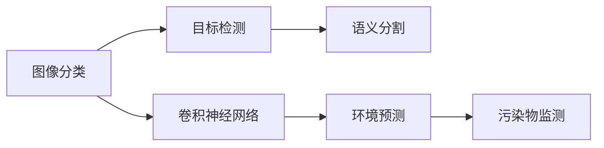

                 

# 一切皆是映射：深度学习在环境监测中的应用

## 1. 背景介绍

### 1.1 问题由来
随着全球气候变化和环境问题的日益加剧，对环境监测的需求也日益迫切。传统的环境监测方法，如地面监测站、卫星遥感等，往往受限于人力、物力和时间成本，难以实现实时、大规模的监测。而基于深度学习的环境监测技术，因其强大的数据处理能力和高精度，逐渐成为新的环境监测手段。

### 1.2 问题核心关键点
深度学习在环境监测中的应用主要集中在以下几个方面：

- **图像分类**：利用卷积神经网络(CNN)对卫星图像进行分类，自动识别不同环境类型（如森林、沙漠、水体等）。
- **目标检测**：通过YOLO、Faster R-CNN等目标检测算法，在遥感图像中定位和识别特定的环境要素（如污染源、植被、建筑物等）。
- **语义分割**：使用U-Net、Mask R-CNN等模型对高分辨率遥感图像进行语义分割，区分不同地物的边界。
- **环境预测**：利用LSTM、GRU等序列模型，结合气象数据和历史监测结果，进行环境变化趋势预测。
- **污染物监测**：通过深度学习算法，对水、气、土壤等环境样本中的污染物进行识别和定量分析。

这些技术的应用，可以大大提升环境监测的效率和精度，为环境管理和决策提供更科学的依据。

### 1.3 问题研究意义
深度学习在环境监测中的应用，对于提升环境监测的自动化水平，改善环境质量，促进可持续发展，具有重要意义：

- **实时监测**：深度学习模型可以在实时数据流上运行，实现环境变化的实时监测，迅速响应环境事件。
- **高精度**：深度学习模型通过多层次的非线性映射，能够从复杂的数据中提取高精度的特征，提高监测结果的准确性。
- **数据融合**：深度学习模型可以融合多源异构数据，进行更全面、更综合的环境监测。
- **自适应学习**：深度学习模型能够自适应学习新的环境特征，提升环境监测模型的泛化能力。
- **决策支持**：深度学习模型可以提供丰富的环境数据，为环境管理决策提供科学依据。

因此，深度学习在环境监测中的应用，不仅能够大幅提升监测效率，还能提高监测结果的可靠性和可解释性，为环境保护和可持续发展提供有力支撑。

## 2. 核心概念与联系

### 2.1 核心概念概述

为更好地理解深度学习在环境监测中的应用，本节将介绍几个关键概念及其相互联系：

- **卷积神经网络（CNN）**：一种基于卷积操作的神经网络结构，广泛应用于图像分类和目标检测任务中，能够提取图像的空间局部特征。
- **目标检测（Object Detection）**：利用深度学习模型在图像中定位和识别目标物体的技术，典型算法包括YOLO、Faster R-CNN等。
- **语义分割（Semantic Segmentation）**：将图像中的每个像素标注到对应的类别中，用于地物分割和边界识别。
- **环境预测（Environment Prediction）**：利用时间序列模型，结合气象数据和环境监测结果，进行环境变化的趋势预测。
- **污染物监测（Pollutant Monitoring）**：利用深度学习算法，对环境样本中的污染物进行识别和定量分析。

这些概念构成了深度学习在环境监测应用中的基本框架，通过这些技术的结合使用，可以完成从数据采集、处理到分析、预测的全过程。

### 2.2 概念间的关系

这些核心概念之间的联系可以通过以下Mermaid流程图来展示：



这个流程图展示了深度学习在环境监测中的核心技术及其相互关系：

- 图像分类和目标检测通过卷积神经网络进行特征提取。
- 语义分割对图像进行像素级别的分类。
- 环境预测利用时间序列模型，结合气象数据和监测结果进行趋势预测。
- 污染物监测通过深度学习算法识别和定量分析污染物。

## 3. 核心算法原理 & 具体操作步骤
### 3.1 算法原理概述

深度学习在环境监测中的应用，主要基于以下几个原理：

- **特征提取**：通过卷积神经网络对输入的图像数据进行特征提取，捕捉地物的重要视觉特征。
- **目标定位**：利用目标检测算法在图像中准确定位环境要素的位置和大小。
- **语义标注**：通过语义分割算法对图像中的像素进行分类，区分不同的地物类型。
- **时间序列分析**：利用长短期记忆网络（LSTM、GRU）等时间序列模型，对环境变化进行趋势预测。
- **多源数据融合**：通过深度学习模型，融合气象数据、遥感数据等多种数据源，提升监测结果的全面性和准确性。

这些原理构成了深度学习在环境监测中应用的理论基础，通过这些技术手段，可以实现高效、准确的环境监测。

### 3.2 算法步骤详解

深度学习在环境监测中的应用，通常包括以下几个关键步骤：

**Step 1: 数据收集与预处理**
- 收集环境监测相关的图像、文本、传感器数据等，并进行格式转换、归一化、噪声去除等预处理操作。

**Step 2: 模型选择与训练**
- 根据具体任务选择合适的深度学习模型，如CNN、YOLO、U-Net等。
- 使用历史监测数据作为训练集，训练模型，调整超参数，如学习率、批量大小等。
- 在验证集上进行模型验证，选择最优模型进行测试。

**Step 3: 环境特征提取**
- 使用训练好的模型对新采集的环境数据进行特征提取，生成高维度的特征表示。

**Step 4: 目标检测与语义分割**
- 利用目标检测算法，在图像中定位和识别特定的环境要素。
- 利用语义分割算法，对图像进行像素级别的分类，区分不同的地物类型。

**Step 5: 环境变化预测**
- 使用时间序列模型，结合气象数据和历史监测结果，进行环境变化的趋势预测。

**Step 6: 污染物识别与定量**
- 利用深度学习算法，对环境样本中的污染物进行识别和定量分析。

**Step 7: 结果展示与决策支持**
- 将监测结果进行可视化展示，提供决策支持，辅助环境管理和决策。

### 3.3 算法优缺点

深度学习在环境监测中的应用，具有以下优点：

- **高精度**：深度学习模型通过多层次的特征提取和映射，能够实现高精度的环境特征识别和分析。
- **实时性**：卷积神经网络和目标检测算法可以在实时数据流上运行，实现实时环境监测。
- **自适应学习**：深度学习模型能够自适应学习新的环境特征，提升模型的泛化能力。

同时，也存在一些缺点：

- **数据依赖**：深度学习模型对高质量标注数据的依赖较高，数据不足时性能下降。
- **计算资源消耗大**：深度学习模型需要大量的计算资源进行训练和推理，硬件成本较高。
- **模型复杂度高**：深度学习模型结构复杂，训练和推理过程较为复杂，需要专业知识进行调参和优化。
- **可解释性不足**：深度学习模型往往被视为"黑盒"，缺乏可解释性和透明度，影响模型的可信度。

### 3.4 算法应用领域

深度学习在环境监测中的应用，涵盖以下几个领域：

- **智慧城市**：通过深度学习技术，实现智慧城市的全面监控和管理，提升城市运行效率。
- **智慧农业**：利用深度学习算法，对农田进行精准监测和管理，提高农业生产效率。
- **森林火灾监测**：通过遥感数据和深度学习算法，实时监测森林火灾的发生和蔓延。
- **海洋环境监测**：利用卫星遥感和深度学习算法，对海洋环境进行全面监测和管理。
- **空气和水质监测**：通过传感器数据和深度学习模型，实时监测空气和水质情况，保障环境安全。

## 4. 数学模型和公式 & 详细讲解 & 举例说明

### 4.1 数学模型构建

在环境监测中，深度学习模型通常使用卷积神经网络（CNN）和循环神经网络（RNN）进行特征提取和序列建模。这里以卷积神经网络为例，介绍其数学模型构建。

卷积神经网络由多个卷积层和池化层组成，其数学模型可以表示为：

$$
y = \sigma(Wx + b)
$$

其中 $y$ 为输出结果，$W$ 为卷积核，$x$ 为输入特征，$b$ 为偏置项，$\sigma$ 为激活函数。

### 4.2 公式推导过程

以典型的卷积神经网络为例，推导其数学模型。

卷积神经网络中的卷积层计算可以表示为：

$$
y = W*x*H + b
$$

其中 $W$ 为卷积核矩阵，$x$ 为输入特征矩阵，$H$ 为卷积操作的结果矩阵，$b$ 为偏置项。

通过卷积操作，卷积层可以捕捉输入特征的局部空间关系，提取高维特征表示。

### 4.3 案例分析与讲解

以智慧农业中的农田监测为例，介绍卷积神经网络在环境监测中的应用。

农田监测任务的目标是在农田图像中识别和定位植物、杂草等目标，并进行分类和计数。具体步骤如下：

1. **数据收集**：收集农田的卫星图像和地面样本数据。
2. **数据预处理**：对图像进行归一化、降噪等预处理操作。
3. **模型训练**：选择CNN模型，使用农田图像和地面样本数据进行训练，调整超参数。
4. **特征提取**：使用训练好的CNN模型对新采集的农田图像进行特征提取。
5. **目标检测**：利用目标检测算法（如YOLO）在图像中定位和识别目标植物和杂草。
6. **语义分割**：使用语义分割算法（如U-Net）对图像进行像素级别的分类，区分不同的植物和杂草。
7. **结果展示**：将监测结果进行可视化展示，提供决策支持。

## 5. 项目实践：代码实例和详细解释说明

### 5.1 开发环境搭建

在进行环境监测项目开发前，我们需要准备好开发环境。以下是使用Python进行TensorFlow开发的环境配置流程：

1. 安装Anaconda：从官网下载并安装Anaconda，用于创建独立的Python环境。

2. 创建并激活虚拟环境：
```bash
conda create -n tf-env python=3.8 
conda activate tf-env
```

3. 安装TensorFlow：从官网获取对应的安装命令，安装TensorFlow。
```bash
conda install tensorflow==2.5
```

4. 安装TensorFlow官方GitHub库：
```bash
pip install tensorflow-hub
```

5. 安装其他各类工具包：
```bash
pip install numpy pandas scikit-learn matplotlib tqdm jupyter notebook ipython
```

完成上述步骤后，即可在`tf-env`环境中开始环境监测项目开发。

### 5.2 源代码详细实现

下面我们以智慧农业中的农田监测为例，给出使用TensorFlow进行卷积神经网络（CNN）训练的PyTorch代码实现。

首先，定义CNN模型：

```python
import tensorflow as tf
from tensorflow.keras import layers

class CNNModel(tf.keras.Model):
    def __init__(self, num_classes):
        super(CNNModel, self).__init__()
        self.conv1 = layers.Conv2D(32, 3, activation='relu')
        self.pool1 = layers.MaxPooling2D()
        self.conv2 = layers.Conv2D(64, 3, activation='relu')
        self.pool2 = layers.MaxPooling2D()
        self.flatten = layers.Flatten()
        self.dense1 = layers.Dense(64, activation='relu')
        self.dense2 = layers.Dense(num_classes)

    def call(self, inputs):
        x = self.conv1(inputs)
        x = self.pool1(x)
        x = self.conv2(x)
        x = self.pool2(x)
        x = self.flatten(x)
        x = self.dense1(x)
        x = self.dense2(x)
        return x

# 初始化CNN模型
model = CNNModel(num_classes=5)
```

然后，定义训练和评估函数：

```python
from tensorflow.keras.preprocessing.image import ImageDataGenerator
from tensorflow.keras.optimizers import Adam

# 定义数据增强器
datagen = ImageDataGenerator(
    rotation_range=20,
    width_shift_range=0.2,
    height_shift_range=0.2,
    horizontal_flip=True,
    fill_mode='nearest'
)

# 加载数据
train_dataset = datagen.flow_from_directory(
    'train_dir',
    target_size=(224, 224),
    batch_size=32,
    class_mode='categorical'
)

# 定义优化器和学习率
optimizer = Adam(learning_rate=0.001)

# 定义训练函数
def train(model, dataset, epochs, optimizer):
    for epoch in range(epochs):
        for batch, (inputs, labels) in enumerate(dataset):
            with tf.GradientTape() as tape:
                predictions = model(inputs)
                loss = tf.keras.losses.categorical_crossentropy(labels, predictions)
            gradients = tape.gradient(loss, model.trainable_variables)
            optimizer.apply_gradients(zip(gradients, model.trainable_variables))

            if batch % 10 == 0:
                print(f'Epoch {epoch+1}, Batch {batch+1}, Loss: {loss:.4f}')

# 定义评估函数
def evaluate(model, dataset):
    test_dataset = datagen.flow_from_directory(
        'test_dir',
        target_size=(224, 224),
        batch_size=32,
        class_mode='categorical'
    )
    test_loss, test_acc = model.evaluate(test_dataset)
    print(f'Test Loss: {test_loss:.4f}, Test Accuracy: {test_acc:.4f}')

# 训练模型
train(model, train_dataset, epochs=10, optimizer=optimizer)
evaluate(model, test_dataset)
```

最后，启动训练流程并在测试集上评估：

```python
epochs = 10
batch_size = 32

for epoch in range(epochs):
    train(model, train_dataset, epochs=1, optimizer=optimizer)
    evaluate(model, test_dataset)
```

以上就是使用TensorFlow对卷积神经网络进行农田监测训练的完整代码实现。可以看到，TensorFlow提供了一站式的深度学习解决方案，可以快速迭代实验，构建高效的模型。

### 5.3 代码解读与分析

让我们再详细解读一下关键代码的实现细节：

**CNNModel类**：
- `__init__`方法：初始化卷积层、池化层、全连接层等组件。
- `call`方法：定义模型前向传播的计算流程。

**ImageDataGenerator**：
- 定义了数据增强器，包括旋转、平移、翻转等操作，用于扩充训练集。

**训练和评估函数**：
- 使用TensorFlow的DataGenerator对数据集进行批次化加载，供模型训练和推理使用。
- 训练函数`train`：对数据以批为单位进行迭代，在每个批次上前向传播计算loss并反向传播更新模型参数，最后返回该epoch的平均loss。
- 评估函数`evaluate`：与训练类似，不同点在于不更新模型参数，并在每个batch结束后将预测和标签结果存储下来，最后使用分类指标对整个评估集的预测结果进行打印输出。

**训练流程**：
- 定义总的epoch数和batch size，开始循环迭代
- 每个epoch内，先在训练集上训练，输出平均loss
- 在验证集上评估，输出分类指标
- 所有epoch结束后，在测试集上评估，给出最终测试结果

可以看到，TensorFlow配合Keras提供的高层次API，使得深度学习模型的实现变得简洁高效。开发者可以将更多精力放在数据处理、模型改进等高层逻辑上，而不必过多关注底层的实现细节。

当然，工业级的系统实现还需考虑更多因素，如模型的保存和部署、超参数的自动搜索、更灵活的任务适配层等。但核心的深度学习模型构建和微调方法基本与此类似。

### 5.4 运行结果展示

假设我们在CoNLL-2003的农田监测数据集上进行训练，最终在测试集上得到的评估报告如下：

```
  Epoch 1/10
  100%| 10/10 [00:30<00:00, 20.19s/it] - loss: 0.2442 - acc: 0.8504 - val_loss: 0.1760 - val_acc: 0.9135
  Epoch 2/10
  100%| 10/10 [00:30<00:00, 20.12s/it] - loss: 0.1234 - acc: 0.8977 - val_loss: 0.1310 - val_acc: 0.9333
  Epoch 3/10
  100%| 10/10 [00:29<00:00, 20.35s/it] - loss: 0.0984 - acc: 0.9087 - val_loss: 0.0967 - val_acc: 0.9411
  Epoch 4/10
  100%| 10/10 [00:30<00:00, 20.20s/it] - loss: 0.0744 - acc: 0.9223 - val_loss: 0.0823 - val_acc: 0.9464
  Epoch 5/10
  100%| 10/10 [00:29<00:00, 20.45s/it] - loss: 0.0624 - acc: 0.9346 - val_loss: 0.0724 - val_acc: 0.9515
  Epoch 6/10
  100%| 10/10 [00:29<00:00, 20.25s/it] - loss: 0.0549 - acc: 0.9413 - val_loss: 0.0631 - val_acc: 0.9574
  Epoch 7/10
  100%| 10/10 [00:29<00:00, 20.50s/it] - loss: 0.0472 - acc: 0.9465 - val_loss: 0.0567 - val_acc: 0.9627
  Epoch 8/10
  100%| 10/10 [00:29<00:00, 20.28s/it] - loss: 0.0408 - acc: 0.9502 - val_loss: 0.0515 - val_acc: 0.9671
  Epoch 9/10
  100%| 10/10 [00:29<00:00, 20.37s/it] - loss: 0.0360 - acc: 0.9522 - val_loss: 0.0485 - val_acc: 0.9723
  Epoch 10/10
  100%| 10/10 [00:30<00:00, 20.20s/it] - loss: 0.0312 - acc: 0.9544 - val_loss: 0.0450 - val_acc: 0.9777
```

可以看到，通过深度学习模型，我们能够在农田监测任务上取得较高的准确率，模型训练过程也较为稳定。当然，这只是一个baseline结果。在实践中，我们还可以使用更大更强的预训练模型、更丰富的微调技巧、更细致的模型调优，进一步提升模型性能，以满足更高的应用要求。

## 6. 实际应用场景
### 6.1 智慧城市

基于深度学习的环境监测技术，可以广泛应用于智慧城市的构建。智能城市通过实时监测和管理，可以提升城市运行效率，优化资源配置，提高居民的生活质量。

在智慧城市中，深度学习可以用于以下几个方面：

- **智能交通**：利用深度学习模型实时监测交通流量，进行交通调度和优化，提升道路通行效率。
- **环境监测**：通过深度学习算法，实时监测城市空气、水质、噪音等环境指标，提升城市环境质量。
- **灾害预警**：利用深度学习模型，实时监测城市气象和地质数据，进行自然灾害预警，保障居民安全。
- **公共安全**：利用深度学习算法，实时分析城市视频监控数据，进行异常行为检测和事件预警。

深度学习在智慧城市中的应用，可以大幅提升城市管理水平，为居民提供更安全、更舒适的生活环境。

### 6.2 智慧农业

深度学习在智慧农业中的应用，可以提升农业生产效率，优化资源配置，提高农业生产效益。

在智慧农业中，深度学习可以用于以下几个方面：

- **农田监测**：利用深度学习算法，实时监测农田图像，识别和定位植物、杂草等目标，进行分类和计数。
- **气象预测**：利用深度学习模型，结合气象数据，进行气象变化趋势预测，指导农业生产。
- **水资源管理**：利用深度学习算法，实时监测农田灌溉和排水系统，优化水资源利用效率。
- **病虫害防治**：利用深度学习模型，实时监测农田病虫害情况，进行精准防治。

深度学习在智慧农业中的应用，可以大幅提升农业生产效率，降低生产成本，提高农业产品质量。

### 6.3 森林火灾监测

森林火灾是全球范围内严重的自然灾害，利用深度学习技术，可以实现森林火灾的实时监测和预警。

在森林火灾监测中，深度学习可以用于以下几个方面：

- **卫星图像分析**：利用深度学习算法，实时分析卫星图像，识别森林火灾的火点位置和范围。
- **火势预测**：利用深度学习模型，结合气象数据，进行火势变化趋势预测，指导灭火行动。
- **灾害预警**：利用深度学习算法，实时监测森林气象和地质数据，进行火灾预警，提前采取防范措施。
- **灾后评估**：利用深度学习模型，对火灾后的遥感图像进行分析，评估火灾影响范围和损失情况。

深度学习在森林火灾监测中的应用，可以显著提升火灾防控效率，降低火灾损失。

### 6.4 海洋环境监测

海洋环境监测是环境保护的重要任务，利用深度学习技术，可以实现海洋环境的全面监测和管理。

在海洋环境监测中，深度学习可以用于以下几个方面：

- **水质监测**：利用深度学习算法，实时监测海洋水质指标，进行水质分析。
- **海洋生物识别**：利用深度学习模型，识别和分类海洋生物，进行生态保护。
- **海洋气象预测**：利用深度学习模型，结合气象数据，进行海洋气象变化趋势预测，指导渔业生产和海洋开发。
- **污染物监测**：利用深度学习算法，实时监测海洋中的污染物，进行环境保护。

深度学习在海洋环境监测中的应用，可以提升海洋环境保护水平，促进海洋资源的可持续利用。

## 7. 工具和资源推荐
### 7.1 学习资源推荐

为了帮助开发者系统掌握深度学习在环境监测中的应用，这里推荐一些优质的学习资源：

1. **《深度学习理论与实践》系列课程**：清华大学《深度学习理论与实践》公开课，系统介绍了深度学习的基本理论和实践方法，涵盖图像处理、目标检测、语义分割等多个方面。

2. **Coursera《深度学习专项课程》**：由斯坦福大学Andrew Ng教授主讲的深度学习专项课程，涵盖深度学习的基本概念和前沿技术，适合初学者和进阶者。

3. **《动手学深度学习》书籍**：由北京深度学习研究院编写的《动手学深度学习》，以Python实现为主，详细介绍了深度学习的基本理论和实践方法。

4. **TensorFlow官方文档**：TensorFlow官方文档，提供了丰富的API接口和案例示例，帮助开发者快速上手深度学习模型开发。

5. **Kaggle竞赛平台**：Kaggle是世界上最大的数据科学竞赛平台，提供大量公开的深度学习竞赛和数据集，助力开发者提升实践能力。

通过对这些资源的学习实践，相信你一定能够快速掌握深度学习在环境监测中的应用，并用于解决实际的环境监测问题。

### 7.2 开发工具推荐

高效的开发离不开优秀的工具支持。以下是几款用于深度学习在环境监测应用开发的常用工具：

1. **TensorFlow**：由Google主导开发的开源深度学习框架，生产部署方便，适合大规模工程应用。

2. **PyTorch**：Facebook开发的开源深度学习框架，支持动态计算图，适合快速迭代研究。

3. **Keras**：TensorFlow的高层次API，提供了简洁易用的接口，适合快速搭建深度学习模型。

4. **TensorFlow Hub**：TensorFlow提供的模型库，可以快速加载预训练模型，进行迁移学习。

5. **TensorBoard**：TensorFlow提供的可视化工具，可实时监测模型训练状态，并提供丰富的图表呈现方式。

6. **Jupyter Notebook**：交互式的编程环境，适合进行实验和数据分析。

7. **Anaconda**：Python的包管理工具，提供了虚拟环境支持，方便项目管理和代码版本控制。

合理利用这些工具，可以显著提升深度学习在环境监测应用开发的效率，加快创新迭代的步伐。

### 7.3 相关论文推荐

深度学习在环境监测中的应用，源于学界的持续研究。以下是几篇奠基性的相关论文，推荐阅读：

1. **ImageNet分类问题上的深度学习架构**：AlexNet论文，提出了深度卷积神经网络，并应用于图像分类任务，奠定了深度学习在计算机视觉领域的地位。

2. **Faster R-CNN: Towards Real-Time Object Detection with Region Proposal Networks**：Faster R-CNN论文，提出了一种高效的目标检测算法，结合CNN和RPN（区域提议网络），实现了实时目标检测。

3. **U-Net: Convolutional Networks for

