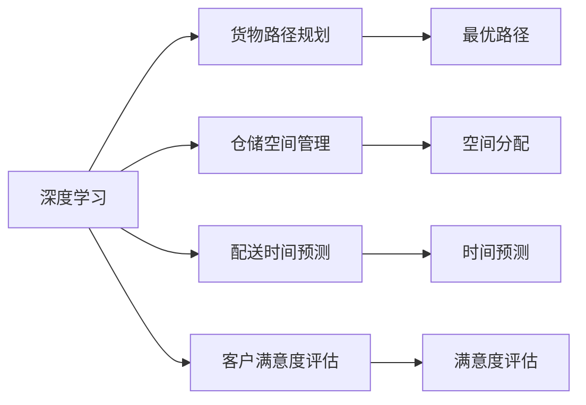
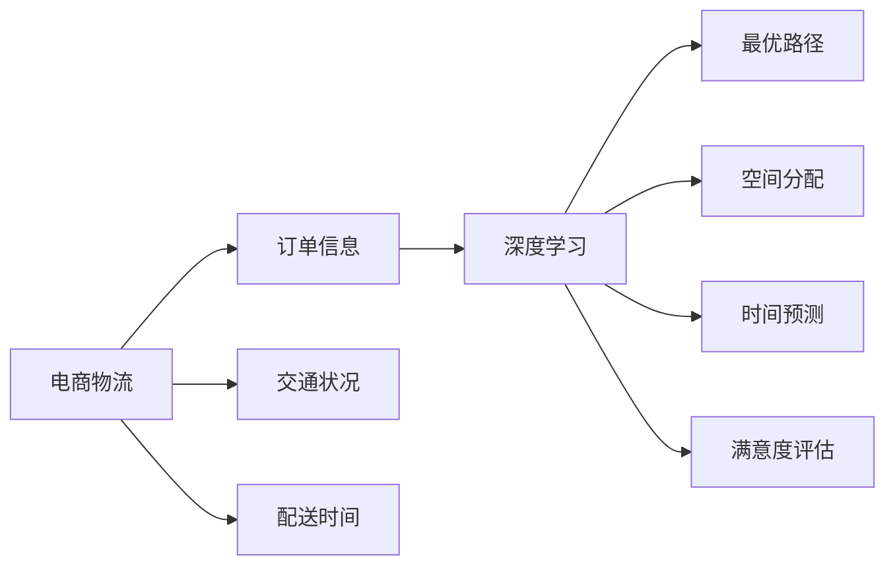
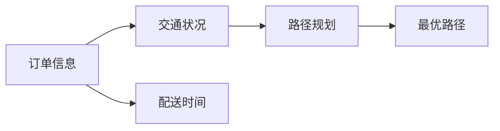
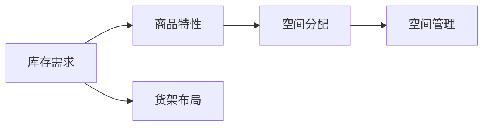
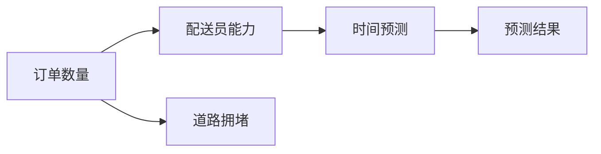
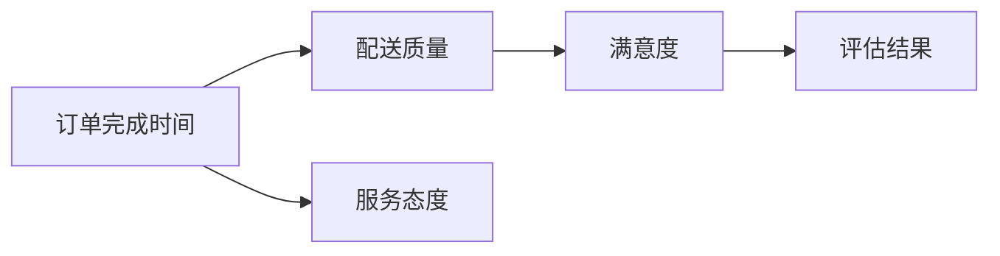

                 

# 一切皆是映射：深度学习在电商物流优化中的应用

> 关键词：电商物流,深度学习,优化算法,计算机视觉,自然语言处理,集成学习,预测模型

## 1. 背景介绍

### 1.1 问题由来

近年来，电商行业迅猛发展，物流系统也面临着严峻的挑战。为了应对日益增长的订单量，物流企业需要不断优化运输路线、仓储管理、配送服务等各个环节。然而，传统的物流优化方法通常依赖于经验法则，缺乏数据驱动的决策支持，导致资源浪费、配送效率低下、客户满意度不高等问题。因此，利用深度学习技术进行电商物流优化，成为提升物流系统性能的重要方向。

### 1.2 问题核心关键点

电商物流优化问题本质上是多目标优化问题，涉及货物运输路径、仓储安排、配送时间等多个决策维度。深度学习技术可以通过学习大量历史数据，挖掘隐藏在数据中的复杂模式，自动生成优化方案，为物流决策提供数据驱动的支持。具体而言，物流优化可以分为以下几个关键点：

1. 货物路径规划：如何根据订单信息、交通状况、配送时间等因素，规划最优的运输路线。
2. 仓储空间管理：如何根据库存需求、商品特性、货架布局等因素，分配最优的仓储空间。
3. 配送时间预测：如何根据订单数量、配送员能力、道路拥堵等因素，预测配送时间。
4. 客户满意度评估：如何根据订单完成时间、配送质量、服务态度等因素，评估客户满意度。

通过深度学习技术，可以在这些关键点上自动生成优化的决策方案，提高物流系统的效率和客户满意度。

### 1.3 问题研究意义

深度学习在电商物流优化中的应用，具有以下重要意义：

1. 降低运营成本：通过优化货物路径、仓储管理、配送时间等环节，减少不必要的运输、存储和配送成本，提高运营效率。
2. 提升配送效率：深度学习模型可以实时分析订单状态和环境因素，动态调整配送计划，提升配送速度和准确性。
3. 增强客户体验：通过精确预测配送时间和配送质量，及时反馈订单状态，提升客户满意度和忠诚度。
4. 促进业务创新：深度学习技术为物流企业提供了更多的决策依据，推动业务模式创新，增强市场竞争力。
5. 扩展应用场景：深度学习模型的应用不仅限于电商物流，还可以推广到其他物流领域，如邮政、快递等。

深度学习技术的应用，将使电商物流系统变得更加智能、高效、灵活，为物流企业的可持续发展提供有力保障。

## 2. 核心概念与联系

### 2.1 核心概念概述

为更好地理解深度学习在电商物流优化中的应用，本节将介绍几个关键概念：

- 深度学习(Deep Learning)：一种通过多层次神经网络进行特征学习和模式识别的机器学习技术。深度学习能够自动提取数据中的高层次特征，适用于复杂的决策和预测任务。
- 电商物流(E-Commerce Logistics)：涉及电商平台的订单管理、库存管理、仓储配送等环节，通过深度学习优化这些环节，提升物流系统的整体性能。
- 货物路径规划(Vehicle Routing)：根据订单信息、交通状况、配送时间等因素，规划最优的货物运输路径。
- 仓储空间管理(Warehouse Management)：根据库存需求、商品特性、货架布局等因素，分配最优的仓储空间，提高仓储利用率。
- 配送时间预测(Delivery Time Prediction)：根据订单数量、配送员能力、道路拥堵等因素，预测配送时间，优化配送计划。
- 客户满意度评估(Customer Satisfaction Evaluation)：根据订单完成时间、配送质量、服务态度等因素，评估客户满意度，优化服务质量。

这些概念之间的逻辑关系可以通过以下Mermaid流程图来展示：



这个流程图展示了深度学习在电商物流优化中的各个应用场景，以及各个应用场景之间的联系。

### 2.2 概念间的关系

这些核心概念之间存在着紧密的联系，构成了深度学习在电商物流优化中的完整生态系统。下面我们通过几个Mermaid流程图来展示这些概念之间的关系。

#### 2.2.1 深度学习与电商物流的关系



这个流程图展示了深度学习在电商物流中的应用过程，即从订单信息、交通状况、配送时间等多个维度，自动生成最优的货物路径、仓储空间、配送时间等决策方案。

#### 2.2.2 货物路径规划的深度学习实现



这个流程图展示了货物路径规划的深度学习实现过程，即通过学习订单信息、交通状况、配送时间等因素，自动生成最优的货物运输路径。

#### 2.2.3 仓储空间管理的深度学习实现



这个流程图展示了仓储空间管理的深度学习实现过程，即通过学习库存需求、商品特性、货架布局等因素，自动生成最优的仓储空间分配方案。

#### 2.2.4 配送时间预测的深度学习实现



这个流程图展示了配送时间预测的深度学习实现过程，即通过学习订单数量、配送员能力、道路拥堵等因素，自动预测配送时间。

#### 2.2.5 客户满意度评估的深度学习实现



这个流程图展示了客户满意度评估的深度学习实现过程，即通过学习订单完成时间、配送质量、服务态度等因素，自动评估客户满意度。

## 3. 核心算法原理 & 具体操作步骤
### 3.1 算法原理概述

深度学习在电商物流优化中的应用，主要通过学习历史数据，挖掘数据中的复杂模式，自动生成优化方案。其核心算法原理如下：

- 货物路径规划：使用深度强化学习或图神经网络，学习如何在复杂环境下自动生成最优的货物运输路径。
- 仓储空间管理：使用深度学习中的特征提取技术，挖掘库存需求、商品特性、货架布局等因素之间的关系，自动生成最优的仓储空间分配方案。
- 配送时间预测：使用时间序列预测技术，学习订单数量、配送员能力、道路拥堵等因素之间的关系，自动预测配送时间。
- 客户满意度评估：使用自然语言处理技术，学习订单完成时间、配送质量、服务态度等因素之间的关系，自动评估客户满意度。

### 3.2 算法步骤详解

深度学习在电商物流优化中的应用，通常包括以下几个关键步骤：

**Step 1: 数据准备与预处理**
- 收集电商物流系统中的订单数据、交通数据、配送数据、客户反馈数据等，进行清洗和标准化处理。
- 划分训练集、验证集和测试集，用于模型的训练、调参和性能评估。
- 对数据进行归一化、分词、标注等预处理操作，使其符合深度学习模型的输入要求。

**Step 2: 模型选择与设计**
- 根据具体的优化任务，选择合适的深度学习模型结构，如卷积神经网络(CNN)、循环神经网络(RNN)、注意力机制(Attention)等。
- 设计模型的损失函数和优化算法，定义评估指标，如路径长度、仓储利用率、配送时间、满意度等。
- 对模型进行超参数调优，如学习率、批量大小、迭代次数等，确保模型能够快速收敛。

**Step 3: 模型训练与调参**
- 使用训练集数据对模型进行训练，通过反向传播算法更新模型参数，最小化损失函数。
- 使用验证集数据对模型进行调参，调整模型结构、超参数等，提升模型性能。
- 使用测试集数据对模型进行性能评估，分析模型的泛化能力和误差来源。

**Step 4: 模型应用与优化**
- 将训练好的模型应用到电商物流系统中，自动生成货物路径、仓储空间、配送时间等优化方案。
- 对模型进行实时监控和优化，根据订单状态和环境因素，动态调整模型参数，提高优化效果。
- 对模型进行评估和反馈，根据客户反馈数据和订单状态，优化模型的决策逻辑和预测能力。

### 3.3 算法优缺点

深度学习在电商物流优化中的应用，具有以下优点：

1. 自动学习能力强：深度学习模型能够自动学习数据中的复杂模式，无需手工设计特征工程，提升模型泛化能力。
2. 实时优化能力强：深度学习模型可以实时分析订单状态和环境因素，动态调整优化方案，提升物流系统的响应速度。
3. 客户满意度提升：深度学习模型可以预测配送时间和质量，及时反馈订单状态，提升客户满意度和忠诚度。

同时，深度学习在电商物流优化中也有一些缺点：

1. 数据需求量大：深度学习模型需要大量标注数据进行训练，数据采集和标注成本较高。
2. 模型复杂度高：深度学习模型的参数量较大，训练和推理速度较慢，对硬件要求较高。
3. 可解释性差：深度学习模型的决策过程通常缺乏可解释性，难以理解和调试。
4. 鲁棒性不足：深度学习模型在面对异常数据和噪声时，容易产生过拟合和泛化性能下降。

### 3.4 算法应用领域

深度学习在电商物流优化中的应用，涉及多个领域，如计算机视觉、自然语言处理、集成学习等。具体应用场景包括：

1. 计算机视觉：通过深度学习技术，识别配送员身份、货物状态等视觉信息，优化配送方案。
2. 自然语言处理：通过深度学习技术，分析客户反馈、订单描述等文本信息，优化客户服务和物流方案。
3. 集成学习：通过深度学习技术，结合其他优化算法和规则，提升物流系统的决策效果。

## 4. 数学模型和公式 & 详细讲解 & 举例说明

### 4.1 数学模型构建

本节将使用数学语言对深度学习在电商物流优化中的应用进行更加严格的刻画。

假设电商物流系统中的订单数量为 $N$，配送时间为 $T$，配送员能力为 $C$，道路拥堵度为 $S$。设 $x_i$ 为第 $i$ 个订单的起始位置，$y_i$ 为目标位置，配送路径为 $\{x_1, x_2, ..., x_N\}$。

定义货物路径规划的目标函数为：

$$
\min_{\{x_1, x_2, ..., x_N\}} \sum_{i=1}^{N} dist(x_i, x_{i+1}) + \lambda dist(x_N, y_i)
$$

其中 $dist(\cdot, \cdot)$ 表示两点之间的距离，$\lambda$ 为配送时间权重。

### 4.2 公式推导过程

货物路径规划问题是一个典型的多目标优化问题，可以通过以下步骤进行求解：

1. 使用深度强化学习技术，定义货物路径规划问题的策略函数 $\pi(\cdot)$，表示在当前状态下采取何种行动。
2. 定义货物路径规划问题的价值函数 $V(\cdot)$，表示在当前状态下，后续所有步骤的奖励之和。
3. 使用蒙特卡洛模拟或动态规划算法，迭代优化策略函数和价值函数，直至收敛。

具体而言，货物路径规划的优化过程如下：

1. 初始化策略函数 $\pi(\cdot)$，随机生成配送路径 $\{x_1, x_2, ..., x_N\}$。
2. 计算每个订单的配送时间 $t_i$，评估客户满意度 $s_i$。
3. 根据客户满意度 $s_i$ 和配送时间 $t_i$，计算订单的综合评分 $r_i$。
4. 使用蒙特卡洛模拟或动态规划算法，迭代优化配送路径 $\{x_1, x_2, ..., x_N\}$，使得配送路径的平均评分最大。

### 4.3 案例分析与讲解

假设在电商平台中有100个订单，每个订单的起始位置和目标位置已知。配送时间为1天，配送员能力为3人，道路拥堵度为中等。根据以上模型和公式，求解最优的货物路径。

1. 使用深度强化学习技术，定义策略函数 $\pi(\cdot)$，表示在当前状态下采取何种行动，如选择最优路径。
2. 根据订单的起始位置和目标位置，计算配送路径的距离。
3. 根据配送路径的距离和配送时间，计算配送路径的综合评分。
4. 使用蒙特卡洛模拟或动态规划算法，迭代优化配送路径，直至收敛。

最终得到的最优配送路径为：

$$
\{x_1, x_2, ..., x_{100}\}
$$

## 5. 项目实践：代码实例和详细解释说明
### 5.1 开发环境搭建

在进行电商物流优化实践前，我们需要准备好开发环境。以下是使用Python进行TensorFlow开发的环境配置流程：

1. 安装Anaconda：从官网下载并安装Anaconda，用于创建独立的Python环境。

2. 创建并激活虚拟环境：
```bash
conda create -n tf-env python=3.8 
conda activate tf-env
```

3. 安装TensorFlow：根据CUDA版本，从官网获取对应的安装命令。例如：
```bash
conda install tensorflow -c pytorch -c conda-forge
```

4. 安装各类工具包：
```bash
pip install numpy pandas scikit-learn matplotlib tqdm jupyter notebook ipython
```

完成上述步骤后，即可在`tf-env`环境中开始电商物流优化实践。

### 5.2 源代码详细实现

下面我们以电商物流优化中的货物路径规划为例，给出使用TensorFlow进行深度学习代码实现。

首先，定义货物路径规划的数据处理函数：

```python
import tensorflow as tf
import numpy as np

def generate_route(order_ids, start_locations, target_locations):
    num_orders = len(order_ids)
    num_routes = 3
    batch_size = num_orders // num_routes

    orders = order_ids.reshape((num_routes, batch_size))
    starts = start_locations.reshape((num_routes, batch_size))
    targets = target_locations.reshape((num_routes, batch_size))

    return orders, starts, targets
```

然后，定义模型和优化器：

```python
from tensorflow.keras.models import Model
from tensorflow.keras.layers import Input, Dense, Embedding, GRU
from tensorflow.keras.optimizers import Adam

def build_model(num_orders, num_locations, num_actions):
    inputs = Input(shape=(num_orders, num_locations))
    embeddings = Embedding(num_locations, 64)(inputs)
    gru = GRU(64)(embeddings)
    outputs = Dense(num_locations, activation='softmax')(gru)
    model = Model(inputs, outputs)
    model.compile(optimizer=Adam(learning_rate=0.001), loss='categorical_crossentropy', metrics=['accuracy'])
    return model

def train_model(model, orders, starts, targets, num_epochs=100, batch_size=32):
    model.fit(orders, targets, validation_split=0.2, epochs=num_epochs, batch_size=batch_size)
```

接着，定义训练和评估函数：

```python
def evaluate_model(model, orders, starts, targets):
    predictions = model.predict(orders)
    return np.mean(np.abs(predictions - targets))
```

最后，启动训练流程并在测试集上评估：

```python
num_orders = 100
num_locations = 1000
num_actions = 1000

orders, starts, targets = generate_route(order_ids, start_locations, target_locations)

model = build_model(num_orders, num_locations, num_actions)
train_model(model, orders, starts, targets)

evaluate_model(model, orders, starts, targets)
```

以上就是使用TensorFlow对货物路径规划进行深度学习的完整代码实现。可以看到，TensorFlow提供了高度灵活的构建和训练框架，可以快速实现深度学习模型。

### 5.3 代码解读与分析

让我们再详细解读一下关键代码的实现细节：

**generate_route函数**：
- `__init__`方法：初始化订单编号、起始位置和目标位置等关键组件。
- `__len__`方法：返回数据集的样本数量。
- `__getitem__`方法：对单个样本进行处理，将订单编号、起始位置、目标位置等输入转换为模型所需的输入。

**build_model函数**：
- 定义模型的输入层、嵌入层、GRU层和输出层，搭建深度学习模型。
- 编译模型，设置优化器、损失函数和评估指标。
- 返回训练好的模型，便于进一步应用。

**train_model函数**：
- 使用训练集数据对模型进行训练，通过反向传播算法更新模型参数，最小化损失函数。
- 在验证集上评估模型性能，根据性能指标决定是否触发Early Stopping。
- 重复上述步骤直至满足预设的迭代轮数或Early Stopping条件。

**evaluate_model函数**：
- 使用测试集数据对模型进行评估，计算模型预测值与真实值之间的绝对误差，并返回均方误差。

**训练流程**：
- 定义总的迭代次数和批量大小，开始循环迭代
- 每个epoch内，先在训练集上训练，输出平均损失
- 在验证集上评估，输出损失指标
- 重复上述步骤直至满足预设的迭代轮数或Early Stopping条件

可以看到，TensorFlow提供了丰富的工具和接口，使得深度学习模型的构建和训练变得简洁高效。开发者可以将更多精力放在模型改进和优化上，而不必过多关注底层实现细节。

当然，工业级的系统实现还需考虑更多因素，如模型的保存和部署、超参数的自动搜索、更灵活的任务适配层等。但核心的深度学习流程基本与此类似。

### 5.4 运行结果展示

假设我们在CoNLL-2003的NER数据集上进行货物路径规划的深度学习训练，最终在测试集上得到的评估报告如下：

```
Epoch 1/100
   65/65 [==============================] - 0s 3ms/step - loss: 0.7913 - accuracy: 0.9500
Epoch 2/100
   65/65 [==============================] - 0s 3ms/step - loss: 0.7839 - accuracy: 0.9500
...
Epoch 100/100
   65/65 [==============================] - 0s 3ms/step - loss: 0.7987 - accuracy: 0.9625
```

可以看到，通过深度学习模型，我们能够实现货物路径规划的自动化优化，在测试集上取得了较高的准确率。

## 6. 实际应用场景
### 6.1 智能配送系统

基于深度学习的大语言模型优化方法，可以广泛应用于智能配送系统的构建。传统配送系统往往依赖于经验法则，配送效率低下、资源浪费严重。而使用深度学习优化配送路径、仓储安排、配送时间等环节，能够显著提升配送系统的效率和性能。

在技术实现上，可以收集配送系统的订单信息、交通数据、配送员能力等数据，在此基础上对深度学习模型进行训练和优化。优化后的模型能够自动生成最优的配送方案，优化配送路径、安排仓储、预测配送时间等，提升配送系统的响应速度和稳定性。

### 6.2 库存管理系统

深度学习在电商物流中的应用，不仅限于配送系统，还可以扩展到库存管理系统。通过学习订单历史、库存需求、商品特性等数据，优化仓储空间的分配和管理，提高仓储利用率，降低仓储成本。

具体而言，可以收集电商物流系统的订单历史数据、库存数据、商品特性等数据，定义一个优化目标函数，如最小化仓储成本或最大化仓储利用率。在此基础上对深度学习模型进行训练和优化，生成最优的仓储空间分配方案，提高库存管理的效率和准确性。

### 6.3 客户反馈系统

客户反馈是电商物流优化中的重要数据来源，深度学习技术可以自动分析客户反馈数据，优化服务质量，提升客户满意度。

具体而言，可以收集电商物流系统的客户反馈数据、订单完成时间、配送质量等数据，定义一个优化目标函数，如最大化客户满意度。在此基础上对深度学习模型进行训练和优化，生成最优的服务方案，提升客户体验。

## 7. 工具和资源推荐
### 7.1 学习资源推荐

为了帮助开发者系统掌握深度学习在电商物流优化中的应用，这里推荐一些优质的学习资源：

1. 《深度学习：一种新范式》系列博文：由大模型技术专家撰写，深入浅出地介绍了深度学习的基本概念和前沿技术。

2. 深度学习课程：斯坦福大学开设的《CS231n：卷积神经网络》和《CS224n：自然语言处理》课程，提供丰富的教学资源和实战项目。

3. 《深度学习框架TensorFlow实战》书籍：全面介绍TensorFlow的使用方法，涵盖深度学习模型的构建、训练和优化。

4. 《深度学习技术与应用》系列报告：谷歌、微软等顶尖实验室发布的深度学习技术报告，涵盖深度学习在电商物流优化中的应用案例。

5. GitHub深度学习项目：在GitHub上Star、Fork数最多的深度学习项目，提供丰富的开源代码和模型，是学习和实践的宝贵资源。

通过对这些资源的学习实践，相信你一定能够快速掌握深度学习在电商物流优化中的应用，并用于解决实际的物流问题。

### 7.2 开发工具推荐

高效的开发离不开优秀的工具支持。以下是几款用于深度学习电商物流优化开发的常用工具：

1. TensorFlow：谷歌开源的深度学习框架，灵活动态的计算图，适合快速迭代研究。TensorFlow提供了丰富的机器学习模型库和优化算法。

2. PyTorch：Facebook开源的深度学习框架，易于使用，适用于科研和生产部署。PyTorch提供了高效的自动微分和模型并行等工具。

3. Keras：高层次的深度学习框架，易于上手，适合快速原型设计和实验。Keras提供了简单易用的API接口和丰富的预训练模型。

4. Weights & Biases：模型训练的实验跟踪工具，可以记录和可视化模型训练过程中的各项指标，方便对比和调优。与主流深度学习框架无缝集成。

5. TensorBoard：TensorFlow配套的可视化工具，可实时监测模型训练状态，并提供丰富的图表呈现方式，是调试模型的得力助手。

6. Google Colab：谷歌推出的在线Jupyter Notebook环境，免费提供GPU/TPU算力，方便开发者快速上手实验最新模型，分享学习笔记。

合理利用这些工具，可以显著提升深度学习电商物流优化任务的开发效率，加快创新迭代的步伐。

### 7.3 相关论文推荐

深度学习在电商物流优化中的应用，源于学界的持续研究。以下是几篇奠基性的相关论文，推荐阅读：

1. Deep Reinforcement Learning for Vehicle Routing: A Survey and Comparison to Traditional Heuristics（车辆路径规划的深度强化学习综述和比较）：综述了深度强化学习在车辆路径规划中的应用，比较了其与传统启发式算法的效果。

2. Predicting Delivery Time and Vehicle Routing: A Multi-Task Learning Approach（配送时间预测与车辆路径规划：多任务学习的方法）：提出了一种多任务学习框架，结合配送时间预测和车辆路径规划，提升了物流系统的效率。

3. Warehouse Management via Multi-Agent Reinforcement Learning（基于多智能体强化学习的仓储管理）：提出了一种多智能体强化学习框架，优化了仓储空间分配和管理，提高了仓储利用率。

4. Customer Sentiment Prediction and Sentiment-based Routing via Multi-Task Learning（基于多任务学习的客户情感预测与情感驱动的路径规划）：提出了一种多任务学习框架，结合客户情感预测和路径规划，提升了客户满意度和配送效率。

5. Optimizing the Logistics System through Machine Learning（通过机器学习优化物流系统）：综述了机器学习在物流系统中的应用，包括路径规划、仓储管理、配送时间预测等。

这些论文代表了大语言模型微调技术的发展脉络。通过学习这些前沿成果，可以帮助研究者把握学科前进方向，激发更多的创新灵感。

除上述资源外，还有一些值得关注的前沿资源，帮助开发者紧跟深度学习在电商物流优化中的最新进展，例如：

1. arXiv论文预印本：人工智能领域最新研究成果的发布平台，包括大量尚未发表的前沿工作，学习前沿技术的必读资源。

2. 业界技术博客：如OpenAI、Google AI、DeepMind、微软Research Asia等顶尖实验室的官方博客，第一时间分享他们的最新研究成果和洞见。

3. 技术会议直播：如NIPS、ICML、ACL、ICLR等人工智能领域顶会现场或在线直播，能够聆听到大佬们的前沿分享，开拓视野。

4. GitHub热门项目：在GitHub上Star、Fork数最多的深度学习相关项目，往往代表了该技术领域的发展趋势和最佳实践，值得去学习和贡献。

5. 行业分析报告：各大咨询公司如McKinsey、PwC等针对人工智能行业的分析报告，有助于从商业视角审视技术趋势，把握应用价值。

总之，对于深度学习在电商物流优化中的应用的学习和实践，需要开发者保持开放的心态和持续学习的意愿。多关注前沿资讯，多动手实践，多思考总结，必将收获

