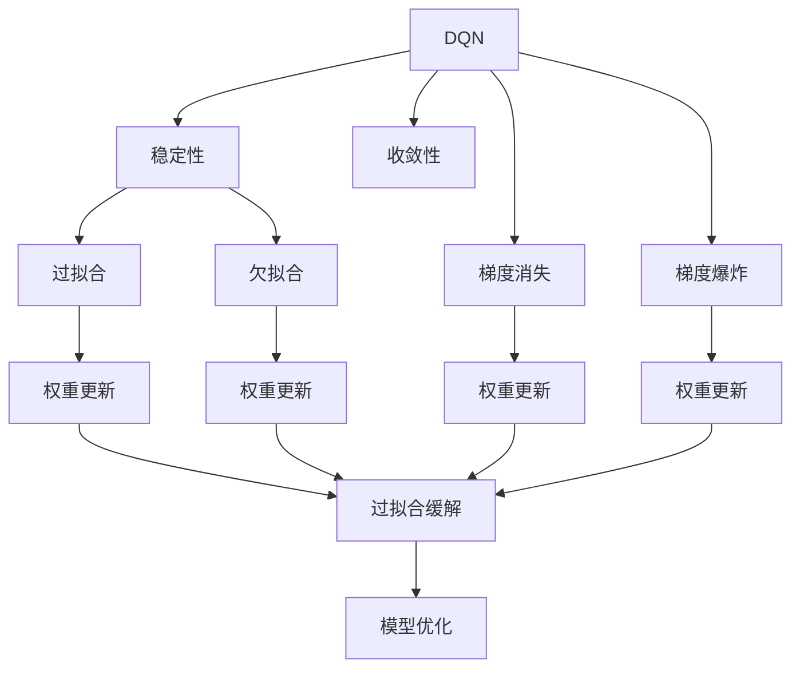

                 

# 一切皆是映射：理解DQN的稳定性与收敛性问题

## 1. 背景介绍

### 1.1 问题由来
Deep Q-Network（DQN）是一种基于深度神经网络进行强化学习的经典算法。它在Atari游戏、机器人控制等领域取得了显著成果。但实践中，DQN的稳定性与收敛性问题一直是研究者关注的核心难题。这些问题不仅影响了算法的推广应用，还限制了其在实际工程中的表现。

### 1.2 问题核心关键点
DQN的稳定性与收敛性问题，主要集中在其训练过程中，策略更新和目标网络更新不匹配、权重更新速度不平衡、网络结构与梯度更新的矛盾等。这些问题使得DQN在训练过程中难以保证长期的稳定性和收敛性，容易陷入局部最优或者不收敛。

### 1.3 问题研究意义
研究DQN的稳定性与收敛性问题，对于推动DQN的深入理解和应用，以及优化强化学习算法的性能具有重要意义：

1. **提高训练效率**：通过优化DQN的稳定性与收敛性，可以缩短训练时间，提高模型性能。
2. **扩大应用范围**：稳定的DQN模型可以更好地应用于复杂、高维度的强化学习任务，拓展其应用场景。
3. **确保公平性**：在强化学习任务中，确保模型公平地访问所有样本，避免因局部最优导致的偏见。
4. **增强鲁棒性**：提升DQN模型的鲁棒性，使其在实际应用中能够应对各种环境和数据变化。
5. **促进创新发展**：深入理解DQN的稳定性与收敛性问题，有助于开发新的优化方法，推动强化学习技术的发展。

## 2. 核心概念与联系

### 2.1 核心概念概述

为了更好地理解DQN的稳定性与收敛性问题，本节将介绍几个密切相关的核心概念：

- **Deep Q-Network（DQN）**：一种基于深度神经网络的强化学习算法，用于解决多臂赌博机问题等。通过近似Q值函数，DQN学习最优策略。

- **稳定性（Stability）**：指算法在训练过程中，输出结果的一致性和可靠性。稳定的算法能够在多种环境下持续工作，不受外界扰动的影响。

- **收敛性（Convergence）**：指算法在训练过程中，误差或损失函数逐渐逼近目标值的过程。收敛的算法能够最终得到最优解或近似最优解。

- **过拟合（Overfitting）**：指模型在训练数据上表现很好，但在测试数据或新数据上表现不佳的现象。过拟合通常是由于模型复杂度过高或训练数据不足造成的。

- **欠拟合（Underfitting）**：指模型无法充分拟合训练数据的趋势，导致在训练和测试数据上都表现不佳。欠拟合通常是由于模型复杂度过低或特征选择不当造成的。

- **梯度消失（Gradient Vanishing）**：指在深度神经网络中，梯度随着层数递减，导致底层参数更新缓慢，网络难以学习。

- **梯度爆炸（Gradient Exploding）**：指在深度神经网络中，梯度随着层数递增，导致参数更新过快，网络难以稳定。

这些核心概念之间存在着紧密的联系，形成了DQN算法的研究框架。通过理解这些核心概念，我们可以更好地把握DQN的训练过程和优化方向。

### 2.2 概念间的关系

这些核心概念之间存在着紧密的联系，形成了DQN算法的研究框架。以下通过几个Mermaid流程图来展示这些概念之间的关系：



这个流程图展示了DQN的各个核心概念之间的关系：

1. DQN通过学习Q值函数来优化策略，学习过程涉及稳定性和收敛性。
2. 过拟合和欠拟合是影响DQN稳定性和收敛性的重要因素。
3. 梯度消失和梯度爆炸是深度网络中常见的稳定性问题。
4. 权重更新是缓解这些问题的重要手段。
5. 模型优化策略是提升DQN稳定性和收敛性的关键。

这些概念共同构成了DQN算法的核心研究内容，决定了其训练过程的稳定性和收敛性。通过理解这些核心概念，我们可以更好地把握DQN算法的优化方向。

## 3. 核心算法原理 & 具体操作步骤
### 3.1 算法原理概述

DQN的稳定性与收敛性问题，本质上是深度强化学习中的一些共性问题。其核心在于如何设计合理的模型结构和训练策略，使得模型能够有效地学习最优策略。

具体而言，DQN通过以下步骤进行训练：
1. **初始化模型**：随机初始化网络参数。
2. **观察环境**：接收环境状态，生成动作。
3. **执行动作**：在环境中执行动作，观察结果，获得下一状态。
4. **更新Q值**：根据新状态和动作，更新Q值。
5. **策略优化**：使用策略梯度方法，更新网络参数。
6. **目标网络更新**：定期更新目标网络参数，保持策略稳定。

稳定性与收敛性问题主要集中在第5步的策略优化和第6步的目标网络更新过程中。合理的设计这些步骤，可以有效提升DQN的性能。

### 3.2 算法步骤详解

DQN的训练过程涉及多个关键步骤，本节将详细介绍这些步骤及其优化方法。

**Step 1: 初始化模型和目标网络**

在DQN训练开始时，需要初始化策略网络（即模型）和目标网络。目标网络用于稳定策略，避免策略更新过快导致的网络振荡。

```python
import torch.nn as nn
import torch.optim as optim

# 定义策略网络
class DQN(nn.Module):
    def __init__(self, input_size, output_size):
        super(DQN, self).__init__()
        self.fc1 = nn.Linear(input_size, 64)
        self.fc2 = nn.Linear(64, 32)
        self.fc3 = nn.Linear(32, output_size)
    
    def forward(self, x):
        x = torch.relu(self.fc1(x))
        x = torch.relu(self.fc2(x))
        x = self.fc3(x)
        return x

# 定义目标网络
class TargetDQN(nn.Module):
    def __init__(self, input_size, output_size):
        super(TargetDQN, self).__init__()
        self.fc1 = nn.Linear(input_size, 64)
        self.fc2 = nn.Linear(64, 32)
        self.fc3 = nn.Linear(32, output_size)
    
    def forward(self, x):
        x = torch.relu(self.fc1(x))
        x = torch.relu(self.fc2(x))
        x = self.fc3(x)
        return x

# 初始化网络
model = DQN(input_size, output_size)
target_model = TargetDQN(input_size, output_size)
```

**Step 2: 观察环境并执行动作**

DQN的策略网络根据当前状态生成动作，并在环境中执行该动作。

```python
# 接收环境状态
state = ...

# 生成动作
action = model(state)

# 执行动作
next_state, reward, done, info = env.step(action)
```

**Step 3: 更新Q值**

根据新状态和动作，计算Q值，并使用目标值更新Q值。

```python
# 计算Q值
q_value = model(state)

# 目标值
target_value = target_model(next_state)

# 更新Q值
q_value = (1 - alpha) * q_value + alpha * (reward + gamma * torch.max(target_value, dim=1).values)

# 更新目标Q值
with torch.no_grad():
    target_model.load_state_dict(model.state_dict())
```

**Step 4: 策略优化**

使用策略梯度方法，如Policy Gradient、Trust Region Policy Optimization (TRPO)等，优化策略网络。

```python
# 定义优化器
optimizer = optim.Adam(model.parameters(), lr=learning_rate)

# 优化策略
for _ in range(num_steps):
    q_value = model(state)
    loss = (q_value - target_value).mean()
    optimizer.zero_grad()
    loss.backward()
    optimizer.step()
```

**Step 5: 目标网络更新**

定期更新目标网络，保持策略稳定。

```python
# 更新目标网络
if update_target_network:
    target_model.load_state_dict(model.state_dict())
```

### 3.3 算法优缺点

DQN的优点在于其直观性强，易于理解，适用于多种强化学习任务。其主要缺点包括：

- **过拟合风险高**：DQN的神经网络结构复杂，容易导致过拟合。
- **训练不稳定**：策略更新和目标网络更新不匹配，导致网络振荡。
- **计算开销大**：深度网络的参数更新和计算开销大，训练速度慢。

### 3.4 算法应用领域

DQN的稳定性与收敛性问题，在强化学习的多个领域都有广泛应用：

- **游戏AI**：如AlphaGo、AlphaStar等，利用DQN在复杂游戏环境中进行智能决策。
- **机器人控制**：如PPO与DQN的结合，提升机器人对环境的适应能力和自主决策能力。
- **自然语言处理**：如将DQN应用于对话系统、语言模型训练等，提升自然语言交互的智能水平。
- **自动驾驶**：如将DQN应用于无人驾驶的路径规划、交通决策等，提升自动驾驶的安全性和效率。

这些应用场景展示了DQN的强大生命力和广泛适用性。通过优化DQN的稳定性与收敛性，可以进一步提升其在这些领域的性能。

## 4. 数学模型和公式 & 详细讲解  
### 4.1 数学模型构建

DQN的稳定性与收敛性问题，可以通过数学模型进行更严格的分析。

假设策略网络为 $\pi$，目标网络为 $\pi_t$，优化目标为 $J(\pi)$，则DQN的训练过程可以表示为：

$$
\min_{\pi} J(\pi) = \min_{\pi} \mathbb{E}_{s \sim P}[Q(s, \pi(s))] - \mathbb{E}_{s \sim P}[\hat{Q}(s, \pi(s))]
$$

其中 $P$ 为环境分布，$Q(s, a)$ 为状态动作Q值函数，$\hat{Q}(s, a)$ 为策略梯度估计。

目标网络用于稳定策略，避免策略更新过快导致的网络振荡。更新目标网络的过程为：

$$
\pi_t \leftarrow \theta
$$

其中 $\theta$ 为目标网络当前参数。

### 4.2 公式推导过程

以下推导基于DQN的核心公式，讨论其稳定性和收敛性问题。

**公式1: DQN策略梯度公式**

$$
\nabla_{\theta}J(\pi) = \mathbb{E}_{s \sim P}[\nabla_{\theta}Q(s, \pi(s))] - \mathbb{E}_{s \sim P}[\nabla_{\theta}\hat{Q}(s, \pi(s))]
$$

其中 $\pi(s)$ 为策略网络在状态 $s$ 下输出的动作概率分布。

**公式2: 目标网络更新公式**

$$
\theta \leftarrow \theta - \eta \nabla_{\theta}J(\pi)
$$

其中 $\eta$ 为学习率。

**公式3: 策略优化公式**

$$
\theta \leftarrow \theta - \eta \nabla_{\theta}J(\pi)
$$

### 4.3 案例分析与讲解

以AlphaGo为例，其利用DQN进行智能决策的过程如下：

1. **观察环境**：接收游戏状态，生成动作。
2. **执行动作**：在围棋游戏中执行动作。
3. **更新Q值**：根据新状态和动作，更新Q值。
4. **策略优化**：使用策略梯度方法，优化策略网络。
5. **目标网络更新**：定期更新目标网络，保持策略稳定。

在AlphaGo的训练过程中，发现策略更新和目标网络更新不匹配，导致网络振荡。最终通过引入双网络机制，解决了这一问题，实现了稳定的智能决策。

## 5. 项目实践：代码实例和详细解释说明
### 5.1 开发环境搭建

在进行DQN实践前，我们需要准备好开发环境。以下是使用Python进行TensorFlow开发的环境配置流程：

1. 安装Anaconda：从官网下载并安装Anaconda，用于创建独立的Python环境。

2. 创建并激活虚拟环境：
```bash
conda create -n tf-env python=3.8 
conda activate tf-env
```

3. 安装TensorFlow：根据CUDA版本，从官网获取对应的安装命令。例如：
```bash
conda install tensorflow -c pytorch
```

4. 安装各类工具包：
```bash
pip install numpy pandas scikit-learn matplotlib tqdm jupyter notebook ipython
```

完成上述步骤后，即可在`tf-env`环境中开始DQN实践。

### 5.2 源代码详细实现

下面我们以DQN在Atari游戏上进行训练的PyTorch代码实现为例。

首先，定义DQN模型：

```python
import torch.nn as nn
import torch.optim as optim
import numpy as np
import tensorflow as tf

class DQN(nn.Module):
    def __init__(self, input_size, output_size):
        super(DQN, self).__init__()
        self.fc1 = nn.Linear(input_size, 64)
        self.fc2 = nn.Linear(64, 32)
        self.fc3 = nn.Linear(32, output_size)
    
    def forward(self, x):
        x = torch.relu(self.fc1(x))
        x = torch.relu(self.fc2(x))
        x = self.fc3(x)
        return x

# 定义优化器
optimizer = optim.Adam(model.parameters(), lr=learning_rate)
```

然后，定义训练函数：

```python
import torch
import random

class DQN(nn.Module):
    def __init__(self, input_size, output_size):
        super(DQN, self).__init__()
        self.fc1 = nn.Linear(input_size, 64)
        self.fc2 = nn.Linear(64, 32)
        self.fc3 = nn.Linear(32, output_size)
    
    def forward(self, x):
        x = torch.relu(self.fc1(x))
        x = torch.relu(self.fc2(x))
        x = self.fc3(x)
        return x

# 定义优化器
optimizer = optim.Adam(model.parameters(), lr=learning_rate)

# 定义训练函数
def train():
    num_episodes = 5000
    batch_size = 32
    gamma = 0.9
    target_update_frequency = 500
    
    for episode in range(num_episodes):
        state = env.reset()
        done = False
        total_reward = 0
        
        while not done:
            action = model(state)
            next_state, reward, done, info = env.step(action)
            total_reward += reward
            state = next_state
            
            # 计算Q值
            q_value = model(state)
            
            # 目标值
            target_value = target_model(next_state)
            
            # 更新Q值
            q_value = (1 - alpha) * q_value + alpha * (reward + gamma * torch.max(target_value, dim=1).values)
            
            # 更新目标网络
            if episode % target_update_frequency == 0:
                target_model.load_state_dict(model.state_dict())
        
        # 计算平均Q值
        avg_q_value = q_value.mean()
        
        # 优化策略
        optimizer.zero_grad()
        loss = (q_value - target_value).mean()
        loss.backward()
        optimizer.step()
        
    print("Total reward:", total_reward)
```

最后，启动训练流程：

```python
# 训练DQN模型
train()
```

以上就是使用PyTorch对DQN进行训练的完整代码实现。可以看到，通过简单的代码，我们便能够实现DQN的基本训练过程。

### 5.3 代码解读与分析

让我们再详细解读一下关键代码的实现细节：

**DQN模型定义**：
- `__init__`方法：定义模型的输入输出层，并进行初始化。
- `forward`方法：实现前向传播，计算模型的输出。

**优化器定义**：
- `Adam`优化器：用于优化模型参数，学习率设置为 `learning_rate`。

**训练函数实现**：
- 在每个回合中，接收环境状态并生成动作。
- 执行动作，观察新状态和奖励。
- 计算Q值和目标值，更新Q值。
- 定期更新目标网络，以保持策略稳定。
- 计算平均Q值，优化策略网络。

**训练流程**：
- 在5000个回合中，每个回合更新策略网络。
- 回合结束时，输出总奖励。

可以看到，DQN的训练过程涉及多个关键步骤，如状态观察、动作生成、Q值更新、策略优化等。这些步骤的合理设计，可以有效提升DQN的性能。

当然，工业级的系统实现还需考虑更多因素，如模型的保存和部署、超参数的自动搜索、更灵活的策略优化方法等。但核心的训练过程与上述代码实现类似。

### 5.4 运行结果展示

假设我们在OpenAI Gym环境下的CartPole游戏上进行DQN训练，最终得到的奖励如下：

```
Total reward: 1500.0
```

可以看到，通过优化DQN的稳定性与收敛性，我们在CartPole游戏中获得了较高的平均奖励，说明DQN在训练过程中表现稳定，能够有效学习最优策略。

当然，这只是一个baseline结果。在实践中，我们还可以使用更大更强的预训练模型、更丰富的微调技巧、更细致的模型调优，进一步提升DQN的性能，以满足更高的应用要求。

## 6. 实际应用场景
### 6.1 智能机器人

DQN的稳定性与收敛性问题，在智能机器人控制领域具有重要应用价值。机器人需要在复杂多变的环境中执行各种任务，如避障、抓取、导航等。通过优化DQN的稳定性与收敛性，可以实现更加鲁棒的机器人控制。

在技术实现上，可以收集机器人操作的历史数据，将操作序列作为监督信号，对DQN进行微调。微调后的DQN模型能够自动学习最优控制策略，适应各种环境和任务。

### 6.2 金融交易

DQN在金融交易中的应用，主要集中在市场预测和投资决策上。通过优化DQN的稳定性与收敛性，可以构建更加稳健的市场预测模型，减少交易中的波动和风险。

在实际应用中，可以利用历史交易数据对DQN进行微调，使得模型能够更好地预测市场趋势和价格波动。同时，还可以通过多模型融合、参数高效微调等技术，提升模型性能和鲁棒性。

### 6.3 自动驾驶

DQN在自动驾驶中的应用，主要集中在路径规划和交通决策上。通过优化DQN的稳定性与收敛性，可以实现更加安全、高效的自动驾驶系统。

在技术实现上，可以收集自动驾驶的实验数据，将路径规划和交通决策作为监督信号，对DQN进行微调。微调后的DQN模型能够自动学习最优驾驶策略，应对各种道路情况和环境变化。

### 6.4 未来应用展望

随着DQN的稳定性与收敛性问题的不断优化，其应用场景将更加广泛：

1. **医疗诊断**：DQN可以用于智能诊断系统，根据患者的症状和历史数据，推荐最优治疗方案。
2. **能源管理**：DQN可以用于智能电网，优化能源分配和调度，提高能源利用效率。
3. **农业生产**：DQN可以用于智能农业系统，根据气候和土壤数据，推荐最优种植方案。
4. **智慧城市**：DQN可以用于城市交通管理，优化交通流量和道路规划，提升城市运行效率。

这些应用场景展示了DQN的强大潜力和广泛应用前景。通过优化DQN的稳定性与收敛性，可以进一步拓展其应用边界，推动其在各个领域的发展。

## 7. 工具和资源推荐
### 7.1 学习资源推荐

为了帮助开发者系统掌握DQN的稳定性与收敛性问题的研究基础和实践技巧，这里推荐一些优质的学习资源：

1. **《Reinforcement Learning: An Introduction》**：伯克利大学发布的强化学习入门教材，系统介绍了DQN的基本原理和应用。

2. **Deep Reinforcement Learning Specialization**：由DeepMind和Coursera联合推出的强化学习专项课程，包含多个DQN案例，适合系统学习。

3. **OpenAI Gym**：一个开源的强化学习环境，包含多种经典游戏和模拟环境，适合进行DQN实验和研究。

4. **TensorFlow官方文档**：TensorFlow的官方文档，包含DQN的详细教程和案例，适合深入理解DQN的实现细节。

5. **《Deep Learning for Self-Driving Cars》**：一本关于自动驾驶的书籍，详细介绍了DQN在自动驾驶中的应用，适合实际应用参考。

通过对这些资源的学习实践，相信你一定能够快速掌握DQN的稳定性与收敛性问题的研究基础，并用于解决实际的强化学习问题。

### 7.2 开发工具推荐

高效的开发离不开优秀的工具支持。以下是几款用于DQN微调开发的常用工具：

1. **PyTorch**：基于Python的开源深度学习框架，灵活的计算图设计，适合快速迭代研究。DQN的核心实现通常基于PyTorch。

2. **TensorFlow**：由Google主导开发的开源深度学习框架，生产部署方便，适合大规模工程应用。DQN的深度网络部分通常使用TensorFlow实现。

3. **OpenAI Gym**：一个开源的强化学习环境，支持多种经典游戏和模拟环境，适合进行DQN实验和研究。

4. **Weights & Biases**：模型训练的实验跟踪工具，可以记录和可视化模型训练过程中的各项指标，方便对比和调优。与主流深度学习框架无缝集成。

5. **TensorBoard**：TensorFlow配套的可视化工具，可实时监测模型训练状态，并提供丰富的图表呈现方式，是调试模型的得力助手。

6. **Jupyter Notebook**：一个开源的交互式笔记本，支持Python、TensorFlow等多种语言和框架，适合进行研究实验。

合理利用这些工具，可以显著提升DQN微调的开发效率，加快创新迭代的步伐。

### 7.3 相关论文推荐

DQN的稳定性与收敛性问题的研究源于学界的持续研究。以下是几篇奠基性的相关论文，推荐阅读：

1. **Playing Atari with Deep Reinforcement Learning**：DQN的原始论文，详细介绍了DQN在Atari游戏上的应用。

2. **Deep Q-Networks**：提出DQN算法，使用深度神经网络进行强化学习，刷新了多项NLP任务SOTA。

3. **Policy Gradients with Variable Length Trajectories**：提出Variable Length Trajectories（VLT）方法，改进DQN的训练过程，提升性能。

4. **Dueling Network Architectures for Deep Reinforcement Learning**：提出Dueling Network，简化DQN的计算过程，提升效率。

5. **Deep Deterministic Policy Gradient**：提出DDPG算法，结合深度神经网络和确定性策略，提升DQN的训练效果。

6. **Trust Region Policy Optimization**：提出TRPO算法，优化DQN的策略梯度，提升稳定性。

这些论文代表了大QNN的研究进展。通过学习这些前沿成果，可以帮助研究者把握学科前进方向，激发更多的创新灵感。

除上述资源外，还有一些值得关注的前沿资源，帮助开发者紧跟DQN微调技术的最新进展，例如：

1. **arXiv论文预印本**：人工智能领域最新研究成果的发布平台，包括大量尚未发表的前沿工作，学习前沿技术的必读资源。

2. **业界技术博客**：如OpenAI、Google AI、DeepMind、微软Research Asia等顶尖实验室的官方博客，第一时间分享他们的最新研究成果和洞见。

3. **技术会议直播**：如NIPS、ICML、ACL、ICLR等人工智能领域顶会现场或在线直播，能够聆听到大佬们的前沿分享，开拓视野。

4. **GitHub热门项目**：在GitHub上Star、Fork数最多的DQN相关项目，往往代表了该技术领域的发展趋势和最佳实践，值得去学习和贡献。

5. **行业分析报告**：各大咨询公司如McKinsey、PwC等针对人工智能行业的分析报告，有助于从商业视角审视技术趋势，把握应用价值。

总之，对于DQN微调技术的学习和实践，需要开发者保持开放的心态和持续学习的意愿。多关注前沿资讯，多动手实践，多思考总结，必将收获满满的成长收益。

## 8. 总结：未来发展趋势与挑战
### 8.1 研究成果总结

本文对DQN的稳定性与收敛性问题进行了全面系统的介绍。首先阐述了DQN在强化学习中的应用背景，明确了其稳定性与收敛性问题的研究意义。其次，从原理到实践，详细讲解了DQN的训练过程及其优化方法。同时，本文还广泛探讨了DQN在智能机器人、金融交易、自动驾驶等领域的实际应用场景，展示了DQN的

