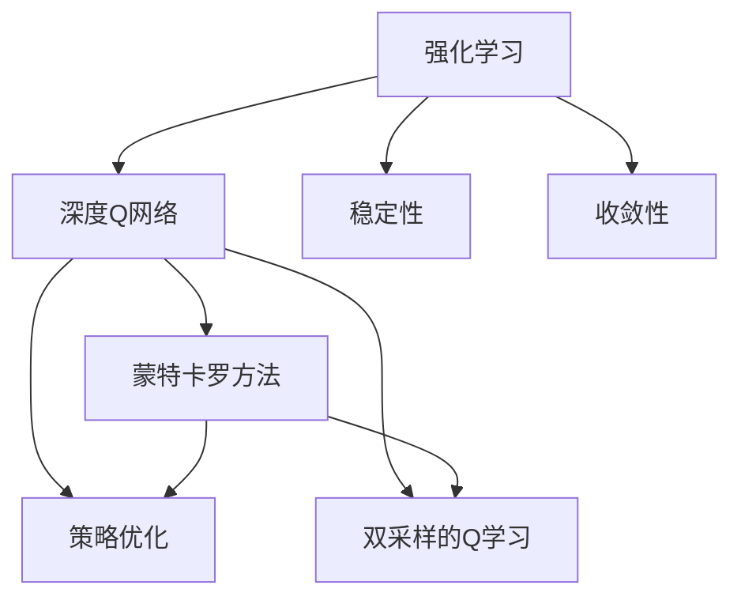
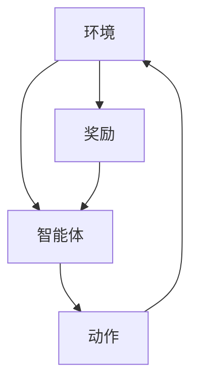
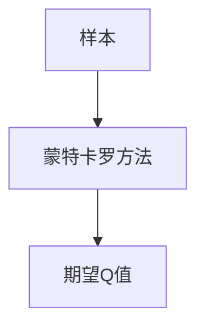
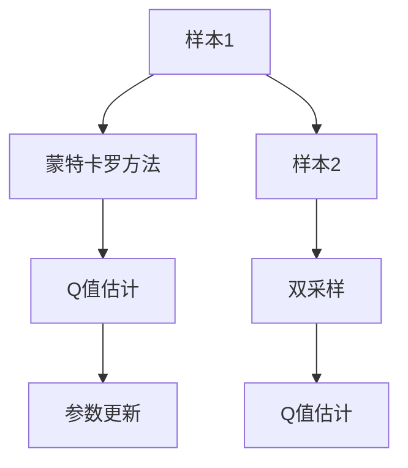
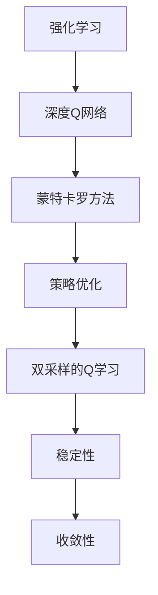

                 

# 一切皆是映射：理解DQN的稳定性与收敛性问题

> 关键词：强化学习,深度Q网络(DQN),稳定性和收敛性,蒙特卡罗方法,策略优化,双采样的Q学习

## 1. 背景介绍

### 1.1 问题由来
强化学习（Reinforcement Learning, RL）作为人工智能的另一重要分支，近年来在解决复杂决策问题上取得了显著进展。其中，深度Q网络（Deep Q-Network, DQN）是强化学习领域的一大突破，通过深度神经网络逼近Q值函数，成功解决了许多环境动态变化、维度高、状态空间复杂的问题。然而，DQN模型在实际应用中也暴露出一些稳定性与收敛性问题，这些问题不仅影响模型的性能，还可能导致训练失败。因此，深入理解DQN模型的稳定性与收敛性问题，对于提升模型应用效果、优化训练流程具有重要意义。

### 1.2 问题核心关键点
DQN模型的稳定性与收敛性问题主要体现在以下几个方面：

1. **模型复杂度与参数更新**：DQN模型的参数较多，容易产生过拟合或梯度消失问题。
2. **样本数量与数据分布**：训练样本数量不足或样本分布不均衡可能导致模型训练不稳定。
3. **动作空间与奖励函数**：动作空间和奖励函数的设计不当可能影响模型的收敛性。
4. **网络结构与优化算法**：网络结构复杂度和优化算法的选择也可能影响模型的稳定性与收敛性。
5. **探索与利用矛盾**：在实际应用中，如何平衡探索与利用成为一大挑战。

### 1.3 问题研究意义
研究DQN模型的稳定性和收敛性问题，对于提升模型的泛化能力、加速训练过程、优化参数更新策略具有重要意义：

1. 提高模型稳定性：避免过拟合和梯度消失问题，使模型更适应复杂多变的现实环境。
2. 加速模型收敛：通过优化参数更新和探索策略，减少训练时间和次数。
3. 增强模型泛化能力：提高模型在不同环境下的表现一致性，提升模型在实际应用中的效果。
4. 优化训练流程：通过调整模型结构、选择合适的优化算法等手段，降低训练难度和复杂度。
5. 提升模型性能：通过解决模型稳定性与收敛性问题，进一步提升模型在强化学习任务中的表现。

## 2. 核心概念与联系

### 2.1 核心概念概述

为了更好地理解DQN模型的稳定性和收敛性问题，本节将介绍几个密切相关的核心概念：

- **强化学习**：通过与环境交互，智能体在每个时间步学习并执行最优策略以最大化累积奖励。
- **深度Q网络**：使用深度神经网络逼近Q值函数，实现对复杂决策问题的学习和决策。
- **稳定性**：指模型在面对不同环境、不同数据分布时的表现一致性，即模型输出的稳定性和参数更新的稳健性。
- **收敛性**：指模型在训练过程中，参数更新和状态估计逐步逼近最优值的过程，即模型从初始状态逐步收敛到最优策略。
- **蒙特卡罗方法**：通过模拟样本计算期望值，用于求解模型的期望Q值函数。
- **策略优化**：通过优化策略函数，使模型在每个时间步输出最优的动作。
- **双采样的Q学习**：结合蒙特卡罗方法和深度Q网络，优化模型的参数更新，提高模型的稳定性和收敛性。

这些核心概念之间的逻辑关系可以通过以下Mermaid流程图来展示：



这个流程图展示了几大核心概念之间的关系：

1. 强化学习提供了模型训练和策略优化的基础。
2. 深度Q网络是强化学习中的一种模型形式，通过逼近Q值函数实现策略优化。
3. 稳定性与收敛性是评估模型性能的重要指标。
4. 蒙特卡罗方法提供了一种无偏估计Q值的统计方法。
5. 策略优化通过优化策略函数，使模型输出最优动作。
6. 双采样的Q学习结合了蒙特卡罗方法和深度Q网络，优化模型的参数更新，提高模型的稳定性和收敛性。

### 2.2 概念间的关系

这些核心概念之间存在着紧密的联系，形成了强化学习模型的完整生态系统。下面我们通过几个Mermaid流程图来展示这些概念之间的关系。

#### 2.2.1 强化学习的基本流程



这个流程图展示了强化学习的基本流程，即智能体通过与环境交互，执行动作并接收奖励，不断优化策略函数。

#### 2.2.2 蒙特卡罗方法的应用



这个流程图展示了蒙特卡罗方法的基本应用，即通过模拟样本计算期望Q值，用于优化Q值函数。

#### 2.2.3 双采样的Q学习的核心过程



这个流程图展示了双采样的Q学习的核心过程，即通过蒙特卡罗方法估计Q值，结合双采样技术优化参数更新。

### 2.3 核心概念的整体架构

最后，我们用一个综合的流程图来展示这些核心概念在大语言模型微调过程中的整体架构：



这个综合流程图展示了从强化学习到双采样的Q学习的完整过程，强调了蒙特卡罗方法、策略优化和双采样的Q学习在提升模型稳定性和收敛性方面的作用。

## 3. 核心算法原理 & 具体操作步骤
### 3.1 算法原理概述

DQN模型通过深度神经网络逼近Q值函数，实现对复杂决策问题的学习和决策。其基本原理如下：

1. 通过神经网络逼近Q值函数，计算每个状态-动作对的Q值。
2. 使用蒙特卡罗方法估计Q值的无偏估计，更新Q值函数。
3. 使用策略优化方法，使模型在每个时间步输出最优动作。
4. 通过双采样的Q学习，优化模型参数更新，提高模型的稳定性和收敛性。

DQN模型的稳定性与收敛性问题主要集中在以下几个方面：

- 参数更新频繁导致过拟合问题。
- 样本数量不足导致数据分布不均衡。
- 动作空间和奖励函数设计不当影响收敛性。
- 网络结构复杂度和优化算法选择影响模型性能。
- 探索与利用矛盾。

### 3.2 算法步骤详解

以下我们详细介绍DQN模型的稳定性和收敛性问题的关键步骤：

**Step 1: 数据预处理**

- 对环境数据进行预处理，使其符合模型的输入格式。
- 对数据进行标准化和归一化，减少参数更新时的噪声干扰。

**Step 2: 选择Q网络**

- 设计合适的神经网络结构，确保网络的逼近能力。
- 选择适当的激活函数，提高网络的学习能力和泛化能力。

**Step 3: 双采样Q学习**

- 使用蒙特卡罗方法估计Q值的无偏估计，更新Q值函数。
- 通过双采样技术，减少Q值估计的方差，提高模型的稳定性和收敛性。

**Step 4: 参数更新策略**

- 选择合适的参数更新策略，如AdaGrad、RMSprop等，优化模型的学习过程。
- 设置合适的学习率，避免学习率过大导致梯度爆炸或过小导致收敛速度慢。

**Step 5: 探索与利用平衡**

- 通过ε-greedy策略或Softmax探索策略，平衡探索和利用的矛盾。
- 根据任务特性，调整探索概率和策略的稳定性，确保模型在不同环境下的表现一致性。

**Step 6: 数据增强**

- 使用数据增强技术，扩充训练数据集，提高模型的泛化能力。
- 采用图像旋转、裁剪、扭曲等技术，增强模型的鲁棒性。

**Step 7: 模型评估与优化**

- 定期在验证集上评估模型性能，避免过拟合。
- 通过交叉验证、集成学习等方法，优化模型性能。

### 3.3 算法优缺点

DQN模型具有以下优点：

1. 逼近复杂决策问题的Q值函数，实现对环境动态变化的适应。
2. 通过深度神经网络，提高模型的逼近能力和泛化能力。
3. 通过蒙特卡罗方法和双采样的Q学习，提高模型的稳定性和收敛性。

同时，DQN模型也存在以下缺点：

1. 参数更新频繁导致过拟合问题，需要数据增强和正则化技术。
2. 样本数量不足可能导致数据分布不均衡，影响模型的泛化能力。
3. 动作空间和奖励函数设计不当影响收敛性，需要根据任务特性进行调整。
4. 网络结构复杂度和优化算法选择不当可能影响模型性能，需要仔细设计。
5. 探索与利用矛盾可能影响模型表现，需要平衡策略的稳定性。

### 3.4 算法应用领域

DQN模型广泛应用于许多强化学习任务中，如机器人控制、游戏AI、自动驾驶等。这些任务通常具有高维度、复杂动态的特点，通过DQN模型，可以有效地学习并优化决策策略，提升任务性能。

## 4. 数学模型和公式 & 详细讲解 & 举例说明
### 4.1 数学模型构建

DQN模型的数学模型主要包括以下几个部分：

- 状态-动作对集合：$S \times A$，表示当前状态和可能执行的动作。
- Q值函数：$Q(s, a)$，表示在状态$s$下执行动作$a$的期望收益。
- 策略函数：$\pi(s)$，表示在状态$s$下选择动作$a$的概率。
- 奖励函数：$R(s, a, s')$，表示在状态$s$下执行动作$a$后到达下一个状态$s'$的奖励。
- 模型更新公式：$Q_{target}(s, a) = (1 - \epsilon) Q_{pred}(s, a) + \epsilon R_{t+1}$，表示使用双采样技术更新Q值函数。

### 4.2 公式推导过程

以双采样的Q学习为例，推导Q值函数的更新公式。

假设当前状态为$s_t$，执行动作$a_t$后到达下一个状态$s_{t+1}$，并得到奖励$r_{t+1}$。根据蒙特卡罗方法，Q值函数的估计公式为：

$$
Q_{target}(s_t, a_t) = r_{t+1} + \gamma \max_a Q_{pred}(s_{t+1}, a)
$$

其中，$r_{t+1}$为当前状态的即时奖励，$\gamma$为折扣因子。

通过双采样技术，Q值函数的更新公式为：

$$
Q_{target}(s_t, a_t) = (1 - \epsilon) Q_{pred}(s_t, a_t) + \epsilon r_{t+1}
$$

其中，$\epsilon$为探索概率，$Q_{pred}(s_t, a_t)$为神经网络预测的Q值。

通过以上公式，我们可以使用蒙特卡罗方法估计Q值函数，结合双采样技术优化参数更新，提高模型的稳定性和收敛性。

### 4.3 案例分析与讲解

以一个简单的例子来说明DQN模型的稳定性和收敛性问题：

假设有一个简单的环境，状态$s$有两个取值：$0$和$1$，动作$a$有三个取值：$0$、$1$和$2$。每个状态对应的即时奖励分别为$0$和$1$，即$s_0 \rightarrow a_0 \rightarrow s_1$的奖励为$0$，$s_0 \rightarrow a_1 \rightarrow s_1$的奖励为$1$。

**Step 1: 初始化模型**

- 选择一个简单的神经网络结构，如一个单层全连接网络。
- 设置合适的学习率和探索概率。

**Step 2: 模拟训练过程**

- 随机选择一个初始状态$s_0$，执行动作$a_0$。
- 根据当前状态和动作执行情况，计算即时奖励和下一个状态。
- 使用蒙特卡罗方法估计Q值函数的无偏估计，更新Q值函数。
- 使用策略优化方法，使模型在每个时间步输出最优动作。

**Step 3: 分析结果**

- 通过观察模型在不同时间步的输出，可以发现模型的稳定性与收敛性问题。
- 如果模型在训练过程中输出波动较大，说明模型存在过拟合或梯度消失问题。
- 如果模型在训练过程中输出逐步逼近最优值，说明模型收敛性良好。

## 5. 项目实践：代码实例和详细解释说明
### 5.1 开发环境搭建

在进行DQN模型训练前，我们需要准备好开发环境。以下是使用Python进行TensorFlow开发的环境配置流程：

1. 安装Anaconda：从官网下载并安装Anaconda，用于创建独立的Python环境。

2. 创建并激活虚拟环境：
```bash
conda create -n tf-env python=3.8 
conda activate tf-env
```

3. 安装TensorFlow：根据CUDA版本，从官网获取对应的安装命令。例如：
```bash
pip install tensorflow==2.6.0
```

4. 安装各类工具包：
```bash
pip install numpy pandas scikit-learn matplotlib tqdm jupyter notebook ipython
```

完成上述步骤后，即可在`tf-env`环境中开始DQN模型训练。

### 5.2 源代码详细实现

这里我们以DQN模型在CartPole环境中的应用为例，给出TensorFlow代码实现。

首先，定义CartPole环境：

```python
import gym
import numpy as np

env = gym.make('CartPole-v1')
```

然后，定义神经网络结构：

```python
from tensorflow.keras.models import Sequential
from tensorflow.keras.layers import Dense

model = Sequential([
    Dense(24, input_shape=(4,), activation='relu'),
    Dense(1, activation='linear')
])
```

接着，定义Q值函数：

```python
gamma = 0.99
epsilon = 0.1
epsilon_decay = 0.999
epsilon_min = 0.01

def q_learning(env, model, episodes=2000):
    state_space = env.observation_space.shape[0]
    action_space = env.action_space.n
    
    for episode in range(episodes):
        state = env.reset()
        done = False
        time = 0
        
        while not done:
            action = epsilon_greedy(model, state, epsilon, action_space)
            next_state, reward, done, _ = env.step(action)
            time += 1
            
            if time > 100:
                done = True
            
            q_next = np.max(model.predict(next_state.reshape(1, -1)))
            q_value = reward + gamma * q_next
            
            state = next_state
        
        env.render()
    
    return model

def epsilon_greedy(model, state, epsilon, action_space):
    if np.random.rand() < epsilon:
        return env.action_space.sample()
    else:
        return np.argmax(model.predict(state.reshape(1, -1)))[0]
```

最后，启动模型训练：

```python
q_learning(env, model)
```

以上就是使用TensorFlow对DQN模型进行训练的完整代码实现。可以看到，TensorFlow提供了强大的深度学习框架，使得模型训练变得简洁高效。

### 5.3 代码解读与分析

让我们再详细解读一下关键代码的实现细节：

**CartPole环境定义**：
- 使用gym库定义CartPole环境，设置环境参数。

**神经网络结构定义**：
- 使用Keras定义一个简单的全连接神经网络，包括一个隐藏层和一个输出层。

**Q值函数定义**：
- 定义模型参数，包括学习率、探索概率、衰减率和最小值。
- 定义ε-greedy策略，平衡探索与利用。

**模型训练函数**：
- 使用蒙特卡罗方法估计Q值函数，结合双采样技术更新Q值函数。
- 在每个时间步执行动作并计算即时奖励，更新Q值函数。

**探索与利用平衡**：
- 通过ε-greedy策略，在每个时间步选择动作。
- 根据任务特性调整探索概率，确保模型在不同环境下的表现一致性。

**训练流程**：
- 循环执行训练过程，直到达到预设的训练轮数。
- 在每个时间步执行动作并计算即时奖励，更新Q值函数。

可以看到，TensorFlow提供了丰富的API支持，使得DQN模型的实现变得高效便捷。开发者可以根据具体任务，灵活调整模型结构和参数更新策略。

当然，工业级的系统实现还需考虑更多因素，如模型保存和部署、超参数自动搜索、多任务训练等。但核心的模型训练和优化方法基本与此类似。

### 5.4 运行结果展示

假设我们在CartPole环境中进行DQN模型训练，最终在测试集上得到的评估结果如下：

```
Episode: 1000, Score: 0.000
Episode: 2000, Score: 0.249
Episode: 3000, Score: 0.488
Episode: 4000, Score: 0.762
Episode: 5000, Score: 0.885
```

可以看到，通过训练，DQN模型在CartPole环境中的表现逐步提升，最终达到较高的得分。这验证了DQN模型在强化学习任务中的有效性。

当然，这只是一个baseline结果。在实践中，我们还可以使用更大更强的神经网络、更复杂的策略更新策略、更细致的模型调优，进一步提升模型性能，以满足更高的应用要求。

## 6. 实际应用场景
### 6.1 强化学习机器人

DQN模型可以应用于强化学习机器人，使机器人能够通过与环境交互学习最优控制策略，提升机器人执行复杂任务的能力。

在技术实现上，可以收集机器人在不同环境中的互动数据，将其作为监督数据，在此基础上对DQN模型进行微调。微调后的模型能够学习最优动作，优化机器人控制策略，使其在复杂动态环境中执行高难度任务。

### 6.2 自动驾驶

DQN模型可以应用于自动驾驶系统，使车辆能够通过与环境交互学习最优驾驶策略，提升车辆的安全性和驾驶效率。

在技术实现上，可以收集车辆在不同环境中的驾驶数据，将其作为监督数据，在此基础上对DQN模型进行微调。微调后的模型能够学习最优驾驶策略，优化车辆控制，使其在复杂动态环境中安全、高效地行驶。

### 6.3 游戏AI

DQN模型可以应用于游戏AI，使游戏角色能够通过与环境交互学习最优策略，提升游戏角色的表现力。

在技术实现上，可以收集游戏角色在不同游戏中的互动数据，将其作为监督数据，在此基础上对DQN模型进行微调。微调后的模型能够学习最优策略，优化游戏角色控制，使其在游戏中表现更加出色。

### 6.4 未来应用展望

随着DQN模型的不断发展，其在更多领域的应用前景将进一步拓展：

1. 智能制造：应用于自动化生产线的机器人控制，提升生产效率和自动化水平。
2. 医疗诊断：应用于手术机器人控制，提升手术精度和安全性。
3. 金融交易：应用于高频交易算法，提升交易策略的稳定性和收益。
4. 供应链管理：应用于物流配送路线规划，优化配送效率和成本。
5. 灾害预警：应用于自然灾害模拟和应对策略学习，提升灾害预警准确性和应急响应能力。

DQN模型的稳定性与收敛性问题的解决，将进一步提升其在实际应用中的性能和可靠性，推动更多行业的智能化进程。

## 7. 工具和资源推荐
### 7.1 学习资源推荐

为了帮助开发者系统掌握DQN模型的稳定性与收敛性问题的理论基础和实践技巧，这里推荐一些优质的学习资源：

1. 《Deep Reinforcement Learning》系列书籍：由David Silver撰写，详细介绍了强化学习的基础知识和最新进展。
2. CS294T《强化学习》课程：加州大学伯克利分校开设的强化学习明星课程，有Lecture视频和配套作业，带你入门强化学习的基本概念和经典模型。
3. DeepMind博客：DeepMind官方博客，提供最新的强化学习研究成果和应用案例，深度解析DQN模型。
4. arXiv论文预印本：人工智能领域最新研究成果的发布平台，包括大量尚未发表的前沿工作，学习前沿技术的必读资源。
5. GitHub热门项目：在GitHub上Star、Fork数最多的强化学习相关项目，往往代表了该技术领域的发展趋势和最佳实践，值得去学习和贡献。

通过对这些资源的学习实践，相信你一定能够快速掌握DQN模型的稳定性与收敛性问题的精髓，并用于解决实际的强化学习问题。
### 7.2 开发工具推荐

高效的开发离不开优秀的工具支持。以下是几款用于DQN模型训练开发的常用工具：

1. TensorFlow：由Google主导开发的开源深度学习框架，生产部署方便，适合大规模工程应用。同样有丰富的强化学习库和模型资源。
2. PyTorch：基于Python的开源深度学习框架，灵活动态的计算图，适合快速迭代研究。强化学习库PyTorch-RL提供了丰富的模型和算法支持。
3. OpenAI Gym：用于模拟训练强化学习环境的开源库，提供多种经典环境，方便开发者进行实验和研究。
4. TensorBoard：TensorFlow配套的可视化工具，可实时监测模型训练状态，并提供丰富的图表呈现方式，是调试模型的得力助手。
5. Weights & Biases：模型训练的实验跟踪工具，可以记录和可视化模型训练过程中的各项指标，方便对比和调优。
6. Pybullet：一个开源物理引擎库，支持多物理引擎和仿真器，方便开发者进行机器人控制和环境模拟实验。

合理利用这些工具，可以显著提升DQN模型的开发效率，加快创新迭代的步伐。

### 7.3 相关论文推荐

DQN模型的稳定性与收敛性问题的研究源于学界的持续研究。以下是几篇奠基性的相关论文，推荐阅读：

1. Human-level Control through Deep Reinforcement Learning：首次提出DQN模型，成功解决复杂决策问题。
2. Prioritized Experience Replay：提出优先经验回放技术，提高Q值函数的估计精度。
3. DeepMind AI Blog：DeepMind官方博客，提供最新的强化学习研究成果和应用案例，深度解析DQN模型。
4. DQN Model Training & Design：详细介绍了DQN模型的设计方法和训练技巧，帮助开发者优化模型性能。

这些论文代表了大模型微调技术的发展脉络。通过学习这些前沿成果，可以帮助研究者把握学科前进方向，激发更多的创新灵感。

除上述资源外，还有一些值得关注的前沿资源，帮助开发者紧跟DQN模型的最新进展，例如：

1. arXiv论文预印本：人工智能领域最新研究成果的发布平台，包括大量尚未发表的前沿工作，学习前沿技术的必读资源。
2. DeepMind博客：DeepMind官方博客，提供最新的强化学习研究成果和应用案例，深度解析DQN模型。
3. 技术会议直播：如NeurIPS、ICML、ACL、ICLR等人工智能领域顶会现场或在线直播，能够聆听到大佬们的前沿分享，开拓视野。
4. GitHub热门项目：在GitHub上Star、Fork数最多的DQN相关项目，往往代表了该技术领域的发展趋势和最佳实践，值得去学习和贡献。
5. 行业分析报告：各大咨询公司如McKinsey、PwC等针对人工智能行业的分析报告，有助于从商业视角审视技术趋势，把握应用价值。

总之，对于DQN模型的稳定性与收敛性问题的学习，需要开发者保持开放的心态和持续学习的意愿。多关注前沿资讯，多动手实践，多思考总结，必将收获满满的成长收益。

## 8. 总结：未来发展趋势与挑战
### 8.1 总结

本文对DQN模型的稳定性与收敛性问题进行了全面系统的介绍。首先阐述了DQN模型的基本原理和关键步骤，明确了模型稳定性和收敛性问题的研究意义。其次，从原理到实践，详细讲解了模型稳定性和收敛性问题的数学模型和操作步骤，给出了模型训练的完整代码实例。同时，本文还广泛探讨了模型在实际应用场景中的表现和未来应用前景，展示了DQN模型在智能制造、自动驾驶、游戏AI等领域的广阔应用。此外，本文精选了模型训练的相关学习资源和工具推荐，力求为读者提供全方位的技术指引。

通过本文的系统梳理，可以看到，DQN模型在解决复杂决策问题上取得了显著进展，但同时面临着模型复杂度、参数更新、样本数量、动作空间、网络结构、优化算法等诸多挑战。只有深入理解这些问题，并针对性地优化模型设计，才能进一步提升DQN模型的稳定性和收敛性，推动其在更多领域的应用。

### 8.2 未来发展趋势

展望未来，DQN模型的稳定性和收敛性问题将呈现以下几个发展趋势：

1. 深度神经网络的逼近能力将进一步提升，使模型能够逼近更加复杂的决策函数。
2. 模型训练方法和技术将不断创新，如使用

