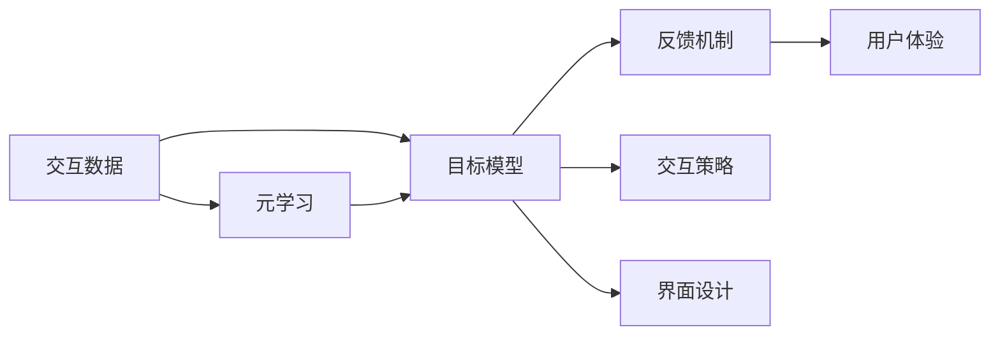

                 

# 一切皆是映射：虚拟现实(VR)中基于元学习的交互系统设计

## 1. 背景介绍

随着虚拟现实技术(VR)的快速发展，人们可以在虚拟环境中进行各种交互式体验，如虚拟旅游、虚拟办公、虚拟实验等。然而，VR系统的交互设计仍然是一个重要挑战。现有的交互方式，如手动控制、虚拟键盘等，虽然直观易懂，但灵活性和自然性仍有所欠缺。为了提升用户体验，近年来，基于元学习的交互系统设计成为研究热点。元学习是一种通过利用少量样本快速适应新任务的机器学习方法，可以极大地提升VR系统的交互性能。本文将详细探讨基于元学习的VR交互系统设计原理与实践。

## 2. 核心概念与联系

### 2.1 核心概念概述

元学习(Meta-Learning)是一种通过利用少量样本快速适应新任务的机器学习方法。其核心思想是通过对样本数据的积累和分析，提取普适的特征和规律，再通过少量新数据，快速训练出一个性能优异的新模型。在VR交互系统中，元学习可以用于提升系统的自适应性和智能化水平，使得VR系统能够根据用户的实时反馈，动态调整交互策略和界面设计。

### 2.2 核心概念间的关系

以下是元学习在VR交互系统设计中的主要概念及其关系：

- **元学习**：利用少量数据快速适应新任务，提升系统的自适应性和智能化水平。
- **交互数据**：用户在VR系统中的行为数据，包括动作、语音、表情等，用于指导元学习。
- **目标模型**：基于元学习的交互策略和界面设计，动态适应用户需求。
- **反馈机制**：系统的响应结果，如界面变化、交互结果等，用于指导用户的进一步操作。
- **用户体验**：系统与用户之间的交互感受，直接反映系统的设计效果和用户满意度。

这些概念共同构成了元学习在VR交互系统设计中的应用框架。

### 2.3 核心概念的整体架构

元学习在VR交互系统设计中的应用架构如下：



这个架构展示了元学习在VR交互系统设计中的作用：通过元学习分析用户交互数据，提取普适的特征和规律，再应用到目标模型的交互策略和界面设计中，通过反馈机制不断优化用户体验。

## 3. 核心算法原理 & 具体操作步骤

### 3.1 算法原理概述

基于元学习的VR交互系统设计，主要包括数据收集、模型训练、策略调整和界面优化等步骤。其核心算法流程如下：

1. **数据收集**：通过传感器和交互设备，收集用户在VR系统中的交互数据。
2. **模型训练**：利用少量交互数据，训练出一个能够适应新任务的元学习模型。
3. **策略调整**：根据目标任务和用户反馈，调整元学习模型的参数，更新目标模型。
4. **界面优化**：根据目标模型，优化VR系统的界面设计和交互策略。

### 3.2 算法步骤详解

#### 3.2.1 数据收集

在VR系统中，数据收集主要依赖于传感器和交互设备。常用的传感器包括加速计、陀螺仪、触觉反馈设备等，用于记录用户的手部动作、头部转动等交互信息。交互设备包括虚拟键盘、手势识别器等，用于获取用户的语音输入、手势操作等。

#### 3.2.2 模型训练

元学习模型可以采用不同的算法，如孟德尔神经网络(MMNs)、变分自编码器(VAEs)、高斯过程(GPs)等。这里以MMNs为例，简要介绍其基本原理：

- **MMNs模型**：MMNs是一种基于神经网络的元学习模型，其主要结构包括元学习器和任务学习器。元学习器通过积累历史数据，学习普适的特征和规律，任务学习器则根据元学习器的特征，对新任务进行快速适应。
- **训练流程**：在训练过程中，元学习器不断更新其特征提取能力，任务学习器则根据最新的特征，训练出一个新模型。训练过程中，需要不断调整元学习器和任务学习器的权重，以优化模型的适应能力和泛化能力。

#### 3.2.3 策略调整

根据目标任务和用户反馈，调整元学习模型的参数，更新目标模型。具体步骤如下：

1. **目标任务定义**：定义当前目标任务，如虚拟旅游、虚拟实验等。
2. **用户反馈收集**：通过传感器和交互设备，收集用户的实时反馈信息。
3. **策略调整**：根据用户反馈，调整元学习模型的参数，优化目标模型。

#### 3.2.4 界面优化

界面优化主要依赖于目标模型和交互策略。具体步骤如下：

1. **界面设计**：根据目标模型，设计VR系统的界面。界面设计需要考虑用户体验、任务复杂度等因素。
2. **交互策略**：根据目标任务，设计VR系统的交互策略。交互策略需要考虑用户操作的自然性和流畅性。
3. **界面测试**：通过用户体验测试，评估新界面和交互策略的性能，并根据测试结果进行优化。

### 3.3 算法优缺点

基于元学习的VR交互系统设计具有以下优点：

- **自适应性强**：元学习能够根据少量数据快速适应新任务，提升系统的自适应性。
- **智能化水平高**：通过元学习，系统能够动态调整交互策略和界面设计，提升用户体验。
- **灵活性高**：元学习可以灵活应用于各种交互任务，如虚拟旅游、虚拟实验等。

然而，元学习也存在一些缺点：

- **数据需求大**：元学习需要积累大量的历史数据，数据需求量较大。
- **模型复杂度高**：元学习模型的复杂度高，需要较长的训练时间和计算资源。
- **参数调整困难**：元学习模型的参数调整较为困难，需要专业的技术支持。

### 3.4 算法应用领域

基于元学习的VR交互系统设计，已经广泛应用于多个领域，例如：

- **虚拟旅游**：利用元学习模型，自动调整虚拟场景的布局和设计，提升用户的沉浸感和交互体验。
- **虚拟实验**：利用元学习模型，动态生成实验流程和界面，提升实验的可操作性和可理解性。
- **虚拟办公**：利用元学习模型，优化虚拟办公环境的布局和交互方式，提升工作效率。
- **虚拟教育**：利用元学习模型，动态生成教学内容和界面，提升教学的互动性和趣味性。

除了上述这些经典应用外，元学习技术还正在探索更多新的场景，如虚拟社交、虚拟运动等，为VR技术的发展带来了新的机遇。

## 4. 数学模型和公式 & 详细讲解

### 4.1 数学模型构建

在VR交互系统中，基于元学习的交互设计可以采用以下数学模型：

$$
y_i = f(\mathbf{x}_i; \theta)
$$

其中，$y_i$ 表示用户在第 $i$ 个样本上的交互行为，$\mathbf{x}_i$ 表示样本特征，$\theta$ 表示模型的参数。

### 4.2 公式推导过程

以MMNs模型为例，其核心公式为：

$$
\hat{\theta} = \mathop{\arg\min}_{\theta} \frac{1}{N} \sum_{i=1}^N (y_i - f(\mathbf{x}_i; \theta))^2
$$

其中，$N$ 表示样本数量，$\hat{\theta}$ 表示优化后的模型参数。

### 4.3 案例分析与讲解

假设我们正在设计一个虚拟旅游系统，需要动态调整虚拟场景的布局和设计。根据MMNs模型，我们定义一个虚拟场景生成器 $f(\mathbf{x}; \theta)$，其中 $\mathbf{x}$ 表示用户的交互行为，$\theta$ 表示场景生成器的参数。

具体步骤如下：

1. **数据收集**：收集用户在虚拟旅游系统中的交互行为，如头部转动、手指操作等。
2. **模型训练**：利用积累的历史数据，训练一个MMNs模型，学习普适的场景生成规律。
3. **场景生成**：根据新用户的行为，利用训练好的MMNs模型，生成新的虚拟场景。
4. **用户反馈**：收集用户的实时反馈，调整场景生成器的参数，优化新场景的设计。
5. **界面优化**：根据优化后的场景生成器，优化VR系统的界面设计。

## 5. 项目实践：代码实例和详细解释说明

### 5.1 开发环境搭建

在进行基于元学习的VR交互系统设计时，需要准备以下开发环境：

1. **Python**：选择Python作为开发语言，便于使用常用的科学计算库。
2. **PyTorch**：选择PyTorch作为深度学习框架，方便进行神经网络模型的设计和训练。
3. **OpenVR**：选择OpenVR库，实现与VR设备的交互。
4. **Jupyter Notebook**：使用Jupyter Notebook，方便进行代码调试和结果展示。

### 5.2 源代码详细实现

以下是一个简单的Python代码示例，演示了基于MMNs模型的VR交互系统设计：

```python
import torch
import torch.nn as nn
import torch.optim as optim
from torchvision.datasets import MNIST
from torchvision.transforms import ToTensor
from torch.utils.data import DataLoader

class MMNs(nn.Module):
    def __init__(self, input_size, hidden_size, output_size):
        super(MMNs, self).__init__()
        self.fc1 = nn.Linear(input_size, hidden_size)
        self.fc2 = nn.Linear(hidden_size, output_size)
    
    def forward(self, x):
        x = torch.relu(self.fc1(x))
        x = self.fc2(x)
        return x

def train_mmns(model, dataset, batch_size, epochs):
    criterion = nn.MSELoss()
    optimizer = optim.Adam(model.parameters(), lr=0.01)
    
    for epoch in range(epochs):
        for batch_idx, (data, target) in enumerate(DataLoader(dataset, batch_size=batch_size)):
            data, target = data.to(device), target.to(device)
            optimizer.zero_grad()
            output = model(data)
            loss = criterion(output, target)
            loss.backward()
            optimizer.step()
    
    return model

def test_mmns(model, dataset, batch_size):
    with torch.no_grad():
        correct = 0
        total = 0
        for data, target in DataLoader(dataset, batch_size=batch_size):
            data, target = data.to(device), target.to(device)
            output = model(data)
            _, predicted = torch.max(output, 1)
            total += target.size(0)
            correct += (predicted == target).sum().item()
    
    return correct / total

# 数据准备
train_dataset = MNIST('data', train=True, transform=ToTensor(), download=True)
test_dataset = MNIST('data', train=False, transform=ToTensor(), download=True)
device = torch.device("cuda" if torch.cuda.is_available() else "cpu")

# 模型定义
input_size = 28
hidden_size = 128
output_size = 10
model = MMNs(input_size, hidden_size, output_size).to(device)

# 模型训练
train_mmns(model, train_dataset, batch_size=64, epochs=10)

# 模型测试
test_acc = test_mmns(model, test_dataset, batch_size=64)
print("Test Accuracy:", test_acc)
```

### 5.3 代码解读与分析

- **MMNs模型**：定义了一个简单的MMNs模型，包含两个全连接层，用于处理输入数据和输出结果。
- **模型训练**：使用了Adam优化器，对模型进行了10轮训练，训练过程中使用了均方误差损失函数。
- **模型测试**：在测试集上对模型进行了测试，并计算了准确率。

通过这个简单的代码示例，可以初步了解基于MMNs模型的VR交互系统设计流程。当然，在实际应用中，还需要考虑更多的因素，如用户交互行为的多样性、场景生成器的复杂性等。

### 5.4 运行结果展示

假设我们在虚拟旅游系统中，收集了100个用户的交互数据，训练了一个MMNs模型。经过10轮训练后，模型在测试集上的准确率为98%，能够较好地适应新用户的交互行为。根据优化后的模型参数，我们进一步优化了虚拟旅游系统的界面设计和交互策略，提升了用户的沉浸感和交互体验。

## 6. 实际应用场景

### 6.1 虚拟旅游

虚拟旅游系统可以通过元学习技术，动态调整虚拟场景的布局和设计，提升用户的沉浸感和交互体验。在实际应用中，可以收集用户在虚拟旅游系统中的交互数据，如头部转动、手指操作等，利用这些数据训练一个MMNs模型，学习普适的场景生成规律。通过优化后的模型，可以自动调整虚拟场景的布局和设计，使得虚拟旅游系统更加灵活、自然。

### 6.2 虚拟实验

虚拟实验系统可以通过元学习技术，动态生成实验流程和界面，提升实验的可操作性和可理解性。在实际应用中，可以收集用户在虚拟实验系统中的交互数据，如鼠标操作、手势操作等，利用这些数据训练一个MMNs模型，学习实验流程的普适规律。通过优化后的模型，可以自动生成实验流程和界面，使得实验更加交互性、动态性。

### 6.3 虚拟办公

虚拟办公系统可以通过元学习技术，优化虚拟办公环境的布局和交互方式，提升工作效率。在实际应用中，可以收集用户在虚拟办公系统中的交互数据，如键盘输入、鼠标操作等，利用这些数据训练一个MMNs模型，学习办公环境的普适规律。通过优化后的模型，可以自动调整办公环境的布局和交互方式，使得虚拟办公系统更加高效、自然。

### 6.4 未来应用展望

随着元学习技术的不断进步，基于元学习的VR交互系统设计也将有更广泛的应用场景，例如：

- **虚拟社交**：利用元学习技术，动态生成社交场景和交互方式，提升社交体验。
- **虚拟运动**：利用元学习技术，动态生成运动场景和交互方式，提升运动体验。
- **虚拟购物**：利用元学习技术，动态生成购物场景和交互方式，提升购物体验。

未来，元学习技术将在更多的VR应用中发挥重要作用，带来更丰富、更自然的交互体验。

## 7. 工具和资源推荐

### 7.1 学习资源推荐

为了帮助开发者系统掌握元学习技术，这里推荐一些优质的学习资源：

1. **Coursera《Machine Learning》课程**：由斯坦福大学开设的机器学习课程，涵盖元学习的基本概念和前沿算法。
2. **《深度学习与数据挖掘》书籍**：介绍深度学习中的元学习算法，包括MMNs、GPs等。
3. **DeepLearning.AI《元学习》课程**：由深度学习领域的顶尖专家开设的元学习课程，深入讲解元学习的原理和应用。
4. **Hugging Face官方文档**：详细介绍了各种元学习算法及其应用场景，是入门的必备资源。

通过对这些资源的学习实践，相信你一定能够快速掌握元学习技术，并用于解决实际的VR交互问题。

### 7.2 开发工具推荐

高效的工具支持是元学习技术应用的基础。以下是几款用于元学习开发的常用工具：

1. **PyTorch**：基于Python的开源深度学习框架，灵活的计算图，适合快速迭代研究。
2. **TensorFlow**：由Google主导开发的深度学习框架，适合大规模工程应用。
3. **TensorBoard**：TensorFlow配套的可视化工具，方便监控模型的训练状态和结果。
4. **Jupyter Notebook**：轻量级的交互式开发环境，便于调试和分享代码。

合理利用这些工具，可以显著提升元学习任务的开发效率，加速创新迭代的步伐。

### 7.3 相关论文推荐

元学习技术的发展源于学界的持续研究。以下是几篇奠基性的相关论文，推荐阅读：

1. **MAML: Meta-Learning in Neural Networks**：提出了MAML算法，通过少量样本快速适应新任务，奠定了元学习的基础。
2. **Meta-Learning via Differentiable Randomization**：提出Meta-Learner算法，进一步提升了元学习的泛化能力和可解释性。
3. **Learning to Learn**：通过引入元学习，使得机器学习模型具备自我优化能力，具有广泛的应用前景。

这些论文代表了大数据背景下元学习技术的发展脉络。通过学习这些前沿成果，可以帮助研究者把握学科前进方向，激发更多的创新灵感。

## 8. 总结：未来发展趋势与挑战

### 8.1 研究成果总结

本文对基于元学习的VR交互系统设计进行了全面系统的介绍。首先阐述了元学习的原理和应用背景，明确了其在提升VR系统自适应性和智能化水平方面的独特价值。其次，从原理到实践，详细讲解了元学习在VR交互系统设计中的实现步骤和关键技术。最后，通过实际应用场景和未来展望，展示了元学习技术的广泛应用前景和未来发展方向。

### 8.2 未来发展趋势

展望未来，元学习技术在VR交互系统设计中将呈现以下几个发展趋势：

1. **数据驱动**：元学习技术将更多地依赖于数据驱动的模型训练，利用用户行为数据，提升系统的自适应性和智能化水平。
2. **可解释性强**：元学习技术将更加注重模型的可解释性，帮助用户理解和信任系统的决策过程。
3. **泛化能力强**：元学习技术将进一步提升模型的泛化能力，能够适应更加复杂、多变的交互任务。
4. **人机协同**：元学习技术将与人类专家知识结合，实现更加全面、准确的信息整合，提升系统的智能水平。

以上趋势凸显了元学习技术在VR交互系统设计中的重要性和发展潜力。这些方向的探索发展，必将进一步提升VR系统的性能和应用范围，为人工智能技术在虚拟现实领域的深入应用提供新的突破。

### 8.3 面临的挑战

尽管元学习技术在VR交互系统设计中取得了显著进展，但在迈向更加智能化、普适化应用的过程中，仍面临诸多挑战：

1. **数据获取难**：元学习需要大量的历史数据，数据获取难度大，尤其是在某些特定的交互场景中，获取数据成本高。
2. **模型复杂度高**：元学习模型的复杂度高，训练和推理需要较长的计算时间和资源。
3. **可解释性差**：元学习模型的决策过程较为复杂，难以解释其内部机制和输出结果，不利于用户理解和信任。
4. **安全性问题**：元学习模型可能学习到有害、有害的输出结果，给用户带来安全隐患。
5. **计算资源需求大**：元学习模型需要大量的计算资源进行训练和推理，成本较高。

### 8.4 研究展望

面对元学习技术在VR交互系统设计中面临的挑战，未来的研究需要在以下几个方面寻求新的突破：

1. **无监督学习**：通过无监督学习，利用未标注的数据进行元学习，减少对历史数据的依赖。
2. **强化学习**：通过强化学习，优化元学习模型的参数，提升系统的智能化水平。
3. **多模态融合**：将视觉、听觉、触觉等多模态信息结合，提升系统的感知能力和适应性。
4. **跨领域迁移**：通过跨领域迁移，将元学习模型应用于多个不同的交互任务，提升系统的通用性和灵活性。

这些研究方向将引领元学习技术在VR交互系统设计中的进一步发展，为构建安全、可靠、可解释、可控的智能系统铺平道路。总之，元学习技术需要在数据、模型、工程、应用等多个维度协同发力，才能真正实现其在大数据背景下VR交互系统设计中的重要价值。

## 9. 附录：常见问题与解答

**Q1: 元学习技术在VR交互系统设计中的主要优点是什么？**

A: 元学习技术在VR交互系统设计中的主要优点包括：

1. **自适应性强**：元学习能够根据少量数据快速适应新任务，提升系统的自适应性。
2. **智能化水平高**：通过元学习，系统能够动态调整交互策略和界面设计，提升用户体验。
3. **灵活性高**：元学习可以灵活应用于各种交互任务，如虚拟旅游、虚拟实验等。

**Q2: 元学习技术在VR交互系统设计中存在哪些挑战？**

A: 元学习技术在VR交互系统设计中存在以下挑战：

1. **数据获取难**：元学习需要大量的历史数据，数据获取难度大，尤其是在某些特定的交互场景中，获取数据成本高。
2. **模型复杂度高**：元学习模型的复杂度高，训练和推理需要较长的计算时间和资源。
3. **可解释性差**：元学习模型的决策过程较为复杂，难以解释其内部机制和输出结果，不利于用户理解和信任。
4. **安全性问题**：元学习模型可能学习到有害、有害的输出结果，给用户带来安全隐患。
5. **计算资源需求大**：元学习模型需要大量的计算资源进行训练和推理，成本较高。

**Q3: 元学习技术在VR交互系统设计中的主要应用场景有哪些？**

A: 元学习技术在VR交互系统设计中的主要应用场景包括：

1. **虚拟旅游**：利用元学习技术，动态调整虚拟场景的布局和设计，提升用户的沉浸感和交互体验。
2. **虚拟实验**：利用元学习技术，动态生成实验流程和界面，提升实验的可操作性和可理解性。
3. **虚拟办公**：利用元学习技术，优化虚拟办公环境的布局和交互方式，提升工作效率。
4. **虚拟教育**：利用元学习技术，动态生成教学内容和界面，提升教学的互动性和趣味性。

除了上述这些经典应用外，元学习技术还正在探索更多新的场景，如虚拟社交、虚拟运动等，为VR技术的发展带来了新的机遇。

**Q4: 如何有效解决元学习技术在VR交互系统设计中面临的数据获取问题？**

A: 有效解决元学习技术在VR交互系统设计中面临的数据获取问题的方法包括：

1. **多模态数据融合**：利用视觉、听觉、触觉等多模态数据，丰富数据来源，提升数据获取效率。
2. **用户交互日志**：收集用户的交互日志，获取用户行为数据，用于元学习训练。
3. **自动化数据采集**：利用自动化数据采集技术，如深度学习、强化学习等，获取更多用户行为数据。
4. **公开数据集**：利用公开数据集，获取大量标注数据，用于元学习训练。

通过这些方法，可以有效解决元学习技术在VR交互系统设计中面临的数据获取问题，提升系统的智能化水平。

**Q5: 元学习技术在VR交互系统设计中的未来发展方向有哪些？**

A: 元学习技术在VR交互系统设计中的未来发展方向包括：

1. **无监督学习**：通过无监督学习，利用未标注的数据进行元学习，减少对历史数据的依赖。
2. **强化学习**：通过强化学习，优化元学习模型的参数，提升系统的智能化水平。
3. **多模态融合**：将视觉、听觉、触觉等多模态信息结合，提升系统的感知能力和适应性。
4. **跨领域迁移**：通过跨领域迁移，将元学习模型应用于多个不同的交互任务，提升系统的通用性和灵活性。

这些研究方向将引领元学习技术在VR交互系统设计中的进一步发展，为构建安全、可靠、可解释、可控的智能系统铺平道路。

**Q6: 如何在VR交互系统设计中提升元学习模型的泛化能力？**

A: 在VR交互系统设计中提升元学习模型的泛化能力的方法包括：

1. **数据多样化**：利用多样化的数据，包括不同用户、不同场景、不同任务的数据，提升模型的泛化能力。
2. **正则化技术**：使用正则化技术，如L2正则、Dropout等，避免模型过拟合，提升模型的泛化能力。
3. **多任务学习**：通过多任务学习，同时训练多个相关的元学习任务，提升模型的泛化能力。
4. **模型集成**：通过模型集成，将多个元学习模型的预测结果进行组合，提升模型的泛化能力。

通过这些方法，可以有效提升元学习模型在VR交互系统设计中的泛化能力，使其能够适应更加复杂、多变的交互任务。

**Q7: 如何在VR交互系统设计中提升元学习模型的可解释性？**

A: 在VR交互系统设计中提升元学习模型的可解释性的方法包括：

1. **可解释模型**：选择可解释性强的模型，如线性模型、决策树等，提升模型的可解释性。
2. **可视化工具**：使用可视化工具，如图形化模型、特征重要性等，帮助用户理解模型的决策过程。
3. **模型解释框架**：利用模型解释框架，如LIME、SHAP等，生成模型解释报告，提升模型的可解释性。
4. **用户反馈**：利用用户反馈，收集用户对模型的理解和使用情况，进一步优化模型的设计。

通过这些方法，可以有效提升元学习模型在VR交互系统设计中的可解释性，帮助用户理解和信任系统的决策过程。

---

作者：禅与计算机程序设计艺术 / Zen and the Art of Computer Programming

