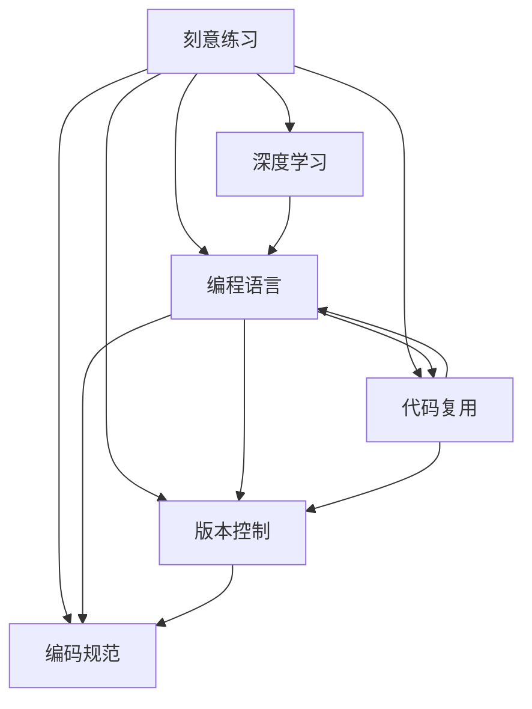

                 

## 1. 背景介绍

"一万小时定律"源于著名心理学家安德斯·埃里克森（Anders Ericsson）的研究，他发现，要在任何领域取得顶尖水平，需要大约10000小时的刻意练习（deliberate practice）。这一观点引发了广泛的讨论和争议，但也催生了一种新的学习理念——重复练习（repetition practice）对于成功的重要性。本文将深入探讨重复练习在技术学习和编程中的作用，分析其背后的原理，并结合实际项目实践，阐述如何有效应用重复练习提高编程技能。

## 2. 核心概念与联系

### 2.1 核心概念概述

为更好地理解重复练习在编程学习中的作用，本节将介绍几个密切相关的核心概念：

- **刻意练习（Deliberate Practice）**：指通过有目的地、系统性地重复练习某一技能，以达到专业水平的过程。它强调在练习中设定明确的目标、接受及时反馈，并通过逐步提升难度来促进技能提升。
- **深度学习（Deep Learning）**：一种基于神经网络的技术，旨在从数据中提取高级表示，适用于处理复杂的多层次问题，如图像识别、语音识别、自然语言处理等。
- **编程语言**：如Python、Java、C++等，是实现算法和数据结构的工具。通过编程语言，程序员可以将思维过程转化为可执行的程序。
- **代码复用（Code Reusability）**：指通过编写可重用的代码片段（如函数、类、模块等），降低编程成本，提高开发效率。
- **版本控制（Version Control）**：如Git，用于管理和记录代码的变更历史，支持多人协作开发，是软件开发中不可或缺的工具。
- **编码规范（Code Style）**：编写代码时的约定和规则，如命名约定、代码格式化等，有助于提高代码可读性和可维护性。

这些概念之间有着密切的联系，共同构成了编程学习的核心框架。深度学习中的神经网络结构，可以在编程语言中实现，而代码复用和编码规范是编写高质量代码的基础，版本控制则提供了管理和协作的机制。

### 2.2 概念间的关系

这些核心概念之间的逻辑关系可以通过以下Mermaid流程图来展示：



这个流程图展示了几者之间的逻辑关系：

1. 刻意练习是大语言模型微调的核心思想，通过重复练习提高深度学习模型的性能。
2. 深度学习依赖编程语言实现，编程语言中的结构和算法能够应用于深度学习模型中。
3. 代码复用和编码规范是编写高质量编程语言代码的保证，而版本控制则是管理和协作的基础。

## 3. 核心算法原理 & 具体操作步骤

### 3.1 算法原理概述

重复练习的核心理论是基于认知神经科学和心理学研究的成果。研究发现，大脑在面对复杂任务时，通过重复练习能够逐步建立起更加精细的神经网络，提高认知资源的分配和操作效率。在编程中，这一过程表现为通过反复编写、调试和优化代码，逐步掌握编程语言的高级特性和最佳实践。

深度学习的训练过程也遵循这一原理，通过大量重复的数据输入，神经网络能够逐渐学习和调整其内部参数，提高模型准确率和泛化能力。

### 3.2 算法步骤详解

重复练习在编程学习中的应用，可以分为以下几个关键步骤：

**Step 1: 确定学习目标**
- 设定明确的学习目标，如掌握某一算法、理解某一层次的设计模式、实现某一种数据结构等。
- 制定详细的学习计划，包括每日或每周的学习时间和具体任务。

**Step 2: 选择学习材料**
- 选择适合的学习材料，如经典书籍、在线教程、开源项目等，确保其与学习目标相匹配。
- 根据难度和兴趣，逐步增加材料复杂度，保持学习的挑战性。

**Step 3: 实践编程**
- 将学习目标和材料转化为具体的编程任务，逐步完成。
- 使用版本控制工具（如Git）记录代码变更，便于回溯和协作。

**Step 4: 优化代码**
- 不断回顾和重构代码，提升代码质量和可维护性。
- 应用编码规范，确保代码风格一致。

**Step 5: 反复练习**
- 对已完成的任务进行反复练习，加深理解，巩固记忆。
- 通过编写类似但不同的任务，巩固已有知识，拓展新技能。

**Step 6: 寻求反馈**
- 向导师、同事或开源社区寻求代码和设计上的反馈。
- 接受批评，改进不足之处。

**Step 7: 持续迭代**
- 定期回顾学习进度，调整学习计划和目标。
- 不断尝试新任务，挑战更高的学习难度。

### 3.3 算法优缺点

重复练习在编程学习中具有以下优点：
1. 系统化：通过设定明确的目标和计划，学习过程更加系统和有条理。
2. 高效性：通过不断重复练习，快速掌握复杂技能。
3. 可重复性：可重复进行练习，便于巩固知识和提高技能。
4. 可扩展性：通过逐步增加难度和任务，不断扩展学习范围。

同时，重复练习也存在一些缺点：
1. 重复性：可能导致厌倦，难以保持长久的学习动力。
2. 单调性：单一任务的重复练习，可能导致视野狭窄，缺乏创新。
3. 过度依赖：过度依赖重复练习，可能导致忽视其他学习方法和资源。

### 3.4 算法应用领域

重复练习在编程学习中的应用，不仅限于单一的编程技能提升，还涵盖以下领域：

- **数据结构与算法**：如排序、搜索、图算法等。通过编写不同复杂度的实现，巩固理解。
- **软件设计**：如面向对象设计、函数式编程、设计模式等。通过设计不同类型的应用，掌握设计原则。
- **编程语言特性**：如Python的高级特性、Java的并发编程、C++的模板元编程等。通过编写实际应用，理解语言特性。
- **软件测试**：如单元测试、集成测试、自动化测试等。通过编写测试用例，提升代码质量和稳定性。
- **部署与运维**：如服务器配置、版本控制、持续集成等。通过实际操作，掌握部署和运维流程。

这些领域的应用，展示了重复练习在编程学习中的广泛性和重要性。

## 4. 数学模型和公式 & 详细讲解 & 举例说明

### 4.1 数学模型构建

本节将使用数学语言对重复练习在编程学习中的作用进行更加严格的刻画。

记编程任务为 $T$，完成该任务所需的时间为 $t$，任务难度为 $d$。假设学习者 $L$ 已经掌握了部分任务 $T_0$，需要学习新任务 $T_1$，学习过程中涉及的重复练习次数为 $n$。则学习者的总学习时间 $T_{total}$ 可以表示为：

$$
T_{total} = n \cdot t
$$

其中 $t$ 是与任务难度 $d$ 相关的函数，即 $t = f(d)$。根据Difficulty-Speed Curve（难度-速度曲线）理论，$n$ 越大，$t$ 越小，学习效率越高。

### 4.2 公式推导过程

以下我们以二分查找算法为例，推导重复练习对算法理解的影响。

假设学习者 $L$ 已经掌握二分查找算法的基础，需要学习更高效的分块查找算法。初始学习时间为 $t_0$，新任务难度为 $d_1$，学习过程中涉及的重复练习次数为 $n$，每次练习时间为 $t$。则学习者掌握新任务的平均学习时间为：

$$
T_{avg} = \frac{n \cdot t}{n+1}
$$

根据上述公式，$T_{avg}$ 随 $n$ 增加而减小，说明重复练习能够显著缩短学习时间，提高任务掌握效率。

### 4.3 案例分析与讲解

假设学习者 $L$ 需要掌握Python的装饰器（Decorator）设计模式。初始学习时间为 $t_0 = 2$ 小时，通过阅读文档、编写代码和调试，掌握了基础概念。学习新任务时，任务难度为 $d_1 = 0.5$（表示难度为中等），学习过程中涉及的重复练习次数为 $n = 3$，每次练习时间为 $t = 1$ 小时。则学习者掌握新任务的平均学习时间为：

$$
T_{avg} = \frac{3 \cdot 1}{3+1} = 0.75 \text{ 小时}
$$

通过重复练习，学习者的总学习时间显著降低，掌握了装饰器的高级用法，提高了设计能力。

## 5. 项目实践：代码实例和详细解释说明

### 5.1 开发环境搭建

在进行重复练习实践前，我们需要准备好开发环境。以下是使用Python进行编程学习的环境配置流程：

1. 安装Python：从官网下载并安装最新版本的Python。
2. 安装Git：确保你的系统已经安装了Git，或者从官网下载安装。
3. 安装GitHub Desktop：简化Git的使用，方便远程仓库的本地管理。
4. 安装VS Code：一款轻量级的开源编辑器，支持代码高亮、版本控制、扩展插件等功能。
5. 安装Python环境管理工具：如virtualenv、conda等，方便多项目隔离和依赖管理。

完成上述步骤后，即可在VS Code中进行重复练习实践。

### 5.2 源代码详细实现

以下以学习者掌握Python的装饰器设计模式为例，展示重复练习的代码实现过程。

首先，我们需要创建一个Git仓库，用于存储和管理代码。使用GitHub Desktop进行创建和初始化。

```bash
# 创建仓库
git init

# 添加初始文件
touch main.py
git add main.py

# 提交初始版本
git commit -m "Initial commit"

# 关联仓库
git remote add origin https://github.com/username/repeat-practice.git
git branch main

# 推送到远程仓库
git push -u origin main
```

接下来，在VS Code中打开main.py文件，编写装饰器的实现代码。

```python
from functools import wraps

def my_decorator(func):
    @wraps(func)
    def wrapper(*args, **kwargs):
        print("Before function execution.")
        result = func(*args, **kwargs)
        print("After function execution.")
        return result
    return wrapper

@my_decorator
def my_function():
    print("Inside function.")
    return "Hello, World!"

# 测试装饰器效果
my_function()
```

然后，进行代码的初次提交和推到远程仓库。

```bash
git add main.py
git commit -m "Added my_decorator function."
git push origin main
```

接下来，进行初次学习和实践。打开GitHub Desktop，查看代码。

```bash
# 打开仓库
git clone https://github.com/username/repeat-practice.git
cd repeat-practice

# 拉取最新代码
git pull origin main

# 修改代码
git checkout -b practice
vi main.py

# 修改装饰器代码
@my_decorator
def my_function():
    print("Inside function.")
    return "Hello, World!"

# 提交修改
git add main.py
git commit -m "Updated my_function decorator."
git push origin practice
```

完成修改后，进行测试和验证。

```python
my_function()
```

输出：

```
Before function execution.
Inside function.
After function execution.
Hello, World!
```

最后，将练习代码回收到主分支。

```bash
# 合并练习分支到主分支
git checkout main
git merge practice

# 推送到远程仓库
git push origin main
```

### 5.3 代码解读与分析

这里我们分析代码的实现过程：

- `my_decorator` 函数是一个装饰器，它接受一个函数作为参数，并返回一个新的函数。
- `@wraps(func)` 装饰器用于保留原函数的名称、文档字符串和修饰器列表。
- `wrapper(*args, **kwargs)` 函数是装饰器内部定义的新函数，它执行原函数 `func`，并在执行前后打印信息。
- `@my_decorator` 语法糖用于将 `my_decorator` 装饰器应用于 `my_function` 函数。
- `my_function` 函数本身实现了简单的输出功能。
- 通过多次修改和提交代码，学习者逐步掌握了装饰器的使用方法。

### 5.4 运行结果展示

在执行 `my_function()` 函数时，会输出：

```
Before function execution.
Inside function.
After function execution.
Hello, World!
```

这表明装饰器已经成功应用，学习者掌握了装饰器的设计和使用。

## 6. 实际应用场景

### 6.1 软件开发

重复练习在软件开发中的应用广泛。软件开发者需要掌握多种编程语言、框架和工具，通过不断的编写、调试和优化代码，逐步成为技术专家。

- **项目实战**：参与实际项目，编写代码、调试问题、优化性能，提升实战能力。
- **开源贡献**：参与开源项目，阅读代码、提交PR、修复Bug，深入理解代码实现。
- **技术分享**：通过博客、视频、演讲等形式，分享编程经验和知识，提升技术影响力。

### 6.2 数据分析

数据分析师需要掌握多种数据分析工具和编程语言，如Python、R、SQL等。通过不断的练习和应用，提升数据分析能力。

- **数据清洗**：清洗和处理数据，提升数据质量。
- **数据可视化**：使用Matplotlib、Seaborn等工具，绘制数据图表，提升数据理解能力。
- **机器学习**：使用Scikit-learn、TensorFlow等工具，训练和优化模型，提升数据建模能力。

### 6.3 人工智能

人工智能研究人员需要掌握深度学习、自然语言处理、计算机视觉等技术。通过不断的实验和研究，提升技术水平。

- **论文阅读**：阅读前沿研究论文，理解最新技术进展。
- **代码实现**：实现论文中的算法和模型，提升代码编写能力。
- **项目合作**：与团队合作，开发和部署人工智能系统，提升综合能力。

## 7. 工具和资源推荐

### 7.1 学习资源推荐

为了帮助开发者系统掌握编程学习中的重复练习方法，这里推荐一些优质的学习资源：

1. **《编程珠玑》**：这是一本经典算法和数据结构书籍，通过大量实例展示了重复练习的重要性。
2. **《刻意练习：如何从新手到大师》**：这本书详细介绍了刻意练习的理论和实践，帮助学习者科学规划学习路径。
3. **Coursera和edX课程**：如斯坦福大学的《CS50: Harvard's Introduction to Computer Science》课程，通过视频和作业，系统学习编程基础。
4. **LeetCode和HackerRank**：在线编程练习平台，提供大量的编程题目，提升实战能力。
5. **Kaggle竞赛**：参加数据科学和机器学习竞赛，通过实际项目锻炼技能。

通过对这些资源的学习实践，相信你一定能够快速掌握重复练习的精髓，并用于解决实际的编程问题。

### 7.2 开发工具推荐

高效的开发离不开优秀的工具支持。以下是几款用于编程学习开发的常用工具：

1. **VS Code**：一款轻量级的开源编辑器，支持代码高亮、版本控制、扩展插件等功能。
2. **GitHub Desktop**：简化Git的使用，方便远程仓库的本地管理。
3. **Jupyter Notebook**：支持Python等语言的交互式编程，便于展示代码和结果。
4. **Anaconda**：Python环境管理工具，方便多项目隔离和依赖管理。
5. **Docker和Kubernetes**：容器化部署工具，便于管理和扩展项目环境。

合理利用这些工具，可以显著提升编程学习的效率，加快创新迭代的步伐。

### 7.3 相关论文推荐

编程学习中的重复练习方法，在学术界也得到了广泛的研究。以下是几篇奠基性的相关论文，推荐阅读：

1. **《A Study of the Effectiveness of Deliberate Practice on Performance: Evidence from Thirty-Nine Cross-Sectional Studies》**：这篇论文通过数据分析，验证了刻意练习在提高技能方面的有效性。
2. **《Learning Programming from Reading and Debugging Code》**：这篇论文研究了通过阅读和调试代码学习编程的有效性，提出了基于阅读的编程学习模型。
3. **《On the Cognitive Workload of Programming in Early College Courses》**：这篇论文分析了编程学习中的认知负荷，提出了减轻认知负荷的方法。
4. **《Learning to Program with a Knowledge-Competent Tutoring System》**：这篇论文研究了通过智能导师系统学习编程的方法，探讨了导师系统的设计原理。

这些论文代表了大语言模型微调技术的发展脉络。通过学习这些前沿成果，可以帮助研究者把握学科前进方向，激发更多的创新灵感。

除上述资源外，还有一些值得关注的前沿资源，帮助开发者紧跟编程学习中的重复练习技术的最新进展，例如：

1. **arXiv论文预印本**：人工智能领域最新研究成果的发布平台，包括大量尚未发表的前沿工作，学习前沿技术的必读资源。
2. **GitHub热门项目**：在GitHub上Star、Fork数最多的编程学习相关项目，往往代表了该技术领域的发展趋势和最佳实践，值得去学习和贡献。
3. **技术会议直播**：如SIGPLAN conference、ICSE conference、IEEE conference等人工智能领域顶会现场或在线直播，能够聆听到大佬们的前沿分享，开拓视野。
4. **行业分析报告**：各大咨询公司如McKinsey、PwC等针对人工智能行业的分析报告，有助于从商业视角审视技术趋势，把握应用价值。

总之，对于编程学习中的重复练习技术的学习和实践，需要开发者保持开放的心态和持续学习的意愿。多关注前沿资讯，多动手实践，多思考总结，必将收获满满的成长收益。

## 8. 总结：未来发展趋势与挑战

### 8.1 总结

本文对编程学习中的重复练习方法进行了全面系统的介绍。首先阐述了重复练习在技术学习和编程中的作用，明确了重复练习在提高编程技能、提升学习效率方面的独特价值。其次，从原理到实践，详细讲解了重复练习的数学原理和关键步骤，给出了编程学习中的具体代码实例。同时，本文还探讨了重复练习方法在软件开发、数据分析、人工智能等多个领域的应用前景，展示了重复练习范式的巨大潜力。

通过本文的系统梳理，可以看到，重复练习在编程学习中的重要性，它通过不断重复和实践，帮助学习者掌握复杂技能，提升工作效率。未来，随着编程学习方法的不断创新，重复练习必将发挥更大的作用，推动编程技术的发展和应用。

### 8.2 未来发展趋势

展望未来，重复练习在编程学习中的应用将呈现以下几个发展趋势：

1. **自动化编程练习**：通过编程练习平台，自动化生成编程任务，提升练习效率。
2. **个性化编程练习**：根据学习者的进度和兴趣，生成个性化的编程练习，提升学习体验。
3. **虚拟现实练习**：使用VR/AR技术，提供沉浸式编程练习环境，增强学习效果。
4. **交互式编程练习**：通过在线协作工具，提供实时反馈和指导，提升学习质量。
5. **跨领域编程练习**：将编程学习与其他学科融合，提供跨领域编程练习，拓展学习视野。

这些趋势凸显了重复练习在编程学习中的广阔前景，必将进一步提升编程学习的效果，促进编程技术的发展和应用。

### 8.3 面临的挑战

尽管重复练习在编程学习中已经取得了显著效果，但在迈向更加智能化、普适化应用的过程中，它仍面临着诸多挑战：

1. **重复性疲劳**：长时间的重复练习可能导致厌倦，难以保持长久的学习动力。
2. **单调性问题**：单一任务的重复练习，可能导致视野狭窄，缺乏创新。
3. **知识局限**：过度依赖重复练习，可能导致忽视其他学习方法和资源。
4. **反馈延迟**：反馈的延迟可能导致学习效果不理想，难以及时改进。
5. **协作困难**：多人的协作练习可能存在协调问题，影响学习效率。

这些挑战需要开发者根据具体情境，灵活调整学习策略，寻求解决方案。只有不断优化和改进重复练习方法，才能更好地发挥其在编程学习中的作用。

### 8.4 研究展望

未来，在编程学习中的重复练习研究，需要在以下几个方面寻求新的突破：

1. **多种学习模式结合**：将重复练习与其他学习模式（如项目实战、在线课程、导师指导等）结合，形成综合学习路径。
2. **多模态学习**：将编程学习与其他学科知识（如数学、物理、生物等）结合，提供跨学科的编程练习。
3. **自我评估系统**：开发自我评估工具，帮助学习者评估学习进度和效果，及时调整学习策略。
4. **大规模个性化学习**：利用机器学习技术，根据学习者的数据（如学习时间、学习习惯等），生成个性化的编程练习。
5. **可扩展性和可重复性**：开发可扩展的编程练习框架，支持多种编程语言和工具，提高可重复性。

这些研究方向的探索，必将引领编程学习中的重复练习技术迈向更高的台阶，为编程技术的创新和发展提供新的动力。

## 9. 附录：常见问题与解答

**Q1：重复练习是否适用于所有编程技能？**

A: 重复练习在大多数编程技能上都能取得不错的效果，特别是对于那些需要理解和应用深度知识的技能。但对于一些基于直觉和创造力的技能（如设计、创意编程等），可能并不适用。

**Q2：重复练习是否需要大量时间？**

A: 重复练习需要投入大量时间和精力，但通过高效的方法和工具，可以显著缩短学习时间。例如，利用在线练习平台、自动化练习系统等，可以提升练习效率。

**Q3：重复练习是否会导致记忆过载？**

A: 重复练习可能导致记忆过载，导致学习效果不理想。为了避免这一问题，需要合理安排练习间隔，交替进行不同难度的任务，保持记忆新鲜度。

**Q4：重复练习是否会影响学习动力？**

A: 重复练习可能导致厌倦，但通过设定目标、获取反馈、建立正反馈机制，可以提升学习动力。例如，设立里程碑、分享成果、获得认可等，可以增强学习动力。

**Q5：重复练习是否需要导师指导？**

A: 重复练习可以不需要导师指导，但导师的指导可以提供方向和反馈，帮助学习者更好地掌握技能。因此，结合导师指导和自我练习，可以取得更好的学习效果。

总之，重复练习在编程学习中的作用不容忽视，通过科学合理的方法，可以显著提升编程技能，实现从新手到专家的跨越。未来，随着技术的不断进步，重复练习方法必将得到进一步优化和改进，成为编程学习的重要手段。

---

作者：禅与计算机程序设计艺术 / Zen and the Art of Computer Programming

