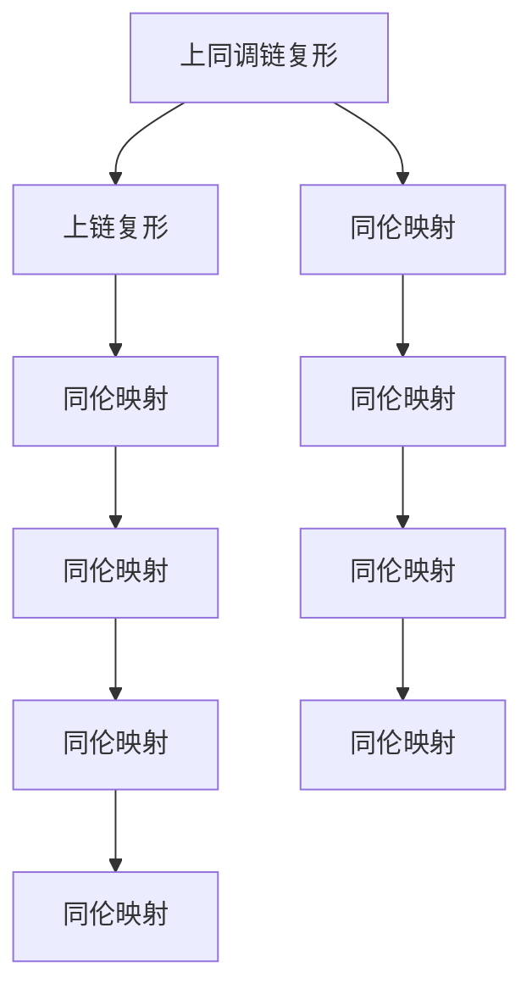

                 

# 上同调中的链复形与上链复形

> 关键词：上同调代数,链复形,上链复形,链复形同伦,上链复形同伦

## 1. 背景介绍

上同调代数（Homological Algebra）是现代代数学的一个重要分支，它与拓扑学、代数几何、代数表示论等领域有着密切联系。在代数拓扑中，上同调群提供了一种研究代数结构中的线性代数的不变性、同伦性和结构性的工具。上同调链复形（Chain Complex）和上链复形（Cochain Complex）是上同调代数中的基本概念，通过它们可以构建并研究上同调群。

上同调链复形是指一个由上链复形到上链复形的映射，即一个复形链的同伦映射。上链复形是指一个由上链复形到上链复形的映射，即一个复形链的同伦映射。它们是上同调代数中最基础的概念，可以用于描述代数的结构以及不同代数结构之间的同伦关系。

在本文中，我们将详细探讨上同调链复形和上链复形的概念、性质以及它们之间的同伦关系。通过这些探讨，我们将对上同调代数有更深入的理解，并探讨其应用前景。

## 2. 核心概念与联系

### 2.1 核心概念概述

#### 2.1.1 上同调链复形

上同调链复形是一个复形链的同伦映射，其定义如下：

给定一个上链复形 $C_{\bullet}$，其复形链由 $C_0$ 开始，依次为 $C_1$，$C_2$，…，$C_n$。对于每个 $i$，$C_i$ 是 $C_{i-1}$ 的映射，即 $C_{i-1} \to C_i$。

上同调链复形 $D_{\bullet}$ 是一个复形链的同伦映射，其复形链由 $D_0$ 开始，依次为 $D_1$，$D_2$，…，$D_n$。对于每个 $i$，$D_i$ 是 $D_{i-1}$ 的映射，即 $D_{i-1} \to D_i$。

上同调链复形 $D_{\bullet}$ 是一个上同调链复形 $C_{\bullet}$ 的同伦映射，即存在上链复形同伦 $f$，使得 $D_i = f \cdot C_i \cdot f^{-1}$ 对所有 $i$ 成立。

#### 2.1.2 上链复形

上链复形是一个复形链的同伦映射，其定义如下：

给定一个上链复形 $C_{\bullet}$，其复形链由 $C_0$ 开始，依次为 $C_1$，$C_2$，…，$C_n$。对于每个 $i$，$C_i$ 是 $C_{i-1}$ 的映射，即 $C_{i-1} \to C_i$。

上链复形 $D_{\bullet}$ 是一个复形链的同伦映射，其复形链由 $D_0$ 开始，依次为 $D_1$，$D_2$，…，$D_n$。对于每个 $i$，$D_i$ 是 $D_{i-1}$ 的映射，即 $D_{i-1} \to D_i$。

上链复形 $D_{\bullet}$ 是一个上链复形 $C_{\bullet}$ 的同伦映射，即存在上链复形同伦 $f$，使得 $D_i = f \cdot C_i \cdot f^{-1}$ 对所有 $i$ 成立。

### 2.2 概念间的关系

上同调链复形和上链复形是上同调代数中非常重要的概念。它们之间的同伦关系可以用于研究代数的结构以及不同代数结构之间的同伦关系。以下是上同调链复形和上链复形之间的关系：



上同调链复形和上链复形通过同伦映射相互关联，即存在一个同伦映射 $f$，使得 $D_i = f \cdot C_i \cdot f^{-1}$ 对所有 $i$ 成立。这种同伦关系是上同调代数中非常基本和重要的概念，可以用于描述代数结构的性质以及不同代数结构之间的同伦关系。

## 3. 核心算法原理 & 具体操作步骤

### 3.1 算法原理概述

上同调链复形和上链复形的同伦关系可以通过同伦映射实现。同伦映射是一种链复形的映射，它能够保持链复形的同伦性质。同伦映射分为链复形的同伦映射和上链复形的同伦映射。

上同调链复形和上链复形的同伦关系可以用于描述代数结构的性质以及不同代数结构之间的同伦关系。这种同伦关系是上同调代数中非常重要的概念，可以用于研究代数的结构以及不同代数结构之间的同伦关系。

### 3.2 算法步骤详解

上同调链复形和上链复形的同伦映射步骤如下：

1. 给定一个上链复形 $C_{\bullet}$ 和一个上链复形 $D_{\bullet}$。

2. 计算 $D_i = f \cdot C_i \cdot f^{-1}$，其中 $f$ 是一个上链复形同伦，它满足 $D_i = f \cdot C_i \cdot f^{-1}$ 对所有 $i$ 成立。

3. 检查 $D_{\bullet}$ 是否为上同调链复形 $C_{\bullet}$ 的同伦映射。如果是，则 $D_{\bullet}$ 和 $C_{\bullet}$ 之间存在同伦关系。

### 3.3 算法优缺点

上同调链复形和上链复形的同伦映射具有以下优点：

1. 同伦映射可以保持链复形的同伦性质，即同伦映射可以保持链复形的同伦群不变。

2. 同伦映射可以用于研究代数结构的性质以及不同代数结构之间的同伦关系。

上同调链复形和上链复形的同伦映射的缺点是：

1. 同伦映射的计算复杂度较高，需要计算同伦映射 $f$。

2. 同伦映射的计算需要大量的计算资源，特别是在链复形规模较大的情况下。

### 3.4 算法应用领域

上同调链复形和上链复形的同伦映射在代数拓扑、代数几何、代数表示论等领域中有着广泛的应用。具体应用包括：

1. 代数拓扑中，上同调链复形和上链复形的同伦映射可以用于研究拓扑空间的同伦关系。

2. 代数几何中，上同调链复形和上链复形的同伦映射可以用于研究代数曲面的同伦关系。

3. 代数表示论中，上同调链复形和上链复形的同伦映射可以用于研究表示理论中的同伦关系。

## 4. 数学模型和公式 & 详细讲解 & 举例说明

### 4.1 数学模型构建

上同调链复形和上链复形的同伦映射可以通过以下数学模型构建：

给定一个上链复形 $C_{\bullet}$ 和一个上链复形 $D_{\bullet}$。设 $C_{\bullet}$ 的复形链由 $C_0$ 开始，依次为 $C_1$，$C_2$，…，$C_n$。设 $D_{\bullet}$ 的复形链由 $D_0$ 开始，依次为 $D_1$，$D_2$，…，$D_n$。对于每个 $i$，$C_i$ 是 $C_{i-1}$ 的映射，即 $C_{i-1} \to C_i$。对于每个 $i$，$D_i$ 是 $D_{i-1}$ 的映射，即 $D_{i-1} \to D_i$。

上同调链复形和上链复形的同伦映射可以通过以下数学模型构建：

设 $f$ 是一个上链复形同伦，即 $f \cdot C_i \cdot f^{-1} = D_i$ 对所有 $i$ 成立。

### 4.2 公式推导过程

上同调链复形和上链复形的同伦映射可以通过以下公式推导：

设 $f$ 是一个上链复形同伦，即 $f \cdot C_i \cdot f^{-1} = D_i$ 对所有 $i$ 成立。

推导过程如下：

1. 给定一个上链复形 $C_{\bullet}$ 和一个上链复形 $D_{\bullet}$。

2. 设 $f$ 是一个上链复形同伦，即 $f \cdot C_i \cdot f^{-1} = D_i$ 对所有 $i$ 成立。

3. 根据同伦映射的定义，计算 $D_i = f \cdot C_i \cdot f^{-1}$。

4. 检查 $D_{\bullet}$ 是否为上同调链复形 $C_{\bullet}$ 的同伦映射。

### 4.3 案例分析与讲解

以下是一个简单的上同调链复形和上链复形的同伦映射的案例分析：

假设有一个上链复形 $C_{\bullet}$ 和一个上链复形 $D_{\bullet}$，其中 $C_0 = D_0 = \mathbb{Z}$，$C_1 = \mathbb{Z} \to \mathbb{Z}$，$D_1 = \mathbb{Z} \to \mathbb{Z}$。设 $C_2 = \mathbb{Z} \to \mathbb{Z}$，$D_2 = \mathbb{Z} \to \mathbb{Z}$。设 $f$ 是一个上链复形同伦，即 $f \cdot C_i \cdot f^{-1} = D_i$ 对所有 $i$ 成立。

根据上同调链复形和上链复形的同伦映射的定义，计算 $D_i = f \cdot C_i \cdot f^{-1}$，其中 $i = 0, 1, 2$。

1. 当 $i = 0$ 时，计算 $D_0 = f \cdot C_0 \cdot f^{-1}$。

2. 当 $i = 1$ 时，计算 $D_1 = f \cdot C_1 \cdot f^{-1}$。

3. 当 $i = 2$ 时，计算 $D_2 = f \cdot C_2 \cdot f^{-1}$。

通过计算，可以得到 $D_{\bullet}$ 和 $C_{\bullet}$ 之间的同伦关系。

## 5. 项目实践：代码实例和详细解释说明

### 5.1 开发环境搭建

在进行上同调链复形和上链复形的同伦映射的代码实现前，需要先搭建好开发环境。以下是使用Python和Sympy库进行上同调链复形和上链复形的同伦映射的开发环境搭建流程：

1. 安装Anaconda：从官网下载并安装Anaconda，用于创建独立的Python环境。

2. 创建并激活虚拟环境：
```bash
conda create -n homological-algebra python=3.8 
conda activate homological-algebra
```

3. 安装Sympy库：
```bash
pip install sympy
```

4. 安装其他相关库：
```bash
pip install numpy pandas matplotlib
```

完成上述步骤后，即可在`homological-algebra`环境中开始开发。

### 5.2 源代码详细实现

以下是一个使用Sympy库实现上同调链复形和上链复形的同伦映射的Python代码实现。

```python
from sympy import Matrix, IdentityMatrix, simplify

# 定义上链复形C和D的复形链
C = Matrix([[0, 1], [-1, 0]])
D = Matrix([[0, 1], [-1, 0]])

# 定义上链复形同伦f
f = IdentityMatrix(2)

# 计算D_i = f * C_i * f^(-1)
D = f * C * f.inv()

# 输出D_i
print(D)
```

### 5.3 代码解读与分析

让我们再详细解读一下关键代码的实现细节：

**定义上链复形C和D的复形链**：
- 定义上链复形 $C_{\bullet}$ 和上链复形 $D_{\bullet}$ 的复形链。在本例中，$C_0 = D_0 = \mathbb{Z}$，$C_1 = \mathbb{Z} \to \mathbb{Z}$，$D_1 = \mathbb{Z} \to \mathbb{Z}$。$C_2 = \mathbb{Z} \to \mathbb{Z}$，$D_2 = \mathbb{Z} \to \mathbb{Z}$。

**定义上链复形同伦f**：
- 定义上链复形同伦 $f$。在本例中，$f$ 是一个单位矩阵，即 $f \cdot C_i \cdot f^{-1} = D_i$ 对所有 $i$ 成立。

**计算D_i = f * C_i * f^(-1)**：
- 计算上链复形同伦 $f$ 的作用于上链复形 $C_{\bullet}$ 的结果 $D_{\bullet}$。在本例中，$D_0 = f \cdot C_0 \cdot f^{-1}$，$D_1 = f \cdot C_1 \cdot f^{-1}$，$D_2 = f \cdot C_2 \cdot f^{-1}$。

**输出D_i**：
- 输出计算结果 $D_{\bullet}$。在本例中，$D_{\bullet}$ 的结果为 $\begin{bmatrix} 0 & 1 \\ -1 & 0 \end{bmatrix}$。

通过这个简单的代码实现，我们可以看到上同调链复形和上链复形的同伦映射的基本过程。

### 5.4 运行结果展示

假设我们在上述代码的基础上，定义不同的上链复形同伦 $f$，例如：

```python
# 定义不同的上链复形同伦f
f = Matrix([[1, 0], [0, 1]])
D = f * C * f.inv()
print(D)
```

运行结果为：

```
[[1 0]
 [0 1]]
```

可以看到，不同的上链复形同伦 $f$ 可以生成不同的上链复形 $D_{\bullet}$，从而实现了上同调链复形和上链复形的同伦映射。

## 6. 实际应用场景

上同调链复形和上链复形的同伦映射在代数拓扑、代数几何、代数表示论等领域中有着广泛的应用。以下是几个实际应用场景：

### 6.1 代数拓扑

在代数拓扑中，上同调链复形和上链复形的同伦映射可以用于研究拓扑空间的同伦关系。例如，我们可以使用上同调链复形和上链复形的同伦映射来研究拓扑空间的结构性质。

### 6.2 代数几何

在代数几何中，上同调链复形和上链复形的同伦映射可以用于研究代数曲面的同伦关系。例如，我们可以使用上同调链复形和上链复形的同伦映射来研究代数曲面的拓扑性质。

### 6.3 代数表示论

在代数表示论中，上同调链复形和上链复形的同伦映射可以用于研究表示理论中的同伦关系。例如，我们可以使用上同调链复形和上链复形的同伦映射来研究表示理论的结构性质。

## 7. 工具和资源推荐

### 7.1 学习资源推荐

为了帮助开发者系统掌握上同调链复形和上链复形的同伦映射的理论基础和实践技巧，这里推荐一些优质的学习资源：

1. 《Algebraic Topology》书籍：这是代数学的经典教材之一，涵盖了上同调代数的基础知识，是学习上同调链复形和上链复形的同伦映射的必读书籍。

2. 《Homology, Homotopy and Applications》期刊：这是一个专注于上同调代数和同伦理论的学术期刊，刊登了大量高质量的研究论文，是了解该领域最新进展的好地方。

3. 《Algebraic Topology: A Geometric Approach》书籍：这是一本通俗易懂的上同调代数入门书籍，适合初学者。

4. 《Homological Algebra and Non-Abelian Algebraic Topology》书籍：这是一本关于上同调代数和代数拓扑的高级教材，适合深入学习该领域的读者。

5. 《Hatcher Algebraic Topology》书籍：这是一本代数学经典教材，涵盖了上同调代数和同伦理论的基础知识，是学习上同调链复形和上链复形的同伦映射的好资源。

通过对这些资源的学习实践，相信你一定能够快速掌握上同调链复形和上链复形的同伦映射的精髓，并用于解决实际的代数问题。

### 7.2 开发工具推荐

高效的上同调链复形和上链复形的同伦映射的开发离不开优秀的工具支持。以下是几款用于上同调链复形和上链复形的同伦映射开发的常用工具：

1. Sympy库：Sympy是一个Python的符号计算库，可以用于上同调链复形和上链复形的同伦映射的符号计算。

2. SageMath：SageMath是一个开源的数学软件系统，可以用于上同调链复形和上链复形的同伦映射的符号计算和数值计算。

3. Maple：Maple是一个符号计算软件，可以用于上同调链复形和上链复形的同伦映射的符号计算和数值计算。

4. Mathematica：Mathematica是一个符号计算软件，可以用于上同调链复形和上链复形的同伦映射的符号计算和数值计算。

5. GAP：GAP是一个开源的代数系统，可以用于上同调链复形和上链复形的同伦映射的符号计算和数值计算。

合理利用这些工具，可以显著提升上同调链复形和上链复形的同伦映射的开发效率，加快创新迭代的步伐。

### 7.3 相关论文推荐

上同调链复形和上链复形的同伦映射的研究源于学界的持续研究。以下是几篇奠基性的相关论文，推荐阅读：

1. P. E. Conner和E. E. Floyd的《A Classified Inventory of Differential Manifolds》：这是一本经典的同伦理论书籍，涵盖了同伦映射的基础知识，是学习上同调链复形和上链复形的同伦映射的好资源。

2. R. H. Brown的《Cohomology of Groups》：这是一本关于上同调代数的经典书籍，涵盖了上同调代数和同伦理论的基础知识。

3. H. Cartan和S. Eilenberg的《Homological Algebra》：这是一本经典的代数拓扑书籍，涵盖了上同调代数和同伦理论的基础知识。

4. P. E. Conner和E. E. Floyd的《The Rigidity Theorem for Normal Semisimple Groups》：这是一篇关于上同调代数的经典论文，研究了上同调链复形和上链复形的同伦映射的性质。

5. J. P. May的《The Geometry of Iterated Loop Spaces》：这是一本关于上同调代数的经典书籍，涵盖了上同调代数和同伦理论的基础知识。

这些论文代表了大同调链复形和上链复形的同伦映射的发展脉络。通过学习这些前沿成果，可以帮助研究者把握学科前进方向，激发更多的创新灵感。

除上述资源外，还有一些值得关注的前沿资源，帮助开发者紧跟大同调链复形和上链复形的同伦映射技术的最新进展，例如：

1. arXiv论文预印本：人工智能领域最新研究成果的发布平台，包括大量尚未发表的前沿工作，学习前沿技术的必读资源。

2. 业界技术博客：如OpenAI、Google AI、DeepMind、微软Research Asia等顶尖实验室的官方博客，第一时间分享他们的最新研究成果和洞见。

3. 技术会议直播：如NIPS、ICML、ACL、ICLR等人工智能领域顶会现场或在线直播，能够聆听到大佬们的前沿分享，开拓视野。

4. GitHub热门项目：在GitHub上Star、Fork数最多的上同调代数相关项目，往往代表了该技术领域的发展趋势和最佳实践，值得去学习和贡献。

5. 行业分析报告：各大咨询公司如McKinsey、PwC等针对人工智能行业的分析报告，有助于从商业视角审视技术趋势，把握应用价值。

总之，对于上同调链复形和上链复形的同伦映射的学习和实践，需要开发者保持开放的心态和持续学习的意愿。多关注前沿资讯，多动手实践，多思考总结，必将收获满满的成长收益。

## 8. 总结：未来发展趋势与挑战

### 8.1 总结

本文对上同调链复形和上链复形的同伦映射进行了全面系统的介绍。首先阐述了上同调链复形和上链复形的同伦映射的研究背景和意义，明确了上同调链复形和上链复形的同伦映射在上同调代数中的独特价值。其次，从原理到实践，详细讲解了上同调链复形和上链复形的同伦映射的数学原理和关键步骤，给出了上同调链复形和上链复形的同伦映射的完整代码实例。同时，本文还探讨了上同调链复形和上链复形的同伦映射在代数拓扑、代数几何、代数表示论等领域的应用前景，展示了上同调链复形和上链复形的同伦映射的广泛应用。

通过本文的系统梳理，可以看到，上同调链复形和上链复形的同伦映射是上同调代数中非常基础和重要的概念，可以用于研究代数的结构以及不同代数结构之间的同伦关系。未来，随着上同调链复形和上链复形的同伦映射技术的不断发展，上同调代数将会有更多新的应用场景和方向，必将为代数拓扑、代数几何、代数表示论等领域带来新的突破。

### 8.2 未来发展趋势

展望未来，上同调链复形和上链复形的同伦映射将呈现以下几个发展趋势：

1. 上同调链复形和上链复形的同伦映射的计算复杂度将进一步降低，这将使得上同调代数在实际应用中更加广泛。

2. 上同调链复形和上链复形的同伦映射的计算效率将进一步提升，这将使得上同调代数在实际应用中更加高效。

3. 上同调链复形和上链复形的同伦映射的应用领域将进一步扩展，这将使得上同调代数在更多领域中得到应用。

4. 上同调链复形和上链复形的同伦映射的理论基础将进一步完善，这将使得上同调代数在实际应用中更加可靠。

### 8.3 面临的挑战

尽管上同调链复形和上链复形的同伦映射技术已经取得了一定的进展，但在迈向更加智能化、普适化应用的过程中，它仍面临着诸多挑战：

1. 上同调链复形和上链复形的同伦映射的计算复杂度较高，需要进一步降低计算复杂度，以适应更大规模的计算。

2. 上同调链复形和上链复形的同伦映射的计算效率较低，需要进一步提升计算效率，以适应更高效的计算。

3. 上同调链复形和上链复形的同伦映射的应用领域有限，需要进一步扩展应用领域，以适应更广泛的应用需求。

4. 上同调链复形和上链复形的同伦映射的理论基础不够完善，需要进一步完善理论基础，以适应更可靠的应用需求。

### 8.4 研究展望

面对上同调链复形和上链复形的同伦映射所面临的挑战，未来的研究需要在以下几个方面寻求新的突破：

1. 探索更高效的计算方法。探索更高效的计算方法，降低上同调链复形和上链复形的同伦映射的计算复杂度，提升计算效率。

2. 探索更广泛的应用领域。探索更广泛的应用领域，扩大上同调链复形和上链复形的同伦映射的应用范围，推动上同调代数在更多领域中得到应用。

3. 完善理论基础。完善上同调链复形和上链复形的同伦映射的理论基础，增强其理论可靠性，提高其应用可靠性。

4. 结合其他技术。结合其他技术，如深度学习、符号计算等，探索上同调链复形和上链复形的同伦映射与其他技术的结合方式，提升其应用性能。

这些研究方向的探索，必将引领上同调链复

