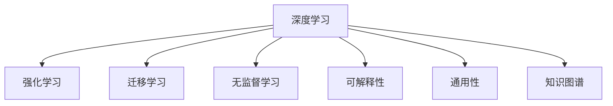
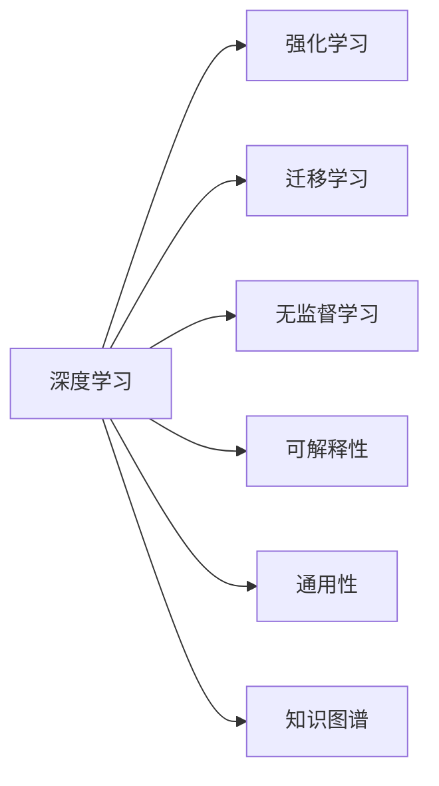
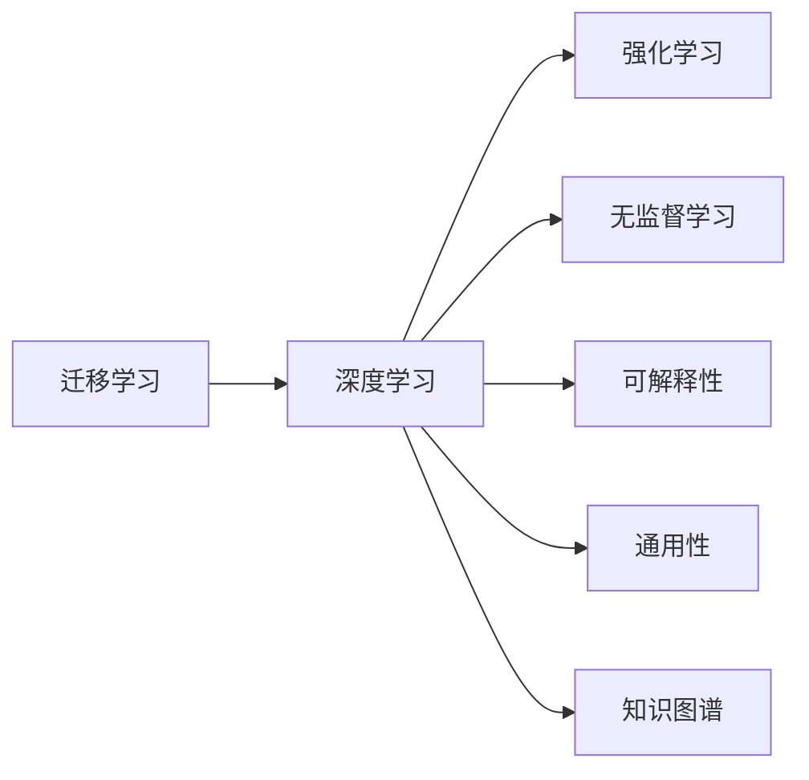
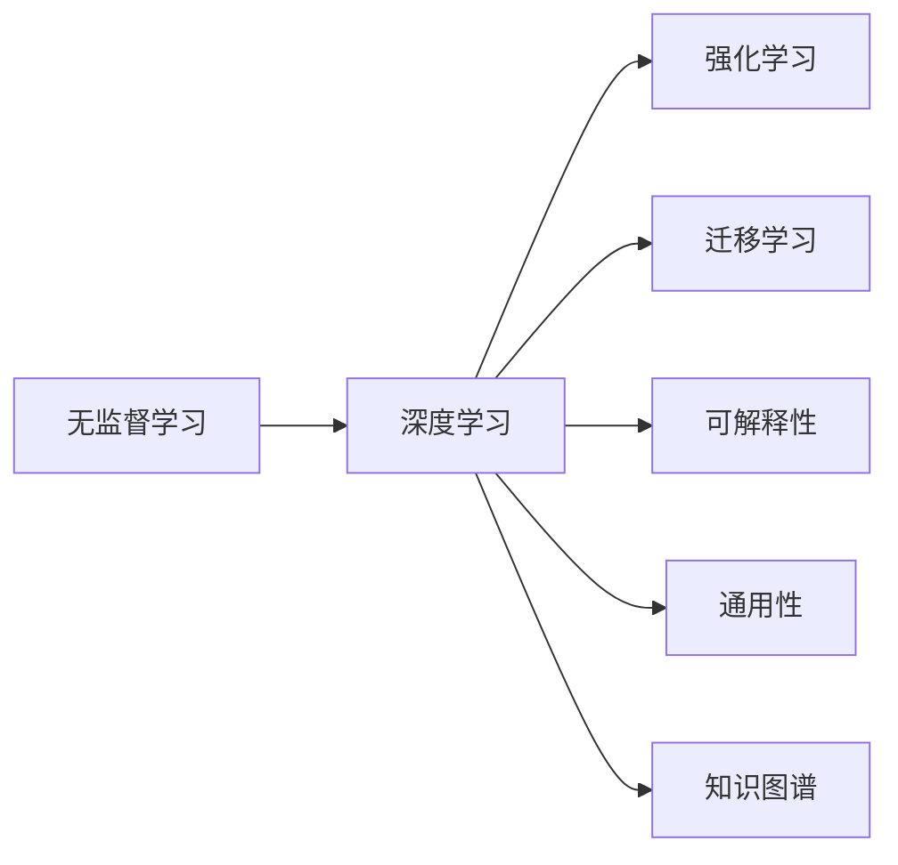
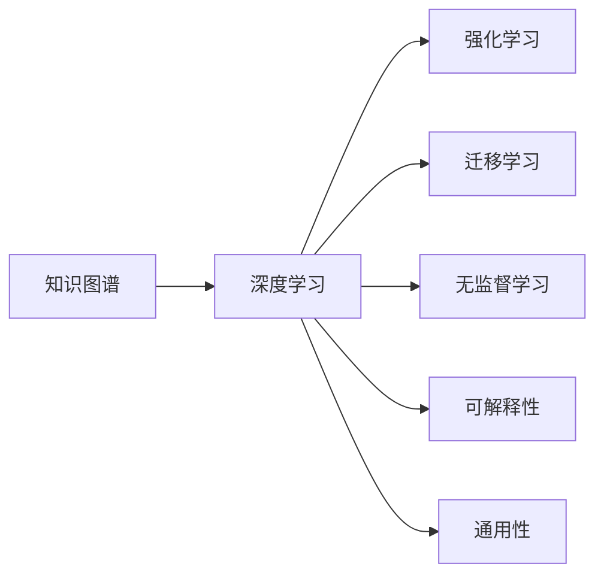
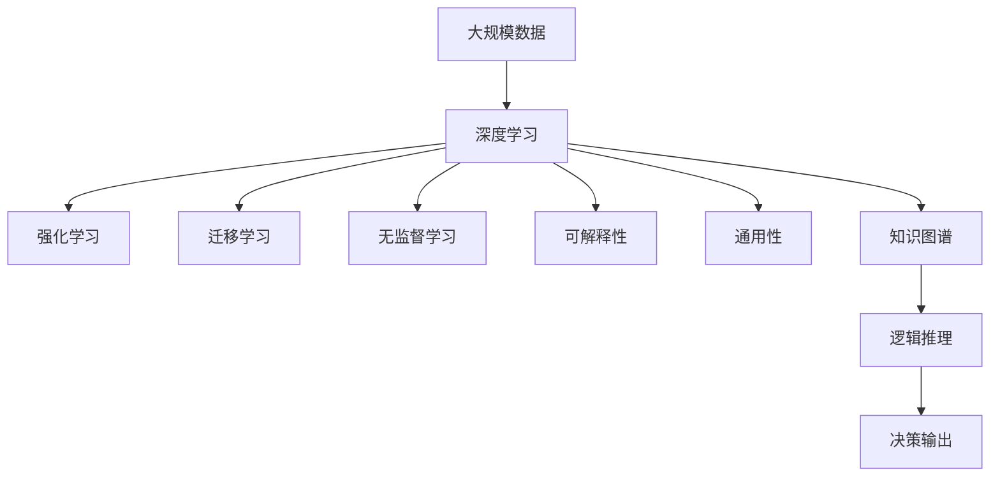

                 

# 下一代人工智能系统的技术路线

## 1. 背景介绍

### 1.1 问题由来

随着人工智能技术的飞速发展，深度学习、自然语言处理、计算机视觉、机器人等领域取得了显著的进步。然而，现有的AI系统还存在一些局限性，比如模型的通用性不够、数据依赖性强、难以解释、可解释性差、训练时间长、模型复杂度高、资源消耗大等问题。这些问题制约了AI技术在实际应用中的广泛普及。

为了解决这些问题，我们需要对现有的AI技术进行重新审视，寻找下一代AI系统的技术路线，从而推动AI技术的进一步发展。

### 1.2 问题核心关键点

1. **通用性不足**：现有AI模型往往针对特定任务或领域进行训练，通用性较差。
2. **数据依赖性强**：深度学习模型的训练需要大量标注数据，数据获取成本高。
3. **难以解释**：现有模型通常是“黑盒”，难以解释其决策过程。
4. **训练时间长**：模型训练时间长，对资源需求大，影响实际应用。
5. **模型复杂度高**：现有模型结构复杂，难以理解和使用。
6. **资源消耗大**：训练和推理时资源消耗大，限制了AI技术的实际应用。

### 1.3 问题研究意义

解决上述问题，不仅能够提升AI技术的通用性和实用性，还能促进AI技术的可持续发展。具体而言，具有以下意义：

1. **提升AI系统的灵活性和适用性**：通过改进技术路线，使AI系统能够适应更广泛的应用场景，提升其灵活性和适用性。
2. **降低数据依赖**：减少对标注数据的依赖，降低数据获取和处理的成本。
3. **增强模型的可解释性**：提升AI模型的可解释性，增加用户的信任和接受度。
4. **缩短训练时间**：改进训练算法，缩短训练时间，提高AI系统的部署速度。
5. **简化模型结构**：简化模型结构，降低资源消耗，提高AI系统的可操作性和可维护性。
6. **促进可持续发展**：降低资源消耗，提升AI系统的环境友好性，推动AI技术的可持续发展。

## 2. 核心概念与联系

### 2.1 核心概念概述

为了寻找下一代AI系统的技术路线，需要理解以下核心概念：

- **深度学习**：基于神经网络的学习方法，能够处理大规模数据，具有较高的拟合能力。
- **强化学习**：通过试错机制优化模型，适用于决策类问题。
- **迁移学习**：利用已有模型在特定任务上学习到的知识，加快新任务的学习速度。
- **无监督学习**：在无标签数据上学习模型，减少对标注数据的依赖。
- **可解释性**：模型能够清晰解释其决策过程，增加用户对模型的信任。
- **通用性**：模型能够适应多种任务和领域，具有较高的泛化能力。
- **知识图谱**：用于表示实体和实体间关系的知识库，支持复杂的逻辑推理。

这些概念之间的逻辑关系可以通过以下Mermaid流程图来展示：

这个流程图展示了深度学习与其他几种学习范式之间的联系和区别。深度学习、强化学习、迁移学习、无监督学习、可解释性、通用性和知识图谱共同构成了下一代AI系统的技术路线。

### 2.2 概念间的关系

这些核心概念之间存在紧密的联系，形成了下一代AI系统的完整生态系统。下面我通过几个Mermaid流程图来展示这些概念之间的关系。

#### 2.2.1 深度学习与其他学习范式的关系

这个流程图展示了深度学习与其他几种学习范式之间的关系。深度学习可以与其他学习范式进行融合，提升AI系统的性能和灵活性。

#### 2.2.2 迁移学习与深度学习的关系

这个流程图展示了迁移学习在深度学习中的应用。迁移学习可以利用已有模型的知识，加速新任务的学习。

#### 2.2.3 无监督学习与深度学习的关系

这个流程图展示了无监督学习在深度学习中的应用。无监督学习可以在无标签数据上训练模型，减少对标注数据的依赖。

#### 2.2.4 知识图谱与深度学习的关系

这个流程图展示了知识图谱在深度学习中的应用。知识图谱可以为深度学习提供结构化信息，提升模型的推理能力。

### 2.3 核心概念的整体架构

最后，我们用一个综合的流程图来展示这些核心概念在大规模AI系统中的整体架构：

这个综合流程图展示了深度学习在大规模AI系统中的整体架构。大规模数据输入后，经过深度学习、强化学习、迁移学习、无监督学习、可解释性、通用性和知识图谱等模块的综合作用，最终输出决策结果。

## 3. 核心算法原理 & 具体操作步骤
### 3.1 算法原理概述

下一代AI系统的技术路线主要包括以下几个核心算法：深度学习、强化学习、迁移学习、无监督学习、可解释性、通用性和知识图谱。这些算法共同构成了下一代AI系统的核心技术。

- **深度学习**：通过多层神经网络对数据进行拟合，具有较高的拟合能力。
- **强化学习**：通过试错机制优化模型，适用于决策类问题。
- **迁移学习**：利用已有模型在特定任务上学习到的知识，加快新任务的学习速度。
- **无监督学习**：在无标签数据上学习模型，减少对标注数据的依赖。
- **可解释性**：模型能够清晰解释其决策过程，增加用户对模型的信任。
- **通用性**：模型能够适应多种任务和领域，具有较高的泛化能力。
- **知识图谱**：用于表示实体和实体间关系的知识库，支持复杂的逻辑推理。

### 3.2 算法步骤详解

接下来，我将详细介绍每个核心算法的具体操作步骤：

#### 3.2.1 深度学习算法步骤

1. **数据预处理**：对数据进行清洗、归一化、分词等预处理，准备好输入数据。
2. **构建神经网络**：设计合适的神经网络结构，如卷积神经网络、循环神经网络、注意力机制等。
3. **训练模型**：使用标注数据对神经网络进行训练，调整网络参数，使其能够拟合数据。
4. **模型评估**：使用验证集对模型进行评估，选择最优模型。
5. **模型应用**：将模型应用于实际问题，进行预测或分类。

#### 3.2.2 强化学习算法步骤

1. **环境设计**：设计问题环境，定义状态和行动空间。
2. **选择算法**：选择强化学习算法，如Q-learning、Deep Q-learning、Policy Gradient等。
3. **模型训练**：在问题环境中训练模型，调整参数，使其能够优化决策。
4. **模型评估**：在测试集上评估模型，选择最优模型。
5. **模型应用**：将模型应用于实际问题，进行决策。

#### 3.2.3 迁移学习算法步骤

1. **源任务训练**：在源任务上使用深度学习模型进行训练。
2. **特征提取**：将源任务的特征提取器作为迁移学习的目标，提取特征。
3. **微调模型**：在目标任务上微调模型，调整参数，使其能够适应新任务。
4. **模型评估**：在验证集上评估模型，选择最优模型。
5. **模型应用**：将模型应用于实际问题，进行预测或分类。

#### 3.2.4 无监督学习算法步骤

1. **数据预处理**：对数据进行清洗、归一化等预处理，准备好输入数据。
2. **构建模型**：设计合适的无监督学习模型，如自编码器、变分自编码器、生成对抗网络等。
3. **训练模型**：使用无标签数据对模型进行训练，调整参数，使其能够学习数据分布。
4. **模型评估**：使用测试集对模型进行评估，选择最优模型。
5. **模型应用**：将模型应用于实际问题，进行预测或分类。

#### 3.2.5 可解释性算法步骤

1. **模型选择**：选择可解释性较好的模型，如决策树、线性回归、规则推理等。
2. **特征提取**：提取模型的特征，解释模型决策过程。
3. **可视化**：使用可视化工具，展示模型决策过程。
4. **模型评估**：使用可解释性评估指标，评估模型可解释性。
5. **模型应用**：将模型应用于实际问题，进行预测或分类。

#### 3.2.6 通用性算法步骤

1. **数据预处理**：对数据进行清洗、归一化等预处理，准备好输入数据。
2. **构建模型**：设计合适的通用模型，如卷积神经网络、循环神经网络等。
3. **训练模型**：使用数据对模型进行训练，调整参数，使其能够适应多种任务。
4. **模型评估**：使用验证集对模型进行评估，选择最优模型。
5. **模型应用**：将模型应用于实际问题，进行预测或分类。

#### 3.2.7 知识图谱算法步骤

1. **数据预处理**：对数据进行清洗、归一化等预处理，准备好输入数据。
2. **构建知识图谱**：设计合适的知识图谱模型，如Neo4j、RDF等。
3. **模型训练**：在知识图谱上训练模型，提取实体和关系。
4. **模型评估**：使用测试集对模型进行评估，选择最优模型。
5. **模型应用**：将模型应用于实际问题，进行推理或决策。

### 3.3 算法优缺点

接下来，我将详细介绍每个核心算法的优缺点：

#### 3.3.1 深度学习的优缺点

**优点**：

1. **拟合能力强**：能够处理大规模数据，具有较高的拟合能力。
2. **自适应性强**：可以处理不同类型的数据，适应性强。
3. **可扩展性好**：可以通过增加层数和节点数，提升模型性能。

**缺点**：

1. **资源消耗大**：训练和推理时资源消耗大，限制了AI技术的实际应用。
2. **黑盒性质**：模型通常是“黑盒”，难以解释其决策过程。
3. **数据依赖性强**：需要大量标注数据进行训练，数据获取成本高。

#### 3.3.2 强化学习的优缺点

**优点**：

1. **适应性强**：适用于决策类问题，能够优化决策过程。
2. **鲁棒性好**：模型具有较强的鲁棒性，能够应对环境变化。
3. **可解释性强**：模型决策过程透明，容易解释。

**缺点**：

1. **训练时间长**：训练时间较长，需要大量试错。
2. **数据依赖性强**：需要大量训练数据，数据获取成本高。
3. **模型复杂度高**：模型结构复杂，难以理解和使用。

#### 3.3.3 迁移学习的优缺点

**优点**：

1. **学习速度快**：利用已有模型在特定任务上学习到的知识，加快新任务的学习速度。
2. **数据依赖性低**：对标注数据的需求较少，能够减少数据获取成本。
3. **模型泛化能力强**：能够在不同任务之间进行迁移，提升模型的泛化能力。

**缺点**：

1. **模型通用性差**：模型通常针对特定任务进行训练，通用性较差。
2. **数据分布差异**：不同任务之间数据分布差异较大，可能导致性能下降。
3. **模型精度低**：微调后的模型精度可能较低，需要进一步优化。

#### 3.3.4 无监督学习的优缺点

**优点**：

1. **数据依赖性低**：无监督学习不需要标注数据，能够减少数据获取成本。
2. **模型鲁棒性好**：模型具有较强的鲁棒性，能够应对环境变化。
3. **可解释性强**：模型决策过程透明，容易解释。

**缺点**：

1. **模型精度低**：无监督学习通常得到的模型精度较低，需要进一步优化。
2. **数据质量要求高**：数据质量要求较高，需要高质量的无标签数据。
3. **模型通用性差**：模型通常针对特定任务进行训练，通用性较差。

#### 3.3.5 可解释性的优缺点

**优点**：

1. **可解释性强**：模型决策过程透明，容易解释。
2. **用户信任高**：模型容易得到用户的信任和接受。
3. **错误率低**：模型决策过程透明，容易发现和修复错误。

**缺点**：

1. **模型复杂度高**：模型结构复杂，难以理解和使用。
2. **可扩展性差**：模型可扩展性较差，难以进行大规模扩展。
3. **训练时间长**：训练时间较长，需要大量资源。

#### 3.3.6 通用性的优缺点

**优点**：

1. **适应性强**：模型能够适应多种任务和领域，具有较高的泛化能力。
2. **数据依赖性低**：对标注数据的需求较少，能够减少数据获取成本。
3. **模型鲁棒性好**：模型具有较强的鲁棒性，能够应对环境变化。

**缺点**：

1. **模型精度低**：模型精度可能较低，需要进一步优化。
2. **模型复杂度高**：模型结构复杂，难以理解和使用。
3. **资源消耗大**：训练和推理时资源消耗大，限制了AI技术的实际应用。

#### 3.3.7 知识图谱的优缺点

**优点**：

1. **模型泛化能力强**：知识图谱具有较强的泛化能力，能够处理复杂逻辑推理问题。
2. **数据依赖性低**：知识图谱能够利用已有知识，减少对标注数据的依赖。
3. **模型鲁棒性好**：知识图谱具有较强的鲁棒性，能够应对环境变化。

**缺点**：

1. **模型复杂度高**：知识图谱结构复杂，难以理解和维护。
2. **构建难度大**：知识图谱的构建需要大量人工干预，成本较高。
3. **数据质量要求高**：知识图谱的数据质量要求较高，需要高质量的实体和关系数据。

## 4. 数学模型和公式 & 详细讲解 & 举例说明

### 4.1 数学模型构建

在本节中，我将详细介绍各个核心算法的数学模型和公式，并通过举例说明其应用。

#### 4.1.1 深度学习模型

深度学习模型通常包括多层神经网络，其中每一层都有多个神经元。下面以一个简单的多层感知机模型为例，展示其数学模型：

$$
\begin{align*}
& \boldsymbol{z}^{(1)} = \boldsymbol{W}_1 \boldsymbol{x} + \boldsymbol{b}_1 \\
& \boldsymbol{a}^{(1)} = \sigma(\boldsymbol{z}^{(1)}) \\
& \boldsymbol{z}^{(2)} = \boldsymbol{W}_2 \boldsymbol{a}^{(1)} + \boldsymbol{b}_2 \\
& \boldsymbol{a}^{(2)} = \sigma(\boldsymbol{z}^{(2)}) \\
& \ldots \\
& \boldsymbol{z}^{(L)} = \boldsymbol{W}_L \boldsymbol{a}^{(L-1)} + \boldsymbol{b}_L \\
& \hat{y} = \sigma(\boldsymbol{z}^{(L)})
\end{align*}
$$

其中，$\boldsymbol{x}$为输入数据，$\boldsymbol{y}$为目标输出，$\boldsymbol{W}$为权重矩阵，$\boldsymbol{b}$为偏置向量，$\sigma$为激活函数。

#### 4.1.2 强化学习模型

强化学习模型通常包括状态、行动和奖励三个要素。下面以一个简单的Q-learning模型为例，展示其数学模型：

$$
\begin{align*}
& Q(\boldsymbol{s}, \boldsymbol{a}) = Q_{\boldsymbol{\theta}}(\boldsymbol{s}, \boldsymbol{a}) \\
& Q_{\boldsymbol{\theta}}(\boldsymbol{s}, \boldsymbol{a}) = r + \gamma \max_{\boldsymbol{a}} Q_{\boldsymbol{\theta}}(\boldsymbol{s'}, \boldsymbol{a'})
\end{align*}
$$

其中，$\boldsymbol{s}$为状态，$\boldsymbol{a}$为行动，$\boldsymbol{r}$为奖励，$\gamma$为折扣因子，$\boldsymbol{s'}$为下一状态，$\boldsymbol{a'}$为下一行动。

#### 4.1.3 迁移学习模型

迁移学习模型通常包括源任务和目标任务两个部分。下面以一个简单的迁移学习模型为例，展示其数学模型：

$$
\begin{align*}
& \boldsymbol{\theta}_s = \mathop{\arg\min}_{\boldsymbol{\theta}} \mathcal{L}_s(\boldsymbol{\theta}) \\
& \boldsymbol{\theta}_t = \mathop{\arg\min}_{\boldsymbol{\theta}} \mathcal{L}_t(\boldsymbol{\theta})
\end{align*}
$$

其中，$\boldsymbol{\theta}_s$为源任务的参数，$\boldsymbol{\theta}_t$为目标任务的参数，$\mathcal{L}_s$为源任务的损失函数，$\mathcal{L}_t$为目标任务的损失函数。

#### 4.1.4 无监督学习模型

无监督学习模型通常包括特征提取和模型训练两个部分。下面以一个简单的自编码器模型为例，展示其数学模型：

$$
\begin{align*}
& \boldsymbol{z} = \boldsymbol{W} \boldsymbol{x} + \boldsymbol{b} \\
& \hat{\boldsymbol{x}} = \boldsymbol{W'} \boldsymbol{z} + \boldsymbol{b'}
\end{align*}
$$

其中，$\boldsymbol{x}$为输入数据，$\boldsymbol{z}$为隐藏层输出，$\boldsymbol{W}$和$\boldsymbol{W'}$为权重矩阵，$\boldsymbol{b}$和$\boldsymbol{b'}$为偏置向量。

#### 4.1.5 可解释性模型

可解释性模型通常包括决策树、线性回归、规则推理等。下面以一个简单的决策树模型为例，展示其数学模型：

$$
\begin{align*}
& T = \left( T_1, T_2, \ldots, T_n \right) \\
& T_i = \left( S_i, \text{feature}_i, \text{threshold}_i, \text{label}_i \right)
\end{align*}
$$

其中，$T$为决策树，$S_i$为子集，$\text{feature}_i$为特征，$\text{threshold}_i$为阈值，$\text{label}_i$为标签。

#### 4.1.6 通用性模型

通用性模型通常包括卷积神经网络、循环神经网络等。下面以一个简单的卷积神经网络模型为例，展示其数学模型：

$$
\begin{align*}
& \boldsymbol{z}^{(1)} = \boldsymbol{W}_1 \boldsymbol{x} + \boldsymbol{b}_1 \\
& \boldsymbol{a}^{(1)} = \sigma(\boldsymbol{z}^{(1)}) \\
& \boldsymbol{z}^{(2)} = \boldsymbol{W}_2 \boldsymbol{a}^{(1)} + \boldsymbol{b}_2 \\
& \boldsymbol{a}^{(2)} = \sigma(\boldsymbol{z}^{(2)}) \\
& \ldots \\
& \boldsymbol{z}^{(L)} = \boldsymbol{W}_L \boldsymbol{a}^{(L-1)} + \boldsymbol{b}_L \\
& \hat{y} = \sigma(\boldsymbol{z}^{(L)})
\end{align*}
$$

其中，$\boldsymbol{x}$为输入数据，$\boldsymbol{y}$为目标输出，$\boldsymbol{W}$为权重矩阵，$\boldsymbol{b}$为偏置向量，$\sigma$为激活函数。

#### 4.1.7 知识图谱模型

知识图谱模型通常包括实体和关系两个要素。下面以一个简单的知识图谱模型为例，展示其数学模型：

$$
\begin{align*}
& \boldsymbol{z} = \boldsymbol{W} \boldsymbol{x} + \boldsymbol{b} \\
& \hat{\boldsymbol{x}} = \boldsymbol{W'} \boldsymbol{z} + \boldsymbol{b'}
\end{align*}
$$

其中，$\boldsymbol{x}$为输入数据，$\boldsymbol{z}$为隐藏层输出，$\boldsymbol{W}$和$\boldsymbol{W'}$为权重矩阵，$\boldsymbol{b}$和$\boldsymbol{b'}$为偏置向量。

### 4.2 公式推导过程

在本节中，我将详细介绍各个核心算法的公式推导过程，并通过举例说明其应用。

#### 4.2.1 深度学习公式推导

深度学习公式推导包括前向传播和反向传播两个部分。下面以一个简单的多层感知机模型为例，展示其公式推导过程：

**前向传播**：

$$
\begin{align*}
& \boldsymbol{z}^{(1)} = \boldsymbol{W}_1 \boldsymbol{x} + \boldsymbol{b}_1 \\
& \boldsymbol{a}^{(1)} = \sigma(\boldsymbol{z}^{(1)}) \\
& \boldsymbol{z}^{(2)} = \boldsymbol{W}_2 \boldsymbol{a}^{(1)} + \boldsymbol{b}_2 \\
& \boldsymbol{a}^{(2)} = \sigma(\boldsymbol{z}^{(2)}) \\
& \ldots \\
& \boldsymbol{z}^{(L)} = \boldsymbol{W}_L \boldsymbol{a}^{(L-1)} + \boldsymbol{b}_L \\
& \hat{y} = \sigma(\boldsymbol{z}^{(L)})
\end{align*}
$$

其中，$\boldsymbol{x}$为输入数据，$\boldsymbol{y}$为目标输出，$\boldsymbol{W}$为权重矩阵，$\boldsymbol{b}$为偏置向量，$\sigma$为激活函数。

**反向传播**：

$$
\begin{align*}
& \frac{\partial \mathcal{L}}{\partial \boldsymbol{W}_L} = \frac{\partial \mathcal{L}}{\partial \boldsymbol{z}^{(L)}} \cdot \frac{\partial \boldsymbol{z}^{(L)}}{\partial \boldsymbol{a}^{(L-1)}} \cdot \frac{\partial \boldsymbol{a}^{(L-1)}}{\partial \boldsymbol{z}^{(L-1)}} \cdot \ldots \cdot \frac{\partial \boldsymbol{z}^{(1)}}{\partial \boldsymbol{a}^{(0)}} \cdot \frac{\partial \boldsymbol{a}^{(0)}}{\partial \boldsymbol{x}} \\
& \frac{\partial \mathcal{L}}{\partial \boldsymbol{b}_L} = \frac{\partial \mathcal{L}}{\partial \boldsymbol{z}^{(L)}} \\
& \frac{\partial \mathcal{L}}{\partial \boldsymbol{W}_i} = \frac{\partial \mathcal{L}}{\partial \boldsymbol{z}^{(i)}} \cdot \frac{\partial \boldsymbol{z}^{(i)}}{\partial \boldsymbol{a}^{(i-1)}} \cdot \frac{\partial \boldsymbol{a}^{(i-1)}}{\partial \boldsymbol{z}^{(i-2)}} \cdot \ldots \cdot \frac{\partial \boldsymbol{z}^{(1)}}{\partial \boldsymbol{a}^{(0)}} \cdot \frac{\partial \boldsymbol{a}^{(

