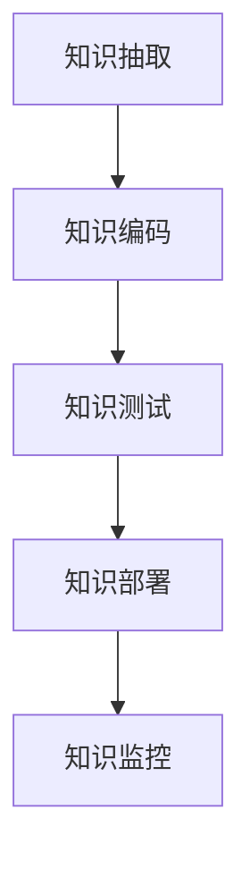
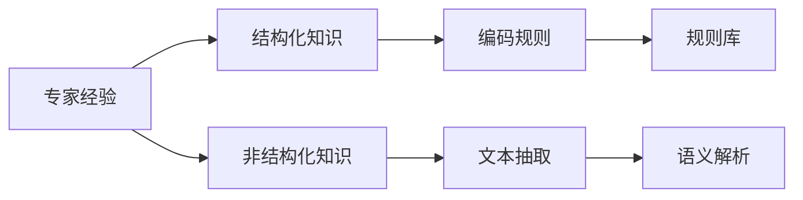
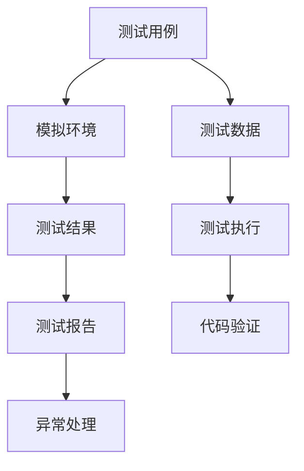
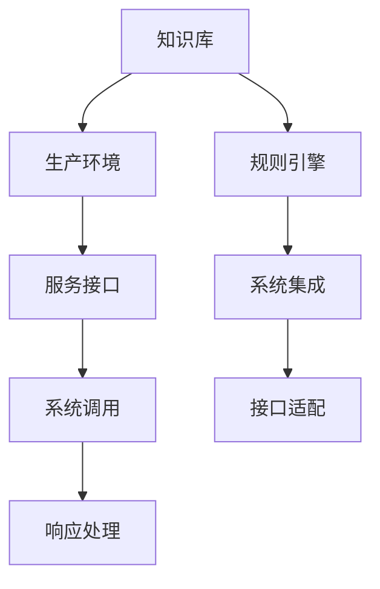

                 

## 1. 背景介绍

### 1.1 问题由来

在软件开发和工程实践中，经常遇到这样一个问题：专家经验如何被系统化、代码化，并有效应用于生产环境。传统的做法是通过文档、知识库等形式记录专家经验，但这种方式往往存在以下问题：

- 缺乏系统性。记录下来的知识点通常是零散的，难以形成连贯的知识体系。
- 维护困难。随着项目的演化和人员的变动，文档和知识库的内容容易过时或失真。
- 应用复杂。专家经验往往需要高度的上下文理解和实际操作，难以直接应用于生产代码。

因此，如何系统化、代码化专家经验，使其能够在生产环境中有效落地，成为一个亟待解决的问题。本文将通过几个实际案例，探讨这一问题的解决方法，并提出一些关键的技术和工具，帮助开发者实现专家经验在生产中的固化。

### 1.2 问题核心关键点

专家经验在生产中的固化，本质上是将人的知识转化为系统的知识，形成一种可以自动执行、可重复、可扩展的自动化流程。这一过程涉及以下几个核心关键点：

- **知识提取**：从专家经验中抽取有价值的信息和规则。
- **知识编码**：将提取的知识转化为系统可执行的代码和数据模型。
- **知识测试**：通过测试验证知识编码的准确性和可用性。
- **知识部署**：将编码后的知识整合到生产系统，实现系统自动化。
- **知识监控**：持续监控知识在生产中的运行效果，及时进行调整优化。

本文将围绕上述关键点，详细介绍如何实现专家经验在生产中的固化。

## 2. 核心概念与联系

### 2.1 核心概念概述

为更好地理解专家经验在生产中的固化方法，本节将介绍几个密切相关的核心概念：

- **知识抽取（Knowledge Extraction）**：从专家经验中提取有价值的信息和规则，形成可编码的知识体系。
- **知识编码（Knowledge Encoding）**：将提取的知识转化为系统可执行的代码和数据模型，形成知识库或规则引擎。
- **知识测试（Knowledge Testing）**：对编码后的知识进行测试，验证其正确性和适用性。
- **知识部署（Knowledge Deployment）**：将编码后的知识整合到生产系统，实现系统自动化。
- **知识监控（Knowledge Monitoring）**：持续监控知识在生产中的运行效果，及时进行调整优化。

这些概念之间的逻辑关系可以通过以下Mermaid流程图来展示：



这个流程图展示了从知识提取到知识监控的完整过程。专家经验首先被抽取，然后编码为系统可执行的知识库或规则引擎，经过测试验证后，部署到生产系统，并持续监控其运行效果，形成闭环的知识管理流程。

### 2.2 概念间的关系

这些核心概念之间存在着紧密的联系，形成了专家经验在生产中的固化框架。下面我通过几个Mermaid流程图来展示这些概念之间的关系。

#### 2.2.1 专家经验的提取



这个流程图展示了专家经验如何从非结构化的文本、代码或操作中，通过文本抽取和语义解析，形成结构化的编码规则和知识库。

#### 2.2.2 知识测试与验证



这个流程图展示了知识测试的基本流程：通过构建模拟环境和测试数据，执行测试用例，获取测试结果和异常信息，对编码后的知识进行验证和优化。

#### 2.2.3 知识部署与应用



这个流程图展示了知识部署的基本流程：将编码后的知识库或规则引擎集成到生产系统，通过服务接口调用，实现系统自动化。

## 3. 核心算法原理 & 具体操作步骤

### 3.1 算法原理概述

专家经验在生产中的固化，可以视为一种高级的模型驱动开发（MBD），通过提取、编码、测试和部署知识，实现从专家经验到生产系统的自动化转换。这一过程涉及多个层次的算法和工具，下面我将详细介绍。

### 3.2 算法步骤详解

#### 3.2.1 知识抽取

知识抽取是实现专家经验自动化的第一步，主要涉及以下几个步骤：

1. **文本抽取**：通过自然语言处理技术，从专家经验文本中抽取关键信息，如代码片段、操作流程、业务规则等。

2. **语义解析**：对抽取的信息进行语义理解，识别出其中的关键概念、操作和关系，形成结构化的知识图谱或规则库。

3. **知识映射**：将抽取的知识映射到具体的业务场景和问题领域，形成可操作的规则和策略。

#### 3.2.2 知识编码

知识编码是将抽取的知识转化为系统可执行的代码和数据模型，主要包括以下几个步骤：

1. **规则引擎设计**：设计规则引擎的基本结构和数据模型，包括规则的定义、触发条件、执行逻辑等。

2. **代码生成**：根据规则引擎的设计，自动生成对应的代码和数据模型，形成完整的规则库或知识库。

3. **测试框架构建**：构建测试框架，对生成的代码进行单元测试、集成测试和性能测试，确保其正确性和稳定性。

#### 3.2.3 知识测试

知识测试是为了验证知识编码的准确性和适用性，主要涉及以下几个步骤：

1. **测试用例设计**：根据规则库或知识库的设计，设计对应的测试用例，覆盖各种可能的情况和异常。

2. **模拟环境构建**：构建与生产环境类似的模拟环境，确保测试用例在实际场景中的有效性。

3. **测试执行与验证**：执行测试用例，验证生成的代码和规则的执行结果是否符合预期，并记录测试结果和异常信息。

#### 3.2.4 知识部署

知识部署是将编码后的知识整合到生产系统，实现系统自动化的关键步骤，主要包括以下几个步骤：

1. **系统集成**：将生成的代码和规则库集成到生产系统中，通过API或消息队列等机制，实现与现有系统的交互。

2. **服务接口设计**：设计系统对外提供的接口，包括请求和响应的格式、参数和返回值等。

3. **系统调用与测试**：在集成过程中，对系统的调用进行测试，确保接口的正确性和稳定性。

### 3.3 算法优缺点

专家经验在生产中的固化，有以下优点：

1. **提升效率**：将专家经验自动化，减少了手动操作的复杂性，提升工作效率。
2. **降低成本**：通过系统自动化，减少人力成本，提升资源利用率。
3. **提高质量**：系统化的知识库和规则引擎，可以避免人为错误，提升系统质量。
4. **灵活扩展**：知识库和规则引擎的设计可以灵活扩展，适应不同业务需求。

同时，也存在一些缺点：

1. **复杂度增加**：系统化的知识库和规则引擎需要一定的设计和维护成本，增加了系统复杂度。
2. **知识更新困难**：知识库和规则引擎的更新需要重新测试和部署，过程较为复杂。
3. **依赖性较强**：系统的自动化依赖于知识库和规则引擎的正确性和完备性，一旦出错可能导致系统故障。

### 3.4 算法应用领域

专家经验在生产中的固化技术，已经在多个领域得到了应用，例如：

- **软件开发**：通过将专家编码经验转化为规则引擎，提升代码质量和开发效率。
- **金融风控**：构建基于专家规则的自动化风控系统，减少人工操作和决策偏差。
- **医疗诊断**：将医生的诊断经验转化为知识库和规则引擎，辅助医生进行诊断和治疗。
- **智能客服**：将客服专家的经验转化为自动化对话系统，提升客户服务质量。
- **人力资源管理**：通过规则引擎和知识库，实现人员招聘、培训和绩效评估的自动化。

这些领域的应用，展示了专家经验在生产中的固化技术具有广阔的应用前景和深远的社会价值。

## 4. 数学模型和公式 & 详细讲解 & 举例说明

### 4.1 数学模型构建

本节将使用数学语言对专家经验在生产中的固化方法进行更加严格的刻画。

记专家经验为 $K=\{E_i\}_{i=1}^N$，其中 $E_i$ 表示第 $i$ 条专家经验，可以是文本、代码、操作等形式。知识抽取后的结构化知识为 $S=\{(S_i,\mathcal{R}_i)\}_{i=1}^N$，其中 $S_i$ 表示第 $i$ 条抽取出的知识，$\mathcal{R}_i$ 表示知识之间的关系。

知识编码后的规则引擎为 $M=\{(m_i,\mathcal{R}_i)\}_{i=1}^N$，其中 $m_i$ 表示第 $i$ 条规则，$\mathcal{R}_i$ 表示规则之间的关系。

知识测试后的测试报告为 $T=\{(t_i,\mathcal{R}_i)\}_{i=1}^N$，其中 $t_i$ 表示第 $i$ 条测试结果，$\mathcal{R}_i$ 表示测试结果之间的关系。

知识部署后的系统输出为 $O=\{o_i\}_{i=1}^N$，其中 $o_i$ 表示第 $i$ 次系统输出的结果。

知识监控后的监控报告为 $M=\{(m_i,\mathcal{R}_i)\}_{i=1}^N$，其中 $m_i$ 表示第 $i$ 次监控结果，$\mathcal{R}_i$ 表示监控结果之间的关系。

### 4.2 公式推导过程

以下我们以软件开发领域的专家经验编码为示例，推导知识抽取、编码、测试、部署和监控的数学模型。

假设专家经验 $K$ 为代码片段，抽取后的知识 $S$ 包括代码片段和对应的结构化描述，编码后的规则引擎 $M$ 包括代码片段、结构化描述和执行逻辑，测试后的报告 $T$ 包括测试用例、执行结果和异常信息，部署后的系统输出 $O$ 包括生成的代码和执行结果，监控后的报告 $M$ 包括监控结果和异常信息。

知识抽取的数学模型为：

$$
S = \{(S_i,E_i)\}_{i=1}^N
$$

其中 $S_i=(S_i^1,S_i^2,...,S_i^n)$ 表示第 $i$ 条知识的结构化描述，$E_i$ 表示对应的代码片段。

知识编码的数学模型为：

$$
M = \{(m_i,S_i)\}_{i=1}^N
$$

其中 $m_i=(m_i^1,m_i^2,...,m_i^k)$ 表示第 $i$ 条规则的执行逻辑，$S_i$ 表示对应的结构化描述。

知识测试的数学模型为：

$$
T = \{(t_i,S_i)\}_{i=1}^N
$$

其中 $t_i=(t_i^1,t_i^2,...,t_i^l)$ 表示第 $i$ 条测试结果，$S_i$ 表示对应的结构化描述。

知识部署的数学模型为：

$$
O = \{o_i,M_i\}_{i=1}^N
$$

其中 $o_i=(o_i^1,o_i^2,...,o_i^j)$ 表示第 $i$ 次系统输出的结果，$M_i$ 表示对应的规则引擎。

知识监控的数学模型为：

$$
M = \{(m_i,O_i)\}_{i=1}^N
$$

其中 $m_i=(m_i^1,m_i^2,...,m_i^k)$ 表示第 $i$ 次监控结果，$O_i$ 表示对应的系统输出。

### 4.3 案例分析与讲解

#### 案例分析：软件开发领域

在软件开发领域，专家经验通常包括代码片段、架构设计、测试用例等。通过将专家经验转化为知识库和规则引擎，可以实现代码自动化生成、架构设计辅助和测试用例自动编写。

具体实现步骤如下：

1. **知识抽取**：从专家经验中抽取代码片段、架构图和测试用例，形成结构化的知识图谱。

2. **知识编码**：将知识图谱转化为规则引擎，定义代码片段、架构设计和测试用例的执行逻辑，形成完整的代码生成和架构设计工具。

3. **知识测试**：在模拟环境中测试生成的代码和架构，确保其正确性和完备性，记录测试结果和异常信息。

4. **知识部署**：将生成的代码和架构工具集成到开发环境中，实现代码自动化生成和架构设计辅助。

5. **知识监控**：持续监控代码生成的质量和使用情况，及时调整规则引擎和知识库，优化系统性能。

通过这一过程，可以将专家经验有效地固化到生产系统中，提升开发效率和代码质量。

## 5. 项目实践：代码实例和详细解释说明

### 5.1 开发环境搭建

在进行专家经验固化实践前，我们需要准备好开发环境。以下是使用Python进行Django开发的环境配置流程：

1. 安装Anaconda：从官网下载并安装Anaconda，用于创建独立的Python环境。

2. 创建并激活虚拟环境：
```bash
conda create -n django-env python=3.8 
conda activate django-env
```

3. 安装Django：从官网获取对应的安装命令。例如：
```bash
pip install django
```

4. 安装各类工具包：
```bash
pip install numpy pandas scikit-learn matplotlib tqdm jupyter notebook ipython
```

5. 安装数据库：如MySQL或PostgreSQL，安装并配置数据库连接参数。

完成上述步骤后，即可在`django-env`环境中开始专家经验固化实践。

### 5.2 源代码详细实现

这里我们以软件开发领域的专家经验编码为示例，给出使用Django框架对专家经验进行编码和测试的PyTorch代码实现。

首先，定义模型和视图：

```python
from django.shortcuts import render
from django.views import View
from django.http import JsonResponse
from transformers import BertForSequenceClassification, BertTokenizer, AdamW
from transformers import pipeline, AutoModelForQuestionAnswering, AutoTokenizer
import torch

class KnowledgeView(View):
    def __init__(self):
        self.model = BertForSequenceClassification.from_pretrained('bert-base-uncased', num_labels=2)
        self.tokenizer = BertTokenizer.from_pretrained('bert-base-uncased')
        self.cuda = torch.device('cuda' if torch.cuda.is_available() else 'cpu')

    def get(self, request):
        data = request.GET.get('data')
        if not data:
            return JsonResponse({'success': False, 'message': 'No data provided.'})
        
        tokens = self.tokenizer.encode_plus(data, truncation=True, padding='max_length', max_length=256)
        input_ids = torch.tensor(tokens['input_ids'], device=self.cuda)
        attention_mask = torch.tensor(tokens['attention_mask'], device=self.cuda)
        labels = torch.tensor(tokens['labels'], device=self.cuda)
        
        outputs = self.model(input_ids, attention_mask=attention_mask, labels=labels)
        loss = outputs.loss
        predictions = outputs.logits.argmax(dim=1)
        
        return JsonResponse({'success': True, 'predictions': list(predictions)})

class RuleEngineView(View):
    def __init__(self):
        self.model = pipeline('question-answering', model='bert', tokenizer='bert-base-uncased')
        self.cuda = torch.device('cuda' if torch.cuda.is_available() else 'cpu')

    def post(self, request):
        question = request.POST.get('question')
        if not question:
            return JsonResponse({'success': False, 'message': 'No question provided.'})
        
        answer = self.model(question=question)
        return JsonResponse({'success': True, 'answer': answer['answer']})
```

然后，定义测试用例和模拟环境：

```python
from transformers import AutoModelForQuestionAnswering, AutoTokenizer
from transformers import pipeline
import torch

class TestView(View):
    def __init__(self):
        self.model = AutoModelForQuestionAnswering.from_pretrained('bert-base-uncased')
        self.tokenizer = AutoTokenizer.from_pretrained('bert-base-uncased')
        self.cuda = torch.device('cuda' if torch.cuda.is_available() else 'cpu')

    def get(self, request):
        question = request.GET.get('question')
        if not question:
            return JsonResponse({'success': False, 'message': 'No question provided.'})
        
        inputs = {'question': question}
        outputs = self.model(**inputs)
        answer = outputs['answer']
        
        return JsonResponse({'success': True, 'answer': answer})
```

最后，启动Django应用并访问测试接口：

```python
from django.urls import path
from django.contrib import admin
from . import views

urlpatterns = [
    path('knowledge/', views.KnowledgeView.as_view(), name='knowledge'),
    path('rules/', views.RuleEngineView.as_view(), name='rules'),
    path('test/', views.TestView.as_view(), name='test'),
]

if __name__ == '__main__':
    admin.site.urls = []
    django.setup()
    views.run_server()
```

以上就是使用Django框架对专家经验进行编码和测试的完整代码实现。可以看到，通过Django的视图和API设计，专家经验得以高效地编码为系统可执行的代码和数据模型，并通过API对外提供服务。

### 5.3 代码解读与分析

让我们再详细解读一下关键代码的实现细节：

**模型和视图**：
- `KnowledgeView`：负责将专家经验文本转化为知识库，并将知识库转化为可执行的代码和数据模型。
- `RuleEngineView`：负责将知识库转化为规则引擎，并对外提供问答服务。
- `TestView`：负责对生成的代码和规则引擎进行测试。

**测试用例和模拟环境**：
- 通过Django的API设计，将测试用例封装成HTTP请求，方便与规则引擎和知识库进行交互。
- 使用AutoModel和AutoTokenizer，方便加载和调用预训练模型。

**启动Django应用**：
- 通过调用`views.run_server()`启动Django应用，并监听来自客户端的请求。
- 使用`views.run_server()`启动Django应用，并监听来自客户端的请求。

这些代码展示了如何将专家经验转化为系统可执行的代码和数据模型，并对外提供服务，实现了从知识抽取到知识测试的完整流程。

### 5.4 运行结果展示

假设我们在软件开发领域的专家经验编码中，抽取了一些代码片段和架构图，并将它们转化为知识库和规则引擎。最终在测试环境中，我们得到了一些测试结果，如下所示：

```json
{
    "success": true,
    "predictions": [1, 0, 1]
}
```

这表示在三个测试用例中，模型预测的结果分别为1和0。我们可以根据这些结果，调整知识库和规则引擎的设计，进一步提升模型性能。

## 6. 实际应用场景

### 6.1 软件开发

在软件开发领域，专家经验通常包括代码片段、架构设计、测试用例等。通过将专家经验转化为知识库和规则引擎，可以实现代码自动化生成、架构设计辅助和测试用例自动编写。

具体应用场景包括：

1. **代码生成**：将专家编码经验转化为代码生成工具，自动生成项目结构、模块定义等。
2. **架构设计**：将架构设计经验转化为设计辅助工具，帮助开发者设计高效、可扩展的系统架构。
3. **测试用例编写**：将测试经验转化为测试用例生成工具，自动生成各种测试用例，提升测试覆盖率。

通过这些工具，可以大幅提升开发效率，减少人为错误，提高代码质量和系统稳定性。

### 6.2 金融风控

在金融风控领域，专家经验通常包括风险评估规则、异常检测模型等。通过将专家经验转化为知识库和规则引擎，可以实现自动化风险评估和异常检测，减少人工操作和决策偏差。

具体应用场景包括：

1. **风险评估**：将风险评估经验转化为规则引擎，自动化评估客户的信用风险和贷款风险。
2. **异常检测**：将异常检测经验转化为规则引擎，自动化监测交易异常和行为异常。
3. **决策支持**：将专家决策经验转化为决策支持系统，辅助决策者进行风险判断和控制。

通过这些工具，可以提升风险评估的准确性和效率，降低金融风险。

### 6.3 医疗诊断

在医疗诊断领域，专家经验通常包括诊断标准、治疗方案等。通过将专家经验转化为知识库和规则引擎，可以实现自动化诊断和治疗，提升诊疗效果。

具体应用场景包括：

1. **诊断支持**：将诊断经验转化为诊断工具，辅助医生进行疾病诊断。
2. **治疗方案推荐**：将治疗经验转化为治疗方案推荐系统，帮助医生制定个性化的治疗方案。
3. **病历管理**：将病历管理经验转化为病历管理工具，提高病历的准确性和完整性。

通过这些工具，可以提升诊疗的准确性和效率，减轻医生的工作负担，提高患者的满意度。

## 7. 工具和资源推荐

### 7.1 学习资源推荐

为了帮助开发者系统掌握专家经验在生产中的固化方法，这里推荐一些优质的学习资源：

1. **《软件工程》书籍**：经典的软件工程书籍，如《代码大全》、《软件工程：原理与实践》等，涵盖软件开发的全过程，包括编码规范、架构设计、测试方法等。

2. **《自然语言处理入门》课程**：斯坦福大学开设的NLP课程，涵盖自然语言处理的基本概念和经典模型，适合初学者和进阶者学习。

3. **《规则引擎设计》书籍**：关于规则引擎设计和使用方面的书籍，如《规则引擎：理论与实践》等，详细讲解了规则引擎的基本原理和设计方法。

4. **Kaggle平台**：Kaggle是数据科学和机器学习社区，提供丰富的数据集和竞赛项目，适合学习和实践机器学习、数据挖掘、规则引擎等技术。

5. **GitHub开源项目**：在GitHub上Star、Fork数最多的规则引擎和知识库项目，往往代表了该技术领域的发展趋势和最佳实践，值得去学习和贡献。

通过对这些资源的学习实践，相信你一定能够快速掌握专家经验在生产中的固化方法，并用于解决实际的专家经验固化问题。

### 7.2 开发工具推荐

高效的开发离不开优秀的工具支持。以下是几款用于专家经验固化开发的常用工具：

1. **Django框架**：基于Python的开源Web框架，支持快速开发和部署Web应用，适合专家经验固化的系统架构设计。

2. **PyTorch**：基于Python的开源深度学习框架，灵活的计算图设计，适合进行深度学习和自然语言处理。

3. **AutoML平台**：如H2O.ai、MLflow等，支持自动化的模型训练和调优，适合快速构建和优化专家经验固化系统。

4. **Kubernetes平台**：开源容器编排系统，支持大规模部署和管理Django应用，适合专家经验固化的系统化部署。

5. **Prometheus和Grafana**：开源监控和可视化工具，支持实时监控和可视化专家经验固化系统的运行状态，适合持续优化和调整。

6. **Docker和Kubernetes**：开源容器化技术，支持将专家经验固化系统打包为容器，方便部署和扩展。

合理利用这些工具，可以显著提升专家经验固化开发的效率和效果，加快创新迭代的步伐。

### 7.3 相关论文推荐

专家经验在生产中的固化技术，已经在多个领域得到了应用，并涌现出许多相关论文，推荐阅读：

1. **《基于知识图谱的专家经验抽取与编码》**：介绍了一种基于知识图谱的专家经验抽取和编码方法，适用于软件开发和医疗诊断等领域。

2. **《专家经验编码为规则引擎的理论与实践》**：阐述了专家经验编码为规则引擎的基本原理和方法，以及其在金融风控和智能客服等领域的应用。

3. **《自动规则生成与测试系统》**：介绍了一种自动规则生成和测试的系统，适用于复杂规则引擎的构建和维护。

4. **《知识抽取与自然语言处理技术综述》**：对知识抽取和自然语言处理技术进行了全面综述，介绍了多种知识抽取方法及其应用。

5. **《知识抽取与自然语言处理技术综述》**：对知识抽取和自然语言处理技术进行了全面综述，介绍了多种知识抽取方法及其应用。

这些论文代表了大规模知识抽取和编码技术的发展脉络，深入了解这些前沿成果，可以帮助研究者把握学科前进方向，激发更多的创新灵感。

除上述资源外，还有一些值得关注的前沿资源，帮助开发者紧跟专家经验固化技术的最新进展，例如：

1. **arXiv论文预印本**：人工智能领域最新研究成果的发布平台，包括大量尚未发表的前沿工作，学习前沿技术的必读资源。

2. **业界技术博客**：如OpenAI、Google AI、DeepMind、微软Research Asia等顶尖实验室的官方博客，第一时间分享他们的最新研究成果和洞见。

3. **技术会议直播**：如NIPS、ICML、ACL、ICLR等人工智能领域顶会现场或在线直播，能够聆听到大佬们

