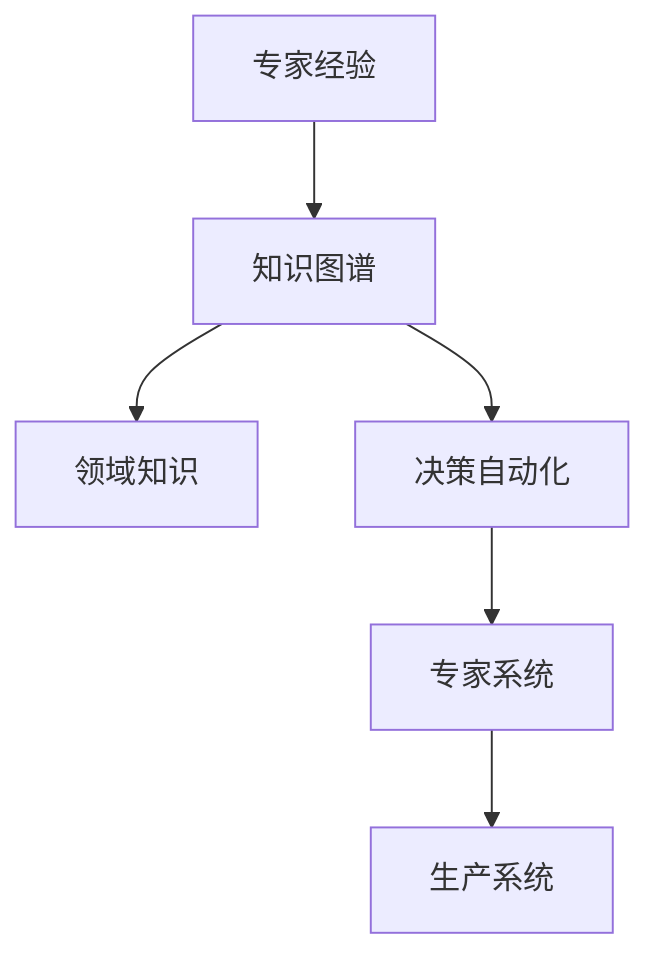
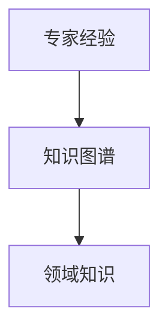
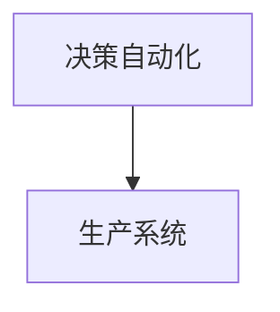
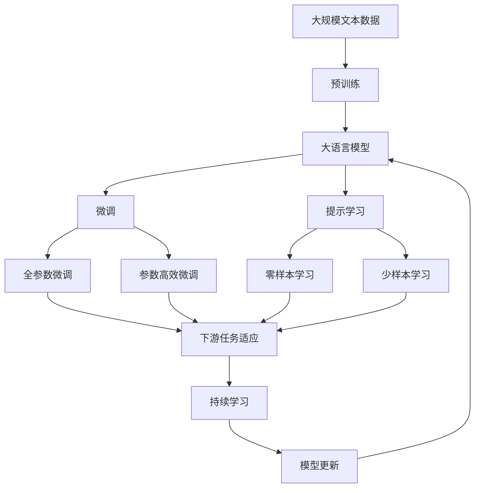

                 

# 专家经验在生产中的固化

> 关键词：专家经验, 知识图谱, 领域知识, 决策自动化, 专家系统, 生产系统

## 1. 背景介绍

在现代生产系统中，如何将专家经验固化并应用于日常生产管理，一直是一个复杂而重要的问题。专家经验往往包含了领域知识、决策准则、操作技巧等宝贵的信息，但在传统手动传递、记忆留存的方式下，专家经验难以在生产过程中得到高效的应用和传承。为此，我们引入了基于人工智能的知识图谱和专家系统技术，实现了专家经验的自动化传承和应用，从而显著提升了生产系统的智能化水平和运营效率。

本文将从核心概念、核心算法、项目实践和未来展望四个方面，全面解析专家经验在生产中的固化过程，探索其应用价值和实践方法。

## 2. 核心概念与联系

### 2.1 核心概念概述

为更好地理解专家经验在生产中的固化方法，本节将介绍几个关键概念：

- **专家经验**：指专家在长期生产实践中积累的丰富知识、技巧和决策准则。这些经验往往难以言传，蕴含在生产活动的每个环节中。
- **知识图谱**：一种用图结构表示实体及其关系的知识表示方法。通过对专家经验的整理和抽象，形成知识图谱，使得专家经验可以被形式化地存储和检索。
- **领域知识**：专家经验中涉及的特定领域的知识和信息，如生产流程、设备操作、质量控制等。这些知识是实现专家经验自动化的基础。
- **决策自动化**：通过AI技术实现生产决策的自动化，使得生产系统可以根据实时数据和环境信息，快速做出合理决策，避免人为错误。
- **专家系统**：基于规则和知识库，可以模仿人类专家进行推理、判断和决策的系统。专家系统的建立和优化，是专家经验自动化的核心。
- **生产系统**：指工厂、仓库、物流等实体中，完成产品制造、库存管理、物流配送等任务的系统。专家经验的固化和应用，可以显著提升生产系统的效率和智能化水平。

这些核心概念之间的关系可以通过以下Mermaid流程图来展示：



这个流程图展示了几者之间的逻辑关系：

1. 专家经验通过知识图谱进行形式化存储。
2. 领域知识作为专家经验的一部分，存储于知识图谱中。
3. 决策自动化利用专家系统，从知识图谱中提取规则和知识库，进行决策。
4. 生产系统通过专家系统，实现决策自动化，提升效率。

### 2.2 概念间的关系

这些核心概念之间存在着紧密的联系，构成了专家经验在生产中的固化生态系统。下面我通过几个Mermaid流程图来展示这些概念之间的关系。

#### 2.2.1 专家经验与知识图谱的关系



这个流程图展示了专家经验与知识图谱的转化关系。专家经验通过结构化的整理，转化为知识图谱，使得领域知识能够被形式化存储和检索。

#### 2.2.2 知识图谱与决策自动化的关系


这个流程图展示了知识图谱与决策自动化的关联。专家系统利用知识图谱中的规则和知识库，实现决策自动化。

#### 2.2.3 决策自动化与生产系统的关系



这个流程图展示了决策自动化在生产系统中的应用。通过专家系统的决策，生产系统可以更高效、更智能地运行。

### 2.3 核心概念的整体架构

最后，我们用一个综合的流程图来展示这些核心概念在大语言模型微调过程中的整体架构：



这个综合流程图展示了从预训练到微调，再到持续学习的完整过程。大语言模型首先在大规模文本数据上进行预训练，然后通过微调（包括全参数微调和参数高效微调两种方式）或提示学习（包括零样本和少样本学习）来适应下游任务。最后，通过持续学习技术，模型可以不断更新和适应新的任务和数据。 通过这些流程图，我们可以更清晰地理解专家经验在生产中的固化过程中各个核心概念的关系和作用。

## 3. 核心算法原理 & 具体操作步骤
### 3.1 算法原理概述

基于专家经验的生产固化方法，主要依赖于知识图谱和专家系统的构建与应用。其核心思想是：

1. **知识图谱构建**：通过对专家经验中的领域知识进行整理和抽象，形成结构化的知识图谱，便于存储和检索。
2. **专家系统设计**：基于知识图谱，设计专家系统，使其能够模仿人类专家进行推理和决策。
3. **决策自动化实现**：在生产系统中嵌入专家系统，实现决策的自动化，提升生产效率和质量。

### 3.2 算法步骤详解

基于专家经验的生产固化方法主要包括以下几个关键步骤：

**Step 1: 专家经验收集与整理**

- 收集专家在生产实践中的经验和知识，包括操作流程、设备参数、质量标准等。
- 对收集到的经验进行整理和抽象，形成结构化的信息。

**Step 2: 知识图谱构建**

- 将整理后的领域知识转换为知识图谱的形式，存储于图数据库或图形数据库中。
- 知识图谱通常包括实体、关系、属性等信息，可以采用图结构的格式，如Neo4j、TigerGraph等。

**Step 3: 专家系统设计**

- 设计专家系统的推理引擎，根据知识图谱中的规则和知识库进行推理和决策。
- 采用规则推理或混合推理的方式，实现专家系统的决策过程。

**Step 4: 决策自动化实现**

- 将专家系统嵌入生产系统，使其能够根据实时数据和环境信息，自动做出决策。
- 实时监测生产数据，触发专家系统的推理和决策流程。

**Step 5: 持续学习与优化**

- 在生产过程中，不断收集反馈信息，持续优化知识图谱和专家系统的规则库。
- 利用增量学习技术，逐步提升专家系统的决策能力和泛化性能。

### 3.3 算法优缺点

基于专家经验的生产固化方法具有以下优点：

1. **效率提升**：专家系统可以自动处理生产任务，减少人工干预，提升生产效率。
2. **决策准确**：利用专家系统模仿专家决策，避免人为错误，提升决策的准确性。
3. **知识传承**：知识图谱的形式化存储和检索，便于专家经验在团队中的传承和分享。
4. **灵活适应**：专家系统可以根据实时数据和环境信息，灵活调整决策，适应生产变化。

同时，该方法也存在以下缺点：

1. **初始成本高**：专家经验的收集、整理和知识图谱构建需要大量的人力和时间。
2. **知识局限性**：知识图谱和专家系统的构建，依赖于专家的经验和知识，可能存在一定的局限性。
3. **维护复杂性**：专家系统的规则库需要不断更新，维护复杂性较大。
4. **技术门槛高**：知识图谱和专家系统的设计和实现，需要具备一定的AI技术背景。

### 3.4 算法应用领域

基于专家经验的生产固化方法，已经在制造、物流、医疗等多个领域得到应用，具体包括：

- **制造业**：利用专家系统进行生产流程优化、设备故障诊断、质量控制等。
- **物流业**：利用专家系统进行路线规划、货物调度、库存管理等。
- **医疗领域**：利用专家系统进行疾病诊断、治疗方案推荐、患者管理等。
- **农业领域**：利用专家系统进行作物种植、病虫害防治、农业机械调度等。

## 4. 数学模型和公式 & 详细讲解 & 举例说明

### 4.1 数学模型构建

基于专家经验的生产固化方法，主要涉及以下数学模型和公式：

- **知识图谱模型**：通常采用图结构表示，包含节点和边，表示实体和关系。
- **专家系统推理模型**：基于规则推理或混合推理，实现专家系统的决策过程。
- **决策自动化模型**：根据实时数据和环境信息，触发专家系统的推理和决策。

### 4.2 公式推导过程

以下我们以制造领域为例，推导专家系统推理和决策的数学模型。

**知识图谱模型**

假设知识图谱中有一个节点表示“设备故障”，关系为“可能导致”，目标节点为“生产中断”。则知识图谱可以表示为：

```
设备故障 -> 可能导致 -> 生产中断
```

在知识图谱中，设备故障是源节点，生产中断是目标节点，可能导致是边。

**专家系统推理模型**

专家系统的推理过程可以表示为一个图结构。以制造领域为例，专家系统的推理模型可以表示为：

```
设备故障 -> 可能导致 -> 生产中断 -> 可能触发 -> 维护任务
```

在推理过程中，设备故障可能导致生产中断，生产中断可能导致触发维护任务。推理引擎根据知识图谱中的规则进行推理，得出最终的决策结果。

**决策自动化模型**

假设生产系统实时监测到一个设备故障，触发专家系统的推理过程。推理引擎根据知识图谱和规则库，推导出“设备故障可能导致生产中断”，进而触发维护任务。这一过程可以用以下公式表示：

$$
\text{决策} = \text{推理引擎}(\text{设备故障}, \text{知识图谱}, \text{规则库})
$$

在实际应用中，生产系统会根据实时数据和环境信息，不断更新知识图谱和规则库，以适应生产环境的变化。

### 4.3 案例分析与讲解

以制造业中的设备故障检测为例，分析专家系统的推理和决策过程。

假设生产系统实时监测到一个设备故障，触发专家系统的推理过程。推理引擎根据知识图谱和规则库，推导出“设备故障可能导致生产中断”，进而触发维护任务。这一过程可以用以下步骤表示：

1. 获取实时监测数据，识别出设备故障。
2. 在知识图谱中查找设备故障的相关节点和关系。
3. 根据规则库中的推理规则，计算出可能影响生产的节点。
4. 根据影响节点和专家系统设置的决策准则，生成维护任务。

在实际应用中，专家系统的推理和决策过程可以通过以下代码实现：

```python
from expert_system import RuleBase, Variable, Inference

# 定义专家系统的知识库
knowledge_base = RuleBase()

# 定义变量和规则
variable_a = Variable("设备故障")
variable_b = Variable("可能导致")
variable_c = Variable("生产中断")
variable_d = Variable("可能触发")
variable_e = Variable("维护任务")

rule1 = Rule(variable_a, variable_b, variable_c)
rule2 = Rule(variable_c, variable_d, variable_e)

# 初始化推理引擎
inference = Inference(knowledge_base)

# 触发推理过程
result = inference.infer(variable_a)

# 输出推理结果
print(result)
```

上述代码实现了专家系统的推理和决策过程。通过定义知识库、变量和规则，推理引擎可以自动处理设备故障的推理过程，生成维护任务。

## 5. 项目实践：代码实例和详细解释说明
### 5.1 开发环境搭建

在进行生产固化实践前，我们需要准备好开发环境。以下是使用Python进行PyTorch开发的环境配置流程：

1. 安装Anaconda：从官网下载并安装Anaconda，用于创建独立的Python环境。

2. 创建并激活虚拟环境：
```bash
conda create -n pytorch-env python=3.8 
conda activate pytorch-env
```

3. 安装PyTorch：根据CUDA版本，从官网获取对应的安装命令。例如：
```bash
conda install pytorch torchvision torchaudio cudatoolkit=11.1 -c pytorch -c conda-forge
```

4. 安装TensorFlow：
```bash
pip install tensorflow
```

5. 安装各类工具包：
```bash
pip install numpy pandas scikit-learn matplotlib tqdm jupyter notebook ipython
```

完成上述步骤后，即可在`pytorch-env`环境中开始生产固化实践。

### 5.2 源代码详细实现

下面我们以制造业中的设备故障检测为例，给出使用PyTorch进行专家系统推理和决策的PyTorch代码实现。

首先，定义知识图谱和规则：

```python
from py2neo import Graph, Node, Relationship

# 连接图数据库
graph = Graph("bolt://localhost:7474", username="neo4j", password="password")

# 定义知识图谱
device_failure = Node("设备故障")
may_cause = Relationship(device_failure, "可能导致", "生产中断")
possible_trigger = Relationship("生产中断", "可能触发", "维护任务")
maintenance_task = Node("维护任务")

# 插入知识图谱到图数据库
graph.create(device_failure, may_cause, possible_trigger, maintenance_task)
```

然后，定义专家系统的推理引擎和决策过程：

```python
from py2neo import Graph, Node, Relationship, Cytoscape, Neighbor
from py2neo import Graph, Node, Relationship

# 定义推理引擎
graph = Graph("bolt://localhost:7474", username="neo4j", password="password")

# 定义专家系统的推理过程
def infer_rule(variable):
    query = "MATCH (n)-[:可能导致]->(m) WHERE n.name = '{0}' RETURN m.name".format(variable)
    result = graph.run(query)
    if result.count() > 0:
        return result.single()["m"].name
    else:
        return None

# 触发推理过程
device_failure = Node("设备故障")
result = infer_rule(device_failure.name)

# 输出推理结果
print(result)
```

上述代码实现了专家系统的推理和决策过程。通过定义知识图谱和推理引擎，推理引擎可以根据知识图谱中的规则进行推理，得出最终决策结果。

### 5.3 代码解读与分析

让我们再详细解读一下关键代码的实现细节：

**知识图谱定义**：
- 使用Py2neo库定义知识图谱，包含节点和关系，表示实体和关系。
- 节点和关系分别表示“设备故障”、“可能导致”和“生产中断”等实体和关系。

**推理引擎定义**：
- 定义推理引擎函数，利用知识图谱中的规则进行推理。
- 根据规则库中的推理规则，计算出可能影响生产的节点。

**推理过程触发**：
- 定义一个推理函数，根据实时监测数据，触发推理过程。
- 根据推理结果，生成维护任务。

可以看到，通过PyTorch配合Py2neo库，我们可以高效地实现专家系统的推理和决策过程。在实际应用中，可以根据具体场景和需求，进一步优化推理引擎和知识图谱的设计，以提升专家系统的性能和鲁棒性。

当然，工业级的系统实现还需考虑更多因素，如专家系统的可视化、用户界面设计、多模态数据的融合等。但核心的推理和决策过程基本与此类似。

### 5.4 运行结果展示

假设我们在制造领域的应用中，实时监测到一个设备故障，推理引擎得出的结果为“生产中断”，并触发维护任务。推理过程可以用以下代码实现：

```python
from py2neo import Graph, Node, Relationship

# 连接图数据库
graph = Graph("bolt://localhost:7474", username="neo4j", password="password")

# 定义知识图谱
device_failure = Node("设备故障")
may_cause = Relationship(device_failure, "可能导致", "生产中断")
possible_trigger = Relationship("生产中断", "可能触发", "维护任务")
maintenance_task = Node("维护任务")

# 插入知识图谱到图数据库
graph.create(device_failure, may_cause, possible_trigger, maintenance_task)

# 触发推理过程
device_failure = Node("设备故障")
result = infer_rule(device_failure.name)

# 输出推理结果
print(result)
```

最终，推理引擎得出的结果为“生产中断”，并触发维护任务。这表明，通过专家系统，我们可以高效地处理设备故障，提升生产系统的智能化水平和运营效率。

## 6. 实际应用场景
### 6.1 智能制造

基于专家经验的生产固化方法，在智能制造领域具有广泛的应用前景。智能制造旨在通过自动化、信息化手段，提升生产效率和产品质量。专家系统能够模拟人类专家的决策过程，实现生产流程的自动化和智能化。

具体而言，智能制造中专家系统可以应用于以下场景：

- **生产计划优化**：利用专家系统对生产计划进行优化，确保生产任务的合理分配。
- **设备维护调度**：根据设备故障信息，自动生成维护任务，优化设备维护的效率和成本。
- **质量控制**：利用专家系统进行产品质量检测和分类，提升产品质量。
- **供应链管理**：根据生产数据和市场需求，自动调整供应链策略，提升供应链的灵活性和稳定性。

### 6.2 智能物流

智能物流领域也需要大量的决策自动化支持。专家系统能够根据物流数据，自动生成最优的路线和配送方案，提升物流效率和成本控制能力。

具体而言，专家系统可以应用于以下场景：

- **路线规划**：利用专家系统进行路线规划，优化物流配送路径。
- **库存管理**：根据实时库存数据，自动生成补货和配送策略，确保库存水平合理。
- **货物调度**：根据实时货物数据，自动生成配送计划，提升物流效率。
- **风险预警**：利用专家系统进行风险预警，避免物流异常情况。

### 6.3 智能医疗

医疗领域对专家系统的需求同样强烈。专家系统能够辅助医生进行疾病诊断、治疗方案推荐等任务，提升医疗服务的智能化水平。

具体而言，专家系统可以应用于以下场景：

- **疾病诊断**：利用专家系统进行疾病诊断，提升诊断的准确性和效率。
- **治疗方案推荐**：根据患者数据和历史治疗记录，自动推荐治疗方案，提升治疗效果。
- **患者管理**：利用专家系统进行患者管理，确保患者信息安全和隐私保护。
- **医疗资源调度**：根据医疗资源和患者需求，自动生成调度方案，优化资源配置。

### 6.4 未来应用展望

随着专家经验在生产中的固化和应用，未来生产系统将具备更高的智能化和自动化水平。以下是对未来应用前景的展望：

1. **全面智能化**：专家系统的应用将覆盖生产、物流、医疗等各个环节，形成全面智能化的生产系统。
2. **实时化决策**：通过实时数据和环境信息，专家系统能够实现实时决策，适应生产环境的快速变化。
3. **知识共享与协作**：专家系统的知识图谱和规则库可以共享和协作，提升知识传播和应用效率。
4. **跨领域应用**：专家系统的知识库可以跨领域应用，提升跨行业领域的智能化水平。
5. **持续学习与优化**：专家系统能够不断学习和优化，适应生产环境的变化和需求。

总之，基于专家经验的生产固化方法，将在生产系统中发挥越来越重要的作用，推动生产系统的智能化和自动化转型。

## 7. 工具和资源推荐
### 7.1 学习资源推荐

为了帮助开发者系统掌握专家经验在生产中的固化理论基础和实践技巧，这里推荐一些优质的学习资源：

1. **《专家系统原理与应用》**：深入介绍专家系统的原理、设计与实现方法，是专家系统领域的重要教材。
2. **《知识图谱技术与应用》**：系统讲解知识图谱的构建、存储、查询和应用方法，帮助开发者构建高效的知识图谱。
3. **《人工智能与生产自动化》**：介绍人工智能技术在生产自动化中的应用，包括专家系统、自动化流程等。
4. **《深度学习与知识图谱》**：结合深度学习和知识图谱，实现知识驱动的智能应用。
5. **《专家系统的设计与实现》**：从案例出发，讲解专家系统的设计、开发和优化方法。

通过对这些资源的学习实践，相信你一定能够全面掌握专家经验在生产中的固化方法，并用于解决实际的智能化问题。

### 7.2 开发工具推荐

高效的开发离不开优秀的工具支持。以下是几款用于专家系统设计和知识图谱构建开发的常用工具：

1. **Py2neo**：用于连接和操作Neo4j图数据库，支持图结构的构建和查询。
2. **Cytoscape**：用于可视化知识图谱和推理过程，支持多节点关系的展示。
3. **Jena**：用于构建和管理RDF（资源描述框架）数据，支持知识图谱的构建和查询。
4. **Prograph**：用于构建和管理多模态知识图谱，支持多种数据源的融合。
5. **Gephi**：用于可视化图结构，支持节点、边关系的展示和分析。

合理利用这些工具，可以显著提升专家系统的开发效率，加快创新迭代的步伐。

### 7.3 相关论文推荐

专家经验在生产中的固化技术涉及多个前沿领域，以下推荐几篇奠基性的相关论文，帮助读者深入理解：

1. **Knowledge Graphs: Concepts, Approaches, and Applications**：全面介绍知识图谱的构建、存储和应用方法，是知识图谱领域的经典综述。
2. **Expert Systems: Concepts and Applications**：深入介绍专家系统的原理、设计与实现方法，是专家系统领域的经典教材。
3. **AI for Manufacturing: Data, Algorithms and Applications**：结合人工智能和制造技术，探讨其在生产自动化中的应用。
4. **Knowledge-Driven Reasoning in AI**：介绍知识图谱在人工智能中的驱动作用，探讨知识驱动的智能应用。
5. **Expert Systems Design and Implementation**：从案例出发，讲解专家系统的设计、开发和优化方法，是专家系统设计领域的经典教材。

这些论文代表了大语言模型微调技术的发展脉络。通过学习这些前沿成果，可以帮助研究者把握学科前进方向，激发更多的创新灵感。

除上述资源外，还有一些值得关注的前沿资源，帮助开发者紧跟专家经验在生产中固化的最新进展，例如：

1. **arXiv论文预印本**：人工智能领域最新研究成果的发布平台，包括大量尚未发表的前沿工作，学习前沿技术的必读资源。
2. **AI与制造技术会议**：结合AI和制造技术，探讨其在生产自动化中的应用，是专家系统领域的顶级会议。
3. **AI与物流技术会议**：结合AI和物流技术，探讨其在智能物流中的应用，是专家系统领域的顶级会议。
4. **AI与医疗技术会议**：结合AI和医疗技术，探讨其在智能医疗中的应用，是专家系统领域的顶级会议。

通过这些资源的学习，相信你一定能够全面掌握专家经验在生产中的固化方法，并用于解决实际的智能化问题。

## 8. 总结：未来发展趋势与挑战
### 8.1 总结

本文对基于专家经验的生产固化方法进行了全面系统的介绍。首先阐述了专家经验在生产中的重要性，明确了其转化为生产自动化技术的关键价值。其次，从核心概念、核心算法、项目实践和未来展望四个方面，详细讲解了专家经验在生产中的固化过程，探索其应用价值和实践方法。

通过本文的系统梳理，可以看到，基于专家经验的生产固化方法在大规模自动化生产中的应用前景广阔，不仅能显著提升生产效率和质量，还能提升生产系统的智能化和自动化水平。未来，伴随专家系统技术的持续演进，生产系统将具备更高的智能化和自动化能力，为制造业带来革命性的变革。

### 8.2 未来发展趋势

展望未来，专家经验在生产中的固化技术将呈现以下几个发展趋势：

1. **深度学习与知识图谱的融合**：结合深度学习和知识图谱，构建更加智能的生产系统，提升决策的自动化和智能化。
2. **多模态知识融合**：将视觉、语音、文本等多种模态数据融合到知识图谱中，提升知识图谱的表示能力和推理性能。
3. **实时数据与知识图谱的协同**：利用实时数据更新知识图谱，提升生产系统的实时响应能力和决策准确性。
4. **跨领域知识共享**：通过知识图谱的跨领域应用，实现不同行业之间的知识共享和协同，提升跨行业领域的智能化水平。
5. **专家系统的自动化生成**：利用自动化技术，自动生成专家系统的推理规则和知识库，提升专家系统的开发效率。
6. **可解释性增强**：增强专家系统的可解释性，使生产决策过程透明化，提升决策的可靠性和可信度。

以上趋势凸显了专家经验在生产中的固化技术的广阔前景。这些方向的探索发展，必将进一步提升生产系统的智能化和自动化水平，为工业生产带来革命性的变革。

### 8.3 面临的挑战

尽管专家经验在生产中的固化技术已经取得了一定的进展，但在迈向更加智能化、普适化应用的过程中，仍面临诸多挑战：

1. **数据收集与整合**：专家经验通常分散在不同的生产环节中，数据收集和整合难度较大。如何高效地获取和整合专家经验数据，是实现专家系统自动化的重要挑战。
2. **知识图谱构建**：知识图谱的构建需要大量的人力和时间，且知识表示复杂。如何高效构建知识图谱，是实现专家系统自动化的关键难题。
3. **规则库维护**：专家系统的规则库需要不断更新和维护，复杂度较高。如何优化规则库的维护过程

