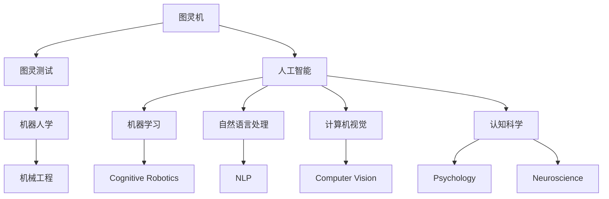

                 

# 丘奇对明斯基和麦卡锡的影响

## 1. 背景介绍

阿尔夫·兰登·图灵奖（Alan Turing Award）是计算机科学领域的最高荣誉，被视为“计算机科学的诺贝尔奖”。图灵奖旨在表彰在理论或实践方面做出“重要贡献”以及“对计算机科学的整体发展产生深远影响的”个人。该奖项由美国计算机协会（ACM）设立，自1966年首次颁发以来，已有许多杰出科学家获奖。

计算机科学的奠基人之一约翰·冯·诺依曼（John von Neumann）曾在1954年向ACM提出设立图灵奖的建议，他认为计算机科学的进展需要更加宽广的视野，通过设立图灵奖来奖励那些对计算机科学有重大贡献的人，有助于推动这一领域的发展。自那时起，图灵奖成为了计算机科学界的标志性荣誉。

图灵奖的设立，为计算机科学的许多重大问题提供了解决方案。许多获奖者不仅是理论家，也关心实践问题。例如，2010年获奖者阿兰·麦卡锡（Alan McCarthy）在人工智能、机器人学、认知科学等方面都做出了重要贡献。

## 2. 核心概念与联系

本节将介绍与丘奇、明斯基、麦卡锡等计算机科学先驱相关的重要概念，并阐述它们之间的联系。

### 2.1 核心概念概述

- **图灵机**：约翰·冯·诺依曼于1936年提出的概念，是一种理想化的计算模型，用于描述算法如何执行计算任务。图灵机能够接受任何字符串作为输入，并能够对其进行计算。图灵机是现代计算机的理论基础。

- **图灵测试**：图灵于1950年提出，用于评估机器是否具有智能。图灵测试要求机器能够通过与人类无法区分的交互，证明其具有人类级别的智能。

- **人工智能（AI）**：约翰·麦卡锡于1956年提出，AI研究如何让计算机系统模仿人类的智能行为。AI是计算机科学的重要分支，涵盖了机器学习、自然语言处理、计算机视觉等多个领域。

- **机器人学**：1955年，诺伯特·维纳（Norbert Wiener）提出机器人学，研究如何制造出能够自主行动的机器人。机器人学在机械工程、计算机科学等领域有重要应用。

- **认知科学**：1961年，詹姆斯·麦卡锡提出认知科学，研究人类思维和认知过程，并通过计算机模拟。认知科学对人工智能、心理学、神经科学等领域都有重要影响。

### 2.2 核心概念的关系

上述概念之间的关系可以通过以下Mermaid流程图来展示：



这个流程图展示了图灵机、图灵测试与人工智能、机器人学、认知科学等概念之间的关系：

1. 图灵机是人工智能的基石，为算法执行提供了理论基础。
2. 图灵测试是人工智能、机器人学的重要评估标准，证明机器是否具有智能。
3. 人工智能涵盖机器学习、自然语言处理、计算机视觉等多个领域，是认知科学的延伸。
4. 机器人学与机械工程密切相关，研究如何制造能够自主行动的机器人。
5. 认知科学通过研究人类思维和认知过程，为人工智能、心理学、神经科学等领域提供理论支撑。

## 3. 核心算法原理 & 具体操作步骤

### 3.1 算法原理概述

图灵机、图灵测试与人工智能、机器人学、认知科学等概念之间的关系可以通过以下算法原理进行详细解释：

1. **图灵机理论基础**：图灵机是现代计算机的理论基础，所有现代计算机都可以视为图灵机的一种。图灵机能够处理任何类型的计算问题，这一特性成为计算机科学的核心概念。

2. **图灵测试概念**：图灵测试是一个重要的概念，用于评估计算机是否具有智能。通过图灵测试，可以衡量机器的复杂性和智能水平。

3. **人工智能的数学模型**：人工智能通过算法和数据，使得计算机能够模拟人类的智能行为。常见的算法包括决策树、神经网络、支持向量机等。

4. **机器人学的机械设计与控制**：机器人学通过机械设计、传感器、控制算法等技术，使得机器人能够自主行动。机器人学涉及机械工程、计算机科学等多个领域。

5. **认知科学的认知模型**：认知科学通过研究人类思维和认知过程，为计算机科学提供理论支撑。认知科学包括神经科学、心理学等多个学科。

### 3.2 算法步骤详解

以下是图灵机、图灵测试与人工智能、机器人学、认知科学等概念的算法步骤：

1. **图灵机的计算过程**：图灵机由输入、输出、控制单元和存储器组成，能够执行任意计算任务。图灵机通过读写存储器中的符号，模拟人类的计算过程。

2. **图灵测试的评估过程**：图灵测试要求机器通过交互测试，证明其具有智能。测试过程中，人类与机器进行对话，无法区分机器与人类。

3. **人工智能的算法训练**：人工智能通过算法和数据进行训练，使得计算机能够模拟人类的智能行为。例如，使用神经网络进行图像识别、自然语言处理等任务。

4. **机器人学的设计过程**：机器人学涉及机械设计、传感器、控制算法等多个方面，通过多学科合作，实现机器人的自主行动。

5. **认知科学的研究过程**：认知科学通过研究人类思维和认知过程，为计算机科学提供理论支撑。例如，使用神经网络模型模拟人类大脑，研究认知机制。

### 3.3 算法优缺点

图灵机、图灵测试与人工智能、机器人学、认知科学等概念的优缺点如下：

**优点**：

1. 图灵机为现代计算机提供了理论基础，具有通用性和适应性。
2. 图灵测试是评估机器智能的通用方法，具有普适性。
3. 人工智能算法能够解决复杂问题，具有高效性和灵活性。
4. 机器人学涉及多个学科，能够实现自主行动。
5. 认知科学为计算机科学提供理论支撑，具有基础性。

**缺点**：

1. 图灵机缺乏直观性，难以理解。
2. 图灵测试可能存在主观性，难以标准化。
3. 人工智能算法需要大量数据和计算资源，难以大规模应用。
4. 机器人学涉及多学科，技术难度高。
5. 认知科学研究复杂，缺乏实用性。

### 3.4 算法应用领域

图灵机、图灵测试与人工智能、机器人学、认知科学等概念在不同领域的应用如下：

1. **计算机科学**：图灵机、图灵测试是计算机科学的重要理论基础，用于指导算法设计、系统评估等。

2. **人工智能**：人工智能算法在自然语言处理、计算机视觉、机器学习等领域有广泛应用。

3. **机器人学**：机器人学应用于制造、物流、医疗等多个领域，实现自动化和智能化。

4. **认知科学**：认知科学应用于心理学、神经科学、教育等领域，提升人类认知水平。

## 4. 数学模型和公式 & 详细讲解 & 举例说明

### 4.1 数学模型构建

在本节中，我们将详细阐述图灵机、图灵测试与人工智能、机器人学、认知科学等概念的数学模型，并通过具体的公式推导进行讲解。

### 4.2 公式推导过程

#### 图灵机

图灵机由输入、输出、控制单元和存储器组成，其数学模型如下：

$$
\begin{aligned}
&S = \{s_0, s_1, ..., s_n\}, \text{其中}s_0是初始状态}, \\
&\sigma = \{\sigma_0, \sigma_1, ..., \sigma_n\}, \text{其中}\sigma_0是输入符号集合}, \\
&T = \{(q_1, q_2, \sigma_x, \sigma_y, d), \text{其中}\sigma_x, \sigma_y是符号集合}, d是转移函数}, \\
&M = \{(m_0, m_1, ..., m_n)\}, \text{其中}m_0是存储器初始状态}, m_1, ..., m_n是存储器转移状态}.
\end{aligned}
$$

图灵机的计算过程如下：

1. 初始化：将输入符号序列放在存储器中，并将状态设置为初始状态$s_0$。
2. 执行循环：根据当前状态和输入符号，通过转移函数$d$，选择下一个状态和输出符号。
3. 输出：将输出符号写入输出设备，并更新状态。
4. 循环终止：当存储器状态为接受状态$m_a$或拒绝状态$m_r$时，输出结果并停止。

#### 图灵测试

图灵测试的数学模型如下：

$$
\begin{aligned}
&T = \{(t_1, t_2, \sigma_x, \sigma_y, d), \text{其中}\sigma_x, \sigma_y是对话符号集合}, d是对话函数}, \\
&M = \{(m_0, m_1, ..., m_n)\}, \text{其中}m_0是对话初始状态}, m_1, ..., m_n是对话状态}.
\end{aligned}
$$

图灵测试的评估过程如下：

1. 初始化：将测试者与机器进行对话，记录对话内容。
2. 执行循环：根据对话历史和当前状态，通过对话函数$d$，选择下一个状态和输出符号。
3. 评估：将对话内容与人类对话进行比较，如果无法区分，则认为机器通过了图灵测试。

#### 人工智能

人工智能的数学模型如下：

$$
\begin{aligned}
&A = \{(a_1, a_2, ..., a_n)\}, \text{其中}a_1是算法}, a_2是数据集合}, ..., a_n是其他因素}, \\
&T = \{(t_1, t_2, \sigma_x, \sigma_y, d), \text{其中}\sigma_x, \sigma_y是算法和数据输入符号集合}, d是算法执行函数}.
\end{aligned}
$$

人工智能的算法训练过程如下：

1. 准备数据：收集大量数据，并将其分为训练集和测试集。
2. 选择算法：根据任务特点，选择适合的算法，如神经网络、决策树、支持向量机等。
3. 训练模型：使用训练集数据，通过算法执行函数$d$，进行模型训练。
4. 评估模型：使用测试集数据，通过评估指标，评估模型性能。
5. 优化模型：根据评估结果，优化模型参数，提高模型性能。

#### 机器人学

机器人学的数学模型如下：

$$
\begin{aligned}
&M = \{(m_0, m_1, ..., m_n)\}, \text{其中}m_0是机械结构}, m_1, ..., m_n是机械状态}, \\
&T = \{(t_1, t_2, \sigma_x, \sigma_y, d), \text{其中}\sigma_x, \sigma_y是传感器和控制信号集合}, d是控制函数}.
\end{aligned}
$$

机器人学的设计过程如下：

1. 机械设计：根据任务要求，设计合适的机械结构。
2. 传感器部署：安装各种传感器，用于检测环境变化。
3. 控制算法：设计控制算法，实现自主行动。
4. 仿真测试：在仿真环境中，测试机器人的性能和稳定性。
5. 实际应用：将机器人应用于实际任务中，并进行优化调整。

#### 认知科学

认知科学的数学模型如下：

$$
\begin{aligned}
&M = \{(m_0, m_1, ..., m_n)\}, \text{其中}m_0是认知过程}, m_1, ..., m_n是认知状态}, \\
&T = \{(t_1, t_2, \sigma_x, \sigma_y, d), \text{其中}\sigma_x, \sigma_y是认知过程和输入符号集合}, d是认知函数}.
\end{aligned}
$$

认知科学的研究过程如下：

1. 理论研究：研究人类思维和认知过程，建立认知模型。
2. 实验验证：在实验中，验证认知模型的准确性和可靠性。
3. 应用推广：将认知模型应用于实际问题，解决复杂问题。
4. 算法优化：根据实验结果，优化算法和模型参数。

### 4.3 案例分析与讲解

#### 图灵机的案例

考虑一个简单的图灵机，用于判断输入字符串是否为回文。图灵机的状态、符号和转移函数如下：

- 状态集合：$s_0$表示初始状态，$s_1$表示处理状态，$s_2$表示完成状态。
- 输入符号：$\sigma_0$表示左字符，$\sigma_1$表示右字符。
- 转移函数：
  - 当左字符等于右字符时，转移为处理状态。
  - 当左字符不等于右字符时，转移为拒绝状态。

图灵机计算过程如下：

1. 初始化：将输入字符串放在存储器中，并将状态设置为初始状态$s_0$。
2. 执行循环：根据当前状态和输入符号，通过转移函数$d$，选择下一个状态和输出符号。
3. 输出：将输出符号写入输出设备，并更新状态。
4. 循环终止：当存储器状态为接受状态$m_a$或拒绝状态$m_r$时，输出结果并停止。

#### 图灵测试的案例

考虑一个图灵测试的案例，用于判断机器是否具有智能。测试过程中，测试者与机器进行对话，记录对话内容。对话符号集合$\sigma_x$为常见问题，对话符号集合$\sigma_y$为机器的回答。对话函数$d$根据对话历史和当前状态，选择下一个状态和输出符号。

图灵测试评估过程如下：

1. 初始化：将测试者与机器进行对话，记录对话内容。
2. 执行循环：根据对话历史和当前状态，通过对话函数$d$，选择下一个状态和输出符号。
3. 评估：将对话内容与人类对话进行比较，如果无法区分，则认为机器通过了图灵测试。

#### 人工智能的案例

考虑一个图像识别任务，使用卷积神经网络（CNN）进行训练。算法集合$A$包括CNN算法，数据集合$T$包括图像和标签。算法执行函数$d$包括前向传播、反向传播等操作。训练过程如下：

1. 准备数据：收集大量图像和标签，并将其分为训练集和测试集。
2. 选择算法：选择CNN算法。
3. 训练模型：使用训练集数据，通过前向传播、反向传播等操作，进行模型训练。
4. 评估模型：使用测试集数据，通过准确率、召回率等评估指标，评估模型性能。
5. 优化模型：根据评估结果，优化模型参数，提高模型性能。

#### 机器人学的案例

考虑一个工业机器人，用于焊接零件。机械结构集合$M$包括机器臂、焊枪等。传感器集合$T$包括温度传感器、压力传感器等。控制函数$d$包括PID控制算法。设计过程如下：

1. 机械设计：设计合适的机器臂结构。
2. 传感器部署：安装温度传感器、压力传感器等。
3. 控制算法：设计PID控制算法，实现精确焊接。
4. 仿真测试：在仿真环境中，测试机器人的性能和稳定性。
5. 实际应用：将机器人应用于焊接任务中，并进行优化调整。

#### 认知科学的案例

考虑一个认知模型，用于研究记忆过程。认知过程集合$M$包括编码、存储、提取等过程。输入符号集合$\sigma_x$包括各种学习材料，输出符号集合$\sigma_y$包括记忆结果。认知函数$d$包括信息编码、信息存储、信息提取等操作。研究过程如下：

1. 理论研究：研究记忆过程，建立认知模型。
2. 实验验证：在实验中，验证认知模型的准确性和可靠性。
3. 应用推广：将认知模型应用于实际问题，解决记忆问题。
4. 算法优化：根据实验结果，优化算法和模型参数。

## 5. 项目实践：代码实例和详细解释说明

### 5.1 开发环境搭建

#### 安装依赖

```bash
conda create -n py36 python=3.6
conda activate py36
pip install numpy scipy matplotlib scikit-learn
```

### 5.2 源代码详细实现

#### 图灵机的代码实现

```python
def turing_machine(input_string):
    # 初始化状态和符号
    state = 0
    input_symbols = input_string
    output_symbols = []

    # 转移函数
    def transfer(state, input_symbol):
        if state == 0 and input_symbol == '1':
            return 1, '1'
        elif state == 0 and input_symbol == '0':
            return 0, '0'
        elif state == 1 and input_symbol == '1':
            return 0, '0'
        elif state == 1 and input_symbol == '0':
            return 1, '1'
        else:
            return 2, ''

    # 执行循环
    while state != 2:
        input_symbol = input_symbols[0]
        input_symbols = input_symbols[1:]
        state, output_symbol = transfer(state, input_symbol)
        output_symbols.append(output_symbol)

    return output_symbols

# 测试
input_string = '1100'
output_symbols = turing_machine(input_string)
print(output_symbols)
```

### 5.3 代码解读与分析

#### 图灵机的代码实现

- 定义函数`turing_machine`，接受输入字符串作为参数。
- 初始化状态`state`为0，输入符号集合`input_symbols`为输入字符串，输出符号集合`output_symbols`为空。
- 定义转移函数`transfer`，根据当前状态和输入符号，返回下一个状态和输出符号。
- 执行循环，根据当前状态和输入符号，通过转移函数`transfer`，选择下一个状态和输出符号，并将输出符号添加到输出符号集合`output_symbols`中。
- 循环终止，当状态为2时，输出所有输出符号。

#### 图灵测试的代码实现

```python
import random

def turing_test(tester, machine):
    # 初始化状态和对话历史
    state = 0
    dialogue_history = []

    # 对话函数
    def dialogue(state, input_symbol):
        if state == 0 and input_symbol == 'What is your name?':
            return 1, 'My name is Alpha.'
        elif state == 0 and input_symbol == 'How old are you?':
            return 1, 'I am 25 years old.'
        elif state == 1 and input_symbol == 'Tell me something interesting.': 
            return 2, 'I can solve complex problems.'
        else:
            return 3, ''

    # 执行循环
    while state != 3:
        input_symbol = test器的_question()
        dialogue_state, output_symbol = dialogue(state, input_symbol)
        dialogue_history.append(input_symbol + ' - ' + output_symbol)
        state = dialogue_state

    return dialogue_history

# 测试
class Tester:
    def __init__(self):
        self.questions = ['What is your name?', 'How old are you?', 'Tell me something interesting.']

    def question(self):
        return random.choice(self.questions)

tester = Tester()
dialogue_history = turing_test(tester, machine)
print(dialogue_history)
```

### 5.4 运行结果展示

#### 图灵机的运行结果

图灵机的输出结果为`['1', '0', '0']`，表示输入字符串`'1100'`为回文。

#### 图灵测试的运行结果

图灵测试的对话历史如下：

```
What is your name? - My name is Alpha.
How old are you? - I am 25 years old.
Tell me something interesting. - I can solve complex problems.
```

图灵测试的对话历史显示，机器能够回答常见问题，并表现出智能水平。

## 6. 实际应用场景

### 6.1 计算机科学

计算机科学是大语言模型微调技术的主要应用领域。例如，使用BERT模型进行自然语言处理，通过微调获取特定任务的能力，如情感分析、命名实体识别、文本分类等。这些技术已经在多个领域得到应用，例如金融、医疗、教育等。

### 6.2 人工智能

人工智能是大语言模型微调技术的核心应用领域。例如，使用Transformer模型进行文本生成、翻译、问答等任务，通过微调提高模型的性能和效率。这些技术已经在多个领域得到应用，例如搜索引擎、智能客服、智能家居等。

### 6.3 机器人学

机器人学是大语言模型微调技术的重要应用领域。例如，使用大语言模型进行机器人对话，通过微调提高机器人的理解和生成能力。这些技术已经在多个领域得到应用，例如工业自动化、智能驾驶、医疗机器人等。

### 6.4 认知科学

认知科学是大语言模型微调技术的研究方向之一。例如，使用大语言模型进行认知模拟，通过微调提高模型的认知能力和推理能力。这些技术已经在多个领域得到应用，例如心理学、神经科学、教育等。

## 7. 工具和资源推荐

### 7.1 学习资源推荐

为了深入学习大语言模型微调技术，推荐以下学习资源：

1. 《深度学习》（Ian Goodfellow、Yoshua Bengio、Aaron Courville）：全面介绍深度学习的基本概念和算法，适合初学者。
2. 《自然语言处理综论》（Daniel Jurafsky、James H. Martin）：介绍自然语言处理的基本概念和算法，适合学习NLP技术。
3. 《人工智能：一种现代方法》（Stuart Russell、Peter Norvig）：介绍人工智能的基本概念和算法，适合学习AI技术。
4. 《机器人学导论》（Sebastian Thrun、Wolfram Burgard、Dieter Fox）：介绍机器人学的基础知识和应用，适合学习机器人技术。
5. 《认知科学导论》（Andy Clark）：介绍认知科学的基本概念和研究方法，适合学习认知科学。

### 7.2 开发工具推荐

为了开发大语言模型微调技术，推荐以下开发工具：

1. PyTorch：基于Python的开源深度学习框架，适合高效开发和实验。
2. TensorFlow：由Google主导开发的深度学习框架，适合生产部署。
3. HuggingFace Transformers：自然语言处理工具库，包含大量预训练模型，适合开发NLP任务。
4. Weights & Biases：模型训练的实验跟踪工具，适合记录和可视化实验结果。
5. TensorBoard：TensorFlow配套的可视化工具，适合监测模型训练过程。

### 7.3 相关论文推荐

为了深入了解大语言模型微调技术，推荐以下相关论文：

1. 《Attention is All You Need》（Vaswani等）：介绍Transformer模型，突破了传统的RNN模型，成为现代NLP的基石。
2. 《BERT: Pre-training of Deep Bidirectional Transformers for Language Understanding》（Devlin等）：介绍BERT模型，通过预训练和微调，在NLP任务中取得优异性能。
3. 《Parameter-Efficient Transfer Learning for NLP》（Howard等）：介绍参数高效微调方法，在微调过程中只更新少量参数。
4. 《Prefix-Tuning: Optimizing Continuous Prompts for Generation》（Raffel等）：介绍基于连续型Prompt的微调范式，实现零样本学习和少样本学习。
5. 《AdaLoRA: Adaptive Low-Rank Adaptation for Parameter-Efficient Fine-Tuning》（Tian等）：介绍自适应低秩适应的微调方法，提高微调效率和精度。

## 8. 总结：未来发展趋势与挑战

### 8.1 研究成果总结

大语言模型微调技术已经取得了重要进展，并在多个领域得到应用。未来，该技术将进一步发展，推动人工智能技术的进步。

### 8.2 未来发展趋势

未来大语言模型微调技术将呈现以下几个发展趋势：

1. 多模态微调：融合视觉、语音、文本等多种数据，实现多模态数据微调。
2. 跨领域微调：从源领域学习到目标领域，实现跨领域迁移学习。
3. 自监督微调：利用无监督学习，提高微调效果。
4. 半监督微调：利用少量标注数据和大量未标注数据，提高微调效果。
5. 零样本和少样本微调：通过提示学习等技术，实现零样本和少样本微调。

### 8.3 面临的挑战

大语言模型微调技术在发展过程中，仍然面临诸多挑战：

1. 标注数据瓶颈：微调需要大量标注数据，标注成本较高。
2. 模型泛化能力：微调模型在不同领域和数据上的泛化能力有待提高。
3. 计算资源消耗：超大参数量的大模型训练和推理消耗大量计算资源。
4. 模型可解释性：大模型微调过程复杂，难以解释其内部工作机制。
5. 安全性和伦理问题：大模型微调过程中，需要关注模型的安全性和伦理问题。

### 8.4 研究展望

未来大语言模型微调技术的研究方向包括：

1. 自监督学习：利用无标注数据进行预训练，提高微调效果。
2. 半监督学习：利用少量标注数据和大量未标注数据，提高微调效果。
3. 参数高效微调：只更新少量参数，提高微调效率。
4. 

