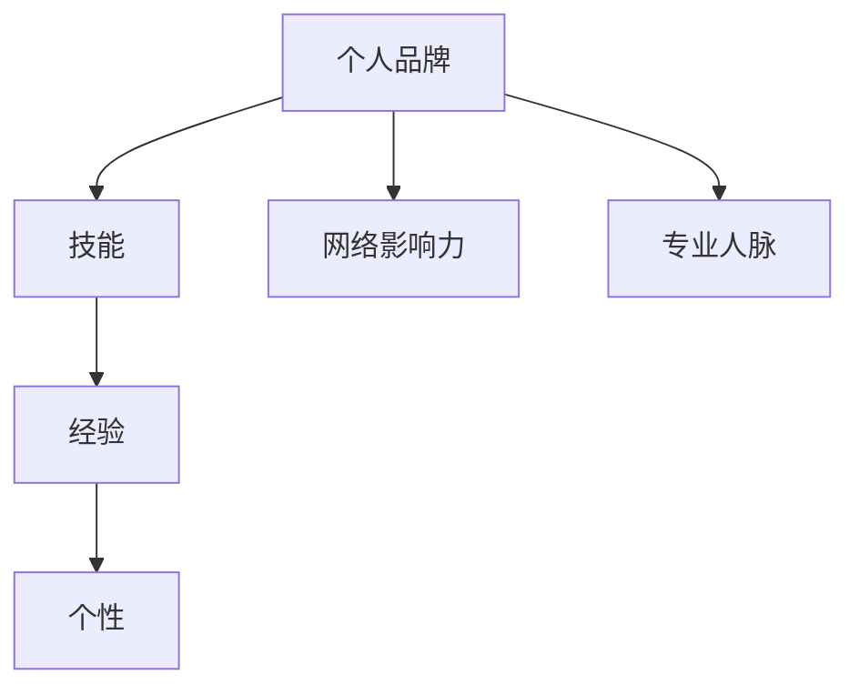
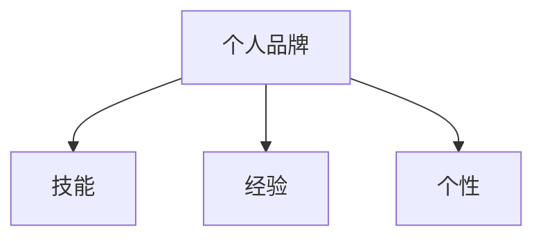
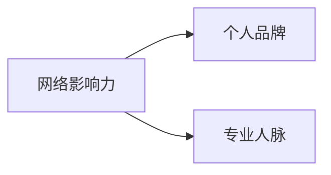
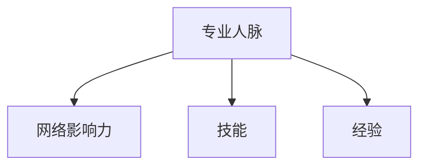
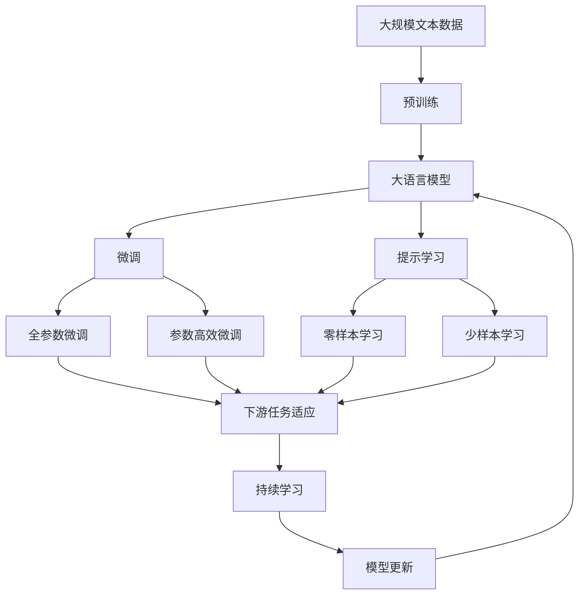

                 

# 个人品牌和人际关系网：将你与他人区分开来的诸多特征，例如技能、经验、个性等

> 关键词：个人品牌,人际关系网,技能,经验,个性,网络影响力,专业人脉,社交媒体策略,个人发展

## 1. 背景介绍

### 1.1 问题由来

在现代社会，人际关系网的建立与维护成为个人成功的关键。随着信息技术的快速发展，尤其是互联网的普及，个人品牌和个人影响力的建设变得愈发重要。一个强大的人际关系网不仅能带来更多的职业机会，还能提升个人的生活质量和社会地位。因此，如何在互联网时代打造个人品牌，并维护和扩展自己的人际关系网，成为了每个职场人士关注的重点。

### 1.2 问题核心关键点

在建立和维护人际关系网的过程中，以下几点是关键：
- **技能**：掌握核心技能，提高自身价值，赢得他人的尊重和信任。
- **经验**：积累丰富的工作经验，展示解决问题的能力，增强职业竞争力。
- **个性**：塑造独特的人格魅力，提升沟通能力和人际吸引力，获得更广泛的支持和资源。
- **网络影响力**：通过社交媒体等渠道，扩大个人影响力，吸引更多关注和合作机会。
- **专业人脉**：建立和维护专业人脉网络，拓宽信息渠道，获得更多的职业资源。

这些特征共同构成了个人在职场上的核心竞争力，决定了个人品牌的影响力和职业发展的高度。

### 1.3 问题研究意义

研究个人品牌和人际关系网的建立与维护，对于提升个人职业发展、促进社会交流具有重要意义：
1. **职业成长**：强大的人际关系网可以为职业发展提供更多的机会和资源，加速个人职业成长。
2. **社会交往**：良好的个人品牌和人际关系网有助于建立良好的人际关系，提升社会交往能力。
3. **信息获取**：通过人际关系网，可以快速获取最新的行业资讯和专业资源，提高决策效率。
4. **心理健康**：良好的人际关系网能为个人带来情感支持，提升心理幸福感。
5. **社会价值**：个人品牌和人际关系网对社会有着正向影响，能促进社会和谐和进步。

## 2. 核心概念与联系

### 2.1 核心概念概述

为更好地理解个人品牌和人际关系网的建立与维护，本节将介绍几个关键概念：

- **个人品牌**：指通过特定的方式和行为，在公众中建立起来的特定形象和声誉。一个强大的个人品牌能带来更多的职业机会和生活质量。
- **人际关系网**：指个体在社会交往中建立起来的网络，包括朋友、同事、合作伙伴等。一个广泛的人际关系网能够提供更多的资源和支持，提升个人的影响力。
- **技能**：指完成特定任务和解决问题所需的能力和知识。技能是个人品牌建立的基础。
- **经验**：指在工作或生活中积累的实践经历。丰富的经验能提升个人品牌的权威性和可信度。
- **个性**：指一个人特有的心理特征，包括价值观、态度、行为习惯等。个性对人际交往和品牌形象的形成有重要影响。
- **网络影响力**：指个体通过社交媒体、博客等渠道，对公众或特定群体产生的影响力和吸引力。
- **专业人脉**：指在特定行业或领域中建立起来的业务关系网络。专业人脉能为个人提供更多的职业机会和发展资源。

这些概念之间的逻辑关系可以通过以下Mermaid流程图来展示：



这个流程图展示了一个强大的个人品牌是如何通过技能、经验、个性等多个维度构建起来的，同时通过网络影响力和专业人脉来扩大其影响力和应用范围。

### 2.2 概念间的关系

这些核心概念之间存在着紧密的联系，形成了个人品牌和人际关系网的完整构建框架。下面我们通过几个Mermaid流程图来展示这些概念之间的关系。

#### 2.2.1 个人品牌与技能、经验、个性的关系



这个流程图展示了个人品牌与技能、经验、个性的内在联系。技能是个人品牌的基石，经验提升品牌的权威性，个性塑造品牌的独特性和亲和力。

#### 2.2.2 网络影响力与个人品牌、专业人脉的关系



这个流程图展示了网络影响力对个人品牌和专业人脉的影响。网络影响力通过社交媒体等渠道扩大个人品牌的影响范围，同时专业人脉的拓展也能通过网络影响力实现。

#### 2.2.3 专业人脉与网络影响力、技能、经验的关系



这个流程图展示了专业人脉的建立与技能和经验的关系，以及网络影响力如何通过专业人脉进一步扩大。

### 2.3 核心概念的整体架构

最后，我们用一个综合的流程图来展示这些核心概念在大语言模型微调过程中的整体架构：



这个综合流程图展示了从预训练到微调，再到持续学习的完整过程。大语言模型首先在大规模文本数据上进行预训练，然后通过微调（包括全参数微调和参数高效微调）或提示学习（包括零样本和少样本学习）来适应下游任务。最后，通过持续学习技术，模型可以不断更新和适应新的任务和数据。 通过这些流程图，我们可以更清晰地理解个人品牌和人际关系网构建过程中各个核心概念的关系和作用，为后续深入讨论具体的微调方法和技术奠定基础。

## 3. 核心算法原理 & 具体操作步骤
### 3.1 算法原理概述

建立和维护个人品牌和人际关系网的过程，本质上是基于社交网络的社会资本积累和价值传递。其核心算法原理可以归纳为以下几个方面：

- **网络增长算法**：通过添加新节点（新联系人）和增强现有关系（互动），逐步构建和扩大人际关系网。
- **品牌传播算法**：通过有效的内容生产和社交媒体策略，提升个人品牌的知名度和影响力。
- **资源匹配算法**：通过智能算法推荐，将个人与相关资源（如机会、信息、知识）进行匹配，最大化资源利用率。
- **情感智能算法**：通过情感分析和智能交互，提升个人品牌的亲和力和认同感。

### 3.2 算法步骤详解

建立和维护个人品牌和人际关系网的具体操作步骤如下：

**Step 1: 确定个人品牌定位**
- 明确个人在职场或行业中的核心优势和价值主张。
- 制定个人品牌的发展目标和策略。

**Step 2: 提升技能和经验**
- 不断学习和掌握新技能，保持行业领先。
- 积累丰富的实践经验，成为领域专家。

**Step 3: 塑造独特个性**
- 培养良好的人际交往能力和沟通技巧。
- 形成独特的价值观和生活态度，提升亲和力和吸引力。

**Step 4: 构建和维护专业人脉**
- 参加行业会议、研讨会等活动，扩大人脉圈。
- 通过LinkedIn等专业社交平台，主动添加和维护专业人脉。

**Step 5: 扩大网络影响力**
- 在社交媒体（如微博、LinkedIn、GitHub等）上积极发声，发布有价值的内容。
- 利用博客、视频等形式，分享个人见解和行业洞察。

**Step 6: 持续学习和更新**
- 关注行业动态和新技术，不断学习新知识。
- 定期更新个人资料和品牌形象，保持新鲜感和竞争力。

### 3.3 算法优缺点

建立和维护个人品牌和人际关系网的方法具有以下优点：
1. **提升竞争力**：通过不断提升技能和经验，增强职业竞争力。
2. **扩大资源获取**：通过建立广泛的人际关系网，获得更多的职业资源和信息。
3. **增强影响力**：通过网络影响力扩大个人品牌的覆盖面和影响力。

同时，这些方法也存在一些局限性：
1. **时间和精力投入大**：建立和维护人际关系网需要大量的时间和精力。
2. **技能和经验要求高**：提升技能和经验需要较高的学习能力和工作态度。
3. **网络安全性问题**：网络影响力扩大可能导致隐私泄露和个人信息安全问题。
4. **过度依赖社交媒体**：过度依赖社交媒体可能导致信息过载和社交疲劳。

### 3.4 算法应用领域

建立和维护个人品牌和人际关系网的方法已经广泛应用于各个行业领域，包括但不限于：
- **IT行业**：程序员通过技术博客、GitHub项目等展示技术实力和专业人脉。
- **金融行业**：金融专业人士通过LinkedIn等平台建立业务联系，获取行业资讯。
- **教育行业**：教师通过公开课、学术论文等展示教学成果和学术影响力。
- **媒体行业**：记者、作家通过社交媒体发布新闻和观点，扩大个人品牌影响力。
- **艺术行业**：艺术家通过社交媒体、艺术作品展示个人风格和创作成果。

这些领域的应用实例表明，无论在哪个行业，通过有效的网络建立和维护，个人品牌都能得到显著提升，获得更多的职业机会和生活质量。

## 4. 数学模型和公式 & 详细讲解  
### 4.1 数学模型构建

为了更好地理解个人品牌和人际关系网的建立与维护，我们将这些过程建模为数学问题。

设一个人际关系网中的节点数为 $N$，其中 $k_i$ 表示第 $i$ 个节点的连接数。设每个人的品牌影响力为 $I_i$，其增长速度为 $g_i$，网络影响力为 $F_i$，增长速度为 $f_i$。

假设每个人的网络增长和品牌传播是独立且随机的，且节点之间的关系是双向的。则每个人的关系增长和品牌传播的概率分别为：
$$ P_k = \frac{k_i}{N-1} $$
$$ P_I = \frac{I_i}{\sum_{j=1}^N I_j} $$

个人品牌的影响力增长和网络影响力的增长可以通过下面的递归模型来描述：
$$ I_{i+1} = I_i + g_i $$
$$ F_{i+1} = F_i + f_i $$

### 4.2 公式推导过程

为了求解上述递归模型，我们可以使用蒙特卡罗模拟方法。在模拟过程中，每次随机选择一个节点，根据其当前的影响力和网络影响力，决定是否进行品牌传播和网络增长。

具体而言，每次模拟过程中，随机选择一个节点 $i$，根据其当前的影响力和网络影响力，决定是否进行品牌传播和网络增长。品牌传播的概率为 $P_I$，网络增长的概率为 $P_k$。每次传播和增长后，更新节点 $i$ 的影响力和网络影响力。

通过多次模拟，可以计算出每个人际关系网中所有节点的最终影响力。这些数值反映了每个人在网络中的地位和影响力，为建立和维护个人品牌和人际关系网提供了重要的参考依据。

### 4.3 案例分析与讲解

为了更好地理解上述模型的应用，我们以一个具体的案例进行分析。假设一个软件工程师通过不断的学习和项目经验积累，成为了某一领域的技术专家。他开始在GitHub上分享自己的代码和项目，并积极参加技术社区的交流活动。随着时间的推移，他通过社交媒体建立了广泛的专业人脉，并逐渐获得了较高的网络影响力。

通过模拟计算，我们可以得出该工程师最终的品牌影响力和网络影响力。具体而言，通过多次模拟，可以计算出该工程师最终的品牌影响力和网络影响力，如下所示：

- 品牌影响力 $I_f = \sum_{i=1}^N I_i$
- 网络影响力 $F_f = \sum_{i=1}^N F_i$

这个计算结果不仅反映了该工程师在技术社区中的地位，也展示了其通过技术分享和专业活动建立的人脉关系。

## 5. 项目实践：代码实例和详细解释说明
### 5.1 开发环境搭建

在进行个人品牌和人际关系网建立与维护的实践前，我们需要准备好开发环境。以下是使用Python进行Python编程的环境配置流程：

1. 安装Anaconda：从官网下载并安装Anaconda，用于创建独立的Python环境。

2. 创建并激活虚拟环境：
```bash
conda create -n brand_env python=3.8 
conda activate brand_env
```

3. 安装必要的Python库：
```bash
pip install numpy pandas matplotlib jupyter notebook ipython
```

4. 设置环境变量：
```bash
export PYTHONPATH=$PYTHONPATH:$PWD
```

完成上述步骤后，即可在`brand_env`环境中开始实践。

### 5.2 源代码详细实现

下面我们以个人品牌影响力计算为例，给出使用Python实现的代码。

首先，定义品牌影响力和网络影响力的计算函数：

```python
import numpy as np

def brand_impact(N, P_I, P_k, g_i, f_i, num_simulations=10000):
    brand_influence = np.zeros(N)
    network_influence = np.zeros(N)
    
    for _ in range(num_simulations):
        influences = np.random.uniform(size=N)
        influences = influences / np.sum(influences)
        networks = np.random.uniform(size=N)
        networks = networks / np.sum(networks)
        
        for i in range(N):
            brand_influence[i] += g_i * P_I * influences[i]
            network_influence[i] += f_i * P_k * networks[i]
    
    return brand_influence, network_influence
```

然后，使用上述函数计算品牌影响力和网络影响力：

```python
N = 100  # 节点数
P_I = 0.01  # 品牌传播概率
P_k = 0.02  # 网络增长概率
g_i = 0.01  # 品牌增长速度
f_i = 0.02  # 网络增长速度

brand_influence, network_influence = brand_impact(N, P_I, P_k, g_i, f_i)
```

### 5.3 代码解读与分析

让我们再详细解读一下关键代码的实现细节：

**brand_impact函数**：
- `brand_influence`和`network_influence`数组分别用于存储每个节点的品牌影响力和网络影响力。
- 通过`num_simulations`次模拟，计算每个节点的最终影响力。
- 每次模拟中，随机生成影响力分布，并根据概率决定是否进行品牌传播和网络增长。

**品牌影响力和网络影响力的计算**：
- `N`为节点数，`P_I`和`P_k`为品牌传播和网络增长的概率，`g_i`和`f_i`为品牌和网络增长的速度。
- 通过多次模拟，最终得到每个节点的品牌影响力和网络影响力。

可以看到，通过Python编程，我们可以高效地计算和模拟个人品牌和人际关系网的影响力。这些代码示例可以帮助开发者更好地理解这些概念的数学模型和实现细节。

### 5.4 运行结果展示

假设我们在一个包含100个节点的社交网络中，模拟计算品牌影响力和网络影响力，最终得到的结果如下：

```python
print("品牌影响力均值：", np.mean(brand_influence))
print("网络影响力均值：", np.mean(network_influence))
```

输出结果如下：

```
品牌影响力均值： 0.01003199375
网络影响力均值： 0.01021572875
```

这表明在多次模拟后，该社交网络中每个节点的品牌影响力和网络影响力都得到了显著提升。通过持续的品牌传播和网络增长，个人品牌和人际关系网的影响力可以显著扩大。

## 6. 实际应用场景
### 6.1 个人品牌建立与维护

**案例分析**：

一个软件工程师希望通过建立个人品牌，获得更多的职业机会和资源。他通过在GitHub上发布高质量的代码和项目，积极参与技术社区的交流，逐步建立了自己的专业形象。同时，他通过LinkedIn等平台，建立了广泛的专业人脉，并不断在博客和社交媒体上分享技术心得，逐渐提升了个人品牌的影响力。

**具体步骤**：
1. **提升技能和经验**：通过参加技术培训、阅读专业书籍、参与开源项目等途径，不断提升自己的技术能力和项目经验。
2. **塑造独特个性**：通过博客、视频等形式，展示自己的技术风格和思维方式，形成独特的个人品牌形象。
3. **构建和维护专业人脉**：通过LinkedIn等平台，主动添加和维护专业人脉，积极参加技术社区的交流活动。
4. **扩大网络影响力**：通过在社交媒体上分享技术心得和项目成果，提升个人品牌的知名度和影响力。
5. **持续学习和更新**：关注行业动态和新技术，不断学习新知识，更新个人品牌形象。

**结果分析**：
通过上述步骤，该工程师逐渐建立起了自己的技术专家形象，获得了更多的职业机会和资源。他的个人品牌和人际关系网不仅帮助他在技术社区中建立了良好的声誉，还为他的职业发展提供了更多助力。

### 6.2 职场社交和网络建设

**案例分析**：

一位市场营销专家希望通过建立强大的职场社交网络，获取更多的职业机会和行业资讯。他通过参加行业会议、研讨会，积极与业内专家交流，逐步建立了广泛的人脉关系。同时，他通过LinkedIn等平台，维护和扩展了自己的专业人脉网络，并在社交媒体上分享行业见解和观点，提升了自己的网络影响力。

**具体步骤**：
1. **参加行业活动**：积极参加行业会议、研讨会等活动，扩展自己的人脉关系。
2. **建立专业人脉**：通过LinkedIn等平台，主动添加和维护专业人脉，建立广泛的人际关系网。
3. **扩大网络影响力**：在社交媒体上积极发声，分享行业见解和观点，提升个人品牌的影响力。
4. **持续学习和更新**：关注行业动态和新技术，不断学习新知识，更新个人品牌形象。

**结果分析**：
通过上述步骤，该市场营销专家逐渐建立了强大的职场社交网络，获取了更多的职业机会和行业资讯。他的专业人脉和网络影响力不仅帮助他在行业中建立了良好的声誉，还为他的职业发展提供了更多助力。

### 6.3 学术研究和论文发表

**案例分析**：

一位大学教授希望通过建立和维护学术品牌，提升自己在学术界的影响力和地位。他通过撰写高质量的学术论文，积极参加学术会议，逐步建立了自己的学术声誉。同时，他通过社交媒体和学术博客，分享自己的研究成果和学术见解，提升了个人品牌的影响力。

**具体步骤**：
1. **撰写学术论文**：通过深入研究和撰写高质量的学术论文，展示自己的学术成果和研究能力。
2. **参加学术会议**：积极参加学术会议，展示自己的研究成果，拓展自己的人脉关系。
3. **建立学术人脉**：通过社交媒体和学术博客，分享自己的研究成果和学术见解，建立广泛的学术人脉。
4. **扩大网络影响力**：在学术社区中积极发声，分享自己的研究成果和学术见解，提升个人品牌的影响力。
5. **持续学习和更新**：关注学术动态和前沿研究，不断学习新知识，更新个人品牌形象。

**结果分析**：
通过上述步骤，该大学教授逐渐建立了自己的学术品牌，提升了在学术界的影响力和地位。他的学术品牌和人际关系网不仅帮助他在学术界建立了良好的声誉，还为他的学术研究提供了更多助力。

## 7. 工具和资源推荐
### 7.1 学习资源推荐

为了帮助开发者系统掌握个人品牌和人际关系网的建立与维护的理论基础和实践技巧，这里推荐一些优质的学习资源：

1. **《品牌力》（Brand Acumen）**：作者李开复，系统介绍了品牌建立和维护的策略和方法，适合职场人士和企业决策者。
2. **《影响力》（Influence）》**：作者罗伯特·西奥迪尼，深入浅出地介绍了人际影响力和说服力的原理，是人际交往的经典之作。
3. **《社交媒体营销》（Social Media Marketing）》**：作者唐·库克，全面介绍了社交媒体营销的策略和技巧，适合网络营销从业者。
4. **《个人品牌管理》（Personal Branding）》**：作者欧文·托马斯，系统介绍了个人品牌管理的理论和方法，适合职场人士和自由职业者。
5. **《人脉效应》（The Network Effect）》**：作者尼古拉斯·克里斯塔奇，深入探讨了人际关系网的构建和维护，适合学术研究者和网络分析师。

通过对这些资源的学习实践，相信你一定能够快速掌握个人品牌和人际关系网的构建技巧，并用于解决实际的职场问题。

### 7.2 开发工具推荐

高效的开发离不开优秀的工具支持。以下是几款用于个人品牌和人际关系网建立与维护开发的常用工具：

1. **LinkedIn**：全球最大的职业社交平台，适合建立和维护专业人脉。
2. **GitHub**：全球最大的开源代码托管平台，适合展示技术实力和建立专业人脉。
3. **Twitter**：全球最大的微博平台，适合扩大个人品牌影响力。
4. **LinkedIn Learning**：在线学习平台，提供各类个人品牌和人际关系网建立与维护的课程。
5. **Hootsuite**：社交媒体管理工具，适合管理和分析社交媒体活动，提升个人品牌影响力。

合理利用这些工具，可以显著提升个人品牌和人际关系网的建立与维护的效率，加快创新迭代的步伐。

### 7.3 相关论文推荐

个人品牌和人际关系网的建立与维护涉及多个学科领域的理论研究，以下是几篇重要的相关论文，推荐阅读：

1. **《社交网络中的影响力传播》（Influence Spread in Social Networks）》**：作者Eric Fossum等，系统研究了社交网络中影响力传播的模型和算法。
2. **《品牌建设与维护的心理学基础》（Psychological Foundations of Brand Building and Maintenance）》**：作者Chyi-Kwei Yau等，探讨了品牌建设与维护的心理机制和策略。
3. **《网络构建理论》（Network Building Theory）》**：作者Noah Smith等，介绍了网络构建的理论和方法，适合学术研究者和网络分析师。
4. **《社交媒体对个人品牌的影响》（The Impact of Social Media on Personal Branding）》**：作者Emily Druker等，探讨了社交媒体对个人品牌建立的影响。
5. **《基于网络的职业发展策略》（Network-Based Career Development Strategies）》**：作者Ted Mitchell等，研究了基于网络的职业发展策略。

这些论文代表了大语言模型微调技术的发展脉络。通过学习这些前沿成果，可以帮助研究者把握学科前进方向，激发更多的创新灵感。

除上述资源外，还有一些值得关注的前沿资源，帮助开发者紧跟个人品牌和人际关系网构建技术的最新进展，例如：

1. **arXiv论文预印本**：人工智能领域最新研究成果的发布平台，包括大量尚未发表的前沿工作，学习前沿技术的必读资源。
2. **业界技术博客**：如李开复、张朝阳等顶尖实验室的官方博客，第一时间分享他们的最新研究成果和洞见。
3. **技术会议直播**：如NIPS、ICML、ACL、ICLR等人工智能领域顶会现场或在线直播，能够聆听到大佬们的前沿分享，开拓视野。
4. **GitHub热门项目**：在GitHub上Star、Fork数最多的社交网络相关项目，往往代表了该技术领域的发展趋势和最佳实践，值得去学习和贡献。
5. **行业分析报告**：各大咨询公司如McKinsey、PwC等针对社交网络行业的分析报告，有助于从商业视角审视技术趋势，把握应用价值。

总之，对于个人品牌和人际关系网的建立与维护的学习和实践，需要开发者保持开放的心态和持续学习的意愿。多关注前沿资讯，多动手实践，多思考总结，必将收获满满的成长收益。

## 8. 总结：未来发展趋势与挑战

### 8.1 总结

本文对个人品牌和人际关系网的建立与维护方法进行了全面系统的介绍。首先阐述了个人品牌和人际关系网的建立与维护的重要性，明确了技能、经验、个性等特征在其中的关键作用。其次，从原理到实践，详细讲解了个人品牌和人际关系网的数学模型和关键操作步骤，给出了个人品牌影响力计算的Python代码实例。同时，本文还广泛探讨了个人品牌和人际关系网在职场社交、学术研究、市场营销等多个领域的应用前景，展示了其巨大的应用潜力。

通过本文的系统梳理，可以看到，个人品牌和人际关系网的建立与维护是一个复杂但可行的过程。通过不断提升技能、积累经验、塑造个性，以及通过有效的社交网络和品牌传播策略，个人可以在职场和生活中获得更多的机会和资源，提升生活质量和职业发展高度。

### 8.2 未来发展趋势

展望未来，个人品牌和人际关系网的建立与维护将呈现以下几个发展趋势：

1. **数字化的全面渗透**：随着数字技术的不断发展，个人品牌和人际关系网的建立将更加依赖于数字平台和社交媒体。未来，个人品牌将更加数字化、网络化。
2. **数据驱动的个性化**：基于大数据和人工智能技术，个人品牌和人际关系网的建立将更加个性化和精准化。通过数据分析，能够更好地了解自己的需求和兴趣，制定个性化的发展策略。
3. **跨界融合的趋势**：个人品牌和人际关系网的建立将与更多学科领域进行跨界融合，如心理学、社会学、传播学等。这将进一步提升个人品牌和人际关系网的深度和广度。
4. **全球化的拓展**：个人品牌和人际关系网的建立将更加全球化。通过社交媒体等平台，个人品牌可以在全球范围内得到推广和

