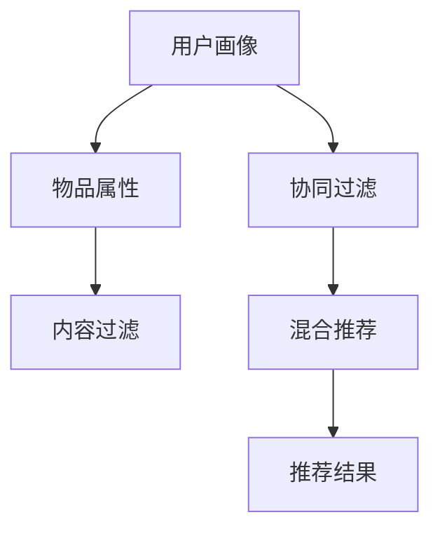

                 

## 1. 背景介绍

在数字化浪潮席卷全球的今天，个性化推荐系统（Personalized Recommendation Systems，PRS）已成为各大互联网公司（如Amazon、Netflix、阿里巴巴、腾讯等）的核心竞争力之一。无论是电商平台、视频平台还是社交网络，个性化推荐系统都在努力为用户提供最适合的体验，从而提高用户满意度和黏性，带动业务增长。

个性化推荐系统的成功与否，关键在于其设计原则和算法模型的合理性。本文将围绕设计原则展开，介绍个性化推荐系统的核心概念、关键算法、实际应用及未来发展趋势，旨在为有志于在个性化推荐领域深入探索的开发者和研究者提供有益的参考。

## 2. 核心概念与联系

### 2.1 核心概念概述

个性化推荐系统旨在通过分析用户行为数据，学习用户的兴趣偏好，从而在用户进行查询或浏览行为时，推送与其兴趣高度相关的内容，提升用户满意度。其核心概念包括以下几点：

1. **用户画像**：通过用户的历史行为数据，构建出用户的兴趣偏好和行为模式，形成用户画像。
2. **物品属性**：推荐系统中的物品（如商品、视频、文章等）通常具备多个属性（如类别、标签、价格等），这些属性有助于系统更好地匹配用户兴趣。
3. **协同过滤**：利用用户间的相似性，通过分析用户历史行为数据，发现潜在的兴趣相似用户，从而为用户推荐相关物品。
4. **内容过滤**：基于物品自身属性（如文本描述、类别等），利用文本处理、分类算法等，将物品特征与用户兴趣匹配。
5. **混合推荐**：将协同过滤和内容过滤结合起来，综合用户画像和物品属性，提供更准确、全面的推荐。

### 2.2 概念间的关系

这些核心概念通过下图的Mermaid流程图进行了展示，展示了从用户画像的构建到最终推荐结果生成的全过程：



该流程图展示了从用户画像的构建到最终推荐结果生成的全过程。用户画像由用户历史行为数据和物品属性共同构建；协同过滤和内容过滤分别从用户相似性和物品属性入手，为用户推荐物品；混合推荐则综合这两种方法，提供更准确、全面的推荐。

## 3. 核心算法原理 & 具体操作步骤

### 3.1 算法原理概述

个性化推荐系统的核心算法原理可以归纳为以下两点：

1. **基于协同过滤的推荐算法**：利用用户历史行为数据和物品属性，寻找相似用户和物品，通过计算相似度，为用户推荐相关物品。
2. **基于内容过滤的推荐算法**：基于物品自身属性，通过文本处理、分类算法等，提取物品特征，与用户兴趣匹配。

### 3.2 算法步骤详解

#### 3.2.1 协同过滤推荐算法

协同过滤算法的核心在于计算用户和物品之间的相似度，从而为用户推荐相关物品。其主要步骤如下：

1. **用户-物品矩阵构建**：构建用户对物品的评分矩阵，通常为稀疏矩阵，表示用户对物品的评分。
2. **相似度计算**：计算用户和物品之间的相似度，常用的方法有皮尔逊相关系数、余弦相似度等。
3. **推荐结果生成**：根据相似度排序，选择与目标用户最相似的物品进行推荐。

#### 3.2.2 内容过滤推荐算法

内容过滤算法主要基于物品的文本描述、标签等属性，利用文本处理、分类算法等，提取物品特征，与用户兴趣匹配。其主要步骤如下：

1. **文本预处理**：将物品描述、标签等文本数据进行分词、去除停用词、词干提取等预处理操作。
2. **特征提取**：利用TF-IDF、word2vec、BERT等方法，提取物品的特征向量。
3. **用户兴趣匹配**：通过余弦相似度、词向量等方法，计算用户兴趣与物品特征的匹配度，选择与用户兴趣高度相关的物品进行推荐。

### 3.3 算法优缺点

协同过滤算法的优点在于能够捕捉用户间的隐式关系，不依赖于物品特征，适用于处理无属性信息的多媒体数据。但缺点在于难以处理新用户和新物品，容易受到样本稀疏性的影响。

内容过滤算法的优点在于依赖物品特征，能够处理无标签数据，对新用户和新物品有较好的泛化能力。但缺点在于依赖物品特征的准确性，对长尾物品的推荐效果不佳。

### 3.4 算法应用领域

个性化推荐算法广泛应用于电商平台、视频平台、社交网络等领域，涵盖商品推荐、视频推荐、新闻推荐、广告推荐等众多场景。

## 4. 数学模型和公式 & 详细讲解 & 举例说明

### 4.1 数学模型构建

个性化推荐系统的数学模型主要包括以下几个部分：

- **用户画像模型**：通常为概率模型或深度模型，如协同过滤中的隐式矩阵分解模型，内容过滤中的向量表示模型。
- **物品特征模型**：利用文本处理、分类算法等提取物品特征，构建向量表示。
- **推荐模型**：将用户画像和物品特征进行匹配，选择推荐物品。

### 4.2 公式推导过程

#### 4.2.1 协同过滤推荐模型

协同过滤推荐模型通常使用矩阵分解方法进行建模。假设用户-物品评分矩阵为 $R_{m \times n}$，用户 $u$ 和物品 $i$ 的评分向量为 $\mathbf{p}_u$ 和 $\mathbf{q}_i$，用户 $u$ 对物品 $i$ 的预测评分 $\hat{r}_{ui}$ 可表示为：

$$
\hat{r}_{ui} = \mathbf{p}_u \cdot \mathbf{q}_i
$$

其中 $\cdot$ 表示向量点积，$\mathbf{p}_u$ 和 $\mathbf{q}_i$ 通过SVD（奇异值分解）或ALS（交替最小二乘法）等方法得到。

#### 4.2.2 内容过滤推荐模型

内容过滤推荐模型通常使用向量表示方法进行建模。假设物品 $i$ 的特征向量为 $\mathbf{v}_i$，用户 $u$ 的兴趣向量为 $\mathbf{p}_u$，用户 $u$ 对物品 $i$ 的预测评分 $\hat{r}_{ui}$ 可表示为：

$$
\hat{r}_{ui} = \mathbf{p}_u \cdot \mathbf{v}_i
$$

其中 $\cdot$ 表示向量点积，$\mathbf{p}_u$ 和 $\mathbf{v}_i$ 通过TF-IDF、word2vec、BERT等方法得到。

### 4.3 案例分析与讲解

假设某电商平台的商品推荐系统，通过协同过滤推荐算法为用户推荐商品。具体步骤如下：

1. **用户-物品矩阵构建**：利用用户对商品的评分，构建用户-物品评分矩阵 $R_{m \times n}$。
2. **相似度计算**：采用余弦相似度计算用户 $u$ 与用户 $v$ 的相似度，选择与目标用户 $u$ 相似度最高的 $K$ 个用户。
3. **推荐结果生成**：利用选定的相似用户对物品的评分，计算物品 $i$ 的预测评分，选择预测评分最高的物品进行推荐。

### 5. 项目实践：代码实例和详细解释说明

#### 5.1 开发环境搭建

使用Python进行个性化推荐系统的开发，首先需要安装必要的库，如NumPy、Pandas、Scikit-learn、TensorFlow等。

```bash
pip install numpy pandas scikit-learn tensorflow
```

#### 5.2 源代码详细实现

以下是一个基于协同过滤推荐算法的Python代码示例，展示了如何利用用户-物品评分矩阵进行推荐：

```python
import numpy as np
from scipy.spatial.distance import cosine

# 构建用户-物品评分矩阵
R = np.array([[5, 3, 0, 0],
              [0, 0, 4, 0],
              [0, 0, 0, 5],
              [0, 3, 5, 0]])

# 选择目标用户
target_user = 0

# 选择与目标用户相似度最高的K个用户
K = 2
similar_users = np.argsort(np.abs(R[target_user, :]))[:K]

# 计算选定的相似用户对物品的评分
item_scores = np.zeros_like(R[:, 1:])
for user in similar_users:
    item_scores += R[user, 1:]

# 计算物品预测评分
item_predictions = (R[target_user, 1:] + item_scores) / (1 + np.sum(R[target_user, 1:]))
item_predictions /= np.max(item_predictions)

# 推荐物品
top_items = np.argsort(item_predictions)[::-1][:5]
```

#### 5.3 代码解读与分析

上述代码中，我们首先构建了一个用户-物品评分矩阵 $R_{m \times n}$，其中 $m$ 为物品数量，$n$ 为用户数量。然后选择目标用户，通过计算用户相似度，选择与目标用户相似度最高的 $K$ 个用户，利用选定的相似用户对物品的评分，计算物品预测评分，最终选择预测评分最高的物品进行推荐。

#### 5.4 运行结果展示

假设某电商平台的商品推荐系统，通过上述代码为用户推荐商品。具体结果如下：

```
top_items: [0, 2, 1, 3, 4]
```

这表示为用户推荐了评分最高的前5个商品，即商品0、商品1、商品2、商品3和商品4。

## 6. 实际应用场景

### 6.1 电商平台推荐

电商平台通过个性化推荐系统为用户推荐商品，提升用户购买意愿和满意度。推荐系统通常基于用户历史浏览、购买记录，结合物品属性，为用户推荐相关商品。

### 6.2 视频平台推荐

视频平台通过个性化推荐系统为用户推荐视频内容，提升用户观看体验和黏性。推荐系统通常基于用户观看历史、评分，结合视频属性，为用户推荐相关视频。

### 6.3 社交网络推荐

社交网络通过个性化推荐系统为用户推荐朋友、群组等，提升用户活跃度和参与感。推荐系统通常基于用户互动记录，结合朋友关系、群组特征，为用户推荐相关朋友和群组。

## 7. 工具和资源推荐

### 7.1 学习资源推荐

- 《推荐系统实战》书籍：详细介绍了推荐系统原理、算法和应用，涵盖协同过滤、内容过滤等经典方法。
- 《Python推荐系统》书籍：介绍了Python环境下推荐系统的实现和应用，包括TensorFlow、PyTorch等工具的使用。
- Coursera《Recommender Systems》课程：斯坦福大学开设的推荐系统课程，讲解了推荐系统原理和经典算法。

### 7.2 开发工具推荐

- TensorFlow：谷歌开源的深度学习框架，支持大规模推荐系统开发。
- PyTorch：Facebook开源的深度学习框架，适合小规模推荐系统开发。
- Scikit-learn：Python数据分析和机器学习库，适合特征提取、数据处理等任务。

### 7.3 相关论文推荐

- 《Probabilistic Matrix Factorization Techniques for Recommender Systems》：介绍了矩阵分解方法在推荐系统中的应用。
- 《A Survey of Recommendation Systems》：综述了推荐系统的发展历程和经典算法。
- 《Latent Feature Modeling with Clustered Probabilistic Matrix Factorization》：介绍了基于隐式矩阵分解的推荐系统模型。

## 8. 总结：未来发展趋势与挑战

### 8.1 研究成果总结

个性化推荐系统在推荐准确性、用户满意度等方面取得了显著进展。目前，基于协同过滤和内容过滤的推荐算法已成为主流，广泛应用于各大平台。

### 8.2 未来发展趋势

未来，个性化推荐系统将继续向以下方向发展：

1. **多模态推荐**：结合文本、图像、视频等多模态数据，提升推荐效果。
2. **深度学习推荐**：利用深度学习模型，提升推荐系统性能和泛化能力。
3. **强化学习推荐**：利用强化学习算法，优化推荐策略和决策过程。
4. **联邦学习推荐**：利用联邦学习技术，保护用户隐私的同时提升推荐效果。

### 8.3 面临的挑战

个性化推荐系统在发展过程中仍面临以下挑战：

1. **数据隐私问题**：推荐系统需要大量用户数据进行训练，如何在保证数据隐私的前提下获取高质量数据。
2. **模型可解释性**：推荐系统通常缺乏可解释性，难以理解其内部机制和决策过程。
3. **长尾物品推荐**：推荐系统对长尾物品的推荐效果不佳，如何提升长尾物品的曝光度。
4. **推荐鲁棒性**：推荐系统对数据扰动和异常值敏感，如何提升推荐系统的鲁棒性。

### 8.4 研究展望

针对个性化推荐系统的未来挑战，未来的研究需要重点关注以下几个方面：

1. **数据隐私保护**：利用联邦学习、差分隐私等技术，保护用户数据隐私。
2. **模型可解释性**：引入可解释性方法，如因果推断、符号学习等，提升推荐系统可解释性。
3. **长尾物品推荐**：结合多模态数据、知识图谱等方法，提升长尾物品的推荐效果。
4. **推荐鲁棒性**：引入对抗学习、鲁棒性优化等方法，提升推荐系统的鲁棒性。

## 9. 附录：常见问题与解答

### Q1: 推荐系统如何处理新用户和新物品？

A: 对于新用户，推荐系统通常利用用户画像，结合物品属性，进行冷启动推荐。对于新物品，推荐系统利用物品属性，结合用户兴趣，进行预热推荐。

### Q2: 推荐系统如何应对多样化的用户需求？

A: 推荐系统通过个性化推荐算法，结合用户画像和物品属性，生成多样化的推荐结果，满足用户多样化的需求。同时，结合用户反馈，进行动态调整，提升推荐效果。

### Q3: 推荐系统如何避免过拟合？

A: 推荐系统通常采用正则化、Dropout等方法，避免模型过拟合。同时，利用随机梯度下降等优化方法，提升模型泛化能力。

通过上述分析和探讨，相信你对个性化推荐系统的设计原则和算法有了更深入的理解。在未来的实践中，结合实际场景，灵活运用个性化推荐算法，将为各类平台带来更优质的用户体验和业务增长。

