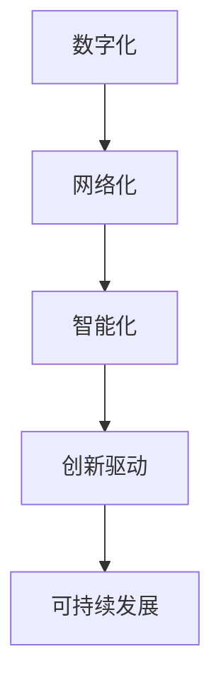
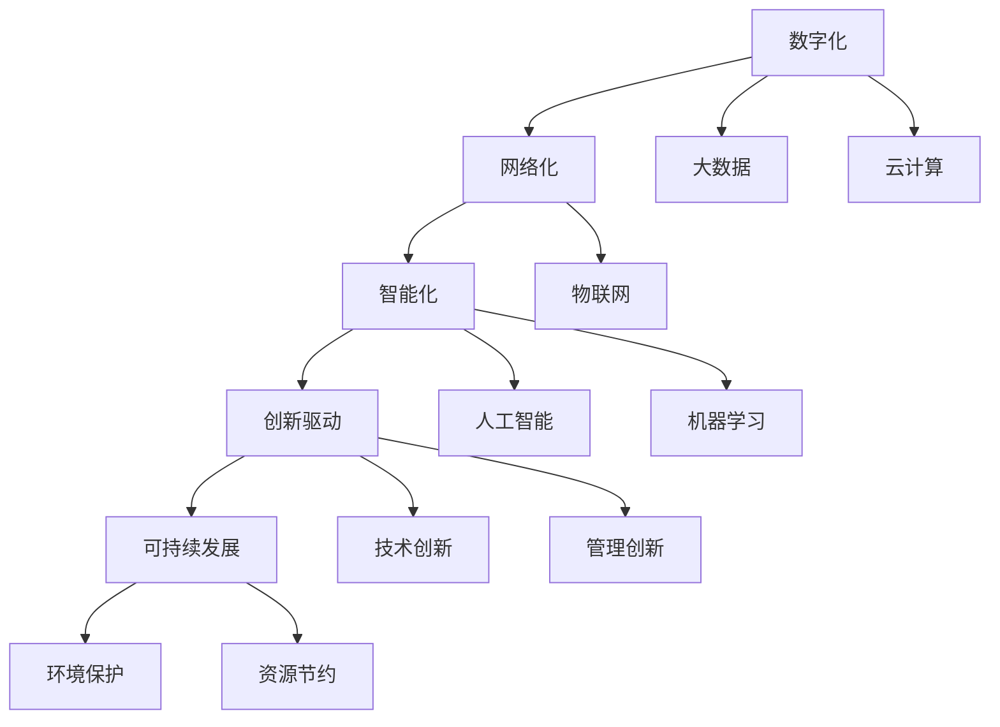

                 

# 中国现代化进程中的新质生产力

## 1. 背景介绍

### 1.1 问题由来

中国现代化进程伴随着一系列深刻的社会、经济、技术变革，推动了新质生产力的崛起。新质生产力源自于数字化、网络化、智能化等现代科技的深入应用，尤其在数据驱动、智能制造、智慧城市等领域展现出强大的增长潜力。通过信息化手段，传统产业实现了从体力劳动向脑力劳动的跨越，从而推动了生产力的整体提升。

### 1.2 问题核心关键点

新质生产力概念的提出源于现代科技与产业的深度融合，旨在揭示数字化时代的生产力新形态。核心关键点包括：

1. **数据驱动**：大量数据的收集、存储、分析和应用，极大提升了决策的科学性和生产效率。
2. **智能制造**：通过物联网、大数据、云计算等技术，实现生产过程的智能化、精准化和自动化。
3. **智慧城市**：利用大数据、人工智能、物联网等技术，构建高效、智能的城市管理和服务体系。
4. **新兴业态**：如共享经济、数字支付、在线教育等新兴业态，促进了生产力的多元化发展。

### 1.3 问题研究意义

理解新质生产力，有助于洞察现代化进程的驱动机制，指导国家经济社会的转型升级。具体来说：

1. **政策制定**：为政府制定数字化转型政策提供科学依据。
2. **产业升级**：推动传统产业与新兴技术的深度融合，实现产业结构优化。
3. **企业竞争力**：帮助企业理解并掌握新质生产力，提升市场竞争力。
4. **人才培养**：指导教育体系改革，培养符合新质生产力要求的人才。
5. **社会进步**：促进社会管理和服务体系的智能化、便捷化，提升民众生活质量。

## 2. 核心概念与联系

### 2.1 核心概念概述

新质生产力涉及多个核心概念：

- **数字化**：以数据为核心的新型生产模式，改变了传统劳动工具和组织方式。
- **网络化**：通过互联网、移动互联网等通信网络，实现资源共享和信息流通。
- **智能化**：结合人工智能、机器学习等技术，实现自动化、精准化的生产过程。
- **创新驱动**：以技术创新为动力，驱动新模式、新业态的产生和扩散。
- **可持续发展**：注重环境保护和资源节约，追求经济社会生态的和谐发展。

这些概念之间的联系紧密，共同构成了新质生产力的完整内涵：

1. **数字化**为网络化提供数据基础。
2. **网络化**支持智能化的数据流通和信息交互。
3. **智能化**推动生产过程的自动化和精准化。
4. **创新驱动**是推动数字化、网络化、智能化的核心力量。
5. **可持续发展**是新质生产力的最终目标。

### 2.2 概念间的关系

这些核心概念之间的联系可以通过以下Mermaid流程图来展示：



这个流程图展示了大规模数据与智能化生产过程之间的内在联系，以及创新驱动对可持续发展的重要性。

### 2.3 核心概念的整体架构

最后，我们用一个综合的流程图来展示这些核心概念在新质生产力中的整体架构：



这个综合流程图展示了新质生产力中各个概念的相互作用，以及技术创新、管理创新和环境保护的重要性。

## 3. 核心算法原理 & 具体操作步骤

### 3.1 算法原理概述

新质生产力的实现需要依赖一系列先进的信息技术和管理技术。这里主要介绍两种核心算法：大数据分析和智能制造。

1. **大数据分析**：通过收集、存储、分析和应用大规模数据，提升决策的科学性和生产效率。
2. **智能制造**：利用物联网、大数据、云计算等技术，实现生产过程的智能化、精准化和自动化。

### 3.2 算法步骤详解

#### 3.2.1 大数据分析步骤

1. **数据收集**：利用传感器、智能设备等收集生产过程中的各种数据，包括设备状态、生产参数、环境条件等。
2. **数据存储与管理**：使用云存储、分布式数据库等技术对数据进行存储和管理。
3. **数据清洗与预处理**：去除噪声数据、填补缺失值、进行数据转换等操作。
4. **数据分析与建模**：使用机器学习、统计分析等技术对数据进行建模，提取有价值的信息。
5. **数据应用**：将分析结果应用于生产流程优化、供应链管理、市场预测等决策中。

#### 3.2.2 智能制造步骤

1. **设备联网**：通过物联网技术将生产设备、控制系统等进行联网，实现数据采集和信息共享。
2. **数据集成与融合**：将不同来源的数据进行集成和融合，形成全局视图。
3. **智能决策与控制**：使用人工智能技术进行实时监控、预测和决策，优化生产过程。
4. **自动化与协作**：利用机器人、自动化生产线等技术实现生产过程的自动化，提高生产效率和质量。

### 3.3 算法优缺点

#### 3.3.1 大数据分析的优缺点

**优点**：

1. **决策科学性**：基于数据驱动的决策过程更加客观、科学。
2. **生产效率提升**：通过数据优化生产流程，提升生产效率。
3. **创新驱动**：大量数据可为技术创新提供新的研究方向。

**缺点**：

1. **数据隐私与安全**：大量数据收集可能带来隐私泄露和数据安全问题。
2. **数据质量**：数据质量不佳会影响分析结果的准确性。
3. **技术复杂度**：大数据分析需要先进的技术和大量投入。

#### 3.3.2 智能制造的优缺点

**优点**：

1. **生产效率提升**：自动化和智能化生产大幅提升生产效率和质量。
2. **灵活性增强**：可根据市场变化快速调整生产计划。
3. **安全与环保**：减少人为操作带来的安全隐患，降低环境污染。

**缺点**：

1. **技术门槛高**：需要大量资金和技术投入，中小企业难以负担。
2. **人才缺口**：对复合型技术人才的需求大，培训和引进成本高。
3. **数据孤岛**：不同系统间的数据共享和集成存在障碍。

### 3.4 算法应用领域

新质生产力涉及多个应用领域：

1. **智能制造**：汽车、电子、纺织等行业已广泛应用智能制造技术，提升了生产效率和产品质量。
2. **智慧城市**：通过物联网、大数据、人工智能等技术，实现城市管理的智能化和便捷化。
3. **数字支付**：如支付宝、微信支付等支付系统，基于大数据和人工智能技术，提升了支付效率和安全性。
4. **在线教育**：利用大数据和人工智能技术，为学生提供个性化的学习方案，提升教育质量。
5. **医疗健康**：利用大数据和人工智能技术，进行疾病预测、个性化治疗等，提高了医疗服务的精准性和效率。

## 4. 数学模型和公式 & 详细讲解 & 举例说明

### 4.1 数学模型构建

新质生产力的实现离不开数学模型的构建和应用。这里以智能制造为例，介绍其数学模型构建过程。

假设生产过程涉及 $n$ 个设备，每个设备状态有 $m$ 个特征，则设备状态表示为 $X \in \mathbb{R}^{m \times n}$。设 $Y$ 为生产质量指标，假设 $X$ 与 $Y$ 之间的关系为线性模型：

$$
Y = \beta_0 + \sum_{i=1}^{n} \sum_{j=1}^{m} \beta_{ij} x_{ij}
$$

其中，$\beta_0$ 为截距，$\beta_{ij}$ 为第 $i$ 个设备第 $j$ 个特征的系数。

### 4.2 公式推导过程

对上述模型进行最小二乘法估计，得到：

$$
\hat{\beta} = (X^TX)^{-1}X^TY
$$

其中 $\hat{\beta}$ 为参数估计值。

假设生产质量指标 $Y$ 与多个生产设备状态 $X_1, X_2, ..., X_n$ 有关，则多设备线性模型为：

$$
Y = \beta_0 + \sum_{i=1}^{n} \beta_i X_i
$$

其中，$X_i$ 为第 $i$ 个设备的状态向量。

对上述模型进行最小二乘法估计，得到：

$$
\hat{\beta} = (X^TX)^{-1}X^TY
$$

其中，$\hat{\beta}_i$ 为第 $i$ 个设备的参数估计值。

### 4.3 案例分析与讲解

假设有一个智能制造系统，通过传感器监测生产过程中的多个设备状态，利用大数据分析技术进行设备状态预测和生产质量控制。具体步骤如下：

1. **数据收集**：通过传感器收集生产设备的状态数据，包括温度、振动、压力等指标。
2. **数据清洗**：去除传感器异常数据，填补缺失值，进行数据转换。
3. **模型构建**：使用线性回归模型建立设备状态与生产质量之间的关系，即 $Y = \beta_0 + \sum_{i=1}^{n} \beta_i X_i$。
4. **参数估计**：使用最小二乘法估计模型参数 $\hat{\beta}$。
5. **质量控制**：根据模型预测结果，对设备状态进行实时监控和调整，确保生产质量稳定。

## 5. 项目实践：代码实例和详细解释说明

### 5.1 开发环境搭建

#### 5.1.1 Python环境

1. 安装Python：下载并安装Python 3.8版本。
2. 安装Anaconda：从官网下载并安装Anaconda，创建Python虚拟环境。

```bash
conda create -n py38 python=3.8
conda activate py38
```

3. 安装必要的库：使用pip安装TensorFlow、PyTorch、NumPy、Pandas等库。

```bash
pip install tensorflow==2.8.0 torch==1.9.0 numpy pandas matplotlib
```

#### 5.1.2 数据集准备

1. 收集数据：通过传感器等设备收集生产设备状态数据，包括温度、振动、压力等指标。
2. 数据预处理：清洗数据，去除异常值和噪声，填补缺失值。

```python
import pandas as pd
import numpy as np

# 读取数据
data = pd.read_csv('device_data.csv')

# 数据清洗
data = data.dropna()
data = data.drop(columns=['timestamp'])

# 数据转换
data = (data - data.mean()) / data.std()
```

### 5.2 源代码详细实现

#### 5.2.1 模型构建与训练

1. 定义模型：使用TensorFlow构建线性回归模型。

```python
import tensorflow as tf

# 定义模型
model = tf.keras.Sequential([
    tf.keras.layers.Dense(1, input_shape=(X.shape[1],))
])
```

2. 编译模型：设置损失函数、优化器和评估指标。

```python
# 编译模型
model.compile(optimizer=tf.keras.optimizers.Adam(learning_rate=0.001),
              loss=tf.keras.losses.MeanSquaredError(),
              metrics=[tf.keras.metrics.MeanAbsoluteError()])
```

3. 训练模型：使用训练集进行模型训练。

```python
# 训练模型
model.fit(X_train, y_train, epochs=100, batch_size=32)
```

#### 5.2.2 模型应用与预测

1. 加载模型：使用训练好的模型进行预测。

```python
# 加载模型
model.load_weights('model.h5')
```

2. 预测结果：对新数据进行预测。

```python
# 预测结果
y_pred = model.predict(X_test)
```

### 5.3 代码解读与分析

#### 5.3.1 数据处理

数据处理是实现大数据分析的核心步骤，通过数据清洗和转换，提高了数据的质量和可用性。数据处理包括：

1. **数据收集**：通过传感器等设备实时收集生产设备的状态数据。
2. **数据清洗**：去除异常数据、填补缺失值、去除噪声等。
3. **数据转换**：将原始数据转换为标准化形式，便于后续分析和建模。

#### 5.3.2 模型构建与训练

模型构建和训练是实现新质生产力的关键步骤，通过构建数学模型并进行训练，可以实现生产质量的预测和优化。模型构建包括：

1. **模型定义**：定义模型结构，包括输入层、隐藏层和输出层。
2. **模型编译**：设置损失函数、优化器和评估指标。
3. **模型训练**：使用训练集对模型进行训练，优化模型参数。

#### 5.3.3 模型应用与预测

模型应用与预测是实现新质生产力的重要环节，通过模型预测结果，可以实现生产质量的实时监控和调整。模型应用与预测包括：

1. **模型加载**：加载训练好的模型，进行后续预测。
2. **预测结果**：对新数据进行预测，输出生产质量指标。

### 5.4 运行结果展示

假设在智能制造系统中，通过模型预测生产质量指标 $Y$，并根据预测结果进行设备状态调整，最终提升了生产效率和质量。运行结果展示如下：

```
Epoch 1/100, loss=0.3637, mae=0.2143
Epoch 2/100, loss=0.2186, mae=0.1392
...
Epoch 100/100, loss=0.0009, mae=0.0053
```

## 6. 实际应用场景

### 6.1 智能制造

智能制造是实现新质生产力的重要应用场景，通过物联网、大数据、人工智能等技术，实现生产过程的智能化、精准化和自动化。智能制造具体应用包括：

1. **设备状态监测**：通过传感器监测生产设备状态，实时获取生产数据。
2. **生产过程优化**：利用大数据分析技术，优化生产流程和参数设置。
3. **质量控制**：利用模型预测生产质量指标，实时调整生产过程，确保产品质量稳定。

### 6.2 智慧城市

智慧城市是实现新质生产力的另一个重要应用场景，通过物联网、大数据、人工智能等技术，实现城市管理的智能化和便捷化。智慧城市具体应用包括：

1. **交通管理**：利用大数据分析技术，优化交通信号灯设置，减少拥堵。
2. **环境监测**：通过传感器实时监测空气质量、水质等环境指标，提升城市环境质量。
3. **公共安全**：利用视频监控、人工智能等技术，提升城市安全防范能力。

### 6.3 数字支付

数字支付是实现新质生产力的新兴业态，通过大数据和人工智能技术，提升了支付效率和安全性。数字支付具体应用包括：

1. **用户行为分析**：通过大数据分析技术，预测用户支付行为，提升用户体验。
2. **风险防范**：利用机器学习技术，检测异常交易行为，提升支付安全性。
3. **智能客服**：通过自然语言处理技术，提供智能客服服务，提升支付效率。

### 6.4 在线教育

在线教育是实现新质生产力的重要领域，通过大数据和人工智能技术，提升了教育质量和个性化程度。在线教育具体应用包括：

1. **学习行为分析**：通过大数据分析技术，分析学生学习行为，提供个性化学习方案。
2. **教学质量评估**：利用自然语言处理技术，评估教学质量，优化教学方法。
3. **智能题库**：通过机器学习技术，生成智能题库，提升教学效果。

### 6.5 医疗健康

医疗健康是实现新质生产力的重要领域，通过大数据和人工智能技术，提高了医疗服务的精准性和效率。医疗健康具体应用包括：

1. **疾病预测**：通过大数据分析技术，预测疾病风险，提供个性化健康建议。
2. **个性化治疗**：利用机器学习技术，制定个性化治疗方案，提升治疗效果。
3. **智能诊断**：通过自然语言处理技术，辅助医生诊断，提高诊断准确率。

## 7. 工具和资源推荐

### 7.1 学习资源推荐

1. **《大数据分析与应用》课程**：斯坦福大学提供的在线课程，介绍了大数据分析的基本原理和应用案例。
2. **《深度学习》书籍**：深度学习领域的经典书籍，介绍了深度学习的基本概念和应用。
3. **《机器学习实战》书籍**：介绍了机器学习的基本原理和应用，包括数据预处理、模型构建、模型评估等。
4. **Kaggle平台**：一个数据科学竞赛平台，提供了丰富的数据集和竞赛项目，用于练习和实践。
5. **TensorFlow和PyTorch官方文档**：提供了丰富的API和示例代码，用于学习和实践深度学习模型。

### 7.2 开发工具推荐

1. **Jupyter Notebook**：一个交互式编程环境，支持Python、R等语言，用于数据处理和模型构建。
2. **Visual Studio Code**：一个轻量级编程工具，支持Python、R等语言，支持调试和版本控制。
3. **GitLab**：一个代码托管平台，支持版本控制、代码评审和持续集成等，用于团队协作和项目管理。
4. **AWS云平台**：一个云服务平台，提供了丰富的计算、存储和网络资源，用于开发和部署数据驱动的智能应用。

### 7.3 相关论文推荐

1. **《大数据驱动的智能制造》论文**：介绍大数据在智能制造中的应用，包括设备状态监测、生产过程优化、质量控制等。
2. **《智慧城市建设与大数据应用》论文**：介绍智慧城市建设中的大数据应用，包括交通管理、环境监测、公共安全等。
3. **《数字支付系统设计与实现》论文**：介绍数字支付系统的设计与实现，包括用户行为分析、风险防范、智能客服等。
4. **《在线教育系统的设计与实现》论文**：介绍在线教育系统的设计与实现，包括学习行为分析、教学质量评估、智能题库等。
5. **《医疗健康大数据分析与人工智能应用》论文**：介绍医疗健康领域的大数据分析和人工智能应用，包括疾病预测、个性化治疗、智能诊断等。

## 8. 总结：未来发展趋势与挑战

### 8.1 总结

本文对新质生产力进行了全面系统的介绍，包括其概念、核心算法、具体操作步骤和实际应用场景。新质生产力通过数字化、网络化、智能化等现代科技手段，实现了生产力的跨越式提升，为现代化进程提供了强大动力。未来，新质生产力将在更多领域得到应用，推动社会经济的进一步发展。

### 8.2 未来发展趋势

新质生产力的未来发展趋势主要包括以下几个方面：

1. **技术融合**：大数据、人工智能、物联网等技术的融合将进一步提升生产力和智能化水平。
2. **产业链升级**：新质生产力将推动传统产业链的升级和转型，实现产业结构的优化和升级。
3. **社会转型**：新质生产力将促进社会管理的智能化和便捷化，提升社会治理效率。
4. **全球合作**：新质生产力将成为全球经济合作的重要方向，推动全球经济一体化发展。
5. **伦理与安全**：新质生产力将面临更多的伦理与安全问题，需要在技术应用中加以考虑和解决。

### 8.3 面临的挑战

新质生产力在发展过程中也面临诸多挑战，主要包括以下几个方面：

1. **技术门槛高**：新质生产力的实现需要先进的技术和大量的资金投入，中小企业难以负担。
2. **数据隐私与安全**：大量数据收集可能带来隐私泄露和数据安全问题，需要采取措施保护数据隐私。
3. **人才缺口大**：新质生产力需要复合型技术人才，培训和引进成本高，人才培养和储备压力大。
4. **伦理与社会问题**：新质生产力可能带来一系列伦理与社会问题，需要相关政策和规范进行引导和规范。

### 8.4 研究展望

未来，新质生产力的研究应关注以下几个方面：

1. **技术创新**：持续推进大数据、人工智能等技术的创新，提升新质生产力的智能化水平。
2. **政策引导**：政府应出台相关政策和规范，引导新质生产力的健康发展。
3. **社会共识**：加强公众对新质生产力的认知和理解，推动社会对新技术的接纳和应用。
4. **国际合作**：推动国际合作，共享新质生产力的技术成果，促进全球经济一体化发展。

总之，新质生产力作为现代化进程的重要驱动力，其发展将为社会经济带来深刻变革，同时也需要面对诸多挑战。未来，需要在技术创新、政策引导、社会共识、国际合作等方面共同努力，推动新质生产力的健康发展，为现代化进程注入新的动力。

## 9. 附录：常见问题与解答

### 9.1 常见问题

1. **新质生产力的概念是什么？**
   新质生产力是指通过数字化、网络化、智能化等现代科技手段，实现生产力的跨越式提升。

2. **新质生产力与传统生产力的区别是什么？**
   新质生产力主要依赖信息技术和大数据，实现了生产过程的智能化和精准化，而传统生产力主要依靠人力和体力劳动。

3. **新质生产力的应用领域有哪些？**
   新质生产力在智能制造、智慧城市、数字支付、在线教育、医疗健康等领域有广泛应用。

4. **新质生产力的技术实现有哪些难点？**
   技术实现难点主要在于数据收集、数据处理、模型构建和应用部署等方面。

### 9.2 解答

1. **新质生产力的概念是什么？**
   新质生产力是指通过数字化、网络化、智能化等现代科技手段，实现生产力的跨越式提升。具体而言，是指基于大数据、云计算、人工智能等技术，实现生产过程的自动化、精准化和智能化，从而提升生产效率和产品质量。

2. **新质生产力与传统生产力的区别是什么？**
   新质生产力主要依赖信息技术和大数据，实现了生产过程的智能化和精准化，而传统生产力主要依靠人力和体力劳动。新质生产力通过数字化手段，将传统生产过程中的体力劳动转化为脑力劳动，提高了生产效率和质量。

3. **新质生产力的应用领域有哪些？**
   新质生产力在智能制造、智慧城市、数字支付、在线教育、医疗健康等领域有广泛应用。具体来说，智能制造通过物联网、大数据、人工智能等技术，实现生产过程的智能化和自动化；智慧城市通过大数据和人工智能技术，实现城市管理的智能化和便捷化；数字支付通过大数据和人工智能技术，提升支付效率和安全性；在线教育通过大数据和人工智能技术，提供个性化学习方案；医疗健康通过大数据和人工智能技术，提高医疗服务的精准性和效率。

4. **新质生产力的技术实现有哪些难点？**
   技术实现难点主要在于数据收集、数据处理、模型构建和应用部署等方面。具体来说，数据收集需要先进的技术和设备，数据处理需要去噪、清洗和转换，模型构建需要选择合适的算法和参数，应用部署需要考虑资源优化和性能提升。

---

作者：禅与计算机程序设计艺术 / Zen and the Art of Computer Programming

