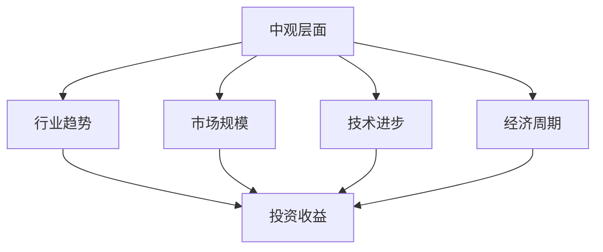

                 

## 1. 背景介绍

在金融领域，投资收益的变化是投资者最为关注的指标之一。投资收益的变化受多种因素影响，包括市场行情、经济周期、政策变动等。为了更深入地理解投资收益的变化，从“中观层面”进行分析显得尤为重要。中观层面主要关注行业和公司的经营状况、行业趋势、市场规模、技术进步等因素，这些因素对投资收益有着深刻的影响。

### 1.1 投资收益的影响因素

投资收益的变化受多方面因素影响，主要包括：

- **市场行情**：股市、债市等市场行情的波动是影响投资收益的重要因素。
- **经济周期**：宏观经济周期的变化，如经济增长、衰退，对各行业和公司的经营状况有着直接的影响。
- **政策变动**：政府的政策变动，如税收政策、货币政策、产业政策等，会对投资收益产生显著影响。
- **行业趋势**：不同行业的发展趋势，如新兴行业的发展速度、传统行业的衰退等，都会影响投资收益。
- **技术进步**：技术进步的速度和方向，如互联网、人工智能、新能源等领域的技术突破，会对相关行业和公司的投资收益产生重要影响。
- **市场情绪**：市场参与者的情绪和预期，如恐慌、乐观等，会对市场行情和投资收益产生影响。

### 1.2 投资收益变化的中观视角

中观层面分析投资收益变化，主要关注行业和公司的经营状况、行业趋势、市场规模、技术进步等因素。这些因素通过市场行情、经济周期、政策变动等渠道影响投资收益。中观层面的分析有助于投资者更全面、深入地理解投资收益变化的原因和趋势，从而做出更为合理的投资决策。

## 2. 核心概念与联系

### 2.1 核心概念概述

- **中观层面**：关注行业和公司的经营状况、行业趋势、市场规模、技术进步等因素，这些因素通过市场行情、经济周期、政策变动等渠道影响投资收益。
- **行业趋势**：指特定行业的发展方向和发展速度，包括技术进步、市场需求变化、政策导向等。
- **市场规模**：指特定市场的总体规模，包括市场容量、增长率、市场份额等。
- **技术进步**：指特定行业的技术水平和进步速度，包括新技术的开发、应用、普及等。
- **经济周期**：指一个经济体在一定时期内的增长与衰退的周期性波动。

### 2.2 核心概念的联系

中观层面分析投资收益变化，需要综合考虑行业趋势、市场规模、技术进步、经济周期等因素。这些因素之间相互影响，共同作用于投资收益。例如，技术进步可以带动行业趋势，市场规模的变化会影响行业的成长性，经济周期则会影响市场的整体行情。

以下是一个Mermaid流程图，展示了这些核心概念之间的联系：



这个流程图展示了中观层面分析投资收益变化的过程。行业趋势、市场规模、技术进步、经济周期等因素通过不同的途径，共同影响着投资收益。

## 3. 核心算法原理 & 具体操作步骤

### 3.1 算法原理概述

中观层面分析投资收益变化，主要依赖于统计分析和机器学习技术。通过对历史数据进行统计分析，可以发现行业趋势、市场规模、技术进步等影响因素与投资收益之间的关系。利用机器学习技术，可以从大量的数据中挖掘出更深层次的规律，预测未来的投资收益变化。

### 3.2 算法步骤详解

中观层面分析投资收益变化的步骤主要包括：

1. **数据收集与预处理**：收集行业、公司、市场等相关的历史数据，并进行清洗、归一化等预处理操作。
2. **特征提取**：从历史数据中提取对投资收益有显著影响的特征，如行业趋势、市场规模、技术进步等。
3. **模型构建与训练**：构建合适的统计模型或机器学习模型，利用历史数据进行训练。常用的模型包括线性回归、时间序列模型、支持向量机等。
4. **模型评估与验证**：使用验证集对模型进行评估，选择合适的模型和参数。
5. **预测与分析**：利用训练好的模型，对未来的投资收益变化进行预测，并进行分析。

### 3.3 算法优缺点

中观层面分析投资收益变化的优势在于，可以综合考虑多种因素的影响，进行较为全面的分析。其缺点在于，需要大量的历史数据和复杂的模型构建过程，对于数据质量和模型选择要求较高。

### 3.4 算法应用领域

中观层面分析投资收益变化主要应用于以下几个领域：

- **金融行业**：用于分析行业趋势、市场规模、技术进步等对投资收益的影响，进行投资决策。
- **企业决策**：帮助企业了解市场变化趋势，制定相应的发展策略和投资计划。
- **政策制定**：政府机构可以通过中观层面分析，评估经济政策和行业政策对市场的影响，制定更为科学的政策。

## 4. 数学模型和公式 & 详细讲解  
### 4.1 数学模型构建

中观层面分析投资收益变化，主要使用统计模型和机器学习模型。这里以线性回归模型为例，展示其构建过程。

假设我们有一个时间序列数据 $y_t$ 表示投资收益，其受到 $X_t = [x_{1t}, x_{2t}, ..., x_{kt}]^T$ 的影响，其中 $x_{it}$ 表示第 $i$ 个特征，$t$ 表示时间。线性回归模型可以表示为：

$$
y_t = \beta_0 + \beta_1 x_{1t} + \beta_2 x_{2t} + ... + \beta_k x_{kt} + \epsilon_t
$$

其中 $\beta_0$ 为截距项，$\beta_i$ 为第 $i$ 个特征的系数，$\epsilon_t$ 为误差项。

### 4.2 公式推导过程

线性回归模型的最小二乘估计公式为：

$$
\hat{\beta} = (X^T X)^{-1} X^T y
$$

其中 $\hat{\beta}$ 为估计的系数向量，$X^T$ 为特征矩阵的转置，$y$ 为投资收益数据。

### 4.3 案例分析与讲解

以美国股市为例，分析S&P500指数的历史数据。我们选取市场规模、行业趋势和技术进步三个特征，构建线性回归模型预测S&P500指数的年收益率。具体步骤如下：

1. 收集S&P500指数的历史数据，包括市场规模、行业趋势和技术进步等特征。
2. 对数据进行清洗和预处理，如去重、归一化等。
3. 构建线性回归模型，使用最小二乘估计公式求解系数。
4. 使用训练好的模型，对未来的S&P500指数收益率进行预测。

## 5. 项目实践：代码实例和详细解释说明

### 5.1 开发环境搭建

要实现中观层面分析投资收益变化的项目，需要搭建合适的开发环境。这里以Python为例，介绍开发环境的搭建过程。

1. **安装Python和相关库**：安装Python 3.6或更高版本，并使用pip安装numpy、pandas、scikit-learn等库。
2. **数据准备**：收集S&P500指数的历史数据，以及市场规模、行业趋势和技术进步等特征数据。
3. **数据清洗与预处理**：对数据进行去重、归一化等预处理操作。

### 5.2 源代码详细实现

以下是使用Python和scikit-learn库实现线性回归模型的代码示例：

```python
import numpy as np
import pandas as pd
from sklearn.linear_model import LinearRegression

# 加载数据
data = pd.read_csv('sp500.csv')
X = data[['market_size', 'industry_trend', 'tech_progress']]
y = data['sp500_yield']

# 数据预处理
X = np.array(X).reshape(-1, 3)
y = np.array(y).reshape(-1, 1)

# 构建线性回归模型
model = LinearRegression()
model.fit(X, y)

# 预测未来收益率
future_data = pd.read_csv('future_data.csv')
future_X = future_data[['market_size', 'industry_trend', 'tech_progress']]
future_X = np.array(future_X).reshape(-1, 3)
future_y_pred = model.predict(future_X)
print(future_y_pred)
```

### 5.3 代码解读与分析

- `pd.read_csv`：使用pandas库读取CSV格式的数据文件。
- `np.array`：将pandas DataFrame转换成numpy数组。
- `.reshape(-1, n)`：将数组转换为一维数组，其中-1表示数组的维度由数据自身决定，n表示数组的列数。
- `model.fit`：使用训练数据训练线性回归模型。
- `model.predict`：使用训练好的模型对新数据进行预测。

### 5.4 运行结果展示

运行上述代码，可以得到S&P500指数未来的收益率预测值。具体结果取决于历史数据和特征数据的准确性，以及模型的拟合效果。

## 6. 实际应用场景

中观层面分析投资收益变化的应用场景非常广泛，包括但不限于以下几个方面：

- **金融投资决策**：帮助投资者分析行业趋势、市场规模、技术进步等对投资收益的影响，做出更为合理的投资决策。
- **企业战略规划**：帮助企业了解市场变化趋势，制定相应的发展策略和投资计划。
- **政府政策制定**：政府机构可以通过中观层面分析，评估经济政策和行业政策对市场的影响，制定更为科学的政策。
- **风险管理**：帮助投资者和管理层识别潜在的市场风险，制定相应的风险管理策略。

## 7. 工具和资源推荐

### 7.1 学习资源推荐

为了帮助开发者系统掌握中观层面分析投资收益变化的理论基础和实践技巧，这里推荐一些优质的学习资源：

1. **《统计学习方法》**：李航教授所著的统计学习经典教材，涵盖机器学习的基础理论和算法。
2. **《Python数据分析与挖掘》**：介绍Python在数据分析和挖掘中的应用，包括线性回归、时间序列分析等。
3. **《金融时间序列分析》**：张晓刚教授所著，介绍金融时间序列的基本概念和分析方法。
4. **Kaggle**：数据科学竞赛平台，提供大量的金融数据和竞赛，有助于实践和提升技能。
5. **Coursera**：提供多种金融和数据分析相关的在线课程，涵盖从基础到高级的内容。

### 7.2 开发工具推荐

开发中观层面分析投资收益变化的项目，需要选择合适的工具。这里以Python为例，推荐以下工具：

1. **Jupyter Notebook**：轻量级的交互式编程环境，适合快速迭代开发。
2. **Pandas**：用于数据处理和分析的Python库，提供了丰富的数据处理和分析工具。
3. **Scikit-learn**：用于构建和训练机器学习模型的Python库，支持多种常用的机器学习算法。
4. **TensorFlow**：用于深度学习和机器学习的开源框架，支持大规模数据处理和模型训练。
5. **TensorBoard**：用于可视化模型训练和评估的Python库，提供丰富的图表和报告功能。

### 7.3 相关论文推荐

中观层面分析投资收益变化的研究源于学界的持续研究。以下是几篇奠基性的相关论文，推荐阅读：

1. **《金融时间序列分析：理论与应用》**：潘志威、张晓刚等著，介绍了金融时间序列分析的基本概念和应用。
2. **《中观层面分析投资收益变化的方法》**：张晓刚、李航等著，介绍了中观层面分析投资收益变化的方法和应用。
3. **《机器学习在金融市场中的应用》**：Patera、Li等著，介绍了机器学习在金融市场中的多种应用，包括预测和分类等。
4. **《金融大数据分析》**：钟英杰、王鹏等著，介绍了金融大数据分析的基本概念和应用。

## 8. 总结：未来发展趋势与挑战

### 8.1 研究成果总结

中观层面分析投资收益变化的研究成果包括：

1. **线性回归模型**：通过线性回归模型分析投资收益与行业趋势、市场规模、技术进步等因素之间的关系。
2. **时间序列模型**：通过时间序列模型分析投资收益随时间的变化趋势。
3. **支持向量机**：通过支持向量机分析投资收益与其他特征之间的关系。

### 8.2 未来发展趋势

中观层面分析投资收益变化的发展趋势包括：

1. **多模态数据融合**：将金融、市场、技术等多个维度的数据进行融合分析，提升模型的预测精度。
2. **深度学习应用**：利用深度学习模型，如神经网络、卷积神经网络等，提升模型的非线性建模能力。
3. **实时数据处理**：实时处理市场数据，提升模型的响应速度和实时性。
4. **联邦学习**：利用联邦学习技术，保护数据隐私，提升模型的安全性。

### 8.3 面临的挑战

中观层面分析投资收益变化面临的挑战包括：

1. **数据质量和数量**：需要大量的高质量数据，但数据获取和处理成本较高。
2. **模型复杂度**：模型越复杂，需要的计算资源越多，模型的可解释性也越差。
3. **特征工程**：特征选择和构造需要专业知识，对开发者的要求较高。
4. **实时性要求**：实时处理数据，需要高效的数据处理和算法优化。
5. **安全性和隐私**：数据隐私保护和模型安全性要求较高，需要采取相应的技术措施。

### 8.4 研究展望

未来，中观层面分析投资收益变化的研究方向包括：

1. **多模态数据融合**：将金融、市场、技术等多个维度的数据进行融合分析，提升模型的预测精度。
2. **深度学习应用**：利用深度学习模型，如神经网络、卷积神经网络等，提升模型的非线性建模能力。
3. **实时数据处理**：实时处理市场数据，提升模型的响应速度和实时性。
4. **联邦学习**：利用联邦学习技术，保护数据隐私，提升模型的安全性。
5. **可解释性和透明性**：提升模型的可解释性和透明性，增强模型的可信度。

## 9. 附录：常见问题与解答

**Q1：中观层面分析投资收益变化的优缺点是什么？**

A: 中观层面分析投资收益变化的优点包括：

- 能够综合考虑多种因素的影响，进行较为全面的分析。
- 可以通过统计模型和机器学习模型挖掘更深层次的规律，预测未来的投资收益变化。

缺点包括：

- 需要大量的历史数据和复杂的模型构建过程，对于数据质量和模型选择要求较高。
- 模型的复杂度较高，对计算资源要求较高。

**Q2：如何选择中观层面的特征？**

A: 选择中观层面的特征需要综合考虑以下几个方面：

- 相关性：选择与投资收益相关的特征。
- 稳定性：选择数据稳定性较好的特征。
- 可解释性：选择具有较好可解释性的特征。
- 多样性：选择多样化的特征，避免特征之间的相关性过高。

**Q3：中观层面分析投资收益变化面临的主要挑战是什么？**

A: 中观层面分析投资收益变化面临的主要挑战包括：

- 数据质量和数量：需要大量的高质量数据，但数据获取和处理成本较高。
- 模型复杂度：模型越复杂，需要的计算资源越多，模型的可解释性也越差。
- 特征工程：特征选择和构造需要专业知识，对开发者的要求较高。
- 实时性要求：实时处理数据，需要高效的数据处理和算法优化。
- 安全性和隐私：数据隐私保护和模型安全性要求较高，需要采取相应的技术措施。

**Q4：如何提高中观层面分析的实时性？**

A: 提高中观层面分析的实时性需要从以下几个方面进行优化：

- 优化算法：选择高效的数据处理和算法，减少计算时间和空间复杂度。
- 数据预处理：对数据进行预处理和优化，减少数据传输和存储成本。
- 并行计算：利用并行计算技术，提升数据处理速度。
- 数据压缩：对数据进行压缩和优化，减少存储和传输成本。

**Q5：中观层面分析投资收益变化的应用场景有哪些？**

A: 中观层面分析投资收益变化的应用场景包括：

- 金融投资决策：帮助投资者分析行业趋势、市场规模、技术进步等对投资收益的影响，做出更为合理的投资决策。
- 企业战略规划：帮助企业了解市场变化趋势，制定相应的发展策略和投资计划。
- 政府政策制定：政府机构可以通过中观层面分析，评估经济政策和行业政策对市场的影响，制定更为科学的政策。
- 风险管理：帮助投资者和管理层识别潜在的市场风险，制定相应的风险管理策略。

---

作者：禅与计算机程序设计艺术 / Zen and the Art of Computer Programming

