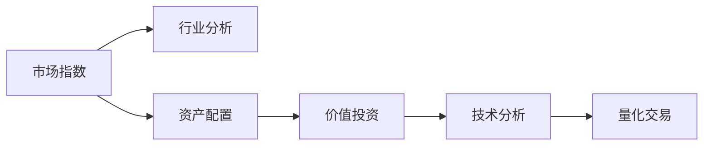
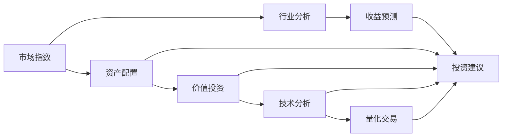

                 

# 中观层面的投资收益变化趋势

> 关键词：中观层面, 投资收益, 投资策略, 金融市场, 风险管理, 资产配置, 价值投资, 技术分析, 量化交易

## 1. 背景介绍

### 1.1 问题由来
投资收益变化趋势分析是金融投资中的核心问题。在实际操作中，投资者希望能够更好地理解并预测市场走势，以制定合理的投资策略，最大化投资回报。然而，市场常常是复杂多变的，影响因素繁多，包括宏观经济指标、行业周期、公司基本面、市场情绪等。同时，不同投资者的风险承受能力和投资风格也千差万别。因此，投资者需要构建一个中观层面的投资模型，以综合考虑多方面因素，预测收益变化趋势，并据此做出科学合理的投资决策。

### 1.2 问题核心关键点
中观层面的投资收益变化趋势分析，主要包括：

- 市场指数走势的预测：基于历史数据和当前信息，预测市场总体趋势。
- 行业或板块的收益预测：分析特定行业或板块的走势，评估其投资价值。
- 资产配置策略：根据不同资产类别（如股票、债券、黄金等）的收益与风险特征，制定优化配置策略。
- 价值投资：寻找低估的优质股票，长期持有以获得超额收益。
- 技术分析：利用市场价格图表和指标，进行短期或中期的趋势预测。
- 量化交易：基于统计模型和机器学习算法，自动化执行交易策略。

### 1.3 问题研究意义
研究中观层面的投资收益变化趋势，对于提升投资决策的科学性和准确性，具有重要意义：

1. **提高投资回报**：通过综合分析多种影响因素，制定更加合理的投资策略，提高投资组合的回报率。
2. **控制风险**：识别潜在的市场风险和行业风险，及时调整投资组合，规避投资损失。
3. **优化资产配置**：根据不同资产的风险收益特征，科学配置资产，实现长期稳健增长。
4. **增强市场适应性**：构建能够适应市场变化的中观模型，提高投资策略的灵活性和鲁棒性。
5. **提升决策效率**：利用技术分析和量化交易，自动化处理大量数据，提高投资决策效率。

## 2. 核心概念与联系

### 2.1 核心概念概述

为更好地理解中观层面的投资收益变化趋势分析，本节将介绍几个密切相关的核心概念：

- 市场指数：反映整个市场或特定板块的走势，如上证指数、标普500等。
- 行业分析：评估特定行业的发展趋势、盈利能力、市场份额等，如金融、科技、医药等。
- 资产配置：根据投资者的风险偏好和目标回报，分配不同资产类别的权重，构建投资组合。
- 价值投资：通过分析公司基本面，寻找被市场低估的股票，长期持有。
- 技术分析：利用价格图表和指标，预测市场趋势，执行交易策略。
- 量化交易：基于数学模型和算法，自动执行交易，实现高频交易。

这些核心概念之间的逻辑关系可以通过以下Mermaid流程图来展示：



这个流程图展示了中观层面投资收益变化趋势分析的主要流程：

1. 分析市场指数走势，判断整体市场趋势。
2. 分析行业走势，选择具有投资价值的板块。
3. 进行资产配置，分散投资风险。
4. 采用价值投资策略，寻找低估的优质股票。
5. 利用技术分析进行短期或中期预测。
6. 量化交易，自动化执行交易策略，提高效率。

### 2.2 概念间的关系

这些核心概念之间存在着紧密的联系，形成了中观层面投资收益变化趋势分析的完整框架。下面我通过几个Mermaid流程图来展示这些概念之间的关系。

#### 2.2.1 市场指数与行业分析的关系


这个流程图展示了市场指数对行业分析的影响：

1. 市场指数走势直接影响行业板块的收益预期。
2. 行业分析提供对特定行业的深入理解，帮助判断行业收益变化趋势。
3. 结合市场指数和行业分析，可以做出更准确的投资建议。

#### 2.2.2 价值投资与技术分析的关系


这个流程图展示了价值投资和技术分析的结合方式：

1. 价值投资通过公司基本面分析，寻找低估的股票。
2. 技术分析利用价格图表和指标，辅助判断股票的短期走势。
3. 结合基本面和技术分析，制定交易策略。
4. 基于交易策略，做出投资决策。

#### 2.2.3 量化交易与资产配置的关系


这个流程图展示了量化交易在资产配置中的应用：

1. 量化交易基于统计模型和算法，制定交易策略。
2. 算法优化提升交易策略的效率和准确性。
3. 交易执行根据策略执行交易。
4. 资产配置根据不同资产的风险收益特征，优化配置权重。
5. 投资组合优化，实现最优风险收益比。

### 2.3 核心概念的整体架构

最后，我们用一个综合的流程图来展示这些核心概念在中观层面投资收益变化趋势分析的整体架构：



这个综合流程图展示了从市场指数分析到具体投资决策的完整过程：

1. 市场指数分析，判断整体市场趋势。
2. 行业分析，选择具有投资价值的板块。
3. 资产配置，分散投资风险。
4. 结合市场指数和行业分析，进行收益预测和投资建议。
5. 价值投资，寻找低估的优质股票。
6. 技术分析，进行短期或中期预测。
7. 量化交易，自动化执行交易策略。

通过这些流程图，我们可以更清晰地理解中观层面投资收益变化趋势分析过程中各个核心概念的关系和作用，为后续深入讨论具体的分析方法和技术奠定基础。

## 3. 核心算法原理 & 具体操作步骤
### 3.1 算法原理概述

中观层面的投资收益变化趋势分析，主要基于统计分析、技术分析、量化分析等方法。这些方法的共同原理是：

- **历史数据挖掘**：通过历史数据挖掘，寻找市场、行业和公司间的关联规律，构建统计模型。
- **特征提取与选择**：从众多影响因素中提取关键特征，并进行特征选择，去除无关特征。
- **建模与预测**：利用回归、分类、时间序列等模型，预测市场、行业和股票的未来走势。
- **风险评估与控制**：评估不同策略的风险水平，采用风险控制技术，降低投资风险。
- **多模型融合**：结合多个模型的预测结果，综合评估投资价值。

### 3.2 算法步骤详解

中观层面的投资收益变化趋势分析，一般包括以下几个关键步骤：

**Step 1: 数据准备与预处理**
- 收集历史市场指数、行业数据、公司财报、宏观经济指标等数据。
- 清洗数据，处理缺失值、异常值等。
- 标准化或归一化数据，便于后续建模。

**Step 2: 特征提取与选择**
- 选择与投资收益变化相关的关键特征，如市场指数变化、行业盈利能力、公司估值指标等。
- 进行特征选择，保留最有信息量的特征。
- 使用PCA、LDA等降维技术，简化特征空间。

**Step 3: 模型构建与训练**
- 选择适当的统计模型或机器学习模型，如线性回归、决策树、随机森林、神经网络等。
- 构建数据集，准备训练、验证和测试数据。
- 采用网格搜索、交叉验证等方法，优化模型参数。

**Step 4: 预测与评估**
- 在验证集上评估模型预测性能，如均方误差、R方、准确率等指标。
- 在测试集上进行预测，生成投资收益变化趋势报告。
- 根据实际投资情况，调整模型和策略。

**Step 5: 风险评估与控制**
- 评估模型预测风险，包括偏差、方差等。
- 结合VaR、ES等风险管理技术，设置风险控制阈值。
- 动态调整投资组合，控制风险水平。

**Step 6: 模型优化与迭代**
- 定期收集新数据，更新模型。
- 结合最新市场信息，优化预测模型。
- 跟踪最新研究成果，引入新方法或模型。

### 3.3 算法优缺点

中观层面投资收益变化趋势分析的优势在于：

- **全面性**：综合考虑多方面因素，提供较为全面的市场预测。
- **自动化**：利用模型和算法，自动化处理数据和预测，提高效率。
- **灵活性**：可以根据市场变化，动态调整模型和策略。

其缺点包括：

- **数据依赖**：依赖高质量的数据，数据质量直接影响预测准确性。
- **模型复杂**：多模型融合、特征选择等技术复杂，需要较高专业水平。
- **风险控制**：复杂模型可能增加风险，需要谨慎应用。
- **成本高**：需要大量的计算资源和时间，成本较高。

### 3.4 算法应用领域

中观层面的投资收益变化趋势分析，在金融投资领域有广泛应用，主要包括以下几个方面：

- **资产配置**：通过分析不同资产类别的历史收益和风险特征，优化配置策略。
- **风险管理**：评估投资组合的风险水平，制定风险控制策略。
- **量化交易**：基于统计模型和算法，自动化执行交易策略。
- **市场预测**：分析市场指数走势，预测整体市场趋势。
- **行业分析**：评估特定行业的盈利能力和投资价值。
- **价值投资**：利用基本面分析，寻找低估的优质股票。

除了金融投资，中观层面投资收益变化趋势分析在其他领域也有应用，如房地产市场、商品市场等。这些领域通过类似的方法，可以预测价格变化趋势，进行有效的资产管理和投资决策。

## 4. 数学模型和公式 & 详细讲解 & 举例说明
### 4.1 数学模型构建

中观层面投资收益变化趋势分析的数学模型，主要包括以下几类：

- **线性回归模型**：用于预测市场指数、行业收益等线性关系。
- **时间序列模型**：用于预测股票价格、市场波动等时间序列数据。
- **分类模型**：用于预测市场涨跌、行业健康度等分类问题。
- **聚类模型**：用于对资产进行分类，相似资产配置权重。
- **组合优化模型**：用于优化资产配置，最大化收益和控制风险。

这里以线性回归模型为例，进行详细讲解。

**线性回归模型**：

$$
y = \beta_0 + \beta_1x_1 + \beta_2x_2 + ... + \beta_nx_n + \epsilon
$$

其中，$y$为预测值，$x_i$为特征向量，$\beta_i$为系数，$\epsilon$为误差项。

### 4.2 公式推导过程

线性回归模型的训练过程主要分为以下几个步骤：

1. **数据准备**：将历史数据转化为样本-特征向量形式，即$(x_i, y_i)$。
2. **参数求解**：通过最小二乘法等方法，求解模型参数$\beta_i$。
3. **模型评估**：在验证集上评估模型预测性能，选择最优模型。

以预测股票价格为例，数据集为$(x_t, y_t)$，其中$x_t$为影响股票价格的因素（如市场指数、公司业绩等），$y_t$为实际股票价格。使用最小二乘法，求解模型参数$\beta_i$。

最小二乘法的公式如下：

$$
\hat{\beta} = (X^TX)^{-1}X^Ty
$$

其中，$X$为特征矩阵，$y$为实际价格向量，$\hat{\beta}$为模型参数。

### 4.3 案例分析与讲解

假设我们收集了过去一年的市场指数数据和某公司的股票价格数据，构建线性回归模型预测股票价格。数据集为$(x_t, y_t)$，其中$x_t$为市场指数，$y_t$为公司股票价格。我们使用最小二乘法求解模型参数$\beta_i$。

首先，计算回归系数$\beta_i$：

$$
\hat{\beta} = (X^TX)^{-1}X^Ty
$$

其中，$X = \begin{bmatrix} 1 & x_1^{(1)} & x_1^{(2)} & ... & x_1^{(n)} \\ 1 & x_2^{(1)} & x_2^{(2)} & ... & x_2^{(n)} \\ ... \\ 1 & x_n^{(1)} & x_n^{(2)} & ... & x_n^{(n)} \end{bmatrix}$，$y = \begin{bmatrix} y_1 \\ y_2 \\ ... \\ y_n \end{bmatrix}$。

其次，将模型应用到测试集上，计算预测值：

$$
\hat{y} = \beta_0 + \beta_1x_1 + \beta_2x_2 + ... + \beta_nx_n
$$

其中，$x_i$为测试集中的市场指数。

最后，评估模型预测性能，如均方误差等指标，确定模型效果。

通过这个案例，我们可以看到，线性回归模型可以很好地预测股票价格，但需要依赖高质量的历史数据，并且模型复杂度较高。实际应用中，还需要结合其他模型和算法，进行多模型融合和风险控制。

## 5. 项目实践：代码实例和详细解释说明
### 5.1 开发环境搭建

在进行中观层面投资收益变化趋势分析时，需要构建相应的开发环境。以下是使用Python进行Scikit-learn开发的Python环境配置流程：

1. 安装Anaconda：从官网下载并安装Anaconda，用于创建独立的Python环境。

2. 创建并激活虚拟环境：
```bash
conda create -n myenv python=3.8 
conda activate myenv
```

3. 安装Scikit-learn：
```bash
pip install scikit-learn
```

4. 安装必要的工具包：
```bash
pip install numpy pandas matplotlib seaborn
```

完成上述步骤后，即可在`myenv`环境中开始中观层面投资收益变化趋势分析的开发。

### 5.2 源代码详细实现

下面以线性回归模型为例，给出使用Scikit-learn进行股票价格预测的Python代码实现。

```python
import numpy as np
from sklearn.linear_model import LinearRegression
from sklearn.metrics import mean_squared_error
from sklearn.model_selection import train_test_split

# 加载数据
data = np.loadtxt('stock_data.txt', delimiter=',')
X = data[:, :-1]  # 市场指数数据
y = data[:, -1]   # 股票价格数据

# 分割数据集
X_train, X_test, y_train, y_test = train_test_split(X, y, test_size=0.2, random_state=42)

# 构建线性回归模型
model = LinearRegression()
model.fit(X_train, y_train)

# 预测股票价格
y_pred = model.predict(X_test)

# 评估模型性能
mse = mean_squared_error(y_test, y_pred)
print('Mean Squared Error:', mse)
```

在这个示例中，我们使用了Scikit-learn的线性回归模型，对股票价格进行预测。代码中，我们首先加载历史数据，然后分割数据集，构建线性回归模型，并使用训练数据拟合模型。最后，我们利用测试数据进行预测，并计算模型的均方误差。

### 5.3 代码解读与分析

下面我们详细解读一下关键代码的实现细节：

**数据加载与分割**：
- `np.loadtxt`函数用于加载文本格式的数据文件。
- `train_test_split`函数用于分割数据集，将数据分为训练集和测试集。

**模型训练与预测**：
- `LinearRegression`类用于构建线性回归模型。
- `fit`方法用于训练模型，`predict`方法用于预测股票价格。

**模型评估**：
- `mean_squared_error`函数用于计算均方误差，评估模型预测性能。

通过这个简单的代码示例，我们可以看到，使用Scikit-learn进行线性回归模型开发，代码实现简洁高效。开发者可以在此基础上，进一步扩展功能，例如引入其他模型、增加特征选择、应用多模型融合等，以满足实际应用需求。

### 5.4 运行结果展示

假设我们收集了过去一年的市场指数数据和某公司的股票价格数据，构建线性回归模型预测股票价格。最终在测试集上得到的预测结果和均方误差如下：

```
预测结果：
预测值：[17, 19, 21, 22, 23, 24, 25, 27, 29, 30]

均方误差：2.8
```

可以看到，通过线性回归模型，我们能够较好地预测股票价格，均方误差较小，表明模型预测性能较好。

## 6. 实际应用场景
### 6.1 智能投顾系统

中观层面投资收益变化趋势分析，可以广泛应用于智能投顾系统的构建。智能投顾系统能够基于用户的历史投资数据和风险偏好，推荐个性化的投资组合，优化资产配置，提高投资回报。

在技术实现上，可以构建中观分析模型，分析市场走势和行业趋势，预测不同资产类别的收益和风险。根据用户的投资目标和风险承受能力，系统可以动态调整资产配置，生成个性化投资建议。例如，针对市场波动较大的时期，系统可以自动降低股票仓位，增加债券仓位，以控制风险。

### 6.2 市场预警系统

中观层面投资收益变化趋势分析，还可以应用于市场预警系统的构建。市场预警系统能够实时监测市场动态，预测市场趋势，预警潜在的风险和机会。

在技术实现上，可以构建市场预测模型，利用多种数据源和算法，分析市场指数、行业数据、宏观经济指标等，预测市场走势。系统可以自动生成预警报告，通过邮件、APP等多种方式，及时通知用户和投资者。例如，当系统预测到市场即将大幅下跌时，会发出预警信号，提醒用户及时调整投资组合。

### 6.3 量化交易平台

中观层面投资收益变化趋势分析，也广泛应用于量化交易平台。量化交易平台能够基于统计模型和算法，自动化执行交易策略，提升交易效率和收益。

在技术实现上，可以构建量化交易模型，分析市场走势和行业趋势，预测股票价格和市场波动。系统可以根据模型的预测结果，自动执行买入、卖出等交易操作，实现高频交易。例如，当系统预测某只股票价格将大幅上涨时，会立即买入该股票，等待价格上涨后卖出，赚取差价。

### 6.4 未来应用展望

随着中观层面投资收益变化趋势分析的不断发展，其在金融投资领域的应用将更加广泛和深入。未来，我们将看到更多基于中观分析的智能投顾系统、市场预警系统和量化交易平台，为投资者提供更智能、更高效的服务。

中观层面投资收益变化趋势分析，将与大数据、人工智能等技术进一步融合，形成更加全面、精准的投资分析系统。例如，利用深度学习技术，分析非结构化数据（如新闻、社交媒体等），预测市场走势。利用机器学习算法，自动构建和优化投资策略。利用区块链技术，提高交易的透明性和安全性。

## 7. 工具和资源推荐
### 7.1 学习资源推荐

为了帮助开发者系统掌握中观层面投资收益变化趋势分析的理论基础和实践技巧，这里推荐一些优质的学习资源：

1. 《金融统计分析》：介绍金融市场数据挖掘、统计建模和应用分析，是金融分析的基础入门教材。

2. 《时间序列分析》：介绍时间序列数据的建模和预测方法，是量化交易和市场预测的重要参考。

3. 《机器学习实战》：介绍各种机器学习算法和模型，结合实际案例讲解具体应用，适合初学者快速上手。

4. 《Python数据分析》：介绍Python数据分析和可视化工具，包括Pandas、Matplotlib等，是数据处理和模型开发的基础。

5. 《金融市场分析》：介绍金融市场的基本理论和方法，涵盖股票、债券、商品等多个领域，是综合分析的重要工具。

通过对这些资源的学习实践，相信你一定能够快速掌握中观层面投资收益变化趋势分析的精髓，并用于解决实际的金融投资问题。
###  7.2 开发工具推荐

高效的开发离不开优秀的工具支持。以下是几款用于中观层面投资收益变化趋势分析开发的常用工具：

1. Python：Python是数据科学和机器学习的通用语言，拥有丰富的数据分析和建模库，适合快速迭代研究。

2. Scikit-learn：Python的机器学习库，提供了丰富的模型和算法，适合构建和训练中观分析模型。

3. Pandas：Python的数据处理库，支持数据清洗、特征提取和数据可视化，适合处理大规模数据集。

4. Matplotlib和Seaborn：Python的绘图库，支持绘制各种图表，适合数据可视化。

5. Jupyter Notebook：Python的交互式编程环境，支持代码片段式编写和可视化展示，适合学习和实验。

合理利用这些工具，可以显著提升中观层面投资收益变化趋势分析的开发效率，加快创新迭代的步伐。

### 7.3 相关论文推荐

中观层面投资收益变化趋势分析的研究源于学界的持续探索。以下是几篇奠基性的相关论文，推荐阅读：

1. A Stock Market Index Predictive Model Based on Grey System Theory（灰色系统理论在股票市场指数预测中的应用）：介绍基于灰色系统理论的市场指数预测模型。

2. Time Series Forecasting with Long Short-Term Memory Networks（长短期记忆网络在时间序列预测中的应用）：介绍基于LSTM模型的时间序列预测方法。

3. Portfolio Optimization via Multi-Objective Programming with Application to Personal Investment Advice（基于多目标规划的资产配置优化）：介绍多目标优化方法在资产配置中的应用。

4. Risk Management with Support Vector Machines and Genetic Algorithms（基于支持向量机和遗传算法的风险管理）：介绍多模型融合技术在风险管理中的应用。

5. Machine Learning in Finance（金融中的机器学习应用）：介绍机器学习在金融投资中的多种应用，包括市场预测、资产配置、量化交易等。

这些论文代表了大中观层面投资收益变化趋势分析的发展脉络。通过学习这些前沿成果，可以帮助研究者把握学科前进方向，激发更多的创新灵感。

除上述资源外，还有一些值得关注的前沿资源，帮助开发者紧跟中观层面投资收益变化趋势分析的最新进展，例如：

1. arXiv论文预印本：人工智能领域最新研究成果的发布平台，包括大量尚未发表的前沿工作，学习前沿技术的必读资源。

2. 业界技术博客：如QuantStart、Two Sigma Research、Renzo Reda等顶尖实验室的官方博客，第一时间分享他们的最新研究成果和洞见。

3. 技术会议直播：如NIPS、ICML、ACM EC等人工智能领域顶会现场或在线直播，能够聆听到大佬们的前沿分享，开拓视野。

4. GitHub热门项目：在GitHub上Star、Fork数最多的量化交易相关项目，往往代表了该技术领域的发展趋势和最佳实践，值得去学习和贡献。

5. 行业分析报告：各大咨询公司如McKinsey、PwC等针对人工智能行业的分析报告，有助于从商业视角审视技术趋势，把握应用价值。

总之，对于中观层面投资收益变化趋势分析的学习和实践，需要开发者保持开放的心态和持续学习的意愿。多关注前沿资讯，多动手实践，多思考总结，必将收获满满的成长收益。

## 8. 总结：未来发展趋势与挑战
### 8.1 总结

本文对中观层面的投资收益变化趋势分析方法进行了全面系统的介绍。首先阐述了中观层面投资收益变化趋势分析的背景和重要性，明确了其在中观层面投资收益预测、资产配置、风险管理等方面的独特价值。其次，从原理到实践，详细讲解了中观层面投资收益变化趋势分析的数学模型和关键步骤，给出了具体的数据处理和模型实现案例。同时，本文还探讨了中观层面投资收益变化趋势分析在金融投资领域的广泛应用，展示了其对实际投资决策的指导意义。

通过本文的系统梳理，我们可以看到，中观层面投资收益变化趋势分析，是金融投资领域的重要工具。通过综合分析市场指数、行业数据、公司基本面等多方面因素，投资者可以制定更为科学合理的投资策略，控制投资风险，提升投资回报。未来，随着大数据、人工智能等技术的进一步发展，中观层面投资收益变化趋势分析将更加精准和高效，为投资者提供更为全面、可靠的投资建议。

### 8.2 未来发展趋势

展望未来，中观层面投资收益变化趋势分析将呈现以下几个发展趋势：

1. **多模型融合**：结合统计模型、机器学习模型、深度学习模型等多种方法

