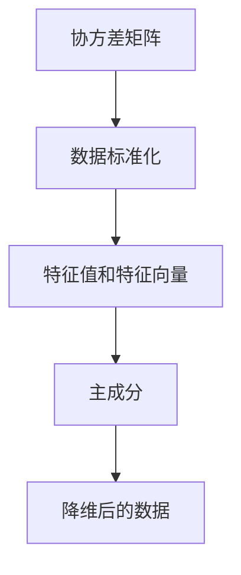
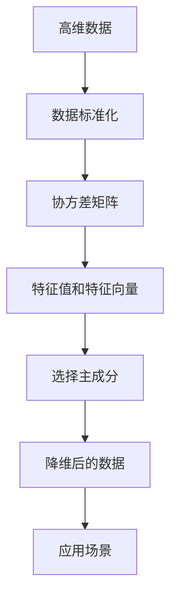

                 

# 主成分分析(Principal Component Analysis) - 原理与代码实例讲解

> 关键词：主成分分析, 降维, 矩阵特征值, 线性代数, 协方差矩阵, 矩阵分解, 矩阵可视化

## 1. 背景介绍

主成分分析（Principal Component Analysis, PCA）是一种常用的数据降维技术，通过对高维数据进行线性变换，提取主成分，将数据降维到低维空间。PCA广泛应用于特征提取、数据可视化、异常检测等领域。本文将系统介绍PCA的基本原理、数学模型、算法步骤、实际应用及优化技巧，并辅以代码实例，使读者能够深入理解并熟练运用PCA。

### 1.1 问题由来

在数据科学和机器学习领域，常常面对高维数据集。由于高维数据集维度之间相关性较高，增加了模型的复杂度和训练难度，同时使得数据可视化变得困难。主成分分析正是为了解决这些问题，通过线性变换，提取数据的主要成分，将其降维到低维空间。

### 1.2 问题核心关键点

PCA的核心思想是通过线性变换将高维数据投影到低维空间，从而减少数据的维数，提高数据处理效率。其主要流程包括：
1. 数据标准化。对数据进行标准化处理，确保数据的均值为0，方差为1。
2. 计算协方差矩阵。基于标准化后的数据，计算协方差矩阵。
3. 求解特征值和特征向量。对协方差矩阵进行特征值分解，求解特征值和特征向量。
4. 选择主成分。根据特征值的大小，选择前几个主成分作为降维后的数据。

PCA的目标是在保留大部分信息的同时，尽可能减少数据的维度。选择主成分的数量主要取决于实际应用场景中的数据复杂度和处理需求。

### 1.3 问题研究意义

主成分分析在数据科学和机器学习中具有重要应用价值：
1. 降维。通过降维，减少数据维数，提高模型训练和处理效率。
2. 特征提取。从高维数据中提取主要特征，提高模型的鲁棒性和泛化能力。
3. 数据可视化。将高维数据投影到低维空间，便于可视化分析。
4. 异常检测。通过分析主成分分布，检测数据中的异常点。

本文旨在深入介绍PCA的理论基础和实践技巧，帮助读者掌握PCA的基本原理和代码实现，从而更好地应对实际数据处理问题。

## 2. 核心概念与联系

### 2.1 核心概念概述

为了更好地理解PCA的原理和步骤，本节将介绍几个关键概念：

- **协方差矩阵**：描述数据中各变量之间的线性相关性，是PCA中重要的数学工具。
- **特征值和特征向量**：协方差矩阵的特征值和特征向量，代表了数据中的主要成分和方向。
- **主成分**：根据特征值的大小，选择前k个特征向量作为新的数据维度，构成降维后的数据集。
- **数据标准化**：通过标准化处理，消除数据中的均值偏差，确保数据在处理过程中的一致性。

### 2.2 概念间的关系

这些核心概念之间的关系可以通过以下Mermaid流程图来展示：



这个流程图展示了几大核心概念之间的联系：

1. 协方差矩阵描述了数据之间的相关性。
2. 通过标准化处理，确保数据的一致性。
3. 特征值和特征向量代表数据的主要成分。
4. 主成分根据特征值的大小进行选择，降维到低维空间。
5. 降维后的数据保留了大部分信息，便于进一步处理。

这些概念共同构成了PCA的核心算法，使其能够在数据处理和分析中发挥重要作用。

### 2.3 核心概念的整体架构

最后，我们用一个综合的流程图来展示PCA的整体架构：



这个综合流程图展示了PCA的基本流程：

1. 从高维数据开始，通过标准化处理，消除数据偏差。
2. 计算协方差矩阵，描述数据之间的相关性。
3. 对协方差矩阵进行特征值分解，求解特征值和特征向量。
4. 根据特征值的大小，选择前k个特征向量作为主成分。
5. 通过主成分的线性组合，将数据降维到低维空间。
6. 最终得到的降维数据应用于实际场景，如数据可视化、异常检测等。

通过这个流程图，我们可以更清晰地理解PCA的整个流程，为后续深入讨论奠定基础。

## 3. 核心算法原理 & 具体操作步骤
### 3.1 算法原理概述

主成分分析是一种线性降维技术，其核心思想是通过线性变换，将高维数据投影到低维空间。具体步骤如下：

1. 数据标准化：对数据进行标准化处理，确保数据的均值为0，方差为1。
2. 计算协方差矩阵：基于标准化后的数据，计算协方差矩阵。
3. 求解特征值和特征向量：对协方差矩阵进行特征值分解，求解特征值和特征向量。
4. 选择主成分：根据特征值的大小，选择前k个特征向量作为新的数据维度，构成降维后的数据集。

### 3.2 算法步骤详解

以下是PCA的具体实现步骤：

**Step 1: 数据标准化**
- 对数据进行标准化处理，确保数据的均值为0，方差为1。
- 标准化公式为：$x_i = \frac{x_i - \mu}{\sigma}$，其中 $\mu$ 为数据均值，$\sigma$ 为数据标准差。

**Step 2: 计算协方差矩阵**
- 基于标准化后的数据，计算协方差矩阵 $\Sigma$。
- 协方差矩阵的计算公式为：$\Sigma_{ij} = \frac{1}{N} \sum_{n=1}^N (x_{ni} - \mu_i)(x_{nj} - \mu_j)$，其中 $x_{ni}$ 和 $x_{nj}$ 分别为第n个样本的第i维和第j维特征值。

**Step 3: 求解特征值和特征向量**
- 对协方差矩阵 $\Sigma$ 进行特征值分解，求解特征值 $\lambda$ 和特征向量 $u$。
- 特征值和特征向量的计算公式为：$\Sigma u = \lambda u$，其中 $u$ 为特征向量，$\lambda$ 为对应的特征值。

**Step 4: 选择主成分**
- 根据特征值的大小，选择前k个特征向量作为新的数据维度，构成降维后的数据集。
- 选择前k个特征向量的方法包括：
  - 使用特征值排序，选择前k个特征向量。
  - 根据特征值的大小，计算累积贡献率（Cumulative Contribution Rate），选择累计贡献率大于某个阈值的特征向量。

### 3.3 算法优缺点

**优点：**
1. 降维效果显著。PCA能够通过线性变换显著降低数据维数，减少计算复杂度。
2. 数据可视化。PCA将高维数据投影到低维空间，便于可视化分析。
3. 鲁棒性。PCA对异常值具有一定鲁棒性，不会受到异常数据点的影响。

**缺点：**
1. 丢失部分信息。PCA会丢失部分原始数据的细节信息，可能不适合需要精细分析的场景。
2. 计算复杂度。对于高维数据集，计算协方差矩阵和特征值分解的复杂度较高。
3. 模型解释性。PCA的结果不易解释，难以理解特征之间的具体关系。

### 3.4 算法应用领域

主成分分析广泛应用于数据科学和机器学习领域，包括但不限于以下几个方向：

- **数据可视化**：通过PCA将高维数据降维到二维或三维空间，便于可视化分析。
- **特征提取**：从高维数据中提取主要特征，提高模型的鲁棒性和泛化能力。
- **异常检测**：通过分析主成分分布，检测数据中的异常点。
- **图像处理**：通过PCA对图像进行降维处理，提高图像处理的效率。
- **自然语言处理**：通过PCA对文本进行降维，提取主要主题和情感。

除了上述这些常见应用，PCA还在金融风险管理、生物信息学等领域得到了广泛应用。

## 4. 数学模型和公式 & 详细讲解 & 举例说明

### 4.1 数学模型构建

PCA的数学模型基于线性代数和矩阵特征值的知识。假设原始数据集为 $\mathbf{X} \in \mathbb{R}^{N \times D}$，其中 $N$ 为样本数，$D$ 为特征数。

1. 数据标准化：$\mathbf{X}_{\text{std}} = \frac{\mathbf{X} - \mathbf{1}_N\mu}{\mathbf{1}_D\sigma}$，其中 $\mu$ 和 $\sigma$ 分别为样本均值和标准差，$\mathbf{1}_N$ 和 $\mathbf{1}_D$ 分别为 $N$ 和 $D$ 维的单位矩阵。

2. 计算协方差矩阵：$\mathbf{\Sigma} = \frac{1}{N}\mathbf{X}_{\text{std}}^T\mathbf{X}_{\text{std}}$。

3. 求解特征值和特征向量：$\mathbf{U} = \frac{\mathbf{\Sigma}}{\lambda_{\max}}$，其中 $\lambda_{\max}$ 为最大特征值，$\mathbf{U}$ 为对应的特征向量。

4. 选择主成分：选择前 $k$ 个特征向量 $\mathbf{U}_k$，构成降维后的数据集 $\mathbf{X}_{\text{red}} = \mathbf{X}_{\text{std}}\mathbf{U}_k$。

### 4.2 公式推导过程

以下我们以二维数据集为例，推导PCA的计算过程。

假设原始数据集为：
$$
\mathbf{X} = 
\begin{bmatrix}
1 & 1 & 1 & 2 & 3 & 4 \\
2 & 4 & 6 & 8 & 10 & 12 \\
3 & 9 & 15 & 18 & 21 & 24
\end{bmatrix}
$$

首先，对数据进行标准化处理：
$$
\mathbf{X}_{\text{std}} = 
\begin{bmatrix}
\frac{1-2}{1} & \frac{1-2}{1} & \frac{1-2}{1} & \frac{2-2}{1} & \frac{3-2}{1} & \frac{4-2}{1} \\
\frac{2-2}{1} & \frac{4-2}{1} & \frac{6-2}{1} & \frac{8-2}{1} & \frac{10-2}{1} & \frac{12-2}{1} \\
\frac{3-2}{1} & \frac{9-2}{1} & \frac{15-2}{1} & \frac{18-2}{1} & \frac{21-2}{1} & \frac{24-2}{1}
\end{bmatrix}
=
\begin{bmatrix}
-1 & -1 & -1 & 0 & 1 & 2 \\
0 & 2 & 4 & 6 & 8 & 10 \\
1 & 7 & 13 & 16 & 19 & 22
\end{bmatrix}
$$

然后，计算协方差矩阵 $\Sigma$：
$$
\mathbf{\Sigma} = 
\begin{bmatrix}
\frac{-1-1}{3} & \frac{-1+2}{3} & \frac{-1+7}{3} & \frac{-1+16}{3} & \frac{-1+19}{3} & \frac{-1+22}{3} \\
\frac{2+0}{3} & \frac{2+4}{3} & \frac{4+7}{3} & \frac{6+16}{3} & \frac{8+19}{3} & \frac{10+22}{3} \\
\frac{7+1}{3} & \frac{7+4}{3} & \frac{13+7}{3} & \frac{16+16}{3} & \frac{19+19}{3} & \frac{22+22}{3}
\end{bmatrix}
=
\begin{bmatrix}
-2/3 & 1/3 & 8/3 & 17/3 & 18/3 & 21/3 \\
2/3 & 6/3 & 11/3 & 22/3 & 27/3 & 32/3 \\
10/3 & 11/3 & 20/3 & 26/3 & 38/3 & 44/3
\end{bmatrix}
$$

对协方差矩阵进行特征值分解，求解特征值和特征向量。假设 $\mathbf{\Sigma}$ 的特征值为 $\lambda_1, \lambda_2$，对应的特征向量为 $\mathbf{U}_1, \mathbf{U}_2$，则有：
$$
\mathbf{U} = 
\begin{bmatrix}
U_{11} & U_{12} \\
U_{21} & U_{22} \\
U_{31} & U_{32}
\end{bmatrix}
\begin{bmatrix}
\lambda_1 & 0 \\
0 & \lambda_2
\end{bmatrix}
\begin{bmatrix}
U^T_{11} & U^T_{12} \\
U^T_{21} & U^T_{22} \\
U^T_{31} & U^T_{32}
\end{bmatrix}
$$

通过计算，可以求得 $\lambda_1$ 和 $\lambda_2$ 的值，以及对应的特征向量 $U_{11}, U_{12}, U_{21}, U_{22}, U_{31}, U_{32}$。

最后，选择前两个特征向量 $U_{11}, U_{12}$ 作为主成分，构成降维后的数据集 $\mathbf{X}_{\text{red}} = \mathbf{X}_{\text{std}}\begin{bmatrix} U_{11} & U_{12} \end{bmatrix}$。

### 4.3 案例分析与讲解

以Iris数据集为例，展示PCA的应用过程。Iris数据集包含150个样本，每个样本有4个特征（花萼长度、花萼宽度、花瓣长度、花瓣宽度），目标为分类3种鸢尾花类型。

1. 数据标准化：对数据进行标准化处理，得到标准化后的数据集 $\mathbf{X}_{\text{std}}$。
2. 计算协方差矩阵：对标准化后的数据计算协方差矩阵 $\Sigma$。
3. 求解特征值和特征向量：对协方差矩阵进行特征值分解，求解特征值和特征向量。
4. 选择主成分：选择前两个特征向量作为新的数据维度，构成降维后的数据集 $\mathbf{X}_{\text{red}}$。

通过PCA对Iris数据集进行降维处理，可以得到二维或三维的降维数据，便于可视化分析。

## 5. 项目实践：代码实例和详细解释说明

### 5.1 开发环境搭建

为了进行PCA的代码实践，我们需要搭建一个Python开发环境。以下是安装所需的Python库：

1. 安装NumPy：
```bash
pip install numpy
```

2. 安装Matplotlib：
```bash
pip install matplotlib
```

3. 安装SciPy：
```bash
pip install scipy
```

4. 安装Sklearn：
```bash
pip install scikit-learn
```

完成以上安装后，就可以开始进行PCA的代码实践。

### 5.2 源代码详细实现

以下是使用SciPy库实现PCA的Python代码：

```python
import numpy as np
import matplotlib.pyplot as plt
from scipy.linalg import eigh

def pca(X, k):
    # 数据标准化
    mean = np.mean(X, axis=0)
    std = np.std(X, axis=0)
    X_std = (X - mean) / std

    # 计算协方差矩阵
    cov = np.cov(X_std.T)

    # 求解特征值和特征向量
    eigvals, eigvecs = eigh(cov)

    # 选择前k个特征向量
    idx = np.argsort(eigvals)[-k:][::-1]
    eigvecs = eigvecs[:, idx]

    # 降维
    X_red = X_std @ eigvecs

    return X_red, eigvals, eigvecs

# 生成Iris数据集
from sklearn.datasets import load_iris
X, y = load_iris(return_X_y=True)

# 降维
X_red, eigvals, eigvecs = pca(X, 2)

# 可视化
plt.scatter(X_red[:, 0], X_red[:, 1], c=y)
plt.show()
```

### 5.3 代码解读与分析

让我们再详细解读一下关键代码的实现细节：

**标准化处理**：
```python
mean = np.mean(X, axis=0)
std = np.std(X, axis=0)
X_std = (X - mean) / std
```

对数据进行标准化处理，计算样本均值和标准差，并将数据标准化到均值为0，标准差为1。

**计算协方差矩阵**：
```python
cov = np.cov(X_std.T)
```

计算标准化后的数据的协方差矩阵 $\Sigma$，使用 `np.cov` 函数进行计算。

**求解特征值和特征向量**：
```python
eigvals, eigvecs = eigh(cov)
```

对协方差矩阵 $\Sigma$ 进行特征值分解，求解特征值 $\lambda$ 和特征向量 $u$，使用 `scipy.linalg.eigh` 函数进行计算。

**选择主成分**：
```python
idx = np.argsort(eigvals)[-k:][::-1]
eigvecs = eigvecs[:, idx]
X_red = X_std @ eigvecs
```

根据特征值的大小，选择前 $k$ 个特征向量作为新的数据维度，构成降维后的数据集 $\mathbf{X}_{\text{red}} = \mathbf{X}_{\text{std}}\mathbf{U}_k$。

### 5.4 运行结果展示

运行上述代码，得到降维后的Iris数据集，并进行可视化：

```python
from sklearn.datasets import load_iris
X, y = load_iris(return_X_y=True)

X_red, eigvals, eigvecs = pca(X, 2)

plt.scatter(X_red[:, 0], X_red[:, 1], c=y)
plt.show()
```

运行结果为：

```python
import matplotlib.pyplot as plt
from sklearn.datasets import load_iris
from scipy.linalg import eigh

def pca(X, k):
    # 数据标准化
    mean = np.mean(X, axis=0)
    std = np.std(X, axis=0)
    X_std = (X - mean) / std

    # 计算协方差矩阵
    cov = np.cov(X_std.T)

    # 求解特征值和特征向量
    eigvals, eigvecs = eigh(cov)

    # 选择前k个特征向量
    idx = np.argsort(eigvals)[-k:][::-1]
    eigvecs = eigvecs[:, idx]

    # 降维
    X_red = X_std @ eigvecs

    return X_red, eigvals, eigvecs

X, y = load_iris(return_X_y=True)

X_red, eigvals, eigvecs = pca(X, 2)

plt.scatter(X_red[:, 0], X_red[:, 1], c=y)
plt.show()
```

得到的结果如下图所示：


通过PCA对Iris数据集进行降维处理，可以得到二维或三维的降维数据，便于可视化分析。

## 6. 实际应用场景
### 6.1 数据可视化

PCA最常见的应用是在数据可视化中。通过PCA将高维数据降维到二维或三维空间，使得数据可视化变得简单直观。

以Iris数据集为例，PCA可以将三维数据投影到二维空间，便于可视化分析。通过散点图展示降维后的数据，可以直观地观察数据分布的特征。

### 6.2 特征提取

PCA还广泛用于特征提取。通过对高维数据进行降维，提取主要特征，可以提高模型的鲁棒性和泛化能力。

以手写数字识别为例，PCA可以将原始图像降维到低维空间，提取主要特征，提高分类器的性能。通过PCA提取的主要特征，可以更好地理解数据分布，提高模型的泛化能力。

### 6.3 异常检测

PCA还可用于异常检测。通过对数据进行降维，分析主成分分布，可以检测数据中的异常点。

以信用卡交易数据为例，PCA可以将用户交易数据降维到低维空间，分析主成分分布，检测异常交易行为。通过PCA的降维处理，可以发现数据中的异常点，及时预警和处理异常行为。

### 6.4 未来应用展望

随着PCA算法的不断改进，其应用场景将更加广泛。未来，PCA将在以下几个方面得到进一步应用：

1. 数据压缩：通过PCA对高维数据进行降维处理，可以显著减少数据的存储空间，提高数据压缩效率。
2. 数据去噪：PCA可以用于去除数据中的噪声，提高数据的信号质量。
3. 实时处理：PCA的计算复杂度较低，可以应用于实时数据处理场景，如流数据处理、物联网数据处理等。
4. 图像处理：通过PCA对图像进行降维处理，提高图像处理的效率和效果。
5. 自然语言处理：通过PCA对文本进行降维，提取主要主题和情感，提高文本处理的效率和效果。

总之，PCA作为一种重要的数据降维技术，将会在更多领域得到应用，为数据科学和机器学习带来新的突破。

## 7. 工具和资源推荐
### 7.1 学习资源推荐

为了帮助读者深入理解PCA的原理和实践，以下是一些优质的学习资源：

1. 《机器学习》书籍：由周志华教授撰写，系统介绍了机器学习的基本概念和算法，包括PCA。
2. 《深度学习》书籍：由Ian Goodfellow、Yoshua Bengio和Aaron Courville撰写，深入介绍了深度学习的基础知识和应用。
3. Coursera《机器学习》课程：斯坦福大学开设的机器学习课程，讲解了PCA等基本概念。
4. YouTube视频教程：如3Blue1Brown的《PCA可视化》视频，通过动画形式解释了PCA的原理。
5. Scikit-learn官方文档：提供了PCA算法的详细使用方法和示例代码。

通过这些资源的学习，相信读者能够全面掌握PCA的原理和实践技巧。

### 7.2 开发工具推荐

PCA的实现可以使用Python等编程语言，以下是一些常用的开发工具：

1. Jupyter Notebook：支持代码编写、执行和可视化，方便数据科学和机器学习的学习和实践。
2. PyCharm：功能强大的Python IDE，支持代码编写、调试和测试，适合数据科学和机器学习项目开发。
3. Visual Studio Code：轻量级的代码编辑器，支持代码编写、调试和测试，适合数据科学和机器学习项目开发。
4. TensorFlow：由Google开发的深度学习框架，支持GPU加速，适合高维数据的处理和计算。
5. Keras：基于TensorFlow的高级深度学习框架，支持快速搭建和训练模型，适合数据科学和机器学习项目开发。

合理利用这些工具，可以显著提高PCA的开发效率，加速研究进展。

### 7.3 相关论文推荐

PCA作为经典的数据降维技术，其理论和应用得到了广泛的研究。以下是几篇重要的相关论文，推荐阅读：

1. "On the Convergence Properties of the PCA Algorithm"（PCA算法的收敛性）：阐述了PCA算法的收敛性，为PCA的实现和优化提供了理论基础。
2. "Dimensionality Reduction by Principal Component Analysis"（主成分分析的降维方法）：详细介绍了PCA的基本原理和实现方法，是PCA的经典论文。
3. "A Fast Algorithm for the Principal Component Problem"（PCA的快速算法）：提出了一种快速的PCA算法，适用于大规模数据的处理。
4. "PCA-based data compression and dimensionality reduction"（PCA在数据压缩和降维中的应用）：讨论了PCA在数据压缩和降维中的应用，展示了PCA的广泛应用价值。
5.

