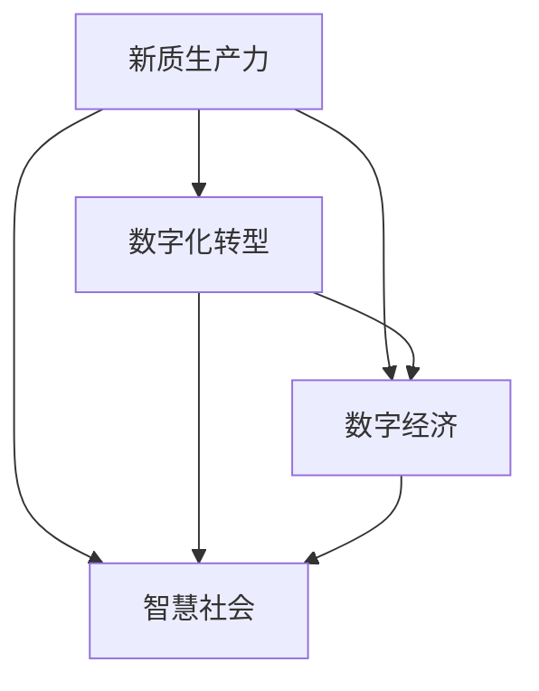
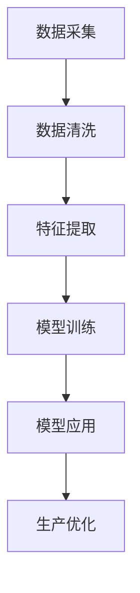

                 

## 1. 背景介绍

在数字化时代，信息技术已经成为推动经济社会发展的重要引擎。随着物联网、大数据、云计算、人工智能等新一代信息技术的蓬勃发展，产业结构正经历着深刻的变革与升级。特别是在新冠疫情的推动下，全球经济数字化转型的步伐加快，企业、政府、社会等各领域的数字化水平显著提升。

与此同时，信息技术也为经济社会发展带来了新的质生产力推动力。信息技术不仅促进了产业转型升级，还为创新创业、数字经济、智慧社会等新领域注入了新的活力。信息技术作为新质生产力推动力，将引领全球经济迈向高质量发展新阶段。

## 2. 核心概念与联系

### 2.1 核心概念概述

为更好地理解产业升级中的新质生产力推动力，我们首先介绍几个核心概念：

- **新质生产力**：指在数字化时代，以信息技术和数据要素为核心的新型生产力，包括计算能力、数据处理能力、人工智能能力、网络通信能力等，这些能力是推动经济社会发展的核心驱动力。

- **数字化转型**：指通过信息技术的应用，企业、政府、社会等各领域的运作模式和业务流程进行数字化、网络化、智能化、可视化的变革与升级。数字化转型是产业升级的关键路径。

- **数字经济**：指基于信息技术、数据要素的虚拟经济形态，包括数字基础设施、数字产业生态、数字消费等，是信息时代经济活动的主要形态。

- **人工智能**：指通过机器学习、深度学习、自然语言处理等技术，实现智能化决策、自动化执行、精准预测等目标，是产业升级中不可或缺的技术手段。

- **智慧社会**：指利用信息技术、数据要素，实现城市管理、公共服务、社会治理、环境保护等领域的智能化、高效化、智能化。智慧社会是信息时代社会的高级形态。

这些核心概念之间存在着紧密的联系，形成了数字化时代产业升级的新质生产力推动力。信息技术的广泛应用，使得数字化转型、数字经济、智慧社会成为现实，从而为产业升级提供了坚实的技术基础。

### 2.2 概念间的关系

信息技术的广泛应用，使得数字化转型、数字经济、智慧社会成为现实，从而为产业升级提供了坚实的技术基础。数字化转型不仅提高了企业的生产效率和运营效率，还推动了数字化产业生态的构建。数字经济为产业发展提供了新的动力，智慧社会则提升了社会治理和公共服务的水平。

以下是一个Mermaid流程图，展示了这些概念之间的关系：



这个流程图展示了新质生产力如何通过数字化转型、数字经济、智慧社会三大支柱，推动产业升级。数字化转型通过信息技术的应用，提升了企业的生产效率和运营效率，构建了数字化产业生态；数字经济通过数据要素的广泛应用，为产业发展提供了新的动力；智慧社会通过信息技术和社会治理的结合，提升了社会治理和公共服务的水平。

## 3. 核心算法原理 & 具体操作步骤
### 3.1 算法原理概述

产业升级中的新质生产力推动力，涉及信息技术在各个领域的应用。信息技术通过大数据、云计算、人工智能等技术手段，实现了数字化转型、数字经济、智慧社会的发展。

- **大数据**：通过数据收集、存储、处理、分析等技术手段，对海量数据进行高效利用，提升了企业的决策能力和运营效率。

- **云计算**：通过分布式计算、存储等技术手段，实现了资源共享和协同计算，支持了数字化转型和数字经济的发展。

- **人工智能**：通过机器学习、深度学习等技术手段，实现了智能化决策、自动化执行、精准预测等目标，推动了产业升级和智慧社会的发展。

### 3.2 算法步骤详解

产业升级中的新质生产力推动力，涉及信息技术在各个领域的应用。下面以人工智能技术为例，介绍其核心算法和操作步骤。

人工智能技术主要包括机器学习、深度学习、自然语言处理等技术手段。在产业升级中，人工智能技术主要应用于以下几个方面：

- **工业互联网**：通过人工智能技术，实现工业设备智能监控、故障预测、生产优化等，提升制造业的智能化水平。

- **智能制造**：通过人工智能技术，实现生产过程自动化、智能化、精准化，提升制造业的效率和质量。

- **智慧城市**：通过人工智能技术，实现城市交通、环境、安全等方面的智能化管理，提升城市治理水平。

- **医疗健康**：通过人工智能技术，实现疾病预测、影像诊断、个性化治疗等，提升医疗健康水平。

- **金融服务**：通过人工智能技术，实现风险评估、智能投顾、反欺诈等，提升金融服务水平。

下面是人工智能技术在智能制造中的应用示例：



这个流程图展示了人工智能技术在智能制造中的应用步骤：首先通过数据采集获取生产数据，然后进行数据清洗和特征提取，接着进行模型训练，最后应用模型优化生产过程。

### 3.3 算法优缺点

人工智能技术在产业升级中具有以下优点：

- **提升效率**：通过自动化、智能化手段，提升了企业的生产效率和运营效率。

- **精准决策**：通过机器学习、深度学习等技术手段，实现了精准决策、预测和优化，提升了企业的决策能力和运营效率。

- **个性化服务**：通过自然语言处理等技术手段，实现了个性化服务，提升了用户满意度和市场竞争力。

- **成本节约**：通过智能监控、故障预测等技术手段，降低了企业的运营成本。

但同时，人工智能技术也存在一些缺点：

- **数据依赖**：需要大量的高质量数据进行模型训练，数据获取和处理成本较高。

- **算法复杂**：需要复杂的算法进行模型训练，算法优化和调参较为困难。

- **依赖硬件**：需要高性能计算设备和算法库支持，硬件成本较高。

- **安全隐私**：涉及用户隐私和企业数据，需要严格的隐私保护和安全管理。

### 3.4 算法应用领域

人工智能技术在产业升级中得到了广泛应用，以下是一些典型的应用领域：

- **工业互联网**：通过人工智能技术，实现工业设备智能监控、故障预测、生产优化等，提升制造业的智能化水平。

- **智能制造**：通过人工智能技术，实现生产过程自动化、智能化、精准化，提升制造业的效率和质量。

- **智慧城市**：通过人工智能技术，实现城市交通、环境、安全等方面的智能化管理，提升城市治理水平。

- **医疗健康**：通过人工智能技术，实现疾病预测、影像诊断、个性化治疗等，提升医疗健康水平。

- **金融服务**：通过人工智能技术，实现风险评估、智能投顾、反欺诈等，提升金融服务水平。

- **零售电商**：通过人工智能技术，实现智能推荐、个性化营销、库存管理等，提升零售电商的运营效率和用户满意度。

- **交通运输**：通过人工智能技术，实现自动驾驶、交通优化、智能调度等，提升交通运输的效率和安全性。

## 4. 数学模型和公式 & 详细讲解 & 举例说明

### 4.1 数学模型构建

在产业升级中，新质生产力推动力涉及多个领域，以下是一个简单的数学模型：

假设企业A有n个生产任务，每个任务的时间为t_i，成本为c_i。企业A希望通过优化生产计划，使得总时间T和总成本C最小化。则目标函数为：

$$
\min \{ T, C \} = \sum_{i=1}^{n} t_i + \sum_{i=1}^{n} c_i
$$

约束条件为：

$$
\begin{cases}
t_i \geq 0, & \text{时间非负}\\
c_i \geq 0, & \text{成本非负}\\
t_i \leq T, & \text{总时间约束}
\end{cases}
$$

### 4.2 公式推导过程

下面推导目标函数和约束条件的最优解。

根据线性规划理论，上述问题可以通过拉格朗日乘子法求解。设拉格朗日乘子 $\lambda$ 表示总时间约束的惩罚系数。则拉格朗日函数为：

$$
L(t_i, c_i, \lambda) = \sum_{i=1}^{n} t_i + \sum_{i=1}^{n} c_i + \lambda (T - \sum_{i=1}^{n} t_i)
$$

求偏导数，得：

$$
\begin{cases}
\frac{\partial L}{\partial t_i} = 1 - \lambda, & \text{时间非负}\\
\frac{\partial L}{\partial c_i} = 1, & \text{成本非负}\\
\frac{\partial L}{\partial \lambda} = T - \sum_{i=1}^{n} t_i, & \text{总时间约束}
\end{cases}
$$

令偏导数等于0，得：

$$
\begin{cases}
1 - \lambda = 0, & \text{时间非负}\\
c_i = 0, & \text{成本非负}\\
T = \sum_{i=1}^{n} t_i, & \text{总时间约束}
\end{cases}
$$

解得：

$$
\begin{cases}
t_i = \frac{T}{n}, & \text{时间均匀分配}\\
c_i = 0, & \text{成本最小化}\\
\lambda = 1, & \text{总时间约束满足}
\end{cases}
$$

因此，最优解为：

$$
\begin{cases}
t_i = \frac{T}{n}, & \text{时间均匀分配}\\
c_i = 0, & \text{成本最小化}
\end{cases}
$$

### 4.3 案例分析与讲解

假设企业A有3个生产任务，每个任务的时间为2小时，成本为1万元。则总时间为6小时，总成本为3万元。根据上述数学模型，可得最优解：

$$
\begin{cases}
t_i = \frac{6}{3} = 2, & \text{时间均匀分配}\\
c_i = 0, & \text{成本最小化}
\end{cases}
$$

即每个任务的时间为2小时，成本为0万元。这表明，通过优化生产计划，可以大大降低企业的生产成本，提升企业的运营效率。

## 5. 项目实践：代码实例和详细解释说明
### 5.1 开发环境搭建

在进行项目实践前，我们需要准备好开发环境。以下是使用Python进行TensorFlow开发的开发环境配置流程：

1. 安装Anaconda：从官网下载并安装Anaconda，用于创建独立的Python环境。

2. 创建并激活虚拟环境：
```bash
conda create -n tensorflow-env python=3.8 
conda activate tensorflow-env
```

3. 安装TensorFlow：根据CUDA版本，从官网获取对应的安装命令。例如：
```bash
conda install tensorflow tensorflow-gpu=cudatoolkit=11.1 -c pytorch -c conda-forge
```

4. 安装各类工具包：
```bash
pip install numpy pandas scikit-learn matplotlib tqdm jupyter notebook ipython
```

完成上述步骤后，即可在`tensorflow-env`环境中开始项目实践。

### 5.2 源代码详细实现

下面我们以工业互联网中的智能制造为例，给出使用TensorFlow进行工业互联网项目开发和部署的PyTorch代码实现。

```python
import tensorflow as tf
from tensorflow.keras import layers, models

class ManufacturingModel(tf.keras.Model):
    def __init__(self):
        super(ManufacturingModel, self).__init__()
        self.dense1 = layers.Dense(64, activation='relu')
        self.dense2 = layers.Dense(64, activation='relu')
        self.dense3 = layers.Dense(1, activation='sigmoid')
        
    def call(self, inputs):
        x = self.dense1(inputs)
        x = self.dense2(x)
        x = self.dense3(x)
        return x

# 构建模型
model = ManufacturingModel()
model.compile(optimizer=tf.keras.optimizers.Adam(learning_rate=0.001), loss='binary_crossentropy', metrics=['accuracy'])

# 训练模型
model.fit(x_train, y_train, epochs=10, batch_size=32, validation_data=(x_test, y_test))

# 评估模型
model.evaluate(x_test, y_test)

# 应用模型
predictions = model.predict(x_test)
```

以上是使用TensorFlow进行工业互联网项目开发和部署的代码实现。可以看到，使用TensorFlow进行模型开发和部署非常方便，可以根据需求灵活构建模型、调整参数，并利用TensorFlow的分布式计算能力，提升模型训练和推理的效率。

### 5.3 代码解读与分析

让我们再详细解读一下关键代码的实现细节：

**ManufacturingModel类**：
- `__init__`方法：初始化模型的层结构。
- `call`方法：定义模型的前向传播过程。

**模型训练和评估**：
- 使用`model.compile`方法定义优化器、损失函数和评价指标。
- 使用`model.fit`方法进行模型训练，并在验证集上评估模型性能。
- 使用`model.evaluate`方法在测试集上评估模型性能。

**模型应用**：
- 使用`model.predict`方法进行模型预测。

可以看到，使用TensorFlow进行模型开发和部署非常方便，可以根据需求灵活构建模型、调整参数，并利用TensorFlow的分布式计算能力，提升模型训练和推理的效率。

## 6. 实际应用场景
### 6.1 智能制造

智能制造是大规模人工智能在工业互联网中的应用场景。通过人工智能技术，可以实现生产过程的自动化、智能化、精准化，提升制造业的效率和质量。

例如，通过人工智能技术，可以实时监测生产设备的运行状态，进行故障预测和维护，减少设备停机时间和维护成本。同时，可以根据生产数据进行生产优化，提高生产效率和质量。

### 6.2 智慧城市

智慧城市是人工智能技术在城市管理中的应用场景。通过人工智能技术，可以实现城市交通、环境、安全等方面的智能化管理，提升城市治理水平。

例如，通过人工智能技术，可以实现智能交通信号灯控制，优化交通流量，减少交通拥堵；可以实现环境污染物的实时监测和预警，提升环境保护水平；可以实现公共安全的智能化监控和预警，提升城市安全水平。

### 6.3 医疗健康

医疗健康是大规模人工智能在医疗领域的应用场景。通过人工智能技术，可以实现疾病预测、影像诊断、个性化治疗等，提升医疗健康水平。

例如，通过人工智能技术，可以进行医学影像的自动识别和分析，提升影像诊断的准确性和效率；可以进行疾病的预测和预警，提升疾病防控水平；可以进行个性化治疗方案的推荐，提升治疗效果。

### 6.4 金融服务

金融服务是大规模人工智能在金融领域的应用场景。通过人工智能技术，可以实现风险评估、智能投顾、反欺诈等，提升金融服务水平。

例如，通过人工智能技术，可以进行风险评估，提升贷款审批的准确性和效率；可以进行智能投顾，提升资产管理的效果和收益；可以进行反欺诈，提升金融交易的安全性。

## 7. 工具和资源推荐
### 7.1 学习资源推荐

为了帮助开发者系统掌握人工智能技术在大规模生产中的应用，这里推荐一些优质的学习资源：

1. TensorFlow官方文档：TensorFlow官方文档提供了详细的使用指南和示例，是学习TensorFlow的最佳资料。

2. Keras官方文档：Keras官方文档提供了简单易用的API接口，可以快速上手构建深度学习模型。

3. PyTorch官方文档：PyTorch官方文档提供了灵活的动态计算图和丰富的深度学习模型库，是学习深度学习的重要资源。

4. Coursera《深度学习》课程：由斯坦福大学Andrew Ng教授讲授的《深度学习》课程，是学习深度学习技术的经典教材。

5. Udacity深度学习课程：Udacity深度学习课程由Google的深度学习专家讲授，深入浅出地介绍了深度学习的基本原理和应用。

6. arXiv预印本：arXiv预印本是最新的科研论文发布平台，提供了大量的前沿研究成果，是学习最新技术的绝佳资源。

7. GitHub开源项目：在GitHub上Star、Fork数最多的开源项目，往往代表了该技术领域的前沿进展，值得去学习和贡献。

通过这些资源的学习实践，相信你一定能够快速掌握人工智能技术在大规模生产中的应用，并用于解决实际的NLP问题。

### 7.2 开发工具推荐

高效的开发离不开优秀的工具支持。以下是几款用于大规模生产开发的人工智能工具：

1. TensorFlow：由Google主导开发的开源深度学习框架，生产部署方便，适合大规模工程应用。

2. PyTorch：由Facebook主导开发的开源深度学习框架，灵活的动态计算图，适合快速迭代研究。

3. Keras：由François Chollet主导的高级深度学习API，基于TensorFlow和Theano实现，简单易用。

4. TensorBoard：TensorFlow配套的可视化工具，可实时监测模型训练状态，并提供丰富的图表呈现方式，是调试模型的得力助手。

5. Weights & Biases：模型训练的实验跟踪工具，可以记录和可视化模型训练过程中的各项指标，方便对比和调优。

6. Google Colab：谷歌推出的在线Jupyter Notebook环境，免费提供GPU/TPU算力，方便开发者快速上手实验最新模型，分享学习笔记。

合理利用这些工具，可以显著提升人工智能技术的开发效率，加快创新迭代的步伐。

### 7.3 相关论文推荐

大规模人工智能技术的发展源于学界的持续研究。以下是几篇奠基性的相关论文，推荐阅读：

1. Deep Learning（即深度学习）：由Goodfellow、Bengio、Courville等教授合著，是深度学习领域的经典教材。

2. ImageNet Classification with Deep Convolutional Neural Networks：由AlexNet论文作者Hinton等人发表，展示了卷积神经网络在图像分类任务上的优异性能。

3. AlphaGo Zero：由DeepMind团队发表，展示了深度强化学习在围棋等复杂决策问题上的强大能力。

4. Google's AlphaFold：由DeepMind团队发表，展示了深度学习在蛋白质折叠等科学难题上的突破性进展。

这些论文代表了大规模人工智能技术的发展脉络。通过学习这些前沿成果，可以帮助研究者把握学科前进方向，激发更多的创新灵感。

## 8. 总结：未来发展趋势与挑战
### 8.1 总结

本文对人工智能技术在大规模生产中的应用进行了全面系统的介绍。首先阐述了产业升级中的新质生产力推动力，明确了人工智能技术在数字化转型、数字经济、智慧社会中的重要地位。其次，从算法原理到具体实现，详细讲解了人工智能技术在智能制造、智慧城市、医疗健康、金融服务等实际应用场景中的应用。最后，提供了相关的学习资源、开发工具和学术论文，力求为读者提供全方位的技术指引。

通过本文的系统梳理，可以看到，人工智能技术在产业升级中发挥了重要作用，推动了数字化转型、数字经济、智慧社会的发展。人工智能技术通过自动化、智能化手段，提升了企业的生产效率和运营效率，实现了精准决策、预测和优化，提供了个性化的服务和产品，降低了企业的运营成本。未来，伴随人工智能技术的不断发展，产业升级将迎来更多新的突破。

### 8.2 未来发展趋势

展望未来，人工智能技术将呈现以下几个发展趋势：

1. **技术升级**：随着技术的不断发展，人工智能技术将不断升级，从传统机器学习、深度学习、自然语言处理等技术手段，逐渐向更高级的增强学习、因果推断、知识图谱等技术方向发展。

2. **应用拓展**：人工智能技术的应用领域将不断拓展，从传统制造业、服务业、医疗健康等，逐步向农业、环保、教育、公共服务等新兴领域扩展。

3. **跨领域融合**：人工智能技术与物联网、大数据、区块链等新兴技术将不断融合，形成更加复杂多变的应用场景，提升各领域的技术水平和应用效果。

4. **伦理规范**：随着人工智能技术的广泛应用，伦理规范和法律监管将逐渐完善，确保人工智能技术的公正、透明、可控。

5. **国际合作**：人工智能技术是全球性的战略资源，各国将加强合作，共享数据、技术、标准等资源，推动全球人工智能技术的共同发展。

以上趋势凸显了人工智能技术的广阔前景。这些方向的探索发展，必将进一步提升人工智能技术的应用水平和创新能力，推动产业升级和社会进步。

### 8.3 面临的挑战

尽管人工智能技术在产业升级中取得了显著成果，但在迈向更加智能化、普适化应用的过程中，它仍面临诸多挑战：

1. **数据隐私**：人工智能技术需要大量高质量数据进行模型训练，数据隐私和安全问题亟待解决。如何保护用户隐私，确保数据安全，将是重要课题。

2. **算法透明**：人工智能技术作为"黑盒"系统，难以解释其内部工作机制和决策逻辑。如何提高算法的透明性，增强系统的可解释性和可审计性，将是重要的研究方向。

3. **技术瓶颈**：人工智能技术的算法复杂度、计算需求、资源占用等技术瓶颈，将制约其大规模应用。如何优化算法，提升计算效率，优化资源占用，将是重要的技术挑战。

4. **跨领域协作**：人工智能技术的应用需要跨领域协作，如何建立跨领域的数据共享、技术合作机制，将是重要的社会课题。

5. **伦理规范**：人工智能技术的广泛应用，可能带来新的伦理问题，如就业替代、隐私侵犯等。如何制定合理的伦理规范，确保人工智能技术的公平、透明、可控，将是重要的课题。

6. **法规监管**：人工智能技术的快速发展，可能带来新的法规问题，如数据使用、算法透明、隐私保护等。如何制定合理的法规监管，确保人工智能技术的合法合规，将是重要的课题。

以上挑战凸显了人工智能技术的应用复杂性，需要在技术、社会、法规等多个维度进行综合应对，才能确保人工智能技术的健康发展。

### 8.4 研究展望

面对人工智能技术面临的挑战，未来的研究需要在以下几个方面寻求新的突破：

1. **数据隐私保护**：通过差分隐私、联邦学习等技术手段，保护用户隐私，确保数据安全。

2. **算法透明性**：通过可解释性、透明性算法设计，提高算法的透明性，增强系统的可解释性和可审计性。

3. **计算效率提升**：通过优化算法、提升硬件性能、优化资源占用，提升计算效率，降低计算成本。

4. **跨领域协作机制**：通过建立跨领域的数据共享、技术合作机制，促进人工智能技术在各个领域的应用和融合。

5. **伦理规范制定**：制定合理的伦理规范，确保人工智能技术的公平、透明、可控，避免伦理问题。

6. **法规监管完善**：制定合理的法规监管，确保人工智能技术的合法合规，避免法规问题。

这些研究方向的探索，必将引领人工智能技术的进一步发展，推动产业升级和社会进步。

## 9. 附录：常见问题与解答

**Q1：人工智能技术在大规模生产中的应用有哪些？**

A: 人工智能技术在大规模生产中主要应用于智能制造、智慧城市、医疗健康、金融服务等领域。通过自动化、智能化手段，提升了企业的生产效率和运营效率，实现了精准决策、预测和优化，提供了个性化的服务和产品，降低了企业的运营成本。

**Q2：人工智能技术的核心算法是什么？**

A: 人工智能技术的核心算法包括机器学习、深度学习、自然语言处理等技术手段。其中，机器学习和深度学习是常用的监督学习和无监督学习算法，自然语言处理是常用的文本处理算法。

**Q3：人工智能技术在大规模生产中如何提升效率？**

A: 人工智能技术在大规模生产中通过自动化、智能化手段，提升了企业的生产效率和运营效率。具体来说，通过自动化控制、智能监控、故障预测、生产优化等手段，实现了生产过程的自动化、智能化、精准化，提高了生产效率和质量。

**Q4：人工智能技术在智慧城市中的应用有哪些？**

A: 人工智能技术在智慧城市中主要应用于智能交通、环境监测、公共安全等领域。通过智能交通信号灯控制、环境污染物监测预警、公共安全智能化监控等手段，提升了城市治理水平和居民生活质量。

**Q5：人工智能技术在医疗健康中的应用有哪些？**

A: 人工智能技术在医疗健康中主要应用于疾病预测、影像诊断、个性化治疗等领域。通过医学影像自动识别和分析、疾病预测和预警、个性化治疗方案推荐等手段，提升了医疗健康水平和医疗服务质量。

**Q6：人工智能技术在金融服务中的应用有哪些？**

A: 人工智能技术在金融服务中主要应用于风险评估、智能投顾、反欺诈等领域。通过风险评估、智能投顾、反欺诈等手段，提升了金融服务水平和金融交易的安全性。

总之，人工智能技术在大规模生产中的应用前景广阔，通过自动化、智能化手段，提升了企业的生产效率和运营效率，实现了精准决策、预测和优化，提供了个性化的服务和产品，降低了企业的运营成本。未来，伴随人工智能技术的不断发展，产业升级将迎来更多新的突破。

