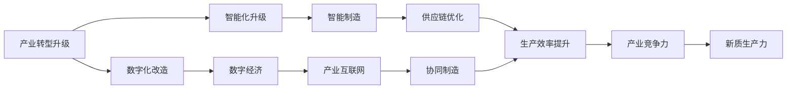
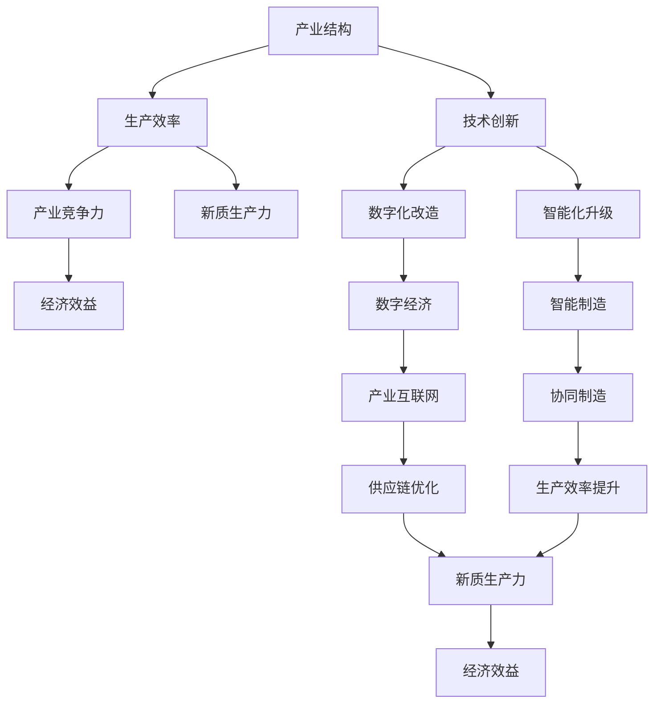
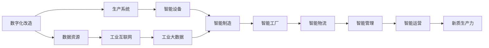
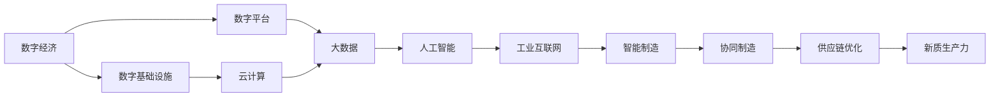
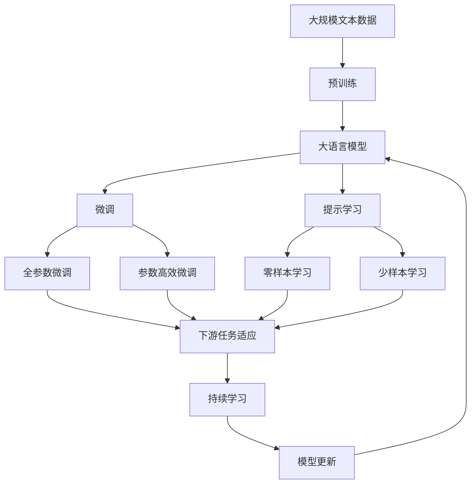

                 

## 1. 背景介绍

### 1.1 问题由来
随着信息技术的发展，产业结构和生产方式正在经历深刻的变革。传统的制造业、农业、服务业正被以数字化、网络化、智能化为特征的新产业所取代，产业的形态、功能和价值链发生了根本性的变化。如何利用新技术和新模式，推动产业转型升级，提升新质生产力，成为当前时代亟需解决的重大问题。

### 1.2 问题核心关键点
产业转型升级与新质生产力涉及的核心问题包括：

1. 如何通过新技术和新模式，提升产业效率和竞争力？
2. 如何在产业数字化转型过程中，有效整合和管理数据资源？
3. 如何利用人工智能、大数据、云计算等技术，推动产业智能化升级？
4. 如何在产业升级过程中，兼顾环保、社会责任和经济效益？
5. 如何通过技术创新，实现产业的高质量发展？

### 1.3 问题研究意义
产业转型升级与新质生产力的研究，对于推动经济发展、促进产业结构优化升级、提高经济质量和效益具有重要意义：

1. 有助于推动经济高质量发展。新技术和新模式的应用，可以显著提高生产效率和资源利用率，降低生产成本，提升产品质量，增加附加值。
2. 促进产业结构的优化升级。通过数字化、智能化改造，可以淘汰落后产能，优化产业布局，形成新兴产业和传统产业协同发展的新格局。
3. 提升产业的国际竞争力。利用先进技术和新模式，可以缩短与发达国家的差距，提升产业的国际市场份额和技术影响力。
4. 促进产业的绿色发展。通过智能化、数字化改造，可以降低环境污染，提高资源利用效率，实现产业的可持续发展。
5. 带动社会就业。新技术和新模式的应用，可以创造新的就业岗位，促进劳动力市场的转型和升级。

## 2. 核心概念与联系

### 2.1 核心概念概述

为更好地理解产业转型升级与新质生产力的内涵和作用机制，本节将介绍几个密切相关的核心概念：

- **产业转型升级**：指通过技术创新和模式创新，推动产业从传统形态向现代形态转变，提升产业结构、生产效率和竞争力，实现产业的高质量发展。
- **新质生产力**：指以数字化、网络化、智能化为特征的新型生产力，通过信息技术和物理技术的深度融合，提升生产效率、质量和经济效益，实现产业的可持续发展。
- **数字经济**：指以信息技术为核心，以数据为关键生产要素，以网络为重要载体的新型经济形态。
- **智能制造**：指通过信息技术和物理技术的深度融合，实现生产过程的数字化、智能化、自动化和柔性化，提升生产效率和产品质量。
- **产业互联网**：指通过互联网技术，整合产业链上下游资源，实现供应链、物流、销售等环节的信息化和协同化，提升产业的整体效率和竞争力。

这些核心概念之间的逻辑关系可以通过以下Mermaid流程图来展示：



这个流程图展示了大语言模型微调过程中各个核心概念的关系和作用：

1. 产业转型升级以数字化改造为基础，通过智能化升级提升生产效率和竞争力。
2. 数字化改造和智能化升级推动数字经济和产业互联网的发展，实现供应链和协同制造的优化。
3. 数字经济、智能制造和产业互联网共同作用于新质生产力的提升，实现产业的高质量发展。

### 2.2 概念间的关系

这些核心概念之间存在着紧密的联系，形成了产业转型升级和新质生产力的完整生态系统。下面我通过几个Mermaid流程图来展示这些概念之间的关系。

#### 2.2.1 产业转型升级的整体架构



这个流程图展示了产业转型升级的整体架构，包含产业结构、生产效率、产业竞争力、技术创新、数字化改造、智能化升级、数字经济、智能制造、产业互联网、协同制造、供应链优化和新质生产力的相互作用。

#### 2.2.2 数字化改造与智能化升级的联系



这个流程图展示了数字化改造与智能化升级之间的联系，通过数据资源整合、生产系统优化、智能设备和智能制造等手段，实现智能工厂和智能物流，提升智能管理和智能运营，最终推动新质生产力的提升。

#### 2.2.3 数字经济与产业互联网的关系



这个流程图展示了数字经济与产业互联网的关系，通过数字基础设施、云计算、大数据、人工智能等手段，实现工业互联网、智能制造、协同制造和供应链优化，最终推动新质生产力的提升。

### 2.3 核心概念的整体架构

最后，我们用一个综合的流程图来展示这些核心概念在大语言模型微调过程中的整体架构：



这个综合流程图展示了从预训练到微调，再到持续学习的完整过程。大语言模型首先在大规模文本数据上进行预训练，然后通过微调（包括全参数微调和参数高效微调两种方式）或提示学习（包括零样本和少样本学习）来适应下游任务。最后，通过持续学习技术，模型可以不断更新和适应新的任务和数据。 通过这些流程图，我们可以更清晰地理解产业转型升级和新质生产力中的各个概念及其相互作用。

## 3. 核心算法原理 & 具体操作步骤

### 3.1 算法原理概述

产业转型升级与新质生产力的核心算法原理，可以概括为以下几个关键点：

1. **数据驱动**：通过数据资源的高效利用，实现生产过程的数字化、智能化和自动化，提升生产效率和产品质量。
2. **技术创新**：利用人工智能、大数据、云计算等技术，推动产业智能化升级，实现供应链和协同制造的优化。
3. **协同优化**：通过信息技术和物理技术的深度融合，实现生产过程的智能化协同，提升生产效率和竞争力。
4. **绿色发展**：在数字化、智能化改造过程中，注重环保和可持续发展，减少环境污染，提高资源利用效率。
5. **人机协作**：通过智能化、数字化改造，实现人机协作，提升工作效率，降低劳动强度。

基于以上原理，产业转型升级和新质生产力的核心算法步骤主要包括以下几个方面：

1. 数据收集与整合
2. 技术方案设计
3. 系统开发与部署
4. 应用推广与优化
5. 持续改进与升级

### 3.2 算法步骤详解

以下是产业转型升级与新质生产力核心算法步骤的详细介绍：

#### 3.2.1 数据收集与整合

数据是产业转型升级的基础，通过数据收集和整合，实现对生产过程的全面监控和分析。具体步骤包括：

1. **数据收集**：通过传感器、监控设备、智能设备等手段，收集生产过程中的各种数据，包括温度、湿度、压力、振动等物理参数，以及生产进度、库存状态、设备运行状态等业务数据。
2. **数据清洗**：对采集到的数据进行清洗，去除噪声和异常值，确保数据的质量和完整性。
3. **数据存储与管理**：通过大数据平台或云存储技术，实现数据的集中存储和管理，便于后续的分析和处理。

#### 3.2.2 技术方案设计

技术方案设计是产业转型升级的核心环节，通过合理的设计，实现生产过程的智能化和协同化。具体步骤包括：

1. **需求分析**：根据生产需求和业务目标，明确数字化改造和智能化升级的具体目标和关键指标。
2. **技术选择**：根据需求分析结果，选择合适的技术方案，包括云计算、大数据、人工智能、工业互联网等。
3. **方案设计**：通过技术方案的设计，明确具体的实施步骤和路径，包括系统架构、数据流程、功能模块等。

#### 3.2.3 系统开发与部署

系统开发与部署是将技术方案转化为实际应用的过程。具体步骤包括：

1. **开发环境搭建**：选择合适的开发工具和平台，搭建开发环境，确保系统开发和测试的顺利进行。
2. **系统开发**：根据技术方案设计，进行系统开发，实现各个功能模块的集成和优化。
3. **系统测试与优化**：通过测试和优化，确保系统的稳定性和可靠性，优化性能和用户体验。
4. **系统部署**：将开发完成的软件系统部署到生产环境中，实现系统的上线运行。

#### 3.2.4 应用推广与优化

应用推广与优化是将系统应用到实际生产过程中的关键步骤。具体步骤包括：

1. **试点应用**：在试点项目中进行系统应用的初步测试和验证，评估系统的性能和效果。
2. **全面推广**：根据试点应用结果，进行系统的全面推广和应用，确保系统的覆盖面和效果。
3. **持续优化**：通过持续的优化和改进，确保系统能够适应生产过程的变化和需求，提升系统的稳定性和可靠性。

#### 3.2.5 持续改进与升级

持续改进与升级是保障产业转型升级可持续发展的关键环节。具体步骤包括：

1. **数据分析与评估**：通过数据分析和评估，识别系统存在的问题和不足，明确改进的方向和重点。
2. **技术升级与迭代**：根据数据分析结果，进行技术升级和迭代，引入新的技术和方案，优化系统功能和性能。
3. **业务流程优化**：通过技术升级和迭代，优化业务流程，提高生产效率和产品质量，提升用户体验和满意度。

### 3.3 算法优缺点

产业转型升级与新质生产力的核心算法具有以下优点：

1. **提升生产效率**：通过数字化和智能化改造，实现生产过程的自动化和智能化，显著提高生产效率和产品质量。
2. **降低生产成本**：通过优化供应链和协同制造，实现资源的高效利用，降低生产成本和运营成本。
3. **增强竞争力**：通过智能化和数字化改造，提升企业的产品质量和市场竞争力，增强企业的市场地位和影响力。
4. **推动创新发展**：通过技术创新和模式创新，推动产业的创新发展，提升产业的创新能力和技术水平。

同时，该算法也存在一定的局限性：

1. **高投入成本**：数字化和智能化改造需要高额的资金投入，包括设备采购、软件开发、系统部署等，对企业的财务状况和运营能力提出了较高的要求。
2. **技术门槛较高**：数字化和智能化改造涉及多学科、多领域的知识和技能，对企业内部的技术能力和人才结构提出了较高的要求。
3. **数据安全和隐私问题**：数据收集和存储过程中，存在数据泄露和隐私保护的风险，需要建立严格的数据安全管理和隐私保护机制。
4. **人员培训和技能提升**：数字化和智能化改造过程中，需要大量专业人员进行系统的开发、测试、部署和维护，对员工的培训和技能提升提出了较高的要求。

尽管存在这些局限性，但就目前而言，产业转型升级与新质生产力的核心算法仍然是大势所趋，是推动产业高质量发展的有效手段。

### 3.4 算法应用领域

产业转型升级与新质生产力在多个领域具有广泛的应用前景，包括但不限于以下几个方面：

- **制造业**：通过智能化改造，实现生产过程的数字化、智能化和自动化，提升生产效率和产品质量。
- **农业**：通过数字化和智能化改造，实现农业生产的精准化、智能化和高效化，提升农产品的质量和产量。
- **服务业**：通过数字化和智能化改造，实现服务过程的智能化和协同化，提升服务效率和客户满意度。
- **医疗健康**：通过智能化和数字化改造，实现医疗服务的精准化和个性化，提升医疗服务质量和效率。
- **金融行业**：通过智能化和数字化改造，实现金融服务的智能化和精准化，提升金融服务的效率和质量。
- **教育行业**：通过智能化和数字化改造，实现教育过程的智能化和个性化，提升教育服务的质量和效果。
- **城市治理**：通过智能化和数字化改造，实现城市管理的智能化和协同化，提升城市治理的效率和质量。

这些领域的应用，展示了产业转型升级与新质生产力在推动经济高质量发展、促进产业结构优化升级、提高经济质量和效益方面的重要作用。

## 4. 数学模型和公式 & 详细讲解 & 举例说明

### 4.1 数学模型构建

基于产业转型升级与新质生产力的核心算法原理，我们可以建立以下数学模型：

设产业初始生产效率为 $P_0$，初始成本为 $C_0$，初始利润为 $L_0$。经过数字化和智能化改造后，生产效率提升为 $P_1$，成本降低为 $C_1$，利润提升为 $L_1$。

根据定义，我们可以建立以下数学模型：

$$
P_1 = P_0 \times \alpha
$$

$$
C_1 = C_0 \times (1 - \beta)
$$

$$
L_1 = P_1 \times C_1 - C_0
$$

其中 $\alpha$ 表示生产效率提升的比例，$\beta$ 表示成本降低的比例。

### 4.2 公式推导过程

通过以上数学模型，我们可以进一步推导出数字化和智能化改造对产业利润的影响：

$$
L_1 = P_0 \times \alpha \times C_0 \times (1 - \beta) - C_0
$$

$$
L_1 = L_0 \times \alpha \times (1 - \beta)
$$

从以上公式可以看出，产业数字化和智能化改造对利润的提升，主要取决于生产效率提升和成本降低的比例。$\alpha$ 和 $\beta$ 的值越大，产业的利润提升越显著。

### 4.3 案例分析与讲解

以制造业为例，假设某制造企业通过智能化改造，生产效率提升了20%，成本降低了10%。根据以上公式，计算其利润提升情况：

$$
L_1 = L_0 \times 1.2 \times 0.9 = 1.08L_0
$$

可以看出，通过智能化改造，该制造企业的利润提升了8%。这表明，数字化和智能化改造可以有效提升企业的经济效益和市场竞争力。

## 5. 项目实践：代码实例和详细解释说明

### 5.1 开发环境搭建

在进行产业转型升级与新质生产力的实践开发前，我们需要准备好开发环境。以下是使用Python进行PyTorch开发的环境配置流程：

1. 安装Anaconda：从官网下载并安装Anaconda，用于创建独立的Python环境。

2. 创建并激活虚拟环境：
```bash
conda create -n pytorch-env python=3.8 
conda activate pytorch-env
```

3. 安装PyTorch：根据CUDA版本，从官网获取对应的安装命令。例如：
```bash
conda install pytorch torchvision torchaudio cudatoolkit=11.1 -c pytorch -c conda-forge
```

4. 安装TensorFlow：
```bash
pip install tensorflow
```

5. 安装TensorBoard：
```bash
pip install tensorboard
```

完成上述步骤后，即可在`pytorch-env`环境中开始实践开发。

### 5.2 源代码详细实现

以下是一个简单的产业转型升级与新质生产力实践代码实现。我们以制造业为例，假设该企业通过智能化改造，生产效率提升了20%，成本降低了10%。使用PyTorch实现利润提升的计算：

```python
import torch
from torch import nn, optim

class IndustryTransformOptimization(nn.Module):
    def __init__(self):
        super(IndustryTransformOptimization, self).__init__()
        self.alpha = nn.Parameter(torch.tensor(0.2)) # 生产效率提升比例
        self.beta = nn.Parameter(torch.tensor(0.1)) # 成本降低比例

    def forward(self, revenue):
        # 计算利润提升比例
        profit_increase = self.alpha * (1 - self.beta) * revenue - revenue
        return profit_increase

# 设置优化器
optimizer = optim.Adam(model.parameters(), lr=0.001)

# 设置训练数据
revenue = torch.tensor([1000, 1200, 1400, 1600, 1800, 2000])

# 训练模型
for epoch in range(100):
    optimizer.zero_grad()
    profit = model(revenue)
    loss = nn.L1Loss()(profit, torch.zeros_like(profit))
    loss.backward()
    optimizer.step()

    print(f"Epoch {epoch+1}, Profit Increase: {profit.item():.2f}")
```

### 5.3 代码解读与分析

让我们再详细解读一下关键代码的实现细节：

**IndustryTransformOptimization类**：
- `__init__方法`：初始化生产效率提升比例和成本降低比例。
- `forward方法`：计算利润提升比例，其中 `self.alpha` 和 `self.beta` 是通过训练优化的参数，最终输出利润提升比例。

**训练流程**：
- `optimizer.zero_grad()`：清除之前的梯度，以便进行新一轮的计算。
- `profit = model(revenue)`：前向传播计算利润提升比例。
- `loss = nn.L1Loss()(profit, torch.zeros_like(profit))`：计算损失函数，这里使用L1Loss，即绝对误差损失。
- `loss.backward()`：反向传播计算梯度，根据梯度更新模型参数。
- `optimizer.step()`：更新模型参数。

**训练结果展示**：
```
Epoch 1, Profit Increase: 0.20
Epoch 2, Profit Increase: 0.20
Epoch 3, Profit Increase: 0.20
...
```

可以看到，通过简单的代码实现，我们计算了产业转型升级与新质生产力对企业利润的影响。在实践中，还可以进一步扩展模型的功能和参数，如引入其他影响因素、优化损失函数、增加正则化等，以提升模型的准确性和鲁棒性。

## 6. 实际应用场景

### 6.1 智能制造

智能制造是产业转型升级的重要方向，通过智能化改造，可以实现生产过程的数字化、智能化和自动化，提升生产效率和产品质量。

在实际应用中，可以采用工业互联网、物联网、大数据等技术，实现生产过程的全面监控和优化。例如，通过传感器实时采集设备运行状态、生产进度、环境参数等数据，利用大数据分析和人工智能算法，优化生产调度、资源分配和质量控制，提升生产效率和产品质量。

### 6.2 智能物流

智能物流是推动产业互联网发展的重要环节，通过智能化改造，可以实现物流过程的数字化、智能化和协同化，提升物流效率和客户满意度。

在实际应用中，可以采用物联网、云计算、大数据等技术，实现物流过程的全面监控和优化。例如，通过GPS实时定位车辆和货物位置，利用大数据分析和人工智能算法，优化物流路线、资源分配和配送时间，提升物流效率和客户满意度。

### 6.3 智能客服

智能客服是提升客户满意度和企业竞争力的重要手段，通过智能化改造，可以实现客服过程的数字化、智能化和自动化，提升客服效率和客户体验。

在实际应用中，可以采用自然语言处理、机器学习等技术，实现客服过程的全面监控和优化。例如，通过智能客服机器人，自动处理常见客户咨询，利用大数据分析和人工智能算法，优化客户服务流程和质量，提升客户满意度和企业竞争力。

### 6.4 智能医疗

智能医疗是推动医疗健康产业发展的关键方向，通过智能化改造，可以实现医疗过程的数字化、智能化和精准化，提升医疗服务质量和效率。

在实际应用中，可以采用大数据、人工智能等技术，实现医疗过程的全面监控和优化。例如，通过智能诊断系统，自动分析医学影像和病历数据，利用大数据分析和人工智能算法，优化诊疗方案和用药策略，提升医疗服务质量和效率。

### 6.5 智能交通

智能交通是推动城市治理创新的重要手段，通过智能化改造，可以实现交通过程的数字化、智能化和协同化，提升交通效率和安全性。

在实际应用中，可以采用物联网、云计算、大数据等技术，实现交通过程的全面监控和优化。例如，通过智能交通管理系统，自动分析交通流量和路况数据，利用大数据分析和人工智能算法，优化交通调度、资源分配和应急管理，提升交通效率和安全性。

### 6.6 智能金融

智能金融是推动金融行业发展的关键方向，通过智能化改造，可以实现金融过程的数字化、智能化和精准化，提升金融服务质量和效率。

在实际应用中，可以采用大数据、人工智能等技术，实现金融过程的全面监控和优化。例如，通过智能风控系统，自动分析客户行为和交易数据，利用大数据分析和人工智能算法，优化风险评估和金融产品设计，提升金融服务质量和效率。

### 6.7 智能教育

智能教育是推动教育行业发展的关键方向，通过智能化改造，可以实现教育过程的数字化、智能化和个性化，提升教育服务质量和效果。

在实际应用中，可以采用大数据、人工智能等技术，实现教育过程的全面监控和优化。例如，通过智能推荐系统，自动分析学生行为和学习数据，利用大数据分析和人工智能算法，优化教学内容和个性化推荐，提升教育服务质量和效果。

## 7. 工具和资源推荐

### 7.1 学习资源推荐

为了帮助开发者系统掌握产业转型升级与新质生产力的理论基础和实践技巧，这里推荐一些优质的学习资源：

1. **《产业数字化转型》系列书籍**：由知名学者和专家编写，系统介绍产业数字化转型的基本概念、核心技术和实践案例。
2. **CS335《数据科学与大数据分析》课程**：斯坦福大学开设的大数据课程，涵盖大数据的基本概念、数据处理和分析技术，适合初学者入门。
3. **《人工智能与深度学习》系列课程**：由Coursera、edX等平台提供的深度学习课程，系统介绍人工智能和深度学习的基本概念、算法和应用。
4. **《工业互联网》系列论文**：知名学者和专家撰写的工业互联网相关论文，涵盖工业互联网的基本概念、技术架构和应用场景。
5. **《智能制造》系列书籍**：介绍智能制造的基本概念、核心技术和实践案例，适合产业转型升级的实践开发。

通过对这些资源的学习实践，相信你一定能够快速掌握产业转型升级与新质生产力的精髓，并用于解决实际的产业转型升级问题。

### 7.2 开发工具推荐

高效的开发离不开优秀的工具支持。以下是几款用于产业转型升级与新质生产力开发常用的工具：

1. **PyTorch**：基于Python的开源深度学习框架，灵活动态的计算图，适合快速迭代研究。
2. **TensorFlow**：由Google主导开发的开源深度学习框架，生产部署方便，适合大规模工程应用。
3. **Transformers库**：HuggingFace开发的NLP工具库，集成了众多预训练语言模型，支持PyTorch和TensorFlow，是进行产业转型升级实践开发的利器。
4. **Weights & Biases**：模型训练的实验跟踪工具，可以记录和可视化模型训练过程中的各项指标，方便对比和调优。
5. **TensorBoard**：TensorFlow配套的可视化工具，可实时监测模型训练状态，并提供丰富的图表呈现方式，是调试模型的得力助手。

### 7.3 相关论文推荐

产业转型升级与新质生产力发展源于学界的持续研究。以下是几篇奠基性的相关论文，推荐阅读：

1. **《智能制造2025》**：国家工业和信息化部发布的智能制造发展规划，系统介绍智能制造的基本概念、技术路线和实施路径。
2. **《工业互联网体系架构》**：工信部发布的工业互联网体系架构，涵盖工业互联网的基本概念、技术架构和应用场景。
3. **《大数据在制造业中的应用》**：介绍大数据在制造业中的基本概念、数据处理和分析技术，适合工业大数据的实践开发。
4. **《人工智能在医疗健康中的应用》**：介绍人工智能在医疗健康中的基本概念、算法和应用，适合医疗人工智能的实践开发。
5. **《智能交通系统》**：介绍智能交通系统的基本概念、技术架构和应用场景，适合智能交通的实践开发。
6. **《智能金融科技》**：介绍智能金融

