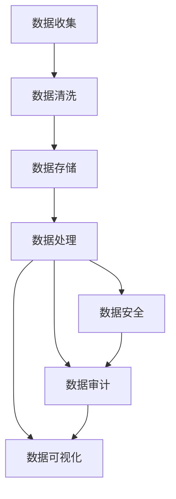
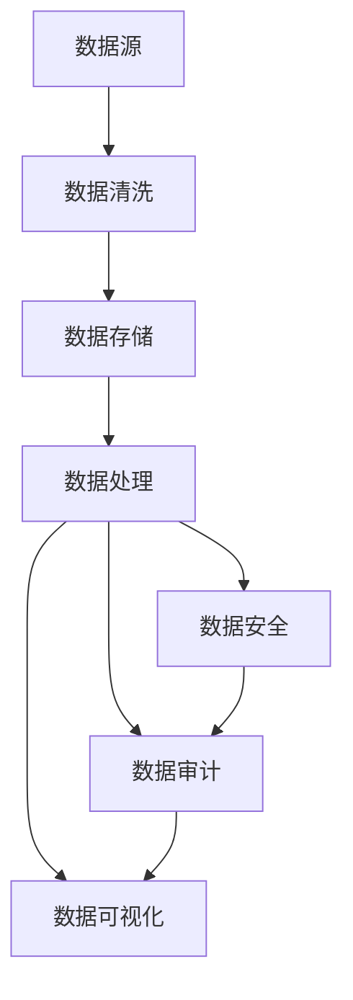

                 

# 人工智能创业数据管理的策略与措施解析

## 1. 背景介绍

### 1.1 问题由来

人工智能（AI）在各个行业中不断渗透，而数据则是AI技术的核心。在AI创业过程中，数据管理成为了技术实现和商业价值变现的重要环节。科学高效的数据管理策略，不仅能提升模型性能，还能推动AI业务的快速落地，在实际应用中发挥最大价值。

### 1.2 问题核心关键点

AI创业的数据管理涉及数据的收集、清洗、存储、处理等多个环节，需要综合考虑数据的安全性、可用性、实时性、多样性等要素，以满足实际业务需求。

- **数据的收集**：即从各类数据源中获取原始数据，并存储到相应的数据库中。
- **数据的清洗**：通过数据去重、缺失值处理、异常值检测等手段，提升数据质量。
- **数据的存储**：将清洗后的数据合理地组织和存储到数据库中，以便后续分析和应用。
- **数据的处理**：包括特征工程、模型训练、数据增强等，以获得更有价值的信息。
- **数据的管理**：涉及数据版本控制、权限管理、审计日志等，保障数据的安全性和可用性。

### 1.3 问题研究意义

科学高效的数据管理策略，对AI创业公司的成长至关重要。这不仅有助于提高数据处理效率，提升模型性能，还能降低开发成本，加速产品上线。因此，本文旨在全面解析AI创业数据管理的策略与措施，帮助创业者系统性地理解数据管理的全流程，在实际应用中做到心中有数。

## 2. 核心概念与联系

### 2.1 核心概念概述

在AI创业的数据管理过程中，涉及到的核心概念主要包括：

- **数据收集**：从不同渠道和格式的数据源中收集数据，包括静态数据、实时数据、用户行为数据等。
- **数据清洗**：对收集到的数据进行清洗、去重、异常值处理等，以提升数据质量。
- **数据存储**：采用数据库、数据湖等技术，将清洗后的数据存储和管理起来。
- **数据处理**：对数据进行特征工程、模型训练等，以提取数据中有用的信息。
- **数据安全**：通过数据加密、访问控制、数据备份等手段，保障数据安全。
- **数据审计**：对数据的访问、修改、删除等操作进行记录和审计，确保数据使用的合规性。
- **数据可视化**：采用BI工具对数据进行可视化展示，帮助决策者更好地理解数据。

### 2.2 概念间的关系

这些核心概念之间存在着紧密的联系，形成一个完整的数据管理生态系统。以下为具体的关系图：



在这个生态系统中，数据收集是源头，数据清洗是必经过程，数据存储和处理是关键环节，数据安全和审计是保障措施，数据可视化则是辅助决策的重要工具。

### 2.3 核心概念的整体架构

一个完整的数据管理架构，包括数据的收集、清洗、存储、处理、安全、审计和可视化等多个环节。以下是一个综合的流程图：



这个流程图展示了大数据管理的整体流程，即从数据源开始，经过清洗、存储、处理、安全、审计到可视化的全过程。

## 3. 核心算法原理 & 具体操作步骤

### 3.1 算法原理概述

AI创业中的数据管理，涉及到大数据处理、分布式计算、机器学习等多个领域的算法和技术。核心算法原理可以概述如下：

1. **数据收集算法**：选择合适的数据源，使用爬虫、API等方式收集数据。
2. **数据清洗算法**：去重、缺失值处理、异常值检测等。
3. **数据存储算法**：选择合适的数据库、数据湖技术，进行数据的组织和管理。
4. **数据处理算法**：特征工程、模型训练等。
5. **数据安全算法**：加密、访问控制、备份等。
6. **数据审计算法**：记录和审计数据的访问、修改、删除操作。
7. **数据可视化算法**：使用BI工具将数据进行可视化展示。

### 3.2 算法步骤详解

以**数据清洗算法**为例，详细讲解其操作步骤：

1. **数据收集**：使用爬虫或API获取原始数据。
2. **数据清洗**：
   - **去重**：通过唯一标识符，去除重复数据。
   - **缺失值处理**：填充或删除缺失值。
   - **异常值检测**：使用统计方法检测和处理异常值。
3. **数据清洗工具选择**：
   - **Python**：使用Pandas、NumPy等库进行数据处理。
   - **SQL**：使用SQL语言对数据库进行数据处理。
4. **数据清洗实践**：
   - **示例代码**：
     ```python
     import pandas as pd
     def clean_data(data):
         # 去重
         data = data.drop_duplicates()
         # 处理缺失值
         data = data.fillna(method='ffill')
         # 异常值检测
         data = data[(data['age'] > 0) & (data['age'] < 100)]
         return data
     ```

### 3.3 算法优缺点

数据清洗算法的优点在于，可以显著提升数据质量，减少噪声干扰，保证模型训练的准确性。但缺点在于，数据清洗过程可能耗费大量时间和计算资源，尤其是在大规模数据集上。

### 3.4 算法应用领域

数据清洗算法广泛应用于数据挖掘、机器学习、自然语言处理等多个领域，是保证数据质量的基础环节。

## 4. 数学模型和公式 & 详细讲解 & 举例说明

### 4.1 数学模型构建

在数据清洗过程中，常用的数学模型包括：

1. **数据去重模型**：使用哈希表、布隆过滤器等数据结构，快速去重。
2. **缺失值处理模型**：使用均值、中位数、众数等统计方法填充缺失值。
3. **异常值检测模型**：使用Z-score、IQR等统计指标检测异常值。

### 4.2 公式推导过程

以**数据去重模型**为例，推导其计算公式：

1. **哈希表去重**：
   - **公式**：`HashTable = {}`
   - **推导过程**：
     - 遍历数据集中的每个元素，将其哈希值作为键，出现次数作为值，记录到哈希表中。
     - 返回哈希表中出现次数大于1的键值对，即为重复元素。

2. **布隆过滤器去重**：
   - **公式**：`BloomFilter = {}`
   - **推导过程**：
     - 初始化布隆过滤器，将数据集中的元素依次插入布隆过滤器。
     - 返回布隆过滤器中出现次数大于1的元素，即为重复元素。

### 4.3 案例分析与讲解

**案例1**：使用哈希表去重

```python
from collections import Counter
def hash_table_deduplication(data):
    # 使用哈希表去重
    counts = Counter(data)
    return [k for k, v in counts.items() if v > 1]
```

**案例2**：使用布隆过滤器去重

```python
from bloomfilter import BloomFilter
def bloom_filter_deduplication(data):
    # 初始化布隆过滤器
    bf = BloomFilter()
    # 插入数据
    for item in data:
        bf.add(item)
    # 返回重复元素
    return [item for item in data if bf.contains(item)]
```

## 5. 项目实践：代码实例和详细解释说明

### 5.1 开发环境搭建

在进行数据清洗项目实践前，需要准备好开发环境。以下是使用Python进行数据清洗实践的开发环境配置流程：

1. 安装Python：下载并安装Python 3.8或更高版本。
2. 安装Pandas：`pip install pandas`。
3. 安装NumPy：`pip install numpy`。
4. 安装Scikit-learn：`pip install scikit-learn`。
5. 安装Matplotlib：`pip install matplotlib`。
6. 安装Seaborn：`pip install seaborn`。

### 5.2 源代码详细实现

以下是一个使用Python进行数据清洗的示例代码：

```python
import pandas as pd
import numpy as np

# 读取数据
df = pd.read_csv('data.csv')

# 数据清洗
# 去重
df = df.drop_duplicates()
# 处理缺失值
df = df.fillna(method='ffill')
# 异常值检测
df = df[(df['age'] > 0) & (df['age'] < 100)]

# 数据可视化
df.plot(kind='scatter', x='age', y='income')
```

### 5.3 代码解读与分析

1. **读取数据**：使用Pandas的`read_csv`方法读取CSV格式的数据。
2. **数据清洗**：
   - **去重**：使用`drop_duplicates`方法去重。
   - **处理缺失值**：使用`fillna`方法填充缺失值。
   - **异常值检测**：使用条件筛选去除异常值。
3. **数据可视化**：使用Matplotlib库绘制散点图，可视化数据分布。

### 5.4 运行结果展示

运行上述代码，得到数据清洗后的数据可视化结果：

```python
import matplotlib.pyplot as plt

# 读取数据
df = pd.read_csv('data.csv')

# 数据清洗
# 去重
df = df.drop_duplicates()
# 处理缺失值
df = df.fillna(method='ffill')
# 异常值检测
df = df[(df['age'] > 0) & (df['age'] < 100)]

# 数据可视化
df.plot(kind='scatter', x='age', y='income')
plt.show()
```

## 6. 实际应用场景

### 6.1 智能客服系统

在智能客服系统中，数据管理尤为重要。客服数据通常包含大量的用户对话记录和行为数据，需要进行清洗、去重、去噪声等处理。

### 6.2 金融风控系统

金融风控系统需要对用户数据进行严格的清洗和验证，确保数据的真实性和完整性，以便进行风险评估和决策。

### 6.3 电商推荐系统

电商推荐系统需要实时获取和处理用户行为数据，进行特征工程和模型训练，以提升推荐效果。

### 6.4 未来应用展望

未来，随着AI技术的不断成熟，数据管理将更加科学高效。大数据处理技术将进一步优化，智能数据清洗算法将大显身手，数据安全和隐私保护也将更加严密。

## 7. 工具和资源推荐

### 7.1 学习资源推荐

为了帮助开发者掌握数据管理的核心技能，以下推荐一些优质的学习资源：

1. **《数据科学入门》课程**：由Coursera提供，涵盖数据收集、数据清洗、数据可视化等多个方面，适合初学者入门。
2. **《Python数据科学手册》**：一本全面的Python数据科学教程，涵盖Pandas、NumPy、Scikit-learn等多个库的使用。
3. **《大数据技术与应用》课程**：由Udacity提供，涵盖大数据技术的基础和应用，适合进一步深入学习。
4. **《数据科学与机器学习》书籍**：一本介绍数据科学和机器学习方法的经典书籍，适合全面了解数据管理技术。
5. **《数据可视化实战》书籍**：一本实战性的数据可视化教程，使用Matplotlib和Seaborn库进行数据可视化实践。

### 7.2 开发工具推荐

高效的数据管理需要借助一系列优秀的工具。以下是几款常用的开发工具：

1. **Jupyter Notebook**：一个交互式的编程环境，支持Python、R等多种语言，适合数据处理和可视化。
2. **Dask**：一个并行计算库，支持大数据处理和分析。
3. **Apache Spark**：一个分布式计算框架，支持大规模数据处理。
4. **Airflow**：一个数据管治和调度平台，支持数据清洗、ETL等任务的自动化管理。
5. **AWS Data Lake**：亚马逊云服务的数据湖平台，支持大规模数据的存储和管理。

### 7.3 相关论文推荐

以下推荐一些涉及数据管理的经典论文：

1. **《数据挖掘算法与技术》**：一本介绍数据挖掘算法的经典书籍，涵盖数据清洗、数据挖掘等技术。
2. **《数据仓库技术》**：一本介绍数据仓库技术的书籍，涵盖数据存储、数据集成、数据查询等多个方面。
3. **《大数据技术与应用》**：一本介绍大数据技术的书籍，涵盖Hadoop、Spark等大数据处理工具。

## 8. 总结：未来发展趋势与挑战

### 8.1 总结

本文详细解析了AI创业中数据管理的策略与措施。数据管理作为AI创业的核心环节，对模型性能和业务价值至关重要。本文从数据收集、清洗、存储、处理、安全、审计等多个方面，全面介绍了数据管理的核心概念和操作步骤，并结合具体案例进行深入分析。

### 8.2 未来发展趋势

展望未来，数据管理技术将呈现以下几个发展趋势：

1. **自动化数据管理**：借助AI技术，实现数据清洗、处理和管理的自动化，大幅提高效率。
2. **数据质量提升**：通过引入机器学习、深度学习等技术，提升数据清洗和处理的精度和效果。
3. **数据隐私保护**：在数据管理过程中，严格遵守数据隐私法规，保护用户隐私。
4. **实时数据处理**：实时数据流处理技术将进一步成熟，支持实时数据清洗和处理。
5. **跨领域数据融合**：通过多模态数据融合，提升数据的全面性和丰富性，为AI应用提供更多信息。

### 8.3 面临的挑战

尽管数据管理技术不断进步，但在实际应用中，仍然面临以下挑战：

1. **数据质量保障**：如何确保数据的高质量、高可用性，是数据管理中的重要难题。
2. **数据安全和隐私**：如何在保障数据安全和隐私的同时，满足数据使用的需求。
3. **数据处理的资源消耗**：大规模数据处理需要大量的计算资源，如何优化数据处理算法，降低资源消耗，是实际应用中的关键问题。
4. **数据管理的标准化**：如何制定统一的数据管理标准，确保数据管理的规范性和可复用性。

### 8.4 研究展望

未来，数据管理技术将不断进步，并在实际应用中发挥更大的作用。研究者应从多个维度探索新的突破，如自动化数据管理、数据质量提升、数据隐私保护等。只有不断创新和优化，才能满足AI创业对数据管理的更高要求。

## 9. 附录：常见问题与解答

**Q1: 数据清洗的步骤是什么？**

A: 数据清洗通常包括以下步骤：
1. 去重：去除重复数据。
2. 处理缺失值：填补或删除缺失值。
3. 异常值检测：检测并处理异常值。
4. 数据格式化：统一数据格式，如日期格式转换。
5. 数据标准化：将数据标准化，如归一化、标准化等。

**Q2: 如何选择数据清洗工具？**

A: 数据清洗工具的选择应考虑以下因素：
1. 数据量大小：对于大规模数据集，应选择支持并行处理的工具。
2. 数据类型：不同类型的数据需要不同的处理方式。
3. 数据复杂度：复杂的数据清洗任务需要更强大的工具支持。
4. 数据源类型：不同数据源的数据格式可能不同，需要不同的工具处理。

**Q3: 如何优化数据管理策略？**

A: 优化数据管理策略的方法包括：
1. 引入自动化工具：使用自动化工具进行数据清洗、处理等，减少人工干预。
2. 引入机器学习：使用机器学习算法提升数据清洗和处理的精度和效果。
3. 数据标准化：对数据进行标准化，提高数据的一致性和可用性。
4. 数据可视化：使用数据可视化工具帮助分析数据质量，优化数据管理策略。

**Q4: 数据安全和隐私保护有哪些措施？**

A: 数据安全和隐私保护措施包括：
1. 数据加密：对数据进行加密，防止数据泄露。
2. 访问控制：对数据进行严格的访问控制，限制数据的使用权限。
3. 数据备份：定期备份数据，防止数据丢失。
4. 审计日志：记录数据的访问、修改、删除等操作，确保数据使用的合规性。
5. 数据匿名化：对数据进行匿名化处理，保护用户隐私。

**Q5: 如何提升数据管理效率？**

A: 提升数据管理效率的方法包括：
1. 自动化工具：使用自动化工具进行数据清洗、处理等，减少人工干预。
2. 并行处理：使用并行处理技术，提升数据处理的效率。
3. 数据标准化：对数据进行标准化，提高数据的一致性和可用性。
4. 数据预处理：使用数据预处理技术，提升数据处理的效率。
5. 数据缓存：对常用数据进行缓存，减少重复计算。

---

作者：禅与计算机程序设计艺术 / Zen and the Art of Computer Programming

