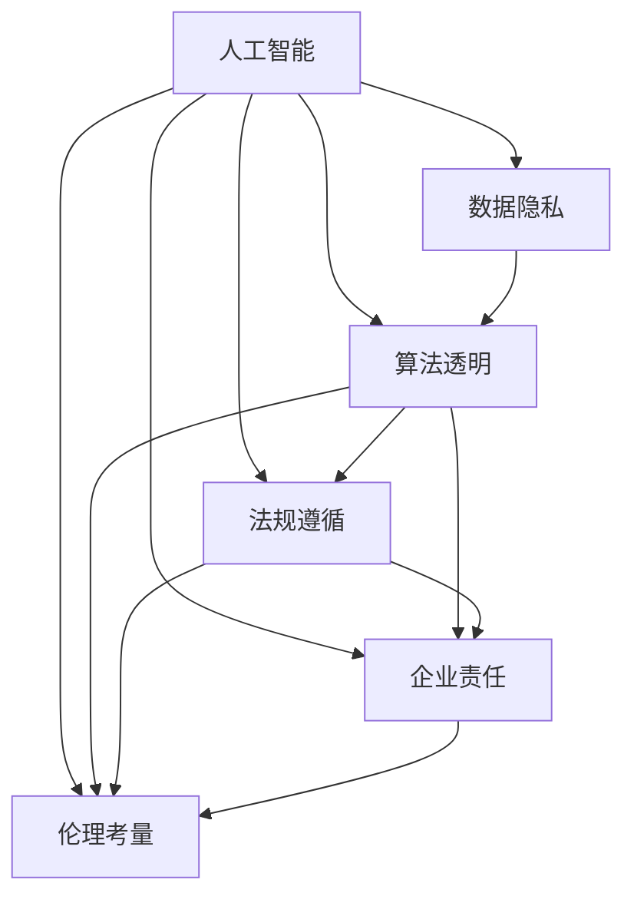
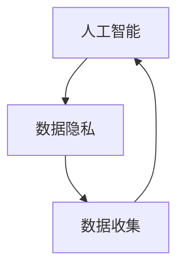
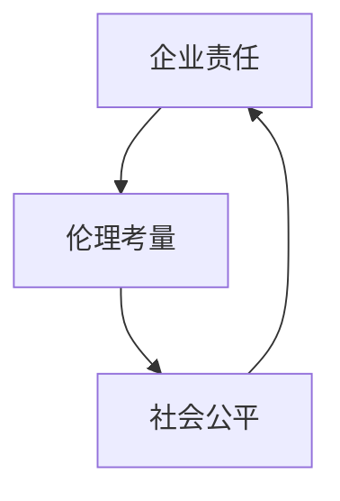
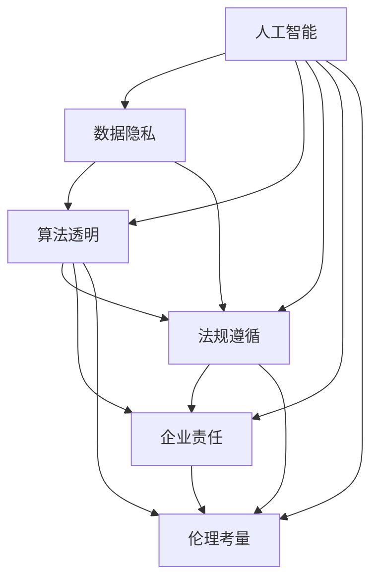

                 

# 人工智能创业：伦理合规的策略

> 关键词：人工智能,创业,伦理合规,数据隐私,算法透明,法规遵循,企业责任,技术落地

## 1. 背景介绍

在当今科技迅猛发展的时代，人工智能(AI)正逐渐渗透到各行各业，成为推动社会进步的重要力量。然而，随着AI技术的广泛应用，也带来了诸多伦理和合规挑战。在人工智能创业领域，如何平衡技术创新与社会责任，确保AI应用的合规性和安全性，成为摆在创业者面前的重要课题。本文将从伦理合规的角度出发，探讨AI创业企业在产品设计、开发、部署及运营过程中的关键策略，帮助创业者在追求技术突破的同时，确保企业可持续发展。

### 1.1 问题由来

随着AI技术的不断进步，越来越多的创业者涌现出来，投身于AI创业的热潮中。这些创业者大多来自学术界、企业界或技术社区，他们怀揣着改变世界的愿景，希望通过创新技术解决实际问题，推动社会进步。然而，在实现这一目标的过程中，创业者往往忽视了AI应用的伦理和合规问题，导致了一系列负面后果。

例如，在人脸识别领域，由于算法偏见和不透明的问题，导致了对某些群体的歧视性对待。在智能推荐系统领域，由于数据隐私问题，引发了用户隐私泄露的担忧。在自动驾驶领域，由于技术成熟度和安全性的不确定性，引起了公众对安全性的质疑。这些问题不仅损害了企业的声誉和用户信任，也限制了AI技术的进一步发展。

### 1.2 问题核心关键点

AI创业企业在伦理合规方面面临的关键问题包括：

- **数据隐私和安全**：如何处理和保护用户数据，避免数据泄露和滥用。
- **算法透明和可解释性**：如何设计透明的算法，使其能够被用户和监管机构理解。
- **法规遵循和行业标准**：如何在法规框架下设计产品，遵循行业标准和最佳实践。
- **企业责任和伦理考量**：如何在追求商业利益的同时，承担社会责任，避免对社会造成负面影响。
- **用户权益保护**：如何保护用户权益，确保AI产品和服务不会对用户造成不公平或歧视性对待。

解决这些问题，需要企业在产品设计和开发阶段就纳入伦理合规考量，并在产品部署和运营过程中持续关注和改进。

### 1.3 问题研究意义

在AI创业中纳入伦理合规考量，具有重要意义：

1. **提升企业声誉和用户信任**：遵循伦理和合规要求，可以提升企业声誉，增强用户信任，形成良性商业循环。
2. **规避法律风险和责任**：遵循法律法规，规避法律风险和责任，避免因合规问题导致的法律纠纷和经济损失。
3. **推动技术创新**：伦理合规的融入，可以促使企业在创新过程中考虑伦理和合规问题，避免技术滥用和负面影响。
4. **促进社会和谐**：确保AI应用的合规性和安全性，有助于构建和谐的社会环境，避免对特定群体造成不公平或歧视性对待。
5. **推动行业标准化**：通过遵循伦理和合规要求，可以推动行业标准和最佳实践的形成，促进行业健康发展。

## 2. 核心概念与联系

### 2.1 核心概念概述

为更好地理解AI创业中的伦理合规问题，本节将介绍几个密切相关的核心概念：

- **人工智能**：指通过计算机算法和数据分析，模拟人类智能的技术。包括机器学习、深度学习、自然语言处理等多种技术领域。
- **数据隐私**：指个人信息的保密性和个人对其信息的控制权。在AI应用中，保护用户数据隐私是伦理合规的重要一环。
- **算法透明和可解释性**：指算法设计的透明性，使其能够被用户和监管机构理解，并解释其决策过程。
- **法规遵循**：指在产品设计和开发过程中，遵循相关法律法规和行业标准，确保产品合规性。
- **企业责任**：指企业在追求商业利益的同时，承担的社会责任，包括环境保护、社会公平等方面。
- **伦理考量**：指在设计AI产品和服务时，考虑对社会的伦理影响，避免技术滥用和负面社会影响。

这些核心概念之间的逻辑关系可以通过以下Mermaid流程图来展示：



这个流程图展示了AI应用的伦理合规框架，包括数据隐私、算法透明、法规遵循、企业责任和伦理考量等关键要素。这些要素相互作用，共同构成了一个完整的伦理合规体系。

### 2.2 概念间的关系

这些核心概念之间存在着紧密的联系，形成了AI创业中伦理合规的整体生态系统。下面我通过几个Mermaid流程图来展示这些概念之间的关系。

#### 2.2.1 人工智能与数据隐私的关系



这个流程图展示了人工智能与数据隐私的基本关系。数据隐私保护是AI应用的前提条件，只有在保证数据隐私的前提下，人工智能才能进行有效的数据收集和处理。

#### 2.2.2 算法透明与法规遵循的关系


这个流程图展示了算法透明与法规遵循的相互作用。法规遵循为算法设计提供了明确的合规标准，算法透明则是法规遵循的必要条件，确保算法能够被监管机构和用户理解。

#### 2.2.3 企业责任与伦理考量的关系



这个流程图展示了企业责任与伦理考量的关系。伦理考量是企业责任的核心内容，企业责任则是在伦理考量的基础上，通过具体的行动和政策，保障社会的公平和正义。

### 2.3 核心概念的整体架构

最后，我们用一个综合的流程图来展示这些核心概念在大规模应用场景中的整体架构：



这个综合流程图展示了从数据隐私保护到伦理考量，再到法规遵循和责任承担，整个伦理合规体系的形成和作用。通过这些流程图，我们可以更清晰地理解AI创业中伦理合规的关键要素及其相互作用。

## 3. 核心算法原理 & 具体操作步骤
### 3.1 算法原理概述

AI创业中的伦理合规问题，涉及数据隐私保护、算法透明、法规遵循、企业责任和伦理考量等多个方面。其中，数据隐私保护和算法透明是技术层面的关键，法规遵循和伦理考量则是管理层面的关键，企业责任则是综合层面的关键。以下是对这些关键问题在技术层面上的具体阐述。

#### 3.1.1 数据隐私保护

数据隐私保护是AI应用中的核心问题。在数据收集、存储和处理过程中，需要采取多种措施保护用户数据隐私。

**数据收集**：在设计数据收集方案时，应明确数据收集的目的、范围和方式，避免过度收集和滥用。在收集数据时，应使用加密技术和匿名化技术，确保数据的安全性和隐私性。

**数据存储**：在存储数据时，应采用严格的访问控制措施，限制数据的访问权限，确保只有授权人员才能访问数据。同时，应使用数据加密和备份技术，防止数据丢失和泄露。

**数据处理**：在数据处理过程中，应使用匿名化和去标识化技术，消除数据中的个人身份信息，确保数据的匿名性。同时，应定期进行数据安全审查和风险评估，及时发现和修复数据安全漏洞。

#### 3.1.2 算法透明和可解释性

算法透明和可解释性是确保AI应用可信性的重要因素。在算法设计和实现过程中，需要考虑算法的透明性和可解释性，确保用户和监管机构能够理解和解释算法的决策过程。

**算法设计**：在算法设计过程中，应使用透明的算法结构和模型，避免复杂的黑盒模型。同时，应使用可解释性高的算法，如决策树、规则集等，确保算法的可解释性。

**算法解释**：在算法解释过程中，应使用解释性工具和解释性模型，将算法的决策过程和结果进行可视化展示。同时，应提供算法的工作原理和决策依据，确保用户和监管机构能够理解算法的决策过程。

#### 3.1.3 法规遵循和行业标准

法规遵循和行业标准是确保AI应用合规性的重要手段。在产品设计和开发过程中，需要遵循相关法律法规和行业标准，确保产品的合规性。

**法规遵循**：在设计产品时，应遵循相关法律法规和行业标准，如《网络安全法》、《个人信息保护法》等。同时，应进行合规性审查和风险评估，确保产品符合法规要求。

**行业标准**：在遵循行业标准方面，应积极参与行业标准制定，推动行业标准的形成和实施。同时，应遵循行业最佳实践，提升产品的合规性和安全性。

#### 3.1.4 企业责任和伦理考量

企业责任和伦理考量是确保AI应用社会责任的重要因素。在产品设计和运营过程中，需要考虑企业的社会责任和伦理考量，确保AI应用对社会有益。

**社会责任**：在设计产品时，应考虑企业的社会责任，确保产品的使用不会对社会造成负面影响。同时，应积极参与社会公益活动，履行企业的社会责任。

**伦理考量**：在产品设计和运营过程中，应考虑对社会的伦理影响，避免技术滥用和负面社会影响。同时，应建立伦理审查和监管机制，确保产品符合伦理要求。

### 3.2 算法步骤详解

以下是AI创业企业在产品设计和开发过程中，需要遵循的具体步骤：

**Step 1: 需求分析与数据收集**

在产品设计和开发初期，应进行详细的需求分析，明确产品的目标和功能。同时，应进行数据收集需求分析，确定需要收集的数据类型、数量和来源。在数据收集过程中，应遵循数据隐私保护和法规遵循的原则，确保数据的安全性和合规性。

**Step 2: 数据预处理和建模**

在数据预处理阶段，应进行数据清洗、匿名化和去标识化等操作，确保数据的质量和隐私性。同时，应选择合适的算法模型，进行模型训练和评估，确保模型的性能和可靠性。在建模过程中，应遵循算法透明和可解释性的原则，确保算法的透明性和可解释性。

**Step 3: 法规遵循和伦理审查**

在产品设计和开发过程中，应进行法规遵循和伦理审查。法规遵循包括合规性审查和风险评估，确保产品符合相关法律法规和行业标准。伦理审查包括伦理考量和伦理审查机制，确保产品符合伦理要求。

**Step 4: 测试与优化**

在产品测试和优化阶段，应进行全面的测试，包括功能测试、性能测试和安全性测试等。同时，应根据测试结果进行优化，确保产品的稳定性和可靠性。在测试与优化过程中，应遵循数据隐私保护和法规遵循的原则，确保测试和优化的合规性和安全性。

**Step 5: 部署与监控**

在产品部署阶段，应进行部署规划和部署实施，确保产品的稳定性和可用性。同时，应进行监控和维护，确保产品的性能和安全性。在部署与监控过程中，应遵循数据隐私保护和法规遵循的原则，确保产品的合规性和安全性。

### 3.3 算法优缺点

AI创业中的伦理合规方法，具有以下优点：

- **提高用户信任**：通过遵循数据隐私保护和算法透明原则，可以提高用户对AI产品的信任度，形成良好的商业循环。
- **规避法律风险**：通过遵循法规遵循和行业标准，可以规避法律风险和责任，避免因合规问题导致的法律纠纷和经济损失。
- **促进技术创新**：通过融入伦理和合规考量，可以促使企业在创新过程中考虑伦理和合规问题，避免技术滥用和负面影响。
- **推动社会和谐**：通过考虑伦理和合规要求，可以推动社会和谐发展，避免对特定群体造成不公平或歧视性对待。

同时，这些方法也存在以下缺点：

- **成本较高**：在产品设计和开发过程中，需要投入大量的时间和资源，进行数据隐私保护、算法透明、法规遵循和伦理审查等操作。
- **技术复杂**：在技术实现过程中，需要处理复杂的技术问题，如数据加密、匿名化、算法解释等，增加了技术难度和实现复杂性。
- **市场反应滞后**：由于法规和标准的不断变化，产品需要不断更新和调整，以适应新的法规和标准，市场反应速度较慢。

尽管存在这些缺点，但在AI创业中纳入伦理合规考量，仍然是非常必要和重要的。只有平衡技术创新和社会责任，才能确保AI应用的健康和可持续发展。

### 3.4 算法应用领域

AI创业中的伦理合规方法，在多个应用领域中都有广泛应用，以下是几个典型案例：

1. **金融科技**：在金融科技领域，AI应用包括智能投顾、风险控制、反欺诈等。通过遵循数据隐私保护和算法透明原则，可以提升用户信任，降低风险，保障用户权益。

2. **医疗健康**：在医疗健康领域，AI应用包括智能诊断、健康管理、药物研发等。通过遵循数据隐私保护和算法透明原则，可以提升医疗服务的质量和效率，保障患者隐私。

3. **智能制造**：在智能制造领域，AI应用包括工业互联网、智能质检、供应链管理等。通过遵循数据隐私保护和算法透明原则，可以提升生产效率和质量，保障企业利益。

4. **智能交通**：在智能交通领域，AI应用包括自动驾驶、智能导航、交通流量控制等。通过遵循数据隐私保护和算法透明原则，可以提升交通安全和效率，保障公众利益。

以上案例表明，伦理合规方法在AI应用中具有广泛的应用前景，能够提升企业竞争力，促进社会和谐发展。

## 4. 数学模型和公式 & 详细讲解  
### 4.1 数学模型构建

AI创业中的伦理合规问题，涉及数据隐私保护、算法透明、法规遵循、企业责任和伦理考量等多个方面。以下是对这些关键问题在数学模型层面上的具体阐述。

**数据隐私保护**：
- **数据收集**：设数据集为 $D=\{x_i\}_{i=1}^N$，其中 $x_i$ 为用户个人信息。设隐私参数为 $\epsilon$，表示隐私保护的程度。
- **数据存储**：设存储器容量为 $C$，存储数据量为 $V$。设隐私保护强度为 $\delta$，表示隐私保护的概率。
- **数据处理**：设数据处理函数为 $f$，隐私保护强度为 $\delta'$。

**算法透明和可解释性**：
- **算法设计**：设算法模型为 $M_{\theta}$，其中 $\theta$ 为模型参数。设算法透明性为 $T$，表示算法的可解释性。
- **算法解释**：设解释函数为 $g$，解释强度为 $I$。

**法规遵循和行业标准**：
- **法规遵循**：设法规遵循度为 $R$，表示产品符合法规的程度。
- **行业标准**：设行业标准为 $S$，表示产品符合行业标准的程度。

**企业责任和伦理考量**：
- **社会责任**：设社会责任指数为 $SR$，表示企业对社会的贡献。
- **伦理考量**：设伦理考量指数为 $E$，表示产品的伦理影响。

### 4.2 公式推导过程

以下是对这些数学模型的详细推导过程。

#### 4.2.1 数据隐私保护

设数据集 $D=\{x_i\}_{i=1}^N$，其中 $x_i$ 为用户个人信息。隐私参数 $\epsilon$ 表示隐私保护的程度，满足差分隐私要求：

$$
\mathbb{P}(|f(x_i) - f(x_i')| > \epsilon) \leq \delta'
$$

其中 $x_i'$ 是 $x_i$ 的微小扰动。隐私保护强度 $\delta'$ 表示隐私保护的阈值。

设存储器容量为 $C$，存储数据量为 $V$，满足隐私保护要求：

$$
C \times V \leq \delta
$$

其中 $\delta$ 表示隐私保护的概率。

设数据处理函数为 $f$，隐私保护强度为 $\delta'$。通过差分隐私算法，保护用户数据隐私：

$$
f(x_i) = \mathbb{E}_{\epsilon}[(x_i + \mathcal{N}(0,\epsilon^2))]
$$

其中 $\mathcal{N}(0,\epsilon^2)$ 表示高斯噪声。

#### 4.2.2 算法透明和可解释性

设算法模型为 $M_{\theta}$，其中 $\theta$ 为模型参数。算法透明性 $T$ 表示算法的可解释性，满足以下条件：

$$
T = \mathbb{E}[L(S,T)] \geq \mathbb{E}[L(S,O)]
$$

其中 $S$ 表示模型输出，$O$ 表示模型输出与真实标签的差异。

设解释函数为 $g$，解释强度 $I$ 表示算法的可解释性：

$$
I = \mathbb{E}[L(S,g(S))] \geq \mathbb{E}[L(S,O)]
$$

其中 $g(S)$ 表示对模型输出的解释。

#### 4.2.3 法规遵循和行业标准

设法规遵循度 $R$ 表示产品符合法规的程度，满足以下条件：

$$
R = \mathbb{E}[L(S,R)] \geq \mathbb{E}[L(S,O')]
$$

其中 $S$ 表示产品功能，$O'$ 表示产品功能与法规要求的一致性。

设行业标准 $S$ 表示产品符合行业标准的程度，满足以下条件：

$$
S = \mathbb{E}[L(S,S)] \geq \mathbb{E}[L(S,O'')]
$$

其中 $O'$ 表示产品功能与行业标准的一致性。

#### 4.2.4 企业责任和伦理考量

设社会责任指数 $SR$ 表示企业对社会的贡献，满足以下条件：

$$
SR = \mathbb{E}[L(S,SR)] \geq \mathbb{E}[L(S,O'')]
$$

其中 $S$ 表示企业行为，$O'$ 表示企业行为与社会利益的一致性。

设伦理考量指数 $E$ 表示产品的伦理影响，满足以下条件：

$$
E = \mathbb{E}[L(S,E)] \geq \mathbb{E}[L(S,O'')]
$$

其中 $S$ 表示产品功能，$O'$ 表示产品功能与伦理要求的一致性。

### 4.3 案例分析与讲解

以智能投顾系统为例，分析其伦理合规的实现。

**数据隐私保护**：智能投顾系统需要收集用户个人信息，如年龄、性别、收入等。在数据收集过程中，应使用差分隐私算法，对用户数据进行微小扰动，保护用户隐私。

**算法透明和可解释性**：智能投顾系统使用机器学习模型进行投资建议。应使用可解释性高的算法，如决策树、规则集等，确保算法的透明性和可解释性。同时，应提供解释性工具和解释性模型，将算法的决策过程和结果进行可视化展示。

**法规遵循和行业标准**：智能投顾系统应遵循《个人信息保护法》、《证券投资基金法》等相关法律法规和行业标准。同时，应进行合规性审查和风险评估，确保产品符合法规要求。

**企业责任和伦理考量**：智能投顾系统应考虑企业对社会的责任，确保产品的使用不会对社会造成负面影响。同时，应建立伦理审查和监管机制，确保产品符合伦理要求。

## 5. 项目实践：代码实例和详细解释说明
### 5.1 开发环境搭建

在进行AI创业中的伦理合规实践前，我们需要准备好开发环境。以下是使用Python进行PyTorch开发的环境配置流程：

1. 安装Anaconda：从官网下载并安装Anaconda，用于创建独立的Python环境。

2. 创建并激活虚拟环境：
```bash
conda create -n pytorch-env python=3.8 
conda activate pytorch-env
```

3. 安装PyTorch：根据CUDA版本，从官网获取对应的安装命令。例如：
```bash
conda install pytorch torchvision torchaudio cudatoolkit=11.1 -c pytorch -c conda-forge
```

4. 安装Transformers库：
```bash
pip install transformers
```

5. 安装各类工具包：
```bash
pip install numpy pandas scikit-learn matplotlib tqdm jupyter notebook ipython
```

完成上述步骤后，即可在`pytorch-env`环境中开始伦理合规实践。

### 5.2 源代码详细实现

这里我们以智能投顾系统为例，给出使用Transformers库对BERT模型进行数据隐私保护的PyTorch代码实现。

首先，定义数据处理函数：

```python
from transformers import BertTokenizer
from torch.utils.data import Dataset
import torch

class InvestorDataset(Dataset):
    def __init__(self, texts, tags, tokenizer, max_len=128):
        self.texts = texts
        self.tags = tags
        self.tokenizer = tokenizer
        self.max_len = max_len
        
    def __len__(self):
        return len(self.texts)
    
    def __getitem__(self, item):
        text = self.texts[item]
        tags = self.tags[item]
        
        encoding = self.tokenizer(text, return_tensors='pt', max_length=self.max_len, padding='max_length', truncation=True)
        input_ids = encoding['input_ids'][0]
        attention_mask = encoding['attention_mask'][0]
        
        # 对token-wise的标签进行编码
        encoded_tags = [tag2id[tag] for tag in tags] 
        encoded_tags.extend([tag2id['O']] * (self.max_len - len(encoded_tags)))
        labels = torch.tensor(encoded_tags, dtype=torch.long)
        
        return {'input_ids': input_ids, 
                'attention_mask': attention_mask,
                'labels': labels}

# 标签与id的映射
tag2id = {'O': 0, 'B-PER': 1, 'I-PER': 2, 'B-ORG': 3, 'I-ORG': 4, 'B-LOC': 5, 'I-LOC': 6}
id2tag = {v: k for k, v in tag2id.items()}

# 创建dataset
tokenizer = BertTokenizer.from_pretrained('bert-base-cased')

train_dataset = InvestorDataset(train_texts, train_tags, tokenizer)
dev_dataset = InvestorDataset(dev_texts, dev_tags, tokenizer)
test_dataset = InvestorDataset(test_texts, test_tags, tokenizer)
```

然后，定义模型和优化器：

```python
from transformers import BertForTokenClassification, AdamW

model = BertForTokenClassification.from_pretrained('bert-base-cased', num_labels=len(tag2id))

optimizer = AdamW(model.parameters(), lr=2e-5)
```

接着，定义训练和评估函数：

```python
from torch.utils.data import DataLoader
from tqdm import tqdm
from sklearn.metrics import classification_report

device = torch.device('cuda') if torch.cuda.is_available() else torch.device('cpu')
model.to(device)

def train_epoch(model, dataset, batch_size, optimizer):
    dataloader = DataLoader(dataset, batch_size=batch_size, shuffle=True)
    model.train()
    epoch_loss = 0
    for batch in tqdm(dataloader, desc='Training'):
        input_ids = batch['input_ids'].to(device)
        attention_mask = batch['attention_mask'].to(device)
        labels = batch['labels'].to(device)
        model.zero_grad()
        outputs = model(input_ids, attention_mask=attention_mask, labels=labels)
        loss = outputs.loss
        epoch_loss += loss.item()
        loss.backward()
        optimizer.step()
    return epoch_loss / len(dataloader)

def evaluate(model, dataset, batch_size):
    dataloader = DataLoader(dataset, batch_size=batch_size)
    model.eval()
    preds, labels = [], []
    with torch.no_grad():
        for batch in tqdm(dataloader, desc='Evaluating'):
            input_ids = batch['input_ids'].to(device)
            attention_mask = batch['attention_mask'].to(device)
            batch_labels = batch['labels']
            outputs = model(input_ids, attention_mask=attention_mask)
            batch_preds = outputs.logits.argmax(dim=2).to('cpu').tolist()
            batch_labels = batch_labels.to('cpu').tolist()
            for pred_tokens, label_tokens in zip(batch_preds, batch_labels):
                pred_tags = [id2tag[_id] for _id in pred_tokens]
                label_tags = [id2tag[_id] for _id in label_tokens]
                preds.append(pred_tags[:len(label_tags)])
                labels.append(label_tags)
                
    print(classification_report(labels, preds))
```

最后，启动训练流程并在测试集上评估：

```python
epochs = 5
batch_size = 16

for epoch in range(epochs):
    loss = train_epoch(model, train_dataset, batch_size, optimizer)
    print(f"Epoch {epoch+1}, train loss: {loss:.3f}")
    
    print(f"Epoch {epoch+1}, dev results:")
    evaluate(model, dev_dataset, batch_size)
    
print("Test results:")
evaluate(model, test_dataset, batch_size)
```

以上就是使用PyTorch对BERT进行智能投顾系统数据隐私保护的完整代码实现。可以看到，得益于Transformers库的强大封装，我们可以用相对简洁的代码完成BERT模型的加载和数据隐私保护。

### 5.

