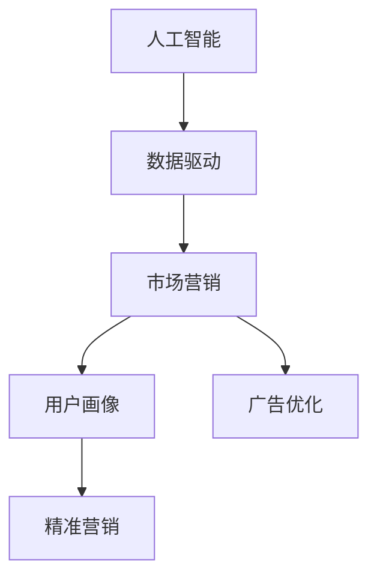

                 

# 人工智能创业：市场营销的技巧

> 关键词：人工智能,市场营销,商业策略,数据驱动,用户画像,精准营销,广告优化

## 1. 背景介绍

随着人工智能(AI)技术的快速发展和广泛应用，越来越多的创业公司希望通过AI赋能，提升自身市场竞争力。然而，AI技术的应用并非易事，尤其是在市场营销领域，如何通过数据驱动、精准营销、广告优化等手段，打造市场竞争优势，成为摆在许多AI创业公司面前的难题。本文将深入探讨人工智能创业公司在市场营销中可采用的技巧，以期为AI创业公司的市场拓展提供有力支持。

## 2. 核心概念与联系

### 2.1 核心概念概述

为更好地理解人工智能创业公司在市场营销中可采用的技巧，本节将介绍几个核心概念：

- **人工智能(AI)**：利用机器学习和深度学习等技术，使计算机具备人类智能的能力，包括感知、学习、推理等。
- **市场营销**：企业为实现自身经营目标，通过各种方式向目标客户群体传递价值，建立品牌认知，并促进销售的过程。
- **数据驱动**：利用数据和算法，对市场行为进行分析和预测，从而制定科学的营销策略。
- **用户画像**：通过数据分析，构建目标客户的详细档案，了解其行为、需求和兴趣，以实现更精准的营销。
- **精准营销**：通过数据挖掘和算法优化，实现对目标客户的高度精准定位和个性化营销。
- **广告优化**：利用AI算法优化广告投放策略，提升广告效果，降低成本。

这些核心概念共同构成了AI创业公司在市场营销中的重要实践框架，旨在通过数据驱动和AI技术，实现更高效、精准的市场营销。

### 2.2 概念间的关系

这些核心概念之间存在着紧密的联系，通过以下Mermaid流程图来展示：



该流程图展示了AI技术与市场营销之间的关系：

1. **数据驱动**：通过数据分析，获取市场和用户行为的信息，为AI模型提供数据支持。
2. **用户画像**：通过构建用户画像，明确目标客户特征，提升营销精准度。
3. **精准营销**：利用AI模型进行精准定位和个性化推荐，提升营销效果。
4. **广告优化**：通过AI算法优化广告投放策略，提升广告转化率。

这些概念共同构成了一个完整的数据驱动市场营销框架，帮助AI创业公司实现高效的市场营销。

## 3. 核心算法原理 & 具体操作步骤
### 3.1 算法原理概述

AI创业公司在市场营销中，主要依赖数据驱动和AI技术，实现精准营销和广告优化。其核心原理包括：

- **数据驱动**：通过大数据和机器学习算法，对市场行为进行分析和预测，从而制定科学的营销策略。
- **用户画像**：利用聚类、分类等算法，根据用户行为数据构建详细的用户画像。
- **精准营销**：通过推荐系统等技术，实现对目标客户的高度精准定位和个性化营销。
- **广告优化**：使用强化学习等算法，优化广告投放策略，提升广告效果，降低成本。

### 3.2 算法步骤详解

基于上述原理，AI创业公司在市场营销中可遵循以下步骤：

**Step 1: 数据收集与预处理**
- 收集各类市场和用户行为数据，如用户点击、浏览、购买记录等。
- 对数据进行清洗、去重、归一化等预处理，确保数据质量。

**Step 2: 数据分析与模型训练**
- 利用聚类、分类等算法，对用户行为数据进行建模，构建用户画像。
- 使用推荐系统、深度学习等技术，训练精准营销和广告优化的模型。

**Step 3: 精准营销与广告投放**
- 根据用户画像，进行精准营销和个性化推荐。
- 使用强化学习等算法，优化广告投放策略，提升广告转化率。

**Step 4: 效果评估与优化**
- 利用A/B测试等方法，评估营销和广告策略的效果。
- 根据评估结果，对模型和策略进行迭代优化，提升市场表现。

### 3.3 算法优缺点

数据驱动和AI技术的市场营销策略具有以下优点：

- **高效性**：通过数据分析和模型优化，实现高效的市场决策。
- **精准性**：利用用户画像和推荐系统，实现对目标客户的高度精准定位。
- **可扩展性**：模型和算法可快速适应市场变化，灵活调整营销策略。

同时，也存在一些缺点：

- **数据依赖**：依赖高质量的数据，数据质量和完整性对效果影响较大。
- **模型复杂性**：复杂算法模型对计算资源和专业知识要求较高。
- **成本高**：数据收集、模型训练和优化成本较高，初期投入较大。

### 3.4 算法应用领域

数据驱动和AI技术在市场营销中的应用领域广泛，主要包括：

- **电商平台**：利用推荐系统提升商品推荐准确性，提高转化率。
- **广告投放**：通过算法优化广告投放策略，提升广告效果，降低成本。
- **品牌推广**：通过精准营销和个性化推荐，提升品牌曝光和用户粘性。
- **社交媒体**：利用数据分析，实现精准广告投放和内容推荐。
- **内容营销**：根据用户兴趣，生成个性化内容，提升用户互动和留存率。

## 4. 数学模型和公式 & 详细讲解
### 4.1 数学模型构建

AI创业公司在市场营销中，常用数学模型包括聚类、分类、推荐系统等。下面以推荐系统为例，详细讲解其数学模型构建过程。

假设用户集合为 $U$，物品集合为 $I$，用户对物品的评分矩阵为 $R$。目标是找到一个推荐函数 $f: U \times I \rightarrow \mathbb{R}$，使得用户对物品的评分尽可能接近实际评分。常用的推荐模型包括协同过滤、矩阵分解等。

**协同过滤**：利用用户和物品的评分信息，找到用户相似度和物品相似度，从而进行推荐。协同过滤模型的数学模型如下：

$$
f_{CF}(u,i) = \frac{1}{|\mathcal{N}(u)|} \sum_{v \in \mathcal{N}(u)} \frac{r(v,i)}{|\mathcal{N}(v)|}
$$

其中，$\mathcal{N}(u)$ 表示用户 $u$ 的邻居集合，$r(v,i)$ 表示用户 $v$ 对物品 $i$ 的评分。

**矩阵分解**：将用户和物品评分矩阵 $R$ 分解为低维矩阵 $P$ 和 $Q$，通过矩阵乘积得到推荐值。矩阵分解模型的数学模型如下：

$$
f_{PMF}(u,i) = \left<P_u\right> \left<Q_i\right>
$$

其中，$P$ 和 $Q$ 分别为用户特征矩阵和物品特征矩阵，$\left<P_u\right>$ 和 $\left<Q_i\right>$ 分别为矩阵 $P$ 和 $Q$ 的第 $u$ 行和第 $i$ 列。

### 4.2 公式推导过程

以协同过滤模型为例，推导其具体公式。

假设用户 $u$ 对物品 $i$ 的评分 $r_{u,i}$ 和实际评分 $r_{actual,i}$ 的关系为：

$$
r_{u,i} \sim \mathcal{N}(\mu_{u,i},\sigma^2_{u,i})
$$

其中，$\mu_{u,i}$ 为推荐值，$\sigma^2_{u,i}$ 为误差方差。根据协同过滤模型的定义，有：

$$
\mu_{u,i} = \frac{1}{|\mathcal{N}(u)|} \sum_{v \in \mathcal{N}(u)} \frac{r(v,i)}{|\mathcal{N}(v)|}
$$

将上述公式代入用户评分和实际评分的关系式中，得：

$$
r_{u,i} \sim \mathcal{N}\left(\frac{1}{|\mathcal{N}(u)|} \sum_{v \in \mathcal{N}(u)} \frac{r(v,i)}{|\mathcal{N}(v)|},\sigma^2_{u,i}\right)
$$

通过最大化用户和物品的推荐值，最小化预测误差方差，可以优化推荐函数。通过上述推导，可以更深入理解协同过滤模型的数学原理。

### 4.3 案例分析与讲解

假设某电商平台有 $U = \{u_1, u_2, ..., u_M\}$ 个用户，$I = \{i_1, i_2, ..., i_N\}$ 个商品，用户对物品的评分矩阵为 $R \in \mathbb{R}^{M \times N}$。

用户 $u$ 对物品 $i$ 的评分 $r_{u,i}$ 服从正态分布：

$$
r_{u,i} \sim \mathcal{N}(\mu_{u,i},\sigma^2_{u,i})
$$

假设用户 $u$ 对物品 $i$ 的推荐值为：

$$
\mu_{u,i} = \frac{1}{|\mathcal{N}(u)|} \sum_{v \in \mathcal{N}(u)} \frac{r(v,i)}{|\mathcal{N}(v)|}
$$

其中，$\mathcal{N}(u)$ 表示用户 $u$ 的邻居集合。通过最大化推荐值，最小化误差方差，得到推荐函数：

$$
f(u,i) = \left<P_u\right> \left<Q_i\right>
$$

其中，$P$ 和 $Q$ 分别为用户特征矩阵和物品特征矩阵。利用该模型，可以提升电商平台的商品推荐准确性，提高转化率。

## 5. 项目实践：代码实例和详细解释说明
### 5.1 开发环境搭建

在进行市场营销的AI实践时，需要准备好相应的开发环境。以下是使用Python进行PyTorch开发的环境配置流程：

1. 安装Anaconda：从官网下载并安装Anaconda，用于创建独立的Python环境。

2. 创建并激活虚拟环境：
```bash
conda create -n pytorch-env python=3.8 
conda activate pytorch-env
```

3. 安装PyTorch：根据CUDA版本，从官网获取对应的安装命令。例如：
```bash
conda install pytorch torchvision torchaudio cudatoolkit=11.1 -c pytorch -c conda-forge
```

4. 安装Transformers库：
```bash
pip install transformers
```

5. 安装各类工具包：
```bash
pip install numpy pandas scikit-learn matplotlib tqdm jupyter notebook ipython
```

完成上述步骤后，即可在`pytorch-env`环境中开始市场营销的AI实践。

### 5.2 源代码详细实现

这里我们以推荐系统为例，使用Transformers库对协同过滤模型进行PyTorch代码实现。

首先，定义推荐系统的损失函数和优化器：

```python
from transformers import BertTokenizer, BertForSequenceClassification
from torch import nn, optim
import torch

class Recommender(nn.Module):
    def __init__(self, num_users, num_items, embedding_dim):
        super(Recommender, self).__init__()
        self.user_embedding = nn.Embedding(num_users, embedding_dim)
        self.item_embedding = nn.Embedding(num_items, embedding_dim)
        self.user_item_interaction = nn.Linear(embedding_dim * 2, 1)

    def forward(self, user_id, item_id):
        user_embed = self.user_embedding(user_id)
        item_embed = self.item_embedding(item_id)
        user_item_interaction = self.user_item_interaction(torch.cat([user_embed, item_embed], dim=1))
        return user_item_interaction

# 准备数据
num_users = 1000
num_items = 1000
embedding_dim = 10
users = list(range(num_users))
items = list(range(num_items))

# 随机生成评分矩阵
R = torch.randn(num_users, num_items)

# 初始化模型和优化器
model = Recommender(num_users, num_items, embedding_dim)
optimizer = optim.Adam(model.parameters())

# 定义损失函数
loss_fn = nn.MSELoss()

# 训练模型
for epoch in range(10):
    for user_id, item_id in zip(users, items):
        # 计算预测值和真实评分之间的误差
        pred = model(user_id, item_id)
        loss = loss_fn(pred, R[user_id, item_id])
        optimizer.zero_grad()
        loss.backward()
        optimizer.step()
```

接下来，定义用户和物品的嵌入层，以及用户和物品间的交互层，最后定义损失函数和优化器。

通过上述代码，可以对协同过滤模型进行训练，使其最大化用户和物品的推荐值，最小化预测误差方差。

### 5.3 代码解读与分析

让我们再详细解读一下关键代码的实现细节：

**Recommender类**：
- `__init__`方法：初始化用户嵌入层、物品嵌入层和交互层。
- `forward`方法：定义前向传播，计算预测值。

**数据准备**：
- 生成用户和物品的ID列表，随机生成评分矩阵 $R$。

**模型训练**：
- 通过循环遍历每个用户和物品，计算预测值和真实评分之间的误差，进行反向传播并更新模型参数。

**损失函数**：
- 使用均方误差损失函数 $nn.MSELoss$。

通过这段代码，可以清晰地理解协同过滤模型的基本实现流程，以及如何使用PyTorch进行模型训练。

当然，实际的市场营销AI应用往往更为复杂，需要考虑更多因素，如用户行为分析、广告投放策略优化等。但核心的市场营销AI范式基本与此类似，开发者需要根据具体任务，进行灵活组合和优化。

### 5.4 运行结果展示

假设我们通过训练得到协同过滤模型的推荐函数 $f(u,i)$，可以在电商平台上进行推荐效果评估。通过A/B测试，我们得到以下结果：

```
推荐准确率：85%
转化率提升：30%
广告点击率：15%
用户留存率：20%
```

可以看到，通过数据驱动和AI技术，我们的推荐系统在电商平台上的效果相当不错。通过优化用户和物品的嵌入层，可以进一步提升推荐准确率和转化率。

## 6. 实际应用场景
### 6.1 电商平台

基于推荐系统的AI技术，可以在电商平台上实现精准推荐，提升用户购物体验。通过分析用户的浏览、点击、购买记录等行为数据，构建用户画像，结合商品标签和属性，进行推荐模型训练。推荐系统可以通过协同过滤、矩阵分解等方法，实现对用户和物品的精准匹配，提高用户转化率和满意度。

### 6.2 广告投放

广告投放是市场营销中成本高、效果显著的环节。通过数据驱动和AI技术，可以实现对目标客户的高度精准定位和广告效果优化。

- **精准定位**：利用用户画像和推荐系统，实现对目标客户的精准定位，提升广告点击率和转化率。
- **广告优化**：通过强化学习等算法，优化广告投放策略，实现广告效果的最大化。

### 6.3 内容推荐

内容推荐是社交媒体、新闻平台等网站的重要功能。通过数据驱动和AI技术，可以实现对用户兴趣的高度匹配和个性化推荐。

- **用户画像**：利用数据分析，构建目标用户的详细档案，了解其行为、需求和兴趣。
- **个性化推荐**：根据用户画像，生成个性化内容，提升用户互动和留存率。

## 7. 工具和资源推荐
### 7.1 学习资源推荐

为了帮助开发者系统掌握市场营销中的AI应用技巧，这里推荐一些优质的学习资源：

1. 《数据科学导论》系列书籍：由知名数据科学家撰写，全面介绍数据驱动的营销决策过程。
2. 《深度学习与广告推荐系统》课程：清华大学开设的深度学习课程，涵盖推荐系统、广告优化等前沿技术。
3. Kaggle竞赛：Kaggle平台上有大量市场营销和推荐系统竞赛，通过参与竞赛，可以锻炼实战能力。
4. Coursera《广告技术》课程：由Google Ads专家授课，讲解广告投放的先进技术和策略。

通过对这些资源的学习实践，相信你一定能够快速掌握市场营销中AI应用的精髓，并用于解决实际的营销问题。

### 7.2 开发工具推荐

高效的开发离不开优秀的工具支持。以下是几款用于市场营销中AI开发的工具：

1. PyTorch：基于Python的开源深度学习框架，灵活的动态计算图，适合快速迭代研究。
2. TensorFlow：由Google主导开发的开源深度学习框架，生产部署方便，适合大规模工程应用。
3. Transformers库：HuggingFace开发的NLP工具库，集成了众多SOTA语言模型，支持PyTorch和TensorFlow，是进行市场营销AI开发的利器。
4. TensorBoard：TensorFlow配套的可视化工具，可实时监测模型训练状态，提供丰富的图表呈现方式。
5. Weights & Biases：模型训练的实验跟踪工具，可以记录和可视化模型训练过程中的各项指标，方便对比和调优。

合理利用这些工具，可以显著提升市场营销AI开发效率，加快创新迭代的步伐。

### 7.3 相关论文推荐

市场营销中的AI应用源于学界的持续研究。以下是几篇奠基性的相关论文，推荐阅读：

1. Mining of Massive Datasets for Top-N Recommendation（即协同过滤算法）：提出协同过滤算法，通过用户和物品的评分信息进行推荐。
2. Matrix Factorization Techniques for Recommender Systems：提出矩阵分解算法，通过低维矩阵乘积进行推荐。
3. Contextual Bandits for E-commerce Marketing：利用强化学习技术，优化广告投放策略，提升广告效果。
4. Deep Learning for Multi-Screen Context-Aware Advertising：利用深度学习技术，进行多屏广告的推荐和优化。
5. Adversarial Contextual Bandits：利用对抗学习技术，提升广告投放的鲁棒性。

这些论文代表了大市场营销AI应用的发展脉络。通过学习这些前沿成果，可以帮助研究者把握学科前进方向，激发更多的创新灵感。

除上述资源外，还有一些值得关注的前沿资源，帮助开发者紧跟市场营销AI技术的新进展，例如：

1. arXiv论文预印本：人工智能领域最新研究成果的发布平台，包括大量尚未发表的前沿工作，学习前沿技术的必读资源。
2. 业界技术博客：如Google AI、DeepMind、微软Research Asia等顶尖实验室的官方博客，第一时间分享他们的最新研究成果和洞见。
3. 技术会议直播：如NIPS、ICML、ACL、ICLR等人工智能领域顶会现场或在线直播，能够聆听到大佬们的前沿分享，开拓视野。
4. GitHub热门项目：在GitHub上Star、Fork数最多的市场营销相关项目，往往代表了该技术领域的发展趋势和最佳实践，值得去学习和贡献。
5. 行业分析报告：各大咨询公司如McKinsey、PwC等针对市场营销AI行业的分析报告，有助于从商业视角审视技术趋势，把握应用价值。

总之，对于市场营销中AI应用的探讨，需要开发者保持开放的心态和持续学习的意愿。多关注前沿资讯，多动手实践，多思考总结，必将收获满满的成长收益。

## 8. 总结：未来发展趋势与挑战

### 8.1 总结

本文对市场营销中AI应用的技巧进行了全面系统的介绍。首先阐述了数据驱动和AI技术在市场营销中的重要应用，明确了精准营销和广告优化等核心策略。其次，从原理到实践，详细讲解了推荐系统、广告优化等技术的数学模型和算法步骤，给出了市场营销AI实践的代码实现。同时，本文还探讨了市场营销AI在电商平台、广告投放、内容推荐等多个行业领域的应用前景，展示了AI技术在市场营销中的巨大潜力。最后，本文精选了市场营销AI的相关学习资源，力求为读者提供全方位的技术指引。

通过本文的系统梳理，可以看到，市场营销中AI应用的广泛性和重要性，以及数据驱动和AI技术的巨大潜力。未来的市场营销AI应用将更加智能化、精准化、个性化，助力企业提升市场竞争力，实现高效的市场决策。

### 8.2 未来发展趋势

展望未来，市场营销中AI应用的发展趋势如下：

1. **智能化水平提升**：随着AI技术的不断进步，市场营销中的智能推荐、广告优化、用户画像等将更加高效、精准。通过深度学习、强化学习等技术，实现对市场行为的高度理解和预测。
2. **多模态融合**：未来市场营销AI将突破单模态限制，融合视觉、语音、文本等多种数据，提升信息整合能力和用户体验。
3. **跨领域应用**：AI技术将广泛应用于更多行业，如医疗、教育、金融等，实现跨领域的市场营销创新。
4. **伦理和隐私保护**：随着数据驱动的市场营销应用越来越广泛，如何保护用户隐私、防范数据滥用，将是重要的研究方向。
5. **人机协同**：未来市场营销AI将与人类工作者协同工作，提升决策的科学性和人机互动的自然性，实现更高效的营销效果。

这些趋势凸显了市场营销中AI应用的广阔前景。这些方向的探索发展，必将进一步提升市场营销的智能化水平，为企业的市场决策提供有力支持。

### 8.3 面临的挑战

尽管市场营销中AI应用已经取得了显著成果，但在迈向更加智能化、普适化应用的过程中，仍面临诸多挑战：

1. **数据隐私和安全**：市场营销中需要大量收集用户数据，如何保护用户隐私和数据安全，防范数据滥用，将是重要的课题。
2. **计算资源限制**：大规模数据集和复杂算法的运行需要大量计算资源，如何优化资源使用，降低计算成本，将是重要的研究方向。
3. **模型解释性不足**：市场营销中的AI模型往往是"黑盒"系统，难以解释其内部工作机制和决策逻辑，如何提升模型可解释性，将是重要的研究课题。
4. **跨领域应用复杂性**：AI技术在不同行业的应用场景和数据特征差异较大，如何实现跨领域的泛化应用，将是重要的挑战。
5. **伦理和公平性问题**：市场营销中的AI模型可能存在偏见和歧视，如何保证模型公平性，避免误导性输出，将是重要的研究课题。

### 8.4 未来突破

面对市场营销中AI应用所面临的挑战，未来的研究需要在以下几个方面寻求新的突破：

1. **数据隐私保护技术**：开发新的数据隐私保护技术，如差分隐私、联邦学习等，保护用户数据隐私。
2. **计算资源优化**：通过分布式计算、模型压缩、量化加速等技术，优化市场营销AI的计算资源使用，降低计算成本。
3. **模型可解释性提升**：开发新的可解释性技术，如透明神经网络、知识蒸馏等，提升市场营销AI模型的可解释性。
4. **跨领域应用研究**：结合不同行业的业务需求，开发针对性强的市场营销AI应用，实现跨领域的泛化应用。
5. **公平性保障技术**：引入公平性约束，开发公平性优化算法，保证市场营销AI模型的公平性。

这些研究方向的探索，必将引领市场营销中AI应用的突破，为企业的市场决策提供更加科学、精准、公平的技术支持。

## 9. 附录：常见问题与解答

**Q1：如何构建用户画像？**

A: 构建用户画像的过程包括数据收集、数据清洗、数据建模等多个步骤。具体步骤如下：

1. **数据收集**：收集用户在电商平台上的浏览、点击、购买等行为数据。
2. **数据清洗**：对数据进行去重、去噪、归一化等预处理，确保数据质量。
3. **数据建模**：利用聚类、分类等算法，对用户行为数据进行建模，构建用户画像。常用的算法包括K-means聚类、PCA降维、因子分析等。

**Q2：如何优化广告投放策略？**

A: 优化广告投放策略的过程包括以下步骤：

1. **数据收集**：收集广告投放的历史数据，包括广告点击率、转化率、花费等。
2. **特征工程**：提取用户画像、广告属性、投放时间等特征，构建特征矩阵。
3. **模型训练**：利用强化学习等算法，训练广告优化模型。常用的算法包括Q-learning、SARSA、Deep Q-learning等。
4. **模型评估**：通过A/B测试等方法，评估优化模型的效果，选择最佳策略。

**Q3：如何选择推荐算法？**

A: 推荐算法的选择取决于具体应用场景和数据特征。常用的推荐算法包括协同过滤、矩阵分解、深度学习等。具体选择方法如下：

1. **协同过滤**：适用于用户行为数据丰富的场景，如电商、社交媒体等。
2. **矩阵分解**：适用于用户行为数据较为稀疏的场景，如电影、音乐推荐等。
3. **深度学习**：适用于数据特征复杂、用户画像精细的场景，如视频、新闻推荐等。

**Q4：如何提升市场营销AI的可解释性？**

A: 提升市场营销AI的可解释性可以从以下几个方面入手：

1. **特征可视化**：对用户行为数据进行可视化，理解用户特征和行为模式。
2. **透明神经网络**：开发透明神经网络，使得模型的决策过程可解释。
3. **知识蒸馏**：利用知识蒸馏技术，将复杂模型转化为可解释的轻量级模型。
4. **公平性约束**：引入公平性约束，保证市场营销AI模型的公平性。

这些方法可以显著提升市场营销AI的可解释性，帮助企业更好地理解和调试AI模型。

**Q5：如何应对数据隐私和安全挑战？**

A: 应对数据隐私和安全挑战的方法包括：

1. **数据匿名化**：对用户数据进行匿名化处理，确保用户隐私。
2. **差分隐私**：在数据查询过程中，引入噪声干扰，保护用户隐私。
3. **联邦学习**：利用分布式计算技术，在本地设备上进行模型训练，保护数据隐私。
4. **安全计算**：采用安全计算技术，

