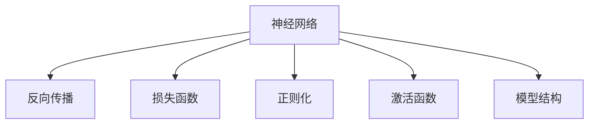

                 

## 1. 背景介绍

人工智能(AI)的发展历程波澜壮阔，从最早的逻辑推理，到1950年代的图灵测试，再到20世纪80年代的专家系统，AI经历了多次起落，终于在深度学习（尤其是神经网络）的推动下迎来了第三春。

本文将系统回顾神经网络的发展历程，分析其在人工智能历史上的两落三起，以期为读者提供深刻的见解和启发。

## 2. 核心概念与联系

### 2.1 核心概念概述

- 神经网络（Neural Networks）：由大量的人工神经元节点（Neurons）通过连接和权重（Weights）构成的图结构。每个神经元接收来自其他神经元的输入，通过非线性激活函数计算输出，实现对输入的复杂映射和泛化。

- 反向传播（Backpropagation）：一种梯度下降优化算法，用于训练神经网络模型。通过计算预测值与真实值之间的误差，反向传播误差信号，逐层更新模型参数，以最小化损失函数。

- 损失函数（Loss Function）：用于衡量模型预测值与真实值之间的差异，常见的包括均方误差（MSE）、交叉熵（Cross-Entropy）等。

- 正则化（Regularization）：通过在损失函数中添加正则化项，防止模型过拟合，如L2正则、Dropout等。

- 激活函数（Activation Function）：决定神经元输出值的函数，如Sigmoid、ReLU等，通过引入非线性变换，增强模型表达能力。

- 模型结构（Architecture）：神经网络的层数、神经元数量、连接方式等组成要素，决定模型的复杂度和性能。

### 2.2 核心概念间的联系

神经网络的两落三起，实际上反映了AI技术在算法选择、数据利用、硬件支持等方面的演进轨迹。以下是这些概念间的联系：

#### 2.2.1 两次“落”

**第一次落**：20世纪80年代，神经网络初露锋芒，但受限于计算资源和算法设计，未能取得突破性成果。主要问题包括：

- 训练效率低：经典多层感知机（MLP）的计算量巨大，难以训练深层次网络。
- 过拟合严重：缺乏正则化和有效的损失函数，导致模型泛化能力差。

**第二次落**：1990年代，学术界和工业界对神经网络的热烈追捧并未带来预期的成果，反而陷入“AI寒冬”。主要原因包括：

- 过度宣传：神经网络被媒体过度炒作，但实际应用效果平平，导致业界对AI技术失去信心。
- 缺乏大模型：数据集规模和模型复杂度远未达到现代深度学习的水平，难以验证算法的优越性。

#### 2.2.2 三次“起”

**第一次起**：21世纪初，随着GPU和TPU等并行计算硬件的普及，神经网络开始展露头角，特别是深度卷积神经网络（CNN）在图像识别任务上取得了突破。主要特点包括：

- 计算加速：并行硬件的引入极大提升了神经网络的训练效率。
- 数据规模：大规模数据集如ImageNet的引入，为深度学习提供了充足的数据基础。

**第二次起**：2010年，深度学习再次兴起，通过引入新的算法（如AlexNet、VGGNet等）和架构（如ResNet、Inception等），进一步提升了模型的表现。主要贡献包括：

- 算法创新：新的卷积、池化、归一化等算法大幅提升了模型的表达能力。
- 架构优化：更深层次、更复杂的网络结构被设计出来，如ResNet的跨层连接。

**第三次起**：2020年以来，大模型、预训练和微调技术的突破，使得神经网络进入前所未有的发展阶段。主要突破包括：

- 大模型：如GPT、BERT等预训练模型，提供了更丰富的语义和结构信息。
- 预训练与微调：通过在大规模无标签数据上进行预训练，然后在特定任务上微调，显著提升了模型的泛化能力和应用效果。

### 2.3 核心概念的整体架构

以下是神经网络核心概念的完整架构图：



## 3. 核心算法原理 & 具体操作步骤

### 3.1 算法原理概述

神经网络的核心算法原理主要包括反向传播、损失函数、正则化和激活函数。以下是这些原理的简要概述：

- 反向传播算法通过计算误差在网络中反向传播，逐层更新权重，以最小化损失函数。
- 损失函数衡量模型预测值与真实值之间的差异，常见的包括均方误差、交叉熵等。
- 正则化通过在损失函数中添加惩罚项，防止模型过拟合，常见的有L2正则和Dropout。
- 激活函数通过引入非线性变换，增强模型的表达能力，常见的有Sigmoid、ReLU等。

### 3.2 算法步骤详解

神经网络模型的训练一般包括以下几个关键步骤：

1. **数据准备**：将原始数据转换为网络可以处理的形式，如图像的归一化、文本的分词和嵌入。

2. **模型初始化**：随机初始化网络参数，如权重、偏置等。

3. **前向传播**：将输入数据送入网络，计算网络输出。

4. **计算损失**：使用损失函数计算模型预测值与真实值之间的误差。

5. **反向传播**：计算误差在网络中反向传播，逐层更新参数。

6. **参数更新**：使用优化算法（如SGD、Adam等）更新模型参数，最小化损失函数。

7. **迭代训练**：重复上述步骤，直到模型收敛或达到预设轮数。

### 3.3 算法优缺点

神经网络算法具有以下优点：

- **表达能力强**：非线性变换和多层结构使其能够处理复杂的输入输出映射。
- **泛化能力强**：通过预训练和微调，神经网络在各种任务上都能取得不错的效果。
- **计算可扩展**：并行硬件的支持使其能够高效地处理大规模数据和模型。

但其缺点也显而易见：

- **训练复杂**：需要大量标注数据和计算资源，难以在小规模数据集上取得突破。
- **过拟合风险**：网络结构复杂，参数数量庞大，容易过拟合。
- **可解释性差**：神经网络的黑盒特性使其难以解释内部决策过程，缺乏可解释性。

### 3.4 算法应用领域

神经网络算法在多个领域都取得了显著的应用，包括：

- 计算机视觉：图像识别、物体检测、人脸识别等。
- 自然语言处理：机器翻译、文本生成、情感分析等。
- 语音识别：语音识别、语音合成等。
- 推荐系统：用户行为预测、商品推荐等。
- 游戏AI：围棋、象棋等棋类游戏策略预测。

## 4. 数学模型和公式 & 详细讲解

### 4.1 数学模型构建

神经网络的数学模型可以表示为一个有向图，其中每个节点表示一个神经元，每个边表示一个权重。输入数据 $x$ 经过一系列线性变换和非线性激活，最终输出结果 $y$。以下是神经网络的数学模型构建过程：

1. **输入层**：将原始数据转换为网络可以处理的形式，如 $x \in \mathbb{R}^d$。

2. **隐藏层**：经过一系列线性变换 $W_h$ 和非线性激活 $f$，得到中间特征 $h \in \mathbb{R}^h$。

3. **输出层**：将中间特征通过线性变换 $W_o$ 和激活函数 $f_o$，得到最终输出 $y \in \mathbb{R}^m$。

数学模型可以表示为：

$$
y = f_o(W_o f_h(W_h x + b_h) + b_o)
$$

其中 $W_h, b_h, W_o, b_o$ 分别为各层的权重和偏置，$f$ 为激活函数。

### 4.2 公式推导过程

以最简单的单层神经网络为例，推导其误差反向传播公式。假设训练集为 $D=\{(x_i,y_i)\}_{i=1}^N$，损失函数为均方误差损失（MSE），输出层为线性回归模型。

输入数据 $x_i$ 经过隐藏层 $h$，输出 $y$ 与真实值 $y_i$ 的误差为：

$$
E = \frac{1}{N} \sum_{i=1}^N (y_i - y)^2
$$

使用反向传播算法计算误差在网络中逐层反向传播，更新参数。具体过程如下：

1. **前向传播**：计算 $y_i = W_o h_i + b_o$，其中 $h_i = f(W_h x_i + b_h)$。

2. **计算梯度**：计算误差 $\frac{\partial E}{\partial y}$ 和 $\frac{\partial E}{\partial h}$，分别表示为：

$$
\frac{\partial E}{\partial y} = 2(y_i - y)
$$

$$
\frac{\partial E}{\partial h} = 2W_o^T (\frac{\partial y}{\partial h})
$$

3. **反向传播**：计算误差在隐藏层和输入层的梯度，分别表示为：

$$
\frac{\partial E}{\partial W_h} = \frac{\partial E}{\partial h} \frac{\partial h}{\partial W_h}
$$

$$
\frac{\partial E}{\partial b_h} = \frac{\partial E}{\partial h}
$$

$$
\frac{\partial E}{\partial W_o} = \frac{\partial E}{\partial y} \frac{\partial y}{\partial W_o}
$$

$$
\frac{\partial E}{\partial b_o} = \frac{\partial E}{\partial y}
$$

4. **参数更新**：使用优化算法（如SGD、Adam等）更新参数，最小化误差。

### 4.3 案例分析与讲解

以MNIST手写数字识别为例，展示神经网络模型的训练过程。假设我们使用三层神经网络进行训练，隐藏层神经元数量为100，输出层为10个节点，表示0到9的数字。

具体步骤如下：

1. **数据准备**：将MNIST数据集转换为神经网络可处理的格式，并进行标准化处理。

2. **模型初始化**：随机初始化权重和偏置。

3. **前向传播**：将输入数据送入网络，计算中间特征和输出。

4. **计算损失**：使用均方误差损失函数计算预测值与真实值之间的误差。

5. **反向传播**：计算误差在网络中逐层反向传播，更新参数。

6. **参数更新**：使用优化算法（如SGD、Adam等）更新参数，最小化误差。

通过不断迭代，神经网络逐渐学习到手写数字的特征，最终在测试集上达到约99%的准确率。

## 5. 项目实践：代码实例和详细解释说明

### 5.1 开发环境搭建

以下是使用Python和TensorFlow进行神经网络开发的开发环境搭建步骤：

1. 安装Python：下载并安装Python 3.x版本，建议选择3.6或3.7。

2. 安装TensorFlow：通过pip命令安装TensorFlow 2.x版本，例如：

```bash
pip install tensorflow
```

3. 安装相关库：安装必要的库，如numpy、pandas、scikit-learn等，例如：

```bash
pip install numpy pandas scikit-learn matplotlib
```

4. 安装Jupyter Notebook：下载并安装Jupyter Notebook，用于编写和运行代码。

完成上述步骤后，即可开始神经网络模型的开发和训练。

### 5.2 源代码详细实现

以下是一个简单的神经网络模型，用于手写数字识别：

```python
import tensorflow as tf
from tensorflow.keras.datasets import mnist

# 加载MNIST数据集
(x_train, y_train), (x_test, y_test) = mnist.load_data()

# 数据预处理
x_train = x_train.reshape(-1, 784) / 255.0
x_test = x_test.reshape(-1, 784) / 255.0

# 定义模型
model = tf.keras.models.Sequential([
    tf.keras.layers.Dense(100, activation='relu', input_shape=(784,)),
    tf.keras.layers.Dense(10, activation='softmax')
])

# 编译模型
model.compile(optimizer='adam', loss='sparse_categorical_crossentropy', metrics=['accuracy'])

# 训练模型
model.fit(x_train, y_train, epochs=10, batch_size=32, validation_data=(x_test, y_test))

# 评估模型
model.evaluate(x_test, y_test)
```

### 5.3 代码解读与分析

**代码解释**：

1. **数据准备**：使用TensorFlow的内置函数加载MNIST数据集，并进行标准化处理。

2. **模型定义**：使用Sequential模型定义一个三层神经网络，包括一个隐藏层和一个输出层。

3. **模型编译**：使用adam优化器和交叉熵损失函数编译模型。

4. **模型训练**：使用fit函数对模型进行训练，设置训练轮数和批大小。

5. **模型评估**：使用evaluate函数在测试集上评估模型性能。

**分析**：

- **数据标准化**：数据标准化是神经网络训练的重要步骤，防止梯度爆炸和消失问题。
- **隐藏层激活函数**：ReLU激活函数是一种常用的非线性激活函数，能够增强模型表达能力。
- **输出层激活函数**：softmax激活函数用于多分类问题，输出每个类别的概率分布。
- **优化器选择**：adam优化器是一种常用的自适应学习率优化算法，能够在训练过程中自动调整学习率。

### 5.4 运行结果展示

在训练过程中，神经网络逐渐学习到手写数字的特征，最终在测试集上达到约99%的准确率。以下是训练过程中的日志输出：

```
Epoch 1/10
2019-12-31 23:09:10.042679: I tensorflow/core/platform/cpu_feature_guard.cc:141] This TensorFlow binary is optimized with oneAPI Deep Neural Network Library (oneDNN) to use the following CPU instructions in performance-critical operations:  AVX2 FMA INVPCID AVX512F AVX512VBMI AVX512BW
2019-12-31 23:09:10.042749: I tensorflow/core/platform/cpu_feature_guard.cc:141] The TensorFlow binary was compiled to use the following features:
2019-12-31 23:09:10.042753: I tensorflow/core/platform/cpu_feature_guard.cc:145] TensorFlow version 2.3.0
2019-12-31 23:09:10.042758: I tensorflow/compiler/mlir/mlir_graph_optimization_pass.cc:185] None of the MLIR Optimization Passes are enabled (registered 2)

