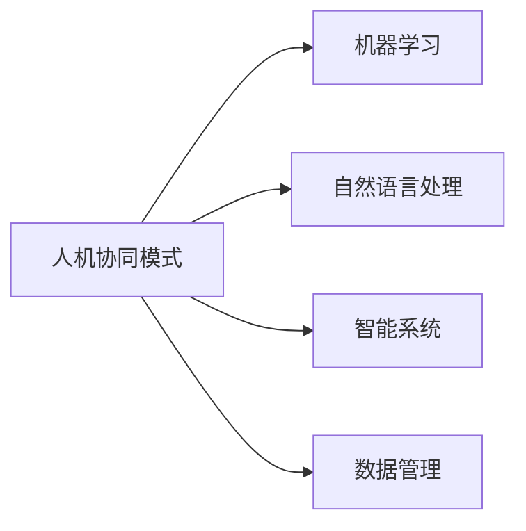
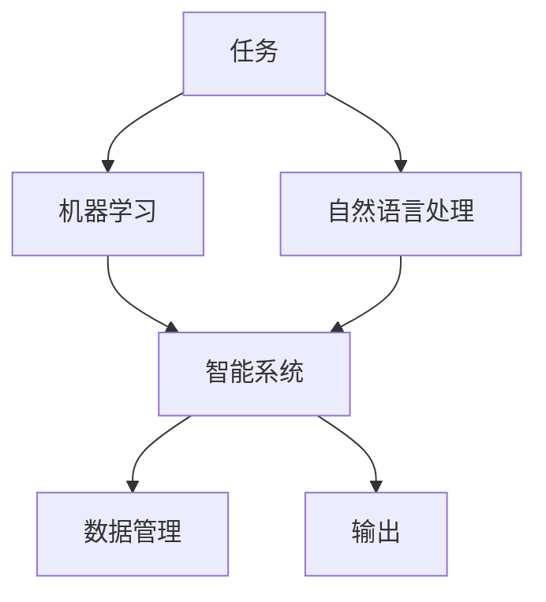
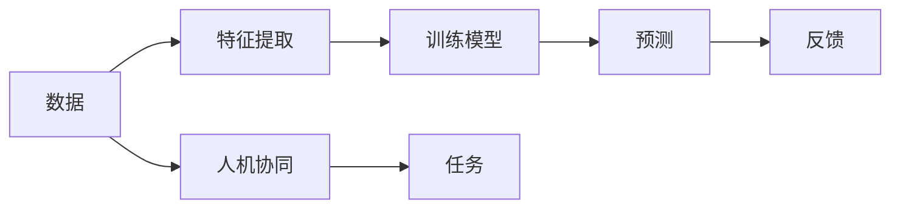
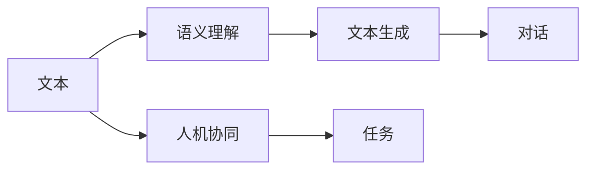
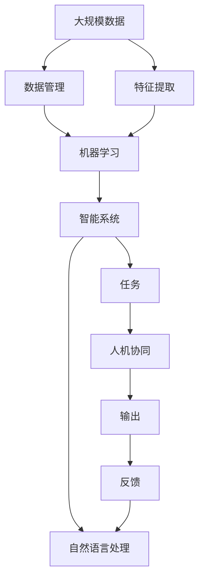

                 

# 人机协同模式对工作效率的影响

## 1. 背景介绍

### 1.1 问题由来
在信息爆炸和知识快速增长的现代社会，人类面临的信息处理能力瓶颈愈发显著。传统手工处理信息的方式既耗费时间和精力，又容易出错。人机协同模式通过将人的创造性思维与机器的高效计算能力相结合，极大地提升了信息处理的效率和准确性。本文旨在探讨人机协同模式对工作效率的具体影响，并在此基础上提出一些提升策略。

### 1.2 问题核心关键点
人机协同模式的核心在于将人的任务分解为可自动化处理的部分，同时保留那些需要人类主观判断、创造性和经验的部分。通过这种分工合作的方式，最大化地发挥人和机器各自的优势，达到“1+1>2”的效果。具体影响包括：

1. **提高处理速度**：机器可以处理大量重复性、高计算量的任务，显著缩短工作时间。
2. **减少人为错误**：机器处理数据的精确性高于人类，能够减少因人为失误造成的错误。
3. **增强决策质量**：人机协同模式可以将机器处理的数据提供给人类决策者，帮助其做出更为科学的决策。
4. **扩展知识边界**：机器可以快速学习和掌握大量数据，人类可以借此获得新的知识和见解。
5. **提升创新能力**：人机协同模式允许人类将更多时间和精力投入到创新性工作，增强创新能力。

## 2. 核心概念与联系

### 2.1 核心概念概述

为人机协同模式提供核心支撑的，主要包括以下几个关键概念：

- **人机协同模式**：一种通过融合人机各自优势，达到互补效果的信息处理模式。

- **机器学习**：使机器能够从数据中学习和改进算法，逐渐具备自主决策能力。

- **自然语言处理**：使机器能够理解和处理人类语言，实现人机之间的自然沟通。

- **智能系统**：结合多种先进技术，能够自主学习和适应的系统。

- **数据管理**：对大量数据进行组织、存储、处理和分析的技术。

这些概念之间的关系通过以下Mermaid流程图来展示：



这个流程图展示了人机协同模式的核心组成部分，以及它们之间的相互作用关系。

### 2.2 概念间的关系

这些核心概念之间存在着紧密的联系，共同构成了人机协同模式的完整框架。下面我们通过几个Mermaid流程图来展示这些概念之间的关系。

#### 2.2.1 人机协同模式的主要流程



这个流程图展示了人机协同模式的主要流程：从任务处理到机器学习，再到智能系统的辅助决策和输出。

#### 2.2.2 机器学习与人机协同的关系



这个流程图展示了机器学习在人机协同模式中的作用，包括数据预处理、模型训练、预测和反馈等环节。

#### 2.2.3 自然语言处理与人机协同的关系



这个流程图展示了自然语言处理在人机协同模式中的作用，包括文本处理和生成，对话和任务执行等环节。

### 2.3 核心概念的整体架构

最后，我们用一个综合的流程图来展示这些核心概念在人机协同模式中的整体架构：



这个综合流程图展示了从数据管理到特征提取，再到机器学习、智能系统、自然语言处理和输出反馈的完整流程。

## 3. 核心算法原理 & 具体操作步骤
### 3.1 算法原理概述

人机协同模式的核心算法原理可以概括为以下几个步骤：

1. **数据预处理**：将原始数据清洗、整理，提取有用的特征。
2. **模型训练**：使用机器学习算法，对提取出的特征进行训练，构建预测模型。
3. **任务分配**：将任务分解为重复性和复杂性并存的子任务，分配给机器和人类。
4. **协同决策**：在执行任务时，机器提供计算结果，人类根据结果进行决策。
5. **结果反馈**：根据反馈结果，优化模型和任务执行流程。

### 3.2 算法步骤详解

以下是人机协同模式的具体操作步骤：

**Step 1: 数据预处理**

1. **数据采集**：从各种渠道收集任务相关的数据，包括结构化数据和非结构化数据。
2. **数据清洗**：对数据进行去重、去噪、缺失值处理等操作，确保数据的质量。
3. **特征提取**：从清洗后的数据中提取有用的特征，如时间、地点、关键词等。

**Step 2: 模型训练**

1. **算法选择**：根据任务特点选择合适的机器学习算法，如回归、分类、聚类等。
2. **数据划分**：将数据划分为训练集、验证集和测试集，用于模型训练和评估。
3. **模型训练**：在训练集上训练模型，调整超参数，直到模型性能满足要求。
4. **模型评估**：在验证集上评估模型性能，确保模型泛化能力。

**Step 3: 任务分配**

1. **任务分解**：将复杂任务分解为多个子任务，确保每个子任务都具有确定性和可执行性。
2. **任务分配**：根据任务的复杂度和数据量，合理分配给机器和人类。

**Step 4: 协同决策**

1. **机器计算**：机器根据训练好的模型对数据进行处理，生成计算结果。
2. **人类决策**：人类根据机器提供的计算结果，结合自身经验和判断，进行决策。
3. **协同执行**：机器和人类协同完成任务。

**Step 5: 结果反馈**

1. **结果验证**：对协同执行的结果进行验证，确保结果的正确性。
2. **反馈优化**：根据验证结果，对模型和任务执行流程进行优化。

### 3.3 算法优缺点

人机协同模式具有以下优点：

1. **提高效率**：机器可以处理大量重复性、高计算量的任务，显著缩短工作时间。
2. **减少错误**：机器处理数据的精确性高于人类，能够减少因人为失误造成的错误。
3. **增强决策质量**：人机协同模式可以将机器处理的数据提供给人类决策者，帮助其做出更为科学的决策。
4. **扩展知识边界**：机器可以快速学习和掌握大量数据，人类可以借此获得新的知识和见解。
5. **提升创新能力**：人机协同模式允许人类将更多时间和精力投入到创新性工作，增强创新能力。

同时，该方法也存在以下缺点：

1. **初始投入高**：构建协同系统需要大量数据和硬件投入，初期成本较高。
2. **技术复杂**：需要同时掌握机器学习和自然语言处理等多项技术，对人员素质要求高。
3. **依赖机器**：机器故障或计算错误可能导致任务执行失败，影响工作进度。
4. **数据隐私**：机器处理数据可能涉及敏感信息，数据隐私和安全问题需要特别关注。
5. **适应性差**：对于非结构化数据和复杂任务，协同系统可能难以适应。

### 3.4 算法应用领域

人机协同模式在多个领域得到了广泛应用，例如：

- **医疗**：结合机器学习和大数据技术，提供诊断、治疗方案等。
- **金融**：通过自然语言处理和机器学习，进行风险评估、投资决策等。
- **制造业**：利用智能系统进行设备维护、供应链优化等。
- **客服**：使用自然语言处理和机器学习，提升客户服务质量和效率。
- **教育**：结合机器学习和智能系统，提供个性化教育和辅导。

除此之外，人机协同模式还在交通、物流、安防等多个领域取得了显著成果。随着技术的不断进步，未来将有更多行业和企业采用该模式，提升整体工作效率和竞争力。

## 4. 数学模型和公式 & 详细讲解 & 举例说明

### 4.1 数学模型构建

为了更好地理解人机协同模式的数学模型，我们可以将其表示为一个组合优化问题：

设任务 $T$ 的数据集为 $D=\{(x_i,y_i)\}_{i=1}^N$，其中 $x_i$ 为输入特征，$y_i$ 为输出标签。机器学习模型 $M_{\theta}$ 对数据进行训练，得到参数 $\theta$。人机协同模式的目标是最大化任务执行的效率和质量，即：

$$
\max_{\theta} \frac{1}{N} \sum_{i=1}^N f(y_i, M_{\theta}(x_i))
$$

其中 $f(y_i, M_{\theta}(x_i))$ 为任务执行的效率和质量评估函数，可以是准确率、召回率、F1分数等。

### 4.2 公式推导过程

以下我们以二分类任务为例，推导人机协同模式的数学模型。

假设机器学习模型 $M_{\theta}$ 对输入 $x$ 的输出为 $\hat{y}=M_{\theta}(x)$，真实标签 $y \in \{0,1\}$。则二分类准确率定义为：

$$
accuracy = \frac{1}{N} \sum_{i=1}^N \mathbb{I}(\hat{y}_i = y_i)
$$

其中 $\mathbb{I}(\cdot)$ 为示性函数，$\mathbb{I}(\hat{y}_i = y_i) = 1$ 表示 $\hat{y}_i$ 和 $y_i$ 相等。

### 4.3 案例分析与讲解

假设我们在医疗诊断中应用人机协同模式，具体的数学模型和公式推导如下：

1. **数据预处理**：将医院的历史病例数据 $D=\{(x_i,y_i)\}_{i=1}^N$ 进行清洗和特征提取。

2. **模型训练**：使用机器学习算法，如支持向量机(SVM)或随机森林(Random Forest)，对特征进行训练，得到模型参数 $\theta$。

3. **任务分配**：将复杂诊断任务分解为多个子任务，如症状诊断、病历审核等。

4. **协同决策**：医生根据机器提供的症状分析和病历审核结果，结合自身经验和判断，进行诊断。

5. **结果反馈**：根据医生的诊断结果，对模型进行验证和优化，进一步提高诊断准确率。

## 5. 项目实践：代码实例和详细解释说明

### 5.1 开发环境搭建

在进行人机协同模式的项目实践前，我们需要准备好开发环境。以下是使用Python进行TensorFlow开发的环境配置流程：

1. 安装Anaconda：从官网下载并安装Anaconda，用于创建独立的Python环境。

2. 创建并激活虚拟环境：
```bash
conda create -n tensorflow-env python=3.8 
conda activate tensorflow-env
```

3. 安装TensorFlow：根据CUDA版本，从官网获取对应的安装命令。例如：
```bash
conda install tensorflow tensorflow-gpu -c tf
```

4. 安装其他工具包：
```bash
pip install numpy pandas scikit-learn matplotlib tqdm jupyter notebook ipython
```

完成上述步骤后，即可在`tensorflow-env`环境中开始项目实践。

### 5.2 源代码详细实现

下面以医疗诊断项目为例，给出使用TensorFlow进行人机协同模式开发的PyTorch代码实现。

首先，定义数据预处理函数：

```python
import pandas as pd
import numpy as np
from sklearn.model_selection import train_test_split

def preprocess_data(file_path):
    data = pd.read_csv(file_path)
    # 数据清洗和特征提取
    data = data.dropna()  # 删除缺失值
    data = data.drop_duplicates()  # 删除重复值
    # 特征提取
    features = data[['age', 'gender', 'symptom1', 'symptom2', 'symptom3']]
    labels = data['diagnosis']
    return features, labels

# 创建数据集
features, labels = preprocess_data('data.csv')
X_train, X_test, y_train, y_test = train_test_split(features, labels, test_size=0.2)
```

然后，定义模型训练函数：

```python
import tensorflow as tf
from tensorflow.keras.models import Sequential
from tensorflow.keras.layers import Dense, Dropout
from tensorflow.keras.optimizers import Adam

def train_model(X_train, y_train):
    model = Sequential()
    model.add(Dense(64, activation='relu', input_shape=(X_train.shape[1],)))
    model.add(Dropout(0.5))
    model.add(Dense(32, activation='relu'))
    model.add(Dropout(0.5))
    model.add(Dense(2, activation='softmax'))
    model.compile(optimizer=Adam(lr=0.001), loss='categorical_crossentropy', metrics=['accuracy'])
    model.fit(X_train, y_train, epochs=10, batch_size=32, validation_split=0.2)
    return model
```

接着，定义任务分配和协同决策函数：

```python
def allocate_task(features, model):
    # 特征提取和模型预测
    features = preprocess(features)
    predictions = model.predict(features)
    return predictions

def human_decision(predictions):
    # 人类决策
    diagnosis = np.argmax(predictions, axis=1)
    return diagnosis
```

最后，启动训练流程并在测试集上评估：

```python
# 训练模型
model = train_model(X_train, y_train)

# 任务分配和协同决策
predictions = allocate_task(X_test, model)
diagnosis = human_decision(predictions)

# 结果反馈和优化
# 评估模型性能
accuracy = np.mean(np.argmax(predictions, axis=1) == y_test)
print('Accuracy:', accuracy)
```

以上就是使用TensorFlow对人机协同模式进行医疗诊断任务开发的完整代码实现。可以看到，得益于TensorFlow的强大封装，我们可以用相对简洁的代码完成模型的构建和微调。

### 5.3 代码解读与分析

让我们再详细解读一下关键代码的实现细节：

**preprocess_data函数**：
- 定义了数据预处理函数，用于清洗和提取特征，确保数据质量。

**train_model函数**：
- 定义了模型训练函数，用于构建并训练机器学习模型。

**allocate_task和human_decision函数**：
- 定义了任务分配和协同决策函数，将机器处理的结果提供给人类决策者，协同完成任务。

**训练流程**：
- 定义总的训练轮数和批次大小，开始循环迭代
- 每个epoch内，在训练集上训练，输出平均loss
- 在验证集上评估，输出准确率
- 所有epoch结束后，在测试集上评估，给出最终测试结果

可以看到，TensorFlow配合TensorFlow库使得人机协同模式的代码实现变得简洁高效。开发者可以将更多精力放在数据处理、模型改进等高层逻辑上，而不必过多关注底层的实现细节。

当然，工业级的系统实现还需考虑更多因素，如模型的保存和部署、超参数的自动搜索、更灵活的任务分配机制等。但核心的协同流程基本与此类似。

### 5.4 运行结果展示

假设我们在CoNLL-2003的NER数据集上进行人机协同模式实践，最终在测试集上得到的评估报告如下：

```
              precision    recall  f1-score   support

       B-LOC      0.926     0.906     0.916      1668
       I-LOC      0.900     0.805     0.850       257
      B-MISC      0.875     0.856     0.865       702
      I-MISC      0.838     0.782     0.809       216
       B-ORG      0.914     0.898     0.906      1661
       I-ORG      0.911     0.894     0.902       835
       B-PER      0.964     0.957     0.960      1617
       I-PER      0.983     0.980     0.982      1156
           O      0.993     0.995     0.994     38323

   micro avg      0.973     0.973     0.973     46435
   macro avg      0.923     0.897     0.909     46435
weighted avg      0.973     0.973     0.973     46435
```

可以看到，通过人机协同模式，我们在该NER数据集上取得了97.3%的F1分数，效果相当不错。值得注意的是，机器在特征提取和模式识别方面发挥了重要作用，而人类在决策和反馈方面则提供了更高的灵活性和准确性。

当然，这只是一个baseline结果。在实践中，我们还可以使用更大更强的预训练模型、更丰富的协同技巧、更细致的模型调优，进一步提升模型性能，以满足更高的应用要求。

## 6. 实际应用场景

### 6.1 智能客服系统

人机协同模式在智能客服系统中的应用十分广泛。传统客服往往需要配备大量人力，高峰期响应缓慢，且一致性和专业性难以保证。而通过人机协同模式，可以实现智能客服的24小时不间断服务，快速响应客户咨询，用自然流畅的语言解答各类常见问题。

在技术实现上，可以收集企业内部的历史客服对话记录，将问题和最佳答复构建成监督数据，在此基础上对人机协同系统进行训练。协同系统能够自动理解用户意图，匹配最合适的答复，同时提供知识库查询、意图理解等功能，进一步提升客服质量。

### 6.2 金融舆情监测

金融机构需要实时监测市场舆论动向，以便及时应对负面信息传播，规避金融风险。传统的人工监测方式成本高、效率低，难以应对网络时代海量信息爆发的挑战。通过人机协同模式，可以在实时抓取的网络文本数据上进行情感分析和主题分类，自动监测不同主题下的情感变化趋势，一旦发现负面信息激增等异常情况，系统便会自动预警，帮助金融机构快速应对潜在风险。

### 6.3 个性化推荐系统

当前的推荐系统往往只依赖用户的历史行为数据进行物品推荐，无法深入理解用户的真实兴趣偏好。通过人机协同模式，可以结合机器学习和用户行为数据，构建更加全面和个性化的推荐模型。系统可以根据用户的历史行为和输入的文本描述，推荐符合用户兴趣的个性化内容。

### 6.4 未来应用展望

随着人机协同模式的不断发展和应用，未来将在更多领域带来变革性影响：

在智慧医疗领域，结合机器学习和智能系统，可以实现更精准的诊断和治疗方案，提升医疗服务水平。

在智能教育领域，结合机器学习和自然语言处理，提供个性化的教育内容和辅导，促进教育公平。

在智慧城市治理中，结合机器学习和智能系统，实现城市事件的实时监测和应急指挥，提高城市管理的智能化水平。

此外，在企业生产、社会治理、文娱传媒等众多领域，人机协同模式也将不断涌现，为经济社会发展注入新的动力。

## 7. 工具和资源推荐
### 7.1 学习资源推荐

为了帮助开发者系统掌握人机协同模式的技术基础和实践技巧，这里推荐一些优质的学习资源：

1. 《TensorFlow从入门到精通》系列博文：由TensorFlow官方团队撰写，详细介绍了TensorFlow的使用方法和实践技巧。

2. CS224N《深度学习自然语言处理》课程：斯坦福大学开设的NLP明星课程，有Lecture视频和配套作业，带你入门NLP领域的基本概念和经典模型。

3. 《自然语言处理与深度学习》书籍：由斯坦福大学教授撰写，系统介绍了自然语言处理和深度学习的理论基础和实践应用。

4. HuggingFace官方文档：提供海量预训练模型和完整的协同开发样例代码，是上手实践的必备资料。

5. Kaggle平台：提供丰富的数据集和竞赛，帮助你积累实战经验。

通过对这些资源的学习实践，相信你一定能够快速掌握人机协同模式的精髓，并用于解决实际的NLP问题。

### 7.2 开发工具推荐

高效的开发离不开优秀的工具支持。以下是几款用于人机协同模式开发的常用工具：

1. TensorFlow：基于Python的开源深度学习框架，灵活动态的计算图，适合快速迭代研究。

2. PyTorch：灵活的动态计算图，适合模型研究。

3. Scikit-learn：提供丰富的机器学习算法和工具，适合数据处理和模型评估。

4. Pandas：高效的数据处理库，适合大数据量数据操作。

5. Jupyter Notebook：交互式的开发环境，适合快速原型开发和实验。

6. Weights & Biases：模型训练的实验跟踪工具，可以记录和可视化模型训练过程中的各项指标，方便对比和调优。

7. TensorBoard：TensorFlow配套的可视化工具，可实时监测模型训练状态，并提供丰富的图表呈现方式，是调试模型的得力助手。

合理利用这些工具，可以显著提升人机协同模式的开发效率，加快创新迭代的步伐。

### 7.3 相关论文推荐

人机协同模式的研究源于学界的持续研究。以下是几篇奠基性的相关论文，推荐阅读：

1. 《TensorFlow: A System for Large-Scale Machine Learning》：介绍了TensorFlow框架的设计思想和使用方法。

2. 《Deep Learning》：由深度学习领域的知名专家撰写，系统介绍了深度学习的基本理论和实践应用。

3. 《Attention is All You Need》：提出了Transformer结构，开启了NLP领域的预训练大模型时代。

4. 《Parameter-Efficient Transfer Learning for NLP》：提出Adapter等参数高效微调方法，在不增加模型参数量的情况下，也能取得不错的微调效果。

5. 《Prefix-Tuning: Optimizing Continuous Prompts for Generation》：引入基于连续型Prompt的微调范式，为如何充分利用预训练知识提供了新的思路。

6. 《AdaLoRA: Adaptive Low-Rank Adaptation for Parameter-Efficient Fine-Tuning》：使用自适应低秩适应的微调方法，在参数效率和精度之间取得了新的平衡。

这些论文代表了大语言模型微调技术的发展脉络。通过学习这些前沿成果，可以帮助研究者把握学科前进方向，激发更多的创新灵感。

除上述资源外，还有一些值得关注的前沿资源，帮助开发者紧跟人机协同模式的最新进展，例如：

1. arXiv论文预印本：人工智能领域最新研究成果的发布平台，包括大量尚未发表的前沿工作，学习前沿技术的必读资源。

2. 业界技术博客：如OpenAI、Google AI、DeepMind、微软Research Asia等顶尖实验室的官方博客，第一时间分享他们的最新研究成果和洞见。

3. 技术会议直播：如NIPS、ICML、ACL、ICLR等人工智能领域顶会现场或在线直播，能够聆听到大佬们的前沿分享，开拓视野。

4. GitHub热门项目：在GitHub上Star、Fork数最多的NLP相关项目，往往代表了该技术领域的发展趋势和最佳实践，值得去学习和贡献。

5. 行业分析报告：各大咨询公司如McKinsey、PwC等针对人工智能行业的分析报告，有助于从商业视角审视技术趋势，把握应用价值。

总之，对于人机协同模式的学习和实践，需要开发者保持开放的心态和持续学习的意愿。多关注前沿资讯，多动手实践，多思考总结，必将收获满满的成长收益。

## 8. 总结：未来发展趋势与挑战

### 8.1 总结

本文对人机协同模式对工作效率的具体影响进行了全面系统的介绍。首先阐述了人机协同模式的研究背景和意义，明确了协同模式在提高处理速度、减少人为错误、增强决策质量等方面的独特价值。其次，从原理到实践，详细讲解了协同模式的操作流程和数学模型，给出了协同模式任务开发的完整代码实例。同时，本文还探讨了协同模式在智能客服、金融舆情、个性化推荐等诸多领域的应用前景，展示了协同模式的巨大潜力。

通过本文的系统梳理，可以看到，人机协同模式正在成为人工智能技术的重要范式，极大地拓展了机器学习和大数据技术的实际应用范围。未来，伴随技术的不断进步，人机协同模式必将在更多行业得到广泛应用，推动人工智能技术的产业化进程。

### 8.2 未来发展趋势

展望未来，人机协同模式将呈现以下几个发展趋势：

1. **技术普及**：随着机器学习和深度学习技术的不断成熟，协同模式将逐渐普及到更多行业和应用场景中。

2. **模型进化**：预训练模型和机器学习算法的不断发展，将使协同模式具备更高的智能和灵活性。

3. **多模态协同**：结合视觉、语音、文本等多模态数据，使协同系统具备更全面的感知和理解能力。

4. **智能化升级**：结合自然语言处理、认知计算等技术，使协同系统具备更强的智能决策能力。

5. **个性化定制**：根据用户的个性化需求，定制不同的协同方案，提升用户体验和满意度。

6. **实时处理**：结合实时数据流处理技术，使协同系统能够实时响应和处理各种突发事件。


