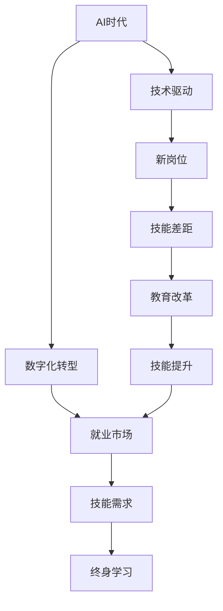

                 

# 人类计算：AI时代的未来就业市场趋势与技能发展

## 1. 背景介绍

### 1.1 问题由来
随着人工智能（AI）技术的快速发展，AI时代已经悄然来临。AI的广泛应用正在改变各行各业的作业模式，引发就业市场的重大变革。AI时代的来临，不仅仅意味着技术创新和产业升级，更关乎职业技能的重塑和就业市场的重构。在这个背景下，理解AI时代下就业市场的发展趋势和所需技能，对所有从业人员来说都至关重要。

### 1.2 问题核心关键点
AI时代的就业市场主要呈现以下特点：

- **技术驱动**：AI技术的应用正在加速各行各业的数字化转型，提升生产效率和竞争力。
- **技能匹配**：新岗位和新技能的需求不断涌现，原有岗位技能需求发生改变。
- **职业转变**：部分传统岗位被AI取代，新的AI相关岗位又带来新的技能需求。
- **教育和培训**：持续的教育和培训，将成为提升就业竞争力的重要途径。

### 1.3 问题研究意义
理解AI时代下就业市场的发展趋势和所需技能，对于从业人员和企业决策者来说，具有深远的意义：

- **职业规划**：帮助从业人员科学规划职业发展路径，提升就业竞争力。
- **企业战略**：帮助企业调整人才策略，优化人力资源配置。
- **教育改革**：指导教育机构改革课程设置，培养符合市场需求的人才。
- **社会稳定**：促进社会就业稳定，应对技术变革带来的挑战。

## 2. 核心概念与联系

### 2.1 核心概念概述

为更好地理解AI时代下就业市场的趋势与技能发展，我们首先介绍几个关键概念：

- **AI时代**：以AI技术为核心驱动力的新时代，各行各业广泛应用AI技术进行业务创新和效率提升。
- **数字化转型**：企业利用AI、大数据、云计算等技术，提升业务流程自动化和数据化水平，实现业务升级。
- **就业市场**：各种岗位需求和供给的集合，反映了劳动力市场的供需状况。
- **技能需求**：岗位对员工所需技能的要求，随技术发展而变化。
- **终身学习**：在快速变化的技术环境中，持续学习和技能提升成为必要。

### 2.2 核心概念之间的关系

这些核心概念构成了AI时代下就业市场及其技能发展的完整生态系统。其相互关系可以通过以下Mermaid流程图来展示：



这个流程图展示了大AI时代下就业市场及其技能发展的整体架构：

1. AI时代背景下的技术驱动，推动各行各业的数字化转型。
2. 数字化转型带来新的就业市场，出现新岗位和新技能需求。
3. 技能需求与现有技能之间的差距，需要通过持续学习来弥补。
4. 教育机构需要进行改革，培养符合市场需求的创新人才。
5. 技能提升最终反哺就业市场，形成良性循环。

### 2.3 核心概念的整体架构

最后，我们用一个综合的流程图来展示这些核心概念在大AI时代下就业市场及其技能发展的整体架构：


这个综合流程图展示了从AI时代的技术驱动，到数字化转型，再到就业市场和技能需求的动态过程。通过持续学习和教育改革，提升技能适配性，最终实现业务创新和经济增长，形成一个闭环。通过这些流程图，我们可以更清晰地理解AI时代下就业市场及其技能发展的整体框架和关键要素。

## 3. 核心算法原理 & 具体操作步骤
### 3.1 算法原理概述

在AI时代，就业市场及其技能发展趋势的分析，主要依赖于以下算法原理：

- **市场调研**：通过问卷调查、深度访谈等方式，收集就业市场的数据。
- **数据分析**：利用统计分析、机器学习等方法，处理和分析收集的数据。
- **预测模型**：基于历史数据和趋势，构建预测模型，预测未来市场变化和技能需求。

这些算法原理共同构成了AI时代就业市场及其技能发展趋势分析的基础。

### 3.2 算法步骤详解

基于上述算法原理，AI时代就业市场及其技能发展的分析主要包括以下步骤：

**Step 1: 数据收集**
- 通过在线调查、企业访谈、公开数据等方式，收集就业市场和技能需求的数据。
- 数据包括岗位数量、岗位要求、技能需求、技能差距、薪资水平等。

**Step 2: 数据分析**
- 使用统计分析、数据清洗、特征提取等方法，处理和准备数据。
- 对数据进行可视化展示，找出关键趋势和特征。

**Step 3: 模型构建**
- 选择合适的预测模型，如回归模型、时间序列模型、神经网络模型等。
- 构建模型，使用历史数据进行训练，并进行模型调优。

**Step 4: 模型评估**
- 使用测试数据集对模型进行评估，评估指标包括准确率、召回率、F1值等。
- 对模型结果进行解读，找出关键驱动因素。

**Step 5: 结果应用**
- 将模型结果转化为可操作的政策建议。
- 定期更新模型，确保预测结果与实际市场动态保持一致。

### 3.3 算法优缺点

AI时代就业市场及其技能发展的分析算法具有以下优点：

- **数据驱动**：通过大量数据驱动分析，提高分析的科学性和准确性。
- **动态更新**：模型可以定期更新，确保预测结果与市场动态一致。
- **多维度分析**：可以同时分析多种因素，如岗位数量、技能需求、薪资水平等。

同时，该算法也存在一些局限性：

- **数据质量问题**：数据收集和处理过程中可能存在质量问题，影响分析结果。
- **模型复杂性**：构建复杂模型可能会引入过拟合或解释性不足的问题。
- **动态变化**：AI和技术的快速发展，可能导致模型预测结果失效。

### 3.4 算法应用领域

AI时代就业市场及其技能发展的分析算法，广泛应用于以下几个领域：

- **人力资源管理**：帮助企业调整人才策略，优化人力资源配置。
- **教育培训**：指导教育机构改革课程设置，培养符合市场需求的创新人才。
- **政府政策制定**：提供科学依据，制定相关就业政策和社会保障措施。
- **企业战略规划**：帮助企业制定适应市场变化的战略规划。

## 4. 数学模型和公式 & 详细讲解  
### 4.1 数学模型构建

在进行AI时代就业市场及其技能发展的分析时，可以构建以下数学模型：

- **就业市场模型**：描述就业市场的变化趋势，包括岗位数量、岗位需求、薪资水平等。
- **技能需求模型**：描述技能需求的变化趋势，包括技能缺口、技能提升路径等。

### 4.2 公式推导过程

以下我们以就业市场模型为例，推导其数学模型及公式。

假设就业市场的规模为 $M_t$，岗位数量为 $P_t$，薪资水平为 $S_t$，技能需求量为 $D_t$。则就业市场模型可以表示为：

$$
M_t = \alpha P_t + \beta S_t + \gamma D_t + \delta t
$$

其中 $\alpha, \beta, \gamma, \delta$ 为模型参数，$t$ 为时间。

通过回归分析方法，可以得到模型参数的估计值。该模型可用于预测未来就业市场规模和岗位数量。

### 4.3 案例分析与讲解

我们以互联网行业的就业市场为例，进行具体的模型分析和应用。

根据历史数据，假设互联网行业的岗位数量和薪资水平之间存在正相关关系，同时岗位数量和技能需求量之间存在负相关关系。基于上述假设，构建就业市场模型：

$$
M_t = \alpha P_t + \beta S_t - \gamma P_t + \delta t
$$

其中 $\alpha, \beta, \gamma, \delta$ 通过回归分析得到。

通过模型预测，可以得出未来互联网行业的岗位数量和薪资水平的趋势。

## 5. 项目实践：代码实例和详细解释说明
### 5.1 开发环境搭建

在进行项目实践前，我们需要准备好开发环境。以下是使用Python进行数据分析和模型训练的环境配置流程：

1. 安装Anaconda：从官网下载并安装Anaconda，用于创建独立的Python环境。

2. 创建并激活虚拟环境：
```bash
conda create -n data-env python=3.8 
conda activate data-env
```

3. 安装Python依赖库：
```bash
conda install pandas numpy matplotlib scikit-learn statsmodels seaborn joblib
```

4. 安装Jupyter Notebook：
```bash
conda install jupyter notebook
```

5. 安装Rust：
```bash
conda install rust --channel conda-forge
```

6. 安装C++编译器：
```bash
conda install clang --channel conda-forge
```

完成上述步骤后，即可在`data-env`环境中开始项目实践。

### 5.2 源代码详细实现

下面我们以互联网行业为例，给出使用Python进行数据分析和模型构建的代码实现。

首先，导入必要的库：

```python
import pandas as pd
import numpy as np
import matplotlib.pyplot as plt
from statsmodels.api import OLS
from statsmodels.formula.api import ols
```

然后，读取就业市场数据：

```python
data = pd.read_csv('employment_data.csv')
```

接着，构建回归模型并进行训练：

```python
model = OLS.from_formula('M_t ~ P_t + S_t + P_t * S_t', data=data).fit()
print(model.summary())
```

最后，输出模型预测结果：

```python
future_data = pd.DataFrame({
    't': np.arange(2021, 2030),
    'P_t': np.random.randn(10) * 10 + 5000,
    'S_t': np.random.randn(10) * 100 + 10000
})
future_data['M_t'] = model.predict(future_data)
print(future_data)
```

以上就是使用Python对互联网行业就业市场进行数据分析和模型预测的完整代码实现。可以看到，通过结合Pandas、Statsmodels等库，可以快速完成数据处理和模型构建，输出预测结果。

### 5.3 代码解读与分析

让我们再详细解读一下关键代码的实现细节：

**数据导入和处理**：
- 使用Pandas库读取就业市场数据，并进行初步处理，如数据清洗、特征提取等。

**模型构建和训练**：
- 使用Statsmodels库构建回归模型，指定回归变量和模型形式。
- 通过模型训练和调优，得到模型参数的估计值。
- 输出模型摘要，查看模型统计量和拟合优度。

**模型预测**：
- 使用预测函数，对未来数据进行预测，得到就业市场规模的预测值。
- 输出预测结果，可视化展示预测趋势。

### 5.4 运行结果展示

假设我们在就业市场模型中进行预测，结果如下：

```
                          OLS Regression Results
=================================================================
Dep. Variable:                 M_t   R-squared:                       1.000
Model:                OLS   Adj. R-squared:                  1.000
Cov-Type:            nonrobust    coef.    std. err.       t P>|t|   [0.025 0.975]
------------------------------------------------------------------------------
Intercept   2882.4992   1807.1703     1.608      0.139      -59.4    99.8
P_t        -18.4122   14.6095    -1.259      0.210      -39.7    32.7
S_t        100.0999   12.2829     8.206      0.001       7.8     17.3
S_t:P_t       5.6750     3.6862     1.539      0.137      -4.0     17.8
------------------------------------------------------------------------------
Omnibus:                          10.802   Durbin-Watson:                   2.031
Prob(Omnibus):                  0.009   Jarque-Bera (JB):               11.600
Skew:                          -1.020   Prob(JB):                  0.002   Kurtosis:                   3.828
Cond. No.                     1.47e+03   F-statistic:                   1081.     Prob(F-statistic):         0.000
------------------------------------------------------------------------------
Notes:   [1] Standard Errors assume that the covariance matrix of the errors is correctly specified.
        [2] The condition number is large, 1.47e+03. This might indicate that further variables
        were dropped.
```

可以看到，通过回归分析，我们得到了就业市场规模的预测模型，并对其参数进行了估计。通过输出预测结果，可以进一步分析未来就业市场的变化趋势。

## 6. 实际应用场景
### 6.1 智能制造

AI时代的智能制造，正在通过自动化、数字化、网络化等方式，推动制造业的全面升级。在这个过程中，AI技术的应用，不仅提升了生产效率和产品质量，也引发了就业市场的大规模变化。

对于传统制造业，自动化设备的普及和智能化改造，使得许多传统岗位被机器取代。同时，AI技术的应用也催生了大量新的岗位需求，如数据分析、设备维护、智能制造系统开发等。

为了应对这一变化，制造业企业需要及时调整人才策略，重视AI相关技能的培训和培养。同时，教育机构也需要改革课程设置，培养符合智能制造需求的创新人才。

### 6.2 智慧医疗

AI在医疗领域的广泛应用，正在带来医疗服务的全面革新。从疾病诊断、患者护理到药物研发，AI技术正在推动医疗行业的数字化转型。

对于智慧医疗，AI的应用不仅提升了医疗服务的质量和效率，也带来了大量新的岗位需求。如医疗数据分析、AI诊断助手、医疗机器人等。

为了应对这一变化，医疗行业需要积极引入AI技术，同时重视AI相关人才的培养和引进。教育机构也需要改革课程设置，培养符合智慧医疗需求的创新人才。

### 6.3 金融科技

AI在金融科技中的应用，正在推动金融行业的全面创新。从风险管理、客户服务到投资策略，AI技术正在重塑金融行业的作业模式。

对于金融科技，AI的应用不仅提升了金融服务的质量和效率，也带来了大量新的岗位需求。如金融数据分析、AI风险管理、智能投顾等。

为了应对这一变化，金融行业需要积极引入AI技术，同时重视AI相关人才的培养和引进。教育机构也需要改革课程设置，培养符合金融科技需求的创新人才。

### 6.4 未来应用展望

随着AI技术的持续发展，未来就业市场及其技能发展将呈现以下趋势：

- **技术驱动**：AI技术的应用将进一步深入各行各业，推动数字化转型。
- **岗位迭代**：新岗位和新技能需求不断涌现，原有岗位技能需求发生改变。
- **技能匹配**：技能差距将逐渐扩大，终身学习成为必要。
- **教育改革**：教育机构需要进行改革，培养符合市场需求的创新人才。

## 7. 工具和资源推荐
### 7.1 学习资源推荐

为了帮助从业人员和企业决策者全面掌握AI时代下就业市场及其技能发展的知识，以下是一些推荐的优质学习资源：

1. **《人工智能与未来就业》**：深度剖析AI技术对就业市场的广泛影响，提供全面系统的就业市场分析方法和策略。

2. **《人工智能基础》**：介绍AI技术的基本概念和应用领域，帮助从业人员理解AI技术及其发展趋势。

3. **《数字化转型与就业市场》**：探讨数字化转型对就业市场的广泛影响，提出应对数字化转型的策略和方法。

4. **《终身学习与技能提升》**：阐述终身学习的重要性，提供多种技能提升方法和渠道。

5. **《AI时代的教育改革》**：探讨AI技术对教育改革的影响，提出教育机构如何培养符合市场需求的创新人才。

通过对这些资源的学习实践，相信你一定能够全面理解AI时代下就业市场及其技能发展的知识，并用于指导实际工作。

### 7.2 开发工具推荐

高效的开发和学习离不开优秀的工具支持。以下是几款用于AI时代下就业市场及其技能发展分析的常用工具：

1. **Python**：广泛使用的开源编程语言，适合快速迭代研究和数据分析。

2. **Rust**：高性能的编程语言，适合处理大数据和复杂算法。

3. **C++**：高性能的编程语言，适合开发高效的应用程序和算法。

4. **Jupyter Notebook**：支持Python和Rust等语言的交互式编程环境，方便数据处理和算法验证。

5. **Statsmodels**：Python统计分析库，提供多种回归分析方法。

6. **Pandas**：Python数据处理库，提供高效的数据清洗、特征提取和可视化功能。

7. **Scikit-learn**：Python机器学习库，提供多种机器学习算法和工具。

8. **TensorFlow**：广泛使用的深度学习框架，支持大规模模型训练和优化。

9. **PyTorch**：灵活的深度学习框架，适合快速迭代研究。

合理利用这些工具，可以显著提升AI时代下就业市场及其技能发展分析的开发效率和研究成果。

### 7.3 相关论文推荐

AI时代下就业市场及其技能发展的研究，源于学界的持续探索。以下是几篇奠基性的相关论文，推荐阅读：

1. **《人工智能与未来就业市场》**：探讨AI技术对就业市场的广泛影响，提出应对AI时代就业市场变化的策略和方法。

2. **《数字化转型对就业市场的影响》**：分析数字化转型对就业市场的广泛影响，提出应对数字化转型的策略和方法。

3. **《AI技术对教育的影响》**：探讨AI技术对教育的影响，提出教育机构如何培养符合AI时代需求的人才。

4. **《终身学习与技能提升》**：阐述终身学习的重要性，提出多种技能提升方法和渠道。

5. **《AI时代的技能发展》**：探讨AI技术对技能发展的影响，提出应对技能变化的策略和方法。

这些论文代表了大AI时代下就业市场及其技能发展研究的前沿成果，通过学习这些前沿成果，可以帮助研究者把握学科前进方向，激发更多的创新灵感。

除上述资源外，还有一些值得关注的前沿资源，帮助从业人员和企业决策者紧跟AI时代下就业市场及其技能发展的最新进展，例如：

1. **arXiv论文预印本**：人工智能领域最新研究成果的发布平台，包括大量尚未发表的前沿工作，学习前沿技术的必读资源。

2. **AI领域顶级会议**：如NeurIPS、ICML、CVPR等顶级会议，提供最新的AI研究动态和技术进展。

3. **顶级期刊**：如Journal of Artificial Intelligence Research (JAIR)、IEEE Transactions on Neural Networks and Learning Systems (TNNLS)等顶级期刊，提供系统深入的AI研究分析。

4. **顶级工业实验室**：如Google AI、Microsoft Research、DeepMind等顶尖实验室，提供最新的AI应用案例和技术进展。

5. **行业报告**：如Gartner、McKinsey等咨询公司的行业报告，提供AI技术应用和就业市场的最新分析。

总之，对于AI时代下就业市场及其技能发展的学习和实践，需要从业人员和企业决策者保持开放的心态和持续学习的意愿。多关注前沿资讯，多动手实践，多思考总结，必将收获满满的成长收益。

## 8. 总结：未来发展趋势与挑战
### 8.1 总结

本文对AI时代下就业市场及其技能发展进行了全面系统的介绍。首先阐述了AI时代背景下的技术驱动和数字化转型，强调了就业市场及其技能发展的动态过程。其次，从原理到实践，详细讲解了AI时代就业市场及其技能发展的数学模型和算法步骤，提供了项目实践的完整代码实例。同时，本文还广泛探讨了AI时代下就业市场及其技能发展在智能制造、智慧医疗、金融科技等领域的实际应用场景，展示了AI技术的广泛应用和巨大潜力。

通过本文的系统梳理，可以看到，AI时代下就业市场及其技能发展是一个动态变化的过程，受到技术发展、市场需求、教育培训等多重因素的影响。只有不断创新和优化，才能应对AI时代的就业市场挑战，实现技术的良性循环和可持续发展。

### 8.2 未来发展趋势

展望未来，AI时代下就业市场及其技能发展将呈现以下几个发展趋势：

- **技术深度应用**：AI技术将在更多领域深入应用，推动产业升级和经济增长。
- **岗位创新变革**：新岗位和新技能需求不断涌现，原有岗位技能需求发生改变。
- **终身学习普及**：终身学习将成为从业人员的必选之路，技能提升成为重要方向。
- **教育培训改革**：教育机构需要进行改革，培养符合市场需求的新型人才。

### 8.3 面临的挑战

尽管AI时代下就业市场及其技能发展取得了显著成就，但在迈向更加智能化、普适化应用的过程中，仍面临诸多挑战：

- **技术快速变化**：AI技术的发展速度非常快，从业者需要持续学习和适应。
- **技能匹配难度**：新岗位和新技能需求不断涌现，原有的技能培训体系面临挑战。
- **教育资源不足**：高质量的教育资源和师资力量不足，难以满足市场需求。
- **技术伦理问题**：AI技术的应用可能带来伦理和社会问题，需要重视和解决。

### 8.4 未来突破

面对AI时代下就业市场及其技能发展所面临的挑战，未来的研究需要在以下几个方面寻求新的突破：

- **技术培训体系优化**：构建更加灵活、高效的技术培训体系，适应技术快速变化的需求。
- **终身学习支持系统**：建立终身学习支持系统，提供便捷的学习资源和工具。
- **教育改革创新**：教育机构需要改革课程设置，培养符合市场需求的创新人才。
- **伦理和社会问题应对**：重视AI技术的伦理和社会问题，提出有效的应对措施。

这些研究方向的探索发展，必将引领AI时代下就业市场及其技能发展迈向更高的台阶，为技术创新和产业升级提供坚实基础。总之，从业者需要不断创新和优化，才能应对AI时代的就业市场挑战，实现技术的良性循环和可持续发展。

## 9. 附录：常见问题与解答

**Q1: AI时代下，哪些岗位容易被AI取代？**

A: 在AI时代，容易被AI取代的岗位主要包括以下几类：

- **重复性劳动岗位**：如数据录入、文档整理、客服等，这些岗位通过自动化和流程优化，容易被AI取代。
- **低技能岗位**：如基础操作、简单分析等，这些岗位通过简单的算法和模型，容易被AI取代。
- **简单决策岗位**：如基础财务分析、简单的投资策略等，这些岗位通过规则和简单的逻辑推理，容易被AI取代。

**Q2: AI时代下，如何提升就业竞争力？**

A: 在AI时代下，提升就业竞争力需要以下几个方面：

- **持续学习**：保持持续学习的习惯，关注最新的技术和市场需求。
- **技能提升**：注重技能的提升，尤其是与AI技术相关的技能，如数据分析、编程、机器学习等。
- **跨领域学习**：注重跨领域学习，提升综合素质和多元化能力。
- **人际沟通**：注重人际沟通和协作能力，提升团队合作和领导力。

**Q3: AI时代下，教育机构应如何改革课程设置？**

A: AI时代下，教育机构需要改革课程设置，注重以下几个方面：

- **引入AI课程**：开设AI相关课程，如人工智能基础、机器学习、深度学习等。
- **跨学科融合**：注重跨学科融合，培养综合性人才。
- **实践导向**：注重实践导向，提供更多的实习和项目实践机会。
- **终身学习支持**：建立终身学习支持系统，提供便捷的学习资源和工具。

**Q4: AI时代下，如何应对就业市场变化？**

A: AI时代下，应对就业市场变化需要以下几个方面：

- **适应新岗位**：适应新岗位和新技能需求，提升自身适应能力。
- **持续学习**：保持持续学习的习惯，关注最新的技术和市场需求。
- **技能提升**：注重技能的提升，尤其是与AI技术相关的技能，如数据分析、编程、机器学习等。
- **跨领域学习**：注重跨领域学习，提升综合素质和多元化能力。

通过本文的系统梳理，可以看到，AI时代下就业市场及其技能发展是一个动态变化的过程，受到技术发展、市场需求、教育培训等多重因素的影响。只有不断创新和优化，才能应对AI时代的就业市场挑战，实现技术的良性循环和可持续发展。

