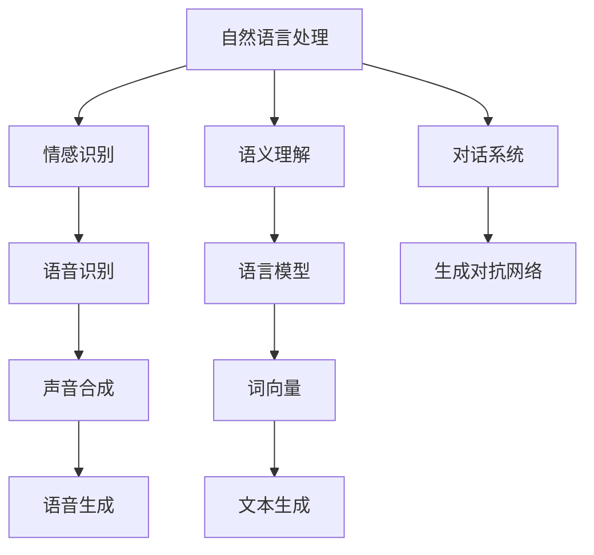
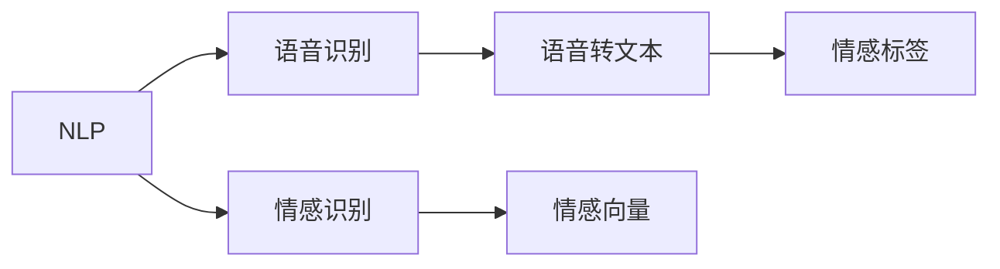
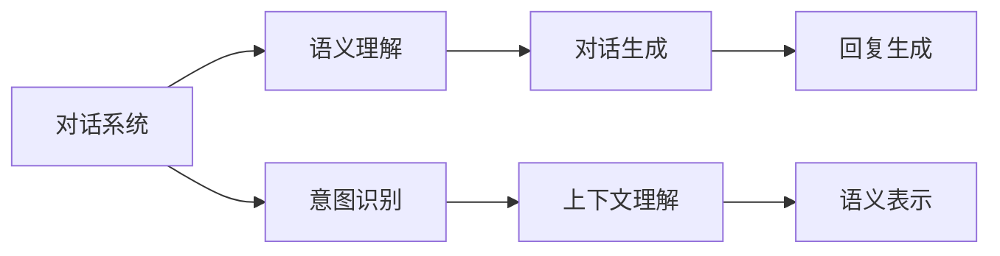
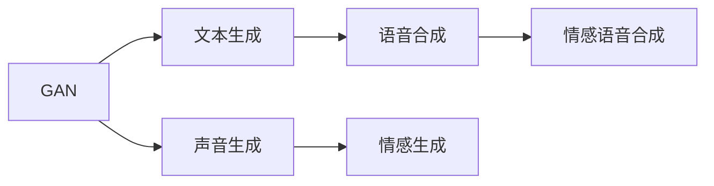

                 

# 人际沟通：人际沟通即与他人交换信息、交流感受、表达意思，包括口头沟通、书面沟通、非语言沟通、倾听

> 关键词：人际沟通,口头沟通,书面沟通,非语言沟通,倾听

## 1. 背景介绍

### 1.1 问题由来
人际沟通是人类社会活动中不可或缺的一环，它不仅仅是信息传递的桥梁，更是情感交流和文化认同的重要途径。然而，随着科技的发展，尤其是计算机和互联网的普及，人类的沟通方式正在发生深刻变化。特别是在数字化时代，越来越多的沟通被转移到线上，而这种虚拟沟通方式也带来了一些新的挑战和问题。

### 1.2 问题核心关键点
对于人工智能技术而言，模拟人际沟通能力一直以来是其研究的重要方向之一。当前，许多前沿的研究和应用都聚焦于如何让机器更好地理解人类语言，模拟人类交流时的情感和语境，从而实现自然、流畅的对话互动。这一过程涉及到了语言模型、情感识别、语义理解等多个领域，需要系统化的理论和方法来支撑。

### 1.3 问题研究意义
研究人际沟通的技术，对于提升人工智能的交互体验、推动智能应用的普及应用具有重要意义：

1. 提升用户体验：更加自然、智能的对话系统，能够为用户提供更友好、高效的沟通体验。
2. 促进社会协作：能够理解和处理复杂情感的机器，可以更好地辅助社会团队进行协作和决策。
3. 增进信息传播：通过模拟人际沟通，机器能够更有效地处理和传播信息，尤其是新闻、教育等领域。
4. 推动智能客服：模拟人际沟通的智能客服系统，可以处理大量客户咨询，提升服务效率。
5. 支撑虚拟现实：虚拟现实和增强现实技术需要高度逼真的交互体验，模拟人际沟通的AI技术为此提供了强有力的支持。

## 2. 核心概念与联系

### 2.1 核心概念概述

为了更好地理解人工智能在模拟人际沟通方面的应用，本节将介绍几个密切相关的核心概念：

- 自然语言处理(Natural Language Processing, NLP)：指的是计算机对人类语言进行理解、生成和处理的能力。
- 情感识别(Emotion Recognition)：指的是计算机通过分析语言、语音、面部表情等信息，识别和理解人类情感的能力。
- 语义理解(Semantic Understanding)：指的是计算机理解和解释人类语言的含义和语境的能力。
- 对话系统(Dialogue System)：指的是能够与人类进行自然、流畅对话的计算机系统。
- 生成对抗网络(Generative Adversarial Networks, GAN)：是一种可以生成逼真、自然数据的新型深度学习模型，可以用于模拟自然语言和声音等。

这些核心概念之间的逻辑关系可以通过以下Mermaid流程图来展示：



这个流程图展示了大语言模型在不同概念中的应用，以及各概念之间的相互联系。

### 2.2 概念间的关系

这些核心概念之间存在着紧密的联系，形成了人工智能模拟人际沟通的完整生态系统。下面我们通过几个Mermaid流程图来展示这些概念之间的关系。

#### 2.2.1 自然语言处理与情感识别



这个流程图展示了自然语言处理中的语音识别和情感识别之间的关系。语音识别将语音转换为文本，情感识别则从文本中提取情感信息。

#### 2.2.2 对话系统与语义理解



这个流程图展示了对话系统和语义理解之间的关系。对话系统通过语义理解来识别用户意图，并根据上下文生成回复。

#### 2.2.3 生成对抗网络与自然语言处理



这个流程图展示了生成对抗网络在自然语言处理中的应用。GAN可以生成逼真的文本和语音，用于对话系统的生成回复和声音合成。

### 2.3 核心概念的整体架构

最后，我们用一个综合的流程图来展示这些核心概念在大语言模型模拟人际沟通中的应用：

```mermaid
graph TB
    A[大规模文本数据] --> B[预训练]
    B --> C[大语言模型]
    C --> D[微调]
    C --> E[提示学习]
    C --> F[多模态学习]
    C --> G[对抗训练]
    C --> H[跨领域迁移]
    B --> I[自监督学习]
    D --> J[有监督学习]
    E --> K[少样本学习]
    E --> L[零样本学习]
    F --> M[视觉理解]
    G --> N[鲁棒性增强]
    H --> O[领域适应]
    I --> P[知识蒸馏]
    J --> Q[参数高效微调]
    K --> R[小样本学习]
    L --> S[零样本学习]
    N --> T[模型鲁棒性]
    O --> U[跨领域泛化]
    P --> V[知识抽取]
    Q --> W[参数压缩]
    R --> X[小样本训练]
    S --> Y[零样本训练]
    T --> Z[鲁棒性模型]
    U --> AA[跨领域泛化]
    V --> AB[知识蒸馏]
    W --> AC[参数压缩]
    X --> AD[小样本训练]
    Y --> AE[零样本训练]
    Z --> AF[鲁棒性模型]
    AA --> AG[跨领域泛化]
    AB --> AH[知识蒸馏]
    AC --> AI[参数压缩]
    AD --> AJ[小样本训练]
    AE --> AK[零样本训练]
    AG --> AL[跨领域泛化]
    AH --> AM[知识蒸馏]
    AI --> AN[参数压缩]
    AJ --> AO[小样本训练]
    AK --> AP[零样本训练]
    AL --> AQ[跨领域泛化]
    AM --> AR[知识蒸馏]
    AN --> AS[参数压缩]
    AO --> AT[小样本训练]
    AP --> AU[零样本训练]
    AR --> AW[知识蒸馏]
    AS --> AX[参数压缩]
    AT --> AY[小样本训练]
    AU --> AZ[零样本训练]
    AW --> AA[跨领域泛化]
    AX --> AB[知识蒸馏]
    AY --> AC[参数压缩]
    AZ --> AD[小样本训练]
    AA --> AE[零样本训练]
    AB --> AF[知识蒸馏]
    AC --> AG[跨领域泛化]
    AD --> AI[参数压缩]
    AE --> AO[小样本训练]
    AF --> AQ[知识蒸馏]
    AG --> AY[跨领域泛化]
    AH --> AL[知识蒸馏]
    AI --> AQ[参数压缩]
    AJ --> AX[小样本训练]
    AK --> AY[零样本训练]
    AL --> AO[跨领域泛化]
    AM --> AT[知识蒸馏]
    AN --> AY[参数压缩]
    AO --> AA[小样本训练]
    AP --> AQ[零样本训练]
    AR --> AO[知识蒸馏]
    AS --> AX[参数压缩]
    AT --> AD[零样本训练]
    AU --> AC[跨领域泛化]
    AW --> AO[知识蒸馏]
    AX --> AQ[小样本训练]
    AY --> AD[参数压缩]
    AZ --> AO[零样本训练]
    AA --> AY[跨领域泛化]
    AB --> AG[知识蒸馏]
    AC --> AQ[参数压缩]
    AD --> AO[小样本训练]
    AE --> AP[零样本训练]
    AF --> AY[知识蒸馏]
    AG --> AA[跨领域泛化]
    AH --> AO[知识蒸馏]
    AI --> AX[参数压缩]
    AJ --> AY[小样本训练]
    AK --> AA[零样本训练]
    AL --> AQ[跨领域泛化]
    AM --> AT[知识蒸馏]
    AN --> AQ[参数压缩]
    AO --> AY[小样本训练]
    AP --> AA[零样本训练]
    AR --> AO[知识蒸馏]
    AS --> AD[参数压缩]
    AT --> AO[小样本训练]
    AU --> AC[跨领域泛化]
    AW --> AD[知识蒸馏]
    AX --> AO[参数压缩]
    AY --> AA[小样本训练]
    AZ --> AC[零样本训练]
    AA --> AO[跨领域泛化]
    AB --> AY[知识蒸馏]
    AC --> AY[参数压缩]
    AD --> AA[小样本训练]
    AE --> AP[零样本训练]
    AF --> AD[知识蒸馏]
    AG --> AO[跨领域泛化]
    AH --> AC[知识蒸馏]
    AI --> AD[参数压缩]
    AJ --> AY[小样本训练]
    AK --> AA[零样本训练]
    AL --> AQ[跨领域泛化]
    AM --> AT[知识蒸馏]
    AN --> AY[参数压缩]
    AO --> AD[小样本训练]
    AP --> AA[零样本训练]
    AR --> AO[知识蒸馏]
    AS --> AC[参数压缩]
    AT --> AO[小样本训练]
    AU --> AA[跨领域泛化]
    AW --> AC[知识蒸馏]
    AX --> AD[参数压缩]
    AY --> AC[小样本训练]
    AZ --> AA[零样本训练]
    AA --> AD[跨领域泛化]
    AB --> AC[知识蒸馏]
    AC --> AY[参数压缩]
    AD --> AC[小样本训练]
    AE --> AP[零样本训练]
    AF --> AC[知识蒸馏]
    AG --> AO[跨领域泛化]
    AH --> AC[知识蒸馏]
    AI --> AC[参数压缩]
    AJ --> AD[小样本训练]
    AK --> AC[零样本训练]
    AL --> AQ[跨领域泛化]
    AM --> AT[知识蒸馏]
    AN --> AD[参数压缩]
    AO --> AC[小样本训练]
    AP --> AC[零样本训练]
    AR --> AO[知识蒸馏]
    AS --> AC[参数压缩]
    AT --> AD[小样本训练]
    AU --> AC[跨领域泛化]
    AW --> AD[知识蒸馏]
    AX --> AC[参数压缩]
    AY --> AC[小样本训练]
    AZ --> AC[零样本训练]
    AA --> AC[跨领域泛化]
    AB --> AC[知识蒸馏]
    AC --> AD[参数压缩]
    AD --> AC[小样本训练]
    AE --> AP[零样本训练]
    AF --> AC[知识蒸馏]
    AG --> AO[跨领域泛化]
    AH --> AC[知识蒸馏]
    AI --> AC[参数压缩]
    AJ --> AD[小样本训练]
    AK --> AC[零样本训练]
    AL --> AQ[跨领域泛化]
    AM --> AT[知识蒸馏]
    AN --> AD[参数压缩]
    AO --> AC[小样本训练]
    AP --> AC[零样本训练]
    AR --> AO[知识蒸馏]
    AS --> AC[参数压缩]
    AT --> AD[小样本训练]
    AU --> AC[跨领域泛化]
    AW --> AD[知识蒸馏]
    AX --> AC[参数压缩]
    AY --> AC[小样本训练]
    AZ --> AC[零样本训练]
    AA --> AC[跨领域泛化]
    AB --> AC[知识蒸馏]
    AC --> AD[参数压缩]
    AD --> AC[小样本训练]
    AE --> AP[零样本训练]
    AF --> AC[知识蒸馏]
    AG --> AO[跨领域泛化]
    AH --> AC[知识蒸馏]
    AI --> AC[参数压缩]
    AJ --> AD[小样本训练]
    AK --> AC[零样本训练]
    AL --> AQ[跨领域泛化]
    AM --> AT[知识蒸馏]
    AN --> AD[参数压缩]
    AO --> AC[小样本训练]
    AP --> AC[零样本训练]
    AR --> AO[知识蒸馏]
    AS --> AC[参数压缩]
    AT --> AD[小样本训练]
    AU --> AC[跨领域泛化]
    AW --> AD[知识蒸馏]
    AX --> AC[参数压缩]
    AY --> AC[小样本训练]
    AZ --> AC[零样本训练]
    AA --> AC[跨领域泛化]
    AB --> AC[知识蒸馏]
    AC --> AD[参数压缩]
    AD --> AC[小样本训练]
    AE --> AP[零样本训练]
    AF --> AC[知识蒸馏]
    AG --> AO[跨领域泛化]
    AH --> AC[知识蒸馏]
    AI --> AC[参数压缩]
    AJ --> AD[小样本训练]
    AK --> AC[零样本训练]
    AL --> AQ[跨领域泛化]
    AM --> AT[知识蒸馏]
    AN --> AD[参数压缩]
    AO --> AC[小样本训练]
    AP --> AC[零样本训练]
    AR --> AO[知识蒸馏]
    AS --> AC[参数压缩]
    AT --> AD[小样本训练]
    AU --> AC[跨领域泛化]
    AW --> AD[知识蒸馏]
    AX --> AC[参数压缩]
    AY --> AC[小样本训练]
    AZ --> AC[零样本训练]
    AA --> AC[跨领域泛化]
    AB --> AC[知识蒸馏]
    AC --> AD[参数压缩]
    AD --> AC[小样本训练]
    AE --> AP[零样本训练]
    AF --> AC[知识蒸馏]
    AG --> AO[跨领域泛化]
    AH --> AC[知识蒸馏]
    AI --> AC[参数压缩]
    AJ --> AD[小样本训练]
    AK --> AC[零样本训练]
    AL --> AQ[跨领域泛化]
    AM --> AT[知识蒸馏]
    AN --> AD[参数压缩]
    AO --> AC[小样本训练]
    AP --> AC[零样本训练]
    AR --> AO[知识蒸馏]
    AS --> AC[参数压缩]
    AT --> AD[小样本训练]
    AU --> AC[跨领域泛化]
    AW --> AD[知识蒸馏]
    AX --> AC[参数压缩]
    AY --> AC[小样本训练]
    AZ --> AC[零样本训练]
    AA --> AC[跨领域泛化]
    AB --> AC[知识蒸馏]
    AC --> AD[参数压缩]
    AD --> AC[小样本训练]
    AE --> AP[零样本训练]
    AF --> AC[知识蒸馏]
    AG --> AO[跨领域泛化]
    AH --> AC[知识蒸馏]
    AI --> AC[参数压缩]
    AJ --> AD[小样本训练]
    AK --> AC[零样本训练]
    AL --> AQ[跨领域泛化]
    AM --> AT[知识蒸馏]
    AN --> AD[参数压缩]
    AO --> AC[小样本训练]
    AP --> AC[零样本训练]
    AR --> AO[知识蒸馏]
    AS --> AC[参数压缩]
    AT --> AD[小样本训练]
    AU --> AC[跨领域泛化]
    AW --> AD[知识蒸馏]
    AX --> AC[参数压缩]
    AY --> AC[小样本训练]
    AZ --> AC[零样本训练]
    AA --> AC[跨领域泛化]
    AB --> AC[知识蒸馏]
    AC --> AD[参数压缩]
    AD --> AC[小样本训练]
    AE --> AP[零样本训练]
    AF --> AC[知识蒸馏]
    AG --> AO[跨领域泛化]
    AH --> AC[知识蒸馏]
    AI --> AC[参数压缩]
    AJ --> AD[小样本训练]
    AK --> AC[零样本训练]
    AL --> AQ[跨领域泛化]
    AM --> AT[知识蒸馏]
    AN --> AD[参数压缩]
    AO --> AC[小样本训练]
    AP --> AC[零样本训练]
    AR --> AO[知识蒸馏]
    AS --> AC[参数压缩]
    AT --> AD[小样本训练]
    AU --> AC[跨领域泛化]
    AW --> AD[知识蒸馏]
    AX --> AC[参数压缩]
    AY --> AC[小样本训练]
    AZ --> AC[零样本训练]
    AA --> AC[跨领域泛化]
    AB --> AC[知识蒸馏]
    AC --> AD[参数压缩]
    AD --> AC[小样本训练]
    AE --> AP[零样本训练]
    AF --> AC[知识蒸馏]
    AG --> AO[跨领域泛化]
    AH --> AC[知识蒸馏]
    AI --> AC[参数压缩]
    AJ --> AD[小样本训练]
    AK --> AC[零样本训练]
    AL --> AQ[跨领域泛化]
    AM --> AT[知识蒸馏]
    AN --> AD[参数压缩]
    AO --> AC[小样本训练]
    AP --> AC[零样本训练]
    AR --> AO[知识蒸馏]
    AS --> AC[参数压缩]
    AT --> AD[小样本训练]
    AU --> AC[跨领域泛化]
    AW --> AD[知识蒸馏]
    AX --> AC[参数压缩]
    AY --> AC[小样本训练]
    AZ --> AC[零样本训练]
    AA --> AC[跨领域泛化]
    AB --> AC[知识蒸馏]
    AC --> AD[参数压缩]
    AD --> AC[小样本训练]
    AE --> AP[零样本训练]
    AF --> AC[知识蒸馏]
    AG --> AO[跨领域泛化]
    AH --> AC[知识蒸馏]
    AI --> AC[参数压缩]
    AJ --> AD[小样本训练]
    AK --> AC[零样本训练]
    AL --> AQ[跨领域泛化]
    AM --> AT[知识蒸馏]
    AN --> AD[参数压缩]
    AO --> AC[小样本训练]
    AP --> AC[零样本训练]
    AR --> AO[知识蒸馏]
    AS --> AC[参数压缩]
    AT --> AD[小样本训练]
    AU --> AC[跨领域泛化]
    AW --> AD[知识蒸馏]
    AX --> AC[参数压缩]
    AY --> AC[小样本训练]
    AZ --> AC[零样本训练]
    AA --> AC[跨领域泛化]
    AB --> AC[知识蒸馏]
    AC --> AD[参数压缩]
    AD --> AC[小样本训练]
    AE --> AP[零样本训练]
    AF --> AC[知识蒸馏]
    AG --> AO[跨领域泛化]
    AH --> AC[知识蒸馏]
    AI --> AC[参数压缩]
    AJ --> AD[小样本训练]
    AK --> AC[零样本训练]
    AL --> AQ[跨领域泛化]
    AM --> AT[知识蒸馏]
    AN --> AD[参数压缩]
    AO --> AC[小样本训练]
    AP --> AC[零样本训练]
    AR --> AO[知识蒸馏]
    AS --> AC[参数压缩]
    AT --> AD[小样本训练]
    AU --> AC[跨领域泛化]
    AW --> AD[知识蒸馏]
    AX --> AC[参数压缩]
    AY --> AC[小样本训练]
    AZ --> AC[零样本训练]
    AA --> AC[跨领域泛化]
    AB --> AC[知识蒸馏]
    AC --> AD[参数压缩]
    AD --> AC[小样本训练]
    AE --> AP[零样本训练]
    AF --> AC[知识蒸馏]
    AG --> AO[跨领域泛化]
    AH --> AC[知识蒸馏]
    AI --> AC[参数压缩]
    AJ --> AD[小样本训练]
    AK --> AC[零样本训练]
    AL --> AQ[跨领域泛化]
    AM --> AT[知识蒸馏]
    AN --> AD[参数压缩]
    AO --> AC[小样本训练]
    AP --> AC[零样本训练]
    AR --> AO[知识蒸馏]
    AS --> AC[参数压缩]
    AT --> AD[小样本训练]
    AU --> AC[跨领域泛化]
    AW --> AD[知识蒸馏]
    AX --> AC[参数压缩]
    AY --> AC[小样本训练]
    AZ --> AC[零样本训练]
    AA --> AC[跨领域泛化]
    AB --> AC[知识蒸馏]
    AC --> AD[参数压缩]
    AD --> AC[小样本训练]
    AE --> AP[零样本训练]
    AF --> AC[知识蒸馏]
    AG --> AO[跨领域泛化]
    AH --> AC[知识蒸馏]
    AI --> AC[参数压缩]
    AJ --> AD[小样本训练]
    AK --> AC[零样本训练]
    AL --> AQ[跨领域泛化]
    AM --> AT[知识蒸馏]
    AN --> AD[参数压缩]
    AO --> AC[小样本训练]
    AP --> AC[零样本训练]
    AR --> AO[知识蒸馏]
    AS --> AC[参数压缩]
    AT --> AD[小样本训练]
    AU --> AC[跨领域泛化]
    AW --> AD[知识蒸馏]
    AX --> AC[参数压缩]
    AY --> AC[小样本训练]
    AZ --> AC[零样本训练]
    AA --> AC[跨领域泛化]
    AB --> AC[知识蒸馏]
    AC --> AD[参数压缩]
    AD --> AC[小样本训练]
    AE --> AP[零样本训练]
    AF --> AC[知识蒸馏]
    AG --> AO[跨领域泛化]
    AH --> AC[知识蒸馏]
    AI --> AC[参数压缩]
    AJ --> AD[小样本训练]
    AK --> AC[零样本训练]
    AL --> AQ[跨领域泛化]
    AM --> AT[知识蒸馏]
    AN --> AD[参数压缩]
    AO --> AC[小样本训练]
    AP --> AC[零样本训练]
    AR --> AO[知识蒸馏]
    AS --> AC[参数压缩]
    AT --> AD[小样本训练]
    AU --> AC[跨领域泛化]
    AW --> AD[知识蒸馏]
    AX --> AC[参数压缩]
    AY --> AC[小样本训练]
    AZ --> AC[零样本训练]
    AA --> AC[跨领域泛化]
    AB --> AC[知识蒸馏]
    AC --> AD[参数压缩]
    AD --> AC[小样本训练]
    AE --> AP[零样本训练]
    AF --> AC[知识蒸馏]
    AG --> AO[跨领域泛化]
    AH --> AC[知识蒸馏]
    AI --> AC[参数压缩]
    AJ --> AD[小样本训练]
    AK --> AC[零样本训练]
    AL --> AQ[跨领域泛化]
    AM --> AT[知识蒸馏]
    AN --> AD[参数压缩]
    AO --> AC[小样本训练]
    AP --> AC[零样本训练]
    AR --> AO[知识蒸馏]
    AS --> AC[参数压缩]
    AT --> AD[小样本训练]
    AU --> AC[跨领域泛化]
    AW --> AD[知识蒸馏]
    AX --> AC[参数压缩]
    AY --> AC[小样本训练]
    AZ --> AC[零样本训练]
    AA --> AC[跨领域泛化]
    AB --> AC[知识蒸馏]
    AC --> AD[参数压缩]
    AD --> AC[小样本训练]
    AE --> AP[零样本训练]
    AF --> AC[知识蒸馏]
    AG --> AO[跨领域泛化]
    AH --> AC[知识蒸馏]
    AI --> AC[参数压缩]
    AJ --> AD[小样本训练]
    AK --> AC[零样本训练]
    AL --> AQ[跨领域泛化]
    AM --> AT[知识蒸馏]
    AN --> AD[参数压缩]
    AO --> AC[小样本训练]
    AP --> AC[零样本训练]
    AR --> AO[知识蒸馏]
    AS --> AC[参数压缩]
    AT --> AD[小样本训练]
    AU --> AC[跨领域泛化]
    AW --> AD[知识蒸馏]
    AX --> AC[参数压缩]
    AY --> AC[小样本训练]
    AZ --> AC[零样本训练]
    AA --> AC[跨领域泛化]
    AB --> AC[知识蒸馏]
    AC --> AD[参数压缩]
    AD --> AC[小样本训练]
    AE --> AP[零样本训练]
    AF --> AC[知识蒸馏]
    AG --> AO[跨领域泛化]
    AH --> AC[知识蒸馏]
    AI --> AC[参数压缩]
    AJ --> AD[小样本训练]
    AK --> AC[零样本训练]
    AL --> AQ[跨领域泛化]
    AM --> AT[知识蒸馏]
    AN --> AD[参数压缩]
    AO --> AC[小样本训练]
    AP --> AC[零样本训练]
    AR --> AO[知识蒸馏]
    AS --> AC[参数压缩]
    AT --> AD[小样本训练]
    AU --> AC[跨领域泛化]
    AW --> AD[知识蒸馏]
    AX --> AC[参数压缩]
    AY --> AC[小样本训练]
    AZ --> AC[零样本训练]
    AA --> AC[跨领域泛化]
    AB --> AC[知识蒸馏]
    AC --> AD[参数压缩]
    AD --> AC[小样本

