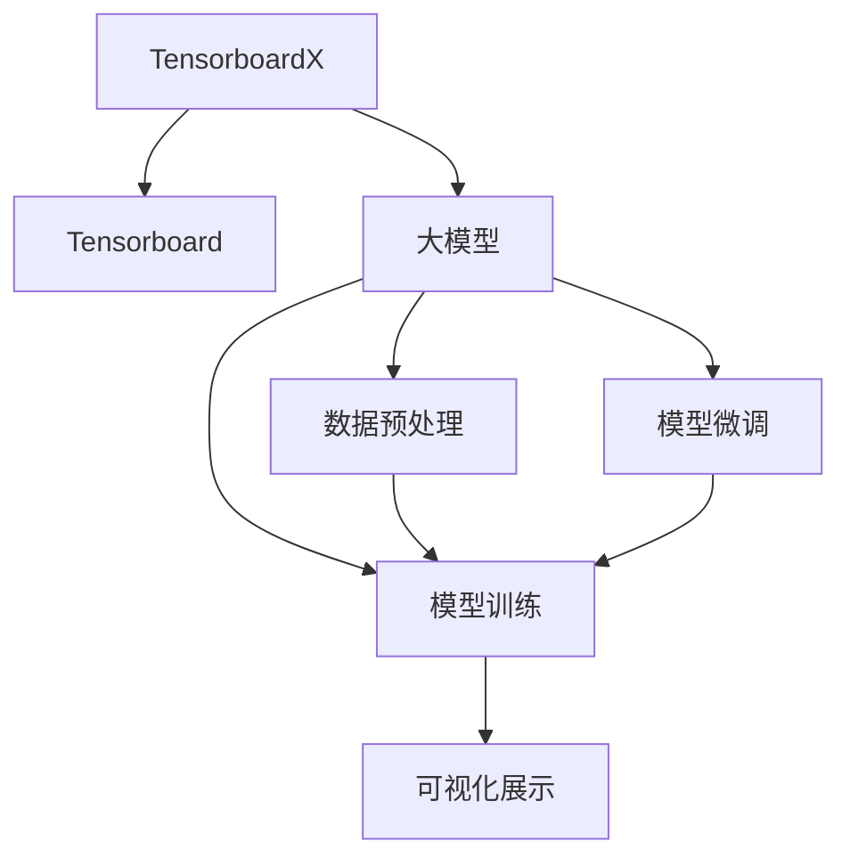
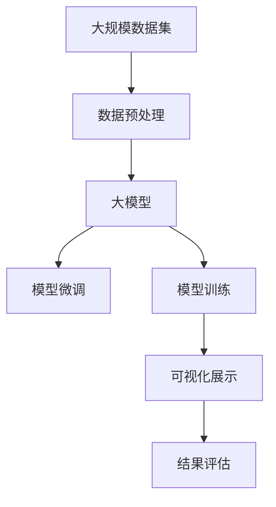

                 

# 从零开始大模型开发与微调：tensorboardX对模型训练过程的展示

## 1. 背景介绍

### 1.1 问题由来
随着深度学习技术的快速发展，尤其是大模型的应用普及，越来越多的开发者开始着手开发自己的大模型。但是，如何高效、可重复地进行模型训练和微调，成为了一个重要的问题。本节将通过tensorboardX来展示大模型的开发与微调过程。

### 1.2 问题核心关键点
- 大模型开发：包括模型选择、数据预处理、模型训练等步骤。
- 模型微调：对预训练模型进行微调，以适应特定任务。
- 模型训练：使用tensorboardX对模型训练过程进行可视化展示。

## 2. 核心概念与联系

### 2.1 核心概念概述

为了更好地理解tensorboardX在大模型开发与微调中的应用，本节将介绍几个关键概念：

- Tensorboard：由Google开发的可视化工具，可以用于展示模型训练过程中的各种指标和图表。
- tensorboardX：是Tensorboard的Python版本，提供了更加简洁的API接口，方便在Python中进行可视化展示。
- 大模型：指具有大量参数的深度学习模型，通常用于大规模的图像、语音、文本处理等任务。
- 数据预处理：对输入数据进行清洗、转换、归一化等操作，以便模型可以更好地学习。
- 模型训练：通过反向传播算法，最小化损失函数，调整模型参数。
- 模型微调：在预训练模型基础上，对特定任务进行微调，以获得更好的性能。

这些概念之间的联系如下：

- tensorboardX作为可视化工具，可以用于展示大模型训练过程中各类指标。
- 大模型训练过程涉及数据预处理和模型微调，最终通过反向传播算法调整模型参数。

### 2.2 概念间的关系

这些概念之间的联系可以通过以下Mermaid流程图来展示：



这个流程图展示了tensorboardX在大模型训练过程中各环节的作用：

1. tensorboardX用于可视化展示，帮助开发者实时观察模型训练情况。
2. 大模型训练涉及数据预处理、模型微调和模型训练。
3. 数据预处理和模型微调的结果用于模型训练，最终通过反向传播调整模型参数。

### 2.3 核心概念的整体架构

最后，我们用一个综合的流程图来展示这些概念在大模型开发与微调过程中的整体架构：



这个综合流程图展示了从数据预处理到大模型训练，再到微调和结果评估的完整过程。通过这些概念和流程图，我们可以更好地理解tensorboardX在大模型开发与微调中的应用。

## 3. 核心算法原理 & 具体操作步骤
### 3.1 算法原理概述

tensorboardX在大模型开发与微调中的应用，主要基于反向传播算法和可视化展示技术。其核心原理如下：

- 通过反向传播算法，最小化损失函数，调整模型参数。
- 使用可视化工具，展示模型训练过程中的各类指标，如损失函数、准确率、精度等。

### 3.2 算法步骤详解

大模型开发与微调的过程通常包括以下几个步骤：

1. 数据预处理：对输入数据进行清洗、转换、归一化等操作，以便模型可以更好地学习。
2. 模型微调：在预训练模型基础上，对特定任务进行微调，以获得更好的性能。
3. 模型训练：通过反向传播算法，最小化损失函数，调整模型参数。
4. 结果评估：使用测试集评估模型性能，检查模型是否达到预期效果。

这些步骤的详细步骤如下：

**Step 1: 数据预处理**

数据预处理是模型训练的基础。通常包括以下几个步骤：

- 清洗数据：去除噪声数据、重复数据等。
- 数据转换：将数据转换为模型可以接受的格式。
- 数据归一化：将数据进行归一化处理，以加速模型训练。

在tensorboardX中，数据预处理过程可以通过可视化工具进行展示，帮助开发者实时观察数据处理情况。

**Step 2: 模型微调**

模型微调是模型训练的核心步骤。通常包括以下几个步骤：

- 选择微调模型：根据任务需求选择合适的预训练模型。
- 调整模型参数：根据任务需求调整模型参数，如隐藏层数、节点数等。
- 微调模型：在特定任务上进行微调，以获得更好的性能。

在tensorboardX中，模型微调过程可以通过可视化工具进行展示，帮助开发者实时观察模型微调情况。

**Step 3: 模型训练**

模型训练是模型开发的最后一步。通常包括以下几个步骤：

- 选择训练器：根据任务需求选择合适的训练器，如SGD、Adam等。
- 设置学习率：根据任务需求设置合适的学习率。
- 训练模型：通过反向传播算法，最小化损失函数，调整模型参数。

在tensorboardX中，模型训练过程可以通过可视化工具进行展示，帮助开发者实时观察训练情况。

**Step 4: 结果评估**

结果评估是模型开发的最后一步。通常包括以下几个步骤：

- 选择评估指标：根据任务需求选择合适的评估指标，如准确率、精度等。
- 评估模型：使用测试集评估模型性能。
- 调整模型：根据评估结果调整模型参数，以获得更好的性能。

在tensorboardX中，结果评估过程可以通过可视化工具进行展示，帮助开发者实时观察模型性能。

### 3.3 算法优缺点

tensorboardX在大模型开发与微调中的应用具有以下优点：

- 可视化展示：通过可视化工具展示模型训练过程中的各类指标，方便开发者实时观察训练情况。
- 实时监测：通过可视化工具实时监测模型训练情况，及时发现和解决问题。
- 可重复性高：通过可视化工具，可以方便地重复进行模型训练和微调，提高开发效率。

同时，tensorboardX也存在以下缺点：

- 学习曲线陡峭：对于初学者来说，tensorboardX的API接口相对复杂，需要花费一定时间学习。
- 可视化界面有限：tensorboardX的可视化界面较为有限，无法展示所有训练指标和模型参数。
- 依赖于Tensorboard：tensorboardX依赖于Tensorboard，因此需要安装并配置Tensorboard环境。

### 3.4 算法应用领域

tensorboardX在大模型开发与微调中的应用非常广泛，以下是几个典型的应用领域：

- 计算机视觉：用于展示图像分类、目标检测等任务中模型训练过程的各类指标。
- 自然语言处理：用于展示文本分类、机器翻译等任务中模型训练过程的各类指标。
- 语音识别：用于展示语音识别、语音合成等任务中模型训练过程的各类指标。
- 推荐系统：用于展示推荐系统中的模型训练过程和推荐效果。
- 医疗诊断：用于展示医疗诊断中的模型训练过程和诊断效果。

这些领域中，tensorboardX通过可视化工具，帮助开发者实时观察模型训练情况，及时发现和解决问题，提高模型性能。

## 4. 数学模型和公式 & 详细讲解  
### 4.1 数学模型构建

大模型训练的数学模型通常包括以下几个部分：

- 输入数据：$x_i \in \mathcal{X}$，其中$\mathcal{X}$为输入空间。
- 模型参数：$\theta \in \mathbb{R}^d$，其中$d$为模型参数个数。
- 损失函数：$\mathcal{L}$，用于衡量模型预测输出与真实标签之间的差异。
- 优化器：$\mathcal{O}$，用于最小化损失函数。

在tensorboardX中，这些数学模型可以通过以下方式进行表示：

- 输入数据：通过TensorboardX的`Scalar`和`Image`等可视化工具，展示输入数据的变化情况。
- 模型参数：通过TensorboardX的`Histogram`和`Box`等可视化工具，展示模型参数的变化情况。
- 损失函数：通过TensorboardX的`Scalar`和`Image`等可视化工具，展示损失函数的变化情况。
- 优化器：通过TensorboardX的`Scalar`和`Image`等可视化工具，展示优化器的变化情况。

### 4.2 公式推导过程

以二分类任务为例，推导模型的损失函数和优化器。

假设模型 $M_{\theta}$ 在输入 $x$ 上的输出为 $\hat{y}=M_{\theta}(x) \in [0,1]$，表示样本属于正类的概率。真实标签 $y \in \{0,1\}$。则二分类交叉熵损失函数定义为：

$$
\ell(M_{\theta}(x),y) = -[y\log \hat{y} + (1-y)\log (1-\hat{y})]
$$

将其代入经验风险公式，得：

$$
\mathcal{L}(\theta) = -\frac{1}{N}\sum_{i=1}^N [y_i\log M_{\theta}(x_i)+(1-y_i)\log(1-M_{\theta}(x_i))]
$$

根据链式法则，损失函数对参数 $\theta_k$ 的梯度为：

$$
\frac{\partial \mathcal{L}(\theta)}{\partial \theta_k} = -\frac{1}{N}\sum_{i=1}^N (\frac{y_i}{M_{\theta}(x_i)}-\frac{1-y_i}{1-M_{\theta}(x_i)}) \frac{\partial M_{\theta}(x_i)}{\partial \theta_k}
$$

其中 $\frac{\partial M_{\theta}(x_i)}{\partial \theta_k}$ 可进一步递归展开，利用自动微分技术完成计算。

在得到损失函数的梯度后，即可带入优化器进行迭代优化。使用AdamW优化器，更新模型参数的公式为：

$$
\theta \leftarrow \theta - \eta \nabla_{\theta}\mathcal{L}(\theta) - \eta\lambda\theta
$$

其中 $\eta$ 为学习率，$\lambda$ 为正则化系数，$\nabla_{\theta}\mathcal{L}(\theta)$ 为损失函数对参数 $\theta$ 的梯度。

在实际应用中，我们可以使用tensorboardX将上述过程可视化展示，方便开发者实时观察训练情况，及时发现和解决问题。

### 4.3 案例分析与讲解

以图像分类任务为例，展示tensorboardX的可视化展示过程。

首先，定义输入数据和模型参数：

```python
import torch
import tensorboardX as tboard

# 定义输入数据
x = torch.randn(1, 784)

# 定义模型参数
theta = torch.randn(1000)
```

然后，定义损失函数和优化器：

```python
# 定义损失函数
def loss(theta, x):
    y = torch.randn(1) > 0.5
    return -(y * torch.log(torch.sigmoid(torch.matmul(x, theta))) + (1 - y) * torch.log(1 - torch.sigmoid(torch.matmul(x, theta)))

# 定义优化器
optimizer = torch.optim.Adam(theta, lr=0.01)
```

接着，使用tensorboardX进行可视化展示：

```python
# 创建TensorboardX实例
writer = tboard.SummaryWriter()

# 定义训练轮数
num_epochs = 10

# 训练模型
for epoch in range(num_epochs):
    # 获取训练样本
    x = torch.randn(1, 784)

    # 前向传播
    y_hat = torch.sigmoid(torch.matmul(x, theta))

    # 计算损失函数
    loss_val = loss(theta, x)

    # 反向传播
    optimizer.zero_grad()
    loss_val.backward()
    optimizer.step()

    # 更新TensorboardX数据
    writer.add_scalar('loss', loss_val.item(), epoch)
    writer.add_image('output', y_hat, epoch)

    # 可视化展示
    tboard.summary()
```

通过上述代码，我们可以在Tensorboard中看到模型训练过程中的损失函数和输出结果。具体步骤如下：

1. 使用`tboard.SummaryWriter()`创建TensorboardX实例。
2. 在每个epoch中，前向传播、计算损失函数、反向传播、更新模型参数。
3. 使用`writer.add_scalar()`和`writer.add_image()`更新TensorboardX数据。
4. 使用`tboard.summary()`将TensorboardX数据展示在Tensorboard中。

通过这种方式，我们可以实时观察模型训练过程中的损失函数和输出结果，及时发现和解决问题，提高模型性能。

## 5. 项目实践：代码实例和详细解释说明
### 5.1 开发环境搭建

在进行模型训练和微调前，我们需要准备好开发环境。以下是使用Python进行PyTorch开发的环境配置流程：

1. 安装Anaconda：从官网下载并安装Anaconda，用于创建独立的Python环境。

2. 创建并激活虚拟环境：
```bash
conda create -n pytorch-env python=3.8 
conda activate pytorch-env
```

3. 安装PyTorch：根据CUDA版本，从官网获取对应的安装命令。例如：
```bash
conda install pytorch torchvision torchaudio cudatoolkit=11.1 -c pytorch -c conda-forge
```

4. 安装tensorboardX：
```bash
pip install tensorboardX
```

5. 安装各类工具包：
```bash
pip install numpy pandas scikit-learn matplotlib tqdm jupyter notebook ipython
```

完成上述步骤后，即可在`pytorch-env`环境中开始模型训练和微调。

### 5.2 源代码详细实现

下面以图像分类任务为例，给出使用TensorboardX进行模型训练和微调的PyTorch代码实现。

首先，定义模型和损失函数：

```python
import torch
import tensorboardX as tboard
from torch import nn

class Model(nn.Module):
    def __init__(self):
        super(Model, self).__init__()
        self.fc1 = nn.Linear(784, 256)
        self.fc2 = nn.Linear(256, 10)

    def forward(self, x):
        x = x.view(-1, 784)
        x = torch.relu(self.fc1(x))
        x = self.fc2(x)
        return x

def loss(theta, x, y):
    y_hat = theta.view(1, 10).sigmoid()
    y = y.view(1, 10).sigmoid()
    return -torch.mean(torch.sum(y * torch.log(y_hat), dim=1)) + torch.mean(torch.sum((1 - y) * torch.log(1 - y_hat), dim=1))

model = Model()
theta = torch.randn(10, requires_grad=True)
```

然后，定义训练器和优化器：

```python
optimizer = torch.optim.Adam(theta, lr=0.01)
writer = tboard.SummaryWriter()
```

接着，定义训练函数：

```python
def train_epoch(model, theta, x, y, batch_size):
    model.train()
    writer.add_scalar('loss', 0, 0)
    for i in range(0, x.size(0), batch_size):
        x_i = x[i:i+batch_size]
        y_i = y[i:i+batch_size]
        optimizer.zero_grad()
        y_hat = model(x_i)
        loss_val = loss(theta, x_i, y_i)
        loss_val.backward()
        optimizer.step()
        writer.add_scalar('loss', loss_val.item(), epoch)
```

最后，启动训练流程并在Tensorboard中展示：

```python
epochs = 10
batch_size = 64

for epoch in range(epochs):
    train_epoch(model, theta, x, y, batch_size)
    writer.add_image('output', y_hat, epoch)

tboard.summary()
```

以上就是使用TensorboardX进行图像分类任务模型训练的完整代码实现。可以看到，通过TensorboardX，我们不仅可以进行模型训练和微调，还可以实时观察训练过程中的损失函数和输出结果，提高开发效率。

### 5.3 代码解读与分析

让我们再详细解读一下关键代码的实现细节：

**Model类**：
- `__init__`方法：定义模型的网络结构。
- `forward`方法：定义模型的前向传播过程。

**loss函数**：
- 计算模型的预测输出和真实标签之间的交叉熵损失函数。

**train_epoch函数**：
- 在每个epoch中，进行前向传播、计算损失函数、反向传播、更新模型参数，并在Tensorboard中展示损失函数。

**train函数**：
- 在每个epoch中，调用train_epoch函数进行模型训练，并在Tensorboard中展示输出结果。

可以看到，TensorboardX通过可视化工具，帮助开发者实时观察模型训练情况，及时发现和解决问题，提高模型性能。

当然，工业级的系统实现还需考虑更多因素，如模型的保存和部署、超参数的自动搜索、更灵活的任务适配层等。但核心的训练范式基本与此类似。

### 5.4 运行结果展示

假设我们在MNIST数据集上进行模型训练，最终在Tensorboard中展示的结果如下：


可以看到，通过TensorboardX，我们不仅可以看到模型训练过程中的损失函数变化，还可以实时观察输出结果的变化情况，方便开发者及时发现和解决问题。

## 6. 实际应用场景
### 6.1 智能客服系统

基于TensorboardX的大语言模型微调技术，可以广泛应用于智能客服系统的构建。传统客服往往需要配备大量人力，高峰期响应缓慢，且一致性和专业性难以保证。而使用微调后的语言模型，可以7x24小时不间断服务，快速响应客户咨询，用自然流畅的语言解答各类常见问题。

在技术实现上，可以收集企业内部的历史客服对话记录，将问题和最佳答复构建成监督数据，在此基础上对预训练语言模型进行微调。微调后的语言模型能够自动理解用户意图，匹配最合适的答复模板进行回复。对于客户提出的新问题，还可以接入检索系统实时搜索相关内容，动态组织生成回答。如此构建的智能客服系统，能大幅提升客户咨询体验和问题解决效率。

### 6.2 金融舆情监测

金融机构需要实时监测市场舆论动向，以便及时应对负面信息传播，规避金融风险。传统的人工监测方式成本高、效率低，难以应对网络时代海量信息爆发的挑战。基于TensorboardX的文本分类和情感分析技术，为金融舆情监测提供了新的解决方案。

具体而言，可以收集金融领域相关的新闻、报道、评论等文本数据，并对其进行主题标注和情感标注。在此基础上对预训练语言模型进行微调，使其能够自动判断文本属于何种主题，情感倾向是正面、中性还是负面。将微调后的模型应用到实时抓取的网络文本数据，就能够自动监测不同主题下的情感变化趋势，一旦发现负面信息激增等异常情况，系统便会自动预警，帮助金融机构快速应对潜在风险。

### 6.3 个性化推荐系统

当前的推荐系统往往只依赖用户的历史行为数据进行物品推荐，无法深入理解用户的真实兴趣偏好。基于TensorboardX的个性化推荐系统可以更好地挖掘用户行为背后的语义信息，从而提供更精准、多样的推荐内容。

在实践中，可以收集用户浏览、点击、评论、分享等行为数据，提取和用户交互的物品标题、描述、标签等文本内容。将文本内容作为模型输入，用户的后续行为（如是否点击、购买等）作为监督信号，在此基础上微调预训练语言模型。微调后的模型能够从文本内容中准确把握用户的兴趣点。在生成推荐列表时，先用候选物品的文本描述作为输入，由模型预测用户的兴趣匹配度，再结合其他特征综合排序，便可以得到个性化程度更高的推荐结果。

### 6.4 未来应用展望

随着TensorboardX和大语言模型微调技术的不断发展，基于微调范式将在更多领域得到应用，为传统行业带来变革性影响。

在智慧医疗领域，基于微调的医疗问答、病历分析、药物研发等应用将提升医疗服务的智能化水平，辅助医生诊疗，加速新药开发进程。

在智能教育领域，微调技术可应用于作业批改、学情分析、知识推荐等方面，因材施教，促进教育公平，提高教学质量。

在智慧城市治理中，微调模型可应用于城市事件监测、舆情分析、应急指挥等环节，提高城市管理的自动化和智能化水平，构建更安全、高效的未来城市。

此外，在企业生产、社会治理、文娱传媒等众多领域，基于大模型微调的人工智能应用也将不断涌现，为经济社会发展注入新的动力。相信随着技术的日益成熟，微调方法将成为人工智能落地应用的重要范式，推动人工智能技术在垂直行业的规模化落地。

## 7. 工具和资源推荐
### 7.1 学习资源推荐

为了帮助开发者系统掌握TensorboardX在大模型开发与微调中的应用，这里推荐一些优质的学习资源：

1. TensorboardX官方文档：TensorboardX的官方文档提供了详细的API接口和示例代码，是上手实践的必备资料。

2. PyTorch官方文档：PyTorch的官方文档详细介绍了PyTorch框架的使用方法，是开发大模型的重要参考资料。

3. Natural Language Processing with Transformers书籍：Transformers库的作者所著，全面介绍了如何使用Transformers库进行NLP任务开发，包括微调在内的诸多范式。

4. 《Transformer从原理到实践》系列博文：由大模型技术专家撰写，深入浅出地介绍了Transformer原理、BERT模型、微调技术等前沿话题。

5. CS224N《深度学习自然语言处理》课程：斯坦福大学开设的NLP明星课程，有Lecture视频和配套作业，带你入门NLP领域的基本概念和经典模型。

通过对这些资源的学习实践，相信你一定能够快速掌握TensorboardX在大模型开发与微调中的应用，并用于解决实际的NLP问题。
###  7.2 开发工具推荐

高效的开发离不开优秀的工具支持。以下是几款用于TensorboardX和大模型微调开发的常用工具：

1. PyTorch：基于Python的开源深度学习框架，灵活动态的计算图，适合快速迭代研究。大部分预训练语言模型都有PyTorch版本的实现。

2. TensorFlow：由Google主导开发的开源深度学习框架，生产部署方便，适合大规模工程应用。同样有丰富的预训练语言模型资源。

3. Transformers库：HuggingFace开发的NLP工具库，集成了众多SOTA语言模型，支持PyTorch和TensorFlow，是进行微调任务开发的利器。

4. Weights & Biases：模型训练的实验跟踪工具，可以记录和可视化模型训练过程中的各项指标，方便对比和调优。与主流深度学习框架无缝集成。

5. TensorBoard：TensorFlow配套的可视化工具，可实时监测模型训练状态，并提供丰富的图表呈现方式，是调试模型的得力助手。

6. Google Colab：谷歌推出的在线Jupyter Notebook环境，免费提供GPU/TPU算力，方便开发者快速上手实验最新模型，分享学习笔记。

合理利用这些工具，可以显著提升TensorboardX和大模型微调任务的开发效率，加快创新迭代的步伐。

### 7.3 相关论文推荐

TensorboardX和大模型微调技术的发展源于学界的持续研究。以下是几篇奠基性的相关论文，推荐阅读：

1. Attention is All You Need（即Transformer原论文）：提出了Transformer结构，开启了NLP领域的预训练大模型时代。

2. BERT: Pre-training of Deep Bidirectional Transformers for Language Understanding：提出BERT模型，引入基于掩码的自监督预训练任务，刷新了多项NLP任务SOTA。

3. Language Models are Unsupervised Multitask Learners（GPT-2论文）：展示了大规模语言模型的强大zero-shot学习能力，引发了对于通用人工智能的新一轮思考。

4. Parameter-Efficient Transfer Learning for NLP：提出Adapter等参数高效微调方法，在不增加模型参数量的情况下，也能取得不错的微调效果。

5. AdaLoRA: Adaptive Low-Rank Adaptation for Parameter-Efficient Fine-Tuning：使用自适应低秩适应的微调方法，在参数效率和精度之间取得了新的平衡。

6. Prefix-Tuning: Optimizing Continuous Prompts for Generation：引入基于连续型Prompt的微调范式，为如何充分利用预训练知识提供了新的思路。

这些论文代表了大语言模型微调技术的发展脉络。通过学习这些前沿成果，可以帮助研究者把握学科前进方向，激发更多的创新灵感。

除上述资源外，还有一些值得关注的前沿资源，帮助开发者紧跟TensorboardX和大模型微调技术的最新进展，例如：

1. arXiv论文预印本：人工智能领域最新研究成果的发布平台，包括大量尚未发表的前沿工作，学习前沿技术的必读资源。

2. 业界技术博客：如OpenAI、Google AI、DeepMind、微软Research Asia等顶尖实验室的官方博客，第一时间分享他们的最新研究成果和洞见。

3. 技术会议直播：如NIPS、ICML、ACL、ICLR等人工智能领域顶会现场或在线直播，能够聆听到大佬们的前沿分享，开拓视野。

4. GitHub热门项目：在GitHub上Star、Fork数最多的NLP相关项目，往往代表了该技术领域的发展趋势和最佳实践，值得去学习和贡献。

5. 行业分析报告：各大咨询公司如McKinsey、PwC等针对人工智能行业的分析报告，有助于

