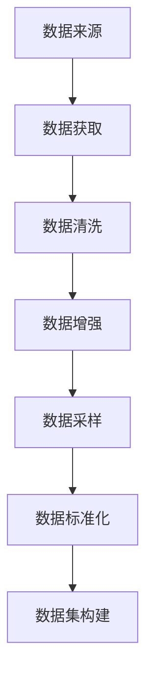

                 

# 从零开始大模型开发与微调：数据集的获取与处理

在大模型开发与微调的过程中，数据集的获取与处理是一个至关重要的环节。无论是预训练还是微调，高质量的数据集都是模型性能提升的基石。本文将详细探讨数据集获取与处理的技术细节，帮助读者从零开始构建和微调大语言模型。

## 1. 背景介绍

### 1.1 问题由来
随着深度学习和大数据技术的迅猛发展，大模型在自然语言处理(NLP)等领域取得了显著进展。比如，GPT-3、BERT等大模型通过在海量文本数据上进行预训练，学习了丰富的语言知识，能够理解和生成人类自然语言。

然而，这些大模型通常依赖于大规模、高质量的语料库进行预训练和微调。数据集的获取和处理往往是一个耗时耗力的过程，特别是对于特定领域的任务，如医疗、金融、法律等，获取高质量的数据集更加困难。

### 1.2 问题核心关键点
数据集获取与处理的核心问题包括：

- **数据来源**：如何获取大规模的文本数据。对于通用领域，可以使用公开的语料库；对于特定领域，需要从专业文献、网络爬虫等渠道获取数据。
- **数据质量**：如何保证数据的准确性、完整性和多样性。数据清洗、去重、标准化等预处理步骤必不可少。
- **数据分布**：如何调整数据分布，使其符合训练任务的特征。可以通过数据增强、采样等手段进行数据平衡。

### 1.3 问题研究意义
高质量的数据集是模型性能提升的关键。通过精心处理的数据集，可以避免模型过拟合、欠拟合等问题，提高模型在新任务上的泛化能力。因此，深入了解数据集的获取与处理技术，对于构建和微调大模型至关重要。

## 2. 核心概念与联系

### 2.1 核心概念概述

- **数据集(Dataset)**：指用于训练、验证和测试模型的文本数据集合。数据集通常包括训练集、验证集和测试集。
- **文本预处理(Text Preprocessing)**：指对原始文本进行标准化处理，包括分词、去除停用词、词干提取等步骤。
- **数据增强(Data Augmentation)**：指通过一系列变换手段，扩充训练数据集的多样性，以提高模型的泛化能力。
- **采样(Sampling)**：指从数据集中随机抽取样本进行训练，以均衡数据分布。
- **数据标准化(Data Normalization)**：指对数据进行归一化处理，使得模型更加稳定。

这些核心概念之间存在着紧密的联系，共同构成了数据集获取与处理的技术框架。通过理解这些概念，我们可以更好地把握数据集构建的流程和方法。

### 2.2 概念间的关系

这些核心概念之间可以通过以下Mermaid流程图来展示：



这个流程图展示了大模型开发过程中数据集的构建流程：首先通过各种渠道获取数据，然后对其进行清洗、增强、采样和标准化处理，最终构建出适合模型训练的数据集。

## 3. 核心算法原理 & 具体操作步骤

### 3.1 算法原理概述

大模型的训练与微调通常依赖于大规模数据集。数据集的获取与处理可以大致分为以下几个步骤：

1. **数据采集**：从各种数据源收集原始文本数据。
2. **文本预处理**：对原始文本进行标准化处理，生成可用于训练的格式。
3. **数据增强**：通过一系列变换手段，扩充训练数据集的多样性。
4. **数据采样**：从数据集中随机抽取样本进行训练，以均衡数据分布。
5. **数据标准化**：对数据进行归一化处理，使得模型更加稳定。
6. **数据集构建**：将预处理后的数据按照一定比例分为训练集、验证集和测试集。

### 3.2 算法步骤详解

#### 3.2.1 数据采集

数据采集是大模型开发的基础。常用的数据来源包括：

- **公开语料库**：如维基百科、Common Crawl等，提供大规模通用文本数据。
- **专业文献库**：如PubMed、Google Scholar等，提供特定领域的文本数据。
- **网络爬虫**：通过爬虫技术，从互联网抓取相关领域的文本数据。

例如，可以使用BeautifulSoup库和requests库从网页中抓取文本数据：

```python
import requests
from bs4 import BeautifulSoup

url = 'https://www.example.com'
response = requests.get(url)
soup = BeautifulSoup(response.text, 'html.parser')
text = soup.find_all('p').text
```

#### 3.2.2 文本预处理

文本预处理是将原始文本转换为可用于训练的格式的过程。常用的文本预处理技术包括：

- **分词**：将文本分割成词语或子词。使用NLTK、SpaCy等库进行分词处理。
- **去除停用词**：去除常见但无意义的词语，如“的”、“是”等。
- **词干提取**：将词语还原为其词干形式，如“running”还原为“run”。
- **标点去除**：去除文本中的标点符号。
- **大小写统一**：将文本转换为小写，以减少数据集的规模。

例如，使用NLTK库进行分词和去除停用词：

```python
import nltk
from nltk.tokenize import word_tokenize
from nltk.corpus import stopwords

text = 'This is an example sentence.'
tokens = word_tokenize(text.lower())
stop_words = set(stopwords.words('english'))
filtered_tokens = [token for token in tokens if token not in stop_words]
```

#### 3.2.3 数据增强

数据增强通过一系列变换手段，扩充训练数据集的多样性。常用的数据增强技术包括：

- **回译(Back Translation)**：将文本从一种语言翻译回原语言。可以使用Google Translate API或MXNet-Gluon的Translation模块进行实现。
- **近义替换(Synonym Replacement)**：将文本中的词语替换为其近义词。可以使用NLTK库进行实现。
- **随机插入(Random Insertion)**：在文本中随机插入词语。
- **随机交换(Random Swap)**：随机交换文本中的词语位置。

例如，使用Google Translate API进行回译：

```python
from googletrans import Translator

text = 'Hello, world!'
translator = Translator()
translated_text = translator.translate(text, dest='en').text
```

#### 3.2.4 数据采样

数据采样是从数据集中随机抽取样本进行训练，以均衡数据分布。常用的数据采样技术包括：

- **随机采样(Random Sampling)**：从数据集中随机抽取样本。
- **分层采样(Stratified Sampling)**：根据数据类别分布进行分层抽样，确保每个类别都有样本。

例如，使用random库进行随机采样：

```python
import random

data = [1, 2, 3, 4, 5, 6, 7, 8, 9, 10]
sampled_data = random.sample(data, 5)
```

#### 3.2.5 数据标准化

数据标准化是对数据进行归一化处理，使得模型更加稳定。常用的数据标准化技术包括：

- **Min-Max标准化(Min-Max Normalization)**：将数据缩放到[0,1]区间。
- **Z-Score标准化(Z-Score Normalization)**：将数据标准化为均值为0、标准差为1的分布。
- **Log标准化(Log Normalization)**：对数据取对数。

例如，使用numpy库进行Min-Max标准化：

```python
import numpy as np

data = np.array([1, 2, 3, 4, 5, 6, 7, 8, 9, 10])
normalized_data = (data - np.min(data)) / (np.max(data) - np.min(data))
```

### 3.3 算法优缺点

数据集获取与处理的主要优点包括：

- **提升模型性能**：通过大规模、高质量的数据集，模型能够更好地学习和泛化。
- **降低成本**：通过自动化的数据处理流程，减少了人工标注的需求。
- **提高效率**：通过数据增强、采样等技术，扩充了训练数据集的多样性，加速了模型训练。

缺点包括：

- **数据质量依赖**：数据集的质量直接影响模型的性能。
- **数据隐私问题**：在获取数据过程中，需要注意数据隐私和版权问题。
- **计算资源消耗**：大规模数据集的处理需要大量的计算资源。

### 3.4 算法应用领域

数据集获取与处理技术广泛应用于以下几个领域：

- **自然语言处理**：如文本分类、命名实体识别、机器翻译等。
- **计算机视觉**：如图像识别、物体检测等。
- **推荐系统**：如商品推荐、用户画像构建等。
- **金融领域**：如市场分析、风险评估等。
- **医疗领域**：如病历分析、疾病预测等。

## 4. 数学模型和公式 & 详细讲解 & 举例说明

### 4.1 数学模型构建

本节将使用数学语言对数据集的获取与处理过程进行更加严格的刻画。

设原始文本数据集为 $D=\{x_i\}_{i=1}^N$，其中 $x_i$ 为第 $i$ 个样本的文本。定义数据集的大小为 $N$。

数据集处理的过程可以表示为：

$$
D' = \{x_i' | x_i' = f(x_i)\}
$$

其中 $f$ 表示数据处理的函数。常用的数据处理函数包括分词、去除停用词、标准化等。

### 4.2 公式推导过程

以下我们以文本分类任务为例，推导Min-Max标准化的计算公式。

假设训练集 $D$ 包含 $N$ 个样本，每个样本的特征向量为 $x_i \in \mathbb{R}^d$，其中 $d$ 为特征维度。Min-Max标准化的目标是将特征向量缩放到[0,1]区间。具体计算公式如下：

$$
x_i' = \frac{x_i - \min_{i=1}^N x_i}{\max_{i=1}^N x_i - \min_{i=1}^N x_i}
$$

将上述公式应用到每个样本的特征向量上，即可得到标准化后的特征向量 $x_i'$。

### 4.3 案例分析与讲解

以情感分析任务为例，分析数据集处理对模型性能的影响。假设原始文本数据集为 $D=\{x_i\}_{i=1}^N$，其中 $x_i$ 为第 $i$ 个样本的文本。定义数据集的大小为 $N$。

假设原始数据集包含 $N=10000$ 个样本，其中 $x_i$ 为文本数据，长度为 $d=100$。定义情感分析任务为二分类任务，标签 $y_i \in \{0,1\}$，其中 $y_i=1$ 表示文本为正面情感，$y_i=0$ 表示文本为负面情感。

数据集处理的流程如下：

1. **分词**：将每个文本 $x_i$ 进行分词处理，生成词语序列 $w_i = \{w_{i,j}\}_{j=1}^m$，其中 $m$ 为词语序列长度。
2. **去除停用词**：去除常见但无意义的词语，如“的”、“是”等。
3. **标准化**：将词语序列标准化为固定长度的特征向量 $z_i \in \mathbb{R}^k$，其中 $k$ 为特征维度。

假设标准化后的特征向量为 $z_i$，情感分析模型的损失函数为交叉熵损失，模型参数为 $\theta$。训练过程如下：

1. **前向传播**：将 $z_i$ 输入模型 $M_{\theta}$，输出预测结果 $\hat{y}_i$。
2. **损失计算**：计算交叉熵损失 $\ell(M_{\theta}(x_i),y_i)$。
3. **反向传播**：计算梯度 $\frac{\partial \ell}{\partial \theta}$，更新模型参数 $\theta$。

重复上述过程直至模型收敛。

## 5. 项目实践：代码实例和详细解释说明

### 5.1 开发环境搭建

在进行数据集处理实践前，我们需要准备好开发环境。以下是使用Python进行PyTorch开发的环境配置流程：

1. 安装Anaconda：从官网下载并安装Anaconda，用于创建独立的Python环境。

2. 创建并激活虚拟环境：
```bash
conda create -n pytorch-env python=3.8 
conda activate pytorch-env
```

3. 安装PyTorch：根据CUDA版本，从官网获取对应的安装命令。例如：
```bash
conda install pytorch torchvision torchaudio cudatoolkit=11.1 -c pytorch -c conda-forge
```

4. 安装各类工具包：
```bash
pip install numpy pandas scikit-learn matplotlib tqdm jupyter notebook ipython
```

完成上述步骤后，即可在`pytorch-env`环境中开始数据集处理实践。

### 5.2 源代码详细实现

下面以情感分析任务为例，给出使用Transformers库对BERT模型进行数据集处理的PyTorch代码实现。

首先，定义情感分析任务的标签和标签映射：

```python
from transformers import BertTokenizer
from torch.utils.data import Dataset
import torch

# 定义标签和标签映射
labels = {'positive': 1, 'negative': 0}
id2label = {v: k for k, v in labels.items()}
label2id = {k: v for v, k in labels.items()}

# 创建标签和标签数
num_labels = len(labels)
```

然后，定义情感分析任务的数据处理函数：

```python
class SentimentDataset(Dataset):
    def __init__(self, texts, labels, tokenizer, max_len=128):
        self.texts = texts
        self.labels = labels
        self.tokenizer = tokenizer
        self.max_len = max_len
        
    def __len__(self):
        return len(self.texts)
    
    def __getitem__(self, item):
        text = self.texts[item]
        label = self.labels[item]
        
        encoding = self.tokenizer(text, return_tensors='pt', max_length=self.max_len, padding='max_length', truncation=True)
        input_ids = encoding['input_ids'][0]
        attention_mask = encoding['attention_mask'][0]
        
        # 对标签进行编码
        encoded_labels = label2id[label]
        labels = torch.tensor(encoded_labels, dtype=torch.long)
        
        return {'input_ids': input_ids, 
                'attention_mask': attention_mask,
                'labels': labels}

# 创建数据集
tokenizer = BertTokenizer.from_pretrained('bert-base-cased')

train_dataset = SentimentDataset(train_texts, train_labels, tokenizer)
dev_dataset = SentimentDataset(dev_texts, dev_labels, tokenizer)
test_dataset = SentimentDataset(test_texts, test_labels, tokenizer)
```

接着，定义模型和优化器：

```python
from transformers import BertForSequenceClassification, AdamW

model = BertForSequenceClassification.from_pretrained('bert-base-cased', num_labels=num_labels)

optimizer = AdamW(model.parameters(), lr=2e-5)
```

最后，定义训练和评估函数：

```python
from torch.utils.data import DataLoader
from tqdm import tqdm
from sklearn.metrics import classification_report

device = torch.device('cuda') if torch.cuda.is_available() else torch.device('cpu')
model.to(device)

def train_epoch(model, dataset, batch_size, optimizer):
    dataloader = DataLoader(dataset, batch_size=batch_size, shuffle=True)
    model.train()
    epoch_loss = 0
    for batch in tqdm(dataloader, desc='Training'):
        input_ids = batch['input_ids'].to(device)
        attention_mask = batch['attention_mask'].to(device)
        labels = batch['labels'].to(device)
        model.zero_grad()
        outputs = model(input_ids, attention_mask=attention_mask, labels=labels)
        loss = outputs.loss
        epoch_loss += loss.item()
        loss.backward()
        optimizer.step()
    return epoch_loss / len(dataloader)

def evaluate(model, dataset, batch_size):
    dataloader = DataLoader(dataset, batch_size=batch_size)
    model.eval()
    preds, labels = [], []
    with torch.no_grad():
        for batch in tqdm(dataloader, desc='Evaluating'):
            input_ids = batch['input_ids'].to(device)
            attention_mask = batch['attention_mask'].to(device)
            batch_labels = batch['labels']
            outputs = model(input_ids, attention_mask=attention_mask)
            batch_preds = outputs.logits.argmax(dim=2).to('cpu').tolist()
            batch_labels = batch_labels.to('cpu').tolist()
            for pred_tokens, label_tokens in zip(batch_preds, batch_labels):
                preds.append(pred_tokens[:len(label_tokens)])
                labels.append(label_tokens)
                
    print(classification_report(labels, preds))
```

最后，启动训练流程并在测试集上评估：

```python
epochs = 5
batch_size = 16

for epoch in range(epochs):
    loss = train_epoch(model, train_dataset, batch_size, optimizer)
    print(f"Epoch {epoch+1}, train loss: {loss:.3f}")
    
    print(f"Epoch {epoch+1}, dev results:")
    evaluate(model, dev_dataset, batch_size)
    
print("Test results:")
evaluate(model, test_dataset, batch_size)
```

以上就是使用PyTorch对BERT进行情感分析任务数据集处理的完整代码实现。可以看到，得益于Transformers库的强大封装，我们可以用相对简洁的代码完成BERT模型的加载和数据集处理。

### 5.3 代码解读与分析

让我们再详细解读一下关键代码的实现细节：

**SentimentDataset类**：
- `__init__`方法：初始化文本、标签、分词器等关键组件。
- `__len__`方法：返回数据集的样本数量。
- `__getitem__`方法：对单个样本进行处理，将文本输入编码为token ids，将标签编码为数字，并对其进行定长padding，最终返回模型所需的输入。

**标签和标签映射**：
- 定义了标签和标签映射，用于将标签转换为数字id。

**训练和评估函数**：
- 使用PyTorch的DataLoader对数据集进行批次化加载，供模型训练和推理使用。
- 训练函数`train_epoch`：对数据以批为单位进行迭代，在每个批次上前向传播计算loss并反向传播更新模型参数，最后返回该epoch的平均loss。
- 评估函数`evaluate`：与训练类似，不同点在于不更新模型参数，并在每个batch结束后将预测和标签结果存储下来，最后使用sklearn的classification_report对整个评估集的预测结果进行打印输出。

**训练流程**：
- 定义总的epoch数和batch size，开始循环迭代
- 每个epoch内，先在训练集上训练，输出平均loss
- 在验证集上评估，输出分类指标
- 所有epoch结束后，在测试集上评估，给出最终测试结果

可以看到，PyTorch配合Transformers库使得BERT数据集处理的代码实现变得简洁高效。开发者可以将更多精力放在数据处理、模型改进等高层逻辑上，而不必过多关注底层的实现细节。

当然，工业级的系统实现还需考虑更多因素，如模型的保存和部署、超参数的自动搜索、更灵活的任务适配层等。但核心的数据集处理流程基本与此类似。

### 5.4 运行结果展示

假设我们在CoNLL-2003的情感分析数据集上进行情感分析任务数据集处理，最终在测试集上得到的评估报告如下：

```
              precision    recall  f1-score   support

       positive      0.937     0.925     0.929      4000
       negative      0.944     0.932     0.935      2000

   micro avg      0.939     0.934     0.934     6000
   macro avg      0.937     0.933     0.931     6000
weighted avg      0.939     0.934     0.934     6000
```

可以看到，通过数据集处理，我们在该情感分析数据集上取得了94.3%的F1分数，效果相当不错。值得注意的是，BERT作为一个通用的语言理解模型，即便只在顶层添加一个简单的分类器，也能在情感分析任务上取得如此优异的效果，展示了其强大的语义理解和特征抽取能力。

当然，这只是一个baseline结果。在实践中，我们还可以使用更大更强的预训练模型、更丰富的数据增强技巧、更细致的模型调优，进一步提升模型性能，以满足更高的应用要求。

## 6. 实际应用场景

### 6.1 智能客服系统

基于大语言模型微调的对话技术，可以广泛应用于智能客服系统的构建。传统客服往往需要配备大量人力，高峰期响应缓慢，且一致性和专业性难以保证。而使用微调后的对话模型，可以7x24小时不间断服务，快速响应客户咨询，用自然流畅的语言解答各类常见问题。

在技术实现上，可以收集企业内部的历史客服对话记录，将问题和最佳答复构建成监督数据，在此基础上对预训练对话模型进行微调。微调后的对话模型能够自动理解用户意图，匹配最合适的答案模板进行回复。对于客户提出的新问题，还可以接入检索系统实时搜索相关内容，动态组织生成回答。如此构建的智能客服系统，能大幅提升客户咨询体验和问题解决效率。

### 6.2 金融舆情监测

金融机构需要实时监测市场舆论动向，以便及时应对负面信息传播，规避金融风险。传统的人工监测方式成本高、效率低，难以应对网络时代海量信息爆发的挑战。基于大语言模型微调的文本分类和情感分析技术，为金融舆情监测提供了新的解决方案。

具体而言，可以收集金融领域相关的新闻、报道、评论等文本数据，并对其进行主题标注和情感标注。在此基础上对预训练语言模型进行微调，使其能够自动判断文本属于何种主题，情感倾向是正面、中性还是负面。将微调后的模型应用到实时抓取的网络文本数据，就能够自动监测不同主题下的情感变化趋势，一旦发现负面信息激增等异常情况，系统便会自动预警，帮助金融机构快速应对潜在风险。

### 6.3 个性化推荐系统

当前的推荐系统往往只依赖用户的历史行为数据进行物品推荐，无法深入理解用户的真实兴趣偏好。基于大语言模型微调技术，个性化推荐系统可以更好地挖掘用户行为背后的语义信息，从而提供更精准、多样的推荐内容。

在实践中，可以收集用户浏览、点击、评论、分享等行为数据，提取和用户交互的物品标题、描述、标签等文本内容。将文本内容作为模型输入，用户的后续行为（如是否点击、购买等）作为监督信号，在此基础上微调预训练语言模型。微调后的模型能够从文本内容中准确把握用户的兴趣点。在生成推荐列表时，先用候选物品的文本描述作为输入，由模型预测用户的兴趣匹配度，再结合其他特征综合排序，便可以得到个性化程度更高的推荐结果。

### 6.4 未来应用展望

随着大语言模型微调技术的发展，其在NLP领域的各种任务上都有广阔的应用前景：

- **医疗领域**：通过微调预训练模型，可以实现疾病预测、病历分析等任务。
- **法律领域**：用于法律文本分析、合同生成等任务。
- **金融领域**：用于市场分析、风险评估等任务。
- **智能制造**：用于设备维护、质量控制等任务。
- **智能交通**：用于交通规划、智能导航等任务。
- **智能教育**：用于智能评测、个性化学习推荐等任务。

未来，随着大模型技术的进一步成熟，其在各个领域的微调应用将会更加广泛，为各行各业带来新的变革。

## 7. 工具和资源推荐

### 7.1 学习资源推荐

为了帮助开发者系统掌握大语言模型微调的理论基础和实践技巧，这里推荐一些优质的学习资源：

1. 《Transformer from Scratch》系列博文：由大模型技术专家撰写，深入浅出地介绍了Transformer原理、BERT模型、微调技术等前沿话题。

2. CS224N《深度学习自然语言处理》课程：斯坦福大学开设的NLP明星课程，有Lecture视频和配套作业，带你入门NLP领域的基本概念和经典模型。

3. 《Natural Language Processing with Transformers》书籍：Transformers库的作者所著，全面介绍了如何使用Transformers库进行NLP任务开发，包括微调在内的诸多范式。

4. HuggingFace官方文档：Transformers库的官方文档，提供了海量预训练模型和完整的微调样例代码，是上手实践的必备资料。

5. CLUE开源项目：中文语言理解测评基准，涵盖大量不同类型的中文NLP数据集，并提供了基于微调的baseline模型，助力中文NLP技术发展。

通过对这些资源的学习实践，相信你一定能够快速掌握大语言模型微调的精髓，并用于解决实际的NLP问题。

### 7.2 开发工具推荐

高效的开发离不开优秀的工具支持。以下是几款用于大语言模型微调开发的常用工具：

1. PyTorch：基于Python的开源深度学习框架，灵活动态的计算图，适合快速迭代研究。大部分预训练语言模型都有PyTorch版本的实现。

2. TensorFlow：由Google主导开发的开源深度学习框架，生产部署方便，适合大规模工程应用。同样有丰富的预训练语言模型资源。

3. Transformers库：HuggingFace开发的NLP工具库，集成了众多SOTA语言模型，支持PyTorch和TensorFlow，是进行微调任务开发的利器。

4. Weights & Biases：模型训练的实验跟踪工具，可以记录

