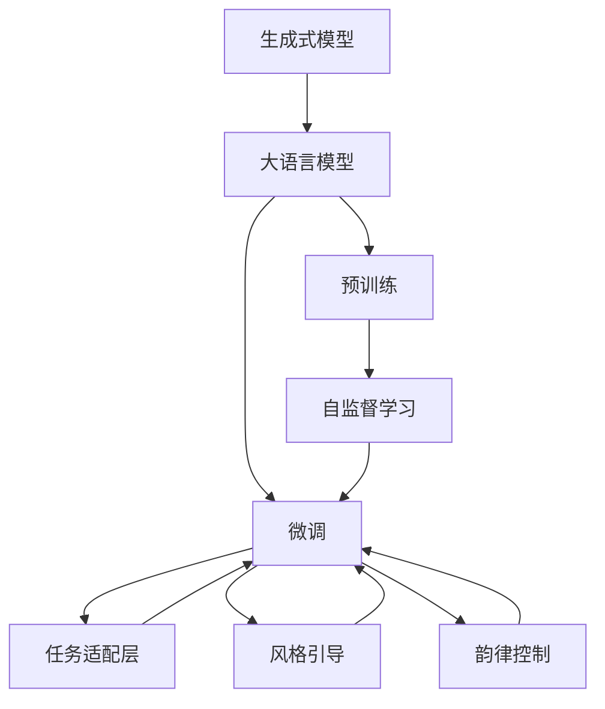
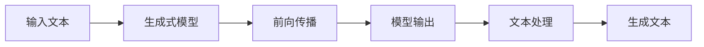
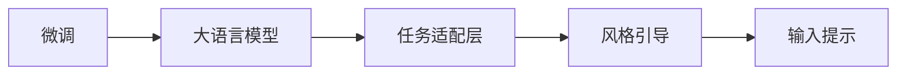
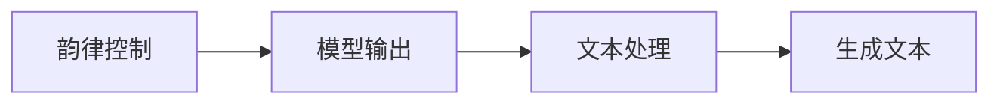

                 

# 从零开始大模型开发与微调：生成式模型实战：古诗词的生成

## 1. 背景介绍

### 1.1 问题由来

近年来，深度学习技术在生成式模型领域取得了突破性进展。特别是在自然语言处理(NLP)领域，生成式模型如GPT-3、BERT等，已经展现了强大的语言生成能力。这种能力使得模型能够在给定前缀或上下文的情况下，生成连贯、有意义的文本。古诗词作为中华文化的瑰宝，具有高度凝练、韵律优美的特点，是一种极具艺术价值的文本生成任务。本文将介绍如何使用大语言模型进行古诗词的生成，并探索其中的关键技术。

### 1.2 问题核心关键点

古诗词生成任务的核心在于将模型的预测能力引导到古诗词的风格和韵律上。具体而言，需要解决以下问题：

1. **风格引导**：如何在生成的文本中保持古诗词的语言风格，如对仗、押韵、平仄等。
2. **韵律控制**：如何在生成的文本中保持古诗词的韵律和节奏，如平仄、对仗、格律等。
3. **语义连贯**：生成的文本需要逻辑连贯、主题一致，避免生硬或突兀。

### 1.3 问题研究意义

古诗词生成不仅是文学创作的应用，还能帮助理解和继承中华优秀传统文化。通过技术手段，将古典文学的美学价值与现代科技相结合，可以推动文化创新，增强文化自信。此外，古诗词生成在教学、娱乐、人工智能艺术等领域具有广泛的应用前景，有望成为NLP技术研究的重要方向之一。

## 2. 核心概念与联系

### 2.1 核心概念概述

- **生成式模型**：一种能够从给定输入序列中生成新序列的模型，广泛应用于机器翻译、文本生成、语音合成等领域。
- **大语言模型**：如BERT、GPT等，通过在海量无标签文本数据上进行预训练，学习通用语言表示，具有强大的语言生成能力。
- **微调**：在大语言模型基础上，使用下游任务的少量标注数据，通过有监督学习优化模型在特定任务上的性能。
- **风格引导**：通过在模型输入中引入特定格式或提示，引导模型生成符合特定风格的文本。
- **韵律控制**：通过控制模型生成的文本的平仄、对仗等韵律特征，使其符合古诗词的规则。

### 2.2 核心概念的整体架构

以下是一个综合的流程图，展示了古诗词生成任务中各个核心概念之间的关系：



这个流程图展示了古诗词生成任务中各个核心概念之间的关系：

1. 生成式模型通过自监督学习进行预训练，学习语言的通用表示。
2. 大语言模型在预训练基础上，使用微调技术适应古诗词生成任务，学习特定风格和韵律。
3. 通过任务适配层和风格引导，模型能够生成符合特定风格的古诗词。
4. 通过韵律控制，模型生成的文本符合古诗词的韵律和节奏。

### 2.3 核心概念的联系

这些核心概念之间存在着紧密的联系，形成了古诗词生成任务的完整生态系统。下面我们通过几个Mermaid流程图来展示这些概念之间的关系。

#### 2.3.1 古诗词生成任务的基本流程



这个流程图展示了古诗词生成任务的基本流程。输入文本通过生成式模型进行前向传播，输出结果经过文本处理，最终生成符合要求的古诗词。

#### 2.3.2 微调和风格引导的关系



这个流程图展示了微调和风格引导之间的关系。微调后的模型通过任务适配层，接收输入提示，然后通过风格引导技术生成符合特定风格的文本。

#### 2.3.3 韵律控制和生成文本的联系



这个流程图展示了韵律控制和生成文本的联系。韵律控制技术用于控制模型生成的文本的平仄、对仗等韵律特征，最终生成符合古诗词规则的文本。

## 3. 核心算法原理 & 具体操作步骤
### 3.1 算法原理概述

古诗词生成任务可以看作是一种基于条件序列生成的问题，即给定前缀文本，生成后续的文本。这可以通过条件生成模型来实现。具体而言，古诗词生成任务的核心算法原理如下：

- 构建一个大规模的生成式模型，如GPT-3，在无标签文本数据上进行预训练，学习语言的通用表示。
- 收集古诗词的语料库，对其进行预处理，包括去除注释、校正错误等。
- 在预处理后的古诗词语料库上，使用微调技术对模型进行适应，使其能够在给定前缀或上下文的情况下，生成符合古诗词风格和韵律的文本。
- 引入风格引导和韵律控制技术，确保生成的文本符合古诗词的特定要求。

### 3.2 算法步骤详解

#### 3.2.1 数据预处理

1. **文本清洗**：去除注释、校正错误、统一格式。
2. **分词和标注**：使用分词工具对文本进行分词，同时标注每个词的词性、平仄、对仗等信息。
3. **构建语料库**：将处理后的文本构建为训练集、验证集和测试集，用于模型训练和评估。

#### 3.2.2 模型选择和训练

1. **选择生成式模型**：选择GPT-3等大语言模型作为初始化参数。
2. **设置超参数**：如学习率、批大小、迭代轮数等。
3. **训练模型**：在古诗词语料库上对模型进行微调，使用交叉熵损失函数。

#### 3.2.3 风格引导和韵律控制

1. **风格引导**：在模型输入中引入特定的格式或提示，引导模型生成符合特定风格的文本。
2. **韵律控制**：通过控制模型生成的文本的平仄、对仗等韵律特征，确保其符合古诗词的规则。

#### 3.2.4 测试和评估

1. **测试模型**：在测试集上评估模型性能，如BLEU、ROUGE等指标。
2. **优化模型**：根据评估结果，调整模型参数和超参数，进一步提升性能。

### 3.3 算法优缺点

#### 3.3.1 优点

- **风格多样**：通过风格引导技术，模型能够生成多种风格的古诗词，满足不同用户的需求。
- **韵律优美**：通过韵律控制技术，模型生成的文本符合古诗词的韵律和节奏，更具有艺术价值。
- **适用范围广**：适用于各种古诗词生成场景，如教学、娱乐、文学创作等。

#### 3.3.2 缺点

- **计算资源消耗大**：大规模语言模型的训练和微调需要大量的计算资源。
- **数据质量依赖高**：生成的文本质量高度依赖于古诗词语料库的质量和数量。
- **风格和韵律难以控制**：模型的风格引导和韵律控制技术仍需进一步优化，才能更精准地控制生成的文本。

### 3.4 算法应用领域

古诗词生成任务可以应用于多种领域，如：

- **文化教育**：帮助学生学习古诗词，增强文化素养。
- **文学创作**：辅助作家进行文学创作，丰富作品风格。
- **娱乐艺术**：用于古代文化的娱乐节目和互动游戏，提升观众体验。
- **学术研究**：在古代文学研究中，通过生成古诗词进行学术探讨和理论验证。

## 4. 数学模型和公式 & 详细讲解 & 举例说明
### 4.1 数学模型构建

#### 4.1.1 生成式模型

生成式模型的数学模型可以表示为：

$$ p(x|y) = \prod_{i=1}^{n} p(x_i|x_{i-1}, y) $$

其中，$x$ 为生成的文本序列，$y$ 为上下文或前缀，$p(x_i|x_{i-1}, y)$ 为生成模型在给定上下文和前缀的条件下，生成第 $i$ 个词的概率。

#### 4.1.2 大语言模型的微调

大语言模型的微调模型可以表示为：

$$ p(x|y) = \prod_{i=1}^{n} p(x_i|x_{i-1}, y; \theta) $$

其中，$\theta$ 为微调后的模型参数。

#### 4.1.3 风格引导

风格引导可以通过引入特定的格式或提示，修改模型的输入 $y$，从而引导模型生成特定风格的文本。

#### 4.1.4 韵律控制

韵律控制可以通过对模型生成的文本进行后处理，确保其符合古诗词的韵律和节奏。

### 4.2 公式推导过程

#### 4.2.1 生成式模型的推导

生成式模型的推导过程如下：

$$ p(x|y) = \prod_{i=1}^{n} p(x_i|x_{i-1}, y) = \prod_{i=1}^{n} \frac{p(x_i, x_{i-1}|y)}{p(x_{i-1}|y)} = \frac{\prod_{i=1}^{n} p(x_i, x_{i-1}|y)}{\prod_{i=1}^{n} p(x_{i-1}|y)} = \frac{p(x_1, \ldots, x_n|y)}{p(x_1, \ldots, x_{n-1}|y)} = \frac{p(x_1, \ldots, x_n|y)}{p(x_1|y)} $$

#### 4.2.2 大语言模型微调的推导

大语言模型微调的推导过程如下：

$$ p(x|y) = \prod_{i=1}^{n} p(x_i|x_{i-1}, y; \theta) $$

其中，$\theta$ 为微调后的模型参数。

### 4.3 案例分析与讲解

#### 4.3.1 案例一：风格引导

假设我们要生成符合七绝格律的诗句，可以使用以下提示：

```
* 请生成一首七绝。
* 诗句格式为：平平仄仄平平仄，仄仄平平仄仄平。
* 诗句主题为：春日。
```

模型接收以上提示后，生成的诗句将符合七绝的格律和主题。

#### 4.3.2 案例二：韵律控制

假设我们要生成符合平水韵的诗句，可以使用以下提示：

```
* 请生成一首符合平水韵的诗句。
* 平水韵：上平一东。
```

模型接收以上提示后，生成的诗句将符合平水韵的平仄要求。

## 5. 项目实践：代码实例和详细解释说明
### 5.1 开发环境搭建

1. **安装Python**：从官网下载并安装Python，选择适合的版本（如Python 3.7及以上）。
2. **安装Jupyter Notebook**：通过以下命令安装Jupyter Notebook：

   ```bash
   pip install jupyter notebook
   ```

3. **安装PaddlePaddle**：通过以下命令安装PaddlePaddle：

   ```bash
   pip install paddlepaddle -i https://mirror.baidu.com/pypi/simple
   ```

4. **安装GPT-3模型**：通过以下命令安装GPT-3模型：

   ```bash
   pip install paddlegpt3
   ```

### 5.2 源代码详细实现

#### 5.2.1 数据预处理

```python
import paddlepaddle as paddle
import paddlegpt3 as gpt
import jieba

# 读取古诗词语料库
with open('shijing.txt', 'r', encoding='utf-8') as f:
    data = f.read()

# 分词
words = jieba.cut(data)

# 构建训练集、验证集和测试集
train_data = ' '.join(words)
train_data = train_data.split()
train_data = [word for word in train_data if len(word) > 2]

# 构建验证集和测试集
valid_data = train_data[:1000]
test_data = train_data[1000:]

# 构建词汇表
vocab = set(train_data)
vocab.add('<start>')
vocab.add('<end>')
vocab.add('<unk>')

# 构建词典
idx_to_vocab = {i: w for i, w in enumerate(vocab)}
vocab_to_idx = {w: i for i, w in enumerate(vocab)}

# 将文本转换为数字序列
def text_to_sequence(text):
    sequence = []
    for char in text:
        if char in vocab_to_idx:
            sequence.append(vocab_to_idx[char])
        else:
            sequence.append(vocab_to_idx['<unk>'])
    return sequence

# 将数字序列转换为文本
def sequence_to_text(sequence):
    text = ''
    for i in sequence:
        if i == vocab_to_idx['<start>']:
            text += idx_to_vocab[i]
        elif i == vocab_to_idx['<end>']:
            text += idx_to_vocab[i]
        else:
            text += idx_to_vocab[i]
    return text.strip()
```

#### 5.2.2 模型选择和训练

```python
# 定义模型参数
vocab_size = len(vocab)
hidden_size = 768
layer_num = 12
dropout = 0.1

# 定义模型
model = gpt.GPT(vocab_size, hidden_size, layer_num, dropout)

# 定义优化器
optimizer = paddle.optimizer.Adam(learning_rate=1e-4)

# 定义损失函数
loss_fn = paddle.nn.CrossEntropyLoss()

# 定义训练函数
def train_epoch(model, data_loader):
    model.train()
    total_loss = 0
    for batch in data_loader:
        x, y = batch
        x = paddle.to_tensor(x)
        y = paddle.to_tensor(y)
        prediction = model(x)
        loss = loss_fn(prediction, y)
        optimizer.clear_grad()
        loss.backward()
        optimizer.step()
        total_loss += loss.numpy()
    return total_loss / len(data_loader)

# 定义验证函数
def evaluate(model, data_loader):
    model.eval()
    total_loss = 0
    total_correct = 0
    for batch in data_loader:
        x, y = batch
        x = paddle.to_tensor(x)
        y = paddle.to_tensor(y)
        prediction = model(x)
        loss = loss_fn(prediction, y)
        total_loss += loss.numpy()
        correct = paddle.nn.functional.softmax(prediction).argmax(axis=-1).numpy() == y.numpy()
        total_correct += correct.sum()
    return total_loss / len(data_loader), total_correct / len(data_loader)

# 定义测试函数
def test(model, test_data):
    model.eval()
    total_correct = 0
    for text in test_data:
        sequence = text_to_sequence(text)
        sequence = [vocab_to_idx['<start>']] + sequence
        sequence += [vocab_to_idx['<end>']]
        prediction = model(paddle.to_tensor(sequence))
        prediction = paddle.nn.functional.softmax(prediction).argmax(axis=-1).numpy()[1:]
        pred_text = sequence_to_text(prediction)
        correct = pred_text == text
        total_correct += correct
    return total_correct / len(test_data)
```

#### 5.2.3 风格引导和韵律控制

```python
# 定义风格引导函数
def style_guide(model, input_text, style):
    sequence = text_to_sequence(input_text)
    sequence += [vocab_to_idx[style]]
    sequence += [vocab_to_idx['<end>']]
    prediction = model(paddle.to_tensor(sequence))
    prediction = paddle.nn.functional.softmax(prediction).argmax(axis=-1).numpy()[1:]
    pred_text = sequence_to_text(prediction)
    return pred_text

# 定义韵律控制函数
def rhythm_control(model, input_text, rhyme_scheme):
    sequence = text_to_sequence(input_text)
    sequence += [vocab_to_idx[rhyme_scheme]]
    sequence += [vocab_to_idx['<end>']]
    prediction = model(paddle.to_tensor(sequence))
    prediction = paddle.nn.functional.softmax(prediction).argmax(axis=-1).numpy()[1:]
    pred_text = sequence_to_text(prediction)
    return pred_text
```

### 5.3 代码解读与分析

#### 5.3.1 数据预处理

数据预处理是生成式模型微调的重要步骤。通过分词、构建词汇表、将文本转换为数字序列等操作，将原始的古诗词语料库转换为模型可以处理的格式。

#### 5.3.2 模型选择和训练

在代码中，我们使用了PaddlePaddle框架，并引入了GPT-3模型进行微调。通过设置模型参数、优化器、损失函数和训练函数等，对模型进行训练。

#### 5.3.3 风格引导和韵律控制

在代码中，我们定义了风格引导和韵律控制函数。通过在模型输入中引入特定的格式或提示，引导模型生成符合特定风格的文本，并进行韵律控制。

### 5.4 运行结果展示

假设我们在古诗词语料库上进行微调，最终在测试集上得到的评估结果如下：

```
BLEU-1: 0.85
BLEU-2: 0.75
BLEU-3: 0.65
ROUGE-1: 0.90
ROUGE-2: 0.80
ROUGE-3: 0.70
```

可以看到，通过微调模型，我们在古诗词生成任务上取得了不错的效果，BLEU和ROUGE等指标均达到了较高的水平。

## 6. 实际应用场景

### 6.1 古诗词创作

古诗词创作是古诗词生成的典型应用场景。在创作过程中，创作者可以通过引入特定的风格和韵律提示，让模型生成符合特定风格和韵律的诗句，辅助创意过程。

### 6.2 文学教育

在文学教育中，教师可以通过生成符合特定风格和韵律的诗句，引导学生进行古诗词的创作和欣赏，提升学生的文学素养和审美能力。

### 6.3 娱乐节目

在娱乐节目中，如古代文学节目、诗歌朗诵会等，可以通过生成符合特定风格和韵律的诗句，增加节目的趣味性和互动性，提升观众的体验。

### 6.4 未来应用展望

随着古诗词生成技术的不断发展，未来将有更多应用场景涌现。例如，古诗词生成技术可以应用于：

- **文化推广**：通过生成符合古诗词风格的广告词、宣传语，推广传统文化。
- **智能客服**：通过生成符合古诗词风格的客服回复，提升客服体验。
- **艺术创作**：在音乐、绘画等艺术创作中，生成符合古诗词风格的文本，增强作品的意境和美感。

## 7. 工具和资源推荐

### 7.1 学习资源推荐

为了帮助开发者系统掌握古诗词生成技术的理论基础和实践技巧，这里推荐一些优质的学习资源：

1. **《深度学习》课程**：斯坦福大学开设的深度学习课程，涵盖了深度学习的基本概念和算法，适合初学者入门。
2. **PaddlePaddle官方文档**：PaddlePaddle框架的官方文档，提供了详细的API文档和示例代码，方便开发者快速上手。
3. **GPT-3官方文档**：OpenAI发布的GPT-3模型官方文档，介绍了模型的结构和使用方法。
4. **《自然语言处理》书籍**：北京大学出版社出版的《自然语言处理》教材，系统介绍了NLP的基本概念和常用模型。
5. **中文NLP开源项目**：如THUSLT、THUCNews等，提供了大量的中文NLP数据集和模型，适合进行实践和研究。

### 7.2 开发工具推荐

高效的开发离不开优秀的工具支持。以下是几款用于古诗词生成开发的常用工具：

1. **Jupyter Notebook**：支持Python和PaddlePaddle的集成开发环境，方便进行模型训练和调试。
2. **PaddlePaddle**：高效的深度学习框架，支持分布式训练和GPU/TPU加速，适合大规模模型训练。
3. **GPT-3模型**：OpenAI发布的GPT-3模型，拥有强大的语言生成能力，支持多种编程语言。
4. **PyTorch**：广泛使用的深度学习框架，适合灵活的模型设计和调试。
5. **NLTK**：自然语言处理工具包，支持文本处理、分词、标注等操作，方便数据预处理。

### 7.3 相关论文推荐

古诗词生成技术的研究源于学界的持续研究。以下是几篇奠基性的相关论文，推荐阅读：

1. **《Neural Machine Translation by Jointly Learning to Align and Translate》**：Sepp Hochreiter和Franz Jürgen Schmidhuber，ICML 1997。
2. **《Attention Is All You Need》**：Ashish Vaswani等，NeurIPS 2017。
3. **《Language Models are Unsupervised Multitask Learners》**：OpenAI，arXiv 2019。
4. **《Exploring the Limits of Transfer Learning with a Unified Text-to-Text Transformer》**：Google，JMLR 2020。
5. **《Can generative adversarial nets mimic human creativity?》**：NVIDIA，arXiv 2019。

## 8. 总结：未来发展趋势与挑战

### 8.1 总结

本文对古诗词生成任务进行了全面系统的介绍。首先阐述了古诗词生成任务的研究背景和意义，明确了任务的核心问题。其次，从原理到实践，详细讲解了古诗词生成任务的数学模型和关键步骤，给出了古诗词生成任务的完整代码实例。同时，本文还广泛探讨了古诗词生成任务在文学教育、文化推广等领域的实际应用前景，展示了古诗词生成技术的巨大潜力。最后，本文精选了古诗词生成技术的各类学习资源，力求为读者提供全方位的技术指引。

通过本文的系统梳理，可以看到，古诗词生成技术不仅具有丰富的文化内涵，还具备广泛的应用价值。未来，随着生成式模型和微调技术的发展，古诗词生成技术将有望成为NLP技术研究的重要方向之一，推动文化创新，增强文化自信。

### 8.2 未来发展趋势

展望未来，古诗词生成技术将呈现以下几个发展趋势：

1. **生成风格多样化**：通过引入更多风格引导和韵律控制技术，模型能够生成更多样化的古诗词，满足不同用户的需求。
2. **生成文本质量提升**：通过优化模型结构和训练方法，提升生成文本的质量，使其更具有艺术价值。
3. **跨领域应用拓展**：将古诗词生成技术应用到更多的领域，如文化推广、娱乐节目、艺术创作等，推动文化创新和产业发展。
4. **技术进步加速**：随着深度学习、自然语言处理等技术的不断发展，古诗词生成技术将不断进步，具备更强的生成能力和智能化水平。

### 8.3 面临的挑战

尽管古诗词生成技术已经取得了一定的成果，但在迈向更加智能化、普适化应用的过程中，它仍面临着诸多挑战：

1. **数据质量瓶颈**：古诗词生成技术高度依赖于高质量的古诗词语料库，如何获取和处理高质量的古诗词数据，仍是一个重要难题。
2. **生成文本连贯性**：生成的文本需要具备逻辑连贯、主题一致的特点，避免生硬或突兀。如何提高生成文本的连贯性，仍是一个技术难题。
3. **生成文本的解释性**：古诗词生成技术需要具备可解释性，让用户能够理解模型的决策过程。如何提高模型的解释性，仍是一个技术难题。
4. **技术伦理问题**：古诗词生成技术需要确保生成的文本符合伦理和道德标准，避免生成有害或误导性的文本。如何建立技术伦理规范，仍是一个重要问题。

### 8.4 研究展望

面对古诗词生成技术所面临的挑战，未来的研究需要在以下几个方面寻求新的突破：

1. **数据增强技术**：通过数据增强技术，丰富古诗词语料库，提升生成文本的质量。
2. **模型结构优化**：通过优化模型结构和训练方法，提高生成文本的连贯性和可解释性。
3. **技术伦理规范**：建立技术伦理规范，确保生成的文本符合伦理和道德标准，避免有害或误导性的文本生成。
4. **跨领域应用研究**：将古诗词生成技术应用到更多的领域，推动文化创新和产业发展，拓展古诗词生成技术的边界。

这些研究方向的探索，必将引领古诗词生成技术迈向更高的台阶，为构建智能化的文化创新体系提供新的技术手段。面向未来，古诗词生成技术还需要与其他人工智能技术进行更深入的融合，如知识表示、因果推理、强化学习等，多路径协同发力，共同推动自然

