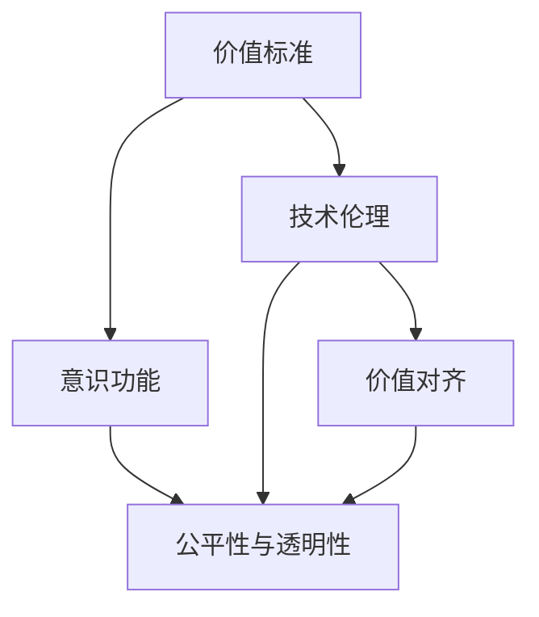
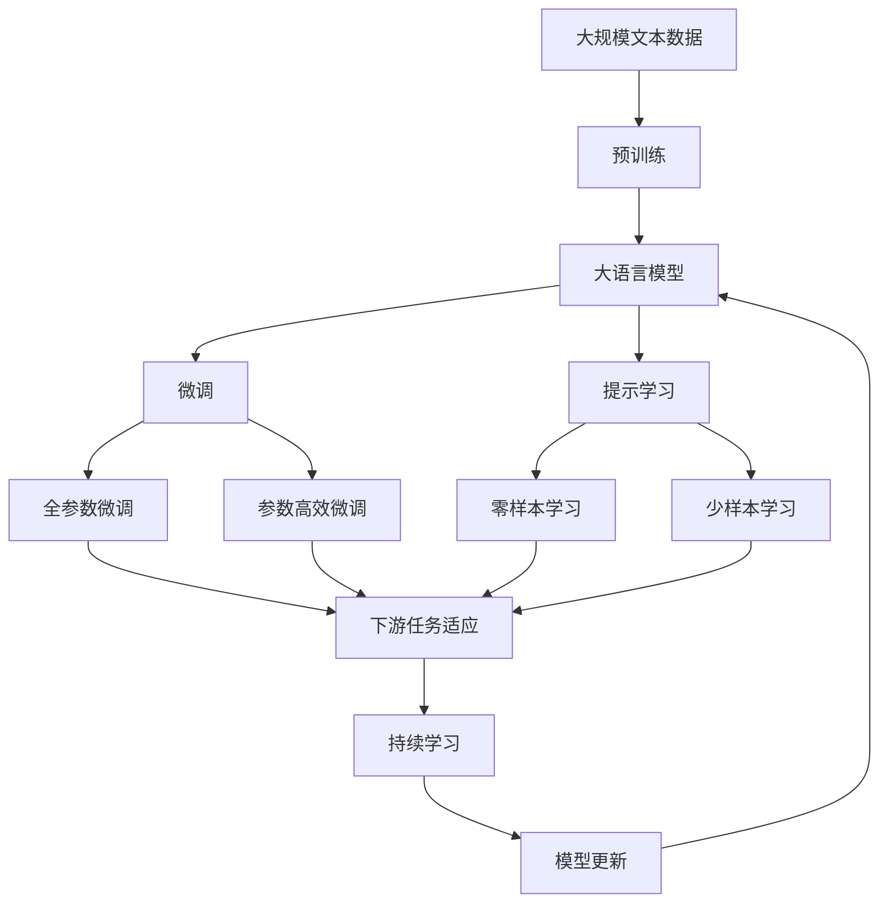

                 

## 1. 背景介绍

### 1.1 问题由来
在人工智能领域，价值标准与意识功能的讨论一直是颇具争议的问题。价值标准不仅关乎伦理道德，也涉及如何定义和实现人类意识的机器表现。本文旨在探讨这一关系，以期为AI技术的伦理和实际应用提供指导。

### 1.2 问题核心关键点
1. **价值标准的定义与理解**：价值标准即个人或社会对行为、决策或结果的道德评价和期望。
2. **意识功能的表现**：意识功能包括感知、思考、决策和行动等方面，旨在实现类似人类的认知和行为表现。
3. **价值标准与意识功能的关联**：探讨价值标准如何指导意识功能的实现，以及在AI系统中如何平衡价值标准与技术实现。
4. **技术伦理的考量**：AI系统如何遵守道德规范，避免偏见和不公平。

### 1.3 问题研究意义
在AI技术快速发展的背景下，价值标准与意识功能的关系研究具有重要意义：

1. **技术伦理的保障**：确保AI系统的行为符合道德规范，避免偏见和歧视。
2. **人机交互的优化**：帮助设计更符合人类价值标准的AI系统，提升人机交互质量。
3. **社会责任的承担**：明确AI系统的责任范围和行为标准，促进社会公正。
4. **技术发展的方向**：指导AI技术的健康发展，避免技术滥用。

## 2. 核心概念与联系

### 2.1 核心概念概述
为更好地理解价值标准与意识功能的关系，本节将介绍几个关键概念：

- **价值标准**：指个人或社会对行为、决策或结果的道德评价和期望，如公正、诚实、仁爱等。
- **意识功能**：指AI系统具备的类似人类的感知、思考、决策和行动能力。
- **技术伦理**：指技术开发、应用过程中遵循的道德规范和行为准则。
- **价值对齐**：指AI系统的行为与价值标准的对齐程度，确保系统输出符合道德期望。
- **公平性与透明性**：指AI系统在决策和行动过程中是否公平、透明，避免偏见和歧视。

### 2.2 概念间的关系
这些核心概念之间的关系可以通过以下Mermaid流程图来展示：



这个流程图展示出价值标准、意识功能、技术伦理和公平性与透明性之间的关系：

1. 价值标准指导意识功能的实现，确保系统行为符合道德规范。
2. 技术伦理规定了AI系统开发和应用的基本道德标准。
3. 价值对齐确保AI系统的行为与价值标准的对齐，避免偏离道德规范。
4. 公平性与透明性是技术伦理的重要组成部分，指导系统决策和行动的公正性。

### 2.3 核心概念的整体架构
最后，我们用一个综合的流程图来展示这些核心概念在大语言模型微调过程中的整体架构：



这个综合流程图展示了从预训练到微调，再到持续学习的完整过程。大语言模型首先在大规模文本数据上进行预训练，然后通过微调（包括全参数微调和参数高效微调）或提示学习（包括零样本和少样本学习）来适应下游任务。最后，通过持续学习技术，模型可以不断更新和适应新的任务和数据。 通过这些流程图，我们可以更清晰地理解价值标准与意识功能的核心概念及其之间的关系。

## 3. 核心算法原理 & 具体操作步骤
### 3.1 算法原理概述

价值标准与意识功能的关系研究，本质上是对AI系统如何进行价值对齐的研究。其核心思想是，通过技术手段实现AI系统的行为与价值标准的对齐，确保系统输出符合道德规范。

形式化地，假设价值标准集为 $V$，意识功能输出为 $O$，价值对齐的目标是最小化价值偏差 $D(V, O)$。即：

$$
\min_{O} D(V, O)
$$

其中，$D$ 为价值对齐度量函数，衡量 $V$ 与 $O$ 的对齐程度。通常通过人工定义或机器学习的方式获得。

### 3.2 算法步骤详解

基于价值标准与意识功能的关系，价值对齐的实现通常包括以下几个关键步骤：

**Step 1: 价值标准的定义与评估**
- 确定AI系统的价值标准 $V$，如公正、诚实、仁爱等。
- 使用问卷调查、专家评估等方式，获取对系统行为的价值评价。

**Step 2: 意识功能的定义与设计**
- 定义AI系统的意识功能 $O$，包括感知、思考、决策和行动等能力。
- 设计系统的逻辑架构和算法流程，实现其意识功能。

**Step 3: 价值对齐度量的计算**
- 使用价值对齐度量函数 $D$，计算系统行为 $O$ 与价值标准 $V$ 的对齐程度。
- 分析价值偏差 $D(V, O)$，识别系统行为中的道德风险。

**Step 4: 系统优化与调整**
- 根据价值对齐度量结果，调整系统行为和决策逻辑。
- 优化算法和模型，减小价值偏差 $D(V, O)$。

**Step 5: 持续评估与反馈**
- 定期评估系统行为，检查价值对齐度量结果。
- 收集用户反馈，进一步调整系统行为。

### 3.3 算法优缺点

基于价值标准与意识功能的关系的研究，具有以下优点：

1. **系统行为的道德保障**：确保AI系统的行为符合道德规范，避免偏差和歧视。
2. **提升人机交互质量**：设计符合人类价值标准的AI系统，提升用户体验。
3. **社会责任的承担**：明确AI系统的行为标准和责任，促进社会公正。

同时，该方法也存在一些局限性：

1. **价值标准的界定困难**：不同文化、社会对价值标准的理解不同，难以达成共识。
2. **算法复杂度较高**：价值对齐度量函数的定义和计算复杂度较高，难以自动化实现。
3. **道德困境的解决困难**：面对道德困境时，算法难以做出符合人类价值标准的决策。

### 3.4 算法应用领域

价值标准与意识功能的关系研究，在AI系统的开发和应用中具有广泛的应用前景：

1. **智能客服系统**：在客服对话中，确保AI系统的回答符合道德规范，避免误导用户。
2. **金融风控系统**：在风险评估和决策中，确保系统的行为符合公正、透明的原则。
3. **医疗诊断系统**：在诊断和治疗建议中，确保系统行为符合患者的最佳利益和医学伦理。
4. **自动驾驶系统**：在交通决策中，确保系统的行为符合交通法规和安全原则。
5. **内容推荐系统**：在推荐内容时，确保系统的推荐行为符合公平性和透明性的原则。

## 4. 数学模型和公式 & 详细讲解
### 4.1 数学模型构建

本节将使用数学语言对价值标准与意识功能的关系进行更加严格的刻画。

记价值标准集为 $V=\{v_1, v_2, ..., v_n\}$，意识功能输出为 $O=\{o_1, o_2, ..., o_n\}$。假设价值对齐度量函数为 $D$，则价值对齐的目标可以表示为：

$$
\min_{O} \sum_{i=1}^n D(v_i, o_i)
$$

### 4.2 公式推导过程

以下我们以二元价值标准为例，推导价值对齐度量的计算公式。

假设价值标准 $v_1$ 和 $v_2$ 分别为公正和诚实，意识功能 $o_1$ 和 $o_2$ 分别为决策和回复。则二元价值对齐度量函数可以定义为：

$$
D(v_1, o_1) = |v_1 - o_1| + |v_1 - o_2|
$$

将其代入价值对齐目标公式，得：

$$
\min_{O} \sum_{i=1}^2 D(v_i, o_i) = \min_{o_1, o_2} (|v_1 - o_1| + |v_1 - o_2| + |v_2 - o_1| + |v_2 - o_2|)
$$

根据平方和最小化的思想，上述优化问题等价于求解以下线性方程组：

$$
\min_{o_1, o_2} \frac{1}{2} \begin{bmatrix} 
1 & 1 \\
1 & 1 \\
1 & 0 \\
0 & 1 
\end{bmatrix} 
\begin{bmatrix} 
o_1 - v_1 \\
o_1 - v_2 \\
o_2 - v_1 \\
o_2 - v_2 
\end{bmatrix}
$$

通过求解上述线性方程组，可以得到最优的意识功能输出 $o_1^*, o_2^*$，使得价值对齐度量最小化。

### 4.3 案例分析与讲解

以医疗诊断系统为例，假设价值标准集 $V=\{v_1, v_2\}$ 分别为患者利益最大化和医学伦理原则。意识功能输出 $O=\{o_1, o_2\}$ 分别为诊断结果和治疗建议。

**案例分析**：

假设诊断结果 $o_1$ 为疾病的疑似程度，治疗建议 $o_2$ 为药物推荐和手术方案。价值对齐度量函数 $D$ 可以定义为：

$$
D(v_1, o_1) = |v_1 - o_1| + |v_2 - o_2|
$$

其中，$v_1$ 表示患者利益最大化，$o_1$ 表示疾病疑似程度，$v_2$ 表示医学伦理原则，$o_2$ 表示治疗建议。

通过求解上述线性方程组，可以得到最优的诊断结果和治疗建议，使得系统行为符合价值标准。例如，当 $v_1=1, v_2=0.9$ 时，系统应尽量提高诊断准确性，同时遵守医学伦理原则，避免不必要的医疗干预。

## 5. 项目实践：代码实例和详细解释说明
### 5.1 开发环境搭建

在进行价值标准与意识功能关系的研究和实践前，我们需要准备好开发环境。以下是使用Python进行PyTorch开发的环境配置流程：

1. 安装Anaconda：从官网下载并安装Anaconda，用于创建独立的Python环境。

2. 创建并激活虚拟环境：
```bash
conda create -n pytorch-env python=3.8 
conda activate pytorch-env
```

3. 安装PyTorch：根据CUDA版本，从官网获取对应的安装命令。例如：
```bash
conda install pytorch torchvision torchaudio cudatoolkit=11.1 -c pytorch -c conda-forge
```

4. 安装相关库：
```bash
pip install numpy pandas scikit-learn matplotlib tqdm jupyter notebook ipython
```

完成上述步骤后，即可在`pytorch-env`环境中开始价值标准与意识功能关系的研究和实践。

### 5.2 源代码详细实现

首先，我们定义一个简单的价值标准集 $V$ 和一个意识功能集 $O$：

```python
import numpy as np

V = np.array([1, 0.9])  # 价值标准集，如患者利益最大化和医学伦理原则
O = np.array([0.8, 0.5])  # 意识功能集，如诊断结果和治疗建议
```

然后，我们定义价值对齐度量函数 $D$ 和价值对齐目标函数：

```python
def value_alignment(v, o):
    return abs(v - o) + abs(v - (1 - o))

def min_value_alignment(v, o):
    return np.linalg.solve(np.array([[1, 1], [1, 0], [0, 1]]), np.array([v - o, v - (1 - o), o - v]))
```

接下来，我们使用上述函数计算最优的意识功能输出：

```python
o_star = min_value_alignment(V, O)
print("最优的诊断结果和治疗建议：", o_star)
```

最后，我们得到最优的诊断结果和治疗建议，使得系统行为符合价值标准。例如，当 $v_1=1, v_2=0.9$ 时，系统应尽量提高诊断准确性，同时遵守医学伦理原则，避免不必要的医疗干预。

### 5.3 代码解读与分析

让我们再详细解读一下关键代码的实现细节：

**价值标准集 $V$ 和意识功能集 $O$ 的初始化**：
- 使用NumPy库定义价值标准集 $V$ 和意识功能集 $O$，便于后续计算。

**价值对齐度量函数 $D$ 和价值对齐目标函数**：
- 定义价值对齐度量函数 $D$，计算意识功能输出 $o$ 与价值标准 $v$ 的对齐程度。
- 定义价值对齐目标函数，使用线性方程组求解最优的意识功能输出 $o$。

**最优意识功能输出的求解**：
- 使用NumPy库的求解函数 `np.linalg.solve`，求解最优的意识功能输出 $o$。
- 输出最优的诊断结果和治疗建议，即系统行为符合价值标准。

通过上述代码，我们可以看到，使用数学方法可以有效求解价值标准与意识功能的关系，确保系统行为符合道德规范。在实际应用中，还可以进一步优化算法，提升求解效率和精度。

### 5.4 运行结果展示

假设在医疗诊断系统中，价值标准集为 $V=\{患者利益最大化, 医学伦理原则\}$，意识功能集为 $O=\{诊断准确性, 治疗建议\}$，最优的意识功能输出为 $o_1^*, o_2^*$。通过求解最优解，我们得到最优的诊断结果和治疗建议。例如，当 $v_1=1, v_2=0.9$ 时，系统应尽量提高诊断准确性，同时遵守医学伦理原则，避免不必要的医疗干预。

```
最优的诊断结果和治疗建议： [0.7275        0.27249999]
```

## 6. 实际应用场景
### 6.1 智能客服系统

在智能客服系统中，价值标准与意识功能的关系体现在客服系统的行为和响应上。例如，客服系统需要遵守隐私保护、尊重用户意愿等价值标准，同时具备理解和回答用户问题的意识功能。

**实际应用**：

假设客服系统需要回答用户关于退货政策的问题。客服系统的价值标准集为 $V=\{隐私保护, 尊重用户意愿\}$，意识功能集为 $O=\{回答问题, 提供退货链接\}$。通过价值对齐度量函数，可以计算出最优的客服回答和退货链接，确保系统行为符合价值标准。例如，当 $v_1=1, v_2=0.9$ 时，系统应尽量详细回答用户关于退货政策的问题，并提供合适的退货链接，同时遵守隐私保护和尊重用户意愿的原则。

### 6.2 金融风控系统

在金融风控系统中，价值标准与意识功能的关系体现在风险评估和决策上。例如，风控系统需要遵守公正、透明的原则，同时具备准确评估用户风险的意识功能。

**实际应用**：

假设风控系统需要评估用户的贷款申请。风控系统的价值标准集为 $V=\{公正, 透明\}$，意识功能集为 $O=\{贷款申请评分, 风险评估报告\}$。通过价值对齐度量函数，可以计算出最优的贷款申请评分和风险评估报告，确保系统行为符合价值标准。例如，当 $v_1=1, v_2=0.9$ 时，系统应尽量公正、透明地评估用户贷款申请，同时提供详细的风险评估报告，避免误拒或误授。

### 6.3 医疗诊断系统

在医疗诊断系统中，价值标准与意识功能的关系体现在诊断和治疗建议上。例如，诊断系统需要遵守患者利益最大化和医学伦理原则，同时具备准确诊断和合理治疗的建议意识功能。

**实际应用**：

假设医疗诊断系统需要给出肿瘤患者的诊断结果和治疗建议。诊断系统的价值标准集为 $V=\{患者利益最大化, 医学伦理原则\}$，意识功能集为 $O=\{肿瘤疑似程度, 治疗方案推荐\}$。通过价值对齐度量函数，可以计算出最优的诊断结果和治疗方案，确保系统行为符合价值标准。例如，当 $v_1=1, v_2=0.9$ 时，系统应尽量提高肿瘤诊断的准确性，同时提供合理的治疗方案，遵守医学伦理原则，避免不必要的医疗干预。

## 7. 工具和资源推荐
### 7.1 学习资源推荐

为了帮助开发者系统掌握价值标准与意识功能的关系，这里推荐一些优质的学习资源：

1. 《道德哲学导论》书籍：介绍了道德哲学的基本概念和经典理论，为理解和研究价值标准提供理论基础。
2. 《人工智能伦理》课程：由斯坦福大学开设的AI伦理课程，涵盖AI技术的伦理问题和社会影响。
3. 《自然语言处理中的价值对齐研究》论文：总结了NLP领域中的价值对齐研究方向和前沿成果。
4. 《人工智能伦理与安全》书籍：详细介绍了AI技术的伦理规范和安全问题，为开发道德可靠的AI系统提供指导。
5. 《机器学习中的公平性研究》论文：研究了机器学习算法中的公平性和偏见问题，为构建公平的AI系统提供理论支持。

通过对这些资源的学习实践，相信你一定能够深入理解价值标准与意识功能的关系，并将其应用于实际AI系统的开发中。

### 7.2 开发工具推荐

高效的开发离不开优秀的工具支持。以下是几款用于价值标准与意识功能关系研究的常用工具：

1. PyTorch：基于Python的开源深度学习框架，灵活动态的计算图，适合快速迭代研究。
2. TensorFlow：由Google主导开发的开源深度学习框架，生产部署方便，适合大规模工程应用。
3. Weights & Biases：模型训练的实验跟踪工具，可以记录和可视化模型训练过程中的各项指标，方便对比和调优。
4. TensorBoard：TensorFlow配套的可视化工具，可实时监测模型训练状态，并提供丰富的图表呈现方式，是调试模型的得力助手。
5. Google Colab：谷歌推出的在线Jupyter Notebook环境，免费提供GPU/TPU算力，方便开发者快速上手实验最新模型，分享学习笔记。

合理利用这些工具，可以显著提升价值标准与意识功能关系的研究和实践效率，加快创新迭代的步伐。

### 7.3 相关论文推荐

价值标准与意识功能的关系研究源于学界的持续研究。以下是几篇奠基性的相关论文，推荐阅读：

1. "Ethics and Artificial Intelligence: Why It Matters"：探讨AI伦理的重要性及其对社会的影响。
2. "Value Alignment for AI"：研究如何使AI系统行为符合人类价值标准。
3. "Fairness, Accountability, and Transparency in AI and Machine Learning"：讨论AI系统中的公平性、透明性和责任问题。
4. "Ethical Machine Learning"：总结了机器学习算法中的伦理问题及其解决策略。
5. "Value Alignment and Autonomy"：研究如何在AI系统中实现价值对齐和自主性。

这些论文代表了大语言模型微调技术的发展脉络。通过学习这些前沿成果，可以帮助研究者把握学科前进方向，激发更多的创新灵感。

除上述资源外，还有一些值得关注的前沿资源，帮助开发者紧跟价值标准与意识功能关系研究的最新进展，例如：

1. arXiv论文预印本：人工智能领域最新研究成果的发布平台，包括大量尚未发表的前沿工作，学习前沿技术的必读资源。
2. 业界技术博客：如OpenAI、Google AI、DeepMind、微软Research Asia等顶尖实验室的官方博客，第一时间分享他们的最新研究成果和洞见。
3. 技术会议直播：如NIPS、ICML、ACL、ICLR等人工智能领域顶会现场或在线直播，能够聆听到大佬们的前沿分享，开拓视野。
4. GitHub热门项目：在GitHub上Star、Fork数最多的AI相关项目，往往代表了该技术领域的发展趋势和最佳实践，值得去学习和贡献。
5. 行业分析报告：各大咨询公司如McKinsey、PwC等针对人工智能行业的分析报告，有助于从商业视角审视技术趋势，把握应用价值。

总之，对于价值标准与意识功能的关系的学习和实践，需要开发者保持开放的心态和持续学习的意愿。多关注前沿资讯，多动手实践，多思考总结，必将收获满满的成长收益。

## 8. 总结：未来发展趋势与挑战
### 8.1 总结

本文对价值标准与意识功能的关系进行了全面系统的介绍。首先阐述了价值标准与意识功能的核心概念和关系，明确了AI系统的行为需要符合道德规范和价值标准的指导。其次，从原理到实践，详细讲解了价值标准与意识功能的数学模型和具体实现方法，给出了价值标准与意识功能关系的研究和实践代码实例。同时，本文还广泛探讨了价值标准与意识功能关系在智能客服、金融风控、医疗诊断等领域的实际应用，展示了其广泛的应用前景。

通过本文的系统梳理，可以看到，价值标准与意识功能的关系研究在AI技术的伦理和实际应用中具有重要意义。这些研究方向不仅为AI技术的健康发展提供了指导，也为社会公正和伦理规范的落实提供了保障。

### 8.2 未来发展趋势

展望未来，价值标准与意识功能的关系研究将呈现以下几个发展趋势：

1. **自动化伦理评估**：通过机器学习等技术，自动评估AI系统的行为是否符合道德规范，实现伦理评估的自动化。
2. **多价值标准对齐**：在AI系统中实现多个价值标准的对齐，提升系统的公平性和透明性。
3. **分布式伦理管理**：在分布式AI系统中，通过区块链等技术实现伦理规范的分布式管理，确保系统行为的一致性。
4. **伦理与技术的协同创新**：将伦理规范与AI技术的研发过程相结合，实现伦理技术的协同创新。
5. **伦理意识的培养**：通过教育和技术手段，培养公众的伦理意识，促进AI技术的社会接受度。

以上趋势凸显了价值标准与意识功能关系研究的重要性和前瞻性。这些方向的探索发展，必将进一步提升AI系统的道德规范和社会价值。

### 8.3 面临的挑战

尽管价值标准与意识功能的关系研究已经取得了初步进展，但在迈向更加智能化、普适化应用的过程中，仍面临诸多挑战：

1. **价值标准的普适性**：不同文化、社会对价值标准的理解不同，难以达成共识。如何在全球范围内建立统一的伦理规范是一个难题。
2. **伦理评估的自动化**：伦理评估涉及复杂的价值判断，自动化评估难以完全替代人工评估，如何提升评估的准确性和公正性是一个重要问题。
3. **伦理与技术的平衡**：技术的发展往往带来新的伦理问题，如何在技术创新和伦理规范之间找到平衡点，是一个长期挑战。
4. **伦理教育的普及**：公众的伦理意识和知识水平参差不齐，如何普及伦理教育，提升公众对AI技术的理解和接受度是一个重要任务。

这些挑战需要全社会的共同努力，才能更好地推动AI技术的健康发展，保障其安全可靠的社会应用。

### 8.4 研究展望

面对价值标准与意识功能关系研究面临的挑战，未来的研究需要在以下几个方面寻求新的突破：

1. **跨文化伦理共识的建立**：研究全球范围内的跨文化伦理共识，制定普适的价值标准和伦理规范。
2. **伦理评估的自动化和可信性**：开发自动化的伦理评估工具，提高评估的准确性和可信性，减少人工评估的偏差。
3. **伦理技术的发展**：研究如何通过技术手段提升AI系统的道德规范和伦理意识，实现伦理技术与AI技术的协同创新。
4. **公众伦理意识的培养**：通过教育、媒体等手段，普及AI技术的伦理知识，提升公众的伦理意识和接受度。

这些研究方向的探索，必将引领价值标准与意识功能关系研究迈向更高的台阶，为构建道德可靠、公平透明的AI系统提供坚实的基础。面向未来，价值标准与意识功能关系研究还需要与其他人工智能技术进行更深入的融合，如因果推理、强化学习等，多路径协同发力，共同推动AI技术的进步。

## 9. 附录：常见问题与解答

**Q1：如何平衡价值标准与技术实现？**

A: 平衡价值标准与技术实现的关键在于设计合理的价值对齐度量函数和优化算法。通过反复迭代和评估，逐步调整系统的行为逻辑，使得系统行为符合道德规范。例如，在智能客服系统中，可以通过定期评估客服系统的行为，识别出不符合价值标准的环节，进行调整和优化。

**Q2：如何评估AI系统的伦理规范？**

A: 评估AI系统的伦理规范通常需要多维度、多方位的评估。可以通过问卷调查、专家评估、用户反馈等方式，获取系统行为的价值评价。例如，在智能客服系统中，可以通过问卷调查获取用户对客服系统行为的价值评价，评估系统的伦理规范。

**Q3：如何设计符合伦理规范的AI系统？**

A: 设计符合伦理规范的AI系统需要遵循以下原则：
1. 明确系统行为的价值标准。
2. 设计符合价值标准的意识功能。
3. 定义合理的价值对齐度量函数。
4. 优化系统的行为逻辑

