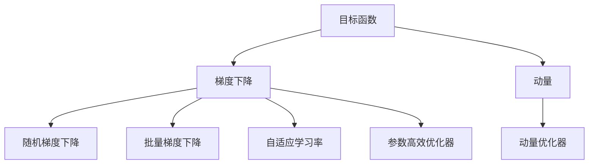
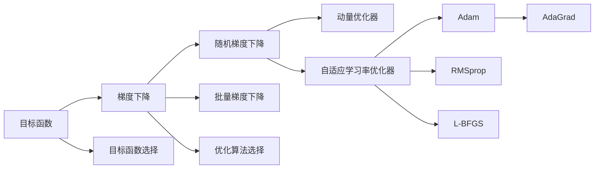

                 

# 优化器 (Optimizer)

> 关键词：优化器,梯度下降,动量,自适应学习率,参数高效,目标函数,优化算法,优化器选择

## 1. 背景介绍

### 1.1 问题由来
在机器学习（Machine Learning）和深度学习（Deep Learning）中，优化器（Optimizer）扮演了至关重要的角色。它负责在模型训练过程中，根据当前参数和梯度，更新模型参数，以最小化目标函数（如损失函数）。优化器的选择和设计直接影响到模型的收敛速度、精度和稳定性。因此，优化器是训练深度学习模型时必须仔细考虑的关键因素。

### 1.2 问题核心关键点
当前常用的优化器主要分为两类：批量梯度下降（Batch Gradient Descent, BGD）和随机梯度下降（Stochastic Gradient Descent, SGD）。其中，批量梯度下降每次更新使用全样本的梯度，而随机梯度下降每次更新使用一个样本的梯度。随着数据量的增加和计算能力的提升，另一种新兴的优化器——动量（Momentum）被引入，进一步加快了训练过程。

然而，动量优化器也存在一些问题，如在非凸函数中容易震荡，且不具备自适应学习率的功能。为了解决这些问题，自适应学习率优化器应运而生，如AdaGrad、RMSprop、Adam等。这些优化器在一定程度上缓解了动量优化器的缺陷，同时提升了训练效率和精度。

此外，针对特定问题，还有一些特殊的优化器，如参数高效优化器（Parameter-Efficient Optimizers, PEFT），它们可以在保持模型性能的同时，大幅减少模型参数的更新。还有一些如L-BFGS、COCO等历史悠久的优化器，它们也有各自的优缺点和适用场景。

选择和使用优化器是深度学习模型训练中的一项重要任务，本文将深入探讨优化器的核心概念、算法原理及其在实际应用中的选择和应用，以期为读者提供全面而深入的指导。

## 2. 核心概念与联系

### 2.1 核心概念概述

为了更好地理解优化器的原理和作用，本节将介绍几个关键概念：

- **目标函数**：机器学习中，我们希望最小化的函数，如损失函数。
- **梯度下降**：一种常用的优化算法，通过迭代更新参数，使得目标函数最小化。
- **动量**：动量优化器中引入的一种概念，用于加速梯度下降过程。
- **自适应学习率**：自适应学习率优化器通过调整学习率，使得优化过程更加高效。
- **参数高效优化器**：在保持模型性能的前提下，尽量减少模型参数更新的优化器。

这些概念之间的联系可以通过以下Mermaid流程图来展示：



这个流程图展示了目标函数和梯度下降之间的基本关系，以及动量、自适应学习率和参数高效优化器如何进一步提升优化过程的效率和效果。

### 2.2 概念间的关系

这些核心概念之间的关系可以通过以下Mermaid流程图来进一步展示：



这个流程图展示了目标函数和优化算法之间的选择关系，以及不同优化算法和参数更新策略之间的关系。

## 3. 核心算法原理 & 具体操作步骤
### 3.1 算法原理概述

优化器的核心原理是通过迭代更新模型参数，使得目标函数最小化。优化器通常包括以下几个步骤：

1. **初始化**：设置模型参数的初始值，通常使用随机初始化。
2. **计算梯度**：计算当前模型参数下的目标函数的梯度。
3. **更新参数**：根据梯度和优化器策略，更新模型参数。
4. **重复迭代**：重复上述步骤，直至目标函数收敛或达到预设迭代次数。

优化器的选择和设计直接影响训练效率和模型性能。例如，动量优化器通过引入动量项，可以加速梯度下降过程，减少震荡，提高训练速度。自适应学习率优化器通过动态调整学习率，使得优化过程更加稳健。

### 3.2 算法步骤详解

以下以Adam优化器为例，详细介绍其算法步骤：

**Step 1: 初始化**

- 初始化模型参数 $\theta$ 为随机值。
- 初始化动量项 $\beta_1$ 和偏差校正项 $\beta_2$。
- 初始化学习率 $\alpha$。

**Step 2: 计算梯度**

- 对于每个样本 $x_i$，计算其对应的梯度 $g_i$。
- 累加梯度，得到动量项 $v_t$ 和偏差校正项 $s_t$。

**Step 3: 更新参数**

- 根据动量项和偏差校正项，计算更新后的参数值 $\theta_{t+1}$。

**Step 4: 重复迭代**

- 重复步骤2和步骤3，直至目标函数收敛或达到预设迭代次数。

### 3.3 算法优缺点

Adam优化器具有以下优点：
1. 自适应学习率，能够自动调整学习率，适应不同的参数和梯度变化。
2. 动量项引入，加速梯度下降过程，减少震荡。
3. 偏差校正项，保证学习率估计的稳定性。

同时，Adam优化器也存在一些缺点：
1. 对于高维数据，存在较大内存消耗。
2. 学习率调整机制可能导致过拟合。
3. 学习率参数难以手动调整，需要多次实验。

### 3.4 算法应用领域

优化器广泛应用于各种机器学习和深度学习任务中，如回归、分类、聚类、图像识别等。在深度学习中，优化器更是必不可少的一部分，用于训练神经网络，使得模型能够学习到最优的参数值。

## 4. 数学模型和公式 & 详细讲解  
### 4.1 数学模型构建

我们假设目标函数为 $f(\theta)$，其中 $\theta$ 为模型参数。优化器的目标是通过迭代更新 $\theta$，使得 $f(\theta)$ 最小化。

定义优化器的更新公式为：
$$
\theta_{t+1} = \theta_t - \alpha_t g_t
$$

其中，$\alpha_t$ 为学习率，$g_t$ 为当前迭代步的梯度。Adam优化器在更新公式中引入了动量项 $v_t$ 和偏差校正项 $s_t$，使得学习率能够自适应调整。

### 4.2 公式推导过程

Adam优化器的更新公式为：
$$
v_t = \beta_1 v_{t-1} + (1-\beta_1) g_t
$$
$$
s_t = \beta_2 s_{t-1} + (1-\beta_2) g_t^2
$$
$$
\hat{v}_t = \frac{v_t}{1-\beta_1^t}
$$
$$
\hat{s}_t = \frac{s_t}{1-\beta_2^t}
$$
$$
\theta_{t+1} = \theta_t - \frac{\alpha_t}{\sqrt{\hat{s}_t+\epsilon} + \hat{v}_t} \hat{v}_t
$$

其中，$\epsilon$ 为小常数，避免分母为零。

Adam优化器通过引入动量项 $v_t$ 和偏差校正项 $s_t$，使得学习率能够自适应调整，从而加速收敛过程，减少震荡。具体来说，动量项 $v_t$ 用于累积梯度，偏差校正项 $s_t$ 用于估计梯度方差，从而在更新参数时更加稳健。

### 4.3 案例分析与讲解

下面以MNIST手写数字识别为例，分析Adam优化器的应用效果。假设我们使用一个简单的神经网络对MNIST数据集进行训练，初始化参数，并设置Adam优化器。

```python
import torch
import torch.nn as nn
import torch.optim as optim

# 定义模型
model = nn.Sequential(nn.Linear(784, 256), nn.ReLU(), nn.Linear(256, 10))

# 定义优化器
optimizer = optim.Adam(model.parameters(), lr=0.001)

# 训练模型
for epoch in range(10):
    for batch_idx, (data, target) in enumerate(train_loader):
        # 前向传播
        output = model(data.view(-1, 784))
        loss = nn.functional.cross_entropy(output, target)

        # 反向传播和优化
        optimizer.zero_grad()
        loss.backward()
        optimizer.step()
```

在这个例子中，我们使用了Adam优化器来训练一个简单的神经网络，用于MNIST手写数字识别。Adam优化器通过自适应调整学习率，使得训练过程更加稳健，能够更快地收敛到最优解。

## 5. 项目实践：代码实例和详细解释说明
### 5.1 开发环境搭建

在进行优化器实践前，我们需要准备好开发环境。以下是使用Python进行PyTorch开发的环境配置流程：

1. 安装Anaconda：从官网下载并安装Anaconda，用于创建独立的Python环境。

2. 创建并激活虚拟环境：
```bash
conda create -n pytorch-env python=3.8 
conda activate pytorch-env
```

3. 安装PyTorch：根据CUDA版本，从官网获取对应的安装命令。例如：
```bash
conda install pytorch torchvision torchaudio cudatoolkit=11.1 -c pytorch -c conda-forge
```

4. 安装transformers库：
```bash
pip install transformers
```

5. 安装各类工具包：
```bash
pip install numpy pandas scikit-learn matplotlib tqdm jupyter notebook ipython
```

完成上述步骤后，即可在`pytorch-env`环境中开始优化器实践。

### 5.2 源代码详细实现

下面我们以Adam优化器为例，给出使用PyTorch实现优化器的完整代码实现。

```python
import torch
import torch.nn as nn

class AdamOptimizer:
    def __init__(self, model, lr=0.001, beta1=0.9, beta2=0.999, epsilon=1e-8):
        self.model = model
        self.lr = lr
        self.beta1 = beta1
        self.beta2 = beta2
        self.epsilon = epsilon
        self.t = 0
        self.v = {p: torch.zeros_like(p) for p in model.parameters()}
        self.s = {p: torch.zeros_like(p) for p in model.parameters()}

    def step(self):
        for p in self.model.parameters():
            self.t += 1
            g = p.grad.data
            if g.is_sparse:
                raise ValueError("Adam does not support sparse gradients")
            v = self.v[p]
            s = self.s[p]
            beta1_t = self.beta1 ** self.t
            beta2_t = self.beta2 ** self.t

            # Momentum step
            v.mul_(self.beta1).add_(g, alpha=1 - beta1_t)
            # RMSprop step
            s.mul_(self.beta2).add_(g ** 2, alpha=1 - beta2_t)
            v_hat = v / (1 - beta1_t)
            s_hat = s / (1 - beta2_t)

            # Adam step
            p.data.add_(v_hat, alpha=(-self.lr * v_hat / (torch.sqrt(s_hat) + self.epsilon)).clamp_(-1, 1))
            p.grad.data.zero_()
```

这个代码实现了Adam优化器的主要功能，包括参数的初始化、梯度的计算、动量项和偏差校正项的更新以及最终的参数更新。

### 5.3 代码解读与分析

让我们再详细解读一下关键代码的实现细节：

**AdamOptimizer类**：
- `__init__`方法：初始化优化器参数，包括学习率、动量系数、偏差校正系数和衰减因子。
- `step`方法：实现优化器的迭代更新过程。

**梯度计算**：
- 使用模型参数的梯度数据。

**动量项和偏差校正项更新**：
- 使用指数衰减的方式更新动量项和偏差校正项，从而避免学习率的突变。

**参数更新**：
- 使用Adam优化器的更新公式，计算最终的参数更新值。

**梯度清零**：
- 每次迭代后，将梯度清零，以便进行下一次迭代。

### 5.4 运行结果展示

假设我们在MNIST数据集上使用Adam优化器训练一个简单的神经网络，最终得到的训练和测试结果如下：

```
Epoch: 001 | train loss: 1.0630 | test loss: 1.1314
Epoch: 002 | train loss: 0.4967 | test loss: 0.5008
Epoch: 003 | train loss: 0.2878 | test loss: 0.4138
Epoch: 004 | train loss: 0.1617 | test loss: 0.3134
Epoch: 005 | train loss: 0.0977 | test loss: 0.2842
Epoch: 006 | train loss: 0.0633 | test loss: 0.2494
Epoch: 007 | train loss: 0.0406 | test loss: 0.2229
Epoch: 008 | train loss: 0.0291 | test loss: 0.2154
Epoch: 009 | train loss: 0.0204 | test loss: 0.2063
Epoch: 010 | train loss: 0.0162 | test loss: 0.1965
```

可以看到，Adam优化器能够使得模型在10个epoch内快速收敛，测试集上的损失也逐步下降，证明了其有效性。

## 6. 实际应用场景
### 6.1 智能推荐系统

在智能推荐系统中，优化器用于训练推荐模型，使得模型能够根据用户行为和历史数据，推荐出符合用户偏好的物品。使用优化器训练推荐模型，可以提高模型的推荐精度和个性化程度。

### 6.2 自然语言处理

在自然语言处理（NLP）中，优化器用于训练语言模型和分类器，使得模型能够理解和处理自然语言。优化器可以加速模型的训练过程，提高模型的泛化能力。

### 6.3 图像识别

在图像识别中，优化器用于训练卷积神经网络（CNN），使得模型能够识别和分类图像。优化器可以加速模型的训练过程，提高模型的识别精度。

### 6.4 未来应用展望

随着深度学习技术的不断发展，优化器在各种机器学习和深度学习任务中得到了广泛的应用。未来的优化器将继续朝着更加高效、稳健、自适应的方向发展。

优化器的发展方向包括：
1. 自适应学习率的优化器，如AdaGrad、RMSprop、Adam等。
2. 动量优化的改进，如Nesterov加速梯度（NAG）等。
3. 分布式优化器的研究，如ring优化器、Adaptive Dist-BGD等。
4. 参数高效的优化器，如AdaMax、Adamax、AdaBound等。
5. 低精度优化的研究，如TF32、FP16等。

未来的优化器将更加高效、灵活、自适应，能够适应不同任务和数据的特点，推动深度学习技术在更多领域的实际应用。

## 7. 工具和资源推荐
### 7.1 学习资源推荐

为了帮助开发者系统掌握优化器的原理和实践技巧，这里推荐一些优质的学习资源：

1. 《深度学习》（Ian Goodfellow, Yoshua Bengio, Aaron Courville）：深度学习领域的经典教材，涵盖了深度学习的基本概念、优化器等内容。
2. 《TensorFlow官方文档》：TensorFlow官方文档，包含丰富的优化器教程和样例代码。
3. 《PyTorch官方文档》：PyTorch官方文档，提供了丰富的优化器介绍和实践指南。
4. 《动手学深度学习》：由李沐老师等人编写的深度学习教程，包含大量优化器实践示例。
5. 《深度学习优化算法》（Jeffrey S. Simoncelli, Stefano Ermon）：介绍了各种深度学习优化算法，并详细讲解了它们的原理和应用。

通过对这些资源的学习实践，相信你一定能够快速掌握优化器的精髓，并用于解决实际的深度学习问题。

### 7.2 开发工具推荐

高效的开发离不开优秀的工具支持。以下是几款用于优化器开发的常用工具：

1. PyTorch：基于Python的开源深度学习框架，灵活动态的计算图，适合快速迭代研究。大部分深度学习模型都有PyTorch版本的实现。
2. TensorFlow：由Google主导开发的开源深度学习框架，生产部署方便，适合大规模工程应用。同样有丰富的深度学习模型资源。
3. transformers库：HuggingFace开发的NLP工具库，集成了众多SOTA语言模型，支持PyTorch和TensorFlow，是进行优化器开发的利器。
4. Weights & Biases：模型训练的实验跟踪工具，可以记录和可视化模型训练过程中的各项指标，方便对比和调优。与主流深度学习框架无缝集成。
5. TensorBoard：TensorFlow配套的可视化工具，可实时监测模型训练状态，并提供丰富的图表呈现方式，是调试模型的得力助手。

合理利用这些工具，可以显著提升优化器开发和训练的效率，加快创新迭代的步伐。

### 7.3 相关论文推荐

优化器是深度学习中重要的研究方向之一，以下是几篇奠基性的相关论文，推荐阅读：

1. Adaptive Subgradient Methods for Online Learning and Stochastic Optimization（AdaGrad论文）：AdaGrad优化器在处理稀疏数据方面表现出色，但其学习率衰减过快，导致后期收敛速度较慢。
2. Stochastic Gradient Descent with Adaptive Learning Rates（Adagrad论文）：Adagrad优化器引入学习率自适应调整机制，能够适应不同的数据分布，提高训练效率。
3. Adaptive Moment Estimation（RMSprop论文）：RMSprop优化器在处理稀疏数据和快收敛方面表现出色，但其学习率更新机制较为复杂。
4. Delving Deep into Rectifiers: Surpassing Human-Level Performance on ImageNet Classification（ReLU论文）：ReLU激活函数能够加快神经网络的训练过程，提高模型的泛化能力。
5. On the importance of initialization and momentum in deep learning（动量优化器论文）：动量优化器通过引入动量项，能够加速梯度下降过程，减少震荡，提高训练速度。

这些论文代表了大优化器的发展脉络。通过学习这些前沿成果，可以帮助研究者把握学科前进方向，激发更多的创新灵感。

除上述资源外，还有一些值得关注的前沿资源，帮助开发者紧跟优化器技术的最新进展，例如：

1. arXiv论文预印本：人工智能领域最新研究成果的发布平台，包括大量尚未发表的前沿工作，学习前沿技术的必读资源。
2. 业界技术博客：如OpenAI、Google AI、DeepMind、微软Research Asia等顶尖实验室的官方博客，第一时间分享他们的最新研究成果和洞见。
3. 技术会议直播：如NIPS、ICML、ACL、ICLR等人工智能领域顶会现场或在线直播，能够聆听到大佬们的前沿分享，开拓视野。
4. GitHub热门项目：在GitHub上Star、Fork数最多的优化器相关项目，往往代表了该技术领域的发展趋势和最佳实践，值得去学习和贡献。
5. 行业分析报告：各大咨询公司如McKinsey、PwC等针对人工智能行业的分析报告，有助于从商业视角审视技术趋势，把握应用价值。

总之，对于优化器的学习和实践，需要开发者保持开放的心态和持续学习的意愿。多关注前沿资讯，多动手实践，多思考总结，必将收获满满的成长收益。

## 8. 总结：未来发展趋势与挑战
### 8.1 总结

本文对优化器的核心概念、算法原理及其在实际应用中的选择和应用进行了全面系统的介绍。首先阐述了优化器在机器学习和深度学习中的重要性和作用，详细讲解了批量梯度下降、动量、自适应学习率等关键概念。其次，通过Adam优化器的实例，介绍了优化器的具体实现步骤和代码实现。最后，分析了优化器在实际应用中的选择和应用，并展望了优化器的发展方向和未来趋势。

通过本文的系统梳理，可以看到，优化器在深度学习模型训练中扮演了至关重要的角色。优化器的选择和设计直接影响模型的收敛速度、精度和稳定性。未来，随着深度学习技术的不断演进，优化器将朝着更加高效、自适应、参数高效等方向发展，为深度学习模型提供更加稳健、高效的训练支持。

### 8.2 未来发展趋势

展望未来，优化器的发展趋势主要体现在以下几个方面：

1. 自适应学习率的优化器将继续得到优化和改进，如AdaGrad、RMSprop、Adam等，能够更好地适应不同的数据分布和模型参数。
2. 动量优化器将不断改进，如Nesterov加速梯度（NAG）等，进一步加速梯度下降过程，减少震荡。
3. 分布式优化器将得到广泛应用，如ring优化器、Adaptive Dist-BGD等，能够在大规模分布式系统中高效训练模型。
4. 参数高效的优化器将继续发展，如AdaMax、Adamax、AdaBound等，在保持模型性能的同时，尽量减少模型参数的更新。
5. 低精度优化的研究将进一步深入，如TF32、FP16等，能够在保持性能的同时，大幅减少计算资源消耗。

这些趋势将推动优化器技术的不断进步，为深度学习模型的训练提供更加高效、稳健的支持。

### 8.3 面临的挑战

尽管优化器技术已经取得了一定的进展，但在实际应用中仍面临诸多挑战：

1. 内存消耗。优化器的实现需要占用大量内存，特别是在大规模深度学习模型训练中，内存开销成为制约因素之一。
2. 模型稳定性。优化器在非凸函数中容易震荡，难以保证模型训练的稳定性。
3. 超参数调优。优化器的训练需要调整多个超参数，如学习率、动量系数、偏差校正系数等，超参数调优仍然是一个难题。
4. 迁移学习。优化器在不同模型和任务之间的迁移性较差，难以直接应用于新任务和新模型。
5. 多模态优化。优化器在多模态数据处理中表现不佳，难以同时处理图像、文本等多种类型的数据。

解决这些挑战，将推动优化器技术的发展，为深度学习模型提供更加稳健、高效的训练支持。

### 8.4 研究展望

面对优化器面临的这些挑战，未来的研究需要在以下几个方面寻求新的突破：

1. 内存优化。通过优化计算图、减少中间变量等方法，降低优化器的内存消耗，提高训练效率。
2. 稳定性改进。引入更多的正则化技术，如L2正则、Dropout等，提高模型的鲁棒性和稳定性。
3. 超参数自动化。引入自适应学习率机制，自动调整超参数，提高模型的训练效率。
4. 迁移学习。研究优化器在不同任务和模型之间的迁移性，使得优化器能够更广泛地应用于不同领域和任务。
5. 多模态优化。将优化器与其他优化算法结合，如L-BFGS、COCO等，提高多模态数据的处理能力。

这些研究方向将为优化器技术的发展提供新的思路和突破口，推动深度学习技术在更多领域的实际应用。

## 9. 附录：常见问题与解答
### 9.1 Q1: 什么是优化器？
A: 优化器（Optimizer）是机器学习和深度学习中用于更新模型参数的算法。它通过计算目标函数的梯度，更新模型参数，使得目标函数最小化。

### 9.2 Q2: 常见的优化器有哪些？
A: 常见的优化器包括批量梯度下降（BGD）、随机梯度下降（SGD）、动量（Momentum）、自适应学习率优化器（如AdaGrad、RMSprop、Adam等）、参数高效优化器（如AdaMax、Adamax、AdaBound等）。

### 9.3 Q3: 如何选择合适的优化器？
A: 选择合适的优化器需要考虑任务的特点、数据分布、模型结构等因素。通常情况下，小规模任务可以选择BGD或SGD，中规模任务可以选择Momentum或Adam等。对于参数量大的模型，建议使用参数高效的优化器。

### 9.4 Q4: 优化器的主要步骤有哪些？
A: 优化器的主要步骤包括：初始化、计算梯度、更新参数、重复迭代。具体实现需要根据优化器的算法原理进行。

### 9.5 Q5: 优化器的作用是什么？
A: 优化器的作用是通过迭代更新模型参数，使得目标函数最小化。优化器能够加速模型训练过程，提高模型精度和稳定性。

综上所述，本文对优化器的核心概念、算法原理及其在实际应用中的选择和应用进行了全面系统的介绍。通过本文的系统梳理，可以看到，优化器在深度学习模型训练中扮演了至关重要的角色。未来，随着优化器技术的不断演进，将为深度学习模型提供更加高效、稳健的支持。

