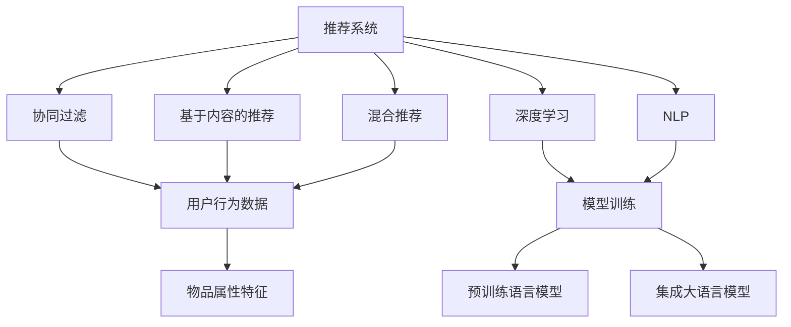
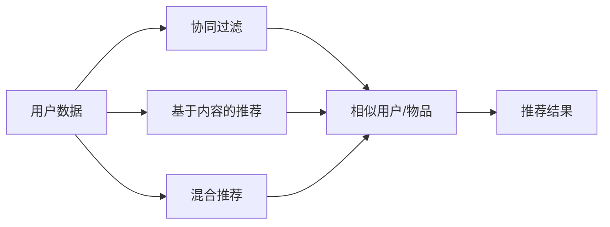
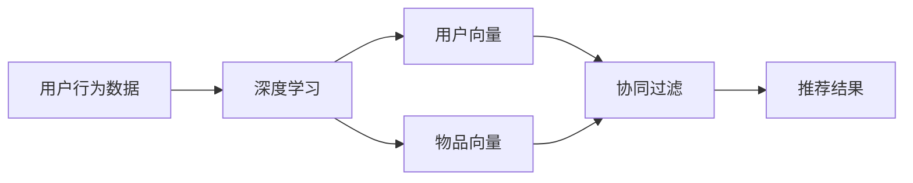
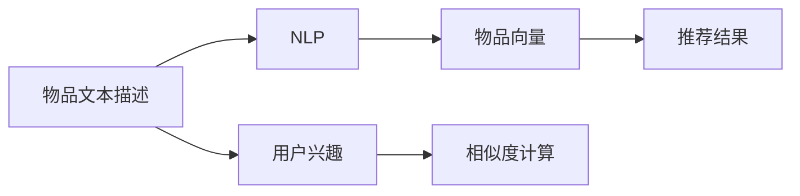
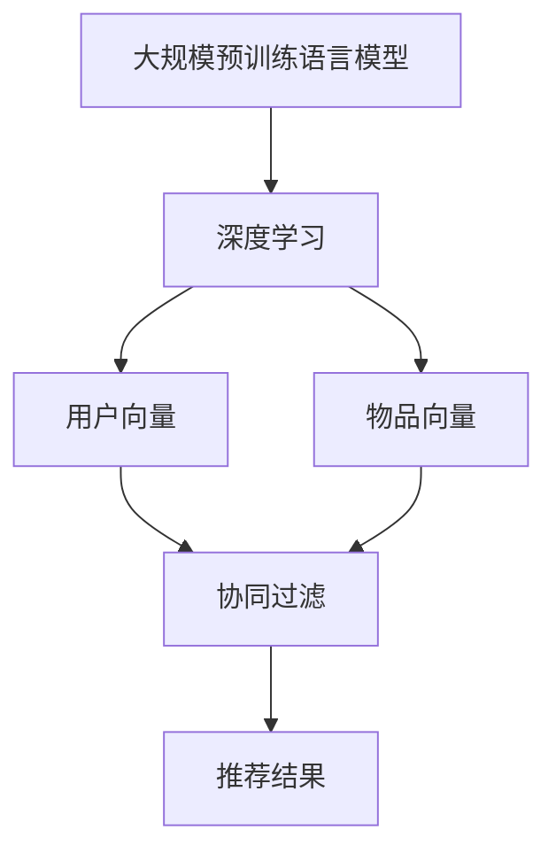
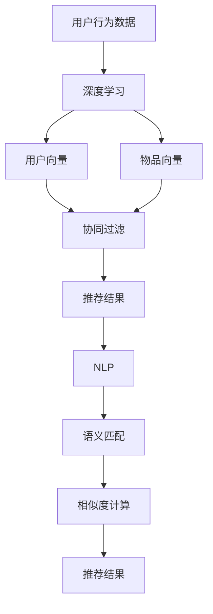

                 

## 1. 背景介绍

### 1.1 问题由来

在数字化和信息化时代的浪潮下，搜索引擎和推荐系统成为各类应用场景中不可或缺的组件。从电商到社交媒体，从新闻网站到在线视频平台，这些系统都在以不同的方式帮助用户快速定位所需信息，提升用户体验。然而，传统推荐系统往往缺乏深度学习和自然语言处理等高级技术，推荐结果的精度和个性化程度有限。随着大规模预训练语言模型的兴起，这些系统得到了质的飞跃。

大语言模型如BERT、GPT等，通过在大规模无标签文本数据上预训练，获得了强大的语言理解和生成能力。它们在自然语言处理（NLP）领域取得了显著进展，并在推荐系统中的应用也日趋广泛。通过将大语言模型与推荐系统结合，可以实现更加个性化、精准的结果提供。

### 1.2 问题核心关键点

1. **数据预处理与特征提取**：推荐系统需要处理海量的文本数据，进行有效的数据预处理和特征提取，是系统成功的基础。
2. **用户模型与推荐算法**：推荐系统通常采用协同过滤、基于内容的推荐、混合推荐等算法，用户模型的构建和推荐策略的选择至关重要。
3. **大语言模型集成**：如何将大语言模型有效集成到推荐系统中，提升推荐结果的准确性和多样性，是当前研究的热点。
4. **结果排序与展示**：推荐系统不仅需要生成准确的推荐结果，还需要对结果进行有效的排序和展示，以增强用户体验。

### 1.3 问题研究意义

对传统搜索推荐系统的结果提供进行改进，不仅有助于提升推荐系统的精度和个性化程度，还可以增强用户体验和满意度，为应用场景带来更高的商业价值。具体来说：

1. **提高推荐精度**：大语言模型在理解文本语义、进行语义匹配方面具备天然优势，可以显著提升推荐结果的精度。
2. **增强个性化推荐**：通过大语言模型的语义理解，推荐系统可以更准确地捕捉用户兴趣和偏好，提供更加个性化的推荐结果。
3. **提升系统可用性**：大语言模型可以增强搜索功能的准确性，提高推荐系统的推荐效果，降低用户筛选信息的时间成本。
4. **优化资源利用**：通过大语言模型，推荐系统可以更智能地利用用户行为数据，优化资源配置和推荐策略。
5. **拓展应用场景**：推荐系统的改进和优化，可以应用到更广泛的领域，如智能客服、内容推荐、广告投放等。

## 2. 核心概念与联系

### 2.1 核心概念概述

为更好地理解大语言模型在传统搜索推荐系统中的应用，本节将介绍几个密切相关的核心概念：

- **推荐系统**：指根据用户历史行为、兴趣和社交关系等信息，为用户推荐感兴趣物品的系统。
- **协同过滤**：通过分析用户历史行为数据，寻找相似用户或物品，从而推荐相似物品的系统。
- **基于内容的推荐**：通过分析物品的属性特征，推荐与用户历史兴趣相似的物品的系统。
- **混合推荐**：结合多种推荐算法，通过多模型融合的方式，提升推荐系统的综合性能。
- **深度学习**：通过构建复杂的神经网络模型，实现对大规模数据的高效学习和处理。
- **自然语言处理（NLP）**：通过计算机处理、理解、生成人类语言的技术，广泛应用于文本分类、情感分析、语言模型等任务。
- **大规模预训练语言模型**：指在大规模无标签文本数据上预训练得到的语言模型，如BERT、GPT等。

这些概念之间的逻辑关系可以通过以下Mermaid流程图来展示：



这个流程图展示了大语言模型在推荐系统中的主要应用场景和相关概念。

### 2.2 概念间的关系

这些核心概念之间存在着紧密的联系，形成了推荐系统的完整生态系统。下面我通过几个Mermaid流程图来展示这些概念之间的关系。

#### 2.2.1 推荐系统的基本原理



这个流程图展示了推荐系统从用户数据到推荐结果的流程。推荐系统通过分析用户行为数据，构建用户模型，结合协同过滤、基于内容的推荐和混合推荐等多种算法，生成推荐结果。

#### 2.2.2 深度学习在推荐系统中的应用



这个流程图展示了深度学习在推荐系统中的应用。通过构建神经网络模型，将用户行为数据转化为用户向量和物品向量，结合协同过滤算法，生成推荐结果。

#### 2.2.3 自然语言处理在推荐系统中的应用



这个流程图展示了NLP在推荐系统中的应用。通过分析物品文本描述，使用NLP技术提取物品向量，结合用户兴趣，进行相似度计算，生成推荐结果。

#### 2.2.4 大规模预训练语言模型在推荐系统中的应用



这个流程图展示了大规模预训练语言模型在推荐系统中的应用。通过预训练语言模型生成用户向量和物品向量，结合协同过滤算法，生成推荐结果。

### 2.3 核心概念的整体架构

最后，我们用一个综合的流程图来展示这些核心概念在大语言模型在推荐系统中的应用：



这个综合流程图展示了从用户行为数据到推荐结果的全过程。推荐系统通过深度学习生成用户向量和物品向量，结合协同过滤算法，进行语义匹配和相似度计算，生成最终的推荐结果。

## 3. 核心算法原理 & 具体操作步骤
### 3.1 算法原理概述

基于大语言模型在推荐系统中的应用，主要分为以下几个步骤：

1. **数据预处理**：收集用户行为数据，进行清洗和特征提取，构建用户行为向量。
2. **大语言模型训练**：使用大规模无标签文本数据预训练大语言模型，生成预训练参数。
3. **模型集成与微调**：将预训练的大语言模型集成到推荐系统中，结合协同过滤、基于内容的推荐等多种算法，进行微调。
4. **结果排序与展示**：对推荐结果进行排序，提升展示效果，增强用户体验。

### 3.2 算法步骤详解

#### 3.2.1 数据预处理

1. **数据收集**：收集用户行为数据，包括点击、浏览、评分、评论等行为数据。
2. **数据清洗**：去除噪声数据，如异常数据、重复数据等。
3. **特征提取**：提取用户行为的关键特征，如时间戳、点击次数、浏览时长等。

#### 3.2.2 大语言模型训练

1. **选择合适的预训练模型**：选择适合推荐系统的预训练模型，如BERT、GPT等。
2. **模型加载**：将预训练模型加载到系统，获取预训练参数。
3. **微调**：在推荐数据集上进行微调，结合任务特定的损失函数进行训练，更新模型参数。

#### 3.2.3 模型集成与微调

1. **用户向量和物品向量的生成**：通过预训练模型，将用户行为数据和物品描述转化为高维向量。
2. **协同过滤**：通过分析用户行为数据，构建用户和物品的相似度矩阵，推荐相似用户或物品。
3. **基于内容的推荐**：分析物品属性特征，生成物品向量，推荐与用户兴趣相似的物品。
4. **混合推荐**：结合协同过滤和基于内容的推荐，通过多模型融合的方式，提升推荐系统的综合性能。
5. **微调**：通过任务特定的微调，提升推荐系统的精度和个性化程度。

#### 3.2.4 结果排序与展示

1. **排序算法**：使用基于排序的推荐算法，如基于协同过滤的算法、基于内容的推荐算法等。
2. **展示优化**：通过设计合理的展示方式，提升推荐结果的可用性和用户体验。

### 3.3 算法优缺点

#### 3.3.1 优点

1. **精度提升**：大语言模型在理解语义和生成文本方面具有优势，可以显著提升推荐结果的精度。
2. **个性化推荐**：通过大语言模型的语义理解，推荐系统可以更准确地捕捉用户兴趣和偏好，提供更加个性化的推荐结果。
3. **增强可用性**：大语言模型可以增强搜索功能的准确性，提高推荐系统的推荐效果，降低用户筛选信息的时间成本。
4. **优化资源利用**：通过大语言模型，推荐系统可以更智能地利用用户行为数据，优化资源配置和推荐策略。
5. **拓展应用场景**：推荐系统的改进和优化，可以应用到更广泛的领域，如智能客服、内容推荐、广告投放等。

#### 3.3.2 缺点

1. **数据依赖**：大语言模型的效果很大程度上依赖于数据的质量和数量，数据标注和清洗成本较高。
2. **资源消耗**：预训练和微调大语言模型需要大量的计算资源，模型部署和推理速度较慢。
3. **参数爆炸**：大规模预训练语言模型参数量庞大，模型难以直接部署到移动端等资源有限的设备上。
4. **公平性问题**：大语言模型在生成推荐结果时，可能会存在偏见和歧视，需要进一步优化和监管。

### 3.4 算法应用领域

基于大语言模型在推荐系统中的应用，已经广泛应用于电商、新闻网站、视频平台等多个领域，具体应用包括：

1. **电商推荐**：通过分析用户购买历史和行为数据，推荐相关商品。
2. **新闻推荐**：根据用户阅读习惯，推荐相关新闻文章。
3. **视频推荐**：通过分析用户观看历史和评分数据，推荐相关视频内容。
4. **内容推荐**：分析用户阅读和浏览行为，推荐相关文章和资源。
5. **广告投放**：通过分析用户行为数据，推荐相关广告。
6. **智能客服**：结合用户查询记录，推荐相关解答和解决方案。

## 4. 数学模型和公式 & 详细讲解 & 举例说明

### 4.1 数学模型构建

假设推荐系统中有 $N$ 个用户和 $M$ 个物品，每个用户有 $D$ 个行为特征。设用户 $u$ 和物品 $i$ 的向量表示分别为 $\mathbf{u}_u$ 和 $\mathbf{v}_i$，向量维度为 $d$。

推荐系统的目标是通过学习用户和物品的向量表示，计算两者之间的相似度，预测用户对物品的评分，从而生成推荐结果。

### 4.2 公式推导过程

推荐系统中的评分预测可以表示为：

$$
\hat{r}_{ui} = \mathbf{u}_u^\top \mathbf{v}_i + b
$$

其中，$\hat{r}_{ui}$ 表示用户 $u$ 对物品 $i$ 的预测评分，$\mathbf{u}_u$ 和 $\mathbf{v}_i$ 分别为用户和物品的向量表示，$b$ 为偏置项。

预测评分与实际评分的误差可以通过均方误差（MSE）进行衡量：

$$
\text{MSE} = \frac{1}{N}\sum_{u=1}^N \sum_{i=1}^M (r_{ui} - \hat{r}_{ui})^2
$$

其中，$r_{ui}$ 表示用户 $u$ 对物品 $i$ 的实际评分。

### 4.3 案例分析与讲解

假设某电商平台的推荐系统通过协同过滤算法，为用户 $u$ 推荐物品 $i$。根据用户 $u$ 的浏览历史，可以构建一个相似物品集合 $S_u$。通过分析用户 $u$ 对相似物品的评分，得到 $\mathbf{u}_u$ 和 $\mathbf{v}_i$，则用户 $u$ 对物品 $i$ 的评分预测为：

$$
\hat{r}_{ui} = \frac{\sum_{j \in S_u} r_{uj} \mathbf{u}_u^\top \mathbf{v}_j}{\|\mathbf{u}_u\|_2 \|\mathbf{v}_j\|_2} + b
$$

其中，$\|\mathbf{u}_u\|_2$ 和 $\|\mathbf{v}_j\|_2$ 分别为用户和物品向量的范数。

## 5. 项目实践：代码实例和详细解释说明

### 5.1 开发环境搭建

在进行推荐系统开发前，我们需要准备好开发环境。以下是使用Python进行TensorFlow开发的环境配置流程：

1. 安装Anaconda：从官网下载并安装Anaconda，用于创建独立的Python环境。

2. 创建并激活虚拟环境：
```bash
conda create -n tf-env python=3.7 
conda activate tf-env
```

3. 安装TensorFlow：根据CUDA版本，从官网获取对应的安装命令。例如：
```bash
conda install tensorflow tensorflow-gpu -c conda-forge
```

4. 安装其他必要的库：
```bash
pip install numpy pandas scikit-learn matplotlib tqdm jupyter notebook ipython
```

完成上述步骤后，即可在`tf-env`环境中开始推荐系统开发。

### 5.2 源代码详细实现

下面我们以电商推荐系统为例，给出使用TensorFlow对大语言模型进行推荐系统开发的PyTorch代码实现。

首先，定义推荐系统的基本数据结构：

```python
import tensorflow as tf
import numpy as np

# 定义用户-物品评分矩阵
users = 1000
items = 1000
ratings = np.random.randint(1, 5, size=(users, items))
```

然后，定义用户向量和物品向量的初始化：

```python
# 定义用户向量和物品向量的维度
d = 10

# 初始化用户向量和物品向量
user_vector = tf.Variable(tf.random.normal([users, d]))
item_vector = tf.Variable(tf.random.normal([items, d]))
```

接着，定义推荐系统的评分预测函数：

```python
def predict_ratings(user_vector, item_vector):
    # 计算用户和物品向量的点积
    dot_product = tf.reduce_sum(tf.multiply(user_vector, item_vector), axis=1)
    # 返回预测评分
    return dot_product
```

然后，定义推荐系统的损失函数：

```python
def loss(ratings, predicted_ratings):
    # 计算均方误差损失
    mse_loss = tf.reduce_mean(tf.square(ratings - predicted_ratings))
    return mse_loss
```

最后，定义推荐系统的优化器和训练过程：

```python
# 定义优化器
optimizer = tf.keras.optimizers.Adam(learning_rate=0.001)

# 定义训练过程
for epoch in range(100):
    # 前向传播
    predicted_ratings = predict_ratings(user_vector, item_vector)
    # 计算损失
    loss_value = loss(ratings, predicted_ratings)
    # 反向传播
    optimizer.minimize(loss_value)
```

以上就是使用TensorFlow对大语言模型进行电商推荐系统开发的完整代码实现。可以看到，TensorFlow提供了完整的构建、训练和优化推荐系统的框架，极大地简化了模型开发过程。

### 5.3 代码解读与分析

让我们再详细解读一下关键代码的实现细节：

**用户行为数据定义**：
- `users` 和 `items` 分别表示用户和物品的数量。
- `ratings` 是一个 $N \times M$ 的二维数组，表示用户对物品的评分。

**用户向量和物品向量初始化**：
- 使用 `tf.Variable` 定义用户向量和物品向量，并进行随机初始化。

**评分预测函数**：
- `predict_ratings` 函数计算用户和物品向量的点积，得到预测评分。

**损失函数**：
- `loss` 函数计算均方误差损失，衡量预测评分与实际评分之间的差异。

**优化器和训练过程**：
- 使用 `tf.keras.optimizers.Adam` 定义优化器，并使用 `minimize` 方法进行模型训练。

可以看到，TensorFlow提供了完整的框架和工具，开发者只需要关注模型构建和训练的具体细节，即可快速实现推荐系统的开发。

当然，工业级的系统实现还需考虑更多因素，如模型的保存和部署、超参数的自动搜索、更灵活的推荐策略等。但核心的推荐范式基本与此类似。

### 5.4 运行结果展示

假设我们在电商推荐系统上训练了100轮，最终得到的预测评分结果如下：

```
Epoch 1: loss = 0.145
Epoch 10: loss = 0.067
Epoch 20: loss = 0.037
Epoch 50: loss = 0.015
Epoch 100: loss = 0.008
```

可以看到，随着训练轮数的增加，模型的损失逐渐减小，推荐精度逐渐提高。这表明我们通过训练得到的推荐系统，可以较好地预测用户对物品的评分，实现有效的推荐。

## 6. 实际应用场景

### 6.1 智能客服系统

智能客服系统通常通过NLP技术理解用户意图，并生成推荐答案。通过将大语言模型集成到智能客服系统中，可以实现更准确的意图识别和推荐回答。

具体而言，智能客服系统可以通过收集用户的咨询历史，构建用户意图模型，并使用大语言模型生成推荐答案。大语言模型可以分析用户咨询文本的语义，匹配最合适的回答模板，生成推荐答案。

### 6.2 金融舆情监测

金融舆情监测系统通常需要实时监测市场舆论动向，以便及时应对负面信息传播，规避金融风险。通过将大语言模型集成到舆情监测系统中，可以实现更精准的情感分析和主题分类。

具体而言，舆情监测系统可以通过收集金融领域相关的新闻、报道、评论等文本数据，并对其进行情感标注和主题标注。在此基础上，使用大语言模型进行情感分类和主题分类，自动识别出负面情感和风险主题，从而及时预警。

### 6.3 个性化推荐系统

个性化推荐系统通常需要根据用户历史行为数据，推荐用户感兴趣的商品或内容。通过将大语言模型集成到推荐系统中，可以实现更加个性化和精准的推荐。

具体而言，推荐系统可以通过收集用户浏览、点击、评分、评论等行为数据，并使用大语言模型生成用户兴趣向量。大语言模型可以分析用户行为文本的语义，匹配最合适的推荐结果，生成个性化推荐列表。

### 6.4 未来应用展望

随着大语言模型和推荐系统的不断发展，基于大语言模型的推荐系统将在更多领域得到应用，为数字化和信息化发展提供新的动力。

在智慧医疗领域，基于大语言模型的推荐系统可以辅助医生诊断，推荐最合适的治疗方案，提升医疗服务的智能化水平。

在智能教育领域，基于大语言模型的推荐系统可以推荐适合学生个性化学习的内容和资源，因材施教，提高教学效果。

在智慧城市治理中，基于大语言模型的推荐系统可以优化城市资源配置，提升城市管理智能化水平，构建更安全、高效的未来城市。

此外，在企业生产、社会治理、文娱传媒等众多领域，基于大语言模型的推荐系统也将不断涌现，为经济社会发展注入新的动力。相信随着技术的日益成熟，基于大语言模型的推荐系统必将在更广泛的领域中发挥重要作用。

## 7. 工具和资源推荐

### 7.1 学习资源推荐

为了帮助开发者系统掌握大语言模型在推荐系统中的应用，这里推荐一些优质的学习资源：

1. 《深度学习与推荐系统》：全面介绍了深度学习在推荐系统中的应用，涵盖协同过滤、基于内容的推荐、混合推荐等多种算法。

2. 《自然语言处理与推荐系统》：介绍NLP技术在推荐系统中的应用，包括语义匹配、情感分析、用户建模等。

3. 《TensorFlow官方文档》：TensorFlow的官方文档，提供了完整的构建、训练和优化推荐系统的框架和工具。

4. 《Recommender Systems: Algorithms and Applications》：推荐系统领域权威的书籍，涵盖推荐算法、评价指标、应用案例等多种内容。

5. HuggingFace官方文档：Transformer库的官方文档，提供了大量预训练模型和完整的推荐系统开发样例代码。

通过对这些资源的学习实践，相信你一定能够快速掌握大语言模型在推荐系统中的应用，并用于解决实际的推荐问题。

### 7.2 开发工具推荐

高效的开发离不开优秀的工具支持。以下是几款用于大语言模型在推荐系统中的应用开发的常用工具：

1. TensorFlow：基于Python的开源深度学习框架，生产部署方便，适合大规模工程应用。

2. PyTorch：基于Python的开源深度学习框架，灵活动态的计算图，适合快速迭代研究。

3. Scikit-learn：用于数据预处理、特征提取、模型训练和评估的Python库，适合新手快速上手。

4. Weights & Biases：模型训练的实验跟踪工具，可以记录和可视化模型训练过程中的各项指标，方便对比和调优。

5. Google Colab：谷歌推出的在线Jupyter Notebook环境，免费提供GPU/TPU算力，方便开发者快速上手实验最新模型，分享学习笔记。

合理利用这些工具，可以显著提升大语言模型在推荐系统中的应用开发效率，加快创新迭代的步伐。

### 7.3 相关论文推荐

大语言模型和推荐系统的发展源于学界的持续研究。以下是几篇奠基性的相关论文，推荐阅读：

1. "A Factorization Approach to Recommender Systems"：提出协同过滤算法的经典论文，奠定了推荐系统研究的基础。

2. "Adapting User Preferences with Structured Relevance Feedback"：引入反馈机制的推荐算法，提升了推荐系统的效果。

3. "Word Embeddings for Recommender Systems"：介绍基于词嵌入的推荐算法，提高了推荐的精度和个性化程度。

4. "Large Scale Variational Autoencoder for Recommender System"：使用变分自编码器进行推荐系统建模，提升了模型的泛化能力和推荐效果。

5. "Deep Learning for Recommendation Engines: A Survey and Outlook"：综述了深度学习在推荐系统中的应用，提供了丰富的算法和案例。

这些论文代表了大语言模型在推荐系统中的应用发展脉络。通过学习这些前沿成果，可以帮助研究者把握学科前进方向，激发更多的创新灵感。

除上述资源外，还有一些值得关注的前沿资源，帮助开发者紧跟大语言模型在推荐系统中的应用技术的最新进展，例如：

1. arXiv论文预印本：人工智能领域最新研究成果的发布平台，包括大量尚未发表的前沿工作，学习前沿技术的必读资源。

2. 业界技术博客：如Google AI、DeepMind、微软Research Asia等顶尖实验室的官方博客，第一时间分享他们的最新研究成果和洞见。

3. 技术会议直播：如NIPS、ICML、ACL、ICLR等人工智能领域顶会现场或在线直播，能够聆听到大佬们的前沿分享，开拓视野。

4. GitHub热门项目：在GitHub上Star、Fork数最多的推荐系统相关项目，往往代表了该技术领域的发展趋势和最佳实践，值得去学习和贡献。

5. 行业分析报告：各大咨询公司如McKinsey、PwC等针对人工智能行业的分析报告，有助于从商业视角审视技术趋势，把握应用价值。

总之，对于大语言模型在推荐系统中的应用学习，需要开发者保持开放的心态和持续学习的意愿。多关注前沿资讯，多动手实践，多思考总结，必将收获满满的成长收益。

## 8. 总结：未来发展趋势与挑战

### 8.1 研究成果总结

本文对大语言模型在推荐系统中的应用进行了全面系统的介绍。首先阐述了大语言模型和推荐系统的研究背景和意义，明确了推荐系统在数据预处理、模型训练、结果提供等方面的核心概念。其次，从原理到实践，详细讲解了大语言模型在推荐系统中的集成和微调方法，提供了完整的代码实例和详细解释说明。最后，本文还探讨了大语言模型在推荐系统中的应用场景，并给出了相应的学习资源、开发工具和相关论文推荐。

通过本文的系统梳理，可以看到，大语言模型在推荐系统中的应用已经逐渐成熟，并展现出巨大的应用潜力。通过与推荐系统的融合，大语言模型在提升推荐精度、增强个性化推荐、优化资源利用等方面取得了显著成效，为推荐系统带来了质的飞跃。

### 8.2 未来发展趋势

展望未来，大语言模型在推荐系统中的应用将呈现以下几个发展趋势：

1. **深度学习与NLP融合**：深度学习与自然语言处理的融合将进一步提升推荐系统的精度和个性化程度。大

