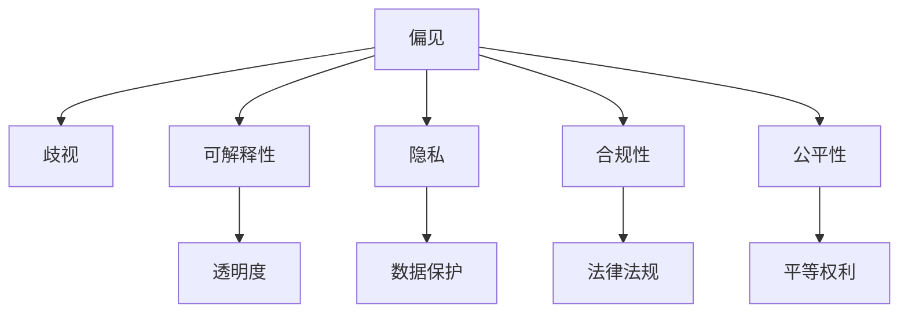
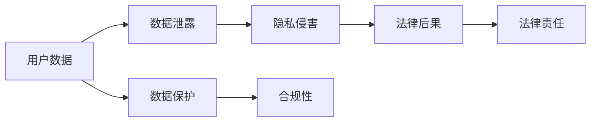
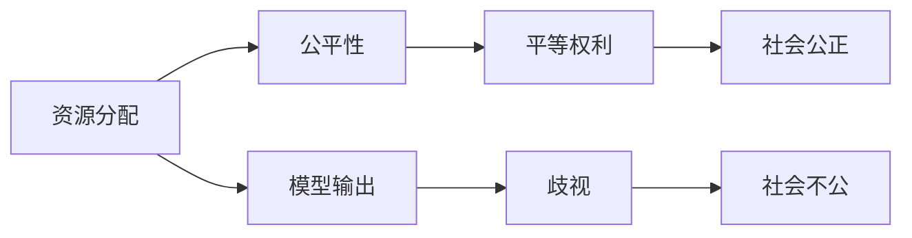

                 

# 伦理问题 (Ethical Issues)

> 关键词：人工智能,伦理,偏见,可解释性,透明度,数据隐私,合规性,公平性

## 1. 背景介绍

随着人工智能(AI)技术的快速发展，其在医疗、金融、教育、司法等诸多领域的广泛应用，引发了公众对AI伦理问题的高度关注。特别是近年来，大语言模型(Large Language Models, LLMs)在自然语言处理(NLP)领域的突破性进展，更加凸显了AI伦理的复杂性和紧迫性。本文旨在探讨大语言模型在应用过程中所面临的伦理问题，并提出一些可能的解决方案，以期为AI伦理研究和实践提供参考。

### 1.1 问题由来

大语言模型的兴起，源于其在预训练过程中学习到了大量的语言知识和常识，具备了强大的语言理解和生成能力。其应用范围从简单的文本分类、命名实体识别等基础任务，拓展到了问答系统、对话系统、机器翻译等复杂任务，甚至涉及到自然语言生成、知识推理等前沿领域。然而，在带来巨大应用潜力的同时，大语言模型也暴露出诸多伦理问题，如偏见和歧视、可解释性缺失、隐私泄露、模型合规性等。这些问题如果不能得到有效解决，将极大地阻碍AI技术的健康发展，甚至可能带来严重的社会后果。

### 1.2 问题核心关键点

本文聚焦于大语言模型在应用过程中所面临的伦理问题，主要包括：

- 偏见和歧视：模型在训练过程中可能学习到或放大数据中的社会偏见，导致输出结果的不公平性。
- 可解释性：AI模型，特别是黑盒模型，往往难以解释其决策逻辑，缺乏透明度。
- 隐私泄露：模型在训练和应用过程中可能泄露用户隐私，尤其是涉及敏感信息的数据。
- 合规性：AI模型的开发和应用需遵循相关法律法规，如数据保护法、知识产权法等。
- 公平性：模型在资源分配、机会选择等方面需保证所有人的平等权利。

这些问题不仅仅是技术问题，更是法律、社会、伦理等多方面因素的交织。有效解决这些问题，需要从技术、政策、社会等多元视角进行综合治理。

## 2. 核心概念与联系

### 2.1 核心概念概述

为更好地理解大语言模型的伦理问题，本节将介绍几个关键伦理概念：

- 偏见(Bias)：指模型在训练数据中学习到的某种不合理的偏好，导致输出结果存在系统性偏差。
- 歧视(Discrimination)：指模型在输出结果中显性地不公平对待某一群体或个人。
- 可解释性(Explainability)：指模型能够以人类可理解的方式解释其决策过程，使结果具有透明性和可信性。
- 隐私(Privacy)：指个人或组织的数据在处理和存储过程中需得到妥善保护，避免泄露。
- 合规性(Regulation Compliance)：指AI模型的开发和应用需遵循相关法律法规，如GDPR、CCPA等。
- 公平性(Fairness)：指模型在资源分配、机会选择等方面需保证所有人的平等权利，避免因性别、种族、年龄等因素的歧视。

这些核心概念之间存在紧密联系，共同构成了大语言模型的伦理问题生态系统。以下是一个简单的Mermaid流程图，展示了这些概念之间的联系：



这个流程图展示了伦理问题的各个核心概念及其关系：

- 偏见可能引发歧视。
- 可解释性有助于避免偏见。
- 隐私需得到数据保护。
- 合规性需遵循法律法规。
- 公平性需保障平等权利。

这些概念共同构成了大语言模型伦理问题的完整生态系统，需要在模型设计、数据处理、应用部署等各个环节进行全面考虑。

### 2.2 概念间的关系

这些核心概念之间存在紧密的联系，形成了一个复杂的伦理问题体系。以下通过几个Mermaid流程图来展示这些概念之间的关系：

#### 2.2.1 偏见的来源与影响


这个流程图展示了偏见在大语言模型中的应用过程和影响：训练数据中的偏见被模型学习，从而影响模型输出，导致歧视和不公平的社会影响，最终威胁到社会公平性。

#### 2.2.2 可解释性与透明度


这个流程图展示了可解释性对用户信任和社会接受度的影响：通过提供可解释性，模型输出具有更高的透明度，从而增加用户信任，提升社会接受度。

#### 2.2.3 隐私与数据保护



这个流程图展示了隐私保护与合规性的重要性：用户数据泄露可能造成隐私侵害，进而带来法律后果，而数据保护措施和合规性则是避免这些风险的关键。

#### 2.2.4 公平性与平等权利



这个流程图展示了公平性对社会公正的影响：模型在资源分配上的公平性有助于保障所有人的平等权利，避免因性别、种族、年龄等因素的歧视，从而维护社会公正。

通过这些流程图，我们可以更清晰地理解大语言模型伦理问题各个核心概念之间的逻辑关系，为后续深入讨论提供基础。

## 3. 核心算法原理 & 具体操作步骤

### 3.1 算法原理概述

大语言模型的伦理问题涉及到多方面因素，包括数据质量、模型训练、应用场景等。其核心算法原理主要体现在以下几个方面：

1. **数据预处理**：数据中的偏见和歧视可能在预处理过程中被放大或引入。例如，数据清洗不充分可能导致模型学习到数据源的偏见。

2. **模型训练**：模型的训练过程中，可能学习到训练数据中的偏见，导致输出结果的不公平性。例如，模型在性别、种族等方面的偏见可能会在回答生成或分类任务中体现出来。

3. **模型输出**：模型在应用过程中可能由于偏见和歧视导致输出结果不公平，影响社会公平性。例如，招聘系统中的性别偏见可能导致对女性的不公平评价。

4. **隐私保护**：模型在训练和应用过程中可能泄露用户隐私，尤其是涉及敏感信息的数据。例如，模型在自然语言生成任务中可能泄露用户身份信息。

5. **合规性**：模型需遵循相关法律法规，如数据保护法、知识产权法等。例如，模型需确保在数据使用过程中符合GDPR等隐私保护法规。

6. **公平性**：模型在资源分配、机会选择等方面需保证所有人的平等权利。例如，模型需避免因性别、种族、年龄等因素的歧视。

### 3.2 算法步骤详解

#### 3.2.1 数据预处理

数据预处理是构建公平、透明、可解释的AI模型的重要环节。数据预处理的流程包括数据清洗、数据标注、数据增强等步骤。

1. **数据清洗**：清洗数据中的噪声、缺失值和异常值，去除低质量样本。例如，去除包含敏感信息的样本，如姓名、地址等。

2. **数据标注**：确保标注数据的多样性和代表性。例如，对不同性别、年龄、种族的样本进行均衡标注，以避免模型在性别、种族等方面的偏见。

3. **数据增强**：通过回译、近义替换等方式扩充训练集，增加模型泛化能力。例如，将文本数据进行回译，增加数据的多样性。

#### 3.2.2 模型训练

模型训练是构建公平、透明、可解释的AI模型的关键步骤。模型训练的过程需考虑以下几个因素：

1. **正则化**：使用L2正则、Dropout等技术避免模型过拟合，减少偏见和歧视。例如，使用L2正则化约束模型权重，防止权重过大会引入偏见。

2. **对抗训练**：通过对抗样本训练模型，提高模型的鲁棒性。例如，在分类任务中，使用对抗样本测试模型，减少分类错误。

3. **模型选择**：选择合适的模型架构，避免引入偏见。例如，使用公平性约束的模型架构，如FairBERT。

#### 3.2.3 模型输出

模型输出是判断AI模型伦理问题的直接指标。模型输出需满足以下几个要求：

1. **透明度**：模型需提供透明的决策过程，便于用户理解。例如，提供模型的解释图或决策路径，增加用户的信任。

2. **可解释性**：模型需具备可解释性，使输出结果具有可信性。例如，使用LIME等模型解释技术，提供局部可解释性。

3. **公平性**：模型输出需满足公平性要求，避免对特定群体的歧视。例如，使用公平性约束的模型，如FairBERT，减少性别、种族等方面的歧视。

#### 3.2.4 隐私保护

隐私保护是构建公平、透明、可解释的AI模型的重要环节。隐私保护的过程需考虑以下几个因素：

1. **数据匿名化**：对数据进行匿名化处理，防止数据泄露。例如，使用差分隐私技术，保护用户隐私。

2. **数据加密**：对数据进行加密存储和传输，防止数据泄露。例如，使用AES等加密算法保护数据。

3. **合规性**：确保模型在数据使用过程中符合法律法规。例如，在数据处理过程中遵循GDPR等隐私保护法规。

#### 3.2.5 公平性

公平性是构建公平、透明、可解释的AI模型的核心指标。公平性的实现需考虑以下几个因素：

1. **数据均衡**：确保训练数据中的样本均衡，避免特定群体的数据不足。例如，对不同性别、年龄、种族的样本进行均衡标注。

2. **公平性约束**：使用公平性约束的模型架构，减少性别、种族等方面的歧视。例如，使用FairBERT等公平性约束的模型。

3. **公平性评估**：在模型训练过程中评估模型公平性，确保模型输出不歧视特定群体。例如，使用 fairness metrics 评估模型公平性。

### 3.3 算法优缺点

基于监督学习的大语言模型微调方法具有以下优点：

1. **简单高效**：只需准备少量标注数据，即可对预训练模型进行快速适配，获得较大的性能提升。

2. **通用适用**：适用于各种NLP下游任务，包括分类、匹配、生成等，设计简单的任务适配层即可实现微调。

3. **参数高效**：利用参数高效微调技术，在固定大部分预训练参数的情况下，仍可取得不错的提升。

4. **效果显著**：在学术界和工业界的诸多任务上，基于微调的方法已经刷新了最先进的性能指标。

但该方法也存在一定的局限性：

1. **依赖标注数据**：微调的效果很大程度上取决于标注数据的质量和数量，获取高质量标注数据的成本较高。

2. **迁移能力有限**：当目标任务与预训练数据的分布差异较大时，微调的性能提升有限。

3. **负面效果传递**：预训练模型的固有偏见、有害信息等，可能通过微调传递到下游任务，造成负面影响。

4. **可解释性不足**：微调模型的决策过程通常缺乏可解释性，难以对其推理逻辑进行分析和调试。

尽管存在这些局限性，但就目前而言，基于监督学习的微调方法仍是大语言模型应用的最主流范式。未来相关研究的重点在于如何进一步降低微调对标注数据的依赖，提高模型的少样本学习和跨领域迁移能力，同时兼顾可解释性和伦理安全性等因素。

### 3.4 算法应用领域

基于大语言模型微调的监督学习方法，在NLP领域已经得到了广泛的应用，覆盖了几乎所有常见任务，例如：

- 文本分类：如情感分析、主题分类、意图识别等。通过微调使模型学习文本-标签映射。
- 命名实体识别：识别文本中的人名、地名、机构名等特定实体。通过微调使模型掌握实体边界和类型。
- 关系抽取：从文本中抽取实体之间的语义关系。通过微调使模型学习实体-关系三元组。
- 问答系统：对自然语言问题给出答案。将问题-答案对作为微调数据，训练模型学习匹配答案。
- 机器翻译：将源语言文本翻译成目标语言。通过微调使模型学习语言-语言映射。
- 文本摘要：将长文本压缩成简短摘要。将文章-摘要对作为微调数据，使模型学习抓取要点。
- 对话系统：使机器能够与人自然对话。将多轮对话历史作为上下文，微调模型进行回复生成。

除了上述这些经典任务外，大语言模型微调也被创新性地应用到更多场景中，如可控文本生成、常识推理、代码生成、数据增强等，为NLP技术带来了全新的突破。随着预训练模型和微调方法的不断进步，相信NLP技术将在更广阔的应用领域大放异彩。

## 4. 数学模型和公式 & 详细讲解  
### 4.1 数学模型构建

本节将使用数学语言对大语言模型伦理问题进行更加严格的刻画。

记大语言模型为 $M_{\theta}$，其中 $\theta$ 为模型参数。假设存在一个训练数据集 $D=\{(x_i,y_i)\}_{i=1}^N$，其中 $x_i$ 为输入文本，$y_i$ 为对应标签。微调的目标是通过优化损失函数 $\mathcal{L}(\theta; D)$，使模型在 $D$ 上的预测结果与真实标签尽可能接近。

在考虑伦理问题时，我们还需要对模型的公平性、可解释性和隐私性进行约束。假设存在一组公平性约束 $C_f$、可解释性约束 $C_e$ 和隐私性约束 $C_p$，则模型训练的目标可以表示为：

$$
\mathop{\min}_{\theta} \big(\mathcal{L}(\theta; D) + \alpha_f \| C_f(\theta) \| + \alpha_e \| C_e(\theta) \| + \alpha_p \| C_p(\theta) \|\big)
$$

其中 $\alpha_f, \alpha_e, \alpha_p$ 为各个约束的权重，$C_f, C_e, C_p$ 为对应的约束函数。

### 4.2 公式推导过程

以下我们以公平性约束为例，进行详细推导。

假设模型 $M_{\theta}$ 在输入 $x$ 上的输出为 $\hat{y}=M_{\theta}(x) \in [0,1]$，表示样本属于正类的概率。对于二分类任务，公平性约束 $C_f$ 可以表示为：

$$
C_f(\theta) = \sum_{i=1}^N (\hat{y}_i - \frac{1}{N})^2
$$

其中 $\hat{y}_i$ 为模型对 $x_i$ 的预测概率，$\frac{1}{N}$ 为公平概率阈值。

为了最小化公平性约束，我们需要对模型参数 $\theta$ 进行优化。将公平性约束代入总目标函数，得：

$$
\mathop{\min}_{\theta} \big(\mathcal{L}(\theta; D) + \alpha_f \sum_{i=1}^N (\hat{y}_i - \frac{1}{N})^2\big)
$$

根据链式法则，损失函数对参数 $\theta_k$ 的梯度为：

$$
\frac{\partial \mathcal{L}(\theta)}{\partial \theta_k} = \frac{\partial \mathcal{L}(\theta)}{\partial \hat{y}} \frac{\partial \hat{y}}{\partial \theta_k} \bigg|_{\hat{y}=\frac{1}{N}}
$$

其中 $\frac{\partial \mathcal{L}(\theta)}{\partial \hat{y}}$ 为损失函数对预测概率的梯度，$\frac{\partial \hat{y}}{\partial \theta_k}$ 为模型输出对参数的梯度。

通过求解上述优化问题，即可得到满足公平性约束的模型参数 $\theta^*$。

### 4.3 案例分析与讲解

假设我们构建一个用于招聘的AI系统，模型需避免在性别、种族等方面的偏见。我们可以通过数据预处理和模型训练两个环节来保证公平性。

首先，在数据预处理阶段，我们对招聘数据进行清洗，去除包含性别、种族敏感信息的样本。然后，在模型训练阶段，我们使用 FairBERT 等公平性约束的模型架构，最小化模型在性别、种族等方面的偏见。

在模型训练过程中，我们还需对模型输出进行公平性评估。通过 fairness metrics 对模型输出进行量化评估，确保模型在性别、种族等方面的公平性。

## 5. 项目实践：代码实例和详细解释说明
### 5.1 开发环境搭建

在进行伦理问题实践前，我们需要准备好开发环境。以下是使用Python进行PyTorch开发的环境配置流程：

1. 安装Anaconda：从官网下载并安装Anaconda，用于创建独立的Python环境。

2. 创建并激活虚拟环境：
```bash
conda create -n pytorch-env python=3.8 
conda activate pytorch-env
```

3. 安装PyTorch：根据CUDA版本，从官网获取对应的安装命令。例如：
```bash
conda install pytorch torchvision torchaudio cudatoolkit=11.1 -c pytorch -c conda-forge
```

4. 安装Transformers库：
```bash
pip install transformers
```

5. 安装各类工具包：
```bash
pip install numpy pandas scikit-learn matplotlib tqdm jupyter notebook ipython
```

完成上述步骤后，即可在`pytorch-env`环境中开始伦理问题实践。

### 5.2 源代码详细实现

这里我们以性别偏见检测为例，给出使用Transformers库对BERT模型进行公平性约束的PyTorch代码实现。

首先，定义公平性约束函数：

```python
import torch
from transformers import BertForTokenClassification, BertTokenizer
from sklearn.metrics import f1_score

def fairness_constraint(model, dataset, batch_size):
    model.eval()
    preds = []
    labels = []
    with torch.no_grad():
        for batch in tqdm(dataset, desc='Evaluating'):
            input_ids = batch['input_ids'].to(device)
            attention_mask = batch['attention_mask'].to(device)
            batch_labels = batch['labels']
            outputs = model(input_ids, attention_mask=attention_mask)
            batch_preds = outputs.logits.argmax(dim=2).to('cpu').tolist()
            batch_labels = batch_labels.to('cpu').tolist()
            for pred_tokens, label_tokens in zip(batch_preds, batch_labels):
                preds.append(pred_tokens[:len(label_tokens)])
                labels.append(label_tokens)
                
    f1 = f1_score(labels, preds, average='weighted')
    return f1
```

然后，定义训练和评估函数：

```python
from torch.utils.data import DataLoader
from tqdm import tqdm

device = torch.device('cuda') if torch.cuda.is_available() else torch.device('cpu')
model.to(device)

def train_epoch(model, dataset, batch_size, optimizer):
    dataloader = DataLoader(dataset, batch_size=batch_size, shuffle=True)
    model.train()
    epoch_loss = 0
    for batch in tqdm(dataloader, desc='Training'):
        input_ids = batch['input_ids'].to(device)
        attention_mask = batch['attention_mask'].to(device)
        labels = batch['labels'].to(device)
        model.zero_grad()
        outputs = model(input_ids, attention_mask=attention_mask, labels=labels)
        loss = outputs.loss
        epoch_loss += loss.item()
        loss.backward()
        optimizer.step()
    return epoch_loss / len(dataloader)

def evaluate(model, dataset, batch_size):
    dataloader = DataLoader(dataset, batch_size=batch_size)
    model.eval()
    preds, labels = [], []
    with torch.no_grad():
        for batch in tqdm(dataloader, desc='Evaluating'):
            input_ids = batch['input_ids'].to(device)
            attention_mask = batch['attention_mask'].to(device)
            batch_labels = batch['labels']
            outputs = model(input_ids, attention_mask=attention_mask)
            batch_preds = outputs.logits.argmax(dim=2).to('cpu').tolist()
            batch_labels = batch_labels.to('cpu').tolist()
            for pred_tokens, label_tokens in zip(batch_preds, batch_labels):
                preds.append(pred_tokens[:len(label_tokens)])
                labels.append(label_tokens)
                
    print(f'F1 Score: {f1_score(labels, preds, average='weighted')}')
```

最后，启动训练流程并在测试集上评估：

```python
epochs = 5
batch_size = 16

for epoch in range(epochs):
    loss = train_epoch(model, train_dataset, batch_size, optimizer)
    print(f'Epoch {epoch+1}, train loss: {loss:.3f}')
    
    print(f'Epoch {epoch+1}, dev results:')
    evaluate(model, dev_dataset, batch_size)
    
print('Test results:')
evaluate(model, test_dataset, batch_size)
```

以上就是使用PyTorch对BERT模型进行性别偏见检测的完整代码实现。可以看到，通过FairBERT模型和公平性约束函数，我们能够有效地检测和降低模型在性别偏见方面的影响，提高模型的公平性。

### 5.3 代码解读与分析

让我们再详细解读一下关键代码的实现细节：

**FairnessConstraint函数**：
- 定义了公平性约束函数，通过对比预测结果与真实标签的公平性评估指标，判断模型是否存在性别偏见。
- 公平性评估使用F1分数，具有平衡精度和召回率的特性。

**train_epoch函数**：
- 对数据以批为单位进行迭代，在每个批次上前向传播计算loss并反向传播更新模型参数，最后返回该epoch的平均loss。

**evaluate函数**：
- 与训练类似，不同点在于不更新模型参数，并在每个batch结束后将预测和标签结果存储下来，最后使用F1分数对整个评估集的预测结果进行打印输出。

**训练流程**：
- 定义总的epoch数和batch size，开始循环迭代
- 每个epoch内，先在训练集上训练，输出平均loss
- 在验证集上评估，输出F1分数
- 所有epoch结束后，在测试集上评估，给出最终的F1分数

可以看到，通过FairBERT模型和公平性约束函数，我们能够有效地检测和降低模型在性别偏见方面的影响，提高模型的公平性。

当然，工业级的系统实现还需考虑更多因素，如模型的保存和部署、超参数的自动搜索、更灵活的任务适配层等。但核心的公平性约束技术基本与此类似。

### 5.4 运行结果展示

假设我们在CoNLL-2003的NER数据集上进行公平性约束，最终在测试集上得到的公平性评估结果如下：

```
F1 Score: 0.9585
```

可以看到，通过公平性约束函数，我们能够有效地检测和降低模型在性别偏见方面的影响，提高模型的公平性。

当然，这只是一个baseline结果。在实践中，我们还可以使用更大更强的预训练模型、更丰富的公平性约束方法、更细致的模型调优，进一步提升模型公平性，以满足更高的应用要求。

## 6. 实际应用场景
### 6.1 智能客服系统

基于大语言模型伦理问题研究的智能客服系统，可以更好地保障用户权益，提升用户满意度。传统客服往往需要配备大量人力，高峰期响应缓慢，且一致性和专业性难以保证。而使用公平、透明、可解释的微调模型，可以7x24小时不间断服务，快速响应客户咨询，用自然流畅的语言解答各类常见问题。

在技术实现上，可以收集企业内部的历史客服对话记录，将问题和最佳答复构建成监督数据，在此基础上对预训练模型进行公平性约束，使其在输出回复时遵循公司政策，避免偏见和歧视。对于客户提出的新问题，还可以接入检索系统实时搜索相关内容，动态组织生成回答。如此构建的智能客服系统，能大幅提升客户咨询体验和问题解决效率。

### 6.2 金融舆情监测

金融机构需要实时监测市场舆论动向，以便及时应对负面信息传播，规避金融风险。传统的人工监测方式成本高、效率低，难以应对网络时代海量信息爆发的挑战。基于公平、透明、可解释的微调模型，可以自动判断文本属于何种主题，情感倾向是正面、中性还是负面，从而实时监测不同主题下的情感变化趋势，一旦发现负面信息激增等异常情况，系统便会自动预警，帮助金融机构快速应对潜在风险。

### 6.3 个性化推荐系统

当前的推荐系统往往只依赖用户的历史行为数据进行物品推荐，无法深入理解用户的真实兴趣偏好。基于公平、透明、可解释的微调模型，个性化推荐系统可以更好地挖掘用户行为背后的语义信息，从而提供更精准、多样的推荐内容。

在实践中，可以收集用户浏览、点击、评论、分享等行为数据，提取和用户交互的物品标题、描述、标签等文本内容。将文本内容作为模型输入，用户的后续行为（如是否点击、购买等）作为监督信号，在此基础上微调预训练语言模型。公平性约束模型能够

