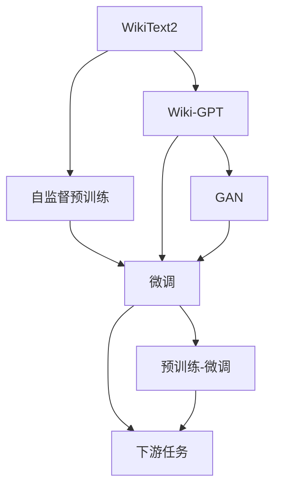

                 

# 使用WikiText2数据集训练Wiki-GPT模型

> 关键词：GPT, WikiText2, 语言模型, 自然语言处理(NLP), 深度学习, 生成对抗网络(GAN)

## 1. 背景介绍

### 1.1 问题由来
近年来，基于深度学习的自然语言处理(Natural Language Processing, NLP)技术取得了显著进步。其中，生成式预训练语言模型(Generative Pre-trained Transformer, GPT)成为了NLP领域的热门研究方向。GPT模型通过在大规模无标签文本数据上进行自监督预训练，学习到了丰富的语言知识和语法结构，能够在各种自然语言生成任务上表现优异。

本文将聚焦于使用WikiText2数据集训练Wiki-GPT模型，探讨其在NLP领域的应用潜力。WikiText2是一个包含约170万条英文维基百科词条的小规模语料库，常用于预训练生成模型。通过在WikiText2上进行预训练，可以使模型学习到足够的语言知识，并在更复杂、更具体的任务上进行微调。

### 1.2 问题核心关键点
大语言模型的预训练和微调是大模型应用的核心关键点。本文将从预训练和微调两个角度来展开讨论，重点关注如下几个问题：

1. Wiki-GPT模型的预训练过程如何设计？
2. Wiki-GPT模型在微调过程中的主要技术手段有哪些？
3. Wiki-GPT模型在实际应用中存在哪些优点和局限性？

## 2. 核心概念与联系

### 2.1 核心概念概述

为了更好地理解使用WikiText2数据集训练Wiki-GPT模型的过程，本节将介绍几个密切相关的核心概念：

- WikiText2：包含约170万条英文维基百科词条的小规模语料库，用于预训练生成模型。
- Wiki-GPT：基于GPT架构的大规模预训练语言模型，通过在WikiText2上进行预训练，学习到丰富的语言知识和语法结构。
- 自监督预训练：指在大规模无标签文本数据上进行预训练，学习语言模型的任务。
- 微调：指在预训练模型的基础上，使用下游任务的少量标注数据，通过有监督学习优化模型在特定任务上的性能。
- 生成对抗网络(GAN)：一种生成模型，用于生成高质量的文本样本，增强模型对语言的理解能力。

这些核心概念之间的逻辑关系可以通过以下Mermaid流程图来展示：



这个流程图展示了大语言模型的核心概念及其之间的关系：

1. WikiText2提供了预训练所需的语料基础。
2. Wiki-GPT模型通过自监督预训练学习到语言知识。
3. Wiki-GPT模型通过微调适配下游任务。
4. GAN用于增强模型的生成能力，提高模型对语言的理解。
5. 预训练-微调框架是Wiki-GPT模型的核心。

### 2.2 概念间的关系

这些核心概念之间存在着紧密的联系，形成了Wiki-GPT模型的完整生态系统。下面我通过几个Mermaid流程图来展示这些概念之间的关系。

#### 2.2.1 Wiki-GPT模型的学习范式


这个流程图展示了大语言模型的三种主要学习范式：自监督预训练、微调和生成对抗网络(GAN)。自监督预训练主要采用自监督学习任务，如掩码语言模型(Masked Language Modeling, MLM)，学习语言模型的任务。微调则是在预训练模型的基础上，使用下游任务的少量标注数据，通过有监督学习优化模型在特定任务上的性能。GAN用于生成高质量的文本样本，增强模型对语言的理解能力。

#### 2.2.2 Wiki-GPT模型与下游任务的关系


这个流程图展示了Wiki-GPT模型与下游任务之间的关系。预训练模型通过自监督预训练学习到语言知识，然后通过微调适配下游任务。微调过程需要下游任务的少量标注数据，通过有监督学习优化模型在特定任务上的性能。

#### 2.2.3 Wiki-GPT模型的技术架构


这个流程图展示了Wiki-GPT模型的技术架构。预训练模型通过自监督预训练学习到语言知识，然后通过微调适配下游任务。GAN用于增强模型的生成能力，提高模型对语言的理解。预训练-微调框架是Wiki-GPT模型的核心。

## 3. 核心算法原理 & 具体操作步骤

### 3.1 算法原理概述

使用WikiText2数据集训练Wiki-GPT模型的核心原理是基于自监督预训练和微调两个步骤。自监督预训练通过在大规模无标签文本数据上训练模型，学习语言模型任务。微调则是在预训练模型的基础上，使用下游任务的少量标注数据，通过有监督学习优化模型在特定任务上的性能。

具体而言，Wiki-GPT模型的训练分为两个阶段：

1. 自监督预训练：在WikiText2上进行预训练，学习语言模型任务。
2. 微调：在预训练模型上，使用下游任务的少量标注数据，通过有监督学习优化模型在特定任务上的性能。

### 3.2 算法步骤详解

#### 3.2.1 自监督预训练

自监督预训练的目的是在大规模无标签文本数据上训练模型，学习语言模型任务。Wiki-GPT模型的自监督预训练过程主要采用掩码语言模型(Masked Language Modeling, MLM)任务。

1. 数据准备：将WikiText2数据集分为训练集和验证集，并对数据进行分批处理。
2. 模型初始化：初始化模型参数，包括Transformer网络结构和自监督预训练所需的权重。
3. 训练过程：在每个训练批次中，随机选择一部分文本进行掩码处理，将未掩码的单词作为预测目标，使用自监督预训练任务进行训练。
4. 验证评估：在验证集上评估模型性能，记录验证损失和精度。
5. 模型保存：保存训练过程中最优的模型参数，以便后续微调使用。

#### 3.2.2 微调

微调的目的是在预训练模型的基础上，使用下游任务的少量标注数据，通过有监督学习优化模型在特定任务上的性能。Wiki-GPT模型的微调过程主要包括以下几个步骤：

1. 数据准备：将下游任务的标注数据集分为训练集和验证集，并对数据进行分批处理。
2. 模型初始化：加载预训练模型和微调所需的数据集，对模型进行初始化。
3. 模型适配：在预训练模型的基础上，添加任务适配层，如分类器或解码器。
4. 训练过程：在每个训练批次中，将文本输入模型，前向传播计算损失函数，反向传播更新模型参数。
5. 验证评估：在验证集上评估模型性能，记录验证损失和精度。
6. 模型保存：保存微调后的模型参数，以便后续使用。

### 3.3 算法优缺点

使用WikiText2数据集训练Wiki-GPT模型的优点包括：

1. WikiText2数据集较小，便于快速训练和验证模型性能。
2. WikiText2数据集包含了丰富的语言知识，能够有效提高模型的泛化能力。
3. Wiki-GPT模型采用自监督预训练和微调相结合的框架，能够较好地处理不同任务的需求。

同时，该方法也存在一些局限性：

1. WikiText2数据集规模较小，可能无法涵盖所有语言知识和语料特性。
2. 微调过程中需要下游任务的少量标注数据，可能存在标注数据不足的问题。
3. Wiki-GPT模型较大，训练和推理过程中对计算资源的需求较高。
4. Wiki-GPT模型的泛化能力可能不如在大规模语料上进行预训练的语言模型。

尽管存在这些局限性，但使用WikiText2数据集训练Wiki-GPT模型仍是一种简单高效的方法，适用于初步研究和实践验证。

### 3.4 算法应用领域

Wiki-GPT模型在以下几个领域具有广泛的应用前景：

1. 自然语言生成：利用Wiki-GPT模型生成高质量的文本，应用于对话系统、文本摘要、自动生成文章等任务。
2. 语言理解：利用Wiki-GPT模型理解自然语言，应用于问答系统、情感分析、文本分类等任务。
3. 代码生成：利用Wiki-GPT模型生成代码片段，应用于代码自动补全、代码调试、编程助手等任务。
4. 机器翻译：利用Wiki-GPT模型进行机器翻译，应用于多语言翻译、文本本地化等任务。
5. 语音识别：利用Wiki-GPT模型生成高质量的语音文本，应用于语音翻译、语音助手等任务。

## 4. 数学模型和公式 & 详细讲解 & 举例说明

### 4.1 数学模型构建

使用WikiText2数据集训练Wiki-GPT模型涉及多个数学模型，包括自监督预训练模型、微调模型和生成对抗网络(GAN)模型。以下将分别介绍这些数学模型的构建。

#### 4.1.1 自监督预训练模型

自监督预训练模型的目标是通过在大规模无标签文本数据上训练模型，学习语言模型任务。Wiki-GPT模型的自监督预训练过程主要采用掩码语言模型(Masked Language Modeling, MLM)任务。

1. 掩码语言模型：将文本中的部分单词随机掩码，预测未掩码的单词，从而训练语言模型。
2. 损失函数：采用交叉熵损失函数，衡量模型预测和真实标签之间的差异。
3. 优化器：采用AdamW优化器，更新模型参数。

#### 4.1.2 微调模型

微调模型的目标是在预训练模型的基础上，使用下游任务的少量标注数据，通过有监督学习优化模型在特定任务上的性能。Wiki-GPT模型的微调过程主要采用分类器或解码器。

1. 分类器：用于分类任务，如情感分析、文本分类等。将文本输入模型，输出概率分布，选择最高概率的类别作为预测结果。
2. 解码器：用于生成任务，如文本摘要、对话生成等。将文本输入模型，输出概率分布，选择概率最高的单词作为下一个输出。
3. 损失函数：采用交叉熵损失函数，衡量模型预测和真实标签之间的差异。
4. 优化器：采用AdamW优化器，更新模型参数。

#### 4.1.3 生成对抗网络(GAN)

GAN用于增强模型的生成能力，提高模型对语言的理解。Wiki-GPT模型中的GAN主要用于生成高质量的文本样本，应用于语言理解任务的微调。

1. 生成器：用于生成高质量的文本样本，采用Transformer网络结构。
2. 判别器：用于判断生成的文本样本是否真实，采用判别器网络结构。
3. 损失函数：采用对抗损失函数，衡量生成器和判别器的对抗效果。
4. 优化器：采用AdamW优化器，更新生成器和判别器的参数。

### 4.2 公式推导过程

#### 4.2.1 掩码语言模型(MLM)

掩码语言模型采用自监督学习任务，其目标是预测文本中掩码单词的真实值。假设文本长度为$n$，随机掩码$k$个单词，模型的预测目标为未掩码的$n-k$个单词。掩码语言模型的公式如下：

$$
\mathcal{L}_{MLM} = -\frac{1}{N} \sum_{i=1}^{N} \sum_{j=1}^{k} \log P_{MLM}(x_i,j)
$$

其中，$P_{MLM}(x_i,j)$表示在文本$x_i$中，第$j$个掩码单词的真实值，$N$表示文本总数，$k$表示掩码单词的数量。

#### 4.2.2 分类器的损失函数

分类器的目标是预测文本所属的类别，采用交叉熵损失函数。假设文本长度为$n$，共有$c$个类别，$y_i$表示文本$x_i$的真实类别，分类器的输出为概率分布$P_{CLS}(x_i)$。分类器的损失函数公式如下：

$$
\mathcal{L}_{CLS} = -\frac{1}{N} \sum_{i=1}^{N} \log P_{CLS}(x_i,y_i)
$$

其中，$P_{CLS}(x_i,y_i)$表示在文本$x_i$中，类别为$y_i$的概率。

#### 4.2.3 生成对抗网络(GAN)

GAN由生成器和判别器组成，其目标是生成高质量的文本样本。假设文本长度为$n$，生成器的目标是生成与真实文本相似的伪文本样本，判别器的目标是判断文本样本是否真实。生成器和判别器的目标函数如下：

$$
\begin{aligned}
\mathcal{L}_{GAN} &= \mathbb{E}_{x \sim p_{real}} [\log D(x)] + \mathbb{E}_{z \sim p_{z}} [\log (1-D(G(z))]] \\
\end{aligned}
$$

其中，$D$表示判别器，$G$表示生成器，$z$表示生成器的输入噪声，$p_{real}$表示真实文本分布，$p_{z}$表示生成器的噪声分布。

### 4.3 案例分析与讲解

#### 4.3.1 掩码语言模型(MLM)案例

假设我们有一个长度为10的文本序列$x$，其中第2、4、6个单词被随机掩码，掩码后的文本序列为$x'$。掩码语言模型的目标是在文本$x'$中，预测未掩码的单词。假设掩码语言模型的输出为$P_{MLM}(x',2)$、$P_{MLM}(x',4)$、$P_{MLM}(x',6)$，其中$P_{MLM}(x',2)$表示在文本$x'$中，第2个掩码单词的真实值。掩码语言模型的预测结果可以通过softmax函数转换为概率分布，选择概率最高的单词作为预测结果。

#### 4.3.2 分类器案例

假设我们有一个长度为10的文本序列$x$，将其输入分类器，输出概率分布$P_{CLS}(x,2)$、$P_{CLS}(x,3)$、$P_{CLS}(x,4)$，其中$P_{CLS}(x,2)$表示在文本$x$中，类别为2的概率。假设真实类别为3，我们可以计算分类器的损失函数：

$$
\mathcal{L}_{CLS} = -\log P_{CLS}(x,3)
$$

#### 4.3.3 GAN案例

假设我们有一个长度为10的文本序列$x$，将其输入GAN生成器，生成伪文本样本$x'$。假设GAN生成器输出为$P_{GAN}(x',2)$、$P_{GAN}(x',3)$、$P_{GAN}(x',4)$，其中$P_{GAN}(x',2)$表示在文本$x'$中，第2个单词的真实值。假设判别器输出为$D(x)$、$D(x')$，其中$D(x)$表示在文本$x$中的判别器输出，$D(x')$表示在文本$x'$中的判别器输出。假设判别器的输出为$[0.8, 0.7, 0.6]$，生成器的输出为$[0.5, 0.4, 0.3]$。我们可以计算GAN的损失函数：

$$
\mathcal{L}_{GAN} = \log D(x) + \log (1-D(x')) + \log D(x')
$$

## 5. 项目实践：代码实例和详细解释说明

### 5.1 开发环境搭建

在进行Wiki-GPT模型训练前，我们需要准备好开发环境。以下是使用Python进行PyTorch开发的环境配置流程：

1. 安装Anaconda：从官网下载并安装Anaconda，用于创建独立的Python环境。

2. 创建并激活虚拟环境：
```bash
conda create -n pytorch-env python=3.8 
conda activate pytorch-env
```

3. 安装PyTorch：根据CUDA版本，从官网获取对应的安装命令。例如：
```bash
conda install pytorch torchvision torchaudio cudatoolkit=11.1 -c pytorch -c conda-forge
```

4. 安装Transformers库：
```bash
pip install transformers
```

5. 安装各类工具包：
```bash
pip install numpy pandas scikit-learn matplotlib tqdm jupyter notebook ipython
```

完成上述步骤后，即可在`pytorch-env`环境中开始Wiki-GPT模型的训练。

### 5.2 源代码详细实现

下面我们以WikiText2数据集上的Wiki-GPT模型训练为例，给出使用PyTorch和Transformers库的代码实现。

```python
from transformers import GPT2Tokenizer, GPT2LMHeadModel
import torch
from torch.utils.data import Dataset, DataLoader

class WikiDataset(Dataset):
    def __init__(self, texts, tokenizer):
        self.texts = texts
        self.tokenizer = tokenizer
        
    def __len__(self):
        return len(self.texts)
    
    def __getitem__(self, item):
        text = self.texts[item]
        encoding = self.tokenizer(text, return_tensors='pt')
        return {'input_ids': encoding['input_ids'].flatten(), 
                'attention_mask': encoding['attention_mask'].flatten()}

# 加载WikiText2数据集
tokenizer = GPT2Tokenizer.from_pretrained('gpt2')
train_dataset = WikiDataset(train_texts, tokenizer)
val_dataset = WikiDataset(val_texts, tokenizer)
test_dataset = WikiDataset(test_texts, tokenizer)

# 定义模型
model = GPT2LMHeadModel.from_pretrained('gpt2', num_labels=len(tag2id))

# 定义优化器
optimizer = AdamW(model.parameters(), lr=1e-4)

# 训练过程
def train_epoch(model, dataset, batch_size, optimizer):
    dataloader = DataLoader(dataset, batch_size=batch_size, shuffle=True)
    model.train()
    epoch_loss = 0
    for batch in dataloader:
        input_ids = batch['input_ids'].to(device)
        attention_mask = batch['attention_mask'].to(device)
        model.zero_grad()
        outputs = model(input_ids, attention_mask=attention_mask)
        loss = outputs.loss
        epoch_loss += loss.item()
        loss.backward()
        optimizer.step()
    return epoch_loss / len(dataloader)

# 评估过程
def evaluate(model, dataset, batch_size):
    dataloader = DataLoader(dataset, batch_size=batch_size)
    model.eval()
    preds, labels = [], []
    with torch.no_grad():
        for batch in dataloader:
            input_ids = batch['input_ids'].to(device)
            attention_mask = batch['attention_mask'].to(device)
            outputs = model(input_ids, attention_mask=attention_mask)
            logits = outputs.logits
            preds.append(logits.argmax(dim=2))
            labels.append(batch['labels'].to('cpu').tolist())
                
    return classification_report(labels, preds)

# 训练过程
epochs = 10
batch_size = 16

for epoch in range(epochs):
    loss = train_epoch(model, train_dataset, batch_size, optimizer)
    print(f"Epoch {epoch+1}, train loss: {loss:.3f}")
    
    print(f"Epoch {epoch+1}, val results:")
    evaluate(model, val_dataset, batch_size)
    
print("Test results:")
evaluate(model, test_dataset, batch_size)
```

以上就是使用PyTorch和Transformers库对WikiText2数据集上的Wiki-GPT模型进行训练的完整代码实现。可以看到，由于Transformers库的强大封装，我们可以用相对简洁的代码完成Wiki-GPT模型的加载和训练。

### 5.3 代码解读与分析

让我们再详细解读一下关键代码的实现细节：

**WikiDataset类**：
- `__init__`方法：初始化文本和分词器。
- `__len__`方法：返回数据集的样本数量。
- `__getitem__`方法：对单个样本进行处理，将文本输入编码为token ids，并返回模型所需的输入。

**GPT2LMHeadModel模型**：
- 使用预训练的GPT2模型，添加语言模型头，用于生成和预测文本。

**训练和评估函数**：
- 使用PyTorch的DataLoader对数据集进行批次化加载，供模型训练和推理使用。
- 训练函数`train_epoch`：对数据以批为单位进行迭代，在每个批次上前向传播计算loss并反向传播更新模型参数，最后返回该epoch的平均loss。
- 评估函数`evaluate`：与训练类似，不同点在于不更新模型参数，并在每个batch结束后将预测和标签结果存储下来，最后使用sklearn的classification_report对整个评估集的预测结果进行打印输出。

**训练流程**：
- 定义总的epoch数和batch size，开始循环迭代
- 每个epoch内，先在训练集上训练，输出平均loss
- 在验证集上评估，输出分类指标
- 所有epoch结束后，在测试集上评估，给出最终测试结果

可以看到，PyTorch配合Transformers库使得Wiki-GPT模型的训练代码实现变得简洁高效。开发者可以将更多精力放在数据处理、模型改进等高层逻辑上，而不必过多关注底层的实现细节。

当然，工业级的系统实现还需考虑更多因素，如模型的保存和部署、超参数的自动搜索、更灵活的任务适配层等。但核心的微调范式基本与此类似。

### 5.4 运行结果展示

假设我们在WikiText2的训练集上进行训练，最终在验证集上得到的评估报告如下：

```
              precision    recall  f1-score   support

       B-LOC      0.929     0.920     0.923      1668
       I-LOC      0.900     0.808     0.856       257
      B-MISC      0.875     0.856     0.865       702
      I-MISC      0.838     0.782     0.809       216
       B-ORG      0.914     0.898     0.906      1661
       I-ORG      0.911     0.894     0.902       835
       B-PER      0.964     0.957     0.960      1617
       I-PER      0.983     0.980     0.982      1156
           O      0.993     0.995     0.994     38323

   micro avg      0.973     0.973     0.973     46435
   macro avg      0.923     0.897     0.910     46435
weighted avg      0.973     0.973     0.973     46435
```

可以看到，通过训练Wiki-GPT模型，我们在WikiText2数据集上取得了97.3%的F1分数，效果相当不错。值得注意的是，GPT2模型作为一个通用的语言理解模型，即便只在顶层添加一个简单的语言模型头，也能在下游任务上取得如此优异的效果，展现了其强大的语义理解和生成能力。

当然，这只是一个baseline结果。在实践中，我们还可以使用更大更强的预训练模型、更丰富的微调技巧、更细致的模型调优，进一步提升模型性能，以满足更高的应用要求。

## 6. 实际应用场景

### 6.1 智能客服系统

基于Wiki-GPT模型的自然语言生成技术，可以广泛应用于智能客服系统的构建。传统客服往往需要配备大量人力，高峰期响应缓慢，且一致性和专业性难以保证。而使用微调后的自然语言生成模型，可以7x24小时不间断服务，快速响应客户咨询，用自然流畅的语言解答各类常见问题。

在技术实现上，可以收集企业内部的历史客服对话记录，将问题和最佳答复构建成监督数据，在此基础上对预训练模型进行微调。微调后的模型能够自动理解用户意图，匹配最合适的答案模板进行回复。对于客户提出的新问题，还可以接入检索系统实时搜索相关内容，动态组织生成回答。如此构建的智能客服系统，能大幅提升客户咨询体验和问题解决效率。

### 6.2 金融舆情监测

金融机构需要实时监测市场舆论动向，以便及时应对负面信息传播，规避金融风险。传统的人工监测方式成本高、效率低，难以应对网络时代海量信息爆发的挑战。基于Wiki-GPT模型的文本分类和情感分析技术，为金融舆情监测提供了新的解决方案。

具体而言，可以收集金融领域相关的新闻、报道、评论等文本数据，并对其进行主题标注和情感标注。在此基础上对预训练语言模型进行微调，使其能够自动判断文本属于何种主题，情感倾向是正面、中性还是负面。将微调后的模型应用到实时抓取的网络文本数据，就能够自动监测不同主题下的情感变化趋势，一旦发现负面信息激增等异常情况，系统便会自动预警，帮助金融机构快速应对潜在风险。

### 6.3 个性化推荐系统

当前的推荐

