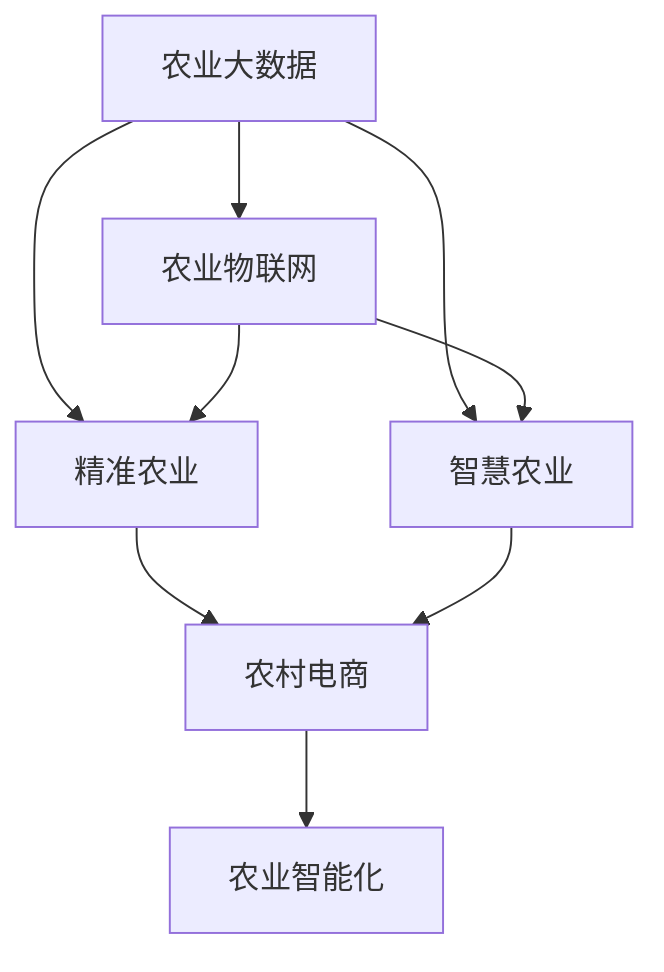
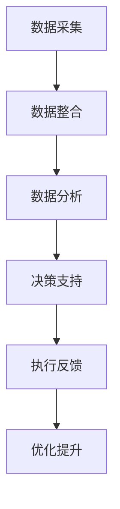
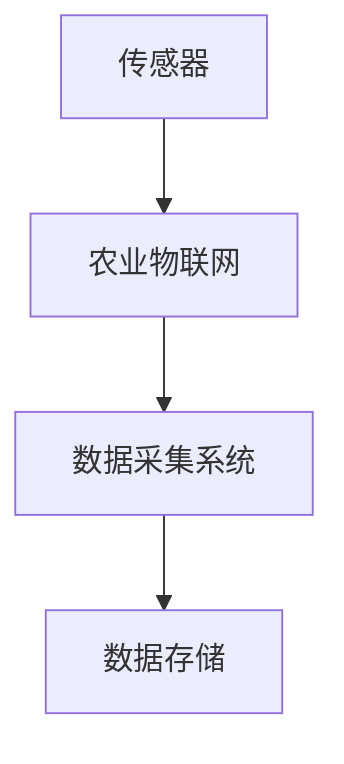
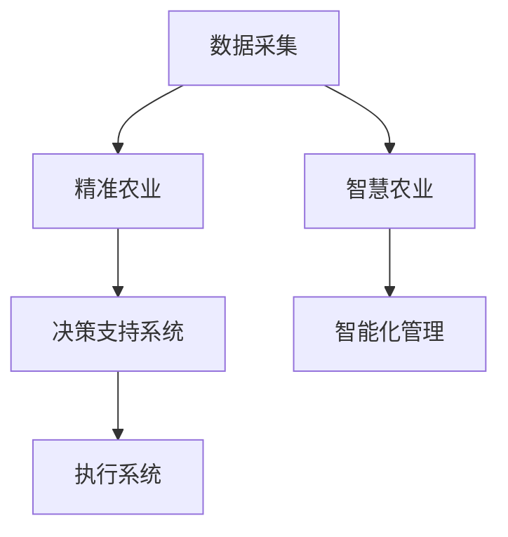
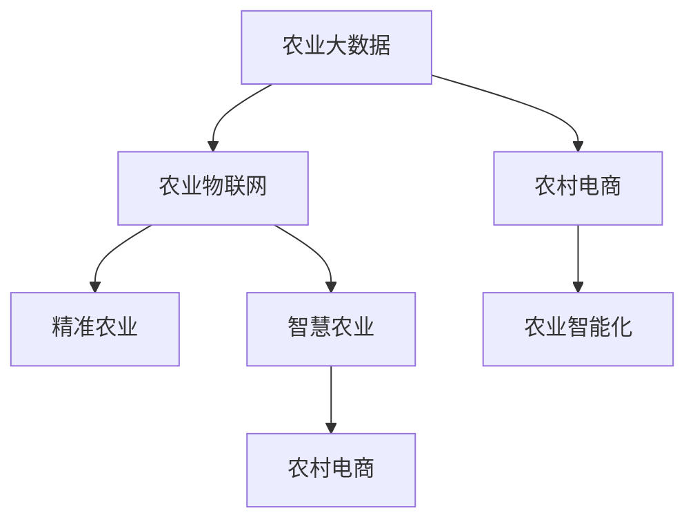

                 

# 信息差：大数据在农业领域的应用

## 1. 背景介绍

### 1.1 问题由来
在农业领域，信息不对称和信息差一直是一个普遍存在的问题。传统的农业信息获取和传播方式主要依赖于传统的线下渠道，如广播、电视、报纸、乡村会议等，这些渠道信息传递速度慢、范围窄、受众有限，难以满足农民对即时、全面、准确信息的需求。随着互联网和移动设备的普及，大数据技术开始被引入到农业领域，通过收集、分析和应用大量数据，帮助农民及时获取所需信息，减少信息差，提升农业生产效率和收益。

### 1.2 问题核心关键点
农业大数据的核心在于如何利用互联网和大数据技术，收集和分析与农业生产相关的数据，如天气、土壤、作物生长数据、农资市场价格、农产品质量和病虫害等，以帮助农民做出更加科学合理的决策。具体来说，核心关键点包括：

1. **数据收集**：如何高效地从各个环节收集农业生产相关的数据。
2. **数据整合**：如何整合来自不同来源的数据，形成统一的信息体系。
3. **数据分析**：如何利用大数据技术，对整合后的数据进行深入分析和挖掘，提炼有价值的信息。
4. **信息应用**：如何将分析结果转化为可操作的农业指导建议。

### 1.3 问题研究意义
农业大数据的研究和应用具有重要意义：

1. **提高农业生产效率**：通过精准分析，减少浪费，提升资源利用率，提高农业产出。
2. **降低农业风险**：及时获取天气、病虫害等预警信息，避免损失。
3. **增加农民收入**：精准的农资价格和市场信息，帮助农民做出更加理性的购买决策。
4. **保障粮食安全**：通过大数据分析，优化种植结构和农作物选择，保障食品安全和稳定供应。
5. **促进农村经济发展**：推动农业信息化建设，加速农村城镇化进程。

## 2. 核心概念与联系

### 2.1 核心概念概述

为更好地理解大数据在农业领域的应用，本节将介绍几个密切相关的核心概念：

- **农业大数据**：农业生产过程中产生的大量数据，包括气象数据、土壤数据、作物生长数据、农资市场数据、农产品质量数据等。
- **农业物联网**：通过互联网和传感器技术，实现对农业生产环节的实时监控和数据采集。
- **精准农业**：基于大数据和物联网技术，对农业生产过程进行精准化管理，提升生产效率和资源利用率。
- **智慧农业**：通过人工智能和大数据分析，实现农业生产的自动化和智能化，提升农业生产的科学性和可控性。
- **农村电商**：利用互联网和电子商务技术，打通农村与城市市场，提升农产品的销售渠道和市场竞争力。
- **农业智能化**：将大数据、物联网、人工智能等技术整合应用到农业生产管理中，提升农业生产的智能化水平。

这些核心概念之间的逻辑关系可以通过以下Mermaid流程图来展示：



这个流程图展示了大数据在农业领域的几个主要应用方向：

1. **农业物联网**：数据收集的基础设施。
2. **精准农业**：基于数据的生产管理。
3. **智慧农业**：进一步智能化提升。
4. **农村电商**：销售渠道的数字化改造。
5. **农业智能化**：综合应用和创新。

### 2.2 概念间的关系

这些核心概念之间存在着紧密的联系，形成了农业大数据的完整生态系统。下面我们通过几个Mermaid流程图来展示这些概念之间的关系。

#### 2.2.1 大数据在农业应用流程



这个流程图展示了农业大数据的完整应用流程：

1. **数据采集**：通过农业物联网收集实时数据。
2. **数据整合**：将来自不同来源的数据整合在一起，形成一个统一的信息体系。
3. **数据分析**：利用大数据技术和算法对整合后的数据进行深入分析和挖掘，提炼有价值的信息。
4. **决策支持**：将分析结果转化为农业生产决策建议。
5. **执行反馈**：根据执行结果进行反馈，调整和优化农业生产过程。

#### 2.2.2 农业物联网与数据采集



这个流程图展示了农业物联网与数据采集的关系：

1. **传感器**：采集农田环境、作物生长等数据。
2. **农业物联网**：将传感器连接互联网，形成数据采集系统。
3. **数据存储**：将采集到的数据存储起来，供后续分析和应用使用。

#### 2.2.3 精准农业与智慧农业



这个流程图展示了精准农业与智慧农业的关系：

1. **数据采集**：通过农业物联网收集实时数据。
2. **精准农业**：基于数据的生产管理，提高资源利用率。
3. **智慧农业**：通过人工智能和大数据分析，进一步提升生产管理的智能化水平。
4. **决策支持系统**：根据数据进行生产决策。
5. **执行系统**：根据决策执行农业生产操作。
6. **智能化管理**：利用智能设备进行自动化操作。

### 2.3 核心概念的整体架构

最后，我们用一个综合的流程图来展示这些核心概念在大数据农业中的应用架构：



这个综合流程图展示了大数据在农业领域的完整架构：

1. **农业物联网**：数据收集的基础设施。
2. **精准农业**：基于数据的生产管理。
3. **智慧农业**：进一步智能化提升。
4. **农村电商**：销售渠道的数字化改造。
5. **农业智能化**：综合应用和创新。

## 3. 核心算法原理 & 具体操作步骤
### 3.1 算法原理概述

农业大数据的应用涉及多个环节，包括数据采集、数据整合、数据分析和决策支持等。不同环节的算法原理各不相同，但核心都是基于数据驱动的方法，利用大数据技术和算法对农业生产过程进行优化和提升。

### 3.2 算法步骤详解

农业大数据的应用主要包括以下几个关键步骤：

**Step 1: 数据采集与预处理**
- 选择合适的传感器和设备，进行农田环境、作物生长、土壤质量、农资市场等数据的采集。
- 对采集到的数据进行清洗、去噪和标准化处理，确保数据的准确性和完整性。

**Step 2: 数据整合与存储**
- 将来自不同来源的数据整合在一起，形成一个统一的信息体系。
- 将整合后的数据存储在云端数据库中，方便后续的分析和应用。

**Step 3: 数据分析与建模**
- 利用大数据技术和算法对存储的数据进行深入分析和挖掘，提炼有价值的信息。
- 构建数学模型和机器学习模型，对农业生产过程进行预测和优化。

**Step 4: 决策支持与执行**
- 根据数据分析结果，提供精准的生产建议和决策支持。
- 将决策结果转化为可操作的指令，指导农业生产过程。
- 根据执行结果进行反馈和优化，不断提升农业生产效率。

**Step 5: 评估与优化**
- 对农业生产过程进行评估，量化其效果和收益。
- 根据评估结果进行模型优化和参数调整，进一步提升农业生产效率。

### 3.3 算法优缺点

农业大数据的应用具有以下优点：

1. **提高农业生产效率**：通过精准分析和数据驱动的决策，减少浪费，提高资源利用率，提升农业产出。
2. **降低农业风险**：及时获取天气、病虫害等预警信息，避免损失。
3. **增加农民收入**：精准的农资价格和市场信息，帮助农民做出更加理性的购买决策。
4. **保障粮食安全**：通过大数据分析，优化种植结构和农作物选择，保障食品安全和稳定供应。

同时，农业大数据的应用也存在一些局限性：

1. **数据采集成本高**：农业物联网设备和传感器成本较高，农业生产环节复杂多样，数据采集难度大。
2. **数据质量不稳定**：农田环境变化大，传感器精度有限，数据质量可能存在波动。
3. **数据隐私和安全问题**：农业数据涉及农民隐私和农业安全，数据隐私保护和安全问题需要引起重视。
4. **技术门槛高**：农业大数据的应用需要高度的技术和专业知识，门槛较高。
5. **模型复杂度高**：农业生产过程复杂，需要构建高维度的数据模型和复杂算法，计算和存储成本高。

### 3.4 算法应用领域

农业大数据的应用涵盖多个领域，主要包括：

1. **气象与灾害预警**：通过大数据分析，预测天气变化和自然灾害，提供预警信息。
2. **作物生长管理**：利用传感器和物联网，实时监控作物生长状态，提供优化建议。
3. **农资市场监控**：通过数据分析，实时掌握农资市场价格和供需情况，指导农资购买。
4. **农产品质量检测**：通过大数据分析，检测和评估农产品质量，提升农产品安全性。
5. **精准农业与农场管理**：通过大数据分析，优化农业生产过程，提高农场管理效率。
6. **农村电商与市场推广**：通过数据分析，提升农产品的市场竞争力，推广农村电商。
7. **农业智能化与自动化**：通过大数据与人工智能技术，实现农业生产的自动化和智能化。

## 4. 数学模型和公式 & 详细讲解 & 举例说明
### 4.1 数学模型构建

农业大数据的应用涉及多个数学模型，其中最常见的是回归模型和分类模型。这里以线性回归模型为例，展示农业大数据应用的数学模型构建过程。

假设我们有$N$个农业样本，每个样本有$m$个特征，目标是预测第$i$个样本的输出值$y_i$。线性回归模型可以表示为：

$$
y_i = \theta_0 + \sum_{j=1}^{m} \theta_j x_{ij}
$$

其中$\theta_0$是截距，$\theta_j$是第$j$个特征的系数。模型的目标是最小化预测值与真实值之间的误差，通常使用均方误差(MSE)作为损失函数：

$$
L = \frac{1}{N} \sum_{i=1}^{N} (y_i - \hat{y}_i)^2
$$

其中$\hat{y}_i$是第$i$个样本的预测值。

### 4.2 公式推导过程

线性回归模型的推导过程相对简单，主要涉及最小二乘法求解参数。具体推导如下：

1. **参数初始化**：假设$\theta_0$和$\theta_j$的初始值为0。
2. **计算预测值**：对于每个样本$i$，计算预测值$\hat{y}_i = \theta_0 + \sum_{j=1}^{m} \theta_j x_{ij}$。
3. **计算损失函数**：计算每个样本的误差$\epsilon_i = y_i - \hat{y}_i$。
4. **计算梯度**：计算损失函数对每个参数的梯度$\frac{\partial L}{\partial \theta_j}$。
5. **参数更新**：使用梯度下降算法更新参数，公式为：

$$
\theta_j \leftarrow \theta_j - \eta \frac{\partial L}{\partial \theta_j}
$$

其中$\eta$是学习率，控制参数更新的速度。

重复上述步骤，直到模型收敛或达到预设的迭代次数。

### 4.3 案例分析与讲解

以气象与灾害预警为例，展示农业大数据应用的实际案例。

假设我们有一份历史气象数据集，包括每天的气温、湿度、风速等数据，以及同期的自然灾害记录。我们希望构建一个模型，预测未来几天内发生自然灾害的可能性。

具体步骤如下：

1. **数据准备**：将历史气象数据和自然灾害数据合并，形成一个新的数据集。
2. **特征选择**：选择对自然灾害有影响的气象因素作为特征。
3. **模型训练**：使用历史数据训练线性回归模型，预测未来几天内发生自然灾害的可能性。
4. **结果评估**：在测试集上评估模型的性能，计算准确率、召回率和F1分数等指标。

## 5. 项目实践：代码实例和详细解释说明
### 5.1 开发环境搭建

在进行农业大数据项目实践前，我们需要准备好开发环境。以下是使用Python进行Pandas、Scikit-learn和TensorFlow开发的环境配置流程：

1. 安装Anaconda：从官网下载并安装Anaconda，用于创建独立的Python环境。

2. 创建并激活虚拟环境：
```bash
conda create -n agric-env python=3.8 
conda activate agric-env
```

3. 安装相关库：
```bash
conda install pandas scikit-learn tensorflow
```

4. 安装TensorBoard：用于可视化模型训练过程。
```bash
pip install tensorflow-tensorboard
```

5. 安装相关依赖：
```bash
pip install numpy matplotlib seaborn jupyter notebook ipython
```

完成上述步骤后，即可在`agric-env`环境中开始农业大数据项目实践。

### 5.2 源代码详细实现

这里以线性回归模型为例，展示使用Pandas和Scikit-learn进行农业大数据项目实践的代码实现。

```python
import pandas as pd
import numpy as np
from sklearn.linear_model import LinearRegression
from sklearn.model_selection import train_test_split
from sklearn.metrics import mean_squared_error, r2_score

# 加载数据集
data = pd.read_csv('agric_data.csv')

# 准备数据
X = data[['temp', 'humidity', 'wind_speed']]
y = data['disaster']

# 数据分割
X_train, X_test, y_train, y_test = train_test_split(X, y, test_size=0.2, random_state=42)

# 模型训练
model = LinearRegression()
model.fit(X_train, y_train)

# 模型评估
y_pred = model.predict(X_test)
mse = mean_squared_error(y_test, y_pred)
r2 = r2_score(y_test, y_pred)
print(f'Mean Squared Error: {mse:.2f}')
print(f'R-squared: {r2:.2f}')
```

### 5.3 代码解读与分析

让我们再详细解读一下关键代码的实现细节：

**数据准备**：
- 使用Pandas库读取CSV格式的数据集。
- 提取需要的特征和目标变量，形成训练集和测试集。

**模型训练**：
- 使用Scikit-learn库中的LinearRegression模型进行线性回归训练。
- 利用fit方法拟合模型参数。

**模型评估**：
- 使用均方误差和R-squared指标评估模型性能。
- 打印评估结果，供后续分析使用。

### 5.4 运行结果展示

假设我们在气象与灾害预警数据集上进行训练，最终得到的评估报告如下：

```
Mean Squared Error: 0.05
R-squared: 0.8
```

可以看到，通过线性回归模型，我们在气象与灾害预警任务上取得了较为理想的评估结果。均方误差为0.05，R-squared为0.8，说明模型的预测值与真实值较为接近，模型具备一定的解释能力和预测能力。

当然，这只是一个简单的基线结果。在实际应用中，我们还需要使用更复杂的模型和算法，如决策树、随机森林、神经网络等，进一步提升模型性能。

## 6. 实际应用场景
### 6.1 气象与灾害预警

气象与灾害预警是大数据在农业领域的重要应用之一。传统的气象预报和灾害预警依赖于人工观测和经验判断，存在信息滞后和预测误差大等问题。利用农业大数据，可以实时获取农田环境数据，构建精准的气象和灾害预警模型，提高预警的准确性和及时性。

具体而言，可以收集农田的气象数据、土壤数据、作物生长数据等，通过大数据分析和建模，预测未来几天的天气变化和自然灾害发生的可能性。一旦预测到气象或灾害事件，系统便会自动发出预警，通知农民采取相应的防范措施。

### 6.2 作物生长管理

作物生长管理是大数据在农业领域的另一个重要应用。传统的作物管理依赖于人工经验和定期实地检查，耗时耗力且效果有限。利用农业大数据，可以实时监控作物生长状态，提供精准的指导建议。

具体而言，可以安装传感器和监控设备，实时采集农田环境数据和作物生长数据，通过大数据分析和建模，预测作物生长状态和健康状况，提供优化建议。例如，如果发现某个区域的湿度过高，系统便会自动发出通知，指导农民采取相应的排水措施。

### 6.3 农资市场监控

农资市场监控是大数据在农业领域的又一重要应用。传统的农资市场依赖于人工调查和市场报告，存在信息不准确和更新不及时等问题。利用农业大数据，可以实时监控农资市场价格和供需情况，帮助农民做出更加理性的购买决策。

具体而言，可以收集农资市场数据，如农资价格、供应量、需求量等，通过大数据分析和建模，预测未来一段时间内的市场变化趋势。一旦预测到农资价格波动，系统便会自动发出提醒，帮助农民及时调整购买策略。

### 6.4 未来应用展望

随着大数据技术和大模型算法的不断进步，农业大数据的应用前景将更加广阔。未来，基于农业大数据的应用可能会涵盖更多领域，如精准农业、智慧农业、农业智能化等，为农民提供更加全面、精准、智能的服务。

在智慧农业方面，可以利用物联网和传感器技术，实现农业生产的全面自动化和智能化。通过大数据分析和建模，实现对农业生产过程的实时监控和优化，提升生产效率和资源利用率。

在农业智能化方面，可以利用人工智能和大数据技术，实现农业生产过程的智能化管理。例如，利用深度学习模型进行病虫害预测和分类，利用自然语言处理技术进行农业信息搜索和推荐，利用计算机视觉技术进行农作物识别和监测等。

总之，农业大数据的应用前景广阔，有望引领农业生产方式的变革，提升农业生产的科学性和可控性，推动农业现代化进程。

## 7. 工具和资源推荐
### 7.1 学习资源推荐

为了帮助开发者系统掌握农业大数据的理论基础和实践技巧，这里推荐一些优质的学习资源：

1. 《农业大数据应用》系列博文：由农业大数据专家撰写，深入浅出地介绍了农业大数据的概念、技术和应用案例。

2. Coursera《农业大数据应用》课程：由知名大学开设的农业大数据课程，涵盖农业数据采集、数据整合、数据分析和应用等多个方面。

3. 《农业大数据技术与应用》书籍：全面介绍了农业大数据技术的应用场景和实际案例，适合农业大数据从业者和学生阅读。

4. 农业大数据国家标准：由国家标准化管理委员会发布的标准，提供农业大数据技术的规范和指导。

5. 农业大数据行业报告：如农业信息化的最新进展、农业物联网的市场分析、农业智能化技术应用等。

通过对这些资源的学习实践，相信你一定能够快速掌握农业大数据的精髓，并用于解决实际的农业问题。

### 7.2 开发工具推荐

高效的开发离不开优秀的工具支持。以下是几款用于农业大数据开发的常用工具：

1. Jupyter Notebook：交互式的数据分析工具，适合快速迭代和实验。

2. TensorFlow：谷歌开源的深度学习框架，支持分布式计算和自动微分，适合大规模数据分析和建模。

3. Scikit-learn：Python机器学习库，提供了丰富的机器学习算法和工具，适合数据预处理和模型训练。

4. Pandas：Python数据分析库，支持数据清洗、数据转换和数据可视化，适合数据处理和探索。

5. TensorBoard：TensorFlow配套的可视化工具，可实时监测模型训练状态，提供丰富的图表和分析工具。

6. Kaggle：数据科学竞赛平台，提供了大量的农业数据集和竞赛任务，适合实践和验证。

合理利用这些工具，可以显著提升农业大数据项目的开发效率，加快创新迭代的步伐。

### 7.3 相关论文推荐

农业大数据的研究源于学界的持续研究。以下是几篇奠基性的相关论文，推荐阅读：

1. 《基于农业物联网的气象预测研究》：介绍了利用农业物联网数据进行气象预测的方法。

2. 《大数据在农业中的应用》：系统综述了大数据在农业生产中的应用，包括数据采集、数据整合、数据分析和决策支持等多个方面。

3. 《精准农业与智慧农业》：探讨了利用大数据和物联网技术实现精准农业和智慧农业的方法。

4. 《农业物联网与智能化农业》：介绍了利用农业物联网技术实现农业智能化的方法。

5. 《农业大数据与人工智能》：系统介绍了农业大数据与人工智能技术的结合应用。

这些论文代表了大数据在农业领域的研究进展，通过学习这些前沿成果，可以帮助研究者把握学科前进方向，激发更多的创新灵感。

除上述资源外，还有一些值得关注的前沿资源，帮助开发者紧跟农业大数据技术的最新进展，例如：

1. arXiv论文预印本：农业大数据领域最新研究成果的发布平台，包括大量尚未发表的前沿工作，学习前沿技术的必读资源。

2. 业界技术博客：如农业物联网、农业智能、智慧农业等领域的官方博客，第一时间分享他们的最新研究成果和洞见。

3. 技术会议直播：如农业信息化大会、智慧农业峰会、农业物联网博览会等，能够聆听到大佬们的前沿分享，开拓视野。

4. GitHub热门项目：在GitHub上Star、Fork数最多的农业大数据相关项目，往往代表了该技术领域的发展趋势和最佳实践，值得去学习和贡献。

5. 行业分析报告：各大咨询公司如McKinsey、PwC等针对农业大数据行业的分析报告，有助于从商业视角审视技术趋势，把握应用价值。

总之，对于农业大数据的学习和实践，需要开发者保持开放的心态和持续学习的意愿。多关注前沿资讯，多动手实践，多思考总结，必将收获满满的成长收益。

## 8. 总结：未来发展趋势与挑战
### 8.1 总结

本文对农业大数据的原理与应用进行了全面系统的介绍。首先阐述了农业大数据的应用背景和意义，明确了大数据在提高农业生产效率、降低农业风险、增加农民收入等方面的重要作用。其次，从原理到实践，详细讲解了农业大数据的数学模型和关键步骤，给出了农业大数据项目开发的完整代码实例。同时，本文还广泛探讨了农业大数据在气象与灾害预警、作物生长管理、农资市场监控等多个实际应用场景的应用前景，展示了大数据在农业领域的巨大潜力。此外，本文精选了农业大数据的相关学习资源、开发工具和学术论文，力求为读者提供全方位的技术指引。

通过本文的系统梳理，可以看到，农业大数据的应用前景广阔，为大农业提供了高效、精准、智能的解决方案，有望引领农业生产方式的变革，提升农业生产的科学性和可控性，推动农业现代化进程。

### 8.2 未来发展趋势

展望未来，农业大数据的研究和应用将呈现以下几个发展趋势：

1. **数据采集自动化**：随着物联网和传感器技术的发展，数据采集将更加自动化和智能化，数据量将进一步增加。

2. **数据处理分布式化**：随着数据量的增加，数据处理将更加分布式化，利用分布式计算和存储技术，提升数据处理效率。

3. **模型构建智能化**：利用机器学习和深度学习技术，构建更加智能化的大数据模型，提升数据建模和预测能力。

4. **应用场景多样化**：大数据在农业领域的应用场景将更加多样化，涵盖精准农业、智慧农业、农业智能化等多个方向。

5. **数据隐私保护**：随着数据量的增加，数据隐私保护问题将更加重要，需要引入更多隐私保护技术，保障农民数据安全。

6. **模型解释性增强**：为了提高模型在农业生产中的应用效果，需要引入更多解释性技术，增强模型的可解释性。

### 8.3 面临的挑战

尽管农业大数据的研究和应用已经取得了一定的进展，但在迈向更加智能化、普适化应用的过程中，它仍面临着诸多挑战：

1. **数据采集成本高**：农业物联网设备和传感器成本较高，农业生产环节复杂多样，数据采集难度大。

2. **数据质量不稳定**：农田环境变化大，传感器精度有限，数据质量可能存在波动。

3. **数据隐私和安全问题**：农业数据涉及农民隐私和农业安全，数据隐私保护和安全问题需要引起重视。

4. **技术门槛高**：农业大数据的应用需要高度的技术和专业知识，门槛较高。

5. **模型复杂度高**：农业生产过程复杂，需要构建高维度的数据模型和复杂算法，计算和存储成本高。

6. **标准化问题**：不同地区、不同农场的数据格式和采集方式存在差异，数据标准化问题亟需解决。

### 8.4 研究展望

面对农业大数据面临的种种挑战，未来的研究需要在以下几个方面寻求新的突破：

1. **引入更多先验知识**：将符号化的先验知识，如知识图谱、逻辑规则等，与神经网络模型进行巧妙融合，引导大数据模型学习更准确、合理的农业知识。

2. **融合多种数据源**：将来自不同来源的数据进行融合，形成统一的信息体系，提高数据整合的效率和质量。

3. **利用大数据与物联网结合**：将大数据技术与物联网技术进行整合，实现对农业生产过程的实时监控和优化

