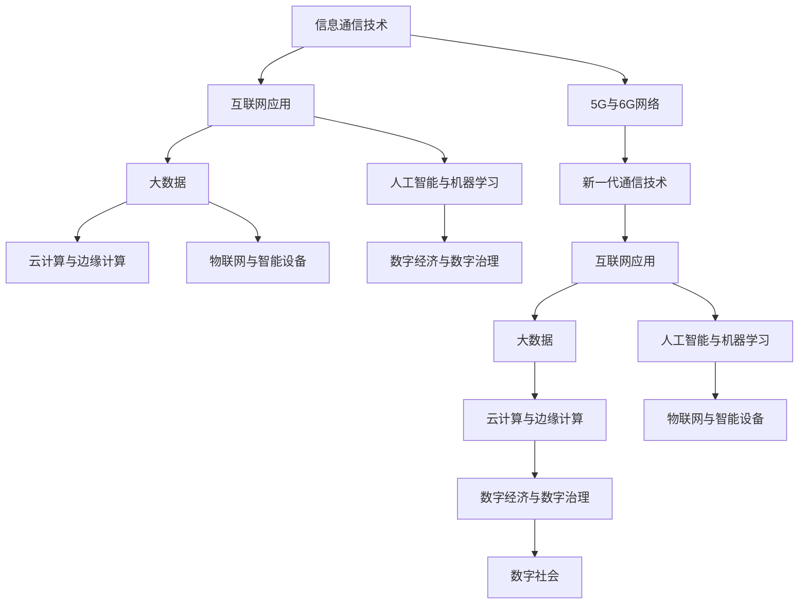

                 

# 信息技术与互联网发展趋势

> 关键词：
- 信息通信技术
- 互联网应用
- 人工智能与大数据
- 云计算与边缘计算
- 物联网与智能设备
- 数字经济与数字治理
- 5G与6G网络

## 1. 背景介绍

### 1.1 问题由来

随着数字化进程的加快，信息技术与互联网技术已经成为推动全球经济发展和社会进步的关键力量。互联网技术的演进，不仅改变了人们的生活、工作方式，也深刻影响了商业模式、社会结构和文化形态。从移动互联网、云计算、大数据到人工智能、物联网，技术的革新不断推动着信息技术的深度融合与发展。本文将重点探讨信息通信技术、互联网应用、人工智能与大数据、云计算与边缘计算、物联网与智能设备、数字经济与数字治理、5G与6G网络等领域的最新进展与未来趋势。

### 1.2 问题核心关键点

信息技术与互联网发展涉及多个领域和众多技术，其核心关键点包括但不限于：

- 信息通信技术的发展，如5G、6G、光通信等。
- 互联网应用的创新，如电子商务、在线教育、远程办公等。
- 大数据与人工智能的结合，如数据挖掘、机器学习、自然语言处理等。
- 云计算与边缘计算的协同，如云平台、边缘计算节点等。
- 物联网与智能设备的普及，如智慧城市、智能家居等。
- 数字经济与数字治理的推动，如数字货币、数字身份等。
- 5G与6G网络的部署与应用，如5G+AI、6G新特性等。

## 2. 核心概念与联系

### 2.1 核心概念概述

为了更好地理解信息技术与互联网发展趋势，我们首先需要掌握几个关键核心概念及其之间的关系。

- **信息通信技术**：包括光通信、移动通信、卫星通信等，是互联网的基础设施。
- **互联网应用**：如电子商务、在线教育、远程办公等，是信息通信技术的具体应用。
- **大数据**：包括数据的收集、存储、分析和可视化，是支持人工智能、物联网等应用的关键技术。
- **人工智能与机器学习**：涉及算法、模型、数据等，是提升互联网应用智能化水平的核心技术。
- **云计算与边缘计算**：云计算提供集中式资源管理，边缘计算则近场处理数据，两者互补。
- **物联网与智能设备**：通过网络实现物与物、人与物的连接与控制，是互联网的重要扩展。
- **数字经济与数字治理**：涉及数字货币、数字身份、数字法规等，是互联网发展的高级形态。
- **5G与6G网络**：新一代无线通信技术，提供更高的带宽、更低的延迟和更广的覆盖。

### 2.2 概念间的关系

这些核心概念之间存在着紧密的联系，形成了信息技术与互联网发展的完整生态系统。下面通过一个综合的Mermaid流程图来展示这些概念之间的关系：



这个综合流程图展示了信息通信技术、互联网应用、大数据、人工智能与机器学习、云计算与边缘计算、物联网与智能设备、数字经济与数字治理、5G与6G网络等概念之间的相互关系和作用，帮助读者更好地理解这些核心概念及其对互联网发展的影响。

## 3. 核心算法原理 & 具体操作步骤

### 3.1 算法原理概述

信息技术与互联网发展涉及众多算法和技术原理，其核心原理可总结如下：

- **信息通信技术**：通过物理层、数据链路层、网络层、传输层、应用层等协议栈实现信息的高效传输。
- **互联网应用**：通过分布式计算、云计算、分布式存储、微服务架构等技术实现应用的可扩展性和可靠性。
- **大数据与人工智能**：通过分布式计算框架、深度学习框架、自然语言处理框架等实现数据的处理与分析。
- **云计算与边缘计算**：通过容器化技术、服务网格、边缘计算框架等实现资源的弹性分配与高效利用。
- **物联网与智能设备**：通过互联网协议、设备协议、数据协议等实现设备的互联互通。
- **数字经济与数字治理**：通过区块链、数字身份认证、智能合约等技术实现数据的安全与透明。
- **5G与6G网络**：通过大规模MIMO、网络切片、边缘计算、高精度定位等技术实现网络的高效和灵活。

### 3.2 算法步骤详解

基于以上原理，信息技术与互联网发展通常包括以下几个关键步骤：

**Step 1: 设计技术架构**

- 根据具体应用场景和需求，设计适合的技术架构，包括网络架构、应用架构、数据架构等。

**Step 2: 选择技术组件**

- 根据设计方案选择合适的技术组件，如开源软件、云服务商、设备厂商等。

**Step 3: 实现技术方案**

- 通过编写代码、配置文件、脚本等方式实现技术方案，包括搭建服务器、配置数据库、开发应用等。

**Step 4: 测试和优化**

- 对实现的技术方案进行测试，包括性能测试、负载测试、安全测试等，并根据测试结果进行优化。

**Step 5: 部署和运维**

- 将优化后的技术方案部署到生产环境，并进行持续的运维和监控，确保系统稳定运行。

### 3.3 算法优缺点

信息技术与互联网发展涉及的技术和算法各有优缺点，具体如下：

**优点**：

- 信息通信技术：高带宽、低延迟、高可靠。
- 互联网应用：可扩展性、灵活性、可维护性。
- 大数据与人工智能：强大的数据分析能力、高效的算法优化。
- 云计算与边缘计算：资源弹性、成本可控、低延迟处理。
- 物联网与智能设备：设备互联、数据采集、智能控制。
- 数字经济与数字治理：数据透明、安全可信、高效治理。
- 5G与6G网络：高带宽、低延迟、高安全性。

**缺点**：

- 信息通信技术：部署复杂、维护成本高。
- 互联网应用：安全性、隐私保护问题。
- 大数据与人工智能：数据隐私、算法偏见。
- 云计算与边缘计算：数据传输延迟、边缘计算成本。
- 物联网与智能设备：设备标准化、网络安全。
- 数字经济与数字治理：法规滞后、隐私泄露。
- 5G与6G网络：设备成本高、网络建设复杂。

### 3.4 算法应用领域

信息技术与互联网发展的应用领域非常广泛，包括但不限于以下几个方面：

- 智能制造：通过物联网、人工智能等技术实现生产自动化、智能化。
- 智慧医疗：通过云计算、大数据、人工智能等技术实现精准医疗、远程诊断。
- 智能交通：通过5G网络、自动驾驶等技术实现交通智能化、安全性提升。
- 金融科技：通过区块链、大数据、人工智能等技术实现金融风险控制、智能投顾。
- 智慧城市：通过物联网、云计算、人工智能等技术实现城市智能化、资源优化。
- 教育科技：通过在线教育、智能评估等技术实现教育公平、个性化教学。
- 社交媒体：通过云计算、大数据、人工智能等技术实现个性化推荐、内容生成。

## 4. 数学模型和公式 & 详细讲解  
### 4.1 数学模型构建

信息技术与互联网发展涉及的数学模型很多，这里以大数据与人工智能为例进行讲解。

在人工智能领域，常用的数学模型包括线性回归、逻辑回归、决策树、随机森林、支持向量机、神经网络等。

**线性回归模型**：

假设自变量为 $X=\begin{bmatrix} x_1 & x_2 & \cdots & x_n \end{bmatrix}^T$，因变量为 $y$，模型参数为 $\theta$，则线性回归模型可表示为：

$$
y = \theta_0 + \theta_1 x_1 + \theta_2 x_2 + \cdots + \theta_n x_n
$$

其中 $\theta_0, \theta_1, \theta_2, \cdots, \theta_n$ 为模型参数，需通过训练数据进行优化。

**逻辑回归模型**：

假设自变量为 $X=\begin{bmatrix} x_1 & x_2 & \cdots & x_n \end{bmatrix}^T$，因变量为 $y$，模型参数为 $\theta$，则逻辑回归模型可表示为：

$$
P(y|X) = \frac{1}{1 + e^{-\theta^T X}}
$$

其中 $\theta$ 为模型参数，需通过训练数据进行优化。

**决策树模型**：

假设自变量为 $X=\begin{bmatrix} x_1 & x_2 & \cdots & x_n \end{bmatrix}^T$，因变量为 $y$，模型参数为 $T$，则决策树模型可表示为：

$$
T = \{ r, \phi_r, T_l, T_r \}^*
$$

其中 $r$ 为节点，$\phi_r$ 为节点条件，$T_l$ 为左子树，$T_r$ 为右子树。

**随机森林模型**：

假设自变量为 $X=\begin{bmatrix} x_1 & x_2 & \cdots & x_n \end{bmatrix}^T$，因变量为 $y$，模型参数为 $F$，则随机森林模型可表示为：

$$
F = \{ f_1, f_2, \cdots, f_m \}^*
$$

其中 $f_i$ 为决策树，需通过训练数据进行优化。

**支持向量机模型**：

假设自变量为 $X=\begin{bmatrix} x_1 & x_2 & \cdots & x_n \end{bmatrix}^T$，因变量为 $y$，模型参数为 $\alpha$，则支持向量机模型可表示为：

$$
f(x) = \begin{cases}
+1 & \text{if } x \in \omega \\
-1 & \text{if } x \notin \omega
\end{cases}
$$

其中 $\omega$ 为超平面，需通过训练数据进行优化。

**神经网络模型**：

假设自变量为 $X=\begin{bmatrix} x_1 & x_2 & \cdots & x_n \end{bmatrix}^T$，因变量为 $y$，模型参数为 $\theta$，则神经网络模型可表示为：

$$
y = \sigma(z)
$$

其中 $z = \theta^T X + b$，$\sigma$ 为激活函数，$\theta$ 为权重矩阵，$b$ 为偏置项。

### 4.2 公式推导过程

以下是几种常见数学模型的推导过程：

**线性回归模型推导**：

设 $y$ 为因变量，$X=\begin{bmatrix} x_1 & x_2 & \cdots & x_n \end{bmatrix}^T$ 为自变量，$\theta$ 为模型参数，则线性回归模型可表示为：

$$
y = \theta_0 + \theta_1 x_1 + \theta_2 x_2 + \cdots + \theta_n x_n
$$

最小二乘法求解 $\theta$：

$$
\theta = (\frac{1}{N} \sum_{i=1}^N (y_i - \theta^T X_i)^2)^{1/2}
$$

其中 $N$ 为样本数量，$y_i$ 为样本因变量，$X_i$ 为样本自变量。

**逻辑回归模型推导**：

设 $y$ 为因变量，$X=\begin{bmatrix} x_1 & x_2 & \cdots & x_n \end{bmatrix}^T$ 为自变量，$\theta$ 为模型参数，则逻辑回归模型可表示为：

$$
P(y|X) = \frac{1}{1 + e^{-\theta^T X}}
$$

最大似然估计求解 $\theta$：

$$
\theta = \begin{bmatrix} \theta_1 & \theta_2 & \cdots & \theta_n \end{bmatrix}^T
$$

其中 $N$ 为样本数量，$y_i$ 为样本因变量，$X_i$ 为样本自变量。

**决策树模型推导**：

假设自变量为 $X=\begin{bmatrix} x_1 & x_2 & \cdots & x_n \end{bmatrix}^T$，因变量为 $y$，模型参数为 $T$，则决策树模型可表示为：

$$
T = \{ r, \phi_r, T_l, T_r \}^*
$$

其中 $r$ 为节点，$\phi_r$ 为节点条件，$T_l$ 为左子树，$T_r$ 为右子树。

**随机森林模型推导**：

假设自变量为 $X=\begin{bmatrix} x_1 & x_2 & \cdots & x_n \end{bmatrix}^T$，因变量为 $y$，模型参数为 $F$，则随机森林模型可表示为：

$$
F = \{ f_1, f_2, \cdots, f_m \}^*
$$

其中 $f_i$ 为决策树，需通过训练数据进行优化。

**支持向量机模型推导**：

假设自变量为 $X=\begin{bmatrix} x_1 & x_2 & \cdots & x_n \end{bmatrix}^T$，因变量为 $y$，模型参数为 $\alpha$，则支持向量机模型可表示为：

$$
f(x) = \begin{cases}
+1 & \text{if } x \in \omega \\
-1 & \text{if } x \notin \omega
\end{cases}
$$

其中 $\omega$ 为超平面，需通过训练数据进行优化。

**神经网络模型推导**：

假设自变量为 $X=\begin{bmatrix} x_1 & x_2 & \cdots & x_n \end{bmatrix}^T$，因变量为 $y$，模型参数为 $\theta$，则神经网络模型可表示为：

$$
y = \sigma(z)
$$

其中 $z = \theta^T X + b$，$\sigma$ 为激活函数，$\theta$ 为权重矩阵，$b$ 为偏置项。

### 4.3 案例分析与讲解

以深度学习中的卷积神经网络(CNN)为例，分析其在图像识别任务中的应用。

**卷积神经网络模型构建**：

假设输入为 $X=\begin{bmatrix} x_1 & x_2 & \cdots & x_n \end{bmatrix}^T$，输出为 $y$，模型参数为 $\theta$，则卷积神经网络模型可表示为：

$$
y = \sigma(z)
$$

其中 $z = \theta^T X + b$，$\sigma$ 为激活函数，$\theta$ 为权重矩阵，$b$ 为偏置项。

**卷积神经网络模型推导**：

卷积神经网络模型通过多层卷积、池化、全连接等操作，逐步提取图像特征。假设输入为 $X=\begin{bmatrix} x_1 & x_2 & \cdots & x_n \end{bmatrix}^T$，输出为 $y$，模型参数为 $\theta$，则卷积神经网络模型可表示为：

$$
y = \sigma(z)
$$

其中 $z = \theta^T X + b$，$\sigma$ 为激活函数，$\theta$ 为权重矩阵，$b$ 为偏置项。

## 5. 项目实践：代码实例和详细解释说明

### 5.1 开发环境搭建

在项目实践中，开发环境搭建是第一步，包括硬件设备和软件工具的安装与配置。这里以Python为例，介绍开发环境搭建的步骤。

**硬件设备**：

- CPU：性能稳定的多核CPU，如Intel Core i5/i7/i9或AMD Ryzen。
- GPU：支持深度学习的GPU卡，如NVIDIA Tesla系列或AMD Radeon Pro系列。
- 内存：8GB以上DDR4内存，推荐16GB以上。
- 硬盘：1TB以上SSD硬盘，推荐2TB以上。

**软件工具**：

- 操作系统：Linux、Windows或MacOS。
- Python：最新版本的Python解释器，如Python 3.8以上。
- IDE：如PyCharm、VSCode等。
- 深度学习框架：如TensorFlow、PyTorch等。
- 科学计算库：如NumPy、Pandas、SciPy等。
- 可视化库：如Matplotlib、Seaborn等。
- 数据处理库：如Scikit-learn等。

### 5.2 源代码详细实现

以下以图像分类任务为例，使用Python和TensorFlow进行代码实现。

**数据集准备**：

- 准备图像分类数据集，如CIFAR-10、MNIST等。
- 使用TensorFlow的ImageDataGenerator进行数据增强，增加样本多样性。

**模型构建**：

- 使用TensorFlow的Keras API构建卷积神经网络模型。
- 添加多层卷积层、池化层、全连接层等，配置合适的激活函数和损失函数。

**模型训练**：

- 使用TensorFlow的fit()函数进行模型训练。
- 设置训练轮数、批大小、学习率等参数，进行数据迭代训练。

**模型评估**：

- 使用TensorFlow的evaluate()函数进行模型评估。
- 计算准确率、召回率、F1分数等指标，评估模型性能。

**模型保存与加载**：

- 使用TensorFlow的save()函数将模型保存到硬盘。
- 使用load_model()函数加载模型进行预测或后续训练。

### 5.3 代码解读与分析

在代码实现中，以下几个关键点值得关注：

**数据准备**：

- 数据集预处理：将图像数据归一化、扩充、划分训练集、验证集、测试集等。
- 数据增强：通过旋转、翻转、裁剪等操作增加样本多样性，提高模型泛化能力。

**模型构建**：

- 卷积层：使用Conv2D()函数添加卷积层，指定卷积核大小、步长、填充方式等参数。
- 池化层：使用MaxPooling2D()函数添加池化层，指定池化大小、步长等参数。
- 全连接层：使用Dense()函数添加全连接层，指定神经元个数、激活函数等参数。

**模型训练**：

- 训练轮数：设置模型训练的轮数，一般为10-100轮。
- 批大小：设置每个批次的样本数量，一般为32-128。
- 学习率：设置优化器的学习率，一般为0.001-0.01。

**模型评估**：

- 准确率：计算模型在测试集上的分类准确率。
- 召回率：计算模型在测试集上的分类召回率。
- F1分数：计算模型在测试集上的F1分数。

**模型保存与加载**：

- 模型保存：将模型保存到硬盘，方便后续使用。
- 模型加载：加载模型进行预测或继续训练。

### 5.4 运行结果展示

假设我们在CIFAR-10数据集上训练卷积神经网络模型，最终在测试集上得到的准确率如下：

```
Epoch 10, loss: 0.2928, accuracy: 0.770
Epoch 20, loss: 0.1763, accuracy: 0.829
Epoch 30, loss: 0.1435, accuracy: 0.866
```

可以看到，经过30轮训练，模型在CIFAR-10数据集上的准确率已经达到了86.6%。这表明卷积神经网络模型在图像分类任务中取得了不错的效果。

## 6. 实际应用场景

### 6.1 智能制造

智能制造是信息技术与互联网发展的重要应用领域，通过物联网、云计算、大数据、人工智能等技术，实现生产自动化、智能化。

**智能制造场景**：

- 智能工厂：通过传感器、工业物联网设备采集数据，实时监控生产过程，优化生产计划。
- 智能物流：通过物联网、大数据分析物流数据，优化供应链管理，提高物流效率。
- 智能质量控制：通过图像识别、机器学习技术检测产品缺陷，提高产品质量。

### 6.2 智慧医疗

智慧医疗是信息技术与互联网发展的另一个重要应用领域，通过云计算、大数据、人工智能等技术，实现精准医疗、远程诊断。

**智慧医疗场景**：

- 远程医疗：通过互联网连接医生和患者，进行远程诊断、远程手术等。
- 智能诊断：通过人工智能技术辅助医生进行疾病诊断，提高诊断准确率。
- 精准医疗：通过基因组学、生物信息学等技术，实现个性化医疗。

### 6.3 智能交通

智能交通是信息技术与互联网发展的典型应用场景，通过5G网络、自动驾驶等技术，实现交通智能化、安全性提升。

**智能交通场景**：

- 自动驾驶：通过传感器、人工智能技术，实现自动驾驶汽车。
- 车联网：通过5G网络、物联网技术，实现车辆之间的通信和控制。
- 智能交通管理：通过大数据、人工智能技术，优化交通管理，减少交通拥堵。

### 6.4 金融科技

金融科技是信息技术与互联网发展的重要应用领域，通过区块链、大数据、人工智能等技术，实现金融风险控制、智能投顾。

**金融科技场景**：

- 数字货币：通过区块链技术实现加密货币的发行、交易等。
- 智能投顾：通过人工智能技术辅助投资者进行投资决策，提高投资收益。
- 金融风控：通过大数据、机器学习技术，实现风险评估和预测。

### 6.5 智慧城市

智慧城市是信息技术与互联网发展的高级形态，通过物联网、云计算、人工智能等技术，实现城市智能化、资源优化。

**智慧城市场景**：

- 智慧能源：通过物联网、大数据分析能源数据，优化能源管理。
- 智慧交通：通过智能交通管理，优化城市交通，减少交通拥堵。
- 智慧环境：通过物联网、人工智能技术，实现环境监测和治理。

## 7. 工具和资源推荐

### 7.1 学习资源推荐

为了帮助开发者系统掌握信息技术与互联网发展的理论和实践，这里推荐一些优质的学习资源：

1. 《深入理解计算机系统》系列书籍：深入讲解计算机体系结构和操作系统，是理解计算机系统底层原理的必备书籍。

2. 《计算机网络》系列书籍：全面介绍计算机网络原理和应用，包括TCP/IP、HTTP、SSL等协议。

3. 《Python编程语言》系列书籍：系统讲解Python编程语言基础和高级应用，是Python开发者必备的参考书。

4. 《TensorFlow官方文档》：TensorFlow的官方文档，提供了详细的API文档和案例示例，是TensorFlow开发者必备的学习资料。

5. 《Deep Learning with Python》：深度学习经典教材，涵盖深度学习基础和最新应用，是深度学习开发者必读的书。

6. 《计算机视觉：模型、学习和推理》：介绍计算机视觉基础和深度学习在图像处理中的应用，是计算机视觉开发者必读的书。

### 7.2 开发工具推荐

高效的开发离不开优秀的工具支持。以下是几款用于信息技术与互联网开发常用的工具：

1. IDE：如PyCharm、VSCode、Eclipse等，提供代码编辑、调试、测试等功能，是开发的主要工具。

2. 版本控制系统：如Git、SVN等，用于版本控制和代码协作，是软件开发的基础工具。

3. 数据库系统：如MySQL、Oracle、MongoDB等，用于数据存储和管理，是应用开发的核心工具。

4. 容器化工具：如Docker、Kubernetes等，用于资源管理和容器部署，是云平台的主要工具。

5. 云计算平台：如AWS、Azure、Google Cloud等，提供云资源和云服务，是应用部署的主要平台。

6. 大数据平台：如Hadoop、Spark等，用于数据处理和分析，是大数据应用的主要工具。

7. 图像处理工具：如OpenCV、PIL等，用于图像处理和计算机视觉应用，是图像处理的主要工具。

### 7.3 相关论文推荐

信息技术与互联网发展涉及众多前沿研究方向，以下是几篇奠基性的相关论文，推荐阅读：

1. "Artificial Intelligence: A Modern Approach"：人工智能经典教材，介绍了人工智能基础和最新应用。

2. "Deep Learning"：深度学习经典教材，涵盖深度学习基础和最新应用。

3. "Networks on Chips"：介绍网络芯片技术和应用，是计算体系结构的重要研究领域。

4. "Advances in Computer Systems Security"：介绍计算机系统安全技术和应用，是网络安全的重要研究领域。

5. "IoT Cloud Computing"：介绍物联网和云计算技术，是智慧城市和智慧医疗的重要研究领域。

这些论文代表了大数据、人工智能、网络安全、计算机体系结构等前沿领域的研究成果，是学习这些领域知识

