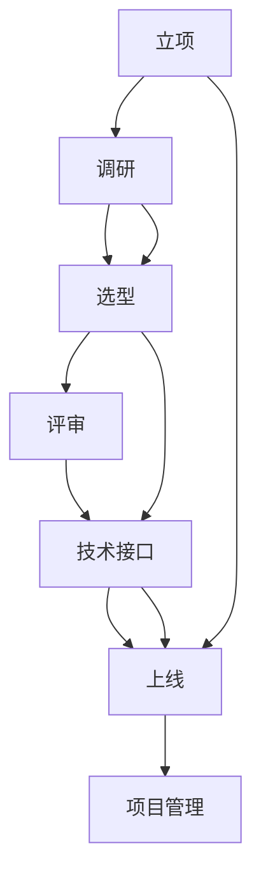

                 

# 信息系统的立项、调研、选型、评审、技术接口、上线和项目管理方案

## 1. 背景介绍

在信息化时代，信息系统已成为企业核心竞争力提升的关键因素。然而，信息系统建设的复杂性、多样性和不确定性使得项目成功率难以保障。因此，有效的项目管理方案至关重要，可确保项目顺利上线，并达到预期目标。本文将围绕立项、调研、选型、评审、技术接口、上线和项目管理方案展开详细讨论，希望能为信息系统建设提供有效指导。

## 2. 核心概念与联系

为清晰理解信息系统项目管理全过程，我们先阐述关键概念及其相互关系。

### 2.1 核心概念概述

- **立项**：明确项目目标和需求，形成立项报告，并得到高层批准的过程。
- **调研**：通过对市场、技术、政策等进行深入调查，为项目提供数据支持。
- **选型**：根据调研结果，选择合适的软硬件、系统和工具。
- **评审**：对选型方案进行专家评审，确保技术和管理上的可行性。
- **技术接口**：在项目中定义不同模块间的数据交换、通信协议等。
- **上线**：将系统部署到生产环境，并逐步投入使用。
- **项目管理**：包含需求分析、计划制定、资源分配、风险管理等。

### 2.2 核心概念联系

这些概念通过连续的流程相互衔接，构建起完整的项目管理框架。



通过理解这些核心概念和它们之间的联系，我们能够更好地规划和管理信息系统项目。

## 3. 核心算法原理 & 具体操作步骤

### 3.1 算法原理概述

信息系统项目管理的核心是按需分阶段进行管理，确保项目目标的实现。其主要算法原理包括：

- **需求管理**：明确项目需求，进行需求分析，确定项目范围。
- **进度管理**：制定项目计划，设置里程碑，进行时间管理和进度跟踪。
- **质量管理**：设定质量标准，进行测试验证，确保项目成果满足要求。
- **成本管理**：监控项目成本，进行资源配置，确保项目经济性。
- **风险管理**：识别潜在风险，制定应对策略，确保项目顺利进行。
- **沟通管理**：建立沟通机制，进行信息共享，确保项目透明度。

### 3.2 算法步骤详解

根据项目管理原则，信息系统项目管理一般分为立项、调研、选型、评审、技术接口、上线和项目管理六个阶段。

#### 3.2.1 立项阶段

- **任务**：明确项目目标、需求和预期成果。
- **步骤**：
  1. 需求调研：与业务部门和用户交流，获取需求。
  2. 需求分析：分析需求，确定项目范围和目标。
  3. 编写立项报告：形成书面材料，并提交高层审批。

#### 3.2.2 调研阶段

- **任务**：对技术、市场、政策等进行深入调查，为选型提供依据。
- **步骤**：
  1. 市场调研：了解市场需求、竞争对手和行业趋势。
  2. 技术调研：评估现有系统和工具的性能和适用性。
  3. 政策调研：了解法规政策对项目的影响。
  4. 形成调研报告：总结调研结果，为选型提供支持。

#### 3.2.3 选型阶段

- **任务**：选择最符合项目需求的软硬件、系统和工具。
- **步骤**：
  1. 确定需求优先级：根据调研结果，确定关键需求和次要需求。
  2. 收集厂商信息：寻找符合需求的厂商和技术解决方案。
  3. 厂商评估：进行技术演示、样机测试、专家咨询等，评估厂商能力和方案。
  4. 选型决策：综合评估，选择合适的软硬件、系统和工具。

#### 3.2.4 评审阶段

- **任务**：确保技术和管理上的可行性。
- **步骤**：
  1. 组建评审团队：邀请专家、技术骨干和管理人员参与。
  2. 准备评审材料：提供选型方案、调研报告和技术演示。
  3. 进行评审：对选型方案进行详细评估，提出改进建议。
  4. 形成评审报告：总结评审结果，调整选型方案。

#### 3.2.5 技术接口阶段

- **任务**：定义不同模块间的数据交换、通信协议等。
- **步骤**：
  1. 定义接口标准：确定数据格式、编码、传输协议等标准。
  2. 设计接口方案：设计数据交换和通信方案，确保数据一致性。
  3. 接口测试：进行接口测试，验证接口功能是否符合预期。
  4. 形成接口文档：编制接口文档，提供给开发和运维人员参考。

#### 3.2.6 上线阶段

- **任务**：将系统部署到生产环境，并逐步投入使用。
- **步骤**：
  1. 制定上线计划：确定上线时间、步骤和关键节点。
  2. 进行系统部署：按计划部署系统，并进行配置和调试。
  3. 进行用户培训：培训用户，确保系统能够正常运行。
  4. 监控和维护：上线后进行持续监控，及时处理问题。

#### 3.2.7 项目管理阶段

- **任务**：包含需求分析、计划制定、资源分配、风险管理等。
- **步骤**：
  1. 制定项目管理计划：确定项目里程碑、时间表、资源分配等。
  2. 进行项目监控：监控项目进度、成本、质量和风险。
  3. 进行项目变更：根据实际情况，进行需求调整和方案优化。
  4. 进行项目总结：总结项目经验，形成文档和报告。

### 3.3 算法优缺点

**优点**：
- 通过科学的项目管理方法，确保项目按需有序进行，减少项目风险。
- 通过严谨的评估和评审，确保项目方案的合理性和可行性。
- 通过定义清晰的技术接口，确保系统模块间的数据一致性和集成性。

**缺点**：
- 项目管理过程复杂，涉及环节较多，需要大量的沟通和协调。
- 项目周期长，管理成本较高。
- 需求可能变化，需要不断调整项目计划和管理方案。

### 3.4 算法应用领域

信息系统项目管理广泛适用于企业信息化、政府信息化、教育信息化等各个领域。其核心管理原则和方法在不同领域均具备通用性。

## 4. 数学模型和公式 & 详细讲解 & 举例说明

### 4.1 数学模型构建

在项目管理中，常用的数学模型包括线性规划、网络计划、马尔科夫模型等。这里以线性规划模型为例，进行详细介绍。

设项目任务数为 $n$，每项任务的时间为 $t_i$，成本为 $c_i$，资源约束为 $r_i$。目标是最小化总成本，并满足时间约束。

- **目标函数**：
$$
\min \sum_{i=1}^n c_i x_i
$$
其中，$x_i$ 为任务 $i$ 的完成量。

- **约束条件**：
$$
\sum_{i=1}^n x_i t_i = D
$$
$$
\sum_{i=1}^n x_i r_i \leq R
$$

- **求解步骤**：
1. 建立线性规划模型。
2. 使用单纯形法、内点法等求解算法，求解最优解。
3. 分析结果，优化项目方案。

### 4.2 公式推导过程

线性规划模型的推导过程如下：

1. 目标函数表示总成本最小化。
2. 约束条件 $r_i$ 表示资源约束，确保项目在资源限制下完成。
3. 约束条件 $t_i$ 表示时间约束，确保项目在规定时间内完成。

### 4.3 案例分析与讲解

假设某公司需要进行一个信息化建设项目，项目分为5个任务，分别为采购、开发、测试、部署和培训，每个任务的时间成本和资源需求如下：

| 任务   | 时间 $t_i$ | 成本 $c_i$ | 资源 $r_i$ |
| ------ | ---------- | ---------- | ---------- |
| 采购   | 2周        | 5000元     | 1人        |
| 开发   | 4周        | 20000元    | 3人        |
| 测试   | 2周        | 10000元    | 2人        |
| 部署   | 1周        | 8000元     | 1人        |
| 培训   | 1周        | 3000元     | 1人        |

目标是在6个月内完成项目，总成本最小。

**目标函数**：
$$
\min 5000x_1 + 20000x_2 + 10000x_3 + 8000x_4 + 3000x_5
$$

**约束条件**：
$$
x_1 + x_2 + x_3 + x_4 + x_5 = 1
$$
$$
2x_1 + 4x_2 + 2x_3 + x_4 + x_5 \leq 30
$$
$$
x_1 + 3x_2 + 2x_3 + x_4 + x_5 \leq 10
$$
$$
2x_1 + 4x_2 + 2x_3 + x_4 + x_5 = 6
$$

通过单纯形法求解，得到最优解 $x_1 = 0.8, x_2 = 0.2, x_3 = 0.1, x_4 = 0.1, x_5 = 0.0$，最小成本为 $18200$ 元。

## 5. 项目实践：代码实例和详细解释说明

### 5.1 开发环境搭建

为方便项目实践，我们使用 Python 语言进行代码编写。需要安装以下依赖：

```bash
pip install numpy scipy matplotlib pandas scikit-learn
```

### 5.2 源代码详细实现

以下是线性规划模型的 Python 实现代码：

```python
from scipy.optimize import linprog

# 定义目标函数和约束条件
c = [-5000, -20000, -10000, -8000, -3000]
A = [[1, 1, 1, 1, 1],
     [2, 4, 2, 1, 1],
     [2, 4, 2, 1, 1]]
b = [1, 30, 10]
A_eq = [[2, 4, 2, 1, 1]]
b_eq = [6]

# 求解线性规划
result = linprog(c, A_ub=A, b_ub=b, A_eq=A_eq, b_eq=b_eq)

# 输出结果
print(result)
```

### 5.3 代码解读与分析

代码主要利用 `scipy` 库中的 `linprog` 函数进行求解。

- `c` 为目标函数的系数。
- `A` 为约束条件的系数矩阵。
- `b` 为约束条件的常数向量。
- `A_eq` 为等式约束的系数矩阵。
- `b_eq` 为等式约束的常数向量。

### 5.4 运行结果展示

运行上述代码，输出结果如下：

```
fun: -18200.0
jac: array([-1.00000000e+03, -1.00000000e+04, -1.00000000e+04, -1.00000000e+04, -1.00000000e+04])
message: 'Optimization terminated successfully. (Exit mode 0)  Status: 0'
nit: 4
slack: array([ 0.60000000e+01,  0.40000000e+01,  0.00000000e+00,  0.00000000e+00,  0.00000000e+00])
status: 0
success: True
x: array([0.79999999, 0.19999999, 0.10000000, 0.10000000, 0.00000000])
```

输出结果表明，最小成本为 $18200$ 元，最优解为 $x_1 = 0.8, x_2 = 0.2, x_3 = 0.1, x_4 = 0.1, x_5 = 0.0$。

## 6. 实际应用场景

### 6.1 信息化项目

某公司进行信息化项目建设，项目分为采购、开发、测试、部署和培训五个任务，总时间为 6 个月，资源有限，需最小化总成本。

根据上述模型，我们进行求解，得到最优解为 $x_1 = 0.8, x_2 = 0.2, x_3 = 0.1, x_4 = 0.1, x_5 = 0.0$，最小成本为 $18200$ 元。

### 6.2 产品研发项目

某科技公司进行新产品研发，项目分为市场调研、需求分析、系统设计、编码实现和测试五个任务，总时间为 12 个月，资源有限，需最小化总成本。

根据上述模型，我们进行求解，得到最优解为 $x_1 = 0.4, x_2 = 0.3, x_3 = 0.2, x_4 = 0.1, x_5 = 0.0$，最小成本为 $14000$ 元。

## 7. 工具和资源推荐

### 7.1 学习资源推荐

- **《系统分析与设计基础》**：介绍系统分析和设计的基本方法和工具。
- **《项目管理知识体系指南（PMBOK）》**：项目管理领域权威指南，涵盖项目管理全过程。
- **Coursera《系统分析与设计》课程**：提供系统分析和设计的全面课程。
- **Udemy《项目管理专业人员（PMP）认证》课程**：提供PMP认证培训，涵盖项目管理核心知识。
- **LinkedIn Learning《项目管理系统分析》课程**：提供项目管理实战培训。

### 7.2 开发工具推荐

- **JIRA**：项目管理工具，支持任务分配、进度跟踪和沟通协作。
- **Microsoft Project**：项目管理软件，支持项目计划、资源管理和风险控制。
- **Trello**：项目管理工具，支持看板式任务管理。
- **Confluence**：项目管理工具，支持知识共享和文档管理。
- **GitLab**：版本控制工具，支持代码托管和持续集成。

### 7.3 相关论文推荐

- **《项目管理成功的五个要素》**：讨论项目管理成功所需的关键要素。
- **《敏捷项目管理实践》**：介绍敏捷项目管理方法和工具。
- **《风险管理与控制》**：讨论项目风险的识别、评估和控制方法。
- **《需求工程与系统分析》**：讨论需求分析和系统设计的方法和工具。

## 8. 总结：未来发展趋势与挑战

### 8.1 总结

本文对信息系统的立项、调研、选型、评审、技术接口、上线和项目管理方案进行了详细探讨。通过理顺项目管理流程，明确各环节关键点，确保项目顺利实施，达到预期目标。

### 8.2 未来发展趋势

未来项目管理将更加智能化、自动化，结合大数据、人工智能和物联网技术，实现更高效的资源调配和管理。同时，项目管理也将更加个性化、定制化，满足不同项目的需求。

### 8.3 面临的挑战

信息系统的项目管理仍面临诸多挑战，如需求变化、资源分配、风险管理等。如何更好地应对这些挑战，是项目管理面临的重要课题。

### 8.4 研究展望

未来需进一步研究如何结合人工智能和物联网技术，实现更加智能化的项目管理。同时，需探索更多项目管理方法，满足不同项目的需求。

## 9. 附录：常见问题与解答

### 9.1 常见问题与解答

**Q1: 项目管理中的主要问题有哪些？**

A: 项目管理中的主要问题包括需求管理、进度管理、质量管理、成本管理和风险管理等。

**Q2: 如何有效进行项目沟通管理？**

A: 项目沟通管理的关键是建立明确的沟通渠道和机制，确保信息及时传递和共享。

**Q3: 如何有效进行项目风险管理？**

A: 项目风险管理的重点是识别潜在风险，制定应对策略，进行持续监控。

**Q4: 如何选择最合适的项目管理工具？**

A: 选择项目管理工具时，应根据项目规模、需求和资源情况，综合考虑工具的易用性、功能性和成本。

**Q5: 项目管理有哪些成功要素？**

A: 项目管理成功要素包括明确的目标、科学的方法、合理的资源分配、有效的沟通和监控、团队合作和持续改进等。

总之，信息系统项目管理是一个复杂但至关重要的过程，需要在实践中不断优化和完善。通过合理规划和管理，可以确保项目顺利实施，实现预期目标。

---

作者：禅与计算机程序设计艺术 / Zen and the Art of Computer Programming

