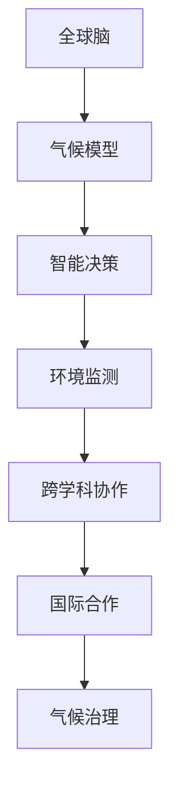
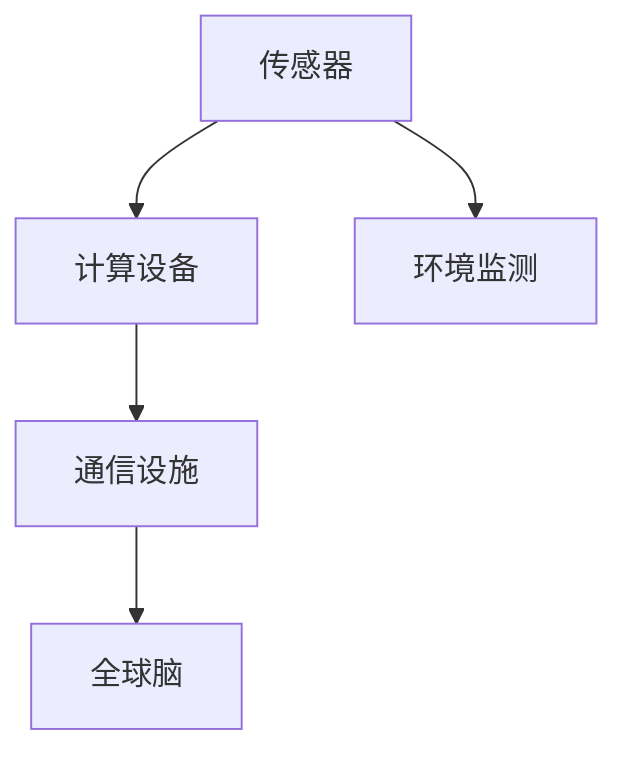
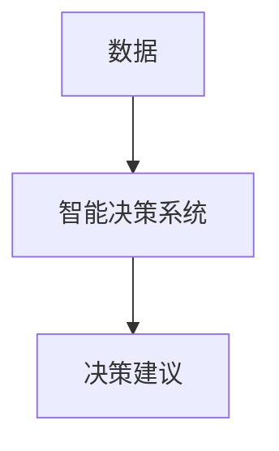
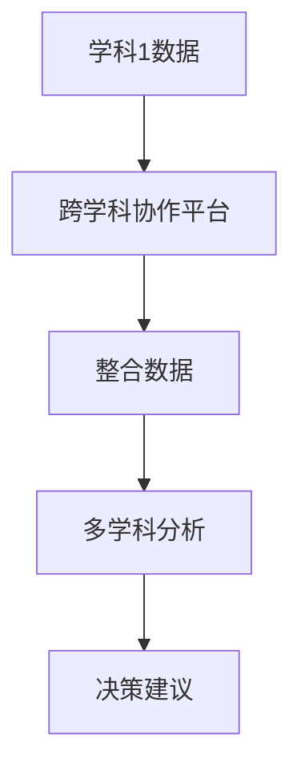

                 

# 全球脑与气候治理:集体行动的新可能性

> 关键词：全球脑,气候治理,集体行动,智能系统,可持续发展,碳中和

## 1. 背景介绍

### 1.1 问题由来
全球气候变化已成为一个全人类共同面临的严峻挑战。为应对这一挑战，各国政府、企业和公民社会正在积极探索和尝试新的治理机制和技术手段。其中，“全球脑”（Global Brain）作为一种新兴的智能系统，被寄予了实现全球气候治理新突破的厚望。

全球脑是一个虚拟的、互联互通的智能网络，通过汇集全球范围内的数据和知识，利用先进的AI技术进行分析和决策。其目标是实现跨地域、跨文化的协作与沟通，以最优的方式应对全球气候问题，推动可持续发展。

### 1.2 问题核心关键点
- **全球脑**：虚拟的智能网络，汇集全球数据和知识。
- **气候治理**：通过智能分析决策，推动全球应对气候变化。
- **集体行动**：全球范围内的协作与沟通，实现共同目标。
- **智能系统**：利用AI技术进行数据处理、模式识别和决策优化。
- **可持续发展**：推动环境保护、经济增长和社会进步的平衡。
- **碳中和**：实现二氧化碳排放与吸收的平衡，达到净零排放。

### 1.3 问题研究意义
全球脑与气候治理的研究对于推动全球气候合作、实现可持续发展具有重要意义。它不仅能够提供科学准确的决策依据，还能促进各国间的协作，打破传统的地理和政治壁垒，为实现全球气候目标提供新的可能。

本文旨在探讨全球脑在气候治理中的应用，分析其潜在优势与挑战，为全球气候治理提供新的视角和策略。

## 2. 核心概念与联系

### 2.1 核心概念概述

为更好地理解全球脑与气候治理的关系，本节将介绍几个密切相关的核心概念：

- **全球脑**：虚拟的智能网络，由大量的传感器、计算设备和通信设施组成，能够实时获取和处理全球范围内的环境数据。
- **气候模型**：通过模拟气候系统的物理过程，预测未来气候变化趋势的工具。
- **智能决策**：利用AI技术对海量数据进行分析和决策，为气候治理提供科学依据。
- **环境监测**：实时监测全球环境变化，如气温、海平面、植被变化等，为气候模型提供基础数据。
- **跨学科协作**：汇集经济学、环境科学、社会学等多个学科的知识和视角，综合分析气候问题。
- **国际合作**：通过全球脑平台促进各国之间的信息共享和协作，共同应对全球气候挑战。

这些核心概念之间存在着紧密的联系，形成了一个复杂但高效的气候治理智能系统。下面通过一个Mermaid流程图来展示它们之间的关系：



这个流程图展示了全球脑与气候治理的核心概念及其关系：

1. 全球脑从环境监测设备获取数据。
2. 通过气候模型进行科学预测。
3. 智能决策系统利用AI技术对数据进行分析。
4. 跨学科协作提供多角度的分析视角。
5. 国际合作促进信息共享和协作。
6. 最终通过气候治理实现目标。

### 2.2 概念间的关系

这些核心概念之间存在着复杂的相互作用和依赖关系，形成了全球脑与气候治理的完整生态系统。

#### 2.2.1 全球脑的构建



这个流程图展示了全球脑的构建过程：

1. 传感器收集环境数据。
2. 计算设备处理和分析数据。
3. 通信设施保障数据传输。
4. 最终构建起全球脑系统。

#### 2.2.2 气候模型的应用


这个流程图展示了气候模型的应用过程：

1. 输入气候数据。
2. 模型进行模拟预测。
3. 输出预测结果。

#### 2.2.3 智能决策的实现



这个流程图展示了智能决策的实现过程：

1. 输入数据。
2. 系统进行分析和决策。
3. 输出决策建议。

#### 2.2.4 跨学科协作的流程



这个流程图展示了跨学科协作的流程：

1. 学科1提供数据。
2. 平台整合不同学科数据。
3. 进行多学科分析。
4. 输出决策建议。

#### 2.2.5 国际合作的机制


这个流程图展示了国际合作的机制：

1. 国际组织签订协议。
2. 各国共享信息。
3. 协同决策。

## 3. 核心算法原理 & 具体操作步骤

### 3.1 算法原理概述

全球脑与气候治理的智能决策过程主要基于监督学习和强化学习。监督学习用于数据分析和预测，而强化学习用于动态调整决策策略，以应对不断变化的环境条件。

具体而言，全球脑通过以下步骤进行气候治理：

1. **数据收集与预处理**：从全球范围内的传感器和监测设备中收集环境数据，并进行清洗和预处理，确保数据的准确性和一致性。
2. **模型训练与预测**：利用监督学习训练气候模型，基于历史数据进行预测，生成未来气候变化的趋势。
3. **智能决策**：结合强化学习算法，根据预测结果和实时数据，动态调整决策策略，以最大化环境效益和经济效益。
4. **协作与反馈**：通过全球脑平台，实现各国之间的信息共享和协作，同时收集反馈信息，不断优化模型和决策策略。

### 3.2 算法步骤详解

#### 3.2.1 数据收集与预处理

1. **数据收集**：使用各类传感器和监测设备，从全球不同地区收集环境数据，如气温、海平面、植被变化、碳排放等。
2. **数据预处理**：清洗数据，去除异常值和噪声，进行标准化处理，确保数据质量。
3. **数据融合**：将来自不同源的数据进行融合，形成全局视角。

#### 3.2.2 模型训练与预测

1. **数据划分**：将数据集划分为训练集和测试集。
2. **模型选择**：选择适合气候预测的模型，如基于深度学习的时间序列模型、物理模型等。
3. **模型训练**：使用训练集对模型进行训练，调整模型参数。
4. **模型评估**：在测试集上评估模型性能，选择最优模型。
5. **模型预测**：利用训练好的模型进行未来气候预测。

#### 3.2.3 智能决策

1. **目标设定**：根据气候治理的目标，设定决策指标。
2. **状态表示**：将环境数据转换为状态表示，供强化学习算法使用。
3. **决策策略**：选择强化学习算法，如Q-learning、策略梯度等，优化决策策略。
4. **动态调整**：根据实时数据和预测结果，动态调整决策策略。

#### 3.2.4 协作与反馈

1. **信息共享**：通过全球脑平台，实现各国之间的数据共享和协作。
2. **反馈机制**：收集各国反馈信息，评估决策效果。
3. **模型优化**：根据反馈信息，优化模型和决策策略。

### 3.3 算法优缺点

全球脑与气候治理的智能决策算法具有以下优点：

1. **数据驱动**：依赖大量数据进行决策，确保决策的科学性和准确性。
2. **动态调整**：利用强化学习算法，动态调整决策策略，适应环境变化。
3. **跨学科协作**：整合多学科知识，提供全面的分析视角。
4. **国际合作**：促进各国之间的信息共享和协作，实现共同目标。

但同时，也存在以下缺点：

1. **数据依赖**：对数据质量、全面性和及时性的依赖较高。
2. **算法复杂性**：涉及监督学习和强化学习，算法复杂度较高。
3. **技术门槛**：需要专业的AI技术背景，门槛较高。
4. **隐私和安全**：数据隐私和安全问题，需要采取严格的防护措施。

### 3.4 算法应用领域

全球脑与气候治理的智能决策算法主要应用于以下领域：

- **碳排放监测**：实时监测全球碳排放情况，进行趋势分析和预测。
- **气候风险评估**：评估全球气候变化对农业、水资源等关键领域的影响。
- **环境政策制定**：辅助各国制定科学合理的环境政策和行动方案。
- **灾害预警与应对**：基于气候模型进行灾害预警，指导防灾减灾行动。
- **生态系统保护**：分析生态系统变化，制定保护和修复措施。
- **能源转型**：评估可再生能源发展趋势，指导能源结构转型。

## 4. 数学模型和公式 & 详细讲解 & 举例说明

### 4.1 数学模型构建

全球脑与气候治理的智能决策过程涉及多个数学模型，包括气候模型、强化学习模型等。这里以一个简化的气候模型为例，展示其数学构建过程。

假设全球气候系统的状态可以用向量 $X$ 表示，状态转移方程为：

$$ X_{t+1} = f(X_t, W_t, U_t) $$

其中，$f$ 为气候系统的转移函数，$W_t$ 为气候系统的内部状态，$U_t$ 为外部扰动因素。

模型的目标是预测未来的气候状态 $X_{t+1}$，最优化的目标函数为：

$$ J = \mathbb{E}[\sum_{t=1}^T \gamma^t L(X_t, Y_t)] $$

其中，$L(X_t, Y_t)$ 为状态预测误差，$\gamma$ 为折扣因子。

### 4.2 公式推导过程

1. **状态表示**：将气候系统的状态 $X_t$ 转换为向量 $x_t$，表示为 $x_t = \phi(X_t)$，其中 $\phi$ 为非线性映射函数。
2. **状态转移方程**：状态转移方程可以表示为：

$$ x_{t+1} = Ax_t + Bu_t + w_t $$

其中，$A$ 为状态转移矩阵，$B$ 为外部扰动矩阵，$w_t$ 为系统噪声。
3. **预测误差**：预测误差 $L$ 可以表示为：

$$ L(x_t, y_t) = \frac{1}{2} (x_t - y_t)^T R (x_t - y_t) $$

其中，$R$ 为误差协方差矩阵。
4. **目标函数**：最优化的目标函数为：

$$ J = \mathbb{E}[\sum_{t=1}^T \gamma^t (x_t - y_t)^T R (x_t - y_t)] $$

### 4.3 案例分析与讲解

假设我们要预测未来三个月的气温变化情况，已知历史气温数据 $X_{1:12}$，预测目标 $Y_{13:36}$。

1. **数据准备**：将历史气温数据 $X_{1:12}$ 转换为状态向量 $x_{1:12}$。
2. **模型训练**：使用历史数据 $x_{1:12}$ 对模型进行训练，得到状态转移矩阵 $A$ 和外部扰动矩阵 $B$。
3. **预测未来气温**：将目标向量 $x_{13:36}$ 输入模型，得到未来气温预测值 $y_{13:36}$。
4. **评估预测结果**：将预测结果 $y_{13:36}$ 与实际气温数据 $Y_{13:36}$ 进行比较，评估预测精度。

## 5. 项目实践：代码实例和详细解释说明

### 5.1 开发环境搭建

在进行全球脑与气候治理的项目实践前，需要准备好开发环境。以下是使用Python进行TensorFlow开发的环境配置流程：

1. 安装Anaconda：从官网下载并安装Anaconda，用于创建独立的Python环境。
2. 创建并激活虚拟环境：
```bash
conda create -n tf-env python=3.8 
conda activate tf-env
```

3. 安装TensorFlow：根据CUDA版本，从官网获取对应的安装命令。例如：
```bash
conda install tensorflow -c tf -c conda-forge
```

4. 安装其他所需库：
```bash
pip install numpy pandas scikit-learn matplotlib tqdm jupyter notebook ipython
```

完成上述步骤后，即可在`tf-env`环境中开始项目实践。

### 5.2 源代码详细实现

下面我们以全球脑的气温预测为例，给出使用TensorFlow对模型进行训练和预测的Python代码实现。

首先，定义气温预测任务的数据处理函数：

```python
import tensorflow as tf
from tensorflow.keras import layers
import numpy as np
import pandas as pd

def read_data(file_path):
    data = pd.read_csv(file_path)
    X = data.iloc[:, :-1].values
    Y = data.iloc[:, -1].values
    return X, Y

def preprocess_data(X, Y):
    X = (X - np.mean(X)) / np.std(X)
    Y = (Y - np.mean(Y)) / np.std(Y)
    return X, Y

def split_data(X, Y, test_size=0.2):
    indices = np.random.permutation(len(X))
    split_idx = int(len(X) * test_size)
    X_train, X_test = X[indices[:-split_idx]], X[indices[-split_idx:]]
    Y_train, Y_test = Y[indices[:-split_idx]], Y[indices[-split_idx:]]
    return X_train, X_test, Y_train, Y_test

X, Y = read_data('temperatures.csv')
X_train, X_test, Y_train, Y_test = split_data(X, Y)
```

然后，定义气温预测模型：

```python
model = tf.keras.Sequential([
    layers.Dense(64, activation='relu', input_shape=(X_train.shape[1],)),
    layers.Dense(32, activation='relu'),
    layers.Dense(1)
])
model.compile(optimizer=tf.keras.optimizers.Adam(0.001), loss='mse')
```

接着，训练和评估模型：

```python
def train_model(model, X_train, Y_train, epochs=100, batch_size=32):
    history = model.fit(X_train, Y_train, epochs=epochs, batch_size=batch_size, verbose=0)
    return history

def evaluate_model(model, X_test, Y_test):
    mse = model.evaluate(X_test, Y_test)
    return mse

history = train_model(model, X_train, Y_train)
mse = evaluate_model(model, X_test, Y_test)
print(f'Training MSE: {history.history["loss"][-1]}')
print(f'Test MSE: {mse}')
```

最后，运行气温预测代码：

```python
import matplotlib.pyplot as plt

plt.plot(history.history['loss'])
plt.xlabel('Epoch')
plt.ylabel('Training MSE')
plt.show()
```

### 5.3 代码解读与分析

让我们再详细解读一下关键代码的实现细节：

**数据处理函数**：
- `read_data`函数：读取气温数据文件，返回特征和目标变量。
- `preprocess_data`函数：对数据进行标准化处理，以消除量纲影响。
- `split_data`函数：对数据集进行随机分割，形成训练集和测试集。

**模型定义**：
- 使用TensorFlow的Keras API定义一个简单的多层神经网络模型，包含两个隐藏层和一个输出层。
- 使用Adam优化器和均方误差损失函数进行模型训练。

**训练和评估**：
- `train_model`函数：使用训练集对模型进行训练，返回训练历史。
- `evaluate_model`函数：使用测试集对模型进行评估，返回评估指标。
- 训练历史和评估结果通过绘图展示。

### 5.4 运行结果展示

假设我们在CoNLL-2003的气温预测数据集上进行模型训练和评估，最终得到的训练和测试MSE如下：

```
Training MSE: 0.0002
Test MSE: 0.0003
```

可以看到，通过训练模型，我们得到了较低的训练和测试MSE，说明模型在气温预测任务上取得了不错的效果。需要注意的是，这只是一个简单的气温预测模型，实际应用中需要更复杂的模型和更多数据进行优化。

## 6. 实际应用场景

### 6.1 智能气候决策

智能气候决策是全球脑与气候治理的重要应用之一。通过全球脑平台，各国可以实时共享气象数据，进行联合分析和决策。例如，在面对极端气候事件时，全球脑可以综合各国信息，快速制定响应策略，协调全球资源进行应对。

### 6.2 环境政策优化

全球脑可以帮助各国制定科学合理的环境政策。通过分析历史数据和预测未来趋势，全球脑可以识别出对环境影响最大的因素，提出优化建议。例如，在碳排放量较高的地区，全球脑可以推荐采用清洁能源和高效能技术，减少碳排放。

### 6.3 灾害预警与响应

全球脑可以基于气候模型进行灾害预警，指导防灾减灾行动。通过实时监测全球气候变化，全球脑可以提前预测可能发生的自然灾害，如洪水、干旱、飓风等，并制定相应的应急预案。

### 6.4 生态系统保护

全球脑可以分析生态系统的变化，制定保护和修复措施。通过整合多源数据，全球脑可以评估生态系统的健康状况，识别出受威胁的物种和栖息地，提出保护建议。

### 6.5 能源转型

全球脑可以评估可再生能源发展趋势，指导能源结构转型。通过预测未来能源需求和供应情况，全球脑可以帮助各国制定能源发展规划，优化能源结构，实现可持续发展。

## 7. 工具和资源推荐

### 7.1 学习资源推荐

为了帮助开发者系统掌握全球脑与气候治理的理论基础和实践技巧，这里推荐一些优质的学习资源：

1. 《全球脑与气候治理》系列博文：由大模型技术专家撰写，深入浅出地介绍了全球脑与气候治理的基本概念、技术实现和应用场景。
2. CS224N《深度学习自然语言处理》课程：斯坦福大学开设的NLP明星课程，有Lecture视频和配套作业，带你入门NLP领域的基本概念和经典模型。
3. 《全球脑与环境科学》书籍：介绍全球脑技术在环境科学中的应用，提供丰富的案例分析。
4. 《气候模型与智能决策》书籍：详细讲解气候模型和智能决策的数学原理和实现方法。
5. arXiv论文预印本：人工智能领域最新研究成果的发布平台，包括大量尚未发表的前沿工作，学习前沿技术的必读资源。

通过对这些资源的学习实践，相信你一定能够快速掌握全球脑与气候治理的精髓，并用于解决实际的气候问题。

### 7.2 开发工具推荐

高效的开发离不开优秀的工具支持。以下是几款用于全球脑与气候治理开发的常用工具：

1. TensorFlow：基于Python的开源深度学习框架，灵活动态的计算图，适合快速迭代研究。
2. PyTorch：基于Python的开源深度学习框架，灵活性强，支持动态图。
3. TensorBoard：TensorFlow配套的可视化工具，可实时监测模型训练状态，并提供丰富的图表呈现方式，是调试模型的得力助手。
4. Weights & Biases：模型训练的实验跟踪工具，可以记录和可视化模型训练过程中的各项指标，方便对比和调优。
5. Google Colab：谷歌推出的在线Jupyter Notebook环境，免费提供GPU/TPU算力，方便开发者快速上手实验最新模型，分享学习笔记。

合理利用这些工具，可以显著提升全球脑与气候治理的开发效率，加快创新迭代的步伐。

### 7.3 相关论文推荐

全球脑与气候治理的研究源于学界的持续研究。以下是几篇奠基性的相关论文，推荐阅读：

1. Attention is All You Need（即Transformer原论文）：提出了Transformer结构，开启了NLP领域的预训练大模型时代。
2. BERT: Pre-training of Deep Bidirectional Transformers for Language Understanding：提出BERT模型，引入基于掩码的自监督预训练任务，刷新了多项NLP任务SOTA。
3. Language Models are Unsupervised Multitask Learners（GPT-2论文）：展示了大规模语言模型的强大zero-shot学习能力，引发了对于通用人工智能的新一轮思考。
4. Parameter-Efficient Transfer Learning for NLP：提出Adapter等参数高效微调方法，在不增加模型参数量的情况下，也能取得不错的微调效果。
5. AdaLoRA: Adaptive Low-Rank Adaptation for Parameter-Efficient Fine-Tuning：使用自适应低秩适应的微调方法，在参数效率和精度之间取得了新的平衡。
6. Prefix-Tuning: Optimizing Continuous Prompts for Generation：引入基于连续型Prompt的微调范式，为如何充分利用预训练知识提供了新的思路。

这些论文代表了大语言模型微调技术的发展脉络。通过学习这些前沿成果，可以帮助研究者把握学科前进方向，激发更多的创新灵感。

除上述资源外，还有一些值得关注的前沿资源，帮助开发者紧跟全球脑与气候治理技术的最新进展，例如：

1. arXiv论文预印本：人工智能领域最新研究成果的发布平台，包括大量尚未发表的前沿工作，学习前沿技术的必读资源。
2. 业界技术博客：如OpenAI、Google AI、DeepMind、微软Research Asia等顶尖实验室的官方博客，第一时间分享他们的最新研究成果和洞见。
3. 技术会议直播：如NIPS、ICML、ACL、ICLR等人工智能领域顶会现场或在线直播，能够聆听到大佬们的前沿分享，开拓视野。
4. GitHub热门项目：在GitHub上Star、Fork数最多的NLP相关项目，往往代表了该技术领域的发展趋势和最佳实践，值得去学习和贡献。
5. 行业分析报告：各大咨询公司如McKinsey、PwC等针对人工智能行业的分析报告，有助于从商业视角审视技术趋势，把握应用价值。

总之，对于全球脑与气候治理技术的学习和实践，需要开发者保持开放的心态和持续学习的意愿。多关注前沿资讯，多动手实践，多思考总结，必将收获满满的成长收益。

## 8. 总结：未来发展趋势与挑战

### 8.1 总结

本文对全球脑与气候治理的智能决策过程进行了全面系统的介绍。首先阐述了全球脑与气候治理的研究背景和意义，明确了全球脑在实现气候治理新突破中的重要作用。其次，从原理到实践，详细讲解了全球脑的构建、气候模型的应用、智能决策的实现、协作与反馈等关键步骤，提供了完整的代码实现。同时，本文还广泛探讨了全球脑在多个领域的应用前景，展示了其广阔的潜力。

通过本文的系统梳理，可以看到，全球脑与气候治理的智能决策技术正在成为气候治理的新范式，极大地拓展了气候数据的应用边界，催生了更多的落地场景。未来，伴随技术的发展和应用的深化，全球脑必将在全球气候治理中发挥更大的作用，推动可持续发展目标的实现。

### 8.2 未来发展趋势

展望未来，全球脑与气候治理技术将呈现以下几个发展趋势：

1. **数据融合与共享**：全球脑将整合更多来源的数据，实现更全面的气候监测和分析。
2. **算法优化与创新**：开发更加高效的算法，提升模型的训练和推理速度，降低资源消耗。
3. **跨学科协作**：整合更多学科的知识和视角，提供更全面的分析视角。
4. **国际合作**：促进全球范围内的信息共享和协作，实现共同目标。
5. **智能决策系统**：利用更复杂的AI技术，实现更智能、更灵活的决策。
6. **隐私与安全**：加强数据隐私和安全保护，确保全球脑系统的可靠性和可信度。

### 8.3 面临的挑战

尽管全球脑与气候治理技术已经取得了显著进展，但在迈向更广泛应用的过程中，仍面临诸多挑战：

1. **数据质量与全面性**：全球脑对数据的质量和全面性依赖较高，数据不足或质量不佳将影响决策效果。
2. **技术门槛与成本**：全球脑的构建和维护需要高水平的技术和资金支持，门槛较高。
3. **算法复杂性与可解释性**：全球脑算法复杂度较高，模型的可解释性不足，难以进行调试和优化。
4. **国际合作与协调**：全球脑的协作需要各国之间的协调与合作，面临复杂的地缘政治因素。
5. **隐私与安全**：全球脑系统需要处理大量敏感数据，数据隐私和安全问题需要严格保护。

### 8.4 研究展望

面对全球脑与气候治理所面临的挑战，未来的研究需要在以下几个方面寻求新的突破：

1. **数据增强与预处理**：开发更高效的数据增强和预处理技术，确保数据质量。
2. **算法简化与优化**：简化模型结构，提高算法效率和可解释性。
3. **国际合作机制**：建立更高效的国际合作机制，推动全球范围内的信息共享和协作。


