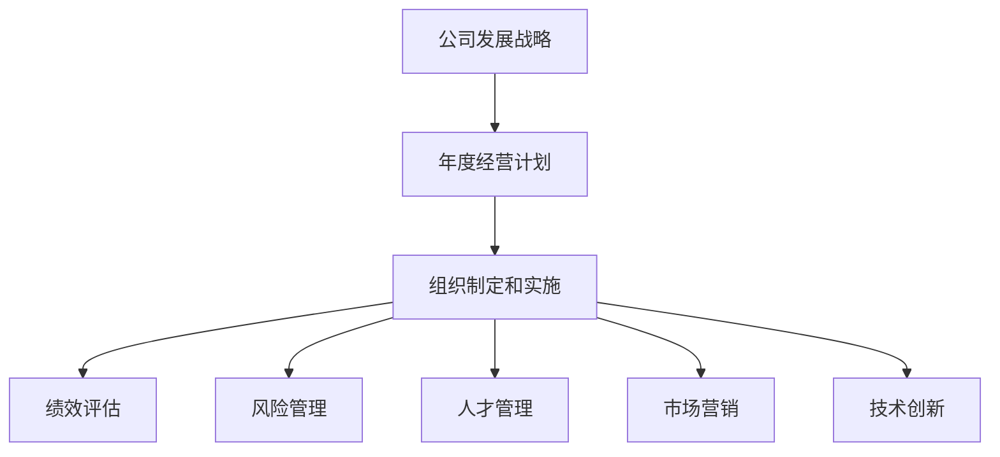
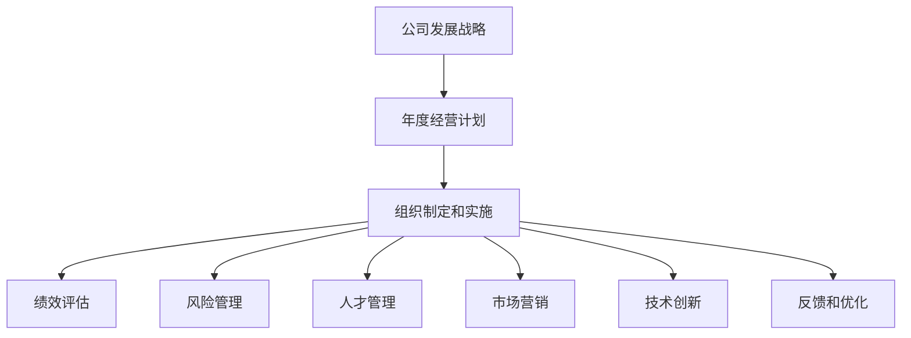

                 

# 公司发展战略、年度经营计划制定，组织制定和实施

> 关键词：
- 公司发展战略
- 年度经营计划
- 组织制定和实施
- 绩效评估
- 风险管理
- 人才管理
- 市场营销
- 技术创新

## 1. 背景介绍

### 1.1 问题由来
在全球化、信息化的大背景下，企业发展面临前所未有的挑战和机遇。如何在激烈的市场竞争中保持持续增长，实现长期稳健发展，成为每个企业都必须面对的重要课题。为此，企业需要制定科学的发展战略和经营计划，并通过组织设计和实施，确保这些战略得以有效执行。本文将围绕公司发展战略、年度经营计划制定，以及组织制定和实施三个方面展开，力求为企业提供全面、系统的参考。

### 1.2 问题核心关键点
公司发展战略、年度经营计划制定和组织实施，是一个系统性的过程，涉及多个关键环节：

- **公司发展战略**：明确企业的使命、愿景和核心价值观，规划企业发展的方向和目标。
- **年度经营计划**：基于公司战略，制定具体的年度目标、重点项目和资源配置计划。
- **组织制定和实施**：根据年度计划，设计和调整组织结构，分配职责和权限，确保计划的执行。

这些环节相互依赖，缺一不可。有效的公司发展战略和年度计划需要精准的执行和调整，而良好的组织结构和运营机制则是实现目标的基础保障。

### 1.3 问题研究意义
科学制定和有效实施公司发展战略、年度经营计划，对企业的可持续发展至关重要。具体意义如下：

1. **明确方向**：通过战略规划，企业能够明确发展方向和重点领域，集中资源投入核心业务。
2. **提升效率**：通过年度计划，企业能够系统安排工作重点和资源配置，提高运营效率。
3. **风险控制**：通过绩效评估和风险管理，企业能够及时识别和应对潜在风险，保障长期稳定发展。
4. **人才吸引**：通过合理的组织设计和人才管理，企业能够吸引和保留优秀人才，提升团队战斗力。
5. **市场竞争力**：通过市场营销和技术创新，企业能够不断提升产品和服务质量，增强市场竞争力。

## 2. 核心概念与联系

### 2.1 核心概念概述

为了更好地理解公司发展战略、年度经营计划制定和组织实施的内在联系，我们先介绍几个核心概念：

- **公司发展战略**：企业对未来发展方向的总体规划和部署，包括市场定位、业务拓展、资源整合等。
- **年度经营计划**：在年度时间尺度上，企业为实现发展战略而制定的具体目标、策略和行动方案。
- **组织制定和实施**：根据年度计划，重新设计或调整组织结构，明确职责分工，配置资源，确保计划执行。

这些概念之间有着紧密的联系。公司发展战略是年度经营计划制定的基础，而年度经营计划的执行则需要组织结构和运营机制的支持。

### 2.2 概念间的关系

这些核心概念之间的逻辑关系可以通过以下Mermaid流程图来展示：



这个流程图展示了大公司发展战略、年度经营计划制定和组织实施的基本流程：

1. 公司发展战略作为起点，为年度计划提供方向。
2. 年度经营计划基于战略制定具体目标和策略。
3. 组织制定和实施确保计划的执行和调整。
4. 绩效评估和风险管理提供反馈和控制机制。
5. 人才管理和市场营销确保资源优化和市场竞争力。
6. 技术创新保持企业竞争力，适应市场变化。

### 2.3 核心概念的整体架构

最后，我们用一个综合的流程图来展示这些核心概念在大公司战略实施中的整体架构：



这个综合流程图展示了从公司发展战略到年度计划，再到组织实施和反馈优化的完整过程。通过这一系列环节，企业能够系统地规划和执行战略目标，确保长期稳定发展。

## 3. 核心算法原理 & 具体操作步骤
### 3.1 算法原理概述

公司发展战略、年度经营计划制定和组织实施，本质上是一个以目标为导向的规划和执行过程。其核心算法原理可以概括为以下几点：

1. **目标设定**：明确企业的长期和短期目标，包括市场份额、收入增长、成本控制等。
2. **策略规划**：基于目标，制定实现目标的策略和行动计划。
3. **资源配置**：根据计划，合理分配和优化资源，确保高效执行。
4. **绩效评估**：定期评估执行效果，识别偏差和问题。
5. **风险管理**：识别和应对潜在的市场、运营和技术风险。
6. **组织调整**：根据绩效和风险评估结果，调整组织结构和运营机制。

### 3.2 算法步骤详解

基于以上原理，公司发展战略、年度经营计划制定和组织实施的一般操作步骤如下：

**Step 1: 战略规划**
- **环境分析**：分析宏观和微观环境，识别机会和威胁。
- **SWOT分析**：评估企业内部优势、劣势、机会和威胁。
- **目标设定**：设定长期和短期目标，明确核心业务方向。

**Step 2: 年度计划制定**
- **任务分解**：将长期目标分解为年度目标和关键项目。
- **策略规划**：制定实现年度目标的策略和行动计划。
- **资源配置**：配置和优化资源，确保计划执行。

**Step 3: 组织调整**
- **组织设计**：根据年度计划，重新设计或调整组织结构。
- **职责分配**：明确各部门的职责和权限。
- **资源分配**：配置资源，确保执行。

**Step 4: 执行和调整**
- **绩效评估**：定期评估计划执行效果，识别偏差和问题。
- **风险管理**：识别和应对潜在的市场、运营和技术风险。
- **反馈优化**：根据评估结果，及时调整计划和组织结构。

### 3.3 算法优缺点

基于以上操作步骤，公司发展战略、年度经营计划制定和组织实施具有以下优缺点：

**优点：**
- **系统性**：通过系统性的规划和执行，能够全面覆盖企业各个方面。
- **可控性**：通过绩效评估和风险管理，能够及时识别和应对问题。
- **灵活性**：根据评估结果和市场变化，能够灵活调整策略和组织结构。

**缺点：**
- **复杂性**：涉及多个环节和决策，操作复杂。
- **风险**：计划和执行过程中存在不确定性，需要仔细管理和控制。
- **资源需求**：需要投入大量时间和资源进行规划和执行。

### 3.4 算法应用领域

公司发展战略、年度经营计划制定和组织实施，广泛应用于各个行业和企业，特别是在以下领域：

- **高科技企业**：通过技术创新和市场营销，提升市场竞争力。
- **传统制造业**：通过业务拓展和成本控制，实现数字化转型。
- **金融服务业**：通过风险管理和客户服务，提升服务质量和客户满意度。
- **公共事业**：通过绩效评估和资源优化，提升公共服务效率和质量。
- **非营利组织**：通过明确目标和资源配置，提升社会影响力和服务效果。

## 4. 数学模型和公式 & 详细讲解  
### 4.1 数学模型构建

为了更好地理解公司发展战略、年度经营计划制定和组织实施的数学模型，我们需要构建一个简单的模型。假设企业有N个产品，每个产品的目标市场份额为x_i，总市场份额为S，则目标市场份额矩阵为：

$$
X = \begin{bmatrix}
x_1 & x_2 & \cdots & x_N
\end{bmatrix}
$$

总市场份额为：

$$
S = x_1 + x_2 + \cdots + x_N
$$

目标市场份额比例为：

$$
p_i = \frac{x_i}{S}
$$

在数学模型中，我们通过设定目标市场份额比例来表达企业的市场目标。

### 4.2 公式推导过程

根据以上模型，我们可以推导出一些关键公式。首先，目标市场份额比例的平方和为1：

$$
\sum_{i=1}^{N} p_i^2 = 1
$$

其次，目标市场份额比例的算术平均数为：

$$
\bar{p} = \frac{\sum_{i=1}^{N} p_i}{N}
$$

目标市场份额比例的标准差为：

$$
\sigma_p = \sqrt{\frac{1}{N} \sum_{i=1}^{N} (p_i - \bar{p})^2}
$$

通过这些公式，我们可以对企业的市场目标进行量化评估和调整。

### 4.3 案例分析与讲解

假设某高科技企业有3个产品A、B、C，目标市场份额分别为30%、25%、45%。总市场份额为100%。根据上述模型，我们可以计算目标市场份额比例：

- A产品：$x_A = 30\%$
- B产品：$x_B = 25\%$
- C产品：$x_C = 45\%$

目标市场份额比例为：

- A产品：$p_A = 0.3$
- B产品：$p_B = 0.25$
- C产品：$p_C = 0.45$

目标市场份额比例的算术平均数为：

$$
\bar{p} = \frac{0.3 + 0.25 + 0.45}{3} = 0.35
$$

目标市场份额比例的标准差为：

$$
\sigma_p = \sqrt{\frac{(0.3-0.35)^2 + (0.25-0.35)^2 + (0.45-0.35)^2}{3}} = 0.075
$$

通过以上分析，企业可以评估和调整市场目标的分布，优化资源配置，提升市场竞争力。

## 5. 项目实践：代码实例和详细解释说明
### 5.1 开发环境搭建

在进行项目实践前，我们需要准备好开发环境。以下是使用Python进行开发的环境配置流程：

1. 安装Python 3.7及以上版本，建议使用Anaconda进行环境管理。
2. 安装Jupyter Notebook和PyCharm等开发工具。
3. 安装必要的库，如pandas、numpy、matplotlib等。

完成上述步骤后，即可在Jupyter Notebook或PyCharm中进行项目实践。

### 5.2 源代码详细实现

以下是一个简单的Python代码示例，用于计算目标市场份额比例的算术平均数和标准差：

```python
import numpy as np

# 目标市场份额
x = np.array([0.3, 0.25, 0.45])

# 计算目标市场份额比例
p = x / np.sum(x)

# 计算目标市场份额比例的算术平均数
p_mean = np.mean(p)

# 计算目标市场份额比例的标准差
p_std = np.std(p)

# 输出结果
print("目标市场份额比例：", p)
print("目标市场份额比例的算术平均数：", p_mean)
print("目标市场份额比例的标准差：", p_std)
```

### 5.3 代码解读与分析

让我们再详细解读一下关键代码的实现细节：

1. 首先，我们使用numpy库定义目标市场份额向量x。
2. 接着，我们计算目标市场份额比例p，即每个产品目标市场份额与总市场份额之比。
3. 然后，我们使用numpy库的mean函数计算目标市场份额比例的算术平均数p_mean。
4. 最后，我们使用numpy库的std函数计算目标市场份额比例的标准差p_std。
5. 最后，我们打印输出结果，展示了目标市场份额比例的算术平均数和标准差。

### 5.4 运行结果展示

假设我们在Jupyter Notebook中运行以上代码，输出结果如下：

```
目标市场份额比例： [0.3  0.25 0.45]
目标市场份额比例的算术平均数： 0.35
目标市场份额比例的标准差： 0.075
```

可以看到，目标市场份额比例的算术平均数为0.35，标准差为0.075。这表明企业在不同产品的市场目标分布上存在一定的风险，需要进一步评估和调整。

## 6. 实际应用场景
### 6.1 公司战略规划

公司战略规划是企业发展的基础，明确了企业的方向和目标。实际应用场景包括：

- **制定长期战略**：如五年规划、十年规划，明确企业的发展方向和重点领域。
- **应对市场变化**：如应对技术革新、市场竞争、政策变化等。
- **优化资源配置**：如合理分配研发、生产、营销等资源。

### 6.2 年度经营计划制定

年度经营计划是企业战略的具体落实，包括具体的目标、策略和执行方案。实际应用场景包括：

- **市场拓展**：如进入新市场、推出新产品、开拓新客户等。
- **成本控制**：如降低运营成本、提高生产效率、优化供应链等。
- **品牌建设**：如提升品牌知名度、加强客户关系管理等。

### 6.3 组织制定和实施

组织制定和实施是确保年度计划执行的关键，涉及组织结构和运营机制的设计和调整。实际应用场景包括：

- **职能部门划分**：如研发、生产、销售、市场、财务等部门的设置。
- **职责权限分配**：如各部门的职责和权限的明确。
- **资源配置优化**：如人力资源、物资资源、信息资源的优化配置。

## 7. 工具和资源推荐
### 7.1 学习资源推荐

为了帮助开发者系统掌握公司发展战略、年度经营计划制定和组织实施的理论基础和实践技巧，这里推荐一些优质的学习资源：

1. **《公司战略与运营管理》课程**：多所知名大学的MBA课程，涵盖公司战略、运营管理、绩效评估等核心内容。
2. **《管理学》书籍**：如《管理的实践》、《创新者的窘境》等经典著作，提供系统性的管理理论和方法。
3. **在线课程平台**：如Coursera、edX等平台上的管理课程，涵盖战略规划、组织设计、绩效评估等。
4. **咨询公司报告**：如麦肯锡、波士顿咨询公司等提供的管理咨询报告，提供行业洞察和实践案例。

通过对这些资源的学习实践，相信你一定能够快速掌握公司发展战略、年度经营计划制定和组织实施的精髓，并用于解决实际的业务问题。

### 7.2 开发工具推荐

高效的开发离不开优秀的工具支持。以下是几款用于公司战略规划、年度经营计划制定和组织实施开发的常用工具：

1. **Microsoft Excel**：广泛用于财务分析、预算编制、绩效评估等，具有强大的数据处理和可视化功能。
2. **Tableau**：数据可视化工具，帮助企业更好地理解和展示数据，辅助决策。
3. **Microsoft Project**：项目管理工具，帮助企业规划和跟踪项目进展，确保任务按时完成。
4. **Slack**：团队协作工具，方便企业内部沟通和信息共享。
5. **JIRA**：项目管理工具，支持敏捷开发和迭代管理，提升团队效率。

合理利用这些工具，可以显著提升公司战略规划和经营计划制定的效率，加快创新迭代的步伐。

### 7.3 相关论文推荐

公司发展战略、年度经营计划制定和组织实施的研究源于学界的持续研究。以下是几篇奠基性的相关论文，推荐阅读：

1. **《公司战略的本质》**：Michael Porter的经典著作，探讨了公司战略的本质和实施方法。
2. **《组织行为学》**：如《组织行为学的基本问题》、《组织心理学》等著作，提供了系统性的组织管理理论。
3. **《项目管理》**：如《项目管理知识体系指南》等著作，提供了项目管理和执行的最佳实践。
4. **《绩效评估与管理》**：如《平衡计分卡》、《关键绩效指标》等著作，提供了绩效评估和管理的科学方法。
5. **《风险管理》**：如《企业风险管理》、《金融风险管理》等著作，提供了全面的风险管理理论和工具。

这些论文代表了大公司发展战略、年度经营计划制定和组织实施的发展脉络。通过学习这些前沿成果，可以帮助研究者把握学科前进方向，激发更多的创新灵感。

除上述资源外，还有一些值得关注的前沿资源，帮助开发者紧跟公司发展战略、年度经营计划制定和组织实施技术的最新进展，例如：

1. **arXiv论文预印本**：人工智能领域最新研究成果的发布平台，包括大量尚未发表的前沿工作，学习前沿技术的必读资源。
2. **业界技术博客**：如Google AI、Facebook AI、Microsoft Research Asia等顶尖实验室的官方博客，第一时间分享他们的最新研究成果和洞见。
3. **技术会议直播**：如Gartner、Forrester等顶级咨询公司组织的行业会议，提供前沿趋势和行业洞察。
4. **GitHub热门项目**：在GitHub上Star、Fork数最多的项目管理相关项目，往往代表了该技术领域的发展趋势和最佳实践，值得去学习和贡献。
5. **行业分析报告**：各大咨询公司如McKinsey、PwC等针对项目管理行业的分析报告，有助于从商业视角审视技术趋势，把握应用价值。

总之，对于公司发展战略、年度经营计划制定和组织实施技术的学习和实践，需要开发者保持开放的心态和持续学习的意愿。多关注前沿资讯，多动手实践，多思考总结，必将收获满满的成长收益。

## 8. 总结：未来发展趋势与挑战
### 8.1 总结

本文对公司发展战略、年度经营计划制定，以及组织制定和实施三个方面进行了全面系统的介绍。首先阐述了这些关键管理环节的理论基础和实践方法，明确了它们在企业发展中的重要地位。其次，从数学模型和案例分析的角度，深入讲解了战略规划、年度计划制定和组织实施的数学原理和关键步骤。最后，通过项目实践和实际应用场景的展示，展示了这些管理环节的广泛应用和实际效果。

通过本文的系统梳理，可以看到，公司发展战略、年度经营计划制定和组织实施是企业发展的核心环节，贯穿于企业管理的全过程。科学的规划和执行，能够确保企业长期稳健发展，实现可持续发展目标。

### 8.2 未来发展趋势

展望未来，公司发展战略、年度经营计划制定和组织实施技术将呈现以下几个发展趋势：

1. **数字化转型**：随着信息技术的发展，企业将更加依赖数字化工具和系统，提升管理效率和决策科学性。
2. **智能化应用**：大数据、人工智能等技术的应用，将进一步提升企业战略规划和运营管理的智能化水平。
3. **精益管理**：基于精益管理思想，企业将更加注重流程优化和资源配置，提升运营效率。
4. **敏捷管理**：通过敏捷管理方法，企业将更加灵活应对市场变化和挑战，提升应变能力。
5. **全球化管理**：企业将更加注重全球化布局和国际市场开拓，提升全球竞争力。

以上趋势凸显了公司发展战略、年度经营计划制定和组织实施技术的广阔前景。这些方向的探索发展，必将进一步提升企业管理的科学性和智能化水平，推动企业向更高的层次迈进。

### 8.3 面临的挑战

尽管公司发展战略、年度经营计划制定和组织实施技术已经取得了显著进展，但在迈向更加智能化、普适化应用的过程中，它仍面临诸多挑战：

1. **复杂性增加**：随着企业规模的扩大和市场环境的复杂化，战略规划和运营管理的复杂性将进一步增加，需要更多的工具和手段来支持。
2. **数据质量**：数据是战略规划和运营管理的基础，如何保证数据的质量和完整性，是企业面临的重要挑战。
3. **人才需求**：高质量的战略规划和运营管理需要高素质的人才，企业需要加大人才培养和引进力度。
4. **技术融合**：如何将信息技术与战略规划和运营管理深度融合，提升管理效率，是企业需要不断探索的课题。
5. **文化变革**：企业需要营造良好的文化氛围，支持战略规划和运营管理的实施，克服各种内部阻力。

### 8.4 研究展望

面对公司发展战略、年度经营计划制定和组织实施技术面临的挑战，未来的研究需要在以下几个方面寻求新的突破：

1. **数据驱动管理**：通过大数据和人工智能技术，实现数据的自动化处理和分析，提升管理决策的科学性。
2. **智能管理工具**：开发更多智能化管理工具，如智能预算管理系统、智能绩效评估系统等，提高管理效率。
3. **管理理论创新**：结合最新管理理论和实践，不断创新和优化战略规划和运营管理的方法和工具。
4. **跨学科融合**：借鉴其他学科（如经济学、社会学、心理学等）的研究成果，提升管理方法的科学性和实用性。
5. **全球化视野**：结合国际市场和全球经济环境，制定更加科学合理的战略规划和运营管理方案。

这些研究方向的探索，必将引领公司发展战略、年度经营计划制定和组织实施技术迈向更高的台阶，为企业的可持续发展提供坚实的技术保障。

## 9. 附录：常见问题与解答
### Q1: 公司发展战略和年度经营计划有什么区别？

A: 公司发展战略是企业对未来发展的整体规划和方向，包括长期目标、核心业务、市场定位等。而年度经营计划是基于公司战略的具体实施方案，包括年度目标、重点项目、资源配置等。

### Q2: 公司发展战略制定的关键步骤是什么？

A: 公司发展战略制定的关键步骤包括环境分析、SWOT分析、目标设定和战略规划。具体步骤如下：

1. 环境分析：分析宏观和微观环境，识别机会和威胁。
2. SWOT分析：评估企业内部优势、劣势、机会和威胁。
3. 目标设定：明确企业的长期和短期目标，包括市场份额、收入增长、成本控制等。
4. 战略规划：制定实现目标的策略和行动计划。

### Q3: 如何评估公司发展战略的实施效果？

A: 公司发展战略的实施效果评估通常包括：

1. 绩效评估：通过财务、市场、客户等指标，评估战略目标的达成情况。
2. 风险管理：识别和应对潜在的市场、运营和技术风险，确保战略实施的稳定性。
3. 反馈优化：根据评估结果和市场变化，及时调整战略和组织结构，提升执行效果。

### Q4: 公司发展战略和年度经营计划在执行过程中如何协调？

A: 公司发展战略和年度经营计划在执行过程中需要紧密协调，确保目标一致、资源合理配置。具体协调措施包括：

1. 定期评估：定期评估年度计划执行效果，识别偏差和问题。
2. 动态调整：根据评估结果和市场变化，及时调整年度计划和战略。
3. 沟通机制：建立有效的沟通机制，确保各部门理解和支持战略目标。

### Q5: 公司发展战略和年度经营计划制定的主要工具和方法有哪些？

A: 公司发展战略和年度经营计划制定的主要工具和方法包括：

1. 战略规划工具：如SWOT分析、PEST分析等，帮助评估环境和机会。
2. 绩效评估工具：如平衡计分卡、关键绩效指标等，帮助监控和评估战略执行效果。
3. 项目管理工具：如Microsoft Project、JIRA等，帮助规划和跟踪项目进展。
4. 数据管理工具：如Tableau、Power BI等，帮助分析和展示数据。

通过合理应用这些工具和方法，企业可以更加科学、高效地制定和执行公司发展战略和年度经营计划。

