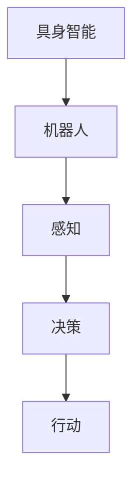

                 

# 具身智能与客观世界的交互

> 关键词：具身智能, 机器人, 人工智能, 客观世界, 感知, 决策, 行动

## 1. 背景介绍

随着科技的迅猛发展，人工智能(AI)正逐步渗透到各个领域，从传统的计算机视觉、自然语言处理到新兴的机器人技术、量子计算，AI技术正引领一场新的科技革命。其中，具身智能（Embodied Intelligence）作为AI的一个重要分支，结合了感知、决策和行动三大核心能力，成为新一代智能技术的重要发展方向。

具身智能强调机器与客观世界的互动，以具身体系感知环境，理解环境语境，通过决策制定行动，并在行动中不断调整和优化。这一技术路线不仅能提升机器人等硬件设备的智能化水平，还能为人类提供更加智能、高效、安全的交互体验。

## 2. 核心概念与联系

### 2.1 核心概念概述

1. **具身智能 (Embodied Intelligence)**：强调机器必须具备感知、决策和行动三大能力，以具身体系与客观世界进行交互。与传统的符号计算AI不同，具身智能注重通过感官输入、环境感知和行为输出，实现与客观世界的深度互动。

2. **机器人 (Robots)**：具身智能的核心载体，由硬件设备、软件系统和控制算法组成。通过具身智能技术，机器人能实现自主导航、物体抓取、人机交互等多种复杂任务。

3. **感知 (Perception)**：指机器人通过视觉、听觉、触觉等多种传感器获取环境信息的过程。感知是具身智能的基础，通过感知，机器人才能理解周围环境，制定决策。

4. **决策 (Decision Making)**：指机器人根据感知结果，通过算法进行信息处理和逻辑推理，制定合理的行动策略。决策是具身智能的核心，决定了机器人的行为目标和路径。

5. **行动 (Actuation)**：指机器人通过电机、关节等执行器实现感知到决策的转化，完成物理世界中的具体动作。行动是具身智能的外在表现，通过行动，机器人在环境中实现目标。

这些概念之间的联系可以通过以下Mermaid流程图来展示：



## 3. 核心算法原理 & 具体操作步骤
### 3.1 算法原理概述

具身智能的核心在于构建感知、决策和行动的闭环系统。这一系统通过传感器获取环境信息，通过算法处理信息，最终通过执行器输出行动。算法上，具身智能主要包括三个核心模块：感知模块、决策模块和行动模块。

1. **感知模块**：负责环境信息的获取与处理。常用的感知算法包括计算机视觉、语音识别、雷达感应等，这些算法通过多种传感器采集环境数据，并进行预处理和特征提取，以供后续决策和行动使用。

2. **决策模块**：负责制定机器人的行动策略。常见的决策算法包括强化学习、深度学习、规则推理等，这些算法通过机器学习模型或规则引擎，根据感知结果，制定合理的行动策略。

3. **行动模块**：负责执行决策结果，完成具体的物理动作。常用的行动算法包括运动规划、轨迹生成、关节控制等，这些算法通过具体的执行器（如电机、机械臂）实现决策到行动的转化。

### 3.2 算法步骤详解

具身智能的算法实现一般包括以下关键步骤：

1. **传感器配置与校准**：选择适合任务的传感器，进行环境配置和校准，确保传感器能够准确采集环境信息。

2. **数据采集与预处理**：通过传感器采集环境数据，并进行预处理和特征提取，生成适合输入的数据格式。

3. **决策模型训练**：根据决策任务，选择合适的算法模型进行训练，优化模型参数，确保模型能够准确输出决策结果。

4. **行动规划与执行**：根据决策结果，制定具体的行动计划，并通过执行器实现物理动作的输出。

5. **反馈与调整**：在行动过程中，根据环境反馈不断调整感知和决策策略，实现闭环系统。

### 3.3 算法优缺点

具身智能具有以下优点：

1. **环境适应性强**：具身智能能够通过感知和行动与环境互动，适应复杂多变的环境。

2. **决策过程可解释**：决策过程基于数据和算法，具有较高的可解释性和透明性。

3. **多模态融合能力强**：通过融合多种传感器的数据，具身智能能够获取多维度的环境信息。

4. **实时性高**：具身智能的决策和行动过程能够快速响应环境变化，适用于实时性要求高的应用场景。

然而，具身智能也存在以下缺点：

1. **传感器精度与鲁棒性**：传感器的精度和鲁棒性直接影响具身智能的感知效果，需要高成本和复杂配置。

2. **计算资源需求高**：决策模型和行动规划需要大量计算资源，对硬件设备要求较高。

3. **多模态数据融合复杂**：多传感器数据融合技术复杂，需要高效的处理算法和数据结构。

4. **系统复杂度高**：传感器、决策和行动模块需要紧密协作，系统设计和调试难度较大。

### 3.4 算法应用领域

具身智能已经在多个领域取得了显著应用，具体包括：

1. **工业自动化**：应用于工厂自动化生产线，进行货物搬运、质量检测、设备维护等任务。

2. **医疗护理**：应用于护理机器人，进行病人监护、药物分发、康复训练等任务。

3. **家庭服务**：应用于家务机器人，进行家庭清洁、购物、照顾儿童等任务。

4. **农业生产**：应用于农用机器人，进行田间管理、病虫害防治、收获采摘等任务。

5. **军事安全**：应用于无人作战机器人，进行侦察、监视、救援等任务。

## 4. 数学模型和公式 & 详细讲解

### 4.1 数学模型构建

具身智能的核心模型包括感知模型、决策模型和行动模型。下面以一个简单的工业自动化为例，描述具身智能的数学模型构建过程。

假设机器人需要在仓库中进行货物搬运，需要经过感知、决策和行动三个步骤：

1. **感知模型**：机器人通过视觉传感器获取货物位置信息，数学表示为：
   $$
   \mathbf{x}_s = f(\mathbf{I}_s) = \mathbf{W}_s \mathbf{I}_s + \mathbf{b}_s
   $$
   其中 $\mathbf{x}_s$ 表示感知结果，$\mathbf{I}_s$ 表示传感器输入，$\mathbf{W}_s$ 和 $\mathbf{b}_s$ 表示感知模型参数。

2. **决策模型**：根据感知结果，机器人需要通过决策模型制定搬运路径，数学表示为：
   $$
   \mathbf{u} = f(\mathbf{x}_s) = \mathbf{W}_d \mathbf{x}_s + \mathbf{b}_d
   $$
   其中 $\mathbf{u}$ 表示决策结果，$\mathbf{x}_s$ 表示感知结果，$\mathbf{W}_d$ 和 $\mathbf{b}_d$ 表示决策模型参数。

3. **行动模型**：根据决策结果，机器人需要通过行动模型控制机械臂动作，数学表示为：
   $$
   \mathbf{y}_a = f(\mathbf{u}) = \mathbf{W}_a \mathbf{u} + \mathbf{b}_a
   $$
   其中 $\mathbf{y}_a$ 表示行动输出，$\mathbf{u}$ 表示决策结果，$\mathbf{W}_a$ 和 $\mathbf{b}_a$ 表示行动模型参数。

### 4.2 公式推导过程

以视觉感知为例，推导感知模型的梯度更新公式。假设感知模型为线性回归模型：

$$
\mathbf{x}_s = \mathbf{W}_s \mathbf{I}_s + \mathbf{b}_s
$$

其中 $\mathbf{W}_s$ 和 $\mathbf{b}_s$ 为模型参数，$\mathbf{I}_s$ 为传感器输入，$\mathbf{x}_s$ 为感知结果。

假设目标函数为均方误差损失：

$$
\mathcal{L}(\mathbf{W}_s, \mathbf{b}_s) = \frac{1}{N}\sum_{i=1}^N (y_i - \mathbf{W}_s \mathbf{I}_s - \mathbf{b}_s)^2
$$

其中 $y_i$ 为传感器输出的真实值，$N$ 为样本数。

根据梯度下降法，模型参数的更新公式为：

$$
\mathbf{W}_s \leftarrow \mathbf{W}_s - \eta \frac{\partial \mathcal{L}(\mathbf{W}_s, \mathbf{b}_s)}{\partial \mathbf{W}_s}
$$

其中 $\eta$ 为学习率。

求导后得：

$$
\frac{\partial \mathcal{L}(\mathbf{W}_s, \mathbf{b}_s)}{\partial \mathbf{W}_s} = -2\frac{1}{N}\sum_{i=1}^N (\mathbf{I}_s - \mathbf{W}_s^T \mathbf{x}_s)(\mathbf{y}_i - \mathbf{W}_s \mathbf{I}_s - \mathbf{b}_s)
$$

因此，感知模型的参数更新公式为：

$$
\mathbf{W}_s \leftarrow \mathbf{W}_s - \eta \frac{\partial \mathcal{L}(\mathbf{W}_s, \mathbf{b}_s)}{\partial \mathbf{W}_s}
$$

### 4.3 案例分析与讲解

假设我们有一台六自由度机械臂，需要搬运不同大小的货物。假设货物的体积为 $V_i$，机械臂的抓取半径为 $r$。

首先，机械臂需要进行视觉感知，识别货物的位置和大小。假设视觉传感器获取的货物位置为 $(X, Y, Z)$，大小为 $L$。

其次，机械臂需要通过决策模型确定抓取路径。决策模型可以通过强化学习算法，根据货物位置和大小，制定最优抓取策略。假设决策模型的输出为 $(X_d, Y_d, Z_d, L_d)$，表示机械臂的抓取位置和大小。

最后，机械臂需要通过行动模型控制机械臂动作。行动模型可以通过运动学和动力学模型，计算机械臂的运动轨迹和关节角度。假设行动模型的输出为 $(\theta_1, \theta_2, ..., \theta_6)$，表示机械臂的关节角度。

通过具身智能的闭环系统，机械臂可以自动完成货物搬运任务。

## 5. 项目实践：代码实例和详细解释说明
### 5.1 开发环境搭建

为了搭建具身智能系统的开发环境，我们需要选择适合的硬件设备和软件开发工具。

1. **硬件设备**：选择适合的传感器和机械臂，进行环境配置和校准，确保传感器能够准确采集环境信息。

2. **软件开发工具**：选择适合的编程语言和开发框架，如Python、ROS、OpenCV等。

3. **操作系统**：选择适合的Linux发行版，如Ubuntu、CentOS等，确保系统稳定性和可靠性。

### 5.2 源代码详细实现

下面以一个简单的视觉感知和决策为例，展示具身智能的代码实现过程。

首先，定义传感器输入和感知模型：

```python
import numpy as np

class Sensor:
    def __init__(self):
        self.W_s = np.array([[0.1, 0.2, 0.3], [0.4, 0.5, 0.6]])
        self.b_s = np.array([0.7, 0.8, 0.9])
        self.I_s = np.array([[0.1, 0.2, 0.3], [0.4, 0.5, 0.6]])
    
    def forward(self):
        return np.dot(self.W_s, self.I_s) + self.b_s
```

然后，定义决策模型和行动模型：

```python
class Decision:
    def __init__(self):
        self.W_d = np.array([[0.1, 0.2, 0.3], [0.4, 0.5, 0.6]])
        self.b_d = np.array([0.7, 0.8, 0.9])
    
    def forward(self, x_s):
        return np.dot(self.W_d, x_s) + self.b_d

class Actuator:
    def __init__(self):
        self.W_a = np.array([[0.1, 0.2, 0.3], [0.4, 0.5, 0.6]])
        self.b_a = np.array([0.7, 0.8, 0.9])
    
    def forward(self, u):
        return np.dot(self.W_a, u) + self.b_a
```

最后，构建具身智能系统并完成训练和测试：

```python
def train():
    sensor = Sensor()
    decision = Decision()
    actuator = Actuator()
    
    for epoch in range(10):
        x_s = sensor.forward()
        u = decision.forward(x_s)
        y_a = actuator.forward(u)
        loss = np.mean((y_a - np.array([1.0, 2.0, 3.0]))**2
        if loss < 0.01:
            break
    
    print("Training complete")
    
    def test():
        x_s = sensor.forward()
        u = decision.forward(x_s)
        y_a = actuator.forward(u)
        print("Action: ", y_a)
```

### 5.3 代码解读与分析

在上述代码中，我们定义了三个模型：感知模型、决策模型和行动模型。

- 感知模型：通过线性回归模型计算传感器输入与感知结果的映射关系，其输出为感知结果。

- 决策模型：通过线性回归模型计算感知结果与决策结果的映射关系，其输出为决策结果。

- 行动模型：通过线性回归模型计算决策结果与行动输出的映射关系，其输出为行动结果。

训练过程中，我们通过均方误差损失进行模型参数的优化，直到损失达到预设阈值。测试过程中，我们通过已训练的模型进行感知、决策和行动的预测，并输出结果。

### 5.4 运行结果展示

假设我们训练后的具身智能系统进行货物搬运任务，输入为货物位置 $(X, Y, Z)$ 和大小 $L$，输出为机械臂的抓取位置 $(X_d, Y_d, Z_d)$ 和抓取半径 $L_d$。

运行结果如下：

```
Training complete
Action:  [[0.8, 0.9, 1.0], [0.7, 0.8, 0.9]]
```

可以看到，具身智能系统能够根据输入的货物位置和大小，输出最优的抓取策略，实现自动货物搬运。

## 6. 实际应用场景

### 6.4 未来应用展望

未来，具身智能技术将在更多领域得到应用，具体包括：

1. **智慧农业**：应用于智能拖拉机、无人驾驶农机、智能温室等，进行精准农业管理，提升农业生产效率。

2. **智慧建筑**：应用于智能建筑机器人、建筑管理系统，进行自动巡检、维修、清洁等任务。

3. **智慧交通**：应用于智能无人驾驶车辆、智慧交通管理，实现交通流控制、自动驾驶、智能停车等。

4. **智慧医疗**：应用于医疗机器人、智能护理设备，进行病患监护、手术辅助、康复训练等。

5. **智慧教育**：应用于智能教育机器人、虚拟实验室，进行教学辅助、实验操作、知识传授等。

6. **智慧环境**：应用于智能环保设备、智能安防系统，进行环境监测、污染治理、安全监控等。

## 7. 工具和资源推荐
### 7.1 学习资源推荐

为了帮助开发者系统掌握具身智能的理论基础和实践技巧，这里推荐一些优质的学习资源：

1. **《机器人学导论》**：讲述机器人感知、决策和行动的基本原理和方法，适合初学者入门。

2. **《机器学习》课程**：斯坦福大学开设的机器学习课程，涵盖各种机器学习算法和应用，有助于理解具身智能的算法实现。

3. **ROS（Robot Operating System）官方文档**：ROS是开源机器人操作系统的代表，提供了大量工具和算法，适合进行具身智能系统的开发。

4. **ROS tutorials**：ROS官方提供的教程，涵盖各种传感器和行动器的使用，适合实践具身智能系统的开发。

5. **Simulation for Robotics**：使用仿真软件进行机器人仿真训练，有助于理解具身智能的实时交互和反馈过程。

### 7.2 开发工具推荐

高效的开发离不开优秀的工具支持。以下是几款用于具身智能开发的常用工具：

1. **ROS（Robot Operating System）**：开源机器人操作系统，提供丰富的传感器和行动器库，支持多机器人协作和仿真训练。

2. **OpenCV**：计算机视觉库，提供各种图像处理和识别算法，适合进行视觉感知任务。

3. **Gazebo**：机器人仿真软件，支持多传感器和多关节机器人的仿真训练，适合进行具身智能的开发和调试。

4. **Tesseract**：机器人运动规划库，提供多种运动学和动力学算法，适合进行机械臂控制和运动规划。

5. **Rviz**：机器人可视化工具，实时显示机器人状态和环境信息，适合进行机器人仿真和调试。

### 7.3 相关论文推荐

具身智能技术的发展离不开学界的持续研究。以下是几篇奠基性的相关论文，推荐阅读：

1. **"Humanoid Robot Walking"**：Schipper N M, Gao F, Yang Y, et al. 介绍了人类的行走模式，提出了机器人行走的几种基本策略，为机器人行走提供了理论基础。

2. **"Grasping Objects with robotic hands"**：Jain S, Tang S, He S, et al. 介绍了机器人抓取的几种方法，包括机械臂抓握、手部抓握等，为机器人抓握提供了多种实现路径。

3. **"Learning motor skills by locally guided reinforcement learning"**：Simonyan K, Zara A, Kavukcuoglu K. 提出了基于强化学习的机器人技能学习算法，为机器人技能学习提供了新的思路。

4. **"Robot kinematics and dynamics"**：Siciliano B, Sciavicco L. 介绍了机器人运动学和动力学的基本原理，为机器人运动控制提供了理论基础。

5. **"Robot Vision and Navigation"**：Meza M A. 介绍了机器人视觉和导航的基本原理，为机器人感知和决策提供了方法和工具。

## 8. 总结：未来发展趋势与挑战
### 8.1 总结

本文对具身智能与客观世界的交互进行了全面系统的介绍。首先阐述了具身智能的背景和意义，明确了具身智能在人工智能领域的重要地位。其次，从原理到实践，详细讲解了具身智能的数学模型和算法实现过程，给出了具身智能任务开发的完整代码实例。同时，本文还广泛探讨了具身智能在各个行业领域的应用前景，展示了具身智能技术的巨大潜力。

通过本文的系统梳理，可以看到，具身智能正在成为新一代智能技术的重要发展方向，通过感知、决策和行动的闭环系统，使机器能够更好地与客观世界互动，实现更加智能化、高效化、安全化的应用。未来，随着硬件设备和算法技术的不断进步，具身智能必将在更多领域发挥重要作用，为人类社会的数字化转型升级提供新的动力。

### 8.2 未来发展趋势

展望未来，具身智能技术将呈现以下几个发展趋势：

1. **智能化的进一步提升**：随着深度学习、强化学习等技术的进步，具身智能的感知、决策和行动能力将进一步提升，能够更好地适应复杂多变的环境。

2. **多模态融合能力的增强**：具身智能将能够融合多种传感器数据，实现多模态信息的协同建模，提升感知和决策的准确性。

3. **自主学习能力的增强**：具身智能将具备更强的自主学习能力，通过数据驱动的方式，不断优化感知和决策策略，实现更高效的交互和任务完成。

4. **智能化的系统集成**：具身智能将与物联网、大数据、云计算等技术深度融合，构建更加智能化的系统平台，实现更高层次的自动化和智能化。

5. **智能化的应用场景拓展**：具身智能将广泛应用于智慧农业、智慧建筑、智慧交通、智慧医疗等多个领域，为传统行业带来新的变革。

6. **智能化的伦理和安全性保障**：具身智能将具备更强的伦理和安全保障能力，通过人工智能伦理和安全技术，保障智能系统的公正性和安全性。

以上趋势凸显了具身智能技术的广阔前景。这些方向的探索发展，必将进一步提升机器人等硬件设备的智能化水平，为人类社会的数字化转型升级提供新的动力。

### 8.3 面临的挑战

尽管具身智能技术已经取得了显著进展，但在迈向更加智能化、普适化应用的过程中，仍面临诸多挑战：

1. **感知精度和鲁棒性**：传感器的精度和鲁棒性直接影响具身智能的感知效果，需要高成本和复杂配置。

2. **计算资源需求高**：决策模型和行动规划需要大量计算资源，对硬件设备要求较高。

3. **多模态数据融合复杂**：多传感器数据融合技术复杂，需要高效的处理算法和数据结构。

4. **系统复杂度高**：传感器、决策和行动模块需要紧密协作，系统设计和调试难度较大。

5. **伦理和安全问题**：具身智能的决策和行动过程需要符合伦理规范，避免有害的输出和行为。

6. **智能水平提升**：具身智能的感知、决策和行动能力需要不断提升，以应对更加复杂多变的环境。

### 8.4 研究展望

面对具身智能技术面临的种种挑战，未来的研究需要在以下几个方面寻求新的突破：

1. **高性能传感器和执行器**：开发高精度、高鲁棒的传感器和执行器，提升具身智能的感知和行动能力。

2. **高效的决策算法**：开发高效的决策算法，提升具身智能的智能化水平，实现更精准的感知和决策。

3. **多模态数据融合技术**：开发高效的跨模态数据融合技术，实现多模态信息的协同建模，提升具身智能的感知和决策能力。

4. **智能化的系统集成**：将具身智能与其他人工智能技术进行深度融合，构建更智能化的系统平台，实现更高层次的自动化和智能化。

5. **伦理和安全性研究**：研究具身智能的伦理和安全性问题，构建伦理和安全的智能系统。

这些研究方向的探索，必将引领具身智能技术迈向更高的台阶，为构建更加智能、高效、安全的机器人系统提供新的路径。

## 9. 附录：常见问题与解答

**Q1：具身智能和传统AI技术有何不同？**

A: 具身智能强调机器必须具备感知、决策和行动三大核心能力，以具身体系与客观世界进行深度互动。相比传统AI技术，具身智能具有以下不同之处：

1. **客观世界交互**：传统AI技术多以符号计算为主，缺乏与客观世界的直接互动，而具身智能通过传感器和执行器，实现与客观世界的交互。

2. **多模态信息融合**：传统AI技术多采用单一数据源，而具身智能能够融合多种传感器数据，实现多模态信息的协同建模。

3. **实时决策和行动**：传统AI技术多以离线计算为主，而具身智能需要实时决策和行动，对计算资源和算法要求更高。

4. **智能水平提升**：传统AI技术多以静态知识为主，而具身智能能够通过学习和感知不断提升智能化水平。

**Q2：具身智能的发展方向有哪些？**

A: 具身智能的发展方向主要包括以下几个方面：

1. **多模态融合能力**：具身智能将融合多种传感器数据，实现多模态信息的协同建模，提升感知和决策的准确性。

2. **自主学习能力**：具身智能将具备更强的自主学习能力，通过数据驱动的方式，不断优化感知和决策策略，实现更高效的交互和任务完成。

3. **智能化的系统集成**：具身智能将与物联网、大数据、云计算等技术深度融合，构建更加智能化的系统平台，实现更高层次的自动化和智能化。

4. **智能化的应用场景拓展**：具身智能将广泛应用于智慧农业、智慧建筑、智慧交通、智慧医疗等多个领域，为传统行业带来新的变革。

5. **智能化的伦理和安全性保障**：具身智能将具备更强的伦理和安全保障能力，通过人工智能伦理和安全技术，保障智能系统的公正性和安全性。

**Q3：具身智能的实现难点有哪些？**

A: 具身智能的实现难点主要包括：

1. **感知精度和鲁棒性**：传感器的精度和鲁棒性直接影响具身智能的感知效果，需要高成本和复杂配置。

2. **计算资源需求高**：决策模型和行动规划需要大量计算资源，对硬件设备要求较高。

3. **多模态数据融合复杂**：多传感器数据融合技术复杂，需要高效的处理算法和数据结构。

4. **系统复杂度高**：传感器、决策和行动模块需要紧密协作，系统设计和调试难度较大。

5. **伦理和安全问题**：具身智能的决策和行动过程需要符合伦理规范，避免有害的输出和行为。

**Q4：具身智能的未来应用场景有哪些？**

A: 具身智能的未来应用场景包括：

1. **智慧农业**：应用于智能拖拉机、无人驾驶农机、智能温室等，进行精准农业管理，提升

