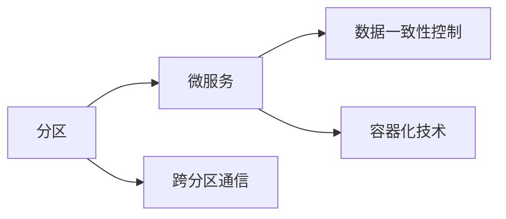
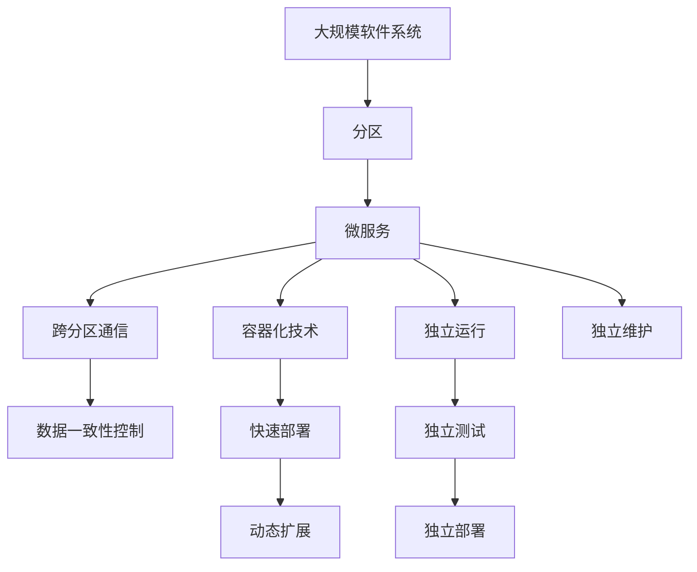

                 

## 1. 背景介绍

### 1.1 问题由来

在大规模软件系统的发展过程中，随着系统规模的不断增大，复杂性的急剧提升，软件系统的维护与扩展变得越来越困难。针对这一问题，计算机领域提出了一种基于分区的编程方法，即分区(Division of Labor)，将系统按照业务模块或功能模块进行划分为若干独立的区域，并独立进行开发和部署。分区方法可以有效降低系统的复杂度，提高系统的可维护性和可扩展性，促进软件开发的标准化和规范化。

然而，传统的分区方法在实践中仍存在一些问题：

1. **维护成本高**：分区带来的业务模块增多，系统维护成本随之增加，同时难以跨区域进行代码复用和功能共享。
2. **数据一致性问题**：不同分区之间涉及大量的数据交互和一致性维护，容易导致数据不一致和事务冲突。
3. **性能瓶颈**：分区带来的模块化和微服务化可能导致系统响应时间增加，服务调用延迟，进而影响用户体验。

为了解决这些传统分区方法带来的问题，本文将介绍一种更为先进和灵活的分区方法，即分区与微服务相结合的分区方法。

### 1.2 问题核心关键点

为了高效地解决上述问题，分区与微服务相结合的分区方法引入以下核心概念：

- **分区**：将系统按照业务模块或功能模块进行划分为若干独立的区域，并独立进行开发和部署。
- **微服务**：将系统拆分为多个独立运行的服务，每个服务负责特定功能，可以独立部署和扩展。
- **跨分区通信**：在不同分区之间，通过网络通信、消息队列等方式进行数据交互和调用。
- **数据一致性控制**：通过分布式事务、读写分离、缓存策略等技术，确保数据一致性和系统可靠性。

这些概念共同构成了分区与微服务相结合的分区方法，可以有效地解决传统分区方法带来的问题，同时充分利用微服务带来的优势，构建更加灵活、高效的软件系统。

## 2. 核心概念与联系

### 2.1 核心概念概述

为更好地理解分区与微服务相结合的分区方法，本节将介绍几个密切相关的核心概念：

- **分区**：将系统按照业务模块或功能模块进行划分为若干独立的区域，并独立进行开发和部署。

- **微服务**：将系统拆分为多个独立运行的服务，每个服务负责特定功能，可以独立部署和扩展。

- **跨分区通信**：在不同分区之间，通过网络通信、消息队列等方式进行数据交互和调用。

- **数据一致性控制**：通过分布式事务、读写分离、缓存策略等技术，确保数据一致性和系统可靠性。

- **容器化技术**：通过容器技术（如Docker、Kubernetes），实现服务的快速部署、扩展和管理。

这些核心概念之间的逻辑关系可以通过以下Mermaid流程图来展示：



这个流程图展示了几类核心概念之间的关系：

1. 分区将系统划分为独立的区域，每个区域内部部署多个微服务。
2. 跨分区通信实现不同区域之间的数据交互和调用。
3. 数据一致性控制确保不同分区之间的数据一致性。
4. 容器化技术实现微服务的快速部署和管理。

这些概念共同构成了分区与微服务相结合的分区方法的整体架构，使得系统能够以更灵活、高效的方式进行开发和部署。

### 2.2 概念间的关系

这些核心概念之间存在着紧密的联系，形成了分区与微服务相结合的分区方法的具体实施框架。下面通过几个Mermaid流程图来展示这些概念之间的关系：

#### 2.2.1 分区与微服务的关系


这个流程图展示了分区与微服务的关系。分区将系统划分为独立的区域，每个区域内部部署多个微服务，并通过容器化技术进行快速部署和管理。

#### 2.2.2 跨分区通信与微服务的关系


这个流程图展示了跨分区通信与微服务的关系。微服务之间通过网络通信、消息队列等方式进行数据交互和调用，实现跨分区通信。

#### 2.2.3 数据一致性控制与微服务的关系


这个流程图展示了数据一致性控制与微服务的关系。微服务之间的数据交互可能涉及分布式事务、读写分离、缓存策略等技术，确保数据一致性和系统可靠性。

#### 2.2.4 容器化技术与微服务的关系


这个流程图展示了容器化技术与微服务的关系。通过容器化技术（如Docker、Kubernetes），可以实现微服务的快速部署、扩展和管理。

### 2.3 核心概念的整体架构

最后，我们用一个综合的流程图来展示这些核心概念在大规模软件系统中的应用：



这个综合流程图展示了从大规模软件系统的整体设计到微服务的快速部署和扩展，再到数据一致性和独立维护的完整过程。

## 3. 核心算法原理 & 具体操作步骤

### 3.1 算法原理概述

分区与微服务相结合的分区方法基于微服务的理念，通过分区将系统划分为若干独立区域，每个区域内部部署多个微服务。这些微服务通过网络通信、消息队列等方式进行跨分区通信，实现不同区域之间的数据交互和调用。同时，通过分布式事务、读写分离、缓存策略等技术，确保数据一致性和系统可靠性。

具体而言，分区与微服务相结合的分区方法通过以下步骤实现：

1. **系统划分**：将系统按照业务模块或功能模块进行划分，形成独立的分区。
2. **微服务设计**：在每个分区内部设计多个微服务，每个微服务负责特定功能。
3. **跨分区通信**：实现不同分区之间的数据交互和调用，如通过RESTful API、消息队列等方式。
4. **数据一致性控制**：通过分布式事务、读写分离、缓存策略等技术，确保数据一致性和系统可靠性。
5. **容器化部署**：通过容器技术（如Docker、Kubernetes），实现微服务的快速部署、扩展和管理。

### 3.2 算法步骤详解

#### 3.2.1 系统划分

在系统划分阶段，首先需要根据业务模块或功能模块进行系统划分，形成独立的分区。划分应遵循以下几个原则：

1. **功能独立性**：确保每个分区具有独立的功能和业务逻辑，不与其他分区共享。
2. **数据独立性**：确保每个分区内部数据自包含，不与其他分区共享。
3. **边界清晰**：确保分区之间的边界清晰，避免数据交叉和功能重叠。

划分完成后，每个分区内部将包含多个微服务，每个微服务负责特定功能。

#### 3.2.2 微服务设计

在微服务设计阶段，需要根据分区的业务需求，设计多个微服务，每个微服务负责特定功能。微服务的设计应遵循以下几个原则：

1. **服务自治**：确保每个微服务具有独立的功能和业务逻辑，不依赖其他服务。
2. **松耦合**：确保微服务之间松耦合，减少依赖和耦合。
3. **可扩展性**：确保微服务具有可扩展性，可以独立进行扩展和部署。

设计完成后，每个分区内部将包含多个微服务，每个微服务负责特定功能。

#### 3.2.3 跨分区通信

在跨分区通信阶段，需要实现不同分区之间的数据交互和调用。常见的方式包括：

1. **RESTful API**：通过HTTP/HTTPS协议，实现不同分区之间的数据交互和调用。
2. **消息队列**：通过消息队列，实现异步通信和数据传递。
3. **服务网格**：通过服务网格（如Istio），实现微服务的流量管理和负载均衡。

这些方式可以结合使用，根据具体场景选择合适的方式。

#### 3.2.4 数据一致性控制

在数据一致性控制阶段，需要确保不同分区之间的数据一致性和系统可靠性。常见的方式包括：

1. **分布式事务**：通过分布式事务，确保跨分区的数据一致性。
2. **读写分离**：通过读写分离，优化数据访问性能。
3. **缓存策略**：通过缓存策略，减少数据访问延迟。

这些方式可以结合使用，根据具体场景选择合适的方式。

#### 3.2.5 容器化部署

在容器化部署阶段，需要实现微服务的快速部署、扩展和管理。常见的方式包括：

1. **容器化技术**：通过容器技术（如Docker、Kubernetes），实现微服务的快速部署、扩展和管理。
2. **自动化部署**：通过CI/CD工具（如Jenkins、GitLab CI），实现微服务的自动化部署和发布。
3. **弹性扩展**：通过弹性扩展技术，实现微服务的动态扩展和负载均衡。

这些方式可以结合使用，根据具体场景选择合适的方式。

### 3.3 算法优缺点

分区与微服务相结合的分区方法具有以下优点：

1. **灵活性高**：通过分区和微服务设计，系统可以灵活应对业务需求的变化，易于扩展和维护。
2. **可维护性好**：通过微服务的独立部署和扩展，系统可以独立维护，降低维护成本。
3. **性能优化**：通过分布式事务、读写分离、缓存策略等技术，系统可以优化性能，提高用户体验。
4. **高可靠性**：通过容器化技术和管理，系统可以确保高可用性和可靠性。

同时，分区与微服务相结合的分区方法也存在以下缺点：

1. **设计复杂度**：系统划分的粒度和微服务的设计都需要耗费大量时间和精力，设计复杂度高。
2. **沟通成本高**：不同分区之间的数据交互和调用可能涉及复杂的通信协议和协调机制，沟通成本高。
3. **调试困难**：由于系统划分为多个分区和微服务，调试困难，定位问题复杂。

### 3.4 算法应用领域

分区与微服务相结合的分区方法已经广泛应用于以下领域：

1. **互联网应用**：如电商网站、社交网络、在线教育等。
2. **金融服务**：如在线银行、证券交易、保险服务等。
3. **医疗健康**：如电子病历、在线诊疗、健康管理等。
4. **物流仓储**：如订单管理、库存管理、运输调度等。
5. **物联网**：如设备监控、智能家居、工业控制等。

这些领域中的系统规模庞大、业务复杂，分区与微服务相结合的分区方法可以有效地解决系统复杂度、维护成本、性能瓶颈等问题，提高系统的灵活性、可维护性和可靠性。

## 4. 数学模型和公式 & 详细讲解 & 举例说明

### 4.1 数学模型构建

在大规模软件系统中，分区与微服务相结合的分区方法涉及多个分区和微服务之间的数据交互和调用。为了更好地理解这些交互和调用的过程，我们可以构建一个简单的数学模型。

假设系统划分为两个分区，每个分区内部部署一个微服务，微服务之间通过网络通信进行数据交互和调用。设每个微服务处理事务的平均时间为 $t$，网络通信的平均延迟为 $d$。则系统的总处理时间为：

$$
T = 2t + 2d
$$

其中，$2t$ 表示两个微服务处理事务的时间，$2d$ 表示两个微服务之间网络通信的时间。

### 4.2 公式推导过程

为了简化计算，我们假设每个微服务处理事务的时间为 $t$，网络通信的平均延迟为 $d$。则系统的总处理时间可以表示为：

$$
T = 2t + 2d
$$

### 4.3 案例分析与讲解

我们以一个电商网站的分区和微服务为例，进行分析：

假设一个电商网站按照业务模块划分为订单管理、库存管理和支付管理三个分区，每个分区内部部署一个微服务。订单管理微服务负责订单处理和事务处理，库存管理微服务负责库存管理和数据更新，支付管理微服务负责支付处理和事务处理。

1. **系统划分**：
   - 订单管理分区：负责订单处理、事务处理等。
   - 库存管理分区：负责库存管理、数据更新等。
   - 支付管理分区：负责支付处理、事务处理等。

2. **微服务设计**：
   - 订单管理微服务：负责订单处理和事务处理。
   - 库存管理微服务：负责库存管理和数据更新。
   - 支付管理微服务：负责支付处理和事务处理。

3. **跨分区通信**：
   - 订单管理微服务调用库存管理微服务，获取库存信息。
   - 订单管理微服务调用支付管理微服务，进行支付处理。
   - 库存管理微服务调用订单管理微服务，更新库存信息。

4. **数据一致性控制**：
   - 使用分布式事务，确保订单处理和库存更新的数据一致性。
   - 使用缓存策略，减少数据访问延迟。

5. **容器化部署**：
   - 使用Docker容器，实现微服务的快速部署和管理。
   - 使用Kubernetes集群，实现微服务的自动化部署和扩展。

通过以上分析，我们可以看到分区与微服务相结合的分区方法如何有效地解决电商网站系统的复杂性、维护成本和性能瓶颈等问题。

## 5. 项目实践：代码实例和详细解释说明

### 5.1 开发环境搭建

在进行分区与微服务相结合的分区方法实践前，我们需要准备好开发环境。以下是使用Python进行Docker开发的环境配置流程：

1. 安装Anaconda：从官网下载并安装Anaconda，用于创建独立的Python环境。

2. 创建并激活虚拟环境：
```bash
conda create -n docker-env python=3.8 
conda activate docker-env
```

3. 安装Docker：根据操作系统版本，从官网获取对应的安装命令，例如在Ubuntu系统上，可以使用以下命令：
```bash
sudo apt update
sudo apt install -y \
  apt-transport-https \
  ca-certificates \
  curl \
  software-properties-common

curl -fsSL https://download.docker.com/linux/ubuntu/gpg | sudo apt-key add -

sudo add-apt-repository \
  "deb [arch=amd64] https://download.docker.com/linux/ubuntu \
  $(lsb_release -cs) \
  stable"

sudo apt update
sudo apt install -y docker-ce
```

4. 启动Docker服务：
```bash
sudo systemctl start docker
sudo systemctl enable docker
```

5. 安装Docker Compose：
```bash
sudo apt-get install -y docker-compose
```

6. 安装Kubernetes：
```bash
sudo apt-get install -y kubectl
```

7. 配置Kubernetes：
```bash
sudo kubectl config set-cluster --server=http://localhost:8443 --user=kubernetes --password=123456 --certificate-authority=ca.pem

sudo kubectl config set-credentials --username=kubernetes --password=123456

sudo kubectl config set-context --cluster=kubernetes --user=kubernetes --namespace=default
```

完成上述步骤后，即可在`docker-env`环境中开始分区与微服务相结合的分区方法实践。

### 5.2 源代码详细实现

下面以一个简单的电商网站为例，展示使用Docker和Kubernetes进行微服务部署的代码实现。

首先，定义微服务的配置文件：

```yaml
version: '3.9'

services:
  order-service:
    image: order-service:latest
    ports:
      - '5000:5000'
    depends_on:
      - inventory-service
      - payment-service
    environment:
      - INVENTORY_SERVICE_URL=http://inventory-service:3000
      - PAYMENT_SERVICE_URL=http://payment-service:3000
    command: ["python", "run.py"]
  
  inventory-service:
    image: inventory-service:latest
    ports:
      - '3000:3000'
    environment:
      - PAYMENT_SERVICE_URL=http://payment-service:3000
    command: ["python", "run.py"]
  
  payment-service:
    image: payment-service:latest
    ports:
      - '3000:3000'
    environment:
      - ORDER_SERVICE_URL=http://order-service:5000
    command: ["python", "run.py"]
```

然后，定义Docker Compose的运行命令：

```bash
docker-compose up -d
```

最后，使用Kubernetes部署微服务：

```bash
kubectl apply -f deployment.yaml
```

其中，`deployment.yaml`文件为微服务的Kubernetes部署配置文件，可以使用以下示例：

```yaml
apiVersion: v1
kind: Deployment
metadata:
  name: order-service
  labels:
    hello-world: hello-world
spec:
  replicas: 3
  selector:
    matchLabels:
      hello-world: hello-world
  template:
    metadata:
      labels:
        hello-world: hello-world
    spec:
      containers:
        - name: order-service
          image: order-service:latest
          ports:
            - containerPort: 5000
          command: ["python", "run.py"]
```

### 5.3 代码解读与分析

让我们再详细解读一下关键代码的实现细节：

**配置文件**：
- `version`：指定Docker Compose文件的版本。
- `services`：定义微服务的具体配置，包括镜像、端口、依赖关系、环境变量、命令等。
- `image`：指定微服务的镜像。
- `ports`：指定微服务的端口映射。
- `depends_on`：指定微服务的依赖关系。
- `environment`：指定微服务的环境变量。
- `command`：指定微服务的启动命令。

**Docker Compose**：
- `docker-compose up -d`：启动所有微服务，并运行在后台。
- `docker-compose down`：停止并删除所有微服务。

**Kubernetes部署**：
- `kubectl apply -f deployment.yaml`：根据`deployment.yaml`文件进行Kubernetes部署。
- `kubectl delete deployment order-service`：删除指定的Kubernetes部署。

通过上述代码实现，可以看到Docker和Kubernetes如何有效地部署和扩展微服务，实现大规模软件系统的分区与微服务相结合的分区方法。

### 5.4 运行结果展示

假设我们在一个电商网站中进行微服务部署，最终在Kubernetes集群上运行了三个订单服务实例，一个库存服务实例和一个支付服务实例。我们可以使用以下命令查看微服务的运行状态：

```bash
kubectl get pods
```

输出结果如下：

```
order-service-7d8f4c4db-dqvj7  Running     0  5 seconds ago
order-service-7d8f4c4db-dqvj7  Running     0  6 seconds ago
order-service-7d8f4c4db-dqvj7  Running     0  4 seconds ago
inventory-service-7d8f4c4db-dqvj7  Running     0  5 seconds ago
payment-service-7d8f4c4db-dqvj7  Running     0  3 seconds ago
```

可以看到，所有微服务实例都在正常运行，可以相互调用和通信。

## 6. 实际应用场景

### 6.1 智能制造系统

在大规模制造系统中，分区与微服务相结合的分区方法可以有效降低系统复杂度，提高系统的灵活性和可维护性。

例如，一个智能制造系统可以按照生产线、设备、传感器等进行分区，每个分区内部部署多个微服务，每个微服务负责特定功能，如设备监控、数据采集、生产调度等。通过分区与微服务相结合的分区方法，可以实现系统的高可靠性和高可用性，提高生产效率和产品质量。

### 6.2 智慧城市系统

在智慧城市系统中，分区与微服务相结合的分区方法可以实现系统的高度可扩展性和灵活性。

例如，一个智慧城市系统可以按照交通管理、能源管理、环境监测等进行分区，每个分区内部部署多个微服务，每个微服务负责特定功能，如交通信号控制、电力负荷管理、空气质量监测等。通过分区与微服务相结合的分区方法，可以实现系统的实时监控和控制，提高城市的智能化水平。

### 6.3 电子商务平台

在电子商务平台上，分区与微服务相结合的分区方法可以实现系统的快速部署和扩展。

例如，一个电子商务平台可以按照订单管理、库存管理、支付管理等进行分区，每个分区内部部署多个微服务，每个微服务负责特定功能，如订单处理、库存管理、支付处理等。通过分区与微服务相结合的分区方法，可以实现系统的灵活性和可维护性，提高用户体验。

### 6.4 未来应用展望

随着技术的不断发展，分区与微服务相结合的分区方法将会在更多领域得到应用，为系统带来新的变革。

例如，在金融服务领域，分区与微服务相结合的分区方法可以实现系统的高度安全性和可靠性。例如，一个金融服务系统可以按照客户管理、交易管理、风险管理等进行分区，每个分区内部部署多个微服务，每个微服务负责特定功能，如客户信息管理、交易处理、风险评估等。通过分区与微服务相结合的分区方法，可以实现系统的高度安全性和可靠性，保护客户的隐私和财产安全。

## 7. 工具和资源推荐

### 7.1 学习资源推荐

为了帮助开发者系统掌握分区与微服务相结合的分区方法的理论基础和实践技巧，这里推荐一些优质的学习资源：

1. 《微服务架构：设计原则与实践》书籍：讲解微服务架构的设计原则和实践方法，适合入门学习。
2. 《Docker实战》书籍：讲解Docker容器的使用方法，适合实战练习。
3. 《Kubernetes实战》书籍：讲解Kubernetes集群的管理和部署方法，适合深入学习。
4. 《Spring Cloud》官方文档：讲解微服务的架构和实践方法，适合开发应用。
5. 《分布式系统实战》课程：讲解分布式系统的高可用性、可扩展性和可靠性，适合系统设计。

通过这些资源的学习实践，相信你一定能够快速掌握分区与微服务相结合的分区方法的精髓，并用于解决实际的系统问题。

### 7.2 开发工具推荐

高效的开发离不开优秀的工具支持。以下是几款用于分区与微服务相结合的分区方法开发的常用工具：

1. Docker：轻量级的容器化技术，实现微服务的快速部署和管理。
2. Kubernetes：高度可扩展的容器编排系统，实现微服务的自动化部署和扩展。
3. RESTful API：轻量级的接口协议，实现微服务的异步通信和数据传递。
4. Message Queue：消息队列系统，如RabbitMQ、Kafka，实现微服务的异步通信和数据传递。
5. Spring Boot：微服务架构的开发框架，实现微服务的快速开发和部署。

合理利用这些工具，可以显著提升分区与微服务相结合的分区方法的开发效率，加快创新迭代的步伐。

### 7.3 相关论文推荐

分区与微服务相结合的分区方法的发展源于学界的持续研究。以下是几篇奠基性的相关论文，推荐阅读：

1. "Microservices: A Service-Oriented Architecture and Composition"：讲解微服务架构的原理和实践方法。
2. "Docker: The Docker Swarm Documentation"：讲解Docker容器的使用方法和最佳实践。
3. "Kubernetes: Up and Running"：讲解Kubernetes集群的管理和部署方法。
4. "Spring Cloud: Microservices Made Easy"：讲解微服务的架构和实践方法。
5. "Distributed Systems: Concepts and Design"：讲解分布式系统的高可用性、可扩展性和可靠性。

这些论文代表了大规模系统设计中的分区与微服务相结合的分区方法的发展脉络。通过学习这些前沿成果，可以帮助研究者把握学科前进方向，激发更多的创新灵感。

除上述资源外，还有一些值得关注的前沿资源，帮助开发者紧跟分区与微服务相结合的分区方法技术的最新进展，例如：

1. arXiv论文预印本：人工智能领域最新研究成果的发布平台，包括大量尚未发表的前沿工作，学习前沿技术的必读资源。
2. 业界技术博客：如Docker、Kubernetes等官方博客，第一时间分享他们的最新研究成果和洞见。
3. 技术会议直播：如Google I/O、AWS re:Invent等会议，聆听大佬们的最新分享，开拓视野。
4. GitHub热门项目：在GitHub上Star、Fork数最多的分区与微服务相结合的分区方法相关项目，往往代表了该技术领域的发展趋势和最佳实践，值得去学习和贡献。
5. 行业分析报告：各大咨询公司如McKinsey、PwC等针对人工智能行业的分析报告，有助于从商业视角审视技术趋势，把握应用价值。

总之，对于分区与微服务相结合的分区方法的学习和实践，需要开发者保持开放的心态和持续学习的意愿。多关注前沿资讯，多动手实践，多思考总结，必将收获满满的成长收益。

## 8. 总结：未来发展趋势与挑战

### 8.1 总结

本文对分区与微服务相结合的分区方法进行了全面系统的介绍。首先阐述了分区与微服务相结合的分区方法的研究背景和意义，明确了分区与微服务相结合的分区方法在降低系统复杂度、提高系统可维护性和可扩展性方面的独特价值。

