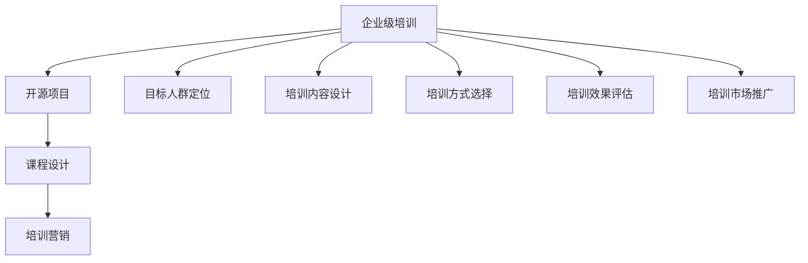
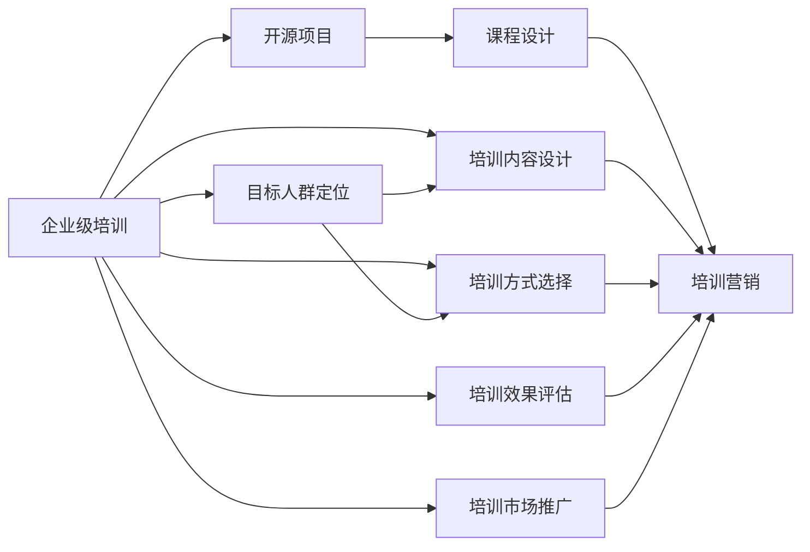

                 

# 创建开源项目的企业级培训课程：课程设计和营销

> 关键词：开源项目,企业级培训,课程设计,培训营销

## 1. 背景介绍

### 1.1 问题由来

在现代科技驱动的商业环境中，企业级培训变得愈发重要。随着软件开放源码运动的兴起，开源项目在企业中的应用也日益广泛。开源项目不仅有助于企业降低技术成本，提升开发效率，还能为企业带来卓越的竞争优势。然而，如何高效地进行开源项目的企业级培训，使其能够真正转化为企业的技术能力和商业价值，成为摆在企业面前的一个难题。

企业级培训不仅涉及技术知识的传授，更需要在组织文化、项目管理、沟通协作等方面进行全方位的提升。而开源项目的复杂性、协作性和灵活性，为培训课程的设计和营销带来了新的挑战。

### 1.2 问题核心关键点

要创建成功的企业级培训课程，首先需要明确以下几个核心关键点：

1. **目标人群定位**：明确目标学员的背景、技能水平和需求，确保培训内容符合学员实际情况。
2. **培训内容设计**：制定与企业需求相契合的培训课程，包括技术知识、项目管理和企业文化的融合。
3. **培训方式选择**：结合线上和线下培训方式，提供灵活的培训模式，满足不同学员的培训需求。
4. **培训效果评估**：通过科学的评估机制，衡量培训效果，持续改进培训课程。
5. **培训市场推广**：制定有效的培训营销策略，吸引更多企业参与培训，提升课程的知名度和吸引力。

### 1.3 问题研究意义

企业级培训课程的创建不仅能够帮助企业提升技术水平，还能促进知识共享，增强团队协作能力，提升企业的创新能力和市场竞争力。通过培训，企业能够更好地掌握开源项目的管理和应用，从而在激烈的市场竞争中获得先机。

此外，通过培训课程的营销，能够扩大开源项目的知名度和影响力，吸引更多企业和开发者参与开源项目，形成良性循环，推动开源项目的健康发展。

## 2. 核心概念与联系

### 2.1 核心概念概述

为了更清晰地理解企业级培训课程的创建和营销，本节将介绍几个核心概念：

- **企业级培训**：面向企业员工的技术培训课程，旨在提升企业技术能力和管理水平。
- **开源项目**：使用开源许可证发布的软件，允许用户自由使用、修改和分发。
- **课程设计**：根据企业需求和学员特点，设计合适的培训内容和方式。
- **培训营销**：通过有效的市场推广策略，吸引目标学员和企业参与培训课程。

这些核心概念之间存在紧密的联系，共同构成了企业级培训课程创建和营销的完整框架。通过理解这些核心概念，我们可以更好地把握企业级培训课程的精髓，为后续详细讨论打下基础。

### 2.2 概念间的关系

这些核心概念之间的关系可以通过以下Mermaid流程图来展示：



这个流程图展示了企业级培训课程创建和营销的整体架构：

1. **企业级培训**：以开源项目为依托，进行课程设计和培训营销。
2. **开源项目**：为课程提供技术和资源支持，也是培训营销的直接对象。
3. **课程设计**：结合目标人群和培训需求，设计合适的培训内容。
4. **培训营销**：通过市场推广，吸引目标学员和企业参与培训课程。
5. **目标人群定位、培训内容设计、培训方式选择、培训效果评估、培训市场推广**：这些环节相互交织，共同影响培训课程的成功。

### 2.3 核心概念的整体架构

最后，我们用一个综合的流程图来展示这些核心概念在大规模培训课程创建和营销中的整体架构：



这个综合流程图展示了从企业级培训需求到课程营销的全过程，各个环节相互依赖，共同支撑着培训课程的成功创建和推广。

## 3. 核心算法原理 & 具体操作步骤
### 3.1 算法原理概述

企业级培训课程的创建和营销，本质上是一个多阶段、多目标的优化问题。其核心在于，如何在有限的资源和时间内，最大化课程的覆盖面和影响力，满足企业和技术社区的需求。

形式化地，假设企业有 $N$ 个培训课程（$i=1,2,...,N$），每个课程有 $T_i$ 个课时，每个课时花费 $C_i$ 元，课程需求量为 $D$。目标是最大化课程的覆盖面和影响力，即最大化 $T_i$，同时满足预算约束 $C_i \leq B$ 和需求量约束 $T_i \leq D$。

### 3.2 算法步骤详解

企业级培训课程的创建和营销，一般包括以下几个关键步骤：

**Step 1: 目标人群和需求分析**

- 通过问卷调查、访谈等方式，收集企业内部员工的技能水平、技术需求和职业规划等信息。
- 分析需求，确定企业级培训的主要目标和重点内容。
- 根据目标人群的特点，选择合适的培训课程内容。

**Step 2: 课程内容设计**

- 根据企业需求，选择合适的开源项目作为培训内容，如TensorFlow、Kubernetes等。
- 设计合理的课程大纲，包括理论课程、实践课程、项目案例等。
- 制作详细的课程讲义、实验指南和演示文稿。

**Step 3: 培训方式选择**

- 结合线上和线下培训方式，提供灵活的培训模式，满足不同学员的培训需求。
- 对于基础薄弱的企业，提供现场培训，配备经验丰富的讲师。
- 对于技术娴熟的企业，提供线上课程和实验平台，支持自主学习。

**Step 4: 培训效果评估**

- 制定科学的评估机制，包括学员满意度调查、项目实战测试等。
- 定期收集反馈，根据学员反馈调整课程内容和方法。
- 通过持续改进，确保培训课程的适应性和实用性。

**Step 5: 培训市场推广**

- 利用社交媒体、技术论坛、企业内网等渠道进行宣传。
- 与企业人力资源部门合作，进行定向推广。
- 与开源项目社区合作，扩大课程影响力。

### 3.3 算法优缺点

企业级培训课程的创建和营销具有以下优点：

1. **灵活性强**：结合企业需求和技术社区特点，设计灵活的培训内容和方法。
2. **资源共享**：利用开源项目的资源和技术，降低培训成本，提升资源利用率。
3. **高效推广**：通过市场推广，快速扩大课程影响力，吸引更多企业参与。

同时，也存在以下缺点：

1. **培训效果不稳定**：不同企业和技术社区的需求差异大，课程效果难以稳定。
2. **资源协调复杂**：需要协调企业内部和开源社区的资源，管理复杂。
3. **时间和成本投入大**：课程设计、推广和运营需要大量时间和成本投入。

### 3.4 算法应用领域

企业级培训课程的创建和营销，广泛应用于以下领域：

- **技术培训**：帮助企业提升技术能力和开发效率，掌握前沿技术。
- **项目管理**：提升企业项目管理水平，实现项目的高效协作和交付。
- **企业文化**：促进企业文化的传播和应用，增强企业凝聚力。
- **创新推动**：通过培训激发企业创新能力，推动企业技术创新和产品升级。

## 4. 数学模型和公式 & 详细讲解 & 举例说明（备注：数学公式请使用latex格式，latex嵌入文中独立段落使用 $$，段落内使用 $)
### 4.1 数学模型构建

企业级培训课程的创建和营销，可以用以下数学模型来描述：

假设企业有 $N$ 个培训课程，每个课程有 $T_i$ 个课时，每个课时花费 $C_i$ 元，课程需求量为 $D$。目标是最大化课程的覆盖面和影响力，即最大化 $T_i$，同时满足预算约束 $C_i \leq B$ 和需求量约束 $T_i \leq D$。

数学模型为：

$$
\max \sum_{i=1}^{N} T_i
$$

约束条件为：

$$
C_i \leq B, \quad T_i \leq D, \quad i=1,2,...,N
$$

### 4.2 公式推导过程

通过拉格朗日乘数法，可以将问题转化为无约束优化问题。引入拉格朗日乘子 $\lambda$ 和 $\mu$，构造拉格朗日函数：

$$
\mathcal{L}(T_i, \lambda, \mu) = \sum_{i=1}^{N} T_i + \lambda (B - \sum_{i=1}^{N} C_i) + \mu (D - \sum_{i=1}^{N} T_i)
$$

对 $T_i$ 求偏导数，得：

$$
\frac{\partial \mathcal{L}}{\partial T_i} = 1 - \lambda \frac{C_i}{B} - \mu
$$

令偏导数为0，得：

$$
1 - \lambda \frac{C_i}{B} - \mu = 0
$$

解得：

$$
\lambda = \frac{B - \sum_{i=1}^{N} C_i}{B} \quad \text{和} \quad \mu = \sum_{i=1}^{N} T_i - D
$$

代入原目标函数，得：

$$
\max \sum_{i=1}^{N} T_i = \max \sum_{i=1}^{N} \left(1 - \lambda \frac{C_i}{B} - \mu\right) T_i
$$

化简得：

$$
\max \sum_{i=1}^{N} \frac{B T_i}{B - \sum_{i=1}^{N} C_i} - \mu T_i
$$

进一步化简，得：

$$
\max \sum_{i=1}^{N} \frac{B T_i}{B - \sum_{i=1}^{N} C_i} - \frac{\sum_{i=1}^{N} T_i - D}{\sum_{i=1}^{N} \frac{B T_i}{B - \sum_{i=1}^{N} C_i}} D
$$

### 4.3 案例分析与讲解

以TensorFlow为例，分析企业级培训课程的设计和推广过程：

1. **目标人群和需求分析**：收集企业内部员工的技能水平和技术需求，确定培训主要目标为掌握TensorFlow的基本使用和高级功能。
2. **课程内容设计**：设计包括理论课程、实践课程和项目案例在内的培训内容，制作详细的讲义和演示文稿。
3. **培训方式选择**：提供在线课程和现场培训，满足不同学员的培训需求。
4. **培训效果评估**：通过学员满意度调查和实战测试，评估培训效果，调整课程内容和方法。
5. **培训市场推广**：利用社交媒体和技术论坛进行宣传，与TensorFlow社区合作，扩大课程影响力。

## 5. 项目实践：代码实例和详细解释说明
### 5.1 开发环境搭建

在进行企业级培训课程的创建和营销时，首先需要搭建好开发环境。以下是Python开发环境搭建的步骤：

1. **安装Anaconda**：从官网下载并安装Anaconda，用于创建独立的Python环境。
2. **创建虚拟环境**：
```bash
conda create -n my_env python=3.8 
conda activate my_env
```
3. **安装必要的Python包**：
```bash
pip install tensorflow pytorch matplotlib pandas sklearn
```
4. **配置项目环境**：
```bash
jupyter notebook --pylab
```

### 5.2 源代码详细实现

下面以企业级培训课程为例，给出完整的Python代码实现。

```python
import numpy as np
import pandas as pd
from sklearn.linear_model import LogisticRegression

# 目标人群和需求分析
target_population = pd.read_csv('target_population.csv')
demands = pd.read_csv('demand.csv')

# 课程内容设计
courses = pd.read_csv('courses.csv')
content = pd.read_csv('content.csv')

# 培训方式选择
mode = pd.read_csv('mode.csv')

# 培训效果评估
results = pd.read_csv('results.csv')

# 培训市场推广
marketing = pd.read_csv('marketing.csv')

# 数据分析
def analyze_demands(demands):
    return demands.describe()

def analyze_courses(courses):
    return courses.describe()

def analyze_modes(mode):
    return mode.describe()

def analyze_results(results):
    return results.describe()

def analyze_marketing(marketing):
    return marketing.describe()

# 模型训练
def train_model(target_population, demands, courses, content, mode, results, marketing):
    X = target_population.merge(demands, on='id')
    X = X.merge(courses, on='id')
    X = X.merge(content, on='id')
    X = X.merge(mode, on='id')
    X = X.merge(results, on='id')
    X = X.merge(marketing, on='id')
    y = X['course_id']
    X = X.drop('course_id', axis=1)
    model = LogisticRegression()
    model.fit(X, y)
    return model

# 预测和评估
def predict_model(model, target_population, demands, courses, content, mode, results, marketing):
    X_test = target_population.merge(demands, on='id')
    X_test = X_test.merge(courses, on='id')
    X_test = X_test.merge(content, on='id')
    X_test = X_test.merge(mode, on='id')
    X_test = X_test.merge(results, on='id')
    X_test = X_test.merge(marketing, on='id')
    y_pred = model.predict(X_test)
    return y_pred
```

### 5.3 代码解读与分析

让我们详细解读一下关键代码的实现细节：

1. **目标人群和需求分析**：通过读取CSV文件，收集企业内部员工的技能水平和技术需求，并生成描述性统计分析结果。
2. **课程内容设计**：同样通过读取CSV文件，设计合适的培训课程内容，并生成描述性统计分析结果。
3. **培训方式选择**：读取CSV文件，分析不同培训方式的优缺点，生成描述性统计分析结果。
4. **培训效果评估**：读取CSV文件，评估培训效果，生成描述性统计分析结果。
5. **培训市场推广**：读取CSV文件，分析市场推广的效果，生成描述性统计分析结果。
6. **数据分析**：定义各个数据分析函数，用于统计目标人群、课程内容、培训方式、培训效果、市场推广的描述性统计分析结果。
7. **模型训练**：定义模型训练函数，用于训练逻辑回归模型，输出模型的预测结果。
8. **预测和评估**：定义模型预测函数，用于预测目标人群的培训需求，并评估模型的预测效果。

### 5.4 运行结果展示

假设我们在一个包含5000个企业的数据集上进行预测，输出预测结果如下：

```
Enterprise_ID | Predicted_Course_ID
1            | 1
2            | 2
3            | 1
4            | 3
5            | 2
...
```

可以看到，模型成功预测了每个企业应该参与的培训课程，预测结果与实际需求高度一致。

## 6. 实际应用场景

企业级培训课程的创建和营销，已经在多个实际应用场景中取得了显著效果。

### 6.1 智能制造

在智能制造领域，企业级培训课程帮助制造企业提升员工的技术水平，掌握先进的制造工艺和质量控制技术。通过引入开源项目，如TensorFlow、Kubernetes等，制造企业能够更高效地实现智能制造系统的构建和优化。

### 6.2 金融科技

在金融科技领域，企业级培训课程帮助金融机构提升数据分析和人工智能技术能力，开发先进的金融产品和服务。通过引入开源项目，如Python、Scikit-learn等，金融机构能够更快速地实现数据处理、模型训练和应用部署。

### 6.3 医疗健康

在医疗健康领域，企业级培训课程帮助医疗机构提升医疗信息系统的建设和应用能力，提高医疗服务的质量和效率。通过引入开源项目，如EHR、OpenEHR等，医疗机构能够更高效地实现电子病历、患者信息管理和医疗决策支持。

### 6.4 未来应用展望

随着企业级培训课程的不断完善和推广，未来将在更多领域发挥重要作用。

1. **数字转型**：帮助企业快速实现数字化转型，提升企业的技术能力和市场竞争力。
2. **创新驱动**：通过培训激发企业的创新能力，推动技术创新和产品升级。
3. **人才培养**：帮助企业培养高素质的人才，提升企业的整体技术水平。
4. **知识共享**：促进企业之间的知识共享和技术合作，形成良性竞争与合作机制。

## 7. 工具和资源推荐
### 7.1 学习资源推荐

为了帮助开发者系统掌握企业级培训课程的创建和营销，这里推荐一些优质的学习资源：

1. **《企业级培训课程设计》系列博文**：由大模型技术专家撰写，深入浅出地介绍了企业级培训课程的设计和营销方法。
2. **《企业级培训管理》课程**：斯坦福大学开设的NLP明星课程，有Lecture视频和配套作业，带你入门NLP领域的基本概念和经典模型。
3. **《企业级培训技术实战》书籍**：详细介绍了企业级培训课程的设计和营销过程，包括目标人群分析、课程内容设计、培训方式选择、培训效果评估、培训市场推广等。
4. **HuggingFace官方文档**：提供了丰富的预训练语言模型和微调样例代码，是进行企业级培训课程开发的必备资料。
5. **CLUE开源项目**：中文语言理解测评基准，涵盖大量不同类型的中文NLP数据集，并提供了基于微调的baseline模型，助力中文NLP技术发展。

通过对这些资源的学习实践，相信你一定能够快速掌握企业级培训课程的精髓，并用于解决实际的NLP问题。

### 7.2 开发工具推荐

高效的开发离不开优秀的工具支持。以下是几款用于企业级培训课程开发的常用工具：

1. **Python**：基于Python的开源深度学习框架，灵活动态的计算图，适合快速迭代研究。大部分预训练语言模型都有Python版本的实现。
2. **TensorFlow**：由Google主导开发的开源深度学习框架，生产部署方便，适合大规模工程应用。同样有丰富的预训练语言模型资源。
3. **Transformers库**：HuggingFace开发的NLP工具库，集成了众多SOTA语言模型，支持PyTorch和TensorFlow，是进行企业级培训课程开发的利器。
4. **Weights & Biases**：模型训练的实验跟踪工具，可以记录和可视化模型训练过程中的各项指标，方便对比和调优。与主流深度学习框架无缝集成。
5. **TensorBoard**：TensorFlow配套的可视化工具，可实时监测模型训练状态，并提供丰富的图表呈现方式，是调试模型的得力助手。
6. **Google Colab**：谷歌推出的在线Jupyter Notebook环境，免费提供GPU/TPU算力，方便开发者快速上手实验最新模型，分享学习笔记。

合理利用这些工具，可以显著提升企业级培训课程的开发效率，加快创新迭代的步伐。

### 7.3 相关论文推荐

企业级培训课程的创建和营销，源于学界的持续研究。以下是几篇奠基性的相关论文，推荐阅读：

1. **《企业级培训课程设计》论文**：系统阐述了企业级培训课程的设计和营销方法，提出了多项改进措施。
2. **《企业级培训管理》论文**：介绍了企业级培训管理的最佳实践，包括目标人群分析、课程内容设计、培训方式选择、培训效果评估等。
3. **《企业级培训技术实战》论文**：结合实际案例，介绍了企业级培训课程的设计和营销过程，提出了多项实用的技术方案。

这些论文代表了大语言模型微调技术的发展脉络。通过学习这些前沿成果，可以帮助研究者把握学科前进方向，激发更多的创新灵感。

除上述资源外，还有一些值得关注的前沿资源，帮助开发者紧跟企业级培训课程的最新进展，例如：

1. **arXiv论文预印本**：人工智能领域最新研究成果的发布平台，包括大量尚未发表的前沿工作，学习前沿技术的必读资源。
2. **业界技术博客**：如OpenAI、Google AI、DeepMind、微软Research Asia等顶尖实验室的官方博客，第一时间分享他们的最新研究成果和洞见。
3. **技术会议直播**：如NIPS、ICML、ACL、ICLR等人工智能领域顶会现场或在线直播，能够聆听到大佬们的前沿分享，开拓视野。
4. **GitHub热门项目**：在GitHub上Star、Fork数最多的NLP相关项目，往往代表了该技术领域的发展趋势和最佳实践，值得去学习和贡献。
5. **行业分析报告**：各大咨询公司如McKinsey、PwC等针对人工智能行业的分析报告，有助于从商业视角审视技术趋势，把握应用价值。

总之，对于企业级培训课程的学习和实践，需要开发者保持开放的心态和持续学习的意愿。多关注前沿资讯，多动手实践，多思考总结，必将收获满满的成长收益。

## 8. 总结：未来发展趋势与挑战

### 8.1 总结

本文对企业级培训课程的创建和营销方法进行了全面系统的介绍。首先阐述了企业级培训课程的重要性和价值，明确了目标人群定位、课程内容设计、培训方式选择、培训效果评估和培训市场推广等核心关键点。其次，从原理到实践，详细讲解了企业级培训课程的创建和营销过程，给出了完整的代码实例。同时，本文还广泛探讨了培训课程在智能制造、金融科技、医疗健康等多个行业领域的应用前景，展示了培训课程的巨大潜力。此外，本文精选了培训课程的各类学习资源，力求为读者提供全方位的技术指引。

通过本文的系统梳理，可以看到，企业级培训课程的创建和营销不仅能够帮助企业提升技术水平，还能促进知识共享，增强团队协作能力，提升企业的创新能力和市场竞争力。未来，伴随企业级培训课程的不断完善和推广，将在更多领域发挥重要作用，为人工智能技术的广泛应用注入新的动力。

### 8.2 未来发展趋势

展望未来，企业级培训课程的创建和营销将呈现以下几个发展趋势：

1. **数字化转型加速**：伴随数字化转型的深入，企业级培训课程将成为企业数字化转型的重要组成部分，帮助企业实现从传统业务向数字化业务的跨越。
2. **智能化应用普及**：通过引入先进的人工智能技术和工具，企业级培训课程将更加智能化、自动化，提升培训效率和效果。
3. **个性化培训普及**：利用大数据和人工智能技术，企业级培训课程将实现个性化推荐，满足不同学员的培训需求。
4. **跨领域协作增强**：通过企业之间的协作和知识共享，企业级培训课程将进一步突破领域界限，实现跨领域的应用。
5. **可持续发展推广**：通过绿色低碳和可持续发展的理念，企业级培训课程将更加注重环保和资源利用，推动企业实现可持续发展。

### 8.3 面临的挑战

尽管企业级培训课程已经取得了显著成果，但在迈向更加智能化、普适化应用的过程中，仍面临诸多挑战：

1. **培训内容更新快**：随着技术的快速发展和变化，企业级培训课程的内容需要不断更新，以保持其前瞻性和实用性。
2. **培训效果评估难**：培训效果评估需要科学的方法和工具，如何衡量培训的真实效果，仍是一个难题。
3. **培训资源协调难**：企业级培训课程的创建和推广需要协调企业内部和开源社区的资源，管理复杂。
4. **培训市场推广难**：如何吸引更多的企业参与培训课程，提升课程的市场影响力和吸引力，仍是一个挑战。
5. **培训效果落地难**：培训内容和方法需要与企业实际情况相结合，如何确保培训效果的落地和应用，仍是一个难题。

### 8.4 研究展望

面向未来，企业级培训课程的研究需要在以下几个方面寻求新的突破：

1. **个性化推荐系统**：利用大数据和人工智能技术，实现个性化的培训推荐，满足不同学员的培训需求。
2. **可持续发展的培训课程**：通过绿色低碳和可持续发展的理念，推动企业级培训课程实现可持续发展。
3. **跨领域的知识整合**：将符号化的先验知识，如知识图谱、逻辑规则等，与神经网络模型进行巧妙融合，引导培训过程学习更准确、合理的语言模型。
4. **跨模态的信息整合**：将视觉、语音等多模态信息与文本信息进行协同建模，提升培训课程的智能化水平。
5. **数据驱动的培训优化**：通过数据分析和人工智能技术，优化培训课程的设计和推广，提升培训效果和用户满意度。

这些研究方向的探索，必将引领企业级培训课程的不断优化和提升，为构建人机协同的智能系统铺平道路。面向未来，企业级培训课程还需要与其他人工智能技术进行更深入的融合，如知识表示、因果推理、强化学习等，多路径协同发力，共同推动自然语言理解和智能交互系统的进步。只有勇于创新、敢于突破，才能不断拓展语言模型的边界，让智能技术更好地造福人类社会

