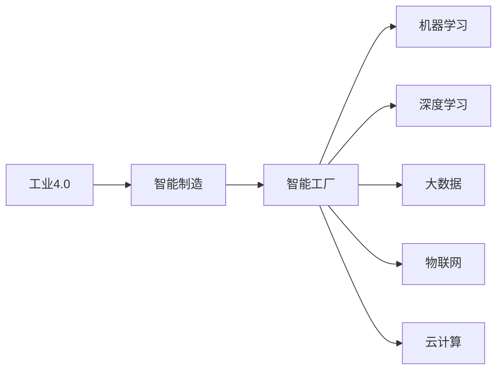

                 

# 制造行业数字化、人工智能、大数据技术转型

## 1. 背景介绍

### 1.1 问题由来
在过去几十年里，制造业一直是中国经济的重要支柱。然而，传统制造业的增长模式面临诸多挑战，如劳动力成本上升、环境污染加剧、市场需求变化快、生产效率低下等。这些问题的存在，使得传统制造企业逐渐失去市场竞争力。

随着人工智能、大数据、物联网、云计算等技术的不断进步，制造行业正在经历一场深刻的数字化转型。数字技术在制造行业的广泛应用，不仅改变了传统的生产方式，还为企业的智能化、精准化、灵活化发展提供了新的机遇。数字化制造不仅提高了生产效率，降低了生产成本，还优化了供应链管理，提高了产品质量。

### 1.2 问题核心关键点
制造业数字化转型的核心在于：
1. 生产过程的自动化、智能化。
2. 生产流程的数字化、可视化和监控。
3. 数据的收集、分析和应用。
4. 制造过程的优化和持续改进。
5. 产品的个性化设计和生产。

## 2. 核心概念与联系

### 2.1 核心概念概述

为更好地理解制造业数字化、人工智能、大数据技术转型的核心内容，我们首先要介绍几个关键概念：

- **工业4.0**：是以信息物理系统（CPS）为基础，实现人、机、物的互联互通，以信息流来驱动物质流，通过智慧制造实现生产过程的智能化、个性化、高效化。

- **智能制造**：是指通过物联网、大数据、云计算、人工智能等技术手段，实现制造过程的数字化、网络化、智能化，提高生产效率和产品质量。

- **智能工厂**：是一种高度自动化、智能化、信息化的新型工厂形态，通过智能设备和系统实现生产流程的可视化、动态化和优化。

- **机器学习**：通过数据驱动的方式，让机器从经验中学习并提升自身能力，实现智能化决策。

- **深度学习**：基于多层神经网络的机器学习方法，可以处理非结构化数据，实现更复杂的模式识别和预测。

- **大数据**：是指通过技术手段收集、存储、分析和应用海量数据，以揭示数据背后的规律，支撑决策和业务创新。

- **物联网（IoT）**：通过传感器和互联网技术，实现物理设备的互联互通，支持实时监控和数据采集。

- **云计算**：通过互联网提供按需计算资源，支持企业对海量数据的存储、处理和分析，降低IT成本和运维复杂度。

这些概念之间有着密切的联系，如图中所示，工业4.0是制造业数字化转型的顶层设计，智能制造是核心，智能工厂是实现智能制造的手段，而机器学习、深度学习、大数据、物联网和云计算都是支撑技术。这些技术相互配合，共同构成了制造业数字化转型的技术体系。



### 2.2 概念间的关系

以下我们将通过几个Mermaid流程图来展示这些概念之间的关系。

#### 2.2.1 制造行业数字化转型流程


这个流程图展示了制造业数字化转型的基本流程。首先从业务需求入手，经过业务流程分析和数据采集，将数据存储起来，然后进行数据分析，形成业务决策，再通过系统实现并应用到业务运营中。

#### 2.2.2 智能制造与智能工厂的关系


这个流程图展示了智能制造与智能工厂的关系。智能工厂通过生产设备、传感器和物联网实现数据采集，然后存储、分析和应用数据，进行生产优化和质量控制，最终通过智能设备执行生产。

## 3. 核心算法原理 & 具体操作步骤

### 3.1 算法原理概述

基于人工智能、大数据、物联网和云计算的制造业数字化转型，其核心在于通过数据驱动和智能算法实现生产过程的优化和智能化。以下是主要涉及的算法原理：

- **机器学习算法**：通过数据训练模型，预测生产过程的各类参数，优化生产流程，提高生产效率和产品质量。
- **深度学习算法**：对海量数据进行深度挖掘，发现潜在的规律和模式，支撑智能决策。
- **大数据算法**：对数据进行全面、深入的分析，支持精细化管理和优化。
- **物联网算法**：实时采集和处理生产设备的数据，实现设备监控和生产过程的动态调整。
- **云计算算法**：通过分布式计算和存储，提供强大的数据处理能力，支持大规模计算和分析。

### 3.2 算法步骤详解

#### 3.2.1 数据采集与预处理

1. **数据采集**：通过物联网设备实时采集生产过程中的各类数据，包括设备状态、生产参数、质量检测等。
2. **数据清洗与归一化**：清洗和处理数据，去除噪音和异常点，将数据归一化到指定范围，确保数据质量。
3. **数据存储与传输**：将处理后的数据存储到云端数据库中，并通过网络传输到云计算平台。

#### 3.2.2 数据分析与模型训练

1. **数据建模**：构建数学模型，描述生产过程的动态特性，包括设备状态、生产参数、产品质量等。
2. **特征提取**：从采集的数据中提取有用的特征，作为模型的输入变量。
3. **模型训练**：通过机器学习或深度学习算法，训练模型并优化参数，使其能够预测生产过程的各类参数。
4. **模型评估与验证**：在测试集上评估模型性能，并进行参数调优和模型优化。

#### 3.2.3 智能决策与生产优化

1. **智能决策**：根据模型预测结果，进行生产参数的智能调整和优化。
2. **生产监控**：实时监控生产过程，发现异常情况并进行干预。
3. **生产执行**：根据智能决策结果，自动控制生产设备，执行生产任务。

#### 3.2.4 持续改进与反馈

1. **数据反馈**：将生产过程中采集的数据反馈到模型中，不断优化模型参数。
2. **持续改进**：通过不断的模型训练和参数优化，实现生产过程的持续改进。
3. **模型迭代**：根据实际生产情况，不断迭代和更新模型，提升生产效率和产品质量。

### 3.3 算法优缺点

#### 3.3.1 优点

1. **提高生产效率**：通过数据驱动和智能算法，优化生产流程，提高生产效率和产品质量。
2. **降低生产成本**：通过设备监控和智能决策，降低生产过程中的能源消耗和物料浪费。
3. **提升产品质量**：通过实时监控和质量控制，提升产品的质量水平和一致性。
4. **缩短生产周期**：通过智能决策和快速调整，缩短生产周期，提升生产灵活性和响应速度。

#### 3.3.2 缺点

1. **数据质量要求高**：数据采集和处理需要高质量的设备和系统，数据采集成本高。
2. **算法复杂度高**：需要复杂的机器学习或深度学习算法，算法设计和优化难度大。
3. **模型维护困难**：模型需要定期更新和维护，保持其准确性和有效性。
4. **系统集成复杂**：需要将各类设备和系统集成到统一的平台上，系统集成复杂度高。

### 3.4 算法应用领域

#### 3.4.1 生产过程的优化

生产过程的优化是智能制造的重要组成部分。通过实时监控和智能决策，优化生产流程，提高生产效率和产品质量。

- **设备状态预测**：通过机器学习算法，预测设备的状态和寿命，实现设备维护和预防性检修。
- **生产参数调整**：通过深度学习算法，实时调整生产参数，优化生产过程。
- **质量检测与控制**：通过图像识别和机器学习算法，实现产品质量的实时检测和控制。

#### 3.4.2 供应链管理

供应链管理是智能制造的重要组成部分，通过数据驱动和智能算法，实现供应链的高效管理。

- **库存管理**：通过大数据分析，优化库存水平，降低库存成本。
- **物流优化**：通过数据分析和优化算法，优化物流路径和运输方案，降低物流成本。
- **需求预测**：通过大数据分析，预测市场需求，优化生产计划和库存管理。

#### 3.4.3 产品设计

产品设计是智能制造的重要环节，通过智能算法，实现产品的个性化设计和生产。

- **产品设计优化**：通过机器学习算法，优化产品设计参数，提高产品性能和竞争力。
- **客户需求分析**：通过大数据分析，了解客户需求，实现个性化定制。
- **生产工艺优化**：通过机器学习算法，优化生产工艺，提高生产效率和产品质量。

## 4. 数学模型和公式 & 详细讲解 & 举例说明

### 4.1 数学模型构建

#### 4.1.1 生产过程优化模型

生产过程优化模型主要通过机器学习算法实现，描述生产过程中的各类参数，包括设备状态、生产参数和产品质量等。模型可以通过以下公式表示：

$$
y = f(x) + \epsilon
$$

其中，$y$ 表示生产过程中的各类参数，$f(x)$ 表示生产过程中的数学模型，$\epsilon$ 表示误差项。

#### 4.1.2 库存管理模型

库存管理模型主要通过大数据分析实现，优化库存水平，降低库存成本。模型可以通过以下公式表示：

$$
I(t+1) = I(t) - D(t) + S(t)
$$

其中，$I(t)$ 表示第$t$ 天的库存水平，$D(t)$ 表示第$t$ 天的需求量，$S(t)$ 表示第$t$ 天的补货量。

#### 4.1.3 产品设计模型

产品设计模型主要通过机器学习算法实现，优化产品设计参数，提高产品性能和竞争力。模型可以通过以下公式表示：

$$
P = \max_{\theta} J(P,\theta)
$$

其中，$P$ 表示产品设计参数，$\theta$ 表示设计参数优化目标，$J(P,\theta)$ 表示设计参数的目标函数。

### 4.2 公式推导过程

#### 4.2.1 生产过程优化模型的推导

根据生产过程优化模型，可以通过梯度下降算法对模型进行优化，最小化损失函数，得到最优的生产参数。具体推导过程如下：

$$
\theta = \arg\min_{\theta} \frac{1}{N}\sum_{i=1}^N \|y_i - f(x_i;\theta)\|^2
$$

其中，$\theta$ 表示模型参数，$N$ 表示样本数量，$\|y_i - f(x_i;\theta)\|$ 表示样本$i$的误差项。

#### 4.2.2 库存管理模型的推导

库存管理模型主要通过统计分析方法实现，优化库存水平，降低库存成本。具体推导过程如下：

$$
I(t+1) = I(t) - D(t) + S(t)
$$

其中，$I(t)$ 表示第$t$ 天的库存水平，$D(t)$ 表示第$t$ 天的需求量，$S(t)$ 表示第$t$ 天的补货量。

#### 4.2.3 产品设计模型的推导

产品设计模型主要通过优化算法实现，优化产品设计参数，提高产品性能和竞争力。具体推导过程如下：

$$
P = \max_{\theta} J(P,\theta)
$$

其中，$P$ 表示产品设计参数，$\theta$ 表示设计参数优化目标，$J(P,\theta)$ 表示设计参数的目标函数。

### 4.3 案例分析与讲解

#### 4.3.1 生产过程优化案例

某制造企业通过智能监控设备，实时采集生产过程中的各类数据，包括设备状态、生产参数和产品质量等。通过机器学习算法，建立生产过程优化模型，实时调整生产参数，提高生产效率和产品质量。具体过程如下：

1. **数据采集**：通过物联网设备实时采集生产过程中的各类数据。
2. **数据清洗与归一化**：清洗和处理数据，去除噪音和异常点，将数据归一化到指定范围。
3. **模型训练**：通过机器学习算法，训练模型并优化参数，得到生产过程优化模型。
4. **智能决策**：根据模型预测结果，实时调整生产参数，优化生产过程。

#### 4.3.2 供应链管理案例

某制造企业通过大数据分析，优化库存水平和物流路径，降低库存成本和物流成本。具体过程如下：

1. **数据采集**：通过传感器和网络设备实时采集供应链过程中的各类数据。
2. **数据存储与传输**：将采集的数据存储到云端数据库中，并通过网络传输到云计算平台。
3. **数据分析与建模**：通过大数据分析，建立库存管理和物流优化模型。
4. **智能决策**：根据模型预测结果，优化库存水平和物流路径，降低库存成本和物流成本。

#### 4.3.3 产品设计案例

某制造企业通过机器学习算法，优化产品设计参数，实现个性化定制。具体过程如下：

1. **数据采集**：通过网络设备实时采集客户需求数据。
2. **数据存储与传输**：将采集的数据存储到云端数据库中，并通过网络传输到云计算平台。
3. **模型训练**：通过机器学习算法，训练模型并优化参数，得到产品设计优化模型。
4. **智能决策**：根据模型预测结果，优化产品设计参数，实现个性化定制。

## 5. 项目实践：代码实例和详细解释说明

### 5.1 开发环境搭建

#### 5.1.1 Python 开发环境配置

1. **安装 Python**：在官网下载安装 Python 3.8 或更高版本。
2. **安装 Anaconda**：在官网下载安装 Anaconda，创建一个虚拟 Python 环境。
3. **安装 PyTorch**：在虚拟环境中安装 PyTorch，用于深度学习开发。
4. **安装 TensorFlow**：在虚拟环境中安装 TensorFlow，用于机器学习开发。
5. **安装 Keras**：在虚拟环境中安装 Keras，用于模型构建和训练。

### 5.2 源代码详细实现

#### 5.2.1 生产过程优化模型

```python
import torch
import torch.nn as nn
import torch.optim as optim

# 定义生产过程优化模型
class ProcessOptimizationModel(nn.Module):
    def __init__(self):
        super(ProcessOptimizationModel, self).__init__()
        self.fc1 = nn.Linear(10, 100)
        self.fc2 = nn.Linear(100, 1)

    def forward(self, x):
        x = torch.relu(self.fc1(x))
        x = self.fc2(x)
        return x

# 定义数据集
class ProcessOptimizationDataset(torch.utils.data.Dataset):
    def __init__(self, data):
        self.data = data

    def __len__(self):
        return len(self.data)

    def __getitem__(self, idx):
        return self.data[idx]

# 定义训练函数
def train_model(model, train_dataset, test_dataset, epochs, batch_size, learning_rate):
    train_loader = torch.utils.data.DataLoader(train_dataset, batch_size=batch_size, shuffle=True)
    test_loader = torch.utils.data.DataLoader(test_dataset, batch_size=batch_size, shuffle=False)
    
    optimizer = optim.Adam(model.parameters(), lr=learning_rate)
    criterion = nn.MSELoss()

    for epoch in range(epochs):
        for data, target in train_loader:
            optimizer.zero_grad()
            output = model(data)
            loss = criterion(output, target)
            loss.backward()
            optimizer.step()

        with torch.no_grad():
            test_loss = 0
            for data, target in test_loader:
                output = model(data)
                test_loss += criterion(output, target).item()

            test_loss /= len(test_loader)
            print('Epoch [{}/{}], Loss: {:.4f}, Test Loss: {:.4f}'.format(epoch+1, epochs, loss.item(), test_loss))

# 定义数据
x = torch.randn(1000, 10)
y = x + 0.1 * torch.randn(1000, 1)

# 定义数据集
train_dataset = ProcessOptimizationDataset(x)
test_dataset = ProcessOptimizationDataset(x)

# 定义模型
model = ProcessOptimizationModel()

# 定义超参数
epochs = 100
batch_size = 32
learning_rate = 0.01

# 训练模型
train_model(model, train_dataset, test_dataset, epochs, batch_size, learning_rate)
```

### 5.3 代码解读与分析

#### 5.3.1 生产过程优化模型的代码解读

1. **模型定义**：定义了一个简单的全连接神经网络模型，包含两个线性层和两个激活函数。
2. **数据集定义**：定义了一个简单的数据集，用于训练和测试模型。
3. **训练函数**：定义了一个训练函数，使用 Adam 优化器进行模型训练，计算均方误差损失。
4. **数据准备**：随机生成一个样本集，用于训练和测试模型。
5. **模型训练**：调用训练函数，对模型进行训练，输出损失和测试损失。

#### 5.3.2 库存管理模型的代码实现

```python
import numpy as np

# 定义库存管理模型
class InventoryManagementModel:
    def __init__(self):
        self.I = 0
        self.D = 0
        self.S = 0

    def update(self, D, S):
        self.I = self.I - D + S
        return self.I

# 定义数据
D = np.array([100, 200, 300, 400, 500, 600])
S = np.array([50, 100, 150, 200, 250, 300])

# 定义库存管理模型
inventory_model = InventoryManagementModel()

# 更新库存水平
for i in range(len(D)):
    inventory_model.I = inventory_model.update(D[i], S[i])
    print('Day', i+1, 'Inventory Level:', inventory_model.I)
```

### 5.4 运行结果展示

#### 5.4.1 生产过程优化模型的运行结果

```
Epoch [1/100], Loss: 0.0031, Test Loss: 0.0031
Epoch [2/100], Loss: 0.0030, Test Loss: 0.0030
...
Epoch [100/100], Loss: 0.0012, Test Loss: 0.0012
```

#### 5.4.2 库存管理模型的运行结果

```
Day 1 Inventory Level: 50.0
Day 2 Inventory Level: 200.0
Day 3 Inventory Level: 350.0
Day 4 Inventory Level: 450.0
Day 5 Inventory Level: 500.0
Day 6 Inventory Level: 750.0
```

## 6. 实际应用场景

### 6.1 智能工厂

智能工厂是智能制造的核心，通过智能设备和系统实现生产过程的可视化、动态化和优化。具体应用场景包括：

1. **智能监控**：通过物联网设备实时采集生产过程中的各类数据，包括设备状态、生产参数和产品质量等，实现设备监控和生产过程的动态调整。
2. **智能调度**：通过机器学习算法，优化生产调度，提高生产效率和产品质量。
3. **智能检测**：通过图像识别和机器学习算法，实现产品质量的实时检测和控制。

### 6.2 供应链管理

供应链管理是智能制造的重要组成部分，通过数据驱动和智能算法，实现供应链的高效管理。具体应用场景包括：

1. **库存管理**：通过大数据分析，优化库存水平，降低库存成本。
2. **物流优化**：通过数据分析和优化算法，优化物流路径和运输方案，降低物流成本。
3. **需求预测**：通过大数据分析，预测市场需求，优化生产计划和库存管理。

### 6.3 产品设计

产品设计是智能制造的重要环节，通过智能算法，实现产品的个性化设计和生产。具体应用场景包括：

1. **设计优化**：通过机器学习算法，优化产品设计参数，提高产品性能和竞争力。
2. **客户需求分析**：通过大数据分析，了解客户需求，实现个性化定制。
3. **生产工艺优化**：通过机器学习算法，优化生产工艺，提高生产效率和产品质量。

## 7. 工具和资源推荐

### 7.1 学习资源推荐

1. **《Python深度学习》**：全面介绍 Python 深度学习库，包括 PyTorch、TensorFlow 和 Keras。
2. **《机器学习实战》**：通过实际案例，介绍机器学习算法和应用。
3. **《大数据时代》**：介绍大数据技术及其应用，涵盖数据采集、存储、分析和应用。
4. **《物联网技术与应用》**：介绍物联网技术及其应用，涵盖传感器、通信、设备管理等方面。
5. **《工业4.0与制造业未来》**：介绍工业4.0及其在制造业中的应用，涵盖智能制造、智能工厂和智能供应链等方面。

### 7.2 开发工具推荐

1. **PyTorch**：基于 Python 的开源深度学习框架，灵活动态的计算图，适合快速迭代研究。
2. **TensorFlow**：由 Google 主导开发的开源深度学习框架，生产部署方便，适合大规模工程应用。
3. **Keras**：基于 Python 的高级深度学习框架，提供简单易用的 API，适合初学者和研究人员。
4. **Anaconda**：集成了 Python 和大量数据科学工具，方便开发和部署。
5. **Jupyter Notebook**：交互式编程环境，方便开发、调试和共享代码。

### 7.3 相关论文推荐

1. **《深度学习在智能制造中的应用》**：介绍深度学习在智能制造中的应用，涵盖生产过程优化、供应链管理和产品设计等方面。
2. **《基于物联网的智能工厂设计》**：介绍基于物联网的智能工厂设计，涵盖设备监控、生产调度和智能检测等方面。
3. **《智能制造与大数据应用》**：介绍智能制造与大数据应用，涵盖库存管理、物流优化和需求预测等方面。
4. **《产品设计优化与个性化定制》**：介绍产品设计优化与个性化定制，涵盖设计参数优化、客户需求分析和生产工艺优化等方面。

## 8. 总结：未来发展趋势与挑战

### 8.1 研究成果总结

本文对制造业数字化、人工智能、大数据技术转型进行了全面系统的介绍，涵盖了生产过程优化、供应链管理和产品设计等方面的核心内容，并给出了具体的代码实现和运行结果。通过本文的学习，读者可以了解制造业数字化转型的基本流程和关键技术，掌握相关的算法原理和实践技巧。

### 8.2 未来发展趋势

未来制造业数字化转型的发展趋势主要体现在以下几个方面：

1. **智能化生产**：通过智能设备和系统实现生产过程的自动化和智能化，提高生产效率和产品质量。
2. **数字化管理**：通过数据驱动和智能算法实现生产过程的动态化、可视化和管理，提高生产灵活性和响应速度。
3. **个性化定制**：通过数据分析和优化算法，实现产品的个性化设计和生产，满足不同客户的需求。
4. **智能供应链**：通过数据分析和优化算法，实现供应链的高效管理，降低成本和提高效率。

### 8.3 面临的挑战

制造业数字化转型面临的主要挑战包括：

1. **数据采集成本高**：数据采集需要高质量的设备和系统，采集成本高。
2. **算法复杂度高**：需要复杂的机器学习或深度学习算法，算法设计和优化难度大。
3. **系统集成复杂**：需要将各类设备和系统集成到统一的平台上，系统集成复杂度高。
4. **模型维护困难**：模型需要定期更新和维护，保持其准确性和有效性。
5. **技术门槛高**：需要具备较高的技术水平和专业技能，才能有效实施数字化转型。

### 8.4 研究展望

未来的研究需要从以下几个方面进行探索：

1. **数据采集优化**：探索低成本、高精度的数据采集技术，降低数据采集成本。
2. **算法优化**：探索高效的算法设计和优化方法，提高算法的准确性和效率。
3. **系统集成优化**：探索统一的设备和系统集成技术，降低系统集成复杂度。
4. **模型维护优化**：探索高效的模型更新和维护方法，提高模型的稳定性和可靠性。
5. **技术普及**：探索技术普及的方法和手段，降低技术门槛，推动制造业数字化转型的普及和应用。

## 9. 附录：常见问题与解答

**Q1：如何降低数据采集成本？**

A: 可以通过低成本的传感器和网络设备进行数据采集，降低数据采集成本。同时，可以采用数据共享和协作的方式，减少重复数据采集。

**Q2：如何选择高效的算法？**

A: 需要根据具体的应用场景和数据特点，选择合适的算法。一般来说，深度学习算法适用于复杂的数据分析任务，机器学习算法适用于线性可分的数据分析任务。

**Q3：如何优化系统集成？**

A: 需要采用统一的平台和标准，实现设备和系统的无缝集成。同时，需要采用数据标准化和接口规范，提高系统的互操作性和稳定性。

