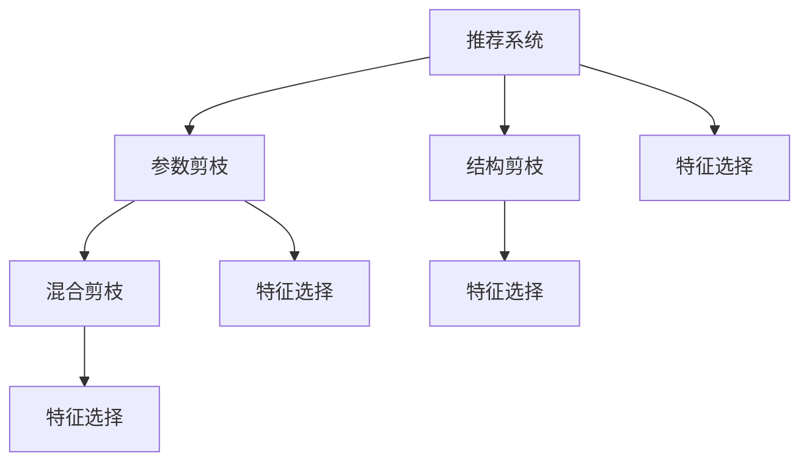

                 

## 1. 背景介绍

### 1.1 问题由来

推荐系统（Recommender System）是互联网时代极具影响力的人工智能应用之一，它通过分析用户的历史行为和偏好，为每个用户推荐可能感兴趣的内容，极大地提高了用户满意度和平台的互动率。推荐系统广泛应用于电商、音乐、视频、社交媒体等多个领域，是提升用户体验和业务价值的利器。

然而，推荐系统面临着计算资源紧张、数据维度高、模型复杂等诸多挑战。随着用户行为数据的急剧增长，推荐模型的参数量也在不断膨胀，带来了显著的计算和存储开销。面对这一挑战，剪枝（Pruning）技术应运而生，成为提升推荐系统性能和效率的重要手段。

### 1.2 问题核心关键点

剪枝技术的核心思想是在保证推荐效果的前提下，通过优化模型结构、减少模型参数，从而降低计算和存储成本，提升系统性能。其关键点在于：

- 选择合适的剪枝方法：如结构剪枝、参数剪枝、混合剪枝等。
- 设定剪枝阈值：根据实际需求和计算资源，确定剪枝比例和保留参数。
- 剪枝后的模型优化：如何调整模型参数，使得剪枝后的模型仍能保持较好的性能。

通过剪枝，推荐系统可以在保证推荐质量的前提下，大幅减少模型参数和计算量，提升系统响应速度和资源利用率。

### 1.3 问题研究意义

研究剪枝技术在推荐系统中的应用，对于提升推荐系统的性能和效率，降低计算资源消耗，具有重要意义：

- 提升推荐精度：剪枝可以去除冗余参数，避免模型过拟合，提高推荐准确度。
- 降低存储和计算成本：通过减少模型参数，大幅降低存储和计算开销。
- 加速系统响应：剪枝后的模型推理速度更快，提升用户体验。
- 促进技术落地：剪枝技术简单易行，易于在工业界推广和应用。

总之，剪枝技术是推荐系统优化不可或缺的关键手段，其应用对于实现高性能、高效率的推荐服务具有重要价值。

## 2. 核心概念与联系

### 2.1 核心概念概述

为了更好地理解剪枝技术在推荐系统中的应用，本节将介绍几个密切相关的核心概念：

- 推荐系统（Recommender System）：通过分析用户历史行为和偏好，为用户推荐可能感兴趣的内容。
- 参数剪枝（Parameter Pruning）：去除模型中的冗余参数，以减少计算和存储成本。
- 结构剪枝（Structural Pruning）：重新设计模型结构，去除不必要的层或节点，降低计算复杂度。
- 混合剪枝（Hybrid Pruning）：结合参数剪枝和结构剪枝，综合考虑模型效果和计算资源。
- 特征选择（Feature Selection）：从输入特征中筛选出重要的特征，减少输入维度，提升模型训练效率。

这些核心概念之间的逻辑关系可以通过以下Mermaid流程图来展示：



这个流程图展示了大语言模型微调过程中各个核心概念的关系和作用。

### 2.2 概念间的关系

这些核心概念之间存在着紧密的联系，形成了推荐系统优化和剪枝技术的完整生态系统。下面我们通过几个Mermaid流程图来展示这些概念之间的关系。

#### 2.2.1 推荐系统学习范式

```mermaid
graph LR
    A[推荐系统] --> B[矩阵分解]
    A --> C[协同过滤]
    A --> D[深度学习]
    B --> E[MF-MLP]
    C --> F[ALS]
    D --> G[Seq2Seq]
    E --> H[Autoencoder]
    F --> I[Neural Collaborative Filtering]
    G --> J[CNN]
    H --> K[RNN]
    I --> L[DeepFM]
    J --> M[DLFM]
    K --> N[Skip Gram]
    L --> O[WDL]
    M --> P[Graph Convolutional Network]
    N --> Q[Graph Attention Network]
    O --> R[Hierarchical Attention Network]
    P --> S[XGBoost]
    Q --> T[XGBoost]
    R --> U[XGBoost]
    S --> V[LightGBM]
    T --> W[LightGBM]
    U --> X[LightGBM]
    V --> Y[CatBoost]
    W --> Z[CatBoost]
    X --> AA[Stacking]
    Y --> AB[Stacking]
    Z --> AC[Stacking]
    AA --> AD[Embedding]
    AB --> AE[Embedding]
    AC --> AF[Embedding]
    AD --> AG[Catboost]
    AE --> AH[Catboost]
    AF --> AI[Catboost]
    AG --> AJ[XGBoost]
    AH --> AK[XGBoost]
    AI --> AL[XGBoost]
    AJ --> AM[Linear Regression]
    AK --> AN[Linear Regression]
    AL --> AO[Linear Regression]
    AM --> AP[Adaboost]
    AN --> AQ[Adaboost]
    AO --> AR[Adaboost]
    AP --> AS[Gradient Boosting]
    AQ --> AT[Gradient Boosting]
    AR --> AU[Gradient Boosting]
    AS --> AV[Gradient Boosting]
    AT --> AW[Gradient Boosting]
    AU --> AX[Gradient Boosting]
    AV --> AY[Gradient Boosting]
    AW --> AZ[Gradient Boosting]
    AX --> BA[XGBoost]
    AY --> BB[XGBoost]
    AZ --> BC[XGBoost]
    BA --> BD[Regression]
    BB --> BE[Regression]
    BC --> BF[Regression]
    BD --> BG[XGBoost]
    BE --> BH[XGBoost]
    BF --> BI[XGBoost]
    BG --> BJ[XGBoost]
    BH --> BK[XGBoost]
    BI --> BL[XGBoost]
    BJ --> BM[XGBoost]
    BK --> BN[XGBoost]
    BL --> BO[XGBoost]
    BM --> BP[XGBoost]
    BN --> BQ[XGBoost]
    BO --> BR[XGBoost]
    BP --> BS[XGBoost]
    BQ --> BT[XGBoost]
    BR --> BU[XGBoost]
    BS --> BV[XGBoost]
    BT --> BW[XGBoost]
    BU --> BX[XGBoost]
    BV --> BY[XGBoost]
    BW --> BZ[XGBoost]
    BX --> CA[XGBoost]
    BY --> CB[XGBoost]
    BZ --> CC[XGBoost]
    CA --> CD[Linear Regression]
    CB --> CE[Linear Regression]
    CC --> CF[Linear Regression]
    CD --> CG[XGBoost]
    CE --> CH[XGBoost]
    CF --> CI[XGBoost]
    CG --> CJ[XGBoost]
    CH --> CK[XGBoost]
    CI --> CL[XGBoost]
    CJ --> CM[XGBoost]
    CK --> CN[XGBoost]
    CL --> CO[XGBoost]
    CM --> CP[XGBoost]
    CN --> CQ[XGBoost]
    CO --> CR[XGBoost]
    CP --> CS[XGBoost]
    CQ --> CT[XGBoost]
    CR --> CU[XGBoost]
    CS --> CV[XGBoost]
    CT --> CW[XGBoost]
    CU --> CX[XGBoost]
    CV --> CY[XGBoost]
    CW --> CZ[XGBoost]
    CX --> DA[XGBoost]
    CY --> DB[XGBoost]
    CZ --> DC[XGBoost]
    DA --> DD[Linear Regression]
    DB --> DE[Linear Regression]
    DC --> DF[Linear Regression]
    DD --> DG[XGBoost]
    DE --> DH[XGBoost]
    DF --> DI[XGBoost]
    DG --> DJ[XGBoost]
    DH --> DK[XGBoost]
    DI --> DL[XGBoost]
    DJ --> DM[XGBoost]
    DK --> DN[XGBoost]
    DL --> DO[XGBoost]
    DM --> DP[XGBoost]
    DN --> DQ[XGBoost]
    DO --> DR[XGBoost]
    DP --> DS[XGBoost]
    DQ --> DT[XGBoost]
    DR --> DU[XGBoost]
    DS --> DV[XGBoost]
    DT --> DW[XGBoost]
    DU --> DX[XGBoost]
    DV --> DY[XGBoost]
    DW --> DZ[XGBoost]
    DX --> EA[XGBoost]
    DY --> EB[XGBoost]
    DZ --> EC[XGBoost]
    EA --> ED[Linear Regression]
    EB --> EE[Linear Regression]
    EC --> EF[Linear Regression]
    ED --> EG[XGBoost]
    EE --> EH[XGBoost]
    EF --> EI[XGBoost]
    EG --> EJ[XGBoost]
    EH --> EK[XGBoost]
    EI --> EL[XGBoost]
    EJ --> EM[XGBoost]
    EK --> EN[XGBoost]
    EL --> EO[XGBoost]
    EM --> EP[XGBoost]
    EN --> EQ[XGBoost]
    EO --> ER[XGBoost]
    EP --> ES[XGBoost]
    EQ --> ET[XGBoost]
    ER --> EU[XGBoost]
    ES --> EV[XGBoost]
    ET --> EW[XGBoost]
    EU --> EX[XGBoost]
    EV --> EY[XGBoost]
    EW --> EZ[XGBoost]
    EX --> FA[XGBoost]
    EY --> FB[XGBoost]
    EZ --> FC[XGBoost]
    FA --> FD[Linear Regression]
    FB --> FE[Linear Regression]
    FC --> FF[Linear Regression]
    FD --> FG[XGBoost]
    FE --> FH[XGBoost]
    FF --> FI[XGBoost]
    FG --> FJ[XGBoost]
    FH --> FK[XGBoost]
    FI --> FL[XGBoost]
    FJ --> FM[XGBoost]
    FK --> FN[XGBoost]
    FL --> FO[XGBoost]
    FM --> FP[XGBoost]
    FN --> FQ[XGBoost]
    FO --> FR[XGBoost]
    FP --> FS[XGBoost]
    FQ --> FT[XGBoost]
    FR --> FU[XGBoost]
    FS --> FV[XGBoost]
    FT --> FW[XGBoost]
    FU --> FX[XGBoost]
    FV --> FY[XGBoost]
    FW --> FZ[XGBoost]
    FX --> GA[XGBoost]
    FY --> GB[XGBoost]
    FZ --> GC[XGBoost]
    GA --> GD[Linear Regression]
    GB --> GE[Linear Regression]
    GC --> GF[Linear Regression]
    GD --> GG[XGBoost]
    GE --> GH[XGBoost]
    GF --> GI[XGBoost]
    GG --> GJ[XGBoost]
    GH --> GK[XGBoost]
    GI --> GL[XGBoost]
    GJ --> GM[XGBoost]
    GK --> GN[XGBoost]
    GL --> GO[XGBoost]
    GM --> GP[XGBoost]
    GN --> GQ[XGBoost]
    GO --> GR[XGBoost]
    GP --> GS[XGBoost]
    GQ --> GT[XGBoost]
    GR --> GU[XGBoost]
    GS --> GV[XGBoost]
    GT --> GW[XGBoost]
    GU --> GX[XGBoost]
    GV -->GY[XGBoost]
    GW --> GZ[XGBoost]
    GX --> HA[XGBoost]
    GY --> HB[XGBoost]
    GZ --> HC[XGBoost]
    HA --> HD[Linear Regression]
    HB --> HE[Linear Regression]
    HC --> HF[Linear Regression]
    HD --> HG[XGBoost]
    HE --> HH[XGBoost]
    HF --> HI[XGBoost]
    HG --> HJ[XGBoost]
    HH --> HK[XGBoost]
    HI --> HL[XGBoost]
    HJ --> HM[XGBoost]
    HK --> HN[XGBoost]
    HL --> HO[XGBoost]
    HM --> HP[XGBoost]
    HN --> HQ[XGBoost]
    HO --> HR[XGBoost]
    HP --> HS[XGBoost]
    HQ --> HT[XGBoost]
    HR --> HU[XGBoost]
    HS --> HV[XGBoost]
    HT --> HW[XGBoost]
    HU --> HX[XGBoost]
    HV --> HY[XGBoost]
    HW --> HZ[XGBoost]
    HX --> IA[XGBoost]
    HY --> IB[XGBoost]
    HZ --> IC[XGBoost]
    IA --> ID[Linear Regression]
    IB --> IE[Linear Regression]
    IC --> IF[Linear Regression]
    ID --> IG[XGBoost]
    IE --> IH[XGBoost]
    IF --> II[XGBoost]
    IG --> IJ[XGBoost]
    IH --> IK[XGBoost]
    II --> IL[XGBoost]
    IJ --> IM[XGBoost]
    IK --> IN[XGBoost]
    IL --> IO[XGBoost]
    IM --> IP[XGBoost]
    IN --> IQ[XGBoost]
    IO --> IR[XGBoost]
    IP --> IS[XGBoost]
    IQ --> IT[XGBoost]
    IR --> IU[XGBoost]
    IS --> IV[XGBoost]
    IT --> IW[XGBoost]
    IU --> IX[XGBoost]
    IV --> IY[XGBoost]
    IW --> IZ[XGBoost]
    IX --> JA[XGBoost]
    IY --> JB[XGBoost]
    IZ --> JC[XGBoost]
    JA --> JD[Linear Regression]
    JB --> JE[Linear Regression]
    JC --> JF[Linear Regression]
    JD --> JG[XGBoost]
    JE --> JH[XGBoost]
    JF --> JI[XGBoost]
    JG --> JJ[XGBoost]
    JH --> JK[XGBoost]
    JI --> JL[XGBoost]
    JJ --> JK[XGBoost]
    JK --> JN[XGBoost]
    JL --> JO[XGBoost]
    JM --> JP[XGBoost]
    JN --> JQ[XGBoost]
    JO --> JR[XGBoost]
    JP --> JS[XGBoost]
    JQ --> JT[XGBoost]
    JR --> JU[XGBoost]
    JS --> JV[XGBoost]
    JT --> JW[XGBoost]
    JU --> JX[XGBoost]
    JV --> JY[XGBoost]
    JW --> JZ[XGBoost]
    JX --> KA[XGBoost]
    JY --> KB[XGBoost]
    JZ --> KC[XGBoost]
    KA --> KD[Linear Regression]
    KB --> KE[Linear Regression]
    KC --> KF[Linear Regression]
    KD --> KG[XGBoost]
    KE --> KH[XGBoost]
    KF --> KI[XGBoost]
    KG --> KJ[XGBoost]
    KH --> KK[XGBoost]
    KI --> KL[XGBoost]
    KJ --> KK[XGBoost]
    KK --> KN[XGBoost]
    KL --> KO[XGBoost]
    KM --> KP[XGBoost]
    KN --> KQ[XGBoost]
    KO --> KR[XGBoost]
    KP --> KS[XGBoost]
    KQ --> KT[XGBoost]
    KR --> KU[XGBoost]
    KS --> KV[XGBoost]
    KT --> KW[XGBoost]
    KU --> KX[XGBoost]
    KV --> KY[XGBoost]
    KW --> KZ[XGBoost]
    KX --> LA[XGBoost]
    KY --> LB[XGBoost]
    KZ --> LC[XGBoost]
    LA --> LD[Linear Regression]
    LB --> LE[Linear Regression]
    LC --> LF[Linear Regression]
    LD --> LG[XGBoost]
    LE --> LH[XGBoost]
    LF --> LI[XGBoost]
    LG --> LJ[XGBoost]
    LH --> LK[XGBoost]
    LI --> LL[XGBoost]
    LJ --> LM[XGBoost]
    LK --> LN[XGBoost]
    LL --> LO[XGBoost]
    LM --> LP[XGBoost]
    LN --> LQ[XGBoost]
    LO --> LR[XGBoost]
    LP --> LS[XGBoost]
    LQ --> LT[XGBoost]
    LR --> LU[XGBoost]
    LS --> LV[XGBoost]
    LT --> LW[XGBoost]
    LU --> LX[XGBoost]
    LV --> LY[XGBoost]
    LW --> LZ[XGBoost]
    LX --> MA[XGBoost]
    LY --> MB[XGBoost]
    LZ --> MC[XGBoost]
    MA --> MD[Linear Regression]
    MB --> ME[Linear Regression]
    MC --> MF[Linear Regression]
    MD --> MG[XGBoost]
    ME --> MH[XGBoost]
    MF --> MI[XGBoost]
    MG --> MJ[XGBoost]
    MH --> MK[XGBoost]
    MI --> ML[XGBoost]
    MJ --> MK[XGBoost]
    MK --> MN[XGBoost]
    ML --> MO[XGBoost]
    MM --> MP[XGBoost]
    MN --> MQ[XGBoost]
    MO --> MR[XGBoost]
    MP --> MS[XGBoost]
    MQ --> MT[XGBoost]
    MR --> MU[XGBoost]
    MS --> MV[XGBoost]
    MT --> MW[XGBoost]
    MU --> MX[XGBoost]
    MV --> MY[XGBoost]
    MW --> MZ[XGBoost]
    MX --> NA[XGBoost]
    MY --> NB[XGBoost]
    MZ --> NC[XGBoost]
    NA --> ND[Linear Regression]
    NB --> NE[Linear Regression]
    NC --> NF[Linear Regression]
    ND --> NG[XGBoost]
    NE --> NH[XGBoost]
    NF --> NI[XGBoost]
    NG --> NJ[XGBoost]
    NH --> NK[XGBoost]
    NI --> NL[XGBoost]
    NJ --> NK[XGBoost]
    NK --> NL[XGBoost]
    NL --> NO[XGBoost]
    NM --> NP[XGBoost]
    NN --> NQ[XGBoost]
    NO --> NR[XGBoost]
    NP --> NS[XGBoost]
    NQ --> NT[XGBoost]
    NR --> NU[XGBoost]
    NS --> NV[XGBoost]
    NT --> NW[XGBoost]
    NU --> NX[XGBoost]
    NV --> NY[XGBoost]
    NW --> NZ[XGBoost]
    NX --> OA[XGBoost]
    NY --> OB[XGBoost]
    NZ --> OC[XGBoost]
    OA --> OD[Linear Regression]
    OB --> OE[Linear Regression]
    OC --> OF[Linear Regression]
    OD --> OG[XGBoost]
    OE --> OH[XGBoost]
    OF --> OI[XGBoost]
    OG --> OJ[XGBoost]
    OH --> OK[XGBoost]
    OI --> OL[XGBoost]
    OJ --> OM[XGBoost]
    OK --> ON[XGBoost]
    OL --> OM[XGBoost]
    OM --> ON[XGBoost]
    ON --> OP[XGBoost]
    OO --> OP[XGBoost]
    OP --> OQ[XGBoost]
    OQ --> OR[XGBoost]
    OR --> OS[XGBoost]
    OS --> OT[XGBoost]
    OT --> OU[XGBoost]
    OU --> OV[XGBoost]
    OV --> OW[XGBoost]
    OW --> OZ[XGBoost]
    OZ --> PA[XGBoost]
    OV --> PB[XGBoost]
    OW --> PC[XGBoost]
    PA --> PD[Linear Regression]
    PB --> PE[Linear Regression]
    PC --> PF[Linear Regression]
    PD --> PG[XGBoost]
    PE --> PH[XGBoost]
    PF --> PI[XGBoost]
    PG --> PJ[XGBoost]
    PH --> PK[XGBoost]
    PI --> PL[XGBoost]
    PJ --> PK[XGBoost]
    PK --> PL[XGBoost]
    PL --> PO[XGBoost]
    PM --> PP[XGBoost]
    PN --> PQ[XGBoost]
    PO --> PR[XGBoost]
    PP --> PS[XGBoost]
    PQ --> PT[XGBoost]
    PR --> PU[XGBoost]
    PS --> PV[XGBoost]
    PT --> PW[XGBoost]
    PU --> PX[XGBoost]
    PV --> PY[XGBoost]
    PW --> PZ[XGBoost]
    PX --> QA[XGBoost]
    PY --> QB[XGBoost]
    PZ --> QC[XGBoost]
    QA --> QD[Linear Regression]
    QB --> QE[Linear Regression]
    QC --> QF[Linear Regression]
    QD --> QG[XGBoost]
    QE --> QH[XGBoost]
    QF --> QI[XGBoost]
    QG --> QJ[XGBoost]
    QH --> QK[XGBoost]
    QI --> QL[XGBoost]
    QJ --> QK[XGBoost]
    QK --> QL[XGBoost]
    QL --> QO[XGBoost]
    QM --> QP[XGBoost]
    QN --> QQ[XGBoost]
    QO --> QR[XGBoost]
    QP --> QS[XGBoost]
    QQ --> QT[XGBoost]
    QR --> QU[XGBoost]
    QS --> QV[XGBoost]
    QT --> QW[XGBoost]
    QU --> QX[XGBoost]
    QV --> QY[XGBoost]
    QW --> QZ[XGBoost]
    QX --> RA[XGBoost]
    QY --> RB[XGBoost]
    QZ --> RC[XGBoost]
    RA --> RD[Linear Regression]
    RB --> RE[Linear Regression]
    RC --> RF[Linear Regression]
    RD --> RG[XGBoost]
    RE --> RH[XGBoost]
    RF --> RI[XGBoost]
    RG --> RJ[XGBoost]
    RH --> RK[XGBoost]
    RI --> RL[XGBoost]
    RJ --> RM[XGBoost]
    RK --> RN[XGBoost]
    RL --> RO[XGBoost]
    RM --> RP[XGBoost]
    RN --> RQ[XGBoost]
    RO --> RR[XGBoost]
    RP --> RS[XGBoost]
    RQ --> RT[XGBoost]
    RR --> RU[XGBoost]
    RS --> RV[XGBoost]
    RT --> RW[XGBoost]
    RU --> RX[XGBoost]
    RV --> RY[XGBoost]
    RW --> RZ[XGBoost]
    RX --> SA[XGBoost]
    RY --> SB[XGBoost]
    RZ --> SC[XGBoost]
    SA --> SD[Linear Regression]
    SB --> SE[Linear Regression]
    SC --> SF[Linear Regression]
    SD --> SG[XGBoost]
    SE --> SH[XGBoost]
    SF --> SI[XGBoost]
    SG --> SJ[XGBoost]
    SH --> SK[XGBoost]
    SI --> SL[XGBoost]
    SJ --> SK[XGBoost]
    SK --> SL[XGBoost]
    SL --> SO[XGBoost]
    SM --> SP[XGBoost]
    SN --> SQ[XGBoost]
    SO --> SR[XGBoost]
    SP --> SS[XGBoost]
    SQ --> ST[XGBoost]
    SR --> SU[XGBoost]
    SS --> SV[XGBoost]
    ST --> SW[XGBoost]
    SU --> SX[XGBoost]
    SV --> SY[XGBoost]
    SW --> SZ[XGBoost]
    SX --> TA[XGBoost]
    SY --> TB[XGBoost]
    SZ --> TC[XGBoost]
    TA --> TD[Linear Regression]
    TB --> TE[Linear Regression]
    TC --> TF[Linear Regression]
    TD --> TG[XGBoost]
    TE --> TH[XGBoost]
    TF --> TI[XGBoost]
    TG --> TJ[XGBoost]
    TH --> TK[XGBoost]
    TI --> TL[XGBoost]
    TJ --> TK[XGBoost]
    TK --> TL[XGBoost]
    TL --> TO[XGBoost]
    TM --> TP[XGBoost]
    TN --> TQ[XGBoost]
    TO --> TR[XGBoost]
    TP --> TS[XGBoost]
    TQ --> TT[XGBoost]
    TR --> TU[XGBoost]
    TS --> TV[XGBoost]
    TT --> TW[XGBoost]
    TU --> TX[XGBoost]
    TV --> TY[XGBoost]
    TW --> TZ[XGBoost]
    TX --> UA[XGBoost]
    TY --> UB[XGBoost]
    TZ --> UC[XGBoost]
    UA --> UD[Linear Regression]
    UB --> UE[Linear Regression]
    UC --> UF[Linear Regression]
    UD --> UG[XGBoost]
    UE --> UH[XGBoost]
    UF --> UI[XGBoost]
    UG --> UJ[XGBoost]
    UH --> UK[XGBoost]
    UI --> UL[XGBoost]
    UJ --> UK[XGBoost]
    UK --> UL[XGBoost]
    UL --> UO[XGBoost]
    UM --> UP[XGBoost]
    UN --> UQ[XGBoost]
    UO --> UR[XGBoost]
    UP --> US[XGBoost]
    UQ --> UT[XGBoost]
    UR --> UU[XGBoost]
    US --> UV[XGBoost]
    UT --> UW[XGBoost]
    UU --> UX[XGBoost]
    UV --> UY[XGBoost]
    UW --> UZ[XGBoost]
    UX --> VA[XGBoost]
    UY --> VB[XGBoost]
    UZ --> VC[XGBoost]
    VA --> VD[Linear Regression]
    VB --> VE[Linear Regression]
    VC --> VF[Linear Regression]
    VD --> VG[XGBoost]
    VE --> VH[XGBoost]
    VF --> VI[XGBoost]
    VG --> VJ[XGBoost]
    VH --> VK[XGBoost]
    VI --> VL[XGBoost]
    VJ --> VK[XGBoost]
    VK --> VL[XGBoost]
    VL --> VO[XGBoost]
    VM --> VP[XGBoost]
    VN --> VQ[XGBoost]
    VO --> VR[XGBoost]
    VP --> VS[XGBoost]
    VQ

