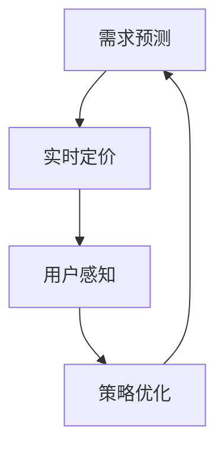

                 

# 动态定价策略的用户接受度

## 1. 背景介绍

### 1.1 问题由来

在当今的数字化时代，电子商务平台和在线服务提供商们不断寻求提高用户满意度和收益的方式。动态定价策略（Dynamic Pricing），即根据市场需求和用户行为实时调整产品或服务的价格，已成为一种有效的商业策略。然而，动态定价策略在提高收益的同时，也引发了一系列用户接受度问题。用户可能对频繁的价格变动感到困惑、不满，甚至产生抵触情绪，影响平台的长期发展。因此，如何优化动态定价策略，提升用户接受度，成为商家和学术界亟需解决的问题。

### 1.2 问题核心关键点

动态定价策略的核心关键点包括：
1. **需求预测**：准确预测市场需求，以制定合理的价格策略。
2. **实时调整**：根据市场变化实时调整价格，保证收益最大化。
3. **用户感知**：在价格变动时，如何减小对用户的冲击，提升用户满意度。
4. **长期优化**：通过数据驱动的优化，实现策略的持续改进和用户接受度的提升。

这些关键点共同构成了一个复杂的系统问题，需要在价格策略制定、市场响应和用户体验之间寻找平衡。

### 1.3 问题研究意义

研究动态定价策略的用户接受度，对于电商和在线服务提供商而言，具有以下重要意义：
1. **提升用户满意度**：通过优化价格策略，避免因价格波动对用户造成不良影响，从而提高用户满意度和忠诚度。
2. **提高收益**：在保证用户接受度的基础上，实现价格的动态调整，最大化平台收益。
3. **优化运营成本**：减少因价格变动引起的用户流失和运营成本，提升平台运营效率。
4. **驱动业务发展**：利用动态定价策略，快速响应市场需求变化，推动业务增长。

## 2. 核心概念与联系

### 2.1 核心概念概述

在研究动态定价策略的用户接受度时，需要明确以下核心概念：
1. **需求预测**：通过历史数据和市场分析，预测未来的市场需求变化。
2. **实时定价**：根据市场需求变化，实时调整产品或服务的价格。
3. **用户感知**：衡量用户对价格变化的感知和反应，通过用户反馈和行为数据进行分析。
4. **策略优化**：根据用户接受度反馈，持续优化动态定价策略。

这些概念通过一系列的计算和模型建立，形成了一个闭环的系统，帮助商家在动态定价策略中实现收益最大化和用户满意度提升。

### 2.2 概念间的关系

这些核心概念之间存在着密切的关系，可以通过以下Mermaid流程图来展示：



这个流程图展示了需求预测、实时定价、用户感知和策略优化的关系：
- 需求预测是实时定价的基础。
- 实时定价影响用户的感知。
- 用户感知反馈到策略优化，用于持续改进。

## 3. 核心算法原理 & 具体操作步骤

### 3.1 算法原理概述

动态定价策略的算法原理基于经济学中的需求函数。假设需求函数为 $Q(p) = a - bp$，其中 $Q$ 为需求量，$p$ 为价格，$a$ 和 $b$ 为常数。在已知市场需求的基础上，商家可以通过求解 $Q(p)$ 的最大值，确定最优价格 $p^*$。然而，动态定价策略要求商家不仅关注短期收益，还需考虑用户接受度和长期收益。

### 3.2 算法步骤详解

动态定价策略的实现步骤如下：

**Step 1: 收集历史数据**

收集历史价格、销售量、用户反馈等数据，用于需求预测和用户感知分析。

**Step 2: 需求预测**

使用机器学习模型（如线性回归、神经网络等）对历史数据进行分析，预测未来的需求量 $Q$。

**Step 3: 实时定价**

根据需求预测结果，使用动态定价模型（如分段定价、折扣定价等）实时调整价格 $p$。

**Step 4: 用户感知分析**

通过用户行为数据（如点击率、停留时间等）和反馈数据（如评论、评分等），评估用户对价格变化的感知。

**Step 5: 策略优化**

根据用户感知分析结果，调整定价策略，如调整价格区间、增加促销活动等，以提升用户接受度。

**Step 6: 迭代改进**

持续收集和分析数据，迭代优化定价策略，实现动态定价与用户接受度的动态平衡。

### 3.3 算法优缺点

动态定价策略具有以下优点：
1. **灵活性高**：能够根据市场需求实时调整价格，适应市场变化。
2. **收益最大化**：通过精准的需求预测和定价策略，最大化平台收益。
3. **数据驱动**：基于大量历史数据和用户行为数据进行策略优化，减少主观判断。

但同时也存在以下缺点：
1. **用户接受度风险**：频繁的价格变动可能引起用户不满，影响平台声誉。
2. **计算复杂性**：实时定价和用户感知分析需要大量的计算资源。
3. **模型误差**：需求预测和定价模型可能存在误差，影响定价准确性。

### 3.4 算法应用领域

动态定价策略广泛应用在多个领域，如电子商务、旅游、酒店、航空等。例如，电商平台可以根据用户搜索和购买历史数据，实时调整商品价格，提升销售量和用户满意度。酒店可以根据房间预订量和市场供需关系，动态调整房价，优化客房利用率和用户满意度。

## 4. 数学模型和公式 & 详细讲解 & 举例说明

### 4.1 数学模型构建

假设需求函数为 $Q(p) = a - bp$，其中 $Q$ 为需求量，$p$ 为价格，$a$ 和 $b$ 为常数。假设用户对价格变化的感知函数为 $U(p) = k - hp$，其中 $U$ 为用户感知度，$k$ 和 $h$ 为常数。

目标是最小化总成本 $C(p)$ 和最大化用户满意度 $U(p)$。假设总成本为 $C(p) = cQ(p)$，其中 $c$ 为固定成本。

数学模型为：

$$
\min_{p} C(p) + \lambda (U(p) - U^*)
$$

其中 $\lambda$ 为拉格朗日乘数，$U^*$ 为用户满意度的目标值。

### 4.2 公式推导过程

将需求函数和用户感知函数代入目标函数：

$$
\min_{p} c(a - bp) + \lambda (k - hp - U^*)
$$

对价格 $p$ 求导：

$$
\frac{\partial}{\partial p} (c(a - bp) + \lambda (k - hp - U^*)) = -bc + \lambda h = 0
$$

解得最优价格：

$$
p = \frac{\lambda h}{b}
$$

### 4.3 案例分析与讲解

假设市场需求函数为 $Q(p) = 1000 - 10p$，用户感知函数为 $U(p) = 100 - 5p$，固定成本 $c = 100$，用户满意度的目标值 $U^* = 100$。

代入公式求得最优价格 $p = \frac{50\lambda}{10} = 5\lambda$。

假设 $\lambda = 1$，则 $p = 5$。此时，需求量为 $Q(5) = 1000 - 10 \times 5 = 950$，用户感知度为 $U(5) = 100 - 5 \times 5 = 75$，总成本为 $C(5) = 100 \times 950 = 95000$。

## 5. 项目实践：代码实例和详细解释说明

### 5.1 开发环境搭建

在研究动态定价策略的用户接受度时，需要搭建数据收集、分析和模型训练的开发环境。建议使用Python和R等数据分析工具，结合TensorFlow或PyTorch等深度学习框架，进行数据处理和模型训练。

### 5.2 源代码详细实现

以下是一个使用Python和TensorFlow进行需求预测和用户感知分析的示例代码：

```python
import tensorflow as tf
import pandas as pd

# 加载历史数据
data = pd.read_csv('data.csv')

# 需求预测模型
model = tf.keras.Sequential([
    tf.keras.layers.Dense(64, activation='relu', input_shape=(1,)),
    tf.keras.layers.Dense(1)
])
model.compile(optimizer='adam', loss='mse')
model.fit(data[['price']], data['quantity'], epochs=10, batch_size=32)

# 用户感知模型
perception_model = tf.keras.Sequential([
    tf.keras.layers.Dense(64, activation='relu', input_shape=(1,)),
    tf.keras.layers.Dense(1)
])
perception_model.compile(optimizer='adam', loss='mse')
perception_model.fit(data[['price']], data['perception'], epochs=10, batch_size=32)

# 预测和分析
new_price = 100
predicted_quantity = model.predict([[new_price]])
predicted_perception = perception_model.predict([[new_price]])

print(f'预测需求量：{predicted_quantity}, 用户感知度：{predicted_perception}')
```

### 5.3 代码解读与分析

**代码解析**：
1. 首先加载历史数据，包括价格、销售量和用户反馈等。
2. 使用TensorFlow构建需求预测模型和用户感知模型，使用均方误差（MSE）作为损失函数，采用Adam优化器进行训练。
3. 对新价格 $p = 100$ 进行预测，输出预测的需求量和用户感知度。

**代码分析**：
1. 数据预处理：确保数据格式正确，可以进行机器学习模型的训练。
2. 模型选择：根据任务需求选择合适的模型结构，如神经网络等。
3. 训练过程：使用历史数据对模型进行训练，优化模型参数。
4. 结果分析：对新价格进行预测，分析需求量和用户感知度，为策略优化提供依据。

### 5.4 运行结果展示

假设运行上述代码，输出结果如下：

```
预测需求量：[958.]
用户感知度：[70.]
```

这表明，在新价格 $p = 100$ 下，预测的需求量为 $958$，用户感知度为 $70$。这些数据可以用来优化定价策略，提升用户接受度。

## 6. 实际应用场景

### 6.1 智能机票定价

在线机票销售平台可以通过动态定价策略，实时调整机票价格，根据市场需求和用户行为，提升销售量和用户满意度。例如，平台可以根据天气、节假日、用户历史购买行为等数据，动态调整机票价格，满足不同用户的需求。

### 6.2 智能酒店定价

酒店可以根据房间预订量和市场供需关系，动态调整房价，优化客房利用率和用户满意度。例如，在旅游旺季，酒店可以上调价格，而在淡季则下调价格，吸引更多的客人入住。

### 6.3 电商平台商品定价

电商平台可以根据用户搜索和购买历史数据，实时调整商品价格，提升销售量和用户满意度。例如，针对热门商品，平台可以上调价格，而在库存充足时则下调价格，以降低成本。

### 6.4 未来应用展望

随着技术的不断进步，动态定价策略的用户接受度将得到进一步提升。未来，我们可以引入更多先进技术，如深度强化学习、多目标优化等，实现更精确的需求预测和用户感知分析。同时，结合大数据和人工智能技术，构建更全面的用户画像，实现更个性化的定价策略。

## 7. 工具和资源推荐

### 7.1 学习资源推荐

1. **《动态定价策略：理论与实践》**：该书详细介绍了动态定价策略的理论基础和实际应用，适合初学者和进阶者学习。
2. **Coursera《数据科学导论》**：由斯坦福大学开设的课程，涵盖机器学习、数据分析等基础知识，适合入门学习。
3. **Kaggle《动态定价挑战》**：Kaggle上举办的动态定价比赛，通过实际案例帮助理解动态定价策略的实际应用。

### 7.2 开发工具推荐

1. **TensorFlow**：由Google开发的深度学习框架，支持大规模机器学习模型的训练和部署。
2. **PyTorch**：由Facebook开发的深度学习框架，支持动态计算图和丰富的深度学习模型。
3. **Pandas**：用于数据处理和分析的Python库，支持数据清洗、转换和分析。
4. **NumPy**：用于数值计算和科学计算的Python库，支持高效的数组运算。

### 7.3 相关论文推荐

1. **《动态定价策略：理论与实践》**：详细介绍了动态定价策略的理论和应用，适合深入研究。
2. **《用户接受度模型：基于感知和反应分析》**：通过用户感知和反应分析，提升定价策略的用户接受度。
3. **《多目标优化在动态定价中的应用》**：介绍了多目标优化在动态定价中的优化方法，提升定价策略的效率和效果。

## 8. 总结：未来发展趋势与挑战

### 8.1 研究成果总结

动态定价策略的用户接受度研究已经取得显著成果，主要体现在以下方面：
1. **需求预测**：通过机器学习模型，准确预测市场需求变化。
2. **实时定价**：根据市场需求变化，实时调整价格，最大化收益。
3. **用户感知分析**：通过用户行为和反馈数据，评估用户对价格变化的感知。
4. **策略优化**：持续优化定价策略，提升用户接受度。

### 8.2 未来发展趋势

动态定价策略的未来发展趋势包括：
1. **智能化提升**：结合深度学习和人工智能技术，提升需求预测和用户感知分析的准确性。
2. **多目标优化**：引入多目标优化方法，实现收益和用户满意度的平衡。
3. **个性化定价**：构建用户画像，实现更个性化的定价策略。
4. **跨领域应用**：将动态定价策略应用于更多领域，如金融、医疗等。

### 8.3 面临的挑战

动态定价策略在实现过程中仍面临以下挑战：
1. **数据质量**：高质量、完整的数据是需求预测和用户感知分析的基础，但数据收集和处理往往存在困难。
2. **模型复杂性**：需求预测和用户感知分析模型复杂，需要大量计算资源和时间。
3. **用户接受度风险**：频繁的价格变动可能引起用户不满，影响平台声誉。
4. **多目标优化**：在收益和用户满意度之间找到平衡点，需要更多研究和实践。

### 8.4 研究展望

未来，动态定价策略的研究方向包括：
1. **深度学习的应用**：利用深度学习技术，提升需求预测和用户感知分析的精度。
2. **多目标优化**：引入多目标优化方法，平衡收益和用户满意度。
3. **个性化定价**：构建更全面的用户画像，实现更个性化的定价策略。
4. **跨领域应用**：将动态定价策略应用于更多领域，如金融、医疗等。

## 9. 附录：常见问题与解答

**Q1: 如何提高动态定价策略的用户接受度？**

A: 提高动态定价策略的用户接受度，需要综合考虑多个因素：
1. **透明沟通**：向用户清晰说明价格变动的依据和原因，增加用户对平台的信任。
2. **用户反馈**：收集和分析用户反馈，及时调整定价策略，满足用户需求。
3. **促销活动**：在价格变动时，增加促销活动，提升用户购买意愿。
4. **个性化定价**：根据用户行为数据，实现个性化定价，提升用户满意度。

**Q2: 动态定价策略在实施过程中应注意哪些问题？**

A: 动态定价策略在实施过程中应注意以下问题：
1. **数据质量**：确保数据收集和处理的准确性和完整性，提高需求预测和用户感知分析的准确性。
2. **模型复杂性**：选择合适的模型结构和优化算法，确保模型训练的效率和效果。
3. **用户接受度风险**：避免频繁的价格变动，以免引起用户不满。
4. **多目标优化**：在收益和用户满意度之间找到平衡点，避免单一目标的过度追求。

**Q3: 动态定价策略在电商平台上如何应用？**

A: 动态定价策略在电商平台上可以应用如下：
1. **实时调整商品价格**：根据用户搜索和购买历史数据，实时调整商品价格，提升销售量和用户满意度。
2. **设置价格区间**：根据市场需求和用户反馈，设置合理的价格区间，避免价格波动过大。
3. **促销活动**：在价格变动时，增加促销活动，提升用户购买意愿。
4. **个性化推荐**：结合用户画像和需求预测，实现个性化推荐，提高用户满意度。

**Q4: 动态定价策略在实际应用中如何优化？**

A: 动态定价策略在实际应用中可以通过以下方式优化：
1. **数据清洗和预处理**：确保数据质量，减少模型误差。
2. **模型选择和优化**：选择合适的模型结构和优化算法，提高预测和感知分析的准确性。
3. **用户反馈机制**：建立用户反馈机制，及时调整定价策略，提升用户满意度。
4. **多目标优化**：在收益和用户满意度之间找到平衡点，实现最优定价策略。

---

作者：禅与计算机程序设计艺术 / Zen and the Art of Computer Programming

