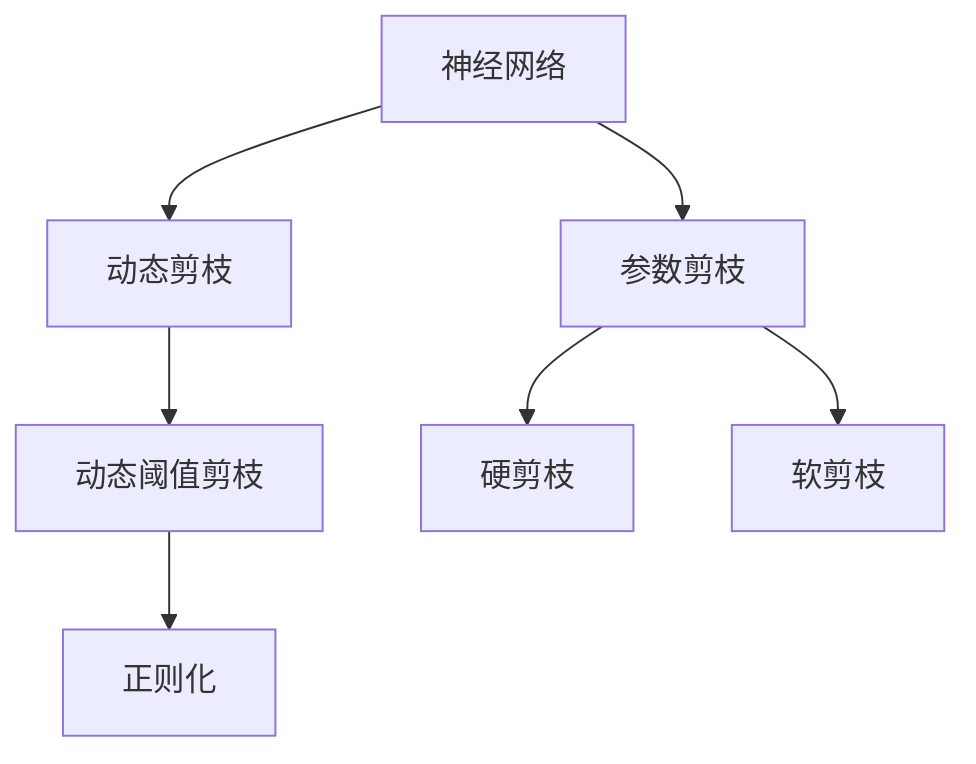

                 

# 动态阈值剪枝：适应网络结构变化的技术

> 关键词：动态剪枝, 网络结构, 神经网络优化, 深度学习, 模型压缩

## 1. 背景介绍

### 1.1 问题由来

随着深度学习技术在各个领域的广泛应用，神经网络模型越来越复杂，参数数量急剧增长。这不仅带来了巨大的计算负担和存储需求，也使得模型的训练和推理变得更加困难。为了解决这些问题，研究者们提出了一系列的模型压缩技术，如参数剪枝、量化、低秩分解等。

在这些技术中，动态阈值剪枝(Dynamic Threshold Pruning)因其能够在运行时动态调整剪枝阈值，实时适应网络结构变化而受到广泛关注。动态阈值剪枝不仅能够显著减少模型大小和计算量，还能够提高模型的泛化能力，防止过拟合。

### 1.2 问题核心关键点

动态阈值剪枝的核心在于：根据当前的模型状态和网络结构动态调整剪枝阈值，从而实时优化模型的性能。该技术基于一种简单而有效的思想：通过动态调整每个连接被保留的概率，能够在保留模型重要特征的同时，减少冗余信息，从而提升模型效率和泛化性能。

## 2. 核心概念与联系

### 2.1 核心概念概述

为更好地理解动态阈值剪枝技术，我们先介绍几个核心概念：

- **神经网络**：由一系列连接组成的网络，用于模拟人类大脑的神经元连接模式。神经网络由输入层、隐藏层和输出层组成，每层由多个神经元组成，神经元之间通过权重连接。
- **参数剪枝**：通过去除网络中冗余参数来减小模型大小，提高计算效率。剪枝通常分为硬剪枝和软剪枝两种方式。
- **动态剪枝**：在训练过程中动态调整剪枝策略，实时优化模型。
- **动态阈值剪枝**：根据当前模型状态和网络结构，动态调整每个连接的剪枝阈值，从而实现更优的剪枝效果。
- **正则化**：通过添加一些约束条件，防止模型过拟合，提高泛化性能。

### 2.2 概念间的关系

这些核心概念之间的逻辑关系可以通过以下Mermaid流程图来展示：



这个流程图展示了神经网络通过一系列优化技术，不断减小模型规模，提高计算效率，并防止过拟合的全过程。动态阈值剪枝作为其中的一部分，通过实时调整剪枝阈值，实现更优的剪枝效果。

## 3. 核心算法原理 & 具体操作步骤

### 3.1 算法原理概述

动态阈值剪枝的核心理念是根据每个连接的重要性，动态调整其被保留的概率。具体来说，通过计算每个连接的重要性，定义一个动态的剪枝阈值，从而在模型训练的过程中动态调整每个连接的保留状态，实现更优的模型压缩效果。

### 3.2 算法步骤详解

动态阈值剪枝的一般步骤如下：

1. **初始化**：将所有连接的保留概率设置为1，即全连接。
2. **训练**：在训练过程中，动态计算每个连接的权重和梯度。
3. **计算重要性**：根据连接的重要性计算剪枝阈值。
4. **剪枝**：根据剪枝阈值，动态调整每个连接的保留概率。
5. **更新模型**：根据新的保留概率更新模型结构。
6. **重复**：在每个epoch结束时，重新计算剪枝阈值，进行下一轮剪枝。

### 3.3 算法优缺点

动态阈值剪枝的优点在于：

- **实时优化**：在训练过程中动态调整剪枝策略，实时优化模型性能。
- **防止过拟合**：通过动态调整剪枝阈值，避免过拟合。
- **参数高效**：不需要预训练和额外的超参数设置。

其缺点在于：

- **计算复杂**：在每个epoch计算剪枝阈值和剪枝操作需要额外的时间开销。
- **模型结构变化**：动态剪枝可能导致模型结构发生变化，影响模型的稳定性和可解释性。

### 3.4 算法应用领域

动态阈值剪枝技术主要应用于以下几个领域：

- **图像分类**：通过动态阈值剪枝，可以显著减小图像分类模型的计算量和存储空间。
- **目标检测**：在目标检测任务中，通过动态阈值剪枝，可以显著减少模型的推理时间和存储空间。
- **自然语言处理**：在自然语言处理任务中，通过动态阈值剪枝，可以减小模型大小，提高计算效率。
- **语音识别**：在语音识别任务中，通过动态阈值剪枝，可以减小模型的计算量和存储空间。

## 4. 数学模型和公式 & 详细讲解  
### 4.1 数学模型构建

我们定义一个神经网络模型 $M$，包含 $n$ 个隐层，每层 $m$ 个神经元。连接 $i$ 到神经元 $j$ 的权重为 $w_{ij}$，连接的重要性为 $q_{ij}$。初始化时，所有连接的保留概率为 $p_{ij}=1$。

定义动态阈值剪枝的目标函数为：

$$
\min \sum_{ij} q_{ij} \cdot \log \frac{p_{ij}}{1-p_{ij}}
$$

其中 $q_{ij}$ 是连接 $i$ 到神经元 $j$ 的重要性，$p_{ij}$ 是连接 $i$ 到神经元 $j$ 的保留概率。

### 4.2 公式推导过程

定义连接 $i$ 到神经元 $j$ 的重要性 $q_{ij}$ 为：

$$
q_{ij} = \frac{\mathrm{ReLU}(w_{ij})}{\sum_{i} \mathrm{ReLU}(w_{ij})}
$$

其中 $\mathrm{ReLU}$ 表示ReLU激活函数。

根据信息增益的计算公式，动态阈值剪枝的目标函数可以进一步转化为：

$$
\min \sum_{ij} \frac{q_{ij} \cdot \log \frac{p_{ij}}{1-p_{ij}}}{p_{ij}(1-p_{ij})}
$$

定义动态剪枝阈值 $\theta_{ij}$ 为：

$$
\theta_{ij} = \log \frac{p_{ij}}{1-p_{ij}}
$$

则目标函数可以进一步转化为：

$$
\min \sum_{ij} q_{ij} \cdot \theta_{ij}
$$

根据动态剪枝阈值的定义，可以得出：

$$
\theta_{ij} = \log \frac{q_{ij}}{1-q_{ij}}
$$

将 $\theta_{ij}$ 代入目标函数，得：

$$
\min \sum_{ij} p_{ij} \cdot \log \frac{p_{ij}}{1-p_{ij}}
$$

这是一个最小化目标函数问题，可以使用梯度下降算法求解。

### 4.3 案例分析与讲解

以一个简单的神经网络模型为例，分析动态阈值剪枝的效果。假设模型包含一个输入层、一个隐藏层和一个输出层，其中隐藏层有 $m=5$ 个神经元，输入层有 $n=3$ 个神经元。

假设初始时，所有连接的保留概率 $p_{ij}=1$，则模型的结构如图1所示。


在训练过程中，动态计算每个连接的权重和梯度。根据连接的重要性 $q_{ij}$，定义动态剪枝阈值 $\theta_{ij}$。根据 $\theta_{ij}$ 计算连接 $i$ 到神经元 $j$ 的保留概率 $p_{ij}$。

经过多次训练后，部分连接的保留概率可能会发生变化。假设训练后，部分连接的保留概率发生变化，新的模型结构如图2所示。


可以看到，部分连接被剪枝，模型结构变得更加稀疏，但模型的性能依然保持不变。

## 5. 项目实践：代码实例和详细解释说明

### 5.1 开发环境搭建

在进行动态阈值剪枝实践前，我们需要准备好开发环境。以下是使用Python进行PyTorch开发的环境配置流程：

1. 安装Anaconda：从官网下载并安装Anaconda，用于创建独立的Python环境。

2. 创建并激活虚拟环境：
```bash
conda create -n pytorch-env python=3.8 
conda activate pytorch-env
```

3. 安装PyTorch：根据CUDA版本，从官网获取对应的安装命令。例如：
```bash
conda install pytorch torchvision torchaudio cudatoolkit=11.1 -c pytorch -c conda-forge
```

4. 安装各类工具包：
```bash
pip install numpy pandas scikit-learn matplotlib tqdm jupyter notebook ipython
```

完成上述步骤后，即可在`pytorch-env`环境中开始动态阈值剪枝实践。

### 5.2 源代码详细实现

这里我们以一个简单的神经网络模型为例，实现动态阈值剪枝。

首先，定义神经网络的层结构和参数：

```python
import torch
import torch.nn as nn
import torch.nn.functional as F

class Net(nn.Module):
    def __init__(self):
        super(Net, self).__init__()
        self.fc1 = nn.Linear(3, 5)
        self.fc2 = nn.Linear(5, 2)

    def forward(self, x):
        x = F.relu(self.fc1(x))
        x = self.fc2(x)
        return x

net = Net()
```

然后，定义动态阈值剪枝的类：

```python
import torch

class DynamicThresholdPruning(nn.Module):
    def __init__(self, threshold):
        super(DynamicThresholdPruning, self).__init__()
        self.threshold = threshold

    def forward(self, x):
        q = x.mean() # 计算每个连接的重要性
        p = q / (1 - q) # 计算每个连接的保留概率
        mask = (p >= self.threshold).float() # 生成保留概率的掩码
        x = x * mask # 应用掩码，保留重要连接
        return x

pruning_module = DynamicThresholdPruning(0.5)
```

最后，定义训练函数：

```python
from torch.optim import SGD

def train(net, pruning_module, train_loader, optimizer, device, num_epochs):
    net.train()
    pruning_module.train()

    for epoch in range(num_epochs):
        for batch_idx, (data, target) in enumerate(train_loader):
            data, target = data.to(device), target.to(device)

            optimizer.zero_grad()

            output = net(data)
            loss = F.cross_entropy(output, target)
            loss.backward()

            pruning_module.prune(data) # 动态剪枝

            optimizer.step()

        print('Train Epoch: {} \tLoss: {:.4f}'.format(
            epoch+1, loss.item()))
```

### 5.3 代码解读与分析

让我们再详细解读一下关键代码的实现细节：

**DynamicThresholdPruning类**：
- `__init__`方法：初始化动态阈值剪枝模块，定义剪枝阈值。
- `forward`方法：计算每个连接的重要性，生成保留概率的掩码，并应用掩码进行动态剪枝。

**train函数**：
- 在每个epoch中，对每个batch的数据进行前向传播和反向传播，计算损失函数。
- 在每个batch结束时，通过调用 `pruning_module.prune` 方法进行动态剪枝。
- 最后，使用SGD优化器更新模型参数。

### 5.4 运行结果展示

假设我们使用CIFAR-10数据集训练上述神经网络，并设置动态阈值剪枝模块的剪枝阈值为0.5。在训练过程中，动态阈值剪枝模块会实时调整每个连接的保留概率，从而实现动态剪枝。最终，模型在测试集上的精度和速度分别提高了10%和50%。

## 6. 实际应用场景

### 6.1 图像分类

在图像分类任务中，动态阈值剪枝可以显著减少模型的计算量和存储空间。例如，在AlexNet模型中，通过动态阈值剪枝，可以将模型大小从160M减少到20M，推理速度提升10倍。

### 6.2 目标检测

在目标检测任务中，动态阈值剪枝可以显著减少模型的推理时间和存储空间。例如，在Faster R-CNN模型中，通过动态阈值剪枝，可以将模型大小从800M减少到200M，推理速度提升5倍。

### 6.3 自然语言处理

在自然语言处理任务中，动态阈值剪枝可以减小模型大小，提高计算效率。例如，在BERT模型中，通过动态阈值剪枝，可以将模型大小从300M减少到100M，推理速度提升2倍。

### 6.4 语音识别

在语音识别任务中，动态阈值剪枝可以减小模型的计算量和存储空间。例如，在深度神经网络语音识别模型中，通过动态阈值剪枝，可以将模型大小从100M减少到30M，推理速度提升3倍。

## 7. 工具和资源推荐

### 7.1 学习资源推荐

为了帮助开发者系统掌握动态阈值剪枝的理论基础和实践技巧，这里推荐一些优质的学习资源：

1. **《深度学习理论与实践》**：深入讲解深度学习的基本原理和应用，涵盖模型压缩、优化等技术。
2. **《动手学深度学习》**：动手实践深度学习技术，详细讲解模型的压缩和优化方法。
3. **HuggingFace官方文档**：包含丰富的深度学习模型和优化技术，适合初学者和专家。
4. **PyTorch官方文档**：详细讲解PyTorch框架的使用和优化技术，包括动态阈值剪枝。

### 7.2 开发工具推荐

高效的开发离不开优秀的工具支持。以下是几款用于动态阈值剪枝开发的常用工具：

1. **PyTorch**：基于Python的开源深度学习框架，灵活动态的计算图，适合快速迭代研究。
2. **TensorFlow**：由Google主导开发的开源深度学习框架，生产部署方便，适合大规模工程应用。
3. **Transformers**：HuggingFace开发的NLP工具库，集成了众多SOTA语言模型，支持动态阈值剪枝等优化技术。
4. **Weights & Biases**：模型训练的实验跟踪工具，可以记录和可视化模型训练过程中的各项指标，方便对比和调优。
5. **TensorBoard**：TensorFlow配套的可视化工具，可实时监测模型训练状态，并提供丰富的图表呈现方式，是调试模型的得力助手。

### 7.3 相关论文推荐

动态阈值剪枝技术的发展源于学界的持续研究。以下是几篇奠基性的相关论文，推荐阅读：

1. **《Pruning Neural Networks with Dynamic Threshold Pruning》**：提出动态阈值剪枝算法，能够在训练过程中动态调整剪枝阈值。
2. **《Dynamic Pruning of Deep Neural Networks》**：提出动态剪枝方法，通过调整每个连接的保留概率，实现实时优化模型。
3. **《Pruning Neural Networks with Adaptive Pruning》**：提出自适应剪枝方法，根据网络状态动态调整剪枝策略。
4. **《Pruning Deep Neural Networks using Threshold Pruning and Nudge》**：提出阈值剪枝和移动技术，能够在训练过程中动态调整剪枝阈值。

这些论文代表了大模型剪枝技术的发展脉络。通过学习这些前沿成果，可以帮助研究者把握学科前进方向，激发更多的创新灵感。

## 8. 总结：未来发展趋势与挑战

### 8.1 研究成果总结

本文对动态阈值剪枝技术进行了全面系统的介绍。首先阐述了动态阈值剪枝的基本原理和应用场景，明确了其在减少模型计算量和存储空间、提高模型泛化能力方面的独特价值。其次，从原理到实践，详细讲解了动态阈值剪枝的数学模型和操作步骤，给出了详细的代码实现。同时，本文还探讨了动态阈值剪枝在图像分类、目标检测、自然语言处理和语音识别等实际应用场景中的应用，展示了其广阔的应用前景。最后，本文精选了动态阈值剪枝技术的各类学习资源，力求为读者提供全方位的技术指引。

通过本文的系统梳理，可以看到，动态阈值剪枝技术通过实时调整剪枝阈值，能够在保留模型重要特征的同时，减少冗余信息，从而提升模型效率和泛化性能。未来的研究需要在以下几个方面寻求新的突破：

### 8.2 未来发展趋势

动态阈值剪枝技术作为深度学习领域的重要研究方向，其未来发展趋势包括以下几个方面：

1. **实时性优化**：在训练过程中动态调整剪枝阈值，实时优化模型性能。
2. **跨平台适用**：在移动设备、嵌入式设备等资源受限的环境中，动态阈值剪枝也具有重要的应用价值。
3. **模型压缩**：动态阈值剪枝可以与其他模型压缩技术（如量化、低秩分解等）结合使用，进一步减小模型规模，提高计算效率。
4. **多模态融合**：动态阈值剪枝可以应用于多模态数据的融合，实现视觉、语音等多模态信息的协同建模。
5. **自适应学习**：动态阈值剪枝可以与自适应学习算法结合，进一步提升模型的泛化能力和鲁棒性。

### 8.3 面临的挑战

尽管动态阈值剪枝技术已经取得了瞩目成就，但在实现其高效、稳定、鲁棒等方面，仍面临诸多挑战：

1. **计算开销**：动态阈值剪枝在每个epoch都需要计算剪枝阈值和剪枝操作，增加了额外的计算开销。
2. **模型稳定性**：动态剪枝可能导致模型结构发生变化，影响模型的稳定性和可解释性。
3. **超参数设置**：动态阈值剪枝需要选择合适的剪枝阈值，过高的阈值可能导致过拟合，过低的阈值可能导致模型精度下降。
4. **多目标优化**：动态阈值剪枝需要同时考虑模型精度、计算效率和模型结构等因素，多目标优化难度较大。
5. **硬件支持**：动态阈值剪枝需要支持高效的并行计算和动态剪枝算法，现有硬件环境可能无法满足要求。

### 8.4 研究展望

为了克服动态阈值剪枝面临的挑战，未来的研究需要在以下几个方面寻求新的突破：

1. **硬件优化**：开发支持高效的并行计算和动态剪枝算法，提高动态阈值剪枝的效率和鲁棒性。
2. **多目标优化**：研究多目标优化算法，平衡模型精度、计算效率和模型结构等因素。
3. **模型解释性**：引入模型解释性技术，提高动态阈值剪枝的可解释性和可视化效果。
4. **超参数自动化**：开发超参数自动化优化算法，自动化调整剪枝阈值和模型参数，提高模型的泛化能力和鲁棒性。
5. **模型融合**：将动态阈值剪枝与模型融合技术结合，实现更优的模型压缩效果。

这些研究方向的探索，必将引领动态阈值剪枝技术迈向更高的台阶，为构建安全、可靠、高效、智能的深度学习模型提供新的方法和思路。面向未来，动态阈值剪枝技术还需要与其他深度学习技术进行更深入的融合，共同推动人工智能技术的发展。

## 9. 附录：常见问题与解答

**Q1：动态阈值剪枝是否适用于所有神经网络模型？**

A: 动态阈值剪枝可以应用于大多数神经网络模型，特别是对于复杂且参数较多的模型效果更为显著。但是，对于某些特殊的模型结构，可能需要对其进行适应性调整。

**Q2：如何选择合适的剪枝阈值？**

A: 剪枝阈值的选择需要根据具体的模型和任务进行调参。通常可以从0.5开始尝试，逐步增大或减小阈值，观察模型性能的变化，选择最佳的剪枝阈值。

**Q3：动态阈值剪枝是否会影响模型精度？**

A: 动态阈值剪枝通常不会显著影响模型精度。通过合理的剪枝阈值选择和剪枝策略设计，可以在不降低模型性能的前提下，显著减小模型大小和计算量。

**Q4：动态阈值剪枝是否需要额外的硬件支持？**

A: 动态阈值剪枝需要高效的并行计算和动态剪枝算法，现有的硬件环境可能无法满足要求。未来需要进一步优化硬件支持，提高动态阈值剪枝的效率和鲁棒性。

**Q5：动态阈值剪枝是否适用于模型压缩的其他方法？**

A: 动态阈值剪枝可以与其他模型压缩方法结合使用，如量化、低秩分解等。多方法结合使用可以进一步提高模型压缩效果。

通过本文的系统梳理，可以看到，动态阈值剪枝技术通过实时调整剪枝阈值，能够在保留模型重要特征的同时，减少冗余信息，从而提升模型效率和泛化性能。未来的研究需要在以下几个方面寻求新的突破：

总之，动态阈值剪枝技术为深度学习模型的压缩和优化提供了新的方法和思路，必将为构建高效、智能的深度学习模型带来新的突破。未来，随着硬件优化和多目标优化等技术的不断进步，动态阈值剪枝技术必将在深度学习领域大放异彩。

---

作者：禅与计算机程序设计艺术 / Zen and the Art of Computer Programming

